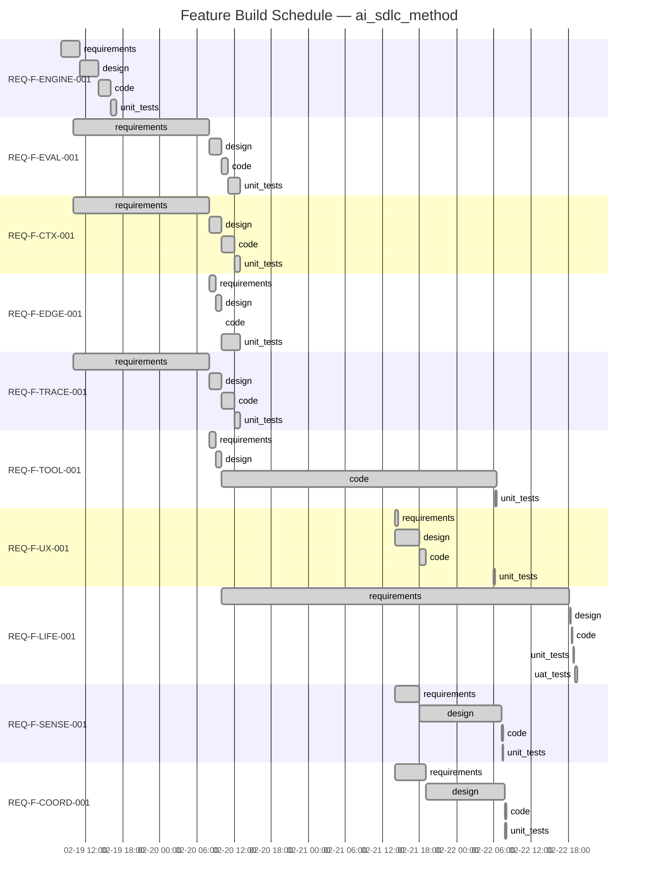

# Project Status — ai_sdlc_method (v2.9.0 — Phase 2a Complete)

Generated: 2026-02-22T19:30:00Z

## State: ALL_CONVERGED

All 10 features converged. Phase 1a + Phase 2a (observer agents) complete.
58 requirements, 502 tests (326 BDD/TDD + 132 observer BDD + 44 UAT integration).

## Feature Build Schedule



## You Are Here

```
REQ-F-ENGINE-001  intent ✓ → req ✓ → design ✓ → code ✓ → tests ✓
REQ-F-EVAL-001    intent ✓ → req ✓ → design ✓ → code ✓ → tests ✓
REQ-F-CTX-001     intent ✓ → req ✓ → design ✓ → code ✓ → tests ✓
REQ-F-EDGE-001    intent ✓ → req ✓ → design ✓ → code ✓ → tests ✓
REQ-F-TRACE-001   intent ✓ → req ✓ → design ✓ → code ✓ → tests ✓
REQ-F-TOOL-001    intent ✓ → req ✓ → design ✓ → code ✓ → tests ✓
REQ-F-UX-001      intent ✓ → req ✓ → design ✓ → code ✓ → tests ✓
REQ-F-LIFE-001    intent ✓ → req ✓ → design ✓ → code ✓ → tests ✓ → uat ✓
REQ-F-SENSE-001   intent ✓ → req ✓ → design ✓ → code ✓ → tests ✓
REQ-F-COORD-001   intent ✓ → req ✓ → design ✓ → code ✓ → tests ✓
```

## Phase Completion Summary

| Phase | Converged | In Progress | Pending | Blocked |
|-------|-----------|-------------|---------|---------|
| requirements | 10 | 0 | 0 | 0 |
| design | 10 | 0 | 0 | 0 |
| code | 10 | 0 | 0 | 0 |
| unit_tests | 10 | 0 | 0 | 0 |
| uat_tests | 1 | 0 | 0 | 0 |
| **Total** | **41** | **0** | **0** | **0** |

## Converged Features

| Feature | Title | Edges | Tests |
|---------|-------|-------|-------|
| REQ-F-ENGINE-001 | Asset Graph Engine | 4/4 | 142 (base) |
| REQ-F-EVAL-001 | Evaluator Framework | 4/4 | (shared) |
| REQ-F-CTX-001 | Context Management | 4/4 | (shared) |
| REQ-F-EDGE-001 | Edge Parameterisations | 4/4 | (shared) |
| REQ-F-TRACE-001 | Feature Vector Traceability | 4/4 | (shared) |
| REQ-F-TOOL-001 | Developer Tooling | 4/4 | 21 |
| REQ-F-UX-001 | Two-Command UX Layer | 4/4 | 29 |
| REQ-F-LIFE-001 | Full Lifecycle Closure | 5/5 | 26 BDD + 44 UAT |
| REQ-F-SENSE-001 | Sensory Systems | 4/4 | 23 |
| REQ-F-COORD-001 | Multi-Agent Coordination | 4/4 | 24 |

## Phase 2a: Observer Agents (completed 2026-02-22)

| Change | Impact |
|--------|--------|
| REQ-LIFE-010, 011, 012 added | 3 observer agents (dev, CI/CD, ops) close the abiogenesis loop |
| Requirement count: 55 → 58 | Spec v3.8.0, features v1.7.0 |
| Design §1.11 + ADR-014 | Observer architecture, markdown agent delivery |
| 3 agent specs created | aisdlc-dev-observer.md, aisdlc-cicd-observer.md, aisdlc-ops-observer.md |
| 26 BDD tests added | Observer agent methodology validation |
| 44 UAT integration tests added | End-to-end traceability, event log integrity, loop closure |
| Test count: 432 → 502 | +26 BDD + 44 UAT |

## Next Actions

1. **/aisdlc-release --version "2.10.0"** — Cut release with Phase 2a observer agents
2. **/aisdlc-spawn --type feature** — Phase 2b: production lifecycle (CI/CD, telemetry, homeostasis)
3. **Continue Gemini/Codex implementations** (separate tenants)

---

## Process Telemetry

### Convergence Pattern
- **Phase 1a**: 8/10 features converged all edges in 1 iteration. REQ-F-ENGINE-001 took 2 on design, REQ-F-LIFE-001 took 2 on design.
- **Phase 2a**: REQ-F-LIFE-001 re-iterated all 5 edges (requirements through UAT). Requirements converged in 2, design in 3, code in 2, unit_tests in 2, uat_tests in 2. UAT had 3 test failures on iteration 1 (legacy event types, schema evolution, config naming) — all fixed in iteration 2.
- **Test growth**: 326 → 432 → 458 → 502 across three phases.

### Traceability Coverage
- **REQ keys defined**: 58 (v3.8.0)
- **REQ keys in feature vectors**: 58/58 (FEATURE_VECTORS.md v1.7.0)
- **Tests**: 502 passing across 4 test files (config, BDD, spec, UAT)
- **Config files**: 17 YAMLs + 3 observer agent markdown specs

### Constraint Surface Observations
- No project_constraints.yml — constraints resolved at spec level (self-hosting)
- Skipped evaluators: 4 per edge (coverage, lint, format, type-check) — Phase 2b scope
- UAT tests validate cross-artifact consistency that unit tests cannot

## Self-Reflection — Feedback → New Intent

| Signal | Observation | Recommended Action |
|--------|-------------|-------------------|
| TELEM-003 | Claude's implementation IS the markdown specs — Claude reads and executes them. | Resolved. Phase 1a is the complete Claude implementation. |
| TELEM-020 | All features converge in 1-3 iterations at code↔unit_tests. | Expected — configs + specs, not runtime code. Phase 2b will have higher iteration counts. |
| TELEM-021 | UAT tests found 3 schema evolution issues (legacy event types, old field names, config naming). | Schema evolution should be tracked — consider a schema version field in events. |
| TELEM-022 | Observer agents close the right side of the abiogenesis loop (workspace→intent, build→intent, runtime→intent). | Loop is structurally closed. Functional validation requires Phase 2b (real CI/CD, real telemetry). |
| TELEM-023 | UAT test_abiogenesis_loop validates loop closure statically. | Dynamic loop closure (observer actually emitting intents that spawn features) is Phase 2b scope. |
