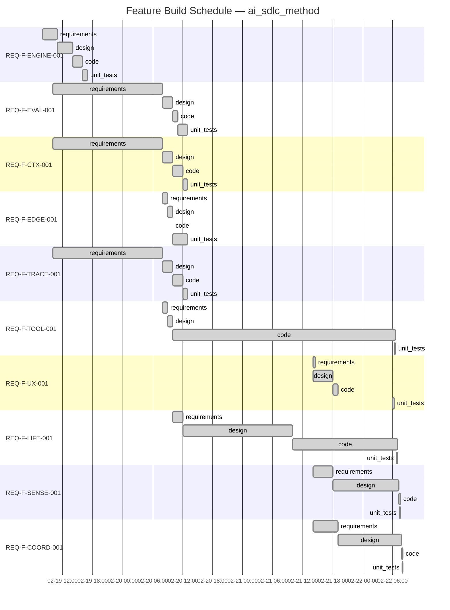

# Project Status — ai_sdlc_method (v2.8.0 — Post-Release)

Generated: 2026-02-22T12:00:00Z

## State: ALL_CONVERGED (with post-release delta)

All 10 features converged across 40 edges. Phase 1a complete.
Post-release spec changes: gradient unification, REQ-LIFE-009 added (54 → 55 requirements).

## Feature Build Schedule



## You Are Here

```
REQ-F-ENGINE-001  intent ✓ → req ✓ → design ✓ → code ✓ → tests ✓
REQ-F-EVAL-001    intent ✓ → req ✓ → design ✓ → code ✓ → tests ✓
REQ-F-CTX-001     intent ✓ → req ✓ → design ✓ → code ✓ → tests ✓
REQ-F-EDGE-001    intent ✓ → req ✓ → design ✓ → code ✓ → tests ✓
REQ-F-TRACE-001   intent ✓ → req ✓ → design ✓ → code ✓ → tests ✓
REQ-F-TOOL-001    intent ✓ → req ✓ → design ✓ → code ✓ → tests ✓
REQ-F-UX-001      intent ✓ → req ✓ → design ✓ → code ✓ → tests ✓
REQ-F-LIFE-001    intent ✓ → req ✓ → design ✓ → code ✓ → tests ✓
REQ-F-SENSE-001   intent ✓ → req ✓ → design ✓ → code ✓ → tests ✓
REQ-F-COORD-001   intent ✓ → req ✓ → design ✓ → code ✓ → tests ✓
```

## Phase Completion Summary

| Phase | Converged | In Progress | Pending | Blocked |
|-------|-----------|-------------|---------|---------|
| requirements | 10 | 0 | 0 | 0 |
| design | 10 | 0 | 0 | 0 |
| code | 10 | 0 | 0 | 0 |
| unit_tests | 10 | 0 | 0 | 0 |
| **Total** | **40** | **0** | **0** | **0** |

## Converged Features

| Feature | Title | Edges | Tests |
|---------|-------|-------|-------|
| REQ-F-ENGINE-001 | Asset Graph Engine | 4/4 | 142 (base) |
| REQ-F-EVAL-001 | Evaluator Framework | 4/4 | (shared) |
| REQ-F-CTX-001 | Context Management | 4/4 | (shared) |
| REQ-F-EDGE-001 | Edge Parameterisations | 4/4 | (shared) |
| REQ-F-TRACE-001 | Feature Vector Traceability | 4/4 | (shared) |
| REQ-F-TOOL-001 | Developer Tooling | 4/4 | 21 |
| REQ-F-UX-001 | Two-Command UX Layer | 4/4 | 29 |
| REQ-F-LIFE-001 | Full Lifecycle Closure | 4/4 | 15 |
| REQ-F-SENSE-001 | Sensory Systems | 4/4 | 23 |
| REQ-F-COORD-001 | Multi-Agent Coordination | 4/4 | 24 |

## Post-Release Delta (since v2.8.0)

| Change | Impact |
|--------|--------|
| §7 refactored: gradient unification | Homeostasis + consciousness → single `delta(state, constraints) → work` at every scale |
| REQ-LIFE-009 added | Spec Review as Gradient Check — stateless `delta(workspace, spec) → intents` |
| Requirement count: 54 → 55 | Spec v2.7.0, reqs v3.7.0, features v1.6.0 |
| INTENT.md updated | Counts, versions, terminology aligned |
| Design doc updated | §1.7 renamed, feature vector count 8→10 |
| README links fixed | 3 broken relative paths corrected |
| 5 tests updated | Count assertions 54→55, terminology alignment |
| Codex review findings addressed | All High/Low fixed, Medium tenant-context deferred (correct as-is) |
| REQ-F-LIFE-001.yml | **Not yet updated** — missing REQ-LIFE-009 in requirements list |

## Next Actions

1. **Update REQ-F-LIFE-001.yml** — add REQ-LIFE-009 to requirements list
2. **/aisdlc-gaps** — re-validate traceability at 55 requirements
3. **/aisdlc-release v2.9.0** — gradient unification + REQ-LIFE-009 + Codex review fixes
4. **Phase 1b planning** — LLM integration for executable iterate() (TELEM-003)

---

## Process Telemetry

### Convergence Pattern
- **1-iteration convergence**: 8/10 features converged all edges in 1 iteration. REQ-F-ENGINE-001 took 2 iterations on design (human approval gate). REQ-F-LIFE-001 took 2 iterations on design (ADR coverage). Expected for Phase 1a.
- **Evaluator pass/skip/fail**: 10/14 evaluators pass per edge, 4 skipped (coverage, lint, format, type-check — no executable code at Phase 1a). 0 failures across all converged edges.
- **Rapid convergence (2026-02-22)**: 5 features converged code↔unit_tests in one session. Test growth: 326 → 432 (+106 tests).

### Traceability Coverage
- **REQ keys defined**: 55 (v3.7.0)
- **REQ keys in feature vectors**: 55/55 (FEATURE_VECTORS.md v1.6.0)
- **REQ keys in workspace vectors**: 54/55 (REQ-F-LIFE-001.yml missing REQ-LIFE-009)
- **Tests**: 432 passing across 3 test files
- **Config files**: 17 YAMLs (graph_topology, evaluator_defaults, 9 edge_params, 6 profiles, sensory_monitors, affect_triage, agent_roles)

### Constraint Surface Observations
- No project_constraints.yml — constraints resolved at spec level (self-hosting)
- Skipped evaluators: 4 per edge (coverage, lint, format, type-check) — Phase 1b scope
- Tenant context: `.ai-workspace/{impl}/context/` pattern established, root fallback documented

## Self-Reflection — Feedback → New Intent

| Signal | Observation | Recommended Action |
|--------|-------------|-------------------|
| TELEM-003 | Commands are markdown specs, not executable agents | Plan Phase 1b: LLM integration for iterate() |
| TELEM-017 | REQ-LIFE-009 added post-v2.8.0. Feature vector file not updated. | Update REQ-F-LIFE-001.yml, re-run gaps, cut v2.9.0 |
| TELEM-018 | Gradient unification refactored §7 (6 sections reorganised). ADR-011/012/013 reference old §7.x numbers. | ADRs are historical — no update needed. Document in release notes. |
| TELEM-019 | Codex review surfaced 5 findings (1 high, 2 medium, 2 low). All actionable items fixed. | Cross-implementation review is valuable — formalise as evaluator. |
| TELEM-020 | All features converge in 1 iteration at code↔unit_tests. | Expected for Phase 1a. Phase 1b will need tighter evaluators. |
