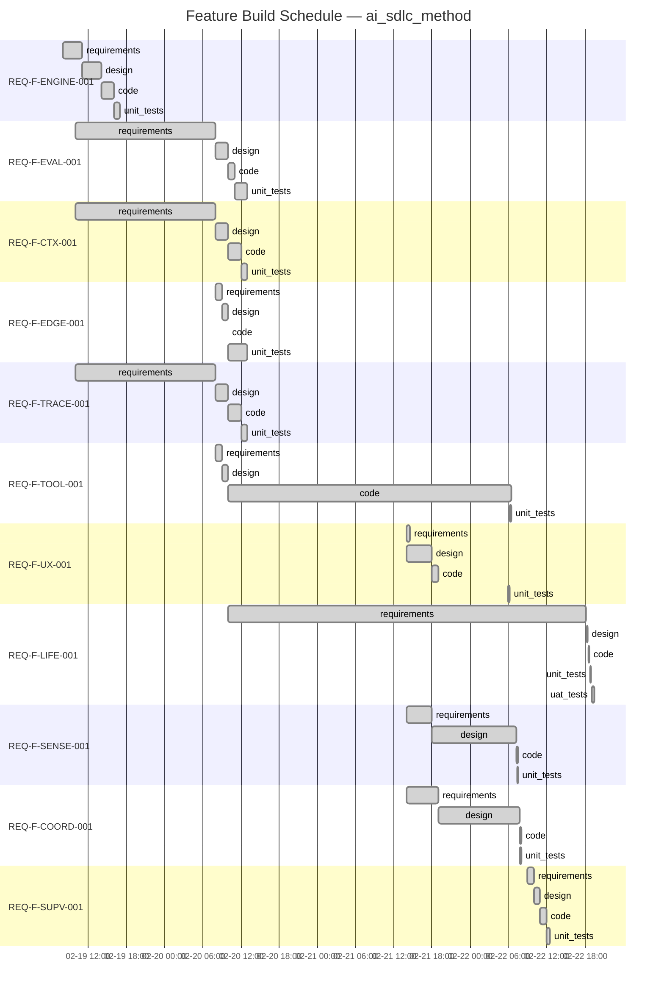

# Project Status — ai_sdlc_method (v3.0.0-beta.1)

Generated: 2026-02-22T22:00:00Z

## State: ALL_CONVERGED

All 11 features converged. Phase 1a + Phase 2a (observer agents) + Phase 2b (functor encoding) complete.
63 requirements, 511 tests (config validation + BDD + spec validation + UAT integration).

  Start would: no unconverged features — next action is functor execution model implementation (post ADR-017)

## You Are Here

```
REQ-F-ENGINE-001  intent ✓ → req ✓ → design ✓ → code ✓ → tests ✓
REQ-F-EVAL-001    intent ✓ → req ✓ → design ✓ → code ✓ → tests ✓
REQ-F-CTX-001     intent ✓ → req ✓ → design ✓ → code ✓ → tests ✓
REQ-F-EDGE-001    intent ✓ → req ✓ → design ✓ → code ✓ → tests ✓
REQ-F-TRACE-001   intent ✓ → req ✓ → design ✓ → code ✓ → tests ✓
REQ-F-TOOL-001    intent ✓ → req ✓ → design ✓ → code ✓ → tests ✓
REQ-F-UX-001      intent ✓ → req ✓ → design ✓ → code ✓ → tests ✓
REQ-F-LIFE-001    intent ✓ → req ✓ → design ✓ → code ✓ → tests ✓ → uat ✓
REQ-F-SENSE-001   intent ✓ → req ✓ → design ✓ → code ✓ → tests ✓
REQ-F-COORD-001   intent ✓ → req ✓ → design ✓ → code ✓ → tests ✓
REQ-F-SUPV-001    intent ✓ → req ✓ → design ✓ → code ✓ → tests ✓
```

## Project Rollup

```
Edges converged:  45/45 (100%)
Features:         11 converged, 0 in-progress, 0 blocked, 0 stuck
Signals:          1 unactioned (INT-GAP-001: REQ-LIFE-009 gap — low severity)
Functor:          standard/interactive/medium — 0 feature overrides, 0 η
```

## Feature Build Schedule



## Phase Completion Summary

| Phase | Converged | In Progress | Pending | Blocked |
|-------|-----------|-------------|---------|---------|
| requirements | 11 | 0 | 0 | 0 |
| design | 11 | 0 | 0 | 0 |
| code | 11 | 0 | 0 | 0 |
| unit_tests | 11 | 0 | 0 | 0 |
| uat_tests | 1 | 0 | 0 | 0 |
| **Total** | **45** | **0** | **0** | **0** |

## Converged Features

| Feature | Title | Impl Reqs | Edges | Profile | Tests |
|---------|-------|-----------|-------|---------|-------|
| REQ-F-ENGINE-001 | Asset Graph Engine | 6 | 4/4 | standard | 139 (config) |
| REQ-F-EVAL-001 | Evaluator Framework | 3 | 4/4 | standard | (shared) |
| REQ-F-CTX-001 | Context Management | 3 | 4/4 | standard | (shared) |
| REQ-F-TRACE-001 | Feature Vector Traceability | 5 | 4/4 | standard | (shared) |
| REQ-F-EDGE-001 | Edge Parameterisations | 4 | 4/4 | standard | (shared) |
| REQ-F-TOOL-001 | Developer Tooling | 10 | 4/4 | standard | 21 |
| REQ-F-UX-001 | User Experience (Two-Command UX) | 7 | 4/4 | full | 29 |
| REQ-F-LIFE-001 | Full Lifecycle Closure | 13 | 5/5 | full | 26 BDD + 44 UAT |
| REQ-F-SENSE-001 | Sensory Systems | 5 | 4/4 | full | 23 |
| REQ-F-COORD-001 | Multi-Agent Coordination | 5 | 4/4 | full | 24 |
| REQ-F-SUPV-001 | IntentEngine Formalization | 2 | 4/4 | full | (shared) |

## Signals

| Signal | Status | Severity | Description |
|--------|--------|----------|-------------|
| INT-GAP-001 | unactioned | low | REQ-LIFE-009 (Spec Review as Gradient Check) has no code and no tests |

## Recent Changes (since last STATUS.md)

| Date | Change | Impact |
|------|--------|--------|
| 2026-02-22 | ADR-017: Functor-Based Execution Model | Resolves actor model review gate |
| 2026-02-22 | REQ-F-SUPV-001 added (IntentEngine Formalization) | 11th feature vector, 2 reqs |
| 2026-02-22 | REQ-ITER-003: Functor Encoding Tracking | 63rd requirement (was 62) |
| 2026-02-22 | Functor encoding in profiles, edge params, feature vector template | 107 functional_unit annotations, 6 profile encodings |
| 2026-02-22 | encoding_escalated event type (20th) | Event sourcing expanded |
| 2026-02-22 | --functor view in /aisdlc-status | Functor registry visibility |
| 2026-02-22 | 9 new TestFunctorEncoding tests | 502 → 511 tests |

## Next Actions

1. **Functor execution model implementation** — mode/valence config, affect schema, escalation tests (post ADR-017)
2. **Action INT-GAP-001** — decide whether REQ-LIFE-009 needs code/tests or is covered by existing spec review
3. **Multi-tenant implementations** — Gemini Genesis (design complete), Codex Genesis (design complete)
4. **Phase 2b: Production lifecycle** — CI/CD edges, telemetry, homeostasis

---

## Process Telemetry

### Convergence Pattern
- **All features**: 11/11 converged with 1-3 iterations per edge. No stuck deltas, no time-box expirations.
- **REQ-F-LIFE-001** was the only feature re-iterated (Phase 2a observer agents): requirements iter 2, design iter 3, code iter 2, unit_tests iter 2, uat_tests iter 2. UAT had 3 failures on iter 1 (legacy event types, schema evolution, config naming) — all fixed in iter 2.
- **Anomaly**: Most features converged in 1 iteration per edge. This is expected — configs and specs, not runtime code. Phase 2b will have higher iteration counts.
- **Skipped deterministic checks**: 4 per edge (coverage, lint, format, type-check) — Phase 1a has no executable runtime code; deterministic tools have nothing to run against. These activate in Phase 2b.

### Traceability Coverage
- **REQ keys defined**: 63 (v3.11.0) — was 62 before functor tracking
- **REQ keys in feature vectors**: 63/63 (FEATURE_VECTORS.md v1.8.0)
- **Tests**: 511 passing across 3 test files (config validation: 139, BDD methodology: 235, spec validation: 137)
- **Config files**: 10 edge params, 6 profiles, 1 graph topology, 1 evaluator defaults, 1 feature vector template — all with functional_unit annotations

### Constraint Surface Observations
- **No project_constraints.yml** — constraints resolved at spec level (self-hosting project)
- **Skipped evaluators**: 4 per edge (coverage, lint, format, type-check) — Phase 1a scope
- **Functor encoding**: All 6 profiles now declare encoding sections; 0 feature-level overrides active
- **Category-fixed units enforced**: emit=F_D, decide=F_H in all profiles (validated by TestFunctorEncoding)

### Event Log
- **75 events** in events.jsonl (4 days, 2026-02-19 to 2026-02-22)
- Event types used: intent_raised (2), spec_modified (9), edge_converged (20), iteration_completed (13), feature_spawned (7), evaluator_ran (3), finding_raised (1), telemetry_signal_emitted (4), gaps_validated (2), release_created (2), edge_started (5)
- **Missing event type**: encoding_escalated — no escalations yet (expected: will fire when functor execution model goes live)

## Self-Reflection — Feedback → New Intent

| Signal | Observation | Recommended Action |
|--------|-------------|-------------------|
| TELEM-003 | Claude's implementation IS the markdown specs — Claude reads and executes them | Resolved. Phase 1a is the complete Claude implementation. |
| TELEM-020 | All features converge in 1-3 iterations at code↔unit_tests | Expected — configs + specs, not runtime code. Phase 2b will have higher iteration counts. |
| TELEM-021 | UAT tests found 3 schema evolution issues (legacy event types, old field names, config naming) | Schema evolution should be tracked — consider a schema version field in events. |
| TELEM-022 | Observer agents close the right side of the abiogenesis loop | Loop is structurally closed. Functional validation requires Phase 2b. |
| TELEM-024 | Functor encoding added to profiles but feature vectors don't have functor sections yet | Feature vectors need regeneration from template when next iteration runs. Template has functor; existing vectors predate it. |
| TELEM-025 | 75 events over 4 days, 0 encoding_escalated events | No η has fired — expected since no live functor dispatch exists yet. First escalation will be the canary for the execution model. |
| TELEM-026 | INT-GAP-001 (REQ-LIFE-009 gap) still unactioned after 10+ hours | Low severity, but stale signals erode trust in the consciousness loop. Decide: action, defer, or dismiss. |
