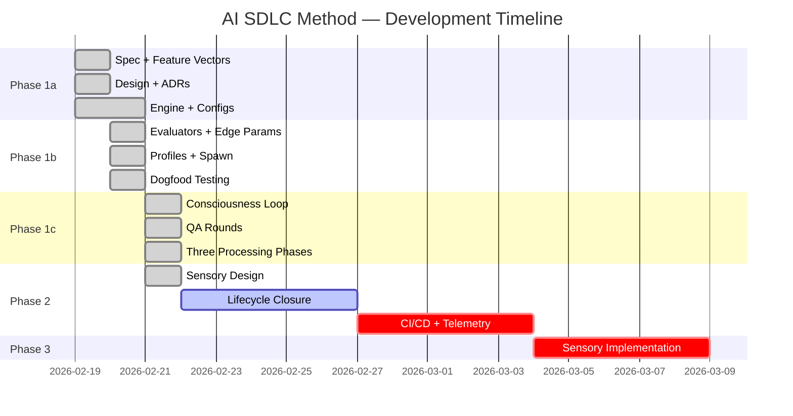

# AI SDLC Method — Project Status

**Project**: AI SDLC Asset Graph Model (Project Genesis)
**Version**: 2.6.1
**Intent**: INT-AISDLC-001

## Phase Completion Summary

| Edge | Status | Iterations | Evaluators | Source Findings | Process Gaps |
|------|--------|------------|------------|-----------------|-------------|
| intent→requirements | converged | 1 | 6/6 (agent+human) | 0 | 0 |
| requirements→design | converged | 2 | 5/5 (agent+human) | 0 | 0 |
| design→code | in_progress | 1 | 12/15 (3 pending lifecycle+sense) | 6 | 1 |
| code↔unit_tests | in_progress | 1 | 284/284 (pytest) | 0 | 0 |

## Self-Reflection (TELEM Signals)

### TELEM-001: Phase 1a Complete
**Signal**: 259 tests passing, 7 feature vectors defined, 39 implementation requirements covered. Foundation is solid.

### TELEM-002: Dogfood Validation
**Signal**: Traversed 3 edges on real project (Python CLI bookmark manager). Found and fixed 6 bugs in config resolution, variable substitution, and edge traversal.

### TELEM-003: Executable Agent Gap
**Signal**: Commands are markdown specifications, not executable agents. Phase 1b needs LLM integration for iterate() to become a running system. This is the primary remaining work.

### TELEM-004: Biological Nervous System Formalisation
**Signal**: Three processing phases (reflex/affect/conscious) replace two regimes. Two sensory systems (interoception/exteroception) added as continuous signal generators. The system now has the architectural specification for sensing independently of human-driven iterate() calls.

### TELEM-005: Sensory Design Formalised
**Signal**: Sensory service architecture formalised — §4.5.4 in spec (MCP service model, review boundary, event categories), §1.8 in design doc (8 subsections: service arch, interoceptive monitors INTRO-001..007, exteroceptive monitors EXTRO-001..004, affect triage pipeline, homeostatic responses, review boundary MCP tools, event contracts, monitor/telemetry separation). REQ-SENSE-005 added (review boundary). 44 total requirements, 8 feature vectors.

## Aggregate Metrics

- **Total REQ keys**: 44
- **Features**: 8 (5 converged, 2 in_progress, 1 design_pending)
- **Tests**: ~284 (100% passing)
- **Coverage**: Phase 1a-1c complete, Phase 2 sensory design done, Phase 2 lifecycle pending, Phase 3 pending
