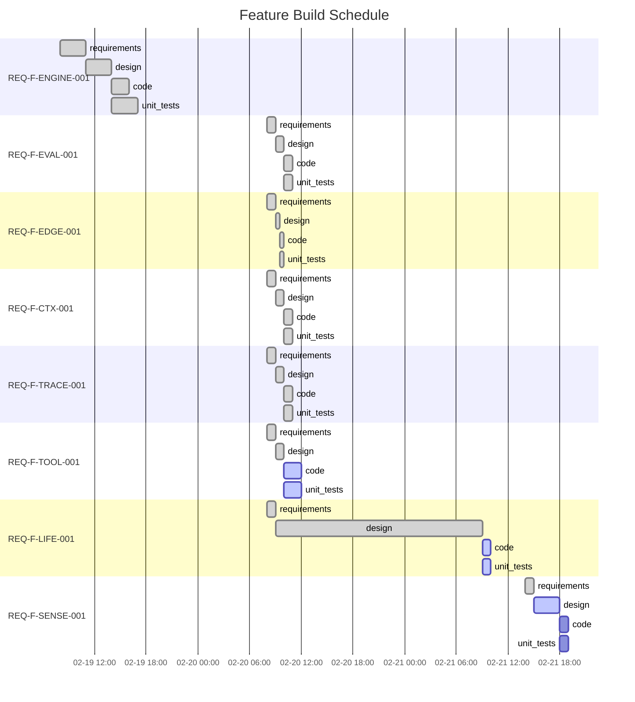

# Project Status — AI SDLC Asset Graph Model (Project Genesis)

Generated: 2026-02-21T22:00:00Z

## State: IN_PROGRESS

Start would: iterate REQ-F-TOOL-001 on design→code (closest-to-complete, 2/4 edges converged)

## Feature Build Schedule



## You Are Here

```
REQ-F-ENGINE-001  intent ✓ → req ✓ → design ✓ → code ✓ → tests ✓
REQ-F-EVAL-001    intent ✓ → req ✓ → design ✓ → code ✓ → tests ✓
REQ-F-EDGE-001    intent ✓ → req ✓ → design ✓ → code ✓ → tests ✓
REQ-F-CTX-001     intent ✓ → req ✓ → design ✓ → code ✓ → tests ✓
REQ-F-TRACE-001   intent ✓ → req ✓ → design ✓ → code ✓ → tests ✓
REQ-F-TOOL-001    intent ✓ → req ✓ → design ✓ → code ● → tests ●
REQ-F-LIFE-001    intent ✓ → req ✓ → design ✓ → code ● → tests ●
REQ-F-SENSE-001   intent ✓ → req ✓ → design ● → code ○ → tests ○
REQ-F-UX-001      (spec-defined, not yet spawned in workspace)
REQ-F-COORD-001   (spec-defined, not yet spawned in workspace)
```

## Phase Completion Summary

| Phase | Converged | In Progress | Pending | Blocked |
|-------|-----------|-------------|---------|---------|
| requirements | 8 | 0 | 0 | 0 |
| design | 7 | 1 | 0 | 0 |
| code | 5 | 2 | 1 | 0 |
| unit_tests | 5 | 2 | 1 | 0 |
| **Total** | **25** | **5** | **2** | **0** |

## Active Features

| Feature | Description | Current Edge | Iteration | Profile |
|---------|-------------|-------------|-----------|---------|
| REQ-F-TOOL-001 | Developer Tooling | code ● | 1 | standard |
| REQ-F-LIFE-001 | Full Lifecycle Closure | code ● | 1 | full |
| REQ-F-SENSE-001 | Sensory Systems | design ● | 1 | full |

## Converged Features

| Feature | Description | Edges | Tests |
|---------|-------------|-------|-------|
| REQ-F-ENGINE-001 | Asset Graph Engine | 4/4 | 142 initial |
| REQ-F-EVAL-001 | Evaluator Framework | 4/4 | ✓ |
| REQ-F-EDGE-001 | Edge Parameterisations | 4/4 | ✓ |
| REQ-F-CTX-001 | Context Management | 4/4 | ✓ |
| REQ-F-TRACE-001 | Feature Vector Traceability | 4/4 | ✓ |

## Next Actions

1. **REQ-F-TOOL-001**: Continue code→unit_tests iteration (Phase 1b — executable engine needed)
2. **REQ-F-LIFE-001**: Continue code→unit_tests iteration (production lifecycle)
3. **REQ-F-SENSE-001**: Complete requirements→design (MCP service implementation)
4. **Spawn**: Create workspace feature files for REQ-F-UX-001 and REQ-F-COORD-001

---

## Process Telemetry

### Convergence Pattern
- **1-iteration convergence**: 5/8 features converged all edges in 1 iteration each. At Phase 1a (markdown specs, no executable code), this is expected — evaluators are agent-only checks on document structure.
- **Multi-iteration**: ENGINE-001 design (2 iterations — ADR-008, ADR-009 required refinement), LIFE-001 design (2 iterations — consciousness loop + event sourcing added ADR-011)
- **In-progress stall risk**: TOOL-001 and LIFE-001 have been at code iteration 1 since 2026-02-20. Not yet stuck (δ is changing via spec evolution and test additions: 142→195→259→326 tests).

### Traceability Coverage
- **REQ keys defined**: 54 (AISDLC_IMPLEMENTATION_REQUIREMENTS.md v3.6.0)
- **Feature vectors covering**: 54/54 (100%) across 10 vectors (FEATURE_VECTORS.md v1.5.0)
- **Workspace tracked**: 8/10 features (REQ-F-UX-001, REQ-F-COORD-001 not yet spawned)
- **Test coverage**: 326 tests passing (config validation + methodology BDD)

### Constraint Surface Observations
- All mandatory constraint dimensions resolved at design edge (via ADRs)
- Advisory dimensions documented but not enforced
- $variable resolution: not yet testable (no executable engine)

## Self-Reflection — Feedback → New Intent

| Signal | Observation | Recommended Action |
|--------|-------------|-------------------|
| TELEM-003 | Commands are markdown specs, not executable agents — Phase 1b needs LLM integration for iterate() | Priority: create executable engine that invokes iterate agent with edge configs |
| TELEM-004 | Three processing phases formalised (reflex/affect/conscious), two sensory systems added | Informational — spec evolution captured in v2.6 |
| TELEM-005 | Two-command UX (v2.7) and multi-agent coordination (v2.8) added via 3-agent review process | First cross-agent spec development. Event catalogue now 20 types. Terminology standardised (serialiser). |
| TELEM-006 | 2 feature vectors (UX, COORD) defined in spec but not spawned in workspace | Spawn workspace .yml files to enable tracking. Both are Phase 1 (UX) / Phase 2 (COORD). |
| TELEM-007 | Test coverage is design-stage presence checks only. Behavioural protocol tests (competing claims, stale detection, mode transitions) deferred to engine implementation. | Track as known gap. Tests will be mandatory when serialiser is implemented. |
