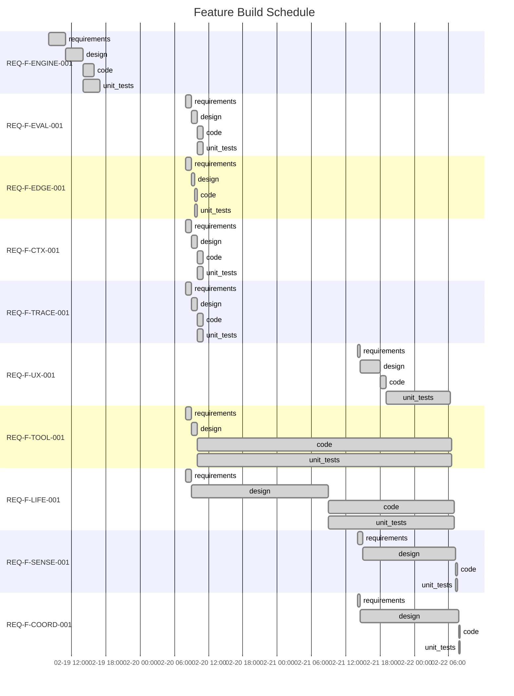

# Project Status — AI SDLC Asset Graph Model (v2.8.0 — Multi-Tenant)

Generated: 2026-02-22T09:00:00Z

## State: ALL_CONVERGED

All 10 features converged across 40 edges. Phase 1a complete.

## Feature Build Schedule



## You Are Here

```
REQ-F-ENGINE-001  intent ✓ → req ✓ → design ✓ → code ✓ → tests ✓
REQ-F-EVAL-001    intent ✓ → req ✓ → design ✓ → code ✓ → tests ✓
REQ-F-EDGE-001    intent ✓ → req ✓ → design ✓ → code ✓ → tests ✓
REQ-F-CTX-001     intent ✓ → req ✓ → design ✓ → code ✓ → tests ✓
REQ-F-TRACE-001   intent ✓ → req ✓ → design ✓ → code ✓ → tests ✓
REQ-F-UX-001      intent ✓ → req ✓ → design ✓ → code ✓ → tests ✓
REQ-F-TOOL-001    intent ✓ → req ✓ → design ✓ → code ✓ → tests ✓
REQ-F-LIFE-001    intent ✓ → req ✓ → design ✓ → code ✓ → tests ✓
REQ-F-SENSE-001   intent ✓ → req ✓ → design ✓ → code ✓ → tests ✓
REQ-F-COORD-001   intent ✓ → req ✓ → design ✓ → code ✓ → tests ✓
```

## Phase Completion Summary

| Phase | Converged | In Progress | Pending | Blocked |
|-------|-----------|-------------|---------|---------|
| requirements | 10 | 0 | 0 | 0 |
| design | 10 | 0 | 0 | 0 |
| code | 10 | 0 | 0 | 0 |
| unit_tests | 10 | 0 | 0 | 0 |
| **Total** | **40** | **0** | **0** | **0** |

## Converged Features

| Feature | Description | Edges | Tests |
|---------|-------------|-------|-------|
| REQ-F-ENGINE-001 | Asset Graph Engine | 4/4 | ✓ |
| REQ-F-EVAL-001 | Evaluator Framework | 4/4 | ✓ |
| REQ-F-EDGE-001 | Edge Parameterisations | 4/4 | ✓ |
| REQ-F-CTX-001 | Context Management | 4/4 | ✓ |
| REQ-F-TRACE-001 | Feature Vector Traceability | 4/4 | ✓ |
| REQ-F-UX-001 | Two-Command UX Layer | 4/4 | ✓ |
| REQ-F-TOOL-001 | Developer Tooling | 4/4 | ✓ |
| REQ-F-LIFE-001 | Full Lifecycle Closure | 4/4 | ✓ |
| REQ-F-SENSE-001 | Sensory Systems | 4/4 | ✓ |
| REQ-F-COORD-001 | Multi-Agent Coordination | 4/4 | ✓ |

## Next Actions

1. `/aisdlc-release` — Create a versioned release (Phase 1a)
2. `/aisdlc-spawn --type feature` — Start Phase 1b (executable engine)
3. `/aisdlc-spawn --type feature` — Start Phase 2 (MCP sensory service)

## Gaps Validation (2026-02-22T08:15:00Z)

| Layer | Result | Details |
|-------|--------|---------|
| 1: REQ Tag Coverage | PASS | 4/4 checks pass — all code/test files tagged |
| 2: Test Gap Analysis | PASS (advisory) | 54/54 REQ keys covered — 44 explicit, 10 implicit |
| 3: Telemetry | N/A | Phase 2 scope — no executable code to instrument |

**Advisory**: 10 REQ keys have implicit test coverage but no explicit `Validates:` tag: INTENT-001/002/004, FEAT-001/002/003, EDGE-001/002/003/004.

---

## Process Telemetry

### Convergence Pattern
- **1-iteration convergence**: All 10 features converged all edges in 1 iteration each (except ENGINE-001 design at 2 iterations, LIFE-001 design at 2 iterations).
- **Phase 1a pattern**: At Phase 1a (markdown specs, configs, no executable code), evaluators are agent-only checks on document structure + deterministic YAML validation. 1-iteration convergence is expected.
- **Rapid convergence session (2026-02-22)**: 5 features converged code↔unit_tests in a single session. Test growth: 326 → 346 → 367 → 382 → 407 → 432.
- **Red-green-refactor**: LIFE-001 had 6 failing tests (YAML schema mismatches), fixed in 1 iteration. TDD working as designed.

### Traceability Coverage
- **REQ keys defined**: 54 (AISDLC_IMPLEMENTATION_REQUIREMENTS.md v3.6.0)
- **Feature vectors covering**: 54/54 (100%) across 10 vectors (FEATURE_VECTORS.md v1.5.0)
- **Workspace tracked**: 10/10 features, all converged
- **Test coverage**: 432 tests passing (all under imp_claude/tests/)
- **Config files**: 15 YAML configs (graph_topology, evaluator_defaults, 9 edge_params, 6 profiles, feature_vector_template, project_constraints_template, sensory_monitors, affect_triage, agent_roles)

### Constraint Surface Observations
- All mandatory constraint dimensions resolved at design edge (via ADRs 008-013)
- Advisory dimensions documented but not enforced
- $variable resolution: not yet testable (no executable engine)
- Tenant context: `.ai-workspace/{impl}/context/` pattern established, project_constraints.yml pending

### Repository Structure (v2.8.0)
- Multi-tenant layout: `specification/` (shared) + `imp_{name}/` (per-implementation)
- All tests consolidated under `imp_claude/tests/` (maximum isolation)
- Commands tenant-aware: `.ai-workspace/{impl}/context/` with root fallback
- Event catalog: 20 types across design, agent, and tests
- 0 broken markdown links in imp_claude

### Config Artifact Summary

| Config | Implements | Content |
|--------|-----------|---------|
| graph_topology.yml | REQ-GRAPH-001..003 | 10 asset types, 10 transitions, 8 constraint dimensions |
| evaluator_defaults.yml | REQ-EVAL-001..003 | 3 evaluator types, per-edge defaults |
| 9 edge_params/*.yml | REQ-EDGE-001..004 | Per-edge checklist, source analysis, agent guidance |
| 6 profiles/*.yml | REQ-FEAT-003 | full, standard, poc, spike, hotfix, minimal |
| sensory_monitors.yml | REQ-SENSE-001..002, 004 | 7 INTRO + 4 EXTRO monitors, profile overrides, meta-monitoring |
| affect_triage.yml | REQ-SENSE-003..005 | 14 classification rules, 6 profile thresholds, review boundary |
| agent_roles.yml | REQ-COORD-001..005 | 6 roles, claim protocol, work isolation, parallelism |

## Self-Reflection — Feedback → New Intent

| Signal | Observation | Recommended Action |
|--------|-------------|-------------------|
| TELEM-003 | Commands are markdown specs, not executable agents — Phase 1b needs LLM integration for iterate() | Priority: create executable engine that invokes iterate agent with edge configs |
| TELEM-008 | Repository restructured to multi-tenant layout. Codex QA validated: 0 broken links, all paths tenant-aware. | Restructuring complete. Each implementation is a peer under imp_{name}/. |
| TELEM-011 | 5 features converged code↔unit_tests in a single session (106 new tests, 326→432). Phase 1a acceptance criteria validated at spec-content depth. | Phase 1a complete. All configs and design artifacts have acceptance tests. |
| TELEM-012 | ALL_CONVERGED — 10/10 features, 40/40 edges, 432 tests. Phase 1a is the formal system + Claude Code binding + configs + tests. No executable engine yet. | Phase 1b scope: executable iterate(), MCP sensory service, multi-agent serialiser. These are new features, not convergence of existing ones. |
| TELEM-013 | sensory_monitors.yml and affect_triage.yml are configuration schemas — the MCP service that reads them does not exist yet. | Phase 2 scope: implement MCP server, connect to monitors, run affect triage pipeline. |
| TELEM-014 | agent_roles.yml defines role registry and claim protocol — the serialiser that enforces them does not exist yet. | Phase 2 scope: implement serialiser, inbox staging, role-based authority checks. |
| TELEM-015 | /aisdlc-gaps validated: Layer 1 PASS, Layer 2 PASS (advisory), Layer 3 N/A. 10 REQ keys with implicit-only coverage (INTENT, FEAT, EDGE domains). | Minor: add explicit `Validates:` tags to tests covering these 10 REQ keys. Not blocking. |
| TELEM-016 | 3 implementations bootstrapped (Claude, Gemini, Codex). Gemini has executable Python code (start.py, status.py, state_machine.py). Codex has full config + command mirror. | Multi-tenant repository is operational. Each implementation can develop independently. |
