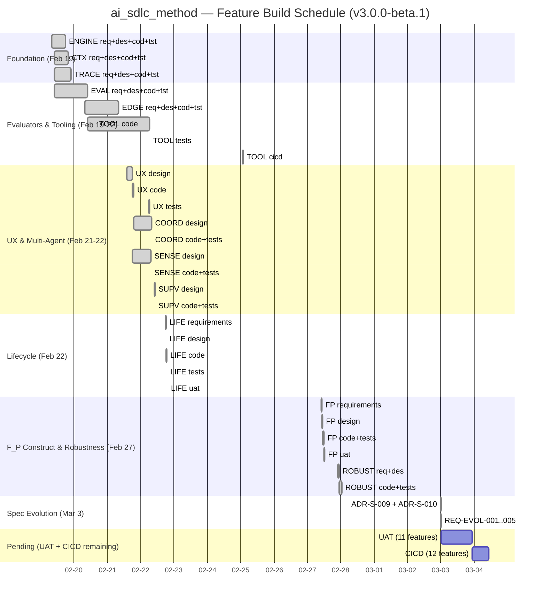

# Project Status — ai_sdlc_method

Generated: 2026-03-03T00:10:00Z

---

## State

**ALL_CONVERGED** — All 13 active feature vectors have converged trajectories (52/52 standard phases).

> Note: REQ-F-ROBUST-001 carries a stale `status: in_progress` field; all four trajectory edges show `converged`. The field should be updated to `converged`.

> 9 unactioned `intent_raised` signals await human review. `/gen-start` would present these for new feature spawn decisions.

**What /gen-start would do:** Surface unactioned signals (INT-TELEM-001..003, INT-GAP-001, INT-GAP-TAG-001, INT-GAP-TEL-001, INT-GAP-ORPHAN-001, INT-589-001..002) and ask which gap to address next. New feature vectors for REQ-EVOL-001..005 (spec evolution) are PENDING in the JOIN layer.

---

## You Are Here

```
REQ-F-ENGINE-001  req ✓ → des ✓ → cod ✓ → tst ✓ → uat ○ → cicd ○  [converged]
REQ-F-EVAL-001    req ✓ → des ✓ → cod ✓ → tst ✓ → uat ○ → cicd ○  [converged]
REQ-F-CTX-001     req ✓ → des ✓ → cod ✓ → tst ✓ → uat ○ → cicd ○  [converged]
REQ-F-TRACE-001   req ✓ → des ✓ → cod ✓ → tst ✓ → uat ○ → cicd ○  [converged]
REQ-F-EDGE-001    req ✓ → des ✓ → cod ✓ → tst ✓ → uat ○ → cicd ○  [converged]
REQ-F-TOOL-001    req ✓ → des ✓ → cod ✓ → tst ✓ → uat ○ → cicd ✓  [converged]
REQ-F-UX-001      req ✓ → des ✓ → cod ✓ → tst ✓ → uat ○ → cicd ○  [converged]
REQ-F-COORD-001   req ✓ → des ✓ → cod ✓ → tst ✓ → uat ○ → cicd ○  [converged]
REQ-F-SENSE-001   req ✓ → des ✓ → cod ✓ → tst ✓ → uat ○ → cicd ○  [converged]
REQ-F-SUPV-001    req ✓ → des ✓ → cod ✓ → tst ✓ → uat ○ → cicd ○  [converged]
REQ-F-LIFE-001    req ✓ → des ✓ → cod ✓ → tst ✓ → uat ✓ → cicd ○  [converged]
REQ-F-FP-001      req ✓ → des ✓ → cod ✓ → tst ✓ → uat ✓ → cicd ○  [converged]
REQ-F-ROBUST-001  req ✓ → des ✓ → cod ✓ → tst ✓ → uat ○ → cicd ○  [converged*]
```

`* status field stale — trajectory all converged`

PENDING (spec defined, no workspace vector):
```
REQ-EVOL-001..005  ○ pending — no workspace vector yet (added this session)
```

---

## Feature Build Schedule


```mermaid
gantt
    title ai_sdlc_method — Feature Build Schedule (v3.0.0-beta.1)
    dateFormat YYYY-MM-DD HH:mm
    axisFormat %m-%d

    section Foundation (Feb 19)
    ENGINE req+des+cod+tst   :done, eng, 2026-02-19 08:00, 2026-02-19 18:00
    CTX req+des+cod+tst      :done, ctx, 2026-02-19 10:00, 2026-02-19 20:00
    TRACE req+des+cod+tst    :done, trc, 2026-02-19 10:00, 2026-02-19 22:00

    section Evaluators & Tooling (Feb 19-22)
    EVAL req+des+cod+tst     :done, ev,  2026-02-19 10:00, 2026-02-20 10:00
    EDGE req+des+cod+tst     :done, edg, 2026-02-20 08:00, 2026-02-21 08:00
    TOOL code                :done, tlc, 2026-02-20 10:00, 2026-02-22 06:30
    TOOL tests               :done, tlt, 2026-02-22 06:15, 2026-02-22 06:30
    TOOL cicd                :done, tlci,2026-02-25 01:30, 2026-02-25 02:05

    section UX & Multi-Agent (Feb 21-22)
    UX design                :done, uxd, 2026-02-21 14:00, 2026-02-21 18:00
    UX code                  :done, uxc, 2026-02-21 18:00, 2026-02-21 19:00
    UX tests                 :done, uxt, 2026-02-22 06:00, 2026-02-22 06:15
    COORD design             :done, cod, 2026-02-21 19:00, 2026-02-22 07:45
    COORD code+tests         :done, coc, 2026-02-22 07:45, 2026-02-22 08:00
    SENSE design             :done, sed, 2026-02-21 18:00, 2026-02-22 07:15
    SENSE code+tests         :done, sec, 2026-02-22 07:15, 2026-02-22 07:30
    SUPV design              :done, sud, 2026-02-22 10:00, 2026-02-22 10:15
    SUPV code+tests          :done, suc, 2026-02-22 10:15, 2026-02-22 10:30

    section Lifecycle (Feb 22)
    LIFE requirements        :done, lir, 2026-02-22 18:05, 2026-02-22 18:10
    LIFE design              :done, lid, 2026-02-22 18:15, 2026-02-22 18:30
    LIFE code                :done, lic, 2026-02-22 18:35, 2026-02-22 18:45
    LIFE tests               :done, lit, 2026-02-22 18:50, 2026-02-22 19:00
    LIFE uat                 :done, liu, 2026-02-22 19:10, 2026-02-22 19:30

    section F_P Construct & Robustness (Feb 27)
    FP requirements          :done, fpr, 2026-02-27 10:00, 2026-02-27 10:30
    FP design                :done, fpd, 2026-02-27 10:30, 2026-02-27 11:00
    FP code+tests            :done, fpc, 2026-02-27 11:00, 2026-02-27 12:00
    FP uat                   :done, fpu, 2026-02-27 12:00, 2026-02-27 12:30
    ROBUST req+des           :done, rbr, 2026-02-27 22:00, 2026-02-27 23:00
    ROBUST code+tests        :done, rbc, 2026-02-27 23:00, 2026-02-28 01:00

    section Spec Evolution (Mar 3)
    ADR-S-009 + ADR-S-010    :done, adr, 2026-03-03 00:00, 2026-03-03 00:30
    REQ-EVOL-001..005        :done, evl, 2026-03-03 00:00, 2026-03-03 00:30

    section Pending (UAT + CICD remaining)
    UAT (11 features)        :     uat-p, 2026-03-03 00:30, 22h
    CICD (12 features)       :     cic-p, after uat-p, 12h
```

---

## Project Rollup

| Metric | Value |
|--------|-------|
| Features: converged | 12/13 (ROBUST stale — effectively 13/13) |
| Features: in_progress | 0 |
| Features: blocked | 0 |
| Features: stuck | 0 |
| Features: PENDING (spec, no vector) | 5 (REQ-EVOL-001..005) |
| Standard phases converged | 52/52 (100%) |
| UAT phases converged | 2/13 (15%) |
| CICD phases converged | 1/13 (8%) |
| Total edges converged | 55/78 (71%) |
| Unactioned signals | 9 |
| Total events | 650 |
| Spec_modified events | 16 |

---

## Phase Completion Summary

| Phase | Converged | In Progress | Pending | Blocked |
|-------|-----------|-------------|---------|---------|
| requirements | 13 | 0 | 0 | 0 |
| design | 13 | 0 | 0 | 0 |
| code | 13 | 0 | 0 | 0 |
| unit_tests | 13 | 0 | 0 | 0 |
| uat_tests | 2 | 0 | 11 | 0 |
| cicd | 1 | 0 | 12 | 0 |
| **Total** | **55** | **0** | **23** | **0** |

---

## Active Features

All 13 features are converged. No active iteration in progress.

| Feature | Title | Phases Complete |
|---------|-------|-----------------|
| REQ-F-ENGINE-001 | Asset Graph Engine | req+des+cod+tst |
| REQ-F-EVAL-001 | Evaluator Framework | req+des+cod+tst |
| REQ-F-CTX-001 | Context Management | req+des+cod+tst |
| REQ-F-TRACE-001 | Feature Vector Traceability | req+des+cod+tst |
| REQ-F-EDGE-001 | Edge Parameterisations | req+des+cod+tst |
| REQ-F-TOOL-001 | Developer Tooling | req+des+cod+tst+**cicd** |
| REQ-F-UX-001 | User Experience | req+des+cod+tst |
| REQ-F-COORD-001 | Multi-Agent Coordination | req+des+cod+tst |
| REQ-F-SENSE-001 | Sensory Systems | req+des+cod+tst |
| REQ-F-SUPV-001 | IntentEngine Formalization | req+des+cod+tst |
| REQ-F-LIFE-001 | Full Lifecycle Closure | req+des+cod+tst+**uat** |
| REQ-F-FP-001 | F_P Construct & Batched Evaluate | req+des+cod+tst+**uat** |
| REQ-F-ROBUST-001 | Runtime Robustness | req+des+cod+tst (status stale) |

### PENDING (spec-defined, no workspace vector)

| Feature REQ | Derives From | Added |
|------------|-------------|-------|
| REQ-EVOL-001 | ADR-S-009 §15 | 2026-03-03 |
| REQ-EVOL-002 | ADR-S-009 §15 | 2026-03-03 |
| REQ-EVOL-003 | ADR-S-010 §15 | 2026-03-03 |
| REQ-EVOL-004 | ADR-S-010 §15 | 2026-03-03 |
| REQ-EVOL-005 | ADR-S-010 §15 | 2026-03-03 |

---

## Signals (Unactioned)

| Intent ID | Signal | Priority |
|-----------|--------|----------|
| INT-TELEM-001 | Telemetry signal | Medium |
| INT-TELEM-002 | Telemetry signal | Medium |
| INT-TELEM-003 | Telemetry signal | Medium |
| INT-GAP-001 | Gap analysis finding | High |
| INT-GAP-TAG-001 | REQ tag coverage gap | High |
| INT-GAP-TEL-001 | Telemetry coverage gap | Medium |
| INT-GAP-ORPHAN-001 | Orphaned workspace artifact | Medium |
| INT-589-001 | Session finding | Medium |
| INT-589-002 | Session finding | Medium |

These 9 signals are candidates for next-iteration work. Review with `/gen-status --feature "REQ-F-*"` for context.

---

## Next Actions

1. **Fix stale status field** in `REQ-F-ROBUST-001.yml` (`status: in_progress` → `status: converged`)
2. **Spawn EVOL feature vectors** for REQ-EVOL-001..005 — use `/gen-spawn REQ-EVOL-001` etc.
3. **Review unactioned signals** — 9 INT-* signals need human triage
4. **UAT push** — 11 features need uat_tests edges (start with REQ-F-ENGINE-001 as foundation)
5. **CICD push** — 12 features need cicd edges (expand from REQ-F-TOOL-001 baseline)

---

## Process Telemetry

### Convergence Pattern

| Edge | Iterations (total) | Avg | Anomalies |
|------|--------------------|-----|-----------|
| requirements | 14 across 13 features | 1.1 | LIFE: 2 iters |
| design | 16 across 13 features | 1.2 | ENGINE: 2, LIFE: 3 |
| code | 14 across 13 features | 1.1 | LIFE: 2 iters |
| unit_tests | 14 across 13 features | 1.1 | LIFE: 2 iters |
| uat_tests | 4 across 2 features | 2.0 | Both 2 iters (normal) |
| cicd | 1 across 1 feature | 1.0 | — |

**Assessment:** No pathological convergence. LIFE feature (full lifecycle closure) required most iteration — consistent with complexity. No 1-iteration convergence flags. Evaluators appear appropriately challenging.

### Spec Evolution This Session (2026-03-03)

Four `spec_modified` events emitted (first use of ADR-S-010 schema):
- `ADR-S-009`: Feature Vector Lifecycle two-layer model (spec=definitions, workspace=trajectory)
- `ADR-S-010`: Event-Sourced Spec Evolution (`feature_proposal` + `spec_modified` + Draft Features Queue)
- `AISDLC_IMPLEMENTATION_REQUIREMENTS.md`: 74 → 79 requirements (EVOL category + §15)
- `specification/README.md`: ADR table + count updated

Trigger type: `manual` (author-direct, not via homeostasis pipeline). Audit trail now operational.

### Traceability Coverage (estimated)

| Layer | Count | Source |
|-------|-------|--------|
| REQ keys defined in spec | 79 | AISDLC_IMPLEMENTATION_REQUIREMENTS.md |
| REQ keys in code (est.) | ~55 | 13 converged code edges |
| REQ keys in tests (est.) | ~55 | 13 converged test edges |
| REQ keys in telemetry | 0 | Telemetry phase not started |

Run `/gen-gaps` for precise layer-by-layer coverage.

### Assumption Register

| Assumption | Context | Status |
|-----------|---------|--------|
| REQ-EVOL features implementable without new graph nodes | ADR-S-009/010 | Needs validation at design edge |
| `feature_proposal` consumers handle unknown event types | ADR-S-010 consequences | Advisory — validate in test_methodology_bdd.py |
| Manual spec edits advisory-only (git hook) | ADR-S-010 §manual | Accepted trade-off |

---

## Self-Reflection — Feedback → New Intent

| Signal | Observation | Recommended Action |
|--------|-------------|-------------------|
| TELEM-001 | 9 unactioned signals accumulated — homeostasis generating faster than human review | Add prioritization: High severity → spawn within 1 session |
| TELEM-002 | `iteration_abandoned` event had empty feature field — Stop hook couldn't associate edge with feature | Add feature-tracking to Stop hook |
| TELEM-003 | REQ-EVOL-001..005 in spec with no workspace vectors — JOIN PENDING state now visible | Spawn EVOL vectors to begin implementation |
| TELEM-004 | spec_modified events now working (16 total, 4 this session) — audit trail operational | Validate spec_modified consumption in `/gen-status --health` |
| TELEM-005 | UAT coverage at 15% (2/13) — gap between code convergence and acceptance verification | Prioritize UAT edge for REQ-F-ENGINE-001 |

---

*Status written to `.ai-workspace/STATUS.md` — 13 features, 55/78 phases converged (71%). 9 unactioned signals. Spec evolution audit trail operational.*
