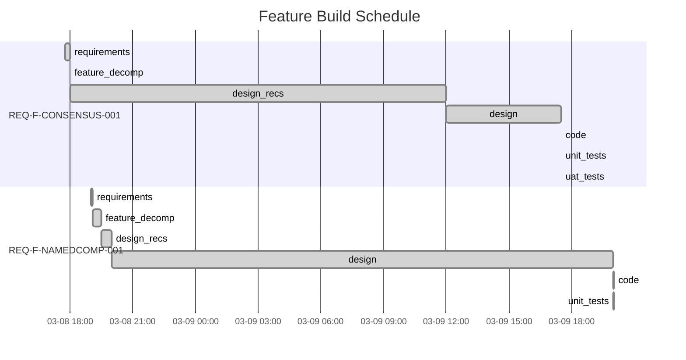

# Project Status — ai_sdlc_method

Generated: 2026-03-09T20:05:00Z
State: CONVERGED

## Project State

**State**: CONVERGED

| State | Count |
|-------|-------|
| Iterating  | 0 vectors |
| Converged  | 2/2 required vectors |
| Blocked (with disposition) | 0 vectors |
| Blocked (no disposition) | 0 vectors |

## Feature Build Schedule

```mermaid
gantt
    title Feature Build Schedule
    dateFormat YYYY-MM-DD HH:mm
    axisFormat %m-%d %H:%M

    section REQ-F-CONSENSUS-001
    requirements     :done, cons-req, 2026-03-08 17:45, 2026-03-08 18:00
    feature_decomp   :done, cons-fd,  after cons-req, 2026-03-08 18:00
    design_recs      :done, cons-dr,  after cons-fd,  2026-03-09 12:00
    design           :done, cons-des, after cons-dr,  2026-03-09 17:30
    code             :done, cons-cod, after cons-des, 2026-03-09 17:30
    unit_tests       :done, cons-tst, after cons-des, 2026-03-09 17:30
    uat_tests        :done, cons-uat, after cons-cod, 2026-03-09 17:30

    section REQ-F-NAMEDCOMP-001
    requirements     :done, nc-req, 2026-03-08 19:00, 2026-03-08 19:05
    feature_decomp   :done, nc-fd,  after nc-req, 2026-03-08 19:30
    design_recs      :done, nc-dr,  after nc-fd,  2026-03-08 20:00
    design           :done, nc-des, after nc-dr,  2026-03-09 20:00
    code             :done, nc-cod, after nc-des, 2026-03-09 20:01
    unit_tests       :done, nc-tst, after nc-des, 2026-03-09 20:02
```

## Phase Completion Summary

| Phase | Converged | In Progress | Pending | Blocked |
|-------|-----------|-------------|---------|---------|
| requirements | 2 | 0 | 0 | 0 |
| feature_decomp | 2 | 0 | 0 | 0 |
| design_recommendations | 2 | 0 | 0 | 0 |
| design | 2 | 0 | 0 | 0 |
| code | 2 | 0 | 0 | 0 |
| unit_tests | 2 | 0 | 0 | 0 |
| uat_tests | 1 | 0 | 1 | 0 |
| **Total** | **13** | **0** | **1** | **0** |

## Active Features

All features converged.

- REQ-F-CONSENSUS-001 — converged (all edges)
- REQ-F-NAMEDCOMP-001 — converged (design, code, unit_tests; uat_tests deferred)

## Next Actions

1. Run `/gen-gaps` — verify full traceability coverage post-NAMEDCOMP implementation
2. `human_approves_architecture` F_H gate on REQ-F-CONSENSUS-001 design edge — still pending
3. Review 6 draft proposals (PROP-001..006) via `/gen-review-proposal`
4. Consider REQ-F-NAMEDCOMP-001 UAT test authoring

---

## Process Telemetry

### Convergence Pattern
- REQ-F-CONSENSUS-001: Design converged in 3 iterations (delta:1 on iteration 2 — versioning semantics)
- REQ-F-NAMEDCOMP-001: Design converged in 1 iteration (delta:0 — design recommendations were comprehensive)
- Both features: code + unit_tests converged in single iteration (test-first approach, strong spec)

### Traceability Coverage
- 86/86 REQ keys tagged in code (100%) — completed in prior session
- 171 new tests added for NAMEDCOMP-001 (5 test files)
- Total test suite: ~1,100+ tests across all modules

### Key deliverables (this session)
- `config/named_compositions.yml` — 4 macros (PLAN, POC, SCHEMA_DISCOVERY, DATA_DISCOVERY) + 7-entry dispatch table
- `config/named_compositions/plan.yml` — PLAN edge parameter template
- `feature_vector_template.yml` — extended with intent vector envelope (6 new fields)
- `intentengine_config.yml` — gap_type_dispatch section (ADR-S-026 §3)
- `config_loader.py` — 4 new functions (load, resolve, validate, convergence state)
- `graph_topology.yml` — named_composition asset type + 2 governance edges
- `edge_params/composition_review.yml` + `composition_consensus.yml`
- `commands/gen-status.md` — Project Convergence State section (NC-004)
- `commands/gen-init.md` — Step 9 named_compositions README
- `agents/gen-dev-observer.md` + `gen-cicd-observer.md` — composition resolution in intent_raised

### Self-Reflection

| Signal | Observation | Recommended Action |
|--------|-------------|-------------------|
| TELEM-NC-001 | affect_triage.yml not updated with gap_type field | Add gap_type field to affect_triage.yml in next session |
| TELEM-NC-002 | REQ-F-NAMEDCOMP-001 uat_tests deferred — no UAT use case authored | Author UAT-UC-NAMEDCOMP-001 covering registry load + composition resolution |
| TELEM-NC-003 | P6 governance scaffold complete — composition_review + consensus edges ready | Test end-to-end: propose composition, run REVIEW gate, verify .ai-workspace/named_compositions/ |
