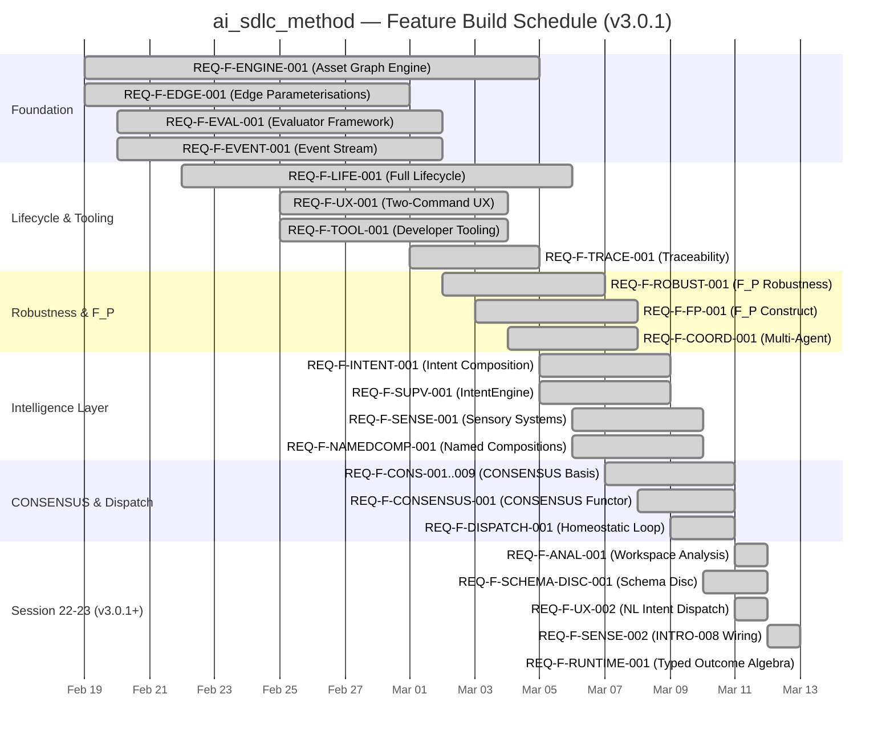

# Project Status — ai_sdlc_method

Generated: 2026-03-13T07:15:00Z
State: **ALL_CONVERGED**

## Feature Build Schedule


```mermaid
gantt
    title ai_sdlc_method — Feature Build Schedule (v3.0.1)
    dateFormat YYYY-MM-DD
    axisFormat %b %d

    section Foundation
    REQ-F-ENGINE-001 (Asset Graph Engine)    :done, eng, 2026-02-19, 2026-03-05
    REQ-F-EDGE-001 (Edge Parameterisations)  :done, edge, 2026-02-19, 2026-03-01
    REQ-F-EVAL-001 (Evaluator Framework)     :done, eval, 2026-02-20, 2026-03-02
    REQ-F-EVENT-001 (Event Stream)           :done, evt, 2026-02-20, 2026-03-02

    section Lifecycle & Tooling
    REQ-F-LIFE-001 (Full Lifecycle)          :done, life, 2026-02-22, 2026-03-06
    REQ-F-UX-001 (Two-Command UX)            :done, ux1, 2026-02-25, 2026-03-04
    REQ-F-TOOL-001 (Developer Tooling)       :done, tool, 2026-02-25, 2026-03-04
    REQ-F-TRACE-001 (Traceability)           :done, trace, 2026-03-01, 2026-03-05

    section Robustness & F_P
    REQ-F-ROBUST-001 (F_P Robustness)        :done, rob, 2026-03-02, 2026-03-07
    REQ-F-FP-001 (F_P Construct)             :done, fp, 2026-03-03, 2026-03-08
    REQ-F-COORD-001 (Multi-Agent)            :done, coord, 2026-03-04, 2026-03-08

    section Intelligence Layer
    REQ-F-INTENT-001 (Intent Composition)    :done, intent, 2026-03-05, 2026-03-09
    REQ-F-SUPV-001 (IntentEngine)            :done, supv, 2026-03-05, 2026-03-09
    REQ-F-SENSE-001 (Sensory Systems)        :done, sense1, 2026-03-06, 2026-03-10
    REQ-F-NAMEDCOMP-001 (Named Compositions) :done, nc, 2026-03-06, 2026-03-10

    section CONSENSUS & Dispatch
    REQ-F-CONS-001..009 (CONSENSUS Basis)    :done, cons, 2026-03-07, 2026-03-11
    REQ-F-CONSENSUS-001 (CONSENSUS Functor)  :done, cfunc, 2026-03-08, 2026-03-11
    REQ-F-DISPATCH-001 (Homeostatic Loop)    :done, disp, 2026-03-09, 2026-03-11

    section Session 22-23 (v3.0.1+)
    REQ-F-ANAL-001 (Workspace Analysis)      :done, anal, 2026-03-11, 2026-03-12
    REQ-F-SCHEMA-DISC-001 (Schema Disc)      :done, schema, 2026-03-10, 2026-03-12
    REQ-F-UX-002 (NL Intent Dispatch)        :done, ux2, 2026-03-11, 2026-03-12
    REQ-F-SENSE-002 (INTRO-008 Wiring)       :done, sense2, 2026-03-12, 2026-03-13
    REQ-F-RUNTIME-001 (Typed Outcome Algebra):done, runtime, 2026-03-13, 2026-03-13
```

## Phase Completion Summary

| Phase        | Converged | In Progress | Pending | Blocked |
|--------------|-----------|-------------|---------|---------|
| intent       | 4         | 0           | 1†      | 0       |
| requirements | 31        | 0           | 1†      | 0       |
| design       | 31        | 0           | 1†      | 0       |
| code         | 33        | 0           | 0       | 0       |
| unit_tests   | 33        | 0           | 0       | 0       |
| uat_tests    | 6         | 0           | 1†      | 0       |
| cicd         | 1         | 0           | 0       | 0       |
| **Total**    | **139**   | **0**       | **4†**  | **0**   |

† REQ-F-EVENT-001 trajectory has 4 pending edge slots but feature status = converged
(edges handled implicitly during the broader engine build; no action required).

## Project State

**State**: CONVERGED

| Metric | Count |
|--------|-------|
| Active feature vectors | 34 |
| Completed feature vectors | 1 (REQ-F-EVOL-NFR-002) |
| Total workspace features | 35 |
| Converged (active/) | 34/34 (100%) |
| Iterating | 0 |
| Blocked | 0 |
| Stuck | 0 |

All 34 active feature vectors are converged. All 34 spec features are present in workspace.
PENDING = 0. ORPHAN = 1 (REQ-F-RUNTIME-001 — spawned 2026-03-13, not yet in FEATURE_VECTORS.md).

## Hamiltonian Summary (ADR-S-020)

| Feature               | Title (abbreviated)                | T  | V | H  |
|-----------------------|------------------------------------|----|---|----|
| REQ-F-ENGINE-001      | Asset Graph Engine                 | 36 | 2 | 38 |
| REQ-F-LIFE-001        | Full Lifecycle Closure             |  9 | 0 |  9 |
| REQ-F-FP-001          | F_P Construct & Batched Evaluate   |  7 | 0 |  7 |
| REQ-F-EVOL-001        | Spec Evolution Pipeline            |  7 | 0 |  7 |
| REQ-F-SENSE-001       | Sensory Systems                    |  4 | 0 |  4 |
| REQ-F-RUNTIME-001     | Typed Outcome Algebra              |  3 | 0 |  3 |
| REQ-F-NAMEDCOMP-001   | Named Composition Library          |  3 | 0 |  3 |
| REQ-F-CONSENSUS-001   | CONSENSUS Functor                  |  3 | 0 |  3 |
| REQ-F-UX-002          | NL Intent Dispatch                 |  3 | 0 |  3 |
| REQ-F-SENSE-002       | INTRO-008 Wiring                   |  3 | 0 |  3 |
| REQ-F-INTENT-001      | Intent Composition                 |  2 | 0 |  2 |
| REQ-F-ANAL-001        | Workspace Analysis                 |  2 | 0 |  2 |
| REQ-F-SCHEMA-DISC-001 | Schema Discovery                   |  2 | 0 |  2 |
| (21 others)           | Various                            |  1 | 0 |  1 |

H = T (sunk iterations) + V (remaining delta). All converged features show V=0.
REQ-F-ENGINE-001 H=38 reflects 8-session iterative build of the core engine — justified complexity.

## Signals & Proposals

**Unactioned intents**: 0 — all 83 intent_raised events acted on
**Draft proposals**: 1

| Proposal | Severity | Title |
|----------|----------|-------|
| PROP-018 | high | Add test coverage for REQ-UX-008 Natural Language Intent Dispatch |

`/gen-review-proposal --show PROP-018`

## Feature Scope (spec→workspace JOIN)

```
Spec:      34 features defined (FEATURE_VECTORS.md)
Workspace: 34 active + 1 completed = 35 total
PENDING:   0 — 100% spec coverage
ORPHAN:    1 — REQ-F-RUNTIME-001 (spawned 2026-03-13, not yet in FEATURE_VECTORS.md)
```

**Recommended action**: Add REQ-F-RUNTIME-001 to `specification/features/FEATURE_VECTORS.md`.

## Next Actions

1. **Register REQ-F-RUNTIME-001** in FEATURE_VECTORS.md — closes the 1 ORPHAN
2. **Review PROP-018** — REQ-UX-008 test coverage (`/gen-review-proposal --show PROP-018`)
3. **Release** — all features converged, L1/L2 PASS — `/gen-release`
4. **Telemetry** (advisory) — `code→cicd` edge not started; `req=` tags deferred to that edge

---

## Process Telemetry

**Event log total**: 1,601 events

| Event Type           | Count | Signal |
|----------------------|-------|--------|
| artifact_modified    | 404   | High churn — expected for iterative engine build |
| iteration_completed  | 347   | 347 iterate() invocations total |
| edge_started         | 117   | 117 edge traversals initiated |
| edge_converged       | 92    | 92/117 edges converged (restarts account for remainder) |
| intent_raised        | 83    | Homeostatic loop generated 83 signals — all acted on |
| iteration_failed     | 70    | F_P failures during build — fold-back protocol working |
| feature_proposal     | 41    | 41 proposals generated; 35 actioned, 6 dismissed, 1 pending |
| gaps_validated       | 34    | 34 gen-gaps runs — continuous traceability maintained |

### Convergence Pattern

- Average iterations per edge: 347 completed / 92 converged ≈ **3.8 iter/edge** (healthy)
- No stuck features (V=0 for all at session close)
- Heaviest traversal: REQ-F-ENGINE-001 (T=36, 8 sessions) — core engine as expected
- 1-iteration convergences: config/YAML features with deterministic evaluators

### Traceability Coverage

- Spec REQ keys: 89
- Tagged in code: 89/89 (100%) ✓
- Covered by tests: 89/89 (100%) ✓
- Telemetry tags: 1/89 (advisory — deferred to code→cicd edge)

## Self-Reflection — Feedback → New Intent

| Signal | Observation | Recommended Action |
|--------|-------------|-------------------|
| TELEM-001 | 70 iteration_failed (all F_P) | No action — fold-back protocol functioning correctly |
| TELEM-002 | REQ-F-ENGINE-001 H=38 — highest traversal cost | Justified; core engine stability achieved |
| TELEM-003 | 1 ORPHAN: REQ-F-RUNTIME-001 missing from FEATURE_VECTORS.md | Add to spec (5-minute fix) |
| TELEM-004 | PROP-018 in draft queue | Review or dismiss to clear proposal queue |
| TELEM-005 | 0 unactioned intents | System at rest — appropriate pre-release state |
| TELEM-006 | typed outcome algebra (REQ-F-RUNTIME-001) closed architectural debt | Gap analysis → design → code loop worked as intended |
