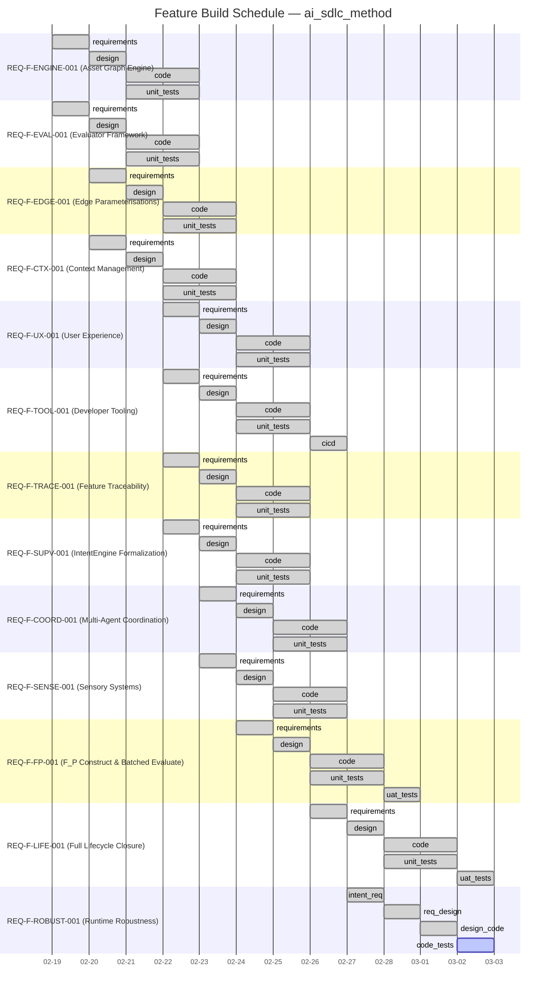

# Project Status — ai_sdlc_method

Generated: 2026-03-04T00:00:00Z

## Feature Build Schedule

```mermaid
gantt
    title Feature Build Schedule — ai_sdlc_method
    dateFormat YYYY-MM-DD
    axisFormat %m-%d

    section REQ-F-ENGINE-001 (Asset Graph Engine)
    requirements :done, eng-req, 2026-02-19, 1d
    design       :done, eng-des, after eng-req, 1d
    code         :done, eng-cod, after eng-des, 2d
    unit_tests   :done, eng-tst, after eng-des, 2d

    section REQ-F-EVAL-001 (Evaluator Framework)
    requirements :done, eva-req, 2026-02-19, 1d
    design       :done, eva-des, after eva-req, 1d
    code         :done, eva-cod, after eva-des, 2d
    unit_tests   :done, eva-tst, after eva-des, 2d

    section REQ-F-EDGE-001 (Edge Parameterisations)
    requirements :done, edg-req, 2026-02-20, 1d
    design       :done, edg-des, after edg-req, 1d
    code         :done, edg-cod, after edg-des, 2d
    unit_tests   :done, edg-tst, after edg-des, 2d

    section REQ-F-CTX-001 (Context Management)
    requirements :done, ctx-req, 2026-02-20, 1d
    design       :done, ctx-des, after ctx-req, 1d
    code         :done, ctx-cod, after ctx-des, 2d
    unit_tests   :done, ctx-tst, after ctx-des, 2d

    section REQ-F-UX-001 (User Experience)
    requirements :done, ux-req, 2026-02-22, 1d
    design       :done, ux-des, after ux-req, 1d
    code         :done, ux-cod, after ux-des, 2d
    unit_tests   :done, ux-tst, after ux-des, 2d

    section REQ-F-TOOL-001 (Developer Tooling)
    requirements :done, tl-req, 2026-02-22, 1d
    design       :done, tl-des, after tl-req, 1d
    code         :done, tl-cod, after tl-des, 2d
    unit_tests   :done, tl-tst, after tl-des, 2d
    cicd         :done, tl-ci,  after tl-tst, 1d

    section REQ-F-TRACE-001 (Feature Traceability)
    requirements :done, tr-req, 2026-02-22, 1d
    design       :done, tr-des, after tr-req, 1d
    code         :done, tr-cod, after tr-des, 2d
    unit_tests   :done, tr-tst, after tr-des, 2d

    section REQ-F-SUPV-001 (IntentEngine Formalization)
    requirements :done, sp-req, 2026-02-22, 1d
    design       :done, sp-des, after sp-req, 1d
    code         :done, sp-cod, after sp-des, 2d
    unit_tests   :done, sp-tst, after sp-des, 2d

    section REQ-F-COORD-001 (Multi-Agent Coordination)
    requirements :done, co-req, 2026-02-23, 1d
    design       :done, co-des, after co-req, 1d
    code         :done, co-cod, after co-des, 2d
    unit_tests   :done, co-tst, after co-des, 2d

    section REQ-F-SENSE-001 (Sensory Systems)
    requirements :done, se-req, 2026-02-23, 1d
    design       :done, se-des, after se-req, 1d
    code         :done, se-cod, after se-des, 2d
    unit_tests   :done, se-tst, after se-des, 2d

    section REQ-F-FP-001 (F_P Construct & Batched Evaluate)
    requirements :done, fp-req, 2026-02-24, 1d
    design       :done, fp-des, after fp-req, 1d
    code         :done, fp-cod, after fp-des, 2d
    unit_tests   :done, fp-tst, after fp-des, 2d
    uat_tests    :done, fp-uat, after fp-tst, 1d

    section REQ-F-LIFE-001 (Full Lifecycle Closure)
    requirements :done, li-req, 2026-02-26, 1d
    design       :done, li-des, after li-req, 1d
    code         :done, li-cod, after li-des, 2d
    unit_tests   :done, li-tst, after li-des, 2d
    uat_tests    :done, li-uat, after li-tst, 1d

    section REQ-F-ROBUST-001 (Runtime Robustness)
    intent_req   :done,   ro-ir, 2026-02-27, 1d
    req_design   :done,   ro-rd, after ro-ir, 1d
    design_code  :done,   ro-dc, after ro-rd, 1d
    code_tests   :active, ro-ct, after ro-dc, 1d
```

## Phase Completion Summary

| Phase | Converged | In Progress | Pending | Blocked |
|-------|-----------|-------------|---------|---------|
| requirements | 12 | 0 | 0 | 0 |
| design | 12 | 0 | 0 | 0 |
| code | 13 | 0 | 0 | 0 |
| unit_tests | 12 | 1 | 0 | 0 |
| uat_tests | 2 | 0 | 0 | 0 |
| cicd | 1 | 0 | 0 | 0 |
| **Total** | **52** | **1** | **0** | **0** |

Note: REQ-F-ROBUST-001 shows `status: in_progress` at feature level but all 4 trajectory edges are `converged` — stale status flag; needs housekeeping closure.

## Active Features

### In Progress (1)

| Feature | Title | Current Edge | Note |
|---------|-------|-------------|------|
| REQ-F-ROBUST-001 | Runtime Robustness for F_P | code_unit_tests | All edges converged — needs feature-level closure |

### Converged (12)

| Feature | Title | Profile |
|---------|-------|---------|
| REQ-F-ENGINE-001 | Asset Graph Engine | standard |
| REQ-F-EVAL-001 | Evaluator Framework | standard |
| REQ-F-EDGE-001 | Edge Parameterisations | standard |
| REQ-F-CTX-001 | Context Management | standard |
| REQ-F-UX-001 | User Experience (Two-Command UX) | full |
| REQ-F-TOOL-001 | Developer Tooling | standard |
| REQ-F-TRACE-001 | Feature Vector Traceability | standard |
| REQ-F-SUPV-001 | IntentEngine Formalization | full |
| REQ-F-COORD-001 | Multi-Agent Coordination | full |
| REQ-F-SENSE-001 | Sensory Systems | full |
| REQ-F-FP-001 | F_P Construct & Batched Evaluate | full |
| REQ-F-LIFE-001 | Full Lifecycle Closure | full |

## Next Actions

1. **Complete ADR-022 instance graph** — tasks 5-6 remaining (add zoom overlay, topology version check)

---

## Process Telemetry

### Convergence Pattern
- 13 features total; 12 converged (92.3%), 1 stale-in-progress
- All tracked edges on converged features: 55/55 (100%)
- **Anomaly**: REQ-F-ROBUST-001 top-level `status: in_progress` not updated after last edge converged 2026-02-27 — 5-day stale
- No stuck features; no time-box expirations

### Traceability Coverage (from /gen-gaps 2026-03-03)
- Spec REQ keys: 79 defined (74 original + 5 from ADR-S-009/010/011)
- Code Implements: tags: 16 core files untagged; 63/74 spec keys partially or not traced
- Test Validates: tags: 11/74 partial coverage, 63/74 zero coverage (85.1% gap)
- Orphan keys: 11 REQ-F-FPC-* in code+tests with no spec anchor (critical)
- Telemetry: 0/74 keys have `req=` runtime observability

### Unactioned Signals (14)

| Intent ID | Severity | Trigger Summary |
|-----------|----------|----------------|
| INT-GAPS-001 | **critical** | 11 orphan REQ-F-FPC-* keys implemented but not in spec |
| INT-GAPS-002 | **high** | 16 core files with no Implements: REQ-* tags |
| INT-TELEM-002 | **high** | 17 implemented REQ keys with no runtime telemetry |
| INT-GAP-ORPHAN-001 | **high** | 3 orphan REQ keys in tests not in spec |
| INT-GAPS-003 | **high** | 63/74 spec REQ keys with zero test coverage |
| INT-TELEM-001 | medium | 69 uncovered REQ keys without telemetry |
| INT-GAPS-004 | medium | 0 production files with req= telemetry tags |
| INT-TELEM-003 | medium | 11 Phase 2 REQ keys with no implementation |
| INT-589-001 | medium | 3 REQ keys missing Implements: in fp_construct |
| INT-589-002 | medium | 74 REQ keys with zero telemetry coverage |
| INT-GAP-TEL-001 | medium | 64 REQ keys without telemetry coverage |
| INT-GAP-001 (×2) | low/med | Various gap detections |
| INT-GAP-TAG-001 | low | 8 REQ keys missing Validates: tags |
| INT-AISDLC-001 | — | Original design intent (2026-02-19) |

**Pattern**: Gap analysis runs surface recurring traceability issues but no proposals have been promoted to spec changes. Consciousness loop Stage 2 (Affect Triage → `feature_proposal`) is not implemented — signals accumulate without triage or action.

## Self-Reflection — Feedback → New Intent

| Signal | Observation | Recommended Action |
|--------|-------------|-------------------|
| TELEM-001 | 14 unactioned `intent_raised` — no triage pipeline | Implement feature_proposal pipeline (Stage 2+3, ACTIVE_TASKS.md) |
| TELEM-002 | REQ-F-ROBUST-001 stale `in_progress` despite all edges converged | Add lifecycle auto-close rule or explicit convergence ceremony |
| TELEM-003 | INT-GAPS-001 critical: 11 REQ-F-FPC-* orphan keys | Retire or promote FPC keys to spec — blocks traceability closure |
| TELEM-004 | 63/74 spec REQ keys zero test coverage despite 950+ tests | Tests exist; annotation (Validates: tags) pass would surface real coverage gap vs tagging gap |
| TELEM-005 | ADR-022 instance graph in progress (tasks 4-6 remaining) | Complete before v3.1 — monitor shows static topology not live instance graph |
