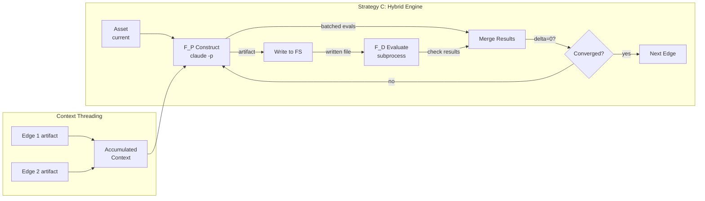

# F_P Construct & Batched Evaluate — Requirements

**Feature**: REQ-F-FP-001
**Version**: 1.0.0
**Traces To**: INT-AISDLC-001, Appendix A of FUNCTOR_FRAMEWORK_DESIGN.md
**Date**: 2026-02-27

---

## Overview

The engine (Strategy B) evaluates assets against edge checklists but cannot construct them. F_P Construct adds LLM-driven artifact generation to the engine, enabling Strategy C (cross-validating hybrid): the engine orchestrates construction via one LLM call per edge, then validates the result with deterministic checks (F_D). This closes the construct gap that makes the engine a builder, not just an evaluator.

**Scope**: `imp_claude/code/genisis/` — new module `fp_construct.py`, modifications to `engine.py` and `__main__.py`, new data models in `models.py`.

**Out of scope**: Algorithmic zoom (Appendix C), recursive spawn (Appendix D), RLM execution model (Appendix B). These depend on F_P construct but are separate features.

---

## Terminology

| Term | Definition |
|------|-----------|
| **F_P construct** | An LLM call that generates or modifies an artifact for a given graph edge. The "P" in F_P denotes probabilistic (LLM-based) compute. |
| **Batched evaluate** | Combining artifact construction and agent evaluation into a single LLM call per edge, eliminating per-check cold starts. |
| **Strategy C** | Cross-validating hybrid: engine delta_D (deterministic, Level 4) as hard gate, LLM delta_P (probabilistic) as soft construction. |
| **Context accumulation** | Artifacts from edge N become explicit context for edge N+1, maintaining coherence across the graph traversal. |
| **Cold start** | A fresh `claude -p` subprocess with no shared context from prior calls. The current engine makes 33+ cold starts per traversal. |
| **Construct result** | Structured JSON returned by the LLM containing: the generated artifact, self-evaluation results, and traceability tags. |

---

## Functional Requirements

### REQ-F-FPC-001: LLM Construct Per Edge

**Priority**: Critical
**Type**: Functional

**Description**: The engine shall call an LLM once per edge to construct or modify the asset before evaluation. The construct call receives the current asset (empty for first iteration), accumulated context from prior edges, and all evaluator criteria for the edge.

**Acceptance Criteria**:
- `run_construct()` takes: edge name, current asset content, accumulated context, edge config, model name, timeout
- `run_construct()` returns a `ConstructResult` containing: the generated artifact text, self-evaluation results, and traceability tags
- The LLM call uses `claude -p` with a structured JSON output schema
- One LLM call per edge per iteration (not per check)
- Construct is skipped when `construct=False` or `--evaluate-only` mode (backward compat with current engine)

**Traces To**: INT-AISDLC-001 | REQ-ITER-001 (construct is phase 1 of iterate)

---

### REQ-F-FPC-002: Batched Agent Evaluation

**Priority**: Critical
**Type**: Functional

**Description**: The construct call shall include all agent evaluation criteria for the edge, and the LLM shall return per-check pass/fail results alongside the constructed artifact. This eliminates per-check cold starts.

**Acceptance Criteria**:
- The construct prompt includes all `type: agent` checks from the edge's checklist
- The LLM response includes a `evaluations` array with one entry per agent check: `{check_name, outcome: pass|fail, reason}`
- Agent evaluation results from the construct call are used directly — no separate `fp_evaluate` calls needed for checks covered in the batch
- Any agent checks NOT in the batch (e.g., added after construct) fall back to individual `fp_evaluate` calls
- The engine merges batched results with F_D results into a single `EvaluationResult`

**Traces To**: INT-AISDLC-001 | REQ-EVAL-002 (evaluator composition per edge)

---

### REQ-F-FPC-003: Context Accumulation

**Priority**: High
**Type**: Functional

**Description**: Constructed artifacts from edge N shall become explicit context for edge N+1 during a full graph traversal. The engine must thread context between `run_edge()` calls.

**Acceptance Criteria**:
- `run()` passes constructed artifacts from completed edges as context to subsequent edges
- Context format: each prior artifact identified by edge name and content
- Context is additive — each edge adds to the accumulated context, never removes
- Context size is bounded — the engine truncates or summarises if accumulated context exceeds a configurable token limit
- The first edge receives only the intent document and project constraints as context

**Traces To**: INT-AISDLC-001 | REQ-ITER-001 (Context[] parameter)

---

### REQ-F-FPC-004: Engine Loop Integration

**Priority**: Critical
**Type**: Functional

**Description**: `iterate_edge()` in `engine.py` shall support an optional construct phase before evaluation. When construct is enabled, the engine calls `run_construct()` first, writes the artifact, then evaluates with the full checklist (F_D + remaining F_P + F_H).

**Acceptance Criteria**:
- `iterate_edge()` accepts a `construct` boolean parameter (default: False for backward compat)
- When `construct=True`: call `run_construct()` → write artifact → run F_D checks against written artifact → merge batched F_P results → compute delta
- When `construct=False`: current behaviour (evaluate only, no artifact generation)
- The construct result is included in the emitted `iteration_completed` event
- Construct failures (LLM timeout, malformed JSON, empty artifact) are recorded as `CheckOutcome.ERROR` and increment delta

**Traces To**: INT-AISDLC-001 | REQ-ITER-001 (universal iterate), REQ-SUPV-003 (failure observability)

---

### REQ-F-FPC-005: CLI Construct Mode

**Priority**: High
**Type**: Functional

**Description**: The engine CLI shall support a `construct` subcommand that constructs an artifact for a given edge and feature, then evaluates it.

**Acceptance Criteria**:
- `python -m genisis construct --edge "design→code" --feature "REQ-F-FP-001" --asset path/to/file --context "prior artifacts"` constructs + evaluates
- The existing `evaluate` subcommand remains unchanged (evaluate only, no construct)
- The existing `run-edge` subcommand gains a `--construct` flag to enable construct+evaluate loop
- Output JSON includes both construct result and evaluation result
- `--deterministic-only` still skips agent checks in the evaluation phase (but construct is always LLM)

**Traces To**: INT-AISDLC-001 | REQ-TOOL-003 (workflow commands)

---

### REQ-F-FPC-006: Construct Output Schema

**Priority**: High
**Type**: Functional

**Description**: The LLM construct call shall return a structured JSON response conforming to a defined schema, enabling deterministic parsing by the engine.

**Acceptance Criteria**:
- Schema: `{"artifact": string, "evaluations": [{"check_name": string, "outcome": "pass"|"fail", "reason": string}], "traceability": [string], "source_findings": [{"description": string, "classification": string}]}`
- The engine validates the response against the schema before accepting it
- Malformed responses trigger retry (up to 2 retries) before recording as ERROR
- The `traceability` array must contain at least one REQ key tag
- The `artifact` field must be non-empty

**Traces To**: INT-AISDLC-001 | REQ-ITER-003 (functor encoding tracking)

---

## Non-Functional Requirements

### REQ-NFR-FPC-001: Cost Efficiency

**Priority**: High
**Type**: Non-Functional

**Description**: A full 4-edge graph traversal with F_P construct shall require at most 4 LLM calls (one per edge) for the construction phase, plus any F_D subprocess calls.

**Acceptance Criteria**:
- Maximum 1 `claude -p` call per edge per iteration for construct+batched-evaluate
- F_D checks remain free (subprocess calls, no LLM)
- Target: 4 LLM calls for intent→requirements→design→code↔tests traversal
- Measurable: count `claude -p` invocations per `run()` call

**Traces To**: INT-AISDLC-001 | FRAMEWORK_COMPARISON_ANALYSIS.md (cost model)

---

### REQ-NFR-FPC-002: Backward Compatibility

**Priority**: Critical
**Type**: Non-Functional

**Description**: All existing engine functionality shall continue to work unchanged when construct is not enabled.

**Acceptance Criteria**:
- `evaluate` subcommand: identical behaviour, identical output schema
- `run-edge` without `--construct`: identical behaviour
- All existing 950+ tests pass without modification
- `--deterministic-only` mode: identical behaviour

**Traces To**: INT-AISDLC-001

---

### REQ-NFR-FPC-003: Timeout and Error Handling

**Priority**: High
**Type**: Non-Functional

**Description**: LLM construct calls shall respect configurable timeouts and handle failures gracefully.

**Acceptance Criteria**:
- `--timeout` flag controls construct call timeout (default: 120s)
- Timeout produces `CheckOutcome.ERROR` with descriptive message, not a crash
- Malformed JSON response: retry up to 2 times, then ERROR
- Empty artifact: recorded as ERROR, delta incremented
- All construct failures emitted as events (REQ-SUPV-003 failure observability)

**Traces To**: INT-AISDLC-001 | REQ-SUPV-003

---

## Data Requirements

### REQ-DATA-FPC-001: Construct Result Model

**Priority**: High
**Type**: Data Quality

**Description**: The engine shall define a `ConstructResult` data model capturing the output of an LLM construct call.

**Acceptance Criteria**:
- Fields: `artifact` (str), `evaluations` (list[dict]), `traceability` (list[str]), `source_findings` (list[dict]), `model` (str), `duration_ms` (int), `retries` (int)
- Serialisable to JSON for event emission
- Included in `IterationRecord` when construct is enabled

**Traces To**: INT-AISDLC-001 | REQ-ITER-003

---

## Business Rules

### REQ-BR-FPC-001: Construct Before Evaluate

**Priority**: Critical
**Type**: Business Rule

**Description**: When construct is enabled, the engine shall always construct before evaluating. The evaluation phase operates on the constructed artifact, not the original input.

**Acceptance Criteria**:
- Construct produces artifact → artifact written to filesystem → F_D evaluates written artifact
- The original asset content is preserved as backup before overwrite
- If construct fails, evaluation runs on the original asset (degraded mode)

**Traces To**: INT-AISDLC-001 | REQ-ITER-001

---

## Success Criteria

| Criterion | Measurable Outcome | REQ Keys |
|-----------|-------------------|----------|
| Engine can build | `python -m genisis construct` produces a valid artifact for at least one edge | REQ-F-FPC-001, REQ-F-FPC-005 |
| Cost target met | Full 4-edge traversal uses ≤4 LLM calls for construct | REQ-NFR-FPC-001 |
| Backward compat | All 950+ existing tests pass | REQ-NFR-FPC-002 |
| Cross-validation works | Engine F_D delta disagrees with LLM F_P evaluation on a known-bad artifact | REQ-F-FPC-004 |
| Context threads | Edge N+1 receives artifacts from edges 1..N | REQ-F-FPC-003 |

---

## Assumptions and Dependencies

**Dependencies**:
- Engine CLI (`__main__.py`) — exists, working
- Engine loop (`engine.py`) — exists, `iterate_edge()` and `run()` working
- F_D evaluate (`fd_evaluate.py`) — exists, working
- F_P evaluate (`fp_evaluate.py`) — exists, working (used as fallback for non-batched checks)
- Event emission (`fd_emit.py`) — exists, working

**Assumptions**:
- `claude -p` is available on the system PATH (Claude Code CLI)
- LLM can produce structured JSON when given a schema in the prompt
- One LLM call per edge is sufficient for both construct and agent evaluation (the batching assumption)
- Context accumulation does not exceed model context window for typical projects

---

