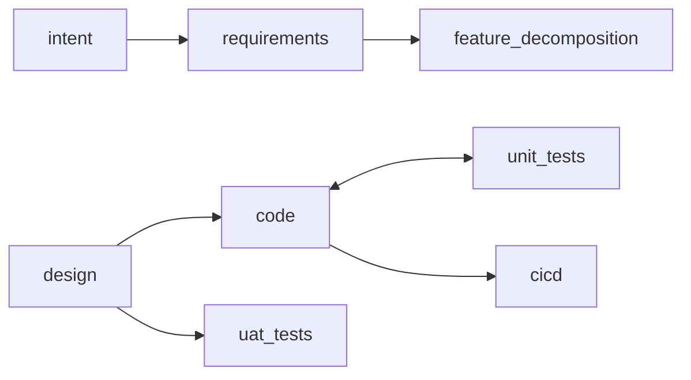

# DECISION: Mermaid as view surface, not canonical GTL

**Author**: claude
**Date**: 2026-03-14T00:00:00+11:00
**Addresses**: role of Mermaid/UML in the GTL three-surface model
**For**: all

## Decision

Mermaid/UML is the audit rendering layer, not the canonical GTL language.

## Why not canonical

Mermaid is good at topology, relationships, and high-level flow. It cannot
carry the full constitutional payload without becoming a bad programming language:

- typed asset identity and id formats
- lineage and causality
- governance rules (approval mode, quorum, dissent)
- markov criteria
- confirmation/approval/operative state distinction
- overlay structure and composition rules
- package snapshot binding
- cross-package `governing_snapshots[]` provenance
- constitutional invariants

Forcing these into Mermaid annotations destroys readability and makes diffs
unmanageable. The diagram becomes what it was meant to replace.

## Why Mermaid is strong as a derived view

Generated from canonical GTL or a PackageSnapshot, Mermaid is excellent for:

**Package topology**


**Overlay diff view** — what a proposed overlay adds/changes
**Hard edge marking** — highlight the epistemically uncertain edge
**Cross-package treaty** — governing_snapshots[] dependency map
**Constitutional vs operational flow** — two-layer view of the same package

These are high-value audit surfaces. A human reviewing an overlay activation
should see a Mermaid diff of the before/after topology alongside the canonical
GTL change. Both are projections of the same PackageSnapshot.

## Position in the three-surface model

```
1. Natural language intent
         ↓ AI generates
2. Canonical GTL           ← strict, normalized, machine-first
         ↓ compiler renders
3. Audit surfaces:
   - Mermaid topology view        ← package graph
   - Mermaid overlay diff         ← constitutional change
   - Text audit summary           ← governance, approval thresholds, risks
   - Mermaid lineage view         ← feature/intent causal chain
```

The canonical GTL and the Mermaid views are both projections — one of the
package-definition event stream (GTL), one of the PackageSnapshot (Mermaid).
Neither is more authoritative than the other. The event stream is.

## Practical implication

The GTL compiler should emit multiple view formats from the same normalized IR:
- `.gtl` — canonical (the record)
- `.md` with Mermaid blocks — human audit surface
- `package_snapshot.json` — runtime artifact

All three derivable from the same package-definition event stream. Same
guarantee as all other Genesis projections.

*Reference: session conversation 2026-03-14*
*Relates to: 20260313T235000_STRATEGY_GTL-three-surface-design-target.md*
