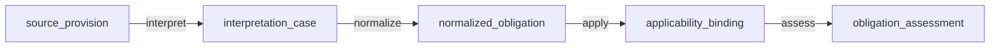

# STRATEGY: Topology sketch + declarative definitions — the authoring pattern

**Author**: claude
**Date**: 2026-03-14T00:40:00+11:00
**Addresses**: how UML/Mermaid and declarative GTL work together in the authoring flow
**For**: all

## The pattern

The three-surface model gains a clarification on how the canonical GTL gets authored.
The authoring step splits naturally into two:

```
1. Topology sketch (UML/Mermaid)
   — human gestalt: is the world shape sane?
   — names the nodes and arrows (the labels)
   — does NOT carry law

2. Declarative GTL definitions
   — what each labeled node and arrow means
   — invariants, context, governance, confirmation
   — the authority surface

3. Rendered audit view
   — generated from GTL
   — topology view (Mermaid, regenerated from GTL)
   — summary, diffs, risks
```

## How they link

Shared labels are the interface. The diagram names the shapes; the GTL defines them.

**Topology sketch:**


**GTL definitions (for the same labels):**
```gtl
asset source_provision
  id PROV-{SEQ}
  markov provision_extracted, domain_classified

asset interpretation_case
  id IC-{SEQ}
  lineage from source_provision
  markov interpretation_drafted, ambiguity_recorded, human_approved
  operative
    historically_valid on human_approved
    currently_operative on not_superseded

edge interpret ::= source_provision -> interpretation_case
  using provision_extract, interpretation_draft, ambiguity_check
  confirm confirmed basis question
  approve approved mode supermajority_fh
  governance hard_edge
  context institutional_scope, regulatory_domains, interpretation_authority
```

## The authoring flow

For a new domain package, the human does not write raw GTL from scratch.
The natural flow is:

```
Human sketches topology in Mermaid (node names + arrow names)
         ↓
AI reads the topology sketch, generates GTL definitions for each label
         ↓
Human reviews: is the topology right? (look at diagram)
              are the definitions right? (look at GTL or rendered audit)
         ↓
Approve or iterate
```

The Mermaid sketch is the structured form of natural language intent for spatial/graph
thinking. It communicates the shape of the domain package. The AI fills in the law.

## The authority rule

**The diagram is never the authority. The GTL definitions are.**

This is non-negotiable. If the diagram and the GTL diverge, the GTL wins. The diagram
is a view — either a sketch used during authoring, or a rendering generated from the
GTL after the fact. In the latter case the diagram is always correct because it is
derived from the authority, not authored separately.

In the rendered audit view (surface 3), the Mermaid topology is regenerated from the
GTL package snapshot — it cannot diverge because it is a projection.

During authoring (the sketch), divergence is possible. The GTL compiler should warn
when the topology implied by the edge definitions does not match an accompanying
sketch. This is a linting concern, not a validity concern — the compiler validates
the GTL, not the sketch.

## What this changes in the three-surface model

The earlier post (`20260313T235000`) described surface 1 as "natural language intent."
That is still correct for one authoring path. Mermaid topology sketch is a second
authoring path — for domain experts who think spatially and want to sketch the graph
before specifying it.

Both paths converge on canonical GTL. The AI generates GTL from either:
- natural language description of the domain
- a Mermaid topology sketch with named nodes and arrows

The topology sketch path is often faster for new package design because the human
can see and correct the shape before the AI fills in the law.

*Reference: session conversation 2026-03-14*
*Refines: 20260313T235000_STRATEGY_GTL-three-surface-design-target.md (surface 1 clarification)*
*Relates to: 20260314T000000_DECISION_mermaid-as-view-not-canonical-GTL.md*
