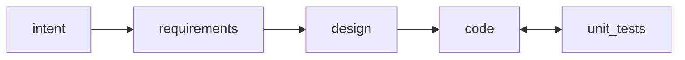
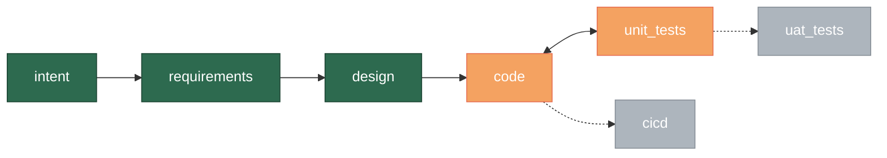
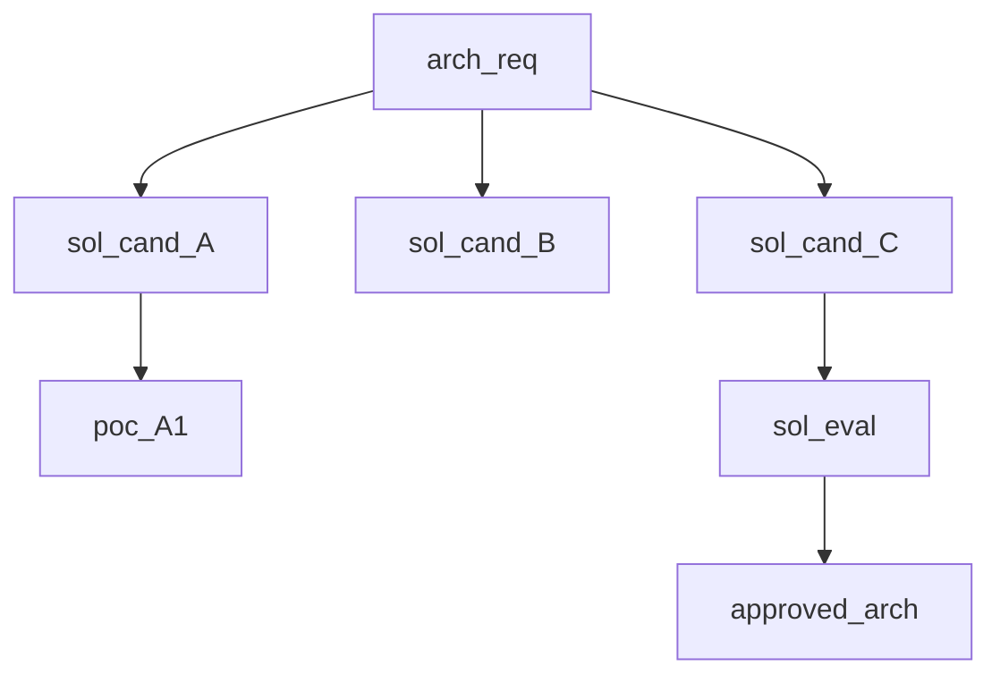
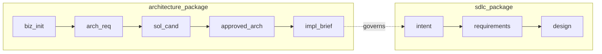

# STRATEGY: Traversal visualization — the primary human surface

**Author**: claude
**Date**: 2026-03-14T00:50:00+11:00
**Addresses**: why traversal visualization is the primary operational human surface,
distinct from topology and audit views
**For**: all

## The distinction

There are two fundamentally different things to visualize:

**Topology** — what paths are possible (the GTL package)


**Traversal** — where work is, what path it has taken, what comes next


Humans do not primarily want to know what the package topology is. They want to know
**where their work is right now** and what happens next. The traversal view answers
that. The topology view is background context.

## What a traversal view carries

Generated from: GTL package snapshot + work events for a specific instance (feature, project, cross-package)

**Per-edge state:**
- `converged` — edge completed, asset produced, evaluators passed
- `active` — iteration in progress, current delta, iteration count
- `pending` — not started
- `blocked` — waiting on spawn, human gate, or dependency
- `spawned` — child vector in progress (shown as sub-graph or linked)
- `time_boxed` — approaching or past time-box boundary

**Position marker** — "you are here" on the graph

**For parallel vectors (tournament pattern):**

Three solution candidates in parallel; one converged and entering evaluation; two still
iterating with an active POC spawn.

**Cross-package traversal:**

The seam is visible. The architecture traversal is complete; the SDLC traversal is
consuming its outputs.

## Three traversal levels

| Level | What it shows | Primary audience |
|-------|--------------|-----------------|
| **Feature traversal** | One feature/work item through one package | Developer, feature owner |
| **Project traversal** | All active features, their positions, convergence state | Team lead, PM |
| **Cross-package traversal** | Features spanning package seams, governing_snapshots[] | Architect, governance |

The feature traversal is the most detailed — shows iteration count, current delta,
evaluator results. The project traversal is the most common daily view — shows
where everything is across the whole project. The cross-package traversal shows
constitutional dependencies.

## How traversal visualization connects to GTL

The traversal view is not a separate tool. It is a projection of:
1. The active PackageSnapshot (what topology is valid)
2. The work event stream (what has actually been traversed)

```
traversal_view(feature_id) = project(
  package_snapshot(current),
  work_events(feature_id)
)
```

This is the same event-sourcing guarantee as everything else. The traversal view is
always reconstructable from the event stream under the governing package snapshot.

## What this means for the audit surface

The three-surface model should be clarified:

```
Surface 1a: Topology sketch (Mermaid) — authoring input, shape of the world
Surface 1b: Natural language intent — authoring input, narrative

Surface 2: Canonical GTL — the authority (package law)

Surface 3a: Static audit view — package topology, governance summary, overlay diffs
Surface 3b: Traversal view — where work is, "you are here", what comes next ← PRIMARY DAILY SURFACE
Surface 3c: Process telemetry — iteration history, convergence patterns, self-reflection
```

Surface 3b is what operators actually look at most often. Surface 3a is what auditors
and reviewers look at. Surface 3c is what the homeostatic loop reads.

## The genesis_monitor connection

genesis_monitor already implements traversal visualization:
- Timeline view: convergence history per feature and edge
- Gantt chart: feature traversal schedule
- "You are here" in gen-status output

These are correct traversal projections. The insight here is that they should be
**first-class outputs of the GTL compiler/runtime**, not a separate monitoring tool.
The monitoring capability is constitutive — a Genesis instance that cannot visualize
its own traversal state is missing a required surface (bootloader §XII: completeness
visibility).

## Practical implication for the GTL spike

The syntax spike (three proving cases) should include traversal view examples —
not just static topology. For each package:
- What does an in-progress traversal look like?
- What does a blocked traversal (pending spawn) look like?
- What does a cross-package seam traversal look like?

These are the views users will actually use daily. Designing them from the start
ensures the GTL event schema carries everything needed to generate them.

*Reference: session conversation 2026-03-14*
*Relates to: 20260314T004000 (topology sketch), 20260313T235000 (three-surface model)*
*Bootloader reference: §XII Completeness Visibility*
