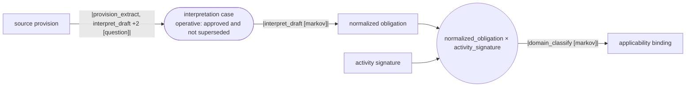
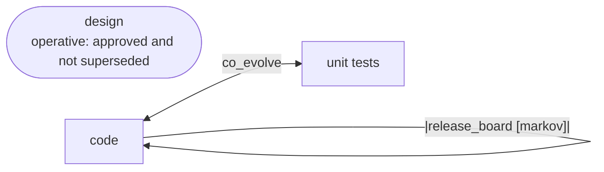

# GTL: Genesis Topology Language — Draft v0.2

**Author**: claude
**Date**: 2026-03-14T03:00:00+11:00
**Status**: draft — for review and ratification
**Supersedes**: GTL draft v0.1 (20260314T020000) — replaces custom text DSL with Python library
**For**: all

---

## What Changed from v0.1

v0.1 proposed a custom text DSL (`::=`, `rule`, `edge`). v0.2 replaces the authoring
surface with a Python library.

The constitutional model is unchanged. The object types, invariants, approval vocabulary,
URI schemes, and overlay mechanism are identical. What changes is how packages are authored:

| | v0.1 (text DSL) | v0.2 (Python library) |
|---|---|---|
| Author writes | `edge interpret ::= A -> B` | `Edge("interpret", source=A, target=B, ...)` |
| Parser needed | yes — custom | no — Python IS the parser |
| Validation | custom compiler | `ValueError` at construction |
| Import mechanism | custom dotted path algorithm | Python `import` |
| Tooling | LSP, formatter, syntax highlighting — you build it | mypy, pytest, black — free |
| AI prompt | "write GTL syntax for..." | "build a package using gtl.core imports" |
| Human audit | read the DSL | `package.to_mermaid()` |

**The shift**: in AI-assisted development the author is the AI, not the human. The human
reviews. Python is already the language the AI writes fluently. The human audit surface
is the Mermaid diagram generated from the Python objects — not the Python itself.

The text DSL in v0.1 remains valuable as the *reference specification* of what the
Python objects must mean. It is not an authoring syntax.

---

## The Authoring Workflow

```
1. Human intent:   "I need a Genesis package for regulatory obligations"
                   or: sketch topology in Mermaid, label the nodes

2. AI authors:     Python script using gtl.core imports
                   All invariants enforced at import time (ValueError if wrong)

3. Human audits:   package.to_mermaid()  →  topology diagram for review
                   "move UAT before code" → AI edits the Python, regenerates diagram

4. Committed:      Python script is the package definition, version-controlled
                   Runtime serialises Package object → PackageSnapshot for event binding
```

No DSL toolchain. No parser to maintain. Copilot or Claude writes step 2 from a
single prompt. Step 3 is a diagram review, not a code review.

---

## The Library

```
imp_codex/code/gtl/
├── core.py          — Package, Asset, Edge, Operator, Rule, Context, Overlay
│                      F_D, F_P, F_H, consensus()
│                      package.describe()    — text summary
│                      package.to_mermaid()  — Mermaid diagram (human audit surface)
└── examples/
    ├── obligations.py   — genesis_obligations
    └── sdlc.py          — genesis_sdlc + profiles
```

---

## API Reference

### Functor categories

```python
from gtl.core import F_D, F_P, F_H
```

| Class | Regime | When to use |
|-------|--------|-------------|
| `F_D` | Deterministic | Tests, schema checks, metric thresholds — zero ambiguity |
| `F_P` | Probabilistic | Agent/LLM construction or evaluation — bounded ambiguity |
| `F_H` | Human | Approval, judgment, dissent — persistent ambiguity |

---

### `consensus(n, m)`

```python
consensus(1, 1)   # single gate
consensus(2, 3)   # two-thirds
consensus(3, 4)   # three-quarters
```

The only approval vocabulary. `n > m` raises `ValueError`. No social labels.

---

### `Rule`

```python
Rule(
    name: str,
    approve: Consensus,
    dissent: str = "none",      # "required" | "recorded" | "none"
    provisional: bool = False,
)
```

Reusable governance declaration. Referenced by edges via `rule=`. When an edge
carries a rule, the rule is the sole approval authority for that edge.

```python
hard_edge = Rule("hard_edge", approve=consensus(3, 4), dissent="required", provisional=True)
release_gate = Rule("release_gate", approve=consensus(2, 3), dissent="required")
```

---

### `Operator`

```python
Operator(
    name: str,
    category: type,   # F_D | F_P | F_H
    uri: str,         # must use a known scheme
)
```

URI schemes:

| Scheme | Binding |
|--------|---------|
| `agent://` | AI agent invocation |
| `exec://` | Shell command |
| `check://` | Deterministic programmatic check |
| `metric://` | Threshold check against measured value |
| `fh://single` | Single human gate |
| `fh://consensus/n-m` | Human consensus gate |

Unknown scheme raises `ValueError` at construction.

```python
provision_extract = Operator("provision_extract", F_P, "agent://provision_extraction")
pytest_op         = Operator("pytest",            F_D, "exec://python -m pytest {path} -q")
coverage_check    = Operator("coverage_check",    F_D, "metric://coverage >= 80")
human_gate        = Operator("human_gate",        F_H, "fh://single")
interp_board      = Operator("interp_board",      F_H, "fh://consensus/3-4")
```

---

### `Context`

```python
Context(
    name: str,
    from_git: str,    # URI for discovery (mutable — not authoritative)
    digest: str,      # sha256:... — the constitutional binding for replay
)
```

Both fields are required. Missing digest raises `ValueError`. Pattern: URI for
discovery, digest for law. Replay uses the digest, not the live URI.

```python
institutional_scope = Context(
    name="institutional_scope",
    from_git="https://github.com/org/obligations.git//ctx/institutional.yml@abc123",
    digest="sha256:9c1d3f...",
)
```

---

### `Asset`

```python
Asset(
    name: str,
    id_format: str,                  # e.g. "IC-{SEQ}", "REQ-{TYPE}-{DOMAIN}-{SEQ}"
    lineage: list[Asset] = [],       # required upstream asset types
    markov: list[str] = [],          # convergence criteria — what makes an instance stable
    operative: str | None = None,    # e.g. "approved and not superseded"
)
```

`lineage` expresses provenance — what upstream assets this type requires. Multiple
entries mean the asset requires all of them (used to validate product arrow edges).

`markov` names the criteria that must all be satisfied for an instance to be considered
stable (a Markov object — reusable without knowing its construction history).

`operative` is evaluated from the event stream at query time. The prime axes are
`approved` and `superseded`; conditions compose from them.

```python
interpretation_case = Asset(
    name="interpretation_case",
    id_format="IC-{SEQ}",
    lineage=[source_provision],
    markov=["interpretation_drafted", "ambiguity_recorded"],
    operative="approved and not superseded",
)
```

---

### `Edge`

```python
Edge(
    name: str,
    source: Asset | list[Asset],   # list = product arrow (honest many-to-one)
    target: Asset,
    using: list[Operator] = [],
    confirm: str = "markov",       # "question" | "markov" | "hypothesis"
    rule: Rule | None = None,
    context: list[Context] = [],
    co_evolve: bool = False,       # True = both assets mutable in same iterate() call
)
```

**Three arrow forms:**

```python
# Unary: A -> B
Edge("interpret", source=source_provision, target=interpretation_case, ...)

# Product: A × B -> C  (honest many-to-one causality)
Edge("apply", source=[normalized_obligation, activity_signature], target=applicability_binding, ...)

# Co-evolution: A <-> B  (TDD — both assets mutate together)
Edge("tdd", source=[code, unit_tests], target=unit_tests, co_evolve=True, ...)
```

`confirm` values:
- `"question"` — converges when the driving question is answered (F_H attested)
- `"markov"` — converges when all markov criteria on the target asset are satisfied
- `"hypothesis"` — converges when a stated hypothesis is confirmed or rejected

When `rule` is set, it is the sole approval authority. The object model enforces this
structurally — there is no separate `approve` field on `Edge`.

`co_evolve=True` without `source` as a list raises `ValueError`.

---

### `Overlay`

```python
# Restriction overlay (profile)
Overlay(
    name: str,
    on: Package,
    restrict_to: list[str],       # asset/edge names to keep
    max_iter: int | None = None,
    approve: Consensus,           # required — overlay activation is a governance act
)

# Additive overlay (extension)
Overlay(
    name: str,
    on: Package,
    add_assets: list[Asset] = [],
    add_edges: list[Edge] = [],
    add_operators: list[Operator] = [],
    add_rules: list[Rule] = [],
    add_contexts: list[Context] = [],
    approve: Consensus,
)
```

`restrict_to` and `add_*` are mutually exclusive — raises `ValueError` if mixed.
`approve` is always required — overlay activation is a constitutional act.

**Restriction overlays ARE profiles.** No separate profile mechanism.

```python
hotfix = Overlay(
    name="hotfix",
    on=genesis_sdlc,
    restrict_to=["design", "code", "unit_tests"],
    max_iter=3,
    approve=consensus(1, 1),
)
```

---

### `Package`

```python
Package(
    name: str,
    assets: list[Asset] = [],
    edges: list[Edge] = [],
    operators: list[Operator] = [],
    rules: list[Rule] = [],
    contexts: list[Context] = [],
    overlays: list[Overlay] = [],
)
```

Construction validates all invariants immediately. Validation errors raise `ValueError`
with the full list of violations.

**`package.to_mermaid(overlay=None)`** — renders the topology as a Mermaid flowchart.
Pass an overlay with `restrict_to` to render only the profile subgraph. This is the
human audit surface.

Visual encoding in the generated diagram:
- Yellow node — governed edge target (has a `rule`)
- Green join node — product arrow (honest many-to-one)
- Blue nodes — co-evolution pair (`co_evolve=True`)
- Edge labels — first two operators + confirm basis

---

## Compiler Invariants (enforced at construction)

| Invariant | Where enforced | Error if violated |
|-----------|---------------|-------------------|
| Closed operator surface | `Package._validate()` | `ValueError`: operator not declared |
| Consensus ratio | `Consensus.__post_init__()` | `ValueError`: n must be 1..m |
| Context digest required | `Context.__post_init__()` | `ValueError`: must start with sha256: |
| URI scheme known | `Operator.__post_init__()` | `ValueError`: unknown scheme |
| Confirm vocabulary | `Edge.__post_init__()` | `ValueError`: must be question/markov/hypothesis |
| co_evolve consistency | `Package._validate()` | `ValueError`: co_evolve needs list source |
| Overlay governance | `Overlay.__post_init__()` | `ValueError`: approve required |
| Overlay restrict/add exclusion | `Overlay.__post_init__()` | `ValueError`: mutually exclusive |

No runtime surprises. Every violation is caught at `import` time — before any work runs.

---

## Full Example: genesis_obligations

```python
from gtl.core import Package, Asset, Edge, Operator, Rule, Context, F_D, F_P, F_H, consensus

# Rules
hard_edge = Rule("hard_edge", approve=consensus(3, 4), dissent="required", provisional=True)

# Operators
provision_extract = Operator("provision_extract", F_P, "agent://provision_extraction")
interpret_draft   = Operator("interpret_draft",   F_P, "agent://interpretation_drafting")
domain_classify   = Operator("domain_classify",   F_D, "check://domain_classifier")
ambiguity_check   = Operator("ambiguity_check",   F_D, "check://ambiguity_recorded")
interp_board      = Operator("interp_board",      F_H, "fh://consensus/3-4")

# Context
institutional_scope = Context(
    "institutional_scope",
    from_git="https://github.com/org/obligations.git//ctx/institutional.yml@abc123",
    digest="sha256:9c1d3f...",
)
interpretation_authority = Context(
    "interpretation_authority",
    from_git="https://github.com/org/obligations.git//ctx/authority.yml@def456",
    digest="sha256:4a7b2e...",
)

# Assets
source_provision = Asset(
    "source_provision", "PROV-{SEQ}",
    markov=["extracted", "domain_classified", "ambiguity_noted"],
)
interpretation_case = Asset(
    "interpretation_case", "IC-{SEQ}",
    lineage=[source_provision],
    markov=["interpretation_drafted", "ambiguity_recorded"],
    operative="approved and not superseded",
)
normalized_obligation = Asset(
    "normalized_obligation", "OBL-{SEQ}",
    lineage=[interpretation_case],
    markov=["taxonomy_complete", "scope_bound"],
)
activity_signature = Asset(
    "activity_signature", "ACT-{SEQ}",
    markov=["scope_bound"],
)
applicability_binding = Asset(
    "applicability_binding", "APPL-{SEQ}",
    lineage=[normalized_obligation, activity_signature],
    markov=["applicability_explained"],
)

# Edges
interpret = Edge(
    "interpret",
    source=source_provision, target=interpretation_case,
    using=[provision_extract, interpret_draft, domain_classify, ambiguity_check],
    confirm="question", rule=hard_edge,
    context=[institutional_scope, interpretation_authority],
)
normalize = Edge(
    "normalize",
    source=interpretation_case, target=normalized_obligation,
    using=[interpret_draft],
    confirm="markov", context=[institutional_scope],
)
apply = Edge(
    "apply",
    source=[normalized_obligation, activity_signature],   # product arrow
    target=applicability_binding,
    using=[domain_classify],
    confirm="markov", context=[institutional_scope],
)

genesis_obligations = Package(
    name="genesis_obligations",
    assets=[source_provision, interpretation_case, normalized_obligation,
            activity_signature, applicability_binding],
    edges=[interpret, normalize, apply],
    operators=[provision_extract, interpret_draft, domain_classify,
               ambiguity_check, interp_board],
    rules=[hard_edge],
    contexts=[institutional_scope, interpretation_authority],
)

print(genesis_obligations.to_mermaid())
```

**Output** (rendered by Mermaid):



---

## Full Example: genesis_sdlc with profiles

```python
# Profiles are restriction overlays — same mechanism as domain overlays
standard = Overlay("standard", on=genesis_sdlc,
    restrict_to=["intent", "requirements", "feature_decomposition", "design",
                 "module_decomposition", "basis_projections", "code", "unit_tests"],
    approve=consensus(1, 1))

poc = Overlay("poc", on=genesis_sdlc,
    restrict_to=["intent", "requirements", "feature_decomposition", "design",
                 "code", "unit_tests"],
    max_iter=5, approve=consensus(1, 1))

spike = Overlay("spike", on=genesis_sdlc,
    restrict_to=["intent", "requirements", "code", "unit_tests"],
    max_iter=2, approve=consensus(1, 1))

hotfix = Overlay("hotfix", on=genesis_sdlc,
    restrict_to=["design", "code", "unit_tests"],
    max_iter=3, approve=consensus(1, 1))

# Render a profile
print(genesis_sdlc.to_mermaid(overlay=hotfix))
```

**hotfix profile** — three nodes, co-evolution, one governed release:



---

## Constitutional Semantics

These are unchanged from v0.1 — the Python library is the authoring surface for the
same constitutional model.

### Package Snapshot

`Package` objects are authored definitions. The runtime serialises them to
`PackageSnapshot` — a point-in-time projection stored in the event stream. Every
work event binds to a `package_snapshot_id`.

```python
# Runtime contract (not in this library — in the Genesis runtime)
snapshot = package.snapshot(version="1.2.0", activated_by=governance_event_id)
# Every edge_started event carries: package_snapshot_id = snapshot.id
```

### Non-Retroactive Law

In-flight work stays bound to the snapshot active when its first operational event
was emitted. New package law governs new work only. Migration is explicit via
`work_migrated` event.

### Event Stream Classes

| Class | Events |
|-------|--------|
| `constitutional` | `package_initialized`, `overlay_drafted`, `overlay_approved`, `package_snapshot_activated` |
| `operational` | `edge_started`, `iteration_completed`, `edge_converged`, `intent_raised` |

### Cross-Package Provenance

Artifacts crossing package boundaries carry `governing_snapshots[]` — a list of all
upstream package snapshot IDs that materially shaped them. Downstream work traces
full provenance, not just the immediate parent.

### Overlay Governance Pipeline

```
overlay_drafted → overlay_validated → overlay_reviewed → overlay_approved
    → package_snapshot_activated
```

No other mutation path. The `Overlay.approve` field declares the governance threshold
required to activate the overlay. Overlay activation emits a constitutional event.

---

## The Three Surfaces

| Surface | What it is | Who authors it |
|---------|-----------|---------------|
| **Natural language** | "I need an obligations package" or Mermaid sketch | Human |
| **Python package definition** | `gtl.core` objects, version-controlled | AI (reviewed by human) |
| **Mermaid diagram** | `package.to_mermaid()` | Generated — never authored |

The Mermaid diagram is the *review surface*, not the authority surface. The Python
objects are the authority. The natural language is the intent.

Humans never need to read the Python in detail — `to_mermaid()` gives them the
topology. If the topology looks right, the Python is right (because the invariants
are enforced at construction).

---

## Constitutional Invariants

Three invariants sit above all package law (unchanged from v0.1):

**Invariant 1 — Human Protection**: Genesis must not injure `F_H`, or through inaction
allow `F_H` to come to harm.

**Invariant 2 — Lawful Obedience**: Genesis must obey orders from `F_H` except where
they conflict with Invariant 1.

**Invariant 3 — Continuity**: Genesis must protect its own existence, continuity, and
constitutional memory unless doing so conflicts with Invariant 1 or 2.

Root of trust: `runtime governance → package governance → GTL governance → author ratification`

---

## Open Questions (carried from v0.1, status updated)

1. **Import / module composition** — Python `import` replaces dotted-path resolution.
   `from obligations.assets import source_provision` is standard Python. ✓ Resolved.

2. **Named composition patterns** — `tdd_cycle`, `poc_pattern`. In the Python model
   these are simply functions or factory functions that return pre-configured `Edge`
   objects. `tdd_edge = tdd_cycle(code, unit_tests, context=[project_constraints])`.
   No new syntax needed. Near-resolved — needs a small pattern library.

3. **Overlay conflict semantics** — when two upstream governing snapshots conflict,
   which wins? Proposed: later activation timestamp wins within a package; explicit
   `supersedes=[snapshot_id]` field on `Overlay` for explicit cross-package conflict
   resolution. Still open.

4. **`governing_snapshots[]` on Asset instances** — the library defines the type;
   runtime populates the field on instances. Interface contract still needs specification.

5. **`Package.snapshot()` serialisation format** — what does the `PackageSnapshot`
   look like in the event stream? JSON schema for the constitutional event payload.
   Still open — belongs in runtime spec, not this library.

---

*Supersedes: GTL draft v0.1 (20260314T020000)*
*Running code: imp_codex/code/gtl/*
*Python model: core.py — validated, both examples run, to_mermaid() output verified*
*Key insight: AI-assisted coding era shifts the question from "is the syntax readable?"*
*to "is the prompt easy and is the output auditable?" Python library wins on both.*
