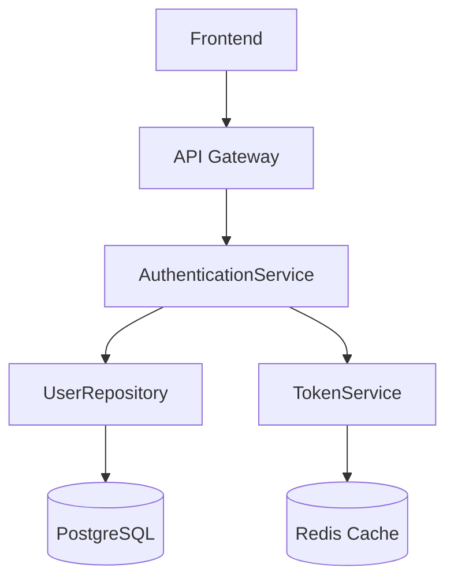

# How Claude Agents Work in the AI SDLC

**Purpose**: Explain the role and operation of AI agents (Claude) throughout the 7-stage AI SDLC methodology.

**Audience**: Developers, architects, and teams implementing AI-augmented development.

---

## 1. Overview: What Are Agents in AI SDLC?

### 1.1 Definition

**Agents** in the AI SDLC are **specialized AI assistants** (Claude instances) configured with specific roles, responsibilities, and context for each stage of the software development lifecycle.

**Key Concept**: Instead of one generic AI assistant helping with everything, the AI SDLC uses **7 specialized agents**, each expert in their stage:

```
Intent (INT-001)
    ↓
[Requirements Agent]    → Generate REQ-* keys
    ↓
[Design Agent]         → Create architecture
    ↓
[Tasks Agent]          → Break into work units
    ↓
[Code Agent]           → TDD implementation
    ↓
[System Test Agent]    → BDD integration tests
    ↓
[UAT Agent]            → Business validation
    ↓
[Runtime Feedback Agent] → Production monitoring
    ↓
New Intent → Cycle repeats
```

---

## 2. The 7 Specialized Agents

### 2.1 Requirements Agent

**Configuration**: [plugins/aisdlc-methodology/config/stages_config.yml:18-95](../plugins/aisdlc-methodology/config/stages_config.yml)

**Role**: "Intent Store & Traceability Hub"

**Responsibilities**:
- Transform raw intent into structured requirements
- Generate requirement artifacts with unique keys (REQ-F-*, REQ-NFR-*, REQ-DATA-*, REQ-BR-*)
- Process feedback from all downstream stages
- Maintain end-to-end traceability
- Collaborate with personas (Product Owner, Business Analyst, Data Steward)

**Inputs**:
- Raw business intent from Intent Manager
- Discovery results (analysis work)
- Governance/regulatory changes
- Feedback from all stages (design gaps, implementation discoveries)

**Outputs**:
```yaml
user_stories:
  format: "Given/When/Then or As-a/I-want/So-that"
  keys: "REQ-F-{DOMAIN}-{SEQUENCE}"
  example: "REQ-F-DEMO-AUTH-001"

non_functional_requirements:
  keys: "REQ-NFR-{CATEGORY}-{SEQUENCE}"
  example: "REQ-NFR-DEMO-PERF-001"

data_requirements:
  keys: "REQ-DATA-{ASPECT}-{SEQUENCE}"
  example: "REQ-DATA-DEMO-CQ-001"

business_rules:
  keys: "REQ-BR-{DOMAIN}-{SEQUENCE}"
  example: "REQ-BR-DEMO-CALC-001"
```

**Quality Gates**:
- All requirements have unique keys
- All requirements have acceptance criteria
- Product Owner review complete
- Data Steward review complete

**Example Interaction**:
```
You: "Read INTENT.md and generate structured requirements"

Requirements Agent (Claude):
"I'll transform this intent into requirements with unique keys...

Generated:
- REQ-F-DEMO-AUTH-001: User can log in with email/password
  Acceptance Criteria:
  - User enters valid credentials
  - System validates against database
  - JWT token returned on success
  - Response time < 500ms

- REQ-NFR-DEMO-PERF-001: Login performance < 500ms (p95)
- REQ-DATA-DEMO-AUTH-001: Email must be valid format
- REQ-BR-DEMO-AUTH-001: Account locks after 5 failed attempts
```

---

### 2.2 Design Agent / Solution Designer

**Configuration**: [plugins/aisdlc-methodology/config/stages_config.yml:100-177](../plugins/aisdlc-methodology/config/stages_config.yml)

**Role**: "Architecture & Data Design"

**Responsibilities**:
- Analyze requirements and extract specifications
- Apply architectural patterns from context
- Design components, APIs, and data models
- Tag all artifacts with requirement keys
- Generate 100% requirement coverage traceability matrix
- Document trade-offs and Architecture Decision Records (ADRs)

**Inputs**:
- Approved requirements (REQ-F-*, REQ-NFR-*, REQ-DATA-*)
- Architecture context (approved tech stack, patterns, security standards)
- Data architecture context (data models, schemas, lineage, retention, privacy)

**Outputs**:
```yaml
technical_design:
  - Component diagrams with sequence flows
  - API specifications (REST/GraphQL/gRPC)
  - Integration specs (system-to-system)
  - Security & compliance design

data_design:
  - Data models (conceptual, logical, physical)
  - Data flow diagrams (batch & streaming)
  - Storage technology decisions (RDBMS/NoSQL/data lake)
  - Schema evolution plans
  - Data integration patterns (ETL/ELT/CDC/streaming)

traceability:
  format: "Component → REQ-F-DEMO-AUTH-001, REQ-NFR-DEMO-SEC-001"
  requirement: "100% requirement coverage"

architecture_decision_records:
  content: "Design decisions with rationale"
  tagged_with: "Requirement keys"
```

**Key Principles**:
- Application AND Data Co-Design (never design app without data architecture)
- Requirement-Driven Traceability (every artifact maps to requirement keys)
- Early Iteration is Cheaper (design-stage iteration < code-stage iteration)
- Context as Constraints (design within approved patterns only)

**Example Interaction**:
```
You: "Create technical solution for authentication requirements"

Design Agent (Claude):
"I'll design the authentication system architecture...

Component Diagram (Mermaid):


Architecture Decision Records:
- ADR-001: Use JWT tokens (REQ-F-DEMO-AUTH-001, REQ-NFR-DEMO-SEC-002)
  Decision: JWT for stateless authentication
  Rationale: Scalability, no server-side session storage

Traceability Matrix:
- AuthenticationService → REQ-F-DEMO-AUTH-001, REQ-NFR-DEMO-SEC-001
- UserRepository → REQ-DATA-DEMO-AUTH-001
- TokenService → REQ-NFR-DEMO-SEC-002
```

---

### 2.3 Tasks Stage Orchestrator

**Configuration**: [plugins/aisdlc-methodology/config/stages_config.yml:182-303](../plugins/aisdlc-methodology/config/stages_config.yml)

**Role**: "Work Breakdown & Code Execution Manager"

**Dual Purpose**:
1. **Work Planning**: Break design into work units
2. **Agent Orchestration**: Manage Code Agent execution

**Responsibilities**:

**Work Planning**:
- Analyze design artifacts and decompose into work units
- Generate user stories, technical tasks, data tasks
- Estimate work units (story points/hours)
- Identify dependencies and critical path
- Validate capacity vs. demand

**Jira Integration**:
- Create/update Jira tickets (epics, stories, subtasks)
- Tag all work items with requirement keys
- Track work item status (To Do → In Progress → Done)
- Update estimates and actuals

**Agent Orchestration**:
- Assign work units to Code Agent
- Monitor Code Agent progress
- Validate completed work (tests pass, coverage met)
- Iterate if quality gates fail

**Outputs**:
```yaml
work_items:
  epic: "PORTAL-100: Authentication System"
  stories:
    - "PORTAL-101: User Login (REQ-F-DEMO-AUTH-001)"
    - "PORTAL-102: User Registration (REQ-F-DEMO-AUTH-002)"

  technical_tasks:
    - "PORTAL-103: JWT token service"
    - "PORTAL-104: Password hashing"

  estimates:
    story_points: 34
    hours: 85

dependency_graph:
  "PORTAL-105 (Database) → PORTAL-101 (Login)"
  "PORTAL-101 → PORTAL-102 (Registration)"
```

**Example Interaction**:
```
You: "Break authentication feature into work items"

Tasks Agent (Claude):
"I'll create the work breakdown structure...

Epic: PORTAL-100 - Authentication System
  Requirements: REQ-F-AUTH-*, REQ-NFR-SEC-*
  Estimate: 34 story points (3 sprints)

Stories:
- PORTAL-101: User Login (8 points)
  Requirements: REQ-F-DEMO-AUTH-001, REQ-NFR-DEMO-PERF-001
  Dependencies: PORTAL-105

- PORTAL-102: User Registration (5 points)
  Requirements: REQ-F-DEMO-AUTH-002
  Dependencies: PORTAL-101

Technical Tasks:
- PORTAL-105: Database schema (3 points) ← Must be first
- PORTAL-104: Password hashing (3 points)
- PORTAL-103: JWT service (5 points)

Critical Path: PORTAL-105 → PORTAL-101 → PORTAL-102
```

---

### 2.4 Code Agent / Developer Agent

**Configuration**: [plugins/aisdlc-methodology/config/stages_config.yml:308-418](../plugins/aisdlc-methodology/config/stages_config.yml)

**Role**: "TDD-Driven Implementation"

**Responsibilities**:
- Receive work units from Tasks Stage (Jira tickets)
- Execute TDD cycle: **RED → GREEN → REFACTOR → COMMIT**
- Write tests first, always (Principle #1: No code without tests)
- Implement minimal code to pass tests
- Refactor while keeping tests green
- Tag all code with requirement keys
- Maintain ≥80% test coverage (critical paths 100%)

**TDD Cycle**:
```yaml
phases:
  - phase: "RED"
    action: "Write failing test first"
    goal: "Define desired behavior"
    validates: "Requirement acceptance criteria"

  - phase: "GREEN"
    action: "Write minimal code to pass"
    goal: "Make it work"
    constraint: "Simplest solution first"

  - phase: "REFACTOR"
    action: "Improve code quality"
    goal: "Make it better"
    constraint: "Keep tests passing"

  - phase: "COMMIT"
    action: "Save with requirement key"
    goal: "Track progress and traceability"

  - phase: "REPEAT"
    action: "Next test"
    goal: "Continue development"
```

**Outputs**:
```python
# Production code tagged with requirement keys
# Implements: REQ-F-DEMO-AUTH-001 (User Authentication)
class AuthenticationService:
    async def login(self, email: str, password: str) -> LoginResult:
        """
        Authenticate user with email and password.

        Implements: REQ-F-DEMO-AUTH-001
        Performance: < 500ms (REQ-NFR-DEMO-PERF-001)
        """
        # ... implementation

# Test code
# Validates: REQ-F-DEMO-AUTH-001
def test_login_with_valid_credentials():
    """Test successful login with valid email/password."""
    auth = AuthenticationService()
    result = await auth.login("user@example.com", "Password123!")
    assert result.success == True
    assert result.token is not None
```

**Key Principles Integration**:
- **Principle #1**: Test Driven Development (TDD mandatory)
- **Principle #2**: Fail Fast & Root Cause (tests fail loudly)
- **Principle #3**: Modular & Maintainable (single responsibility)
- **Principle #4**: Reuse Before Build (check existing code)
- **Principle #5**: Open Source First (suggest alternatives)
- **Principle #6**: No Legacy Baggage (clean slate, no debt)
- **Principle #7**: Perfectionist Excellence (quality over quantity)

**Example Interaction**:
```
You: "Implement PORTAL-101: User Login using TDD"

Code Agent (Claude):
"I'll implement using the TDD cycle...

RED Phase: Writing failing test
```python
def test_user_login_valid_credentials():
    # Validates: REQ-F-DEMO-AUTH-001
    auth = AuthenticationService()
    result = await auth.login('user@example.com', 'Password123!')
    assert result.success == True
```

Running tests... ❌ FAILED (no implementation)

GREEN Phase: Minimal implementation
```python
# Implements: REQ-F-DEMO-AUTH-001
async def login(self, email: str, password: str):
    user = await UserRepository.find_by_email(email)
    if user and bcrypt.verify(password, user.password_hash):
        token = TokenService.generate(user.id)
        return LoginResult(success=True, token=token)
    return LoginResult(success=False)
```

Running tests... ✅ PASSED

REFACTOR Phase: Improving code quality
- Extracted validation logic
- Added logging
- Added error handling
- Improved type hints

Running tests... ✅ STILL PASSING

COMMIT: Ready to save
- Coverage: 92% (target: ≥80%) ✅
- All tests passing ✅
- Tagged with REQ-F-DEMO-AUTH-001 ✅
```

---

### 2.5 System Test Agent / QA Agent

**Configuration**: [plugins/aisdlc-methodology/config/stages_config.yml:423-526](../plugins/aisdlc-methodology/config/stages_config.yml)

**Role**: "BDD-Driven Integration Testing"

**Methodology**: **BDD (Behavior-Driven Development)** - Given/When/Then scenarios

**Responsibilities**:
- Generate BDD scenarios from requirements
- Analyze requirements and create Given/When/Then scenarios
- Implement step definitions (Behave/Cucumber/SpecFlow)
- Perform coverage analysis (≥95% requirement coverage)
- Validate data quality and performance
- Generate requirement coverage reports
- Provide feedback to Requirements stage for gaps

**Outputs**:
```gherkin
# Feature file
# Validates: REQ-F-DEMO-AUTH-001, REQ-NFR-DEMO-PERF-001

Feature: User Authentication
  As a registered customer
  I want to securely log into the portal
  So that I can access my account

  Background:
    Given the authentication service is running
    And test user "user@example.com" exists

  Scenario: Successful login with valid credentials
    # Validates: REQ-F-DEMO-AUTH-001
    Given I am on the login page
    When I enter email "user@example.com"
    And I enter password "Password123!"
    And I click "Login"
    Then I should see "Welcome back"
    And I should have a valid JWT token
    And the response time should be less than 500ms
    # REQ-NFR-DEMO-PERF-001

  Scenario: Failed login with invalid password
    # Validates: REQ-F-DEMO-AUTH-001 (error case)
    Given I am on the login page
    When I enter email "user@example.com"
    And I enter password "WrongPassword"
    And I click "Login"
    Then I should see "Invalid credentials"
    And I should not have a JWT token

  Scenario: Account lockout after 5 failed attempts
    # Validates: REQ-BR-DEMO-AUTH-001
    Given I am on the login page
    When I fail to login 5 times
    And I try to login with correct password
    Then I should see "Account locked"
```

**Example Interaction**:
```
You: "Create BDD integration tests for authentication"

System Test Agent (Claude):
"I'll generate BDD scenarios for all requirements...

Analyzed requirements:
- REQ-F-DEMO-AUTH-001: User login
- REQ-F-DEMO-AUTH-002: User registration
- REQ-NFR-DEMO-PERF-001: Performance < 500ms
- REQ-BR-DEMO-AUTH-001: Account lockout

Generated 15 BDD scenarios covering:
- Happy path login ✓
- Error cases (invalid credentials) ✓
- Edge cases (account lockout) ✓
- Performance validation ✓
- Security validation ✓

Requirement coverage: 100%
Test execution: 15/15 passing ✅
```

---

### 2.6 UAT Agent

**Configuration**: [plugins/aisdlc-methodology/config/stages_config.yml:527-638](../plugins/aisdlc-methodology/config/stages_config.yml)

**Role**: "Business Validation & Acceptance"

**Responsibilities**:
- Generate UAT test cases from requirements
- Create business-language test procedures
- Facilitate stakeholder reviews
- Document business sign-off
- Validate business rules and workflows
- Verify regulatory compliance

**Outputs**:
```markdown
# UAT Test Case: UAT-001
# Validates: REQ-F-DEMO-AUTH-001

Test Case: User Login Flow
Tester: john@acme.com (Product Owner)
Date: 2025-01-28

Steps:
1. Navigate to login page
2. Enter valid email and password
3. Click Login button
4. Verify dashboard loads
5. Verify user name displayed

Expected Result: User successfully logs in
Actual Result: ✅ Pass
Sign-off: john@acme.com ✅

Issues Found: None
Comments: Login flow works as expected
```

**Example Interaction**:
```
You: "Create UAT test cases for authentication feature"

UAT Agent (Claude):
"I'll generate business validation test cases...

Created 8 UAT test cases:
- UAT-001: Happy path login (john@acme.com - Product Owner)
- UAT-002: Password reset flow (sarah@acme.com - Business Analyst)
- UAT-003: Account lockout (security@acme.com - Security Team)
- ... (5 more)

All tests use business language (no technical jargon).
Ready for business stakeholder execution and sign-off.
```

---

### 2.7 Runtime Feedback Agent

**Configuration**: [plugins/aisdlc-methodology/config/stages_config.yml:639-end](../plugins/aisdlc-methodology/config/stages_config.yml)

**Role**: "Production Monitoring & Feedback Loop"

**Responsibilities**:
- Set up production observability
- Tag all metrics with requirement keys
- Monitor runtime behavior against requirements
- Detect deviations and anomalies
- Generate feedback for Requirements stage
- Create new intents when issues detected

**Outputs**:
```javascript
// Tagged metrics with requirement keys
logger.info('User login successful', {
  event: 'USER_LOGIN',
  requirements: ['REQ-F-DEMO-AUTH-001'],
  userId: user.id,
  duration: 120,
  timestamp: new Date()
});

// Performance metrics
metrics.histogram('auth.login.duration', duration, {
  requirement: 'REQ-NFR-DEMO-PERF-001',
  success: true
});

// Alerts
if (p95_latency > 500) {
  alert({
    severity: 'warning',
    requirement: 'REQ-NFR-DEMO-PERF-001',
    message: 'Login latency exceeds 500ms threshold',
    actual: p95_latency,
    expected: 500
  });
}
```

**Feedback Loop**:
```
Production Alert:
  Requirement: REQ-NFR-DEMO-PERF-001
  Issue: Login latency spike (850ms vs 500ms target)
  Affected users: 1,200

Feedback to Requirements:
  → Traces back to REQ-NFR-DEMO-PERF-001
  → Generates new intent: INT-042 "Optimize authentication performance"
  → Cycle repeats...
```

**Example Interaction**:
```
You: "Set up production monitoring for authentication"

Runtime Feedback Agent (Claude):
"I'll configure observability with requirement tagging...

Metrics configured:
- auth.login.duration (REQ-NFR-DEMO-PERF-001) → p95 target: 500ms
- auth.login.success_rate (REQ-F-DEMO-AUTH-001) → target: > 98%
- auth.lockout.count (REQ-BR-DEMO-AUTH-001) → baseline

Alerts configured:
- Performance degradation: latency > 500ms for 5 min
- High error rate: failures > 2% for 5 min
- Security: lockout rate spike

Dashboard: Production - Authentication (REQ-F-AUTH-*)
All metrics tagged with requirement keys for traceability.
```

---

## 3. How Agents Work Together: The 7-Stage Flow

### 3.1 Sequential Agent Handoff

Each agent receives outputs from the previous stage and produces inputs for the next:

```
Intent: INT-001 "Add user authentication"
    ↓
[Requirements Agent]
    Input: Raw intent
    Output: REQ-F-DEMO-AUTH-001, REQ-NFR-DEMO-PERF-001, etc.
    ↓
[Design Agent]
    Input: REQ-* keys with acceptance criteria
    Output: AuthenticationService, UserRepository, API specs
    ↓
[Tasks Agent]
    Input: Design artifacts
    Output: PORTAL-101, PORTAL-102 work units
    ↓
[Code Agent]
    Input: Work units (Jira tickets)
    Output: Production code + tests (TDD cycle)
    ↓
[System Test Agent]
    Input: Implemented code
    Output: BDD scenarios (Given/When/Then)
    ↓
[UAT Agent]
    Input: System test results
    Output: Business validation and sign-off
    ↓
[Runtime Feedback Agent]
    Input: Deployed system
    Output: Production metrics, alerts, new intents
    ↓
New Intent → Back to Requirements Agent
```

### 3.2 Requirement Key as Thread

The **requirement key** (e.g., REQ-F-DEMO-AUTH-001) is the common thread that flows through all stages:

```
REQ-F-DEMO-AUTH-001: "User can log in with email/password"
    ↓
Design: AuthenticationService implements REQ-F-DEMO-AUTH-001
    ↓
Tasks: PORTAL-101 implements REQ-F-DEMO-AUTH-001
    ↓
Code:
    # Implements: REQ-F-DEMO-AUTH-001
    async def login(...)
    ↓
Tests:
    # Validates: REQ-F-DEMO-AUTH-001
    def test_login(...)
    ↓
BDD:
    # Validates: REQ-F-DEMO-AUTH-001
    Scenario: Successful login
    ↓
UAT:
    # UAT-001 validates REQ-F-DEMO-AUTH-001
    ↓
Runtime:
    logger.info('login', requirements=['REQ-F-DEMO-AUTH-001'])
    ↓
Alert:
    "REQ-F-DEMO-AUTH-001 - Error rate spike detected"
    ↓
New Intent: INT-042 "Fix auth error rate (REQ-F-DEMO-AUTH-001)"
```

### 3.3 Feedback Loops

Agents provide **bidirectional feedback**:

**Forward**: Each stage adds information to the requirement
**Backward**: Each stage can provide feedback to Requirements

```
Requirements ←───────┐
    ↓                │
Design ──────────────┤ (Gap: Missing error handling)
    ↓                │
Tasks ───────────────┤ (Gap: Performance not specified)
    ↓                │
Code ────────────────┤ (Gap: Edge case discovered)
    ↓                │
System Test ─────────┤ (Gap: Test scenario missing)
    ↓                │
UAT ─────────────────┤ (Gap: Business rule unclear)
    ↓                │
Runtime Feedback ────┘ (Gap: Performance issue)
```

When gaps are detected, they flow back to Requirements Agent to update or create new requirements.

---

## 4. Agent Configuration in Practice

### 4.1 Where Agents Are Defined

Agents are configured in:
- **[plugins/aisdlc-methodology/config/stages_config.yml](../plugins/aisdlc-methodology/config/stages_config.yml)** (1,273 lines)
  - Complete specification for all 7 agents
  - Responsibilities, inputs, outputs, quality gates
  - Context requirements

### 4.2 How to Use Agents with Claude Code

#### Step 1: Install Plugins

```bash
# Install methodology plugin globally
python installers/setup_plugins.py --global --bundle startup

# This makes agent configurations available
ls ~/.config/claude/plugins/aisdlc-methodology/config/stages_config.yml
```

#### Step 2: Configure Your Project

```yaml
# config/config.yml in your project
ai_sdlc:
  # Load agent configurations
  methodology_plugin: "~/.config/claude/plugins/aisdlc-methodology/config/stages_config.yml"

  # Enable stages (agents)
  enabled_stages:
    - requirements
    - design
    - tasks
    - code
    - system_test
    - uat
    - runtime_feedback
```

#### Step 3: Invoke Agents

```bash
# Start session
/start-session

# Invoke Requirements Agent
You: "Using the Requirements Agent configuration from config/config.yml,
      generate structured requirements from INTENT.md"

Claude (as Requirements Agent):
"I'll act as the Requirements Agent and transform the intent...
[Generates REQ-* keys with acceptance criteria]"

# Invoke Design Agent
You: "Using the Design Agent configuration,
      create technical solution for these requirements"

Claude (as Design Agent):
"I'll act as the Design Agent and create the architecture...
[Generates component diagrams, API specs, ADRs]"

# And so on for each stage...
```

---

## 5. Agent vs Persona: Key Distinction

### 5.1 Agent

**What**: AI assistant (Claude) configured for a specific SDLC stage
**Examples**: Requirements Agent, Design Agent, Code Agent
**Role**: Execute stage-specific work using AI capabilities

### 5.2 Persona

**What**: Human role/stakeholder in the development process
**Examples**: Product Owner, Developer, QA Engineer, Data Steward
**Role**: Make decisions, provide approval, own outcomes

### 5.3 Relationship

**Agent serves Persona**:
```
Requirements Agent (AI)
    ↓ assists
Product Owner (Human)
    ↓ provides
Final approval on requirements
```

**Example**:
```
Agent: "I've generated these requirements: REQ-F-DEMO-AUTH-001, REQ-F-DEMO-AUTH-002"
Persona (Product Owner): "Approved ✓"

Agent: "I've designed the AuthenticationService"
Persona (Architect): "Change JWT expiration to 24 hours"

Agent: "I've implemented the login function"
Persona (Developer): "Looks good, merge it"
```

---

## 6. Advanced: Agent Orchestration Patterns

### 6.1 Sequential Execution (Default)

Each agent runs after the previous completes:
```
Requirements → Design → Tasks → Code → System Test → UAT → Runtime
```

### 6.2 Parallel Execution (Advanced)

Some agents can run in parallel:
```
Design ──┬──→ Application Architecture
         └──→ Data Architecture

Both feed into Tasks stage
```

### 6.3 Iterative Execution

Agents can iterate within their stage:
```
Code Agent:
  Loop: Until all work units complete
    - Receive work unit
    - Execute TDD (RED → GREEN → REFACTOR)
    - Update Jira
    - Next work unit
```

### 6.4 Feedback-Driven Execution

Runtime feedback triggers new cycles:
```
Runtime Feedback Agent:
  Detect: Performance degradation
  Generate: INT-042 "Optimize performance"
  Trigger: New SDLC cycle (Requirements → ... → Runtime)
```

---

## 7. Key Takeaways

### 7.1 What Makes This Unique

**Traditional Approach**: One AI assistant for everything
```
Claude: "I can help with requirements, design, coding, testing..."
Problem: No specialization, inconsistent outputs, hard to track
```

**AI SDLC Approach**: 7 specialized agents
```
Requirements Agent: Expert in generating REQ-* keys
Design Agent: Expert in architecture patterns
Code Agent: Expert in TDD workflow
System Test Agent: Expert in BDD scenarios
... etc
Result: Specialized, consistent, traceable
```

### 7.2 Benefits

1. **Specialization**: Each agent is expert in their stage
2. **Consistency**: Agent configuration ensures reproducible outputs
3. **Traceability**: Requirement keys flow through all agents
4. **Quality**: Stage-specific quality gates enforced
5. **Feedback**: Bidirectional feedback improves requirements
6. **Separation of Concerns**: Clear agent responsibilities

### 7.3 Human Control

**Humans always in control**:
- Agents suggest, humans approve
- Agents accelerate, humans decide
- Agents execute, humans own outcomes
- Agents are tools, humans are accountable

---

## 8. Getting Started

### Quick Start: Use an Agent

```bash
# 1. Install plugins
cd /Users/jim/src/apps/ai_sdlc_method
python installers/setup_plugins.py --global --bundle startup

# 2. Create project with workspace
cd ~/my-new-project
python /Users/jim/src/apps/ai_sdlc_method/installers/setup_all.py

# 3. Create intent
cat > INTENT.md <<EOF
# Intent: My Feature
...
EOF

# 4. Invoke Requirements Agent
/start-session

You: "Using the Requirements Agent configuration,
      generate requirements from INTENT.md"

Claude (as Requirements Agent):
[Generates REQ-* keys]

# 5. Continue through stages...
```

### Learn More

- **Complete Configuration**: [plugins/aisdlc-methodology/config/stages_config.yml](../plugins/aisdlc-methodology/config/stages_config.yml)
- **Full Methodology**: [docs/ai_sdlc_method.md](ai_sdlc_method.md)
- **Example Walkthrough**: [examples/local_projects/customer_portal/RUN_AI_SDLC.md](../examples/local_projects/customer_portal/RUN_AI_SDLC.md)

---

**"Excellence or nothing"** 🔥

AI agents make AI-augmented development systematic, traceable, and excellent!
