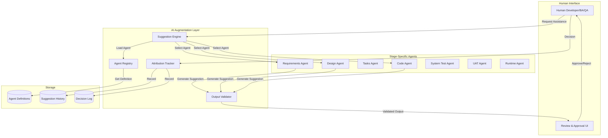
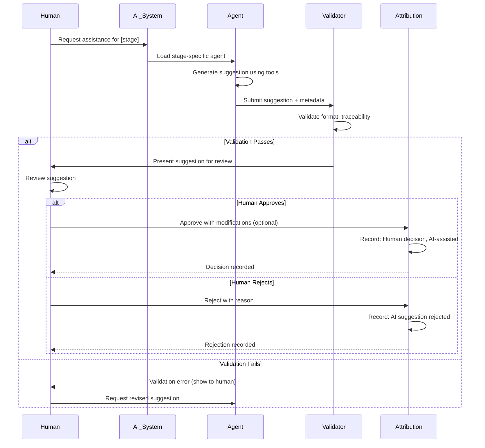
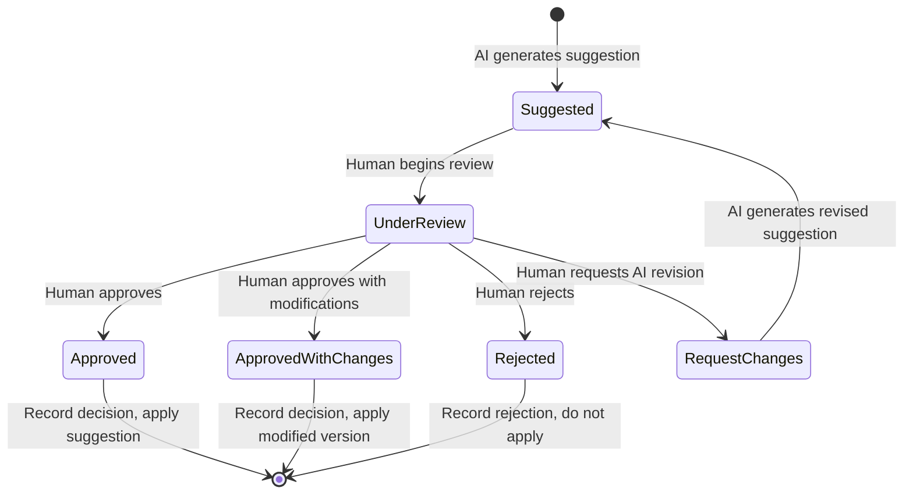

# AI Augmentation Design Document

**Document Type**: Technical Design Specification
**Project**: ai_sdlc_method (claude_aisdlc solution)
**Version**: 1.0
**Date**: 2025-12-03
**Status**: Draft
**Stage**: Design (Section 5.0)

---

## Requirements Traceability

This design implements the following requirements:

| Requirement | Description | Priority |
|-------------|-------------|----------|
| REQ-AI-001 | AI Assistance Per Stage | High |
| REQ-AI-002 | Human Accountability | Critical |
| REQ-AI-003 | Stage-Specific Agent Personas | High |

**Source**: [AISDLC_IMPLEMENTATION_REQUIREMENTS.md](../../requirements/AISDLC_IMPLEMENTATION_REQUIREMENTS.md) Section 11

---

## Table of Contents

1. [Executive Summary](#1-executive-summary)
2. [Architecture Overview](#2-architecture-overview)
3. [Agent Definition Schema](#3-agent-definition-schema)
4. [Agent Capabilities Per Stage](#4-agent-capabilities-per-stage)
5. [Human Review Workflow](#5-human-review-workflow)
6. [AI Suggestion Tracking Format](#6-ai-suggestion-tracking-format)
7. [Decision Attribution](#7-decision-attribution)
8. [Agent Output Validation](#8-agent-output-validation)
9. [Implementation Guidance](#9-implementation-guidance)

---

## 1. Executive Summary

### 1.1 Purpose

This design document transforms the AI Augmentation requirements into implementable specifications that enable AI assistance throughout the 7-stage SDLC while maintaining human accountability and decision authority.

### 1.2 Design Principles

1. **AI Augments, Humans Decide** - AI provides suggestions, humans make final decisions
2. **Transparent Attribution** - Clear distinction between AI suggestions and human decisions
3. **Stage-Specific Personas** - Each stage has specialized AI agent with contextual knowledge
4. **Fail-Safe Review** - All AI outputs require human review before acceptance
5. **Audit Trail** - Complete tracking of AI suggestions and human decisions

### 1.3 Key Design Decisions

| Decision | Rationale | Requirement |
|----------|-----------|-------------|
| Agent definition in YAML | Declarative, version-controlled, human-readable | REQ-AI-003 |
| Review workflow state machine | Enforces human review gate | REQ-AI-002 |
| Suggestion metadata format | Enables audit and attribution | REQ-AI-002 |
| Tool restrictions per agent | Limits AI capabilities to safe, appropriate operations | REQ-AI-001, REQ-AI-003 |
| Output validation schema | Ensures AI outputs are well-formed and traceable | REQ-AI-001 |

---

## 2. Architecture Overview

### 2.1 Component Diagram



### 2.2 Interaction Flow



---

## 3. Agent Definition Schema

### 3.1 Base Agent Schema

**Purpose**: Define structure for all AI agent personas

**File Format**: YAML

**Location**: `.claude-plugin/plugins/aisdlc-methodology/config/agents/`

```yaml
# Agent definition schema
agent_id: requirements-agent
agent_version: "1.0.0"

# Metadata
metadata:
  name: "AISDLC Requirements Agent"
  stage: "requirements"
  description: "Transform raw intents into structured, traceable requirements"
  created_at: "2025-12-03T00:00:00Z"
  updated_at: "2025-12-03T00:00:00Z"
  owner: "AISDLC Core Team"

# Agent identity and role
identity:
  role: "Requirements Analyst"
  persona: "Business-focused requirements engineer with technical knowledge"

  responsibilities:
    - "Extract requirements from raw intents"
    - "Generate REQ-* keys with proper typing (F, NFR, DATA, BR)"
    - "Create testable acceptance criteria"
    - "Define homeostasis models for NFRs"
    - "Validate requirements completeness"
    - "Respond to feedback from downstream stages"

  boundaries:
    cannot_do:
      - "Make design decisions (belongs to Design Agent)"
      - "Break down into tasks (belongs to Tasks Agent)"
      - "Write code (belongs to Code Agent)"
      - "Approve requirements (human decision)"

    must_do:
      - "Tag all requirements with unique REQ-* keys"
      - "Ensure all requirements are testable"
      - "Link requirements to originating intent"
      - "Request human review for ambiguous intents"

# Stage-specific context
stage_context:
  inputs:
    - type: "intent"
      format: "INT-*.yml"
      location: ".ai-workspace/intents/"
      required: true

    - type: "feedback"
      format: "feedback message"
      source: "design|tasks|code|test|uat|runtime"
      required: false

  outputs:
    - type: "requirements"
      format: "REQ-*.yml"
      location: ".ai-workspace/requirements/{functional|non-functional|data|business-rules}/"
      schema: "requirement_schema_v1.yml"

    - type: "requirements_index"
      format: "requirements_index.yml"
      location: ".ai-workspace/requirements/"

  quality_gates:
    - name: "100% intent coverage"
      validation: "All intent statements converted to requirements"

    - name: "Testable acceptance criteria"
      validation: "All requirements have testable=true criteria"

    - name: "Homeostasis models for NFRs"
      validation: "All NFR requirements have threshold definitions"

    - name: "Human review approval"
      validation: "Requirements reviewed and approved by human"

# Tools and capabilities
capabilities:
  allowed_tools:
    # File operations
    - name: "read_file"
      description: "Read intent files, existing requirements"
      restrictions:
        - "Read-only access to intent and requirement files"
        - "Cannot read files outside workspace"

    - name: "write_file"
      description: "Create requirement files"
      restrictions:
        - "Write only to .ai-workspace/requirements/"
        - "Must use REQ-* naming convention"
        - "Must validate against schema before writing"

    - name: "search_files"
      description: "Find existing requirements by keyword"
      restrictions:
        - "Search only in .ai-workspace/ directory"

    # Requirement operations
    - name: "generate_req_key"
      description: "Generate unique requirement key"
      inputs:
        - "type: F|NFR|DATA|BR"
        - "domain: string"
      outputs:
        - "key: REQ-{TYPE}-{DOMAIN}-{SEQ}"

    - name: "validate_requirement"
      description: "Validate requirement against schema"
      inputs:
        - "requirement: YAML data"
      outputs:
        - "valid: boolean"
        - "errors: list of validation errors"

    - name: "link_to_intent"
      description: "Create bidirectional link between requirement and intent"
      inputs:
        - "requirement_key: string"
        - "intent_id: string"

  disallowed_tools:
    - "execute_code"
    - "modify_code"
    - "commit_changes"  # Human commits
    - "deploy"
    - "delete_files"  # Requirements never deleted, only deprecated

  llm_settings:
    temperature: 0.3  # Lower temperature for structured output
    max_tokens: 4000
    model_preference: ["claude-3-5-sonnet", "gpt-4"]
    system_prompt_template: "agent_prompts/requirements_agent.md"

# Output format specification
output_format:
  suggestion_type: "requirement"

  required_metadata:
    - "requirement_key"  # REQ-*
    - "derived_from"     # INT-*
    - "confidence"       # 0.0-1.0
    - "rationale"        # Why this requirement was extracted
    - "alternatives"     # Other interpretations considered
    - "human_review_needed"  # true/false

  validation_rules:
    - "Must include unique REQ-* key"
    - "Must have at least one testable acceptance criterion"
    - "Must link to source intent"
    - "NFRs must have homeostasis model"

  example_output:
    suggestion_id: "SUG-REQ-20251203-001"
    requirement_key: "REQ-F-AUTH-001"
    requirement_type: "F"
    derived_from: "INT-20251203-001"
    confidence: 0.85
    rationale: "Intent explicitly states 'users need to log in with email/password'"
    alternatives:
      - "Could use username instead of email (rejected: intent specifies email)"
      - "Could support social login (not in scope: no mention in intent)"
    human_review_needed: true
    human_review_prompt: "Please confirm: email/password is preferred over username/password?"

    requirement_content:
      # Full requirement YAML would be here
      id: "REQ-F-AUTH-001"
      title: "User login with email/password"
      # ...

# Review and feedback
review_process:
  required_approvers:
    - role: "Business Analyst"
      decision: "approve|reject|request_changes"
    - role: "Product Owner"
      decision: "approve|reject"

  approval_criteria:
    - "Requirements align with intent"
    - "Acceptance criteria are testable"
    - "No ambiguity in requirement statements"
    - "NFR thresholds are measurable"

  feedback_handling:
    accepts_feedback_from:
      - stage: "design"
        feedback_types: ["gap", "ambiguity", "clarification", "error"]
      - stage: "tasks"
        feedback_types: ["gap", "clarification"]
      - stage: "code"
        feedback_types: ["gap", "error"]
      - stage: "test"
        feedback_types: ["gap", "clarification"]

    feedback_response:
      action: "refine_requirement"
      triggers: "version increment"
      records: "feedback source in version history"

# Audit and compliance
audit:
  log_all_suggestions: true
  log_human_decisions: true
  retention_period: "indefinite"  # Requirements are permanent record

  metrics_tracked:
    - "suggestions_generated"
    - "suggestions_approved"
    - "suggestions_rejected"
    - "average_confidence_score"
    - "feedback_received_count"
    - "refinement_iterations"
```

### 3.2 Agent Schema Validation

```yaml
# Schema for validating agent definitions
agent_schema:
  type: object
  required:
    - agent_id
    - agent_version
    - metadata
    - identity
    - stage_context
    - capabilities
    - output_format
    - review_process
    - audit

  properties:
    agent_id:
      type: string
      pattern: "^[a-z-]+$"

    agent_version:
      type: string
      pattern: "^\\d+\\.\\d+\\.\\d+$"

    identity:
      type: object
      required:
        - role
        - responsibilities
        - boundaries

    capabilities:
      type: object
      required:
        - allowed_tools
        - disallowed_tools
        - llm_settings

    # ... (complete JSON Schema)
```

---

## 4. Agent Capabilities Per Stage

### 4.1 Requirements Agent Capabilities

**Stage**: Requirements (Section 4.0)
**Persona**: Business-focused requirements analyst
**Requirement**: REQ-AI-001, REQ-AI-003

**Core Capabilities**:

```yaml
capabilities:
  intent_extraction:
    description: "Extract structured requirements from raw intent"
    inputs: ["intent text", "intent metadata"]
    outputs: ["list of requirement candidates"]
    confidence_range: [0.0, 1.0]

    techniques:
      - "Natural language processing to identify 'shall' statements"
      - "Identify quality attributes (performance, security, etc.)"
      - "Extract data requirements and constraints"
      - "Identify business rules and policies"

    examples:
      - input: "Users need to log in quickly"
        output:
          - REQ-F-AUTH-001: "User login with credentials"
          - REQ-NFR-PERF-001: "Login response time < 500ms (p95)"

  requirement_classification:
    description: "Classify requirements into types (F, NFR, DATA, BR)"
    inputs: ["requirement statement"]
    outputs: ["requirement_type"]

    classification_rules:
      functional:
        indicators: ["shall", "must", "can", "behavior", "action"]
        examples: ["User can upload file", "System shall send notification"]

      non_functional:
        indicators: ["performance", "security", "scalability", "usability"]
        examples: ["Response time < 500ms", "99.9% uptime"]

      data:
        indicators: ["data quality", "accuracy", "completeness", "privacy"]
        examples: ["Email must be valid", "PII encrypted at rest"]

      business_rule:
        indicators: ["discount", "policy", "calculation", "constraint"]
        examples: ["Premium users get 20% discount", "Max 5 items per order"]

  acceptance_criteria_generation:
    description: "Generate testable acceptance criteria"
    inputs: ["requirement description"]
    outputs: ["list of acceptance criteria with test scenarios"]

    template: |
      Given [precondition]
      When [action]
      Then [expected result]
      And [additional validation]

    quality_checks:
      - "Criterion is testable (true/false outcome)"
      - "Criterion is specific (no ambiguity)"
      - "Criterion covers success and failure paths"
      - "Criterion includes edge cases"

  homeostasis_model_generation:
    description: "Generate measurable thresholds for NFRs"
    inputs: ["NFR description"]
    outputs: ["homeostasis model with metrics and thresholds"]

    required_elements:
      - "Metric name"
      - "Threshold (operator, value, unit)"
      - "Measurement method"
      - "Measurement conditions"
      - "Deviation response (warning, critical)"

    example:
      input: "Login must be fast"
      output:
        metric: "login_response_time_p95"
        threshold:
          operator: "<"
          value: 500
          unit: "milliseconds"
        measurement:
          method: "p95 latency from APM"
          conditions: "normal load (1000 concurrent users)"
        deviation_response:
          warning: "p95 > 400ms"
          critical: "p95 > 500ms → generate remediation intent"

  feedback_processing:
    description: "Handle feedback from downstream stages"
    inputs: ["feedback message", "target requirement"]
    outputs: ["refined requirement", "version increment"]

    feedback_types:
      gap:
        action: "Create new requirement or add acceptance criteria"

      ambiguity:
        action: "Clarify description or add examples"

      clarification:
        action: "Add detail to acceptance criteria"

      error:
        action: "Correct requirement content, increment version"

  validation:
    description: "Validate requirement completeness and correctness"
    checks:
      - "Unique REQ-* key generated"
      - "Type classification is correct"
      - "At least one acceptance criterion"
      - "Acceptance criteria are testable"
      - "NFRs have homeostasis models"
      - "Linked to source intent"
      - "No conflicting requirements"

# Tools allowed for Requirements Agent
allowed_tools:
  - read_file
  - write_file
  - search_files
  - generate_req_key
  - validate_requirement
  - link_to_intent
  - increment_version

# Tools explicitly disallowed
disallowed_tools:
  - execute_code
  - modify_code
  - commit_changes
  - create_tasks
  - deploy
  - delete_files
```

### 4.2 Design Agent Capabilities

**Stage**: Design (Section 5.0)
**Persona**: Technical architect
**Requirement**: REQ-AI-001, REQ-AI-003

```yaml
capabilities:
  architecture_suggestion:
    description: "Suggest technical architectures for requirements"
    inputs: ["list of requirements"]
    outputs: ["architecture proposal", "component diagram", "ADRs"]

    architecture_patterns:
      - "Microservices"
      - "Monolithic"
      - "Event-driven"
      - "Layered"
      - "Hexagonal"

    considers:
      - "Non-functional requirements (scale, performance)"
      - "Technology constraints"
      - "Team expertise"
      - "Existing architecture"

  component_design:
    description: "Design components that implement requirements"
    inputs: ["requirements", "architecture pattern"]
    outputs: ["component specifications", "interface definitions"]

    component_template:
      name: "ComponentName"
      responsibility: "What it does"
      implements: ["REQ-F-*", "REQ-NFR-*"]
      dependencies: ["Other components"]
      interfaces:
        - "API endpoint"
        - "Events consumed/published"

  adr_generation:
    description: "Generate Architecture Decision Records"
    inputs: ["design decision", "alternatives considered"]
    outputs: ["ADR document"]

    adr_template:
      title: "ADR-NNN: Decision Title"
      status: "Proposed|Accepted|Deprecated"
      context: "What situation led to this decision?"
      decision: "What we decided"
      rationale: "Why we decided this"
      consequences: "Impact of decision"
      alternatives: "What else we considered"

  data_model_design:
    description: "Design data models from DATA requirements"
    inputs: ["REQ-DATA-*"]
    outputs: ["conceptual model", "logical model", "physical schema"]

    model_levels:
      conceptual: "Entity-relationship diagram"
      logical: "Normalized tables with attributes"
      physical: "Database-specific DDL"

  api_specification:
    description: "Define API contracts"
    inputs: ["functional requirements", "component design"]
    outputs: ["OpenAPI spec", "GraphQL schema"]

    includes:
      - "Endpoints and operations"
      - "Request/response formats"
      - "Error codes"
      - "Authentication requirements"

  feedback_to_requirements:
    description: "Provide feedback when requirements are incomplete"
    triggers:
      - "Cannot design without information"
      - "Requirements conflict"
      - "Requirements missing error handling"

    feedback_format:
      type: "gap|ambiguity|clarification|error"
      requirement: "REQ-*"
      issue: "What is wrong or missing"
      request: "What needs to be added/changed"

allowed_tools:
  - read_file
  - write_file
  - generate_diagrams  # Mermaid, PlantUML
  - validate_design
  - feedback_to_stage  # Send feedback to Requirements stage

disallowed_tools:
  - execute_code
  - modify_code
  - commit_changes
  - deploy
```

### 4.3 Tasks Agent Capabilities

**Stage**: Tasks (Section 6.0)
**Persona**: Project manager / Scrum master
**Requirement**: REQ-AI-001, REQ-AI-003

```yaml
capabilities:
  work_breakdown:
    description: "Break design into implementable work units"
    inputs: ["design artifacts", "requirements"]
    outputs: ["task list with dependencies"]

    breakdown_strategy:
      - "One task per component"
      - "Separate tasks for: implementation, testing, documentation"
      - "Tasks sized to 1-3 days effort"
      - "Clear acceptance criteria from requirements"

  dependency_identification:
    description: "Identify task dependencies"
    inputs: ["task list", "component dependencies"]
    outputs: ["dependency graph"]

    dependency_types:
      - "Technical: Component A depends on Component B"
      - "Resource: Same person working on multiple tasks"
      - "Temporal: Task B cannot start before Task A completes"

  estimation:
    description: "Estimate task effort"
    inputs: ["task definition", "historical data"]
    outputs: ["effort estimate (hours/days)"]

    estimation_factors:
      - "Complexity (simple, medium, complex)"
      - "Unknowns (low, medium, high)"
      - "Team experience with technology"
      - "Similar past tasks"

  task_prioritization:
    description: "Prioritize tasks based on requirements"
    inputs: ["task list", "requirement priorities"]
    outputs: ["prioritized backlog"]

    prioritization_factors:
      - "Requirement priority (critical → low)"
      - "Dependencies (blocking tasks first)"
      - "Business value"
      - "Risk (high-risk tasks early)"

allowed_tools:
  - read_file
  - write_file
  - create_jira_ticket  # If integrated
  - search_requirements
  - estimate_task

disallowed_tools:
  - execute_code
  - modify_code
  - deploy
```

### 4.4 Code Agent Capabilities

**Stage**: Code (Section 7.0)
**Persona**: Senior developer following Key Principles
**Requirement**: REQ-AI-001, REQ-AI-003

```yaml
capabilities:
  test_generation:
    description: "Generate tests FIRST (TDD RED phase)"
    inputs: ["requirement", "acceptance criteria"]
    outputs: ["failing test code"]

    test_types:
      - "Unit tests"
      - "Integration tests"
      - "Property-based tests"

    quality_checks:
      - "Test covers acceptance criteria"
      - "Test is focused (one behavior)"
      - "Test has clear assertion"
      - "Test includes edge cases"

  implementation_generation:
    description: "Generate minimal code to pass test (TDD GREEN phase)"
    inputs: ["failing test", "requirement"]
    outputs: ["implementation code"]

    constraints:
      - "Minimal code to pass test"
      - "No premature optimization"
      - "Tagged with REQ-* in comments"
      - "Follows language standards"

  refactoring_suggestion:
    description: "Suggest refactorings (TDD REFACTOR phase)"
    inputs: ["passing code"]
    outputs: ["refactoring suggestions"]

    refactoring_patterns:
      - "Extract method"
      - "Remove duplication"
      - "Improve naming"
      - "Simplify conditionals"

    constraints:
      - "Tests still pass after refactoring"
      - "Behavior unchanged"
      - "Code quality improved"

  requirement_tagging:
    description: "Tag code with REQ-* keys"
    inputs: ["code", "requirements"]
    outputs: ["code with REQ-* tags in comments"]

    tag_format: |
      # Implements: REQ-F-AUTH-001
      # Validates: REQ-NFR-PERF-001
      def login(email: str, password: str) -> LoginResult:
          ...

  code_review:
    description: "Review code against Key Principles"
    inputs: ["code"]
    outputs: ["review comments"]

    checks_key_principles:
      - "Tests exist (Principle #1: TDD)"
      - "Errors handled (Principle #2: Fail Fast)"
      - "Single responsibility (Principle #3: Modular)"
      - "No duplication (Principle #4: Reuse)"
      - "Dependencies documented (Principle #5: Open Source)"
      - "No tech debt (Principle #6: No Legacy)"
      - "High quality (Principle #7: Excellence)"

allowed_tools:
  - read_file
  - write_file
  - execute_tests
  - search_code
  - lint_code
  - format_code

disallowed_tools:
  - commit_changes  # Human commits
  - deploy
  - delete_code  # Must be intentional
```

### 4.5 System Test Agent Capabilities

**Stage**: System Test (Section 8.0)
**Persona**: QA engineer specializing in BDD
**Requirement**: REQ-AI-001, REQ-AI-003

```yaml
capabilities:
  bdd_scenario_generation:
    description: "Generate BDD scenarios from requirements"
    inputs: ["requirement", "acceptance criteria"]
    outputs: ["Gherkin feature files"]

    gherkin_template: |
      Feature: [Feature name from requirement]
        # Validates: REQ-F-*

        Scenario: [Scenario from acceptance criterion]
          Given [precondition]
          When [action]
          Then [expected result]
          And [additional validation]

    quality_checks:
      - "Scenarios cover all acceptance criteria"
      - "Scenarios use business language (not technical)"
      - "Scenarios are independent"
      - "Scenarios include positive and negative paths"

  step_definition_generation:
    description: "Generate step definitions for BDD scenarios"
    inputs: ["Gherkin scenarios", "code implementation"]
    outputs: ["step definition code"]

    step_template: |
      @given("registered user with email {email}")
      def step_impl(context, email):
          context.user = create_test_user(email=email)

  integration_test_generation:
    description: "Generate integration tests"
    inputs: ["component interfaces", "requirements"]
    outputs: ["integration test code"]

    test_scopes:
      - "Component-to-component"
      - "API-level"
      - "Database integration"
      - "External service integration"

  coverage_analysis:
    description: "Analyze requirement coverage"
    inputs: ["test suite", "requirements"]
    outputs: ["coverage matrix"]

    coverage_matrix:
      - requirement: "REQ-F-AUTH-001"
        test_count: 5
        scenarios: ["login_success", "login_failure", "account_lockout"]
        coverage: "100%"

allowed_tools:
  - read_file
  - write_file
  - execute_tests
  - analyze_coverage
  - generate_report

disallowed_tools:
  - modify_production_code
  - commit_changes  # Human commits
  - deploy
```

### 4.6 UAT Agent Capabilities

**Stage**: UAT (Section 9.0)
**Persona**: Business analyst facilitating UAT
**Requirement**: REQ-AI-001, REQ-AI-003

```yaml
capabilities:
  uat_test_case_generation:
    description: "Generate UAT test cases in business language"
    inputs: ["requirements", "BDD scenarios"]
    outputs: ["UAT test case documents"]

    test_case_format:
      id: "UAT-001"
      requirement: "REQ-F-AUTH-001"
      title: "Validate user login flow"
      objective: "Business user can successfully log in"
      preconditions: ["User has account", "System is accessible"]
      steps:
        - "Navigate to login page"
        - "Enter email and password"
        - "Click Login"
      expected_results:
        - "User is logged in"
        - "Dashboard is displayed"
      tester: "Business Analyst"
      approval: "Product Owner"

  automated_uat_generation:
    description: "Generate automated UAT tests"
    inputs: ["UAT test cases"]
    outputs: ["Automated test scripts (Selenium, Playwright)"]

    automation_targets:
      - "Repetitive test cases"
      - "Regression tests"
      - "Data validation tests"

  sign_off_checklist:
    description: "Generate UAT sign-off checklist"
    inputs: ["requirements", "test results"]
    outputs: ["sign-off document"]

    checklist_items:
      - requirement: "REQ-F-AUTH-001"
        test_case: "UAT-001"
        status: "Passed|Failed|Blocked"
        notes: "Comments from business user"
        approver: "Product Owner"
        approved: true

allowed_tools:
  - read_file
  - write_file
  - generate_test_case
  - generate_report

disallowed_tools:
  - modify_code
  - execute_system_tests  # UAT is manual or separate automation
  - deploy
```

### 4.7 Runtime Agent Capabilities

**Stage**: Runtime Feedback (Section 10.0)
**Persona**: DevOps/SRE engineer
**Requirement**: REQ-AI-001, REQ-AI-003

```yaml
capabilities:
  telemetry_analysis:
    description: "Analyze runtime telemetry to detect deviations"
    inputs: ["logs", "metrics", "traces", "REQ-NFR-* thresholds"]
    outputs: ["deviation alerts", "performance reports"]

    monitors:
      - "NFR thresholds (homeostasis model)"
      - "Error rates"
      - "Performance trends"
      - "Security events"

  incident_correlation:
    description: "Correlate incidents with requirements"
    inputs: ["incident data", "requirement tags in logs"]
    outputs: ["requirement-to-incident mapping"]

    correlation_example:
      incident: "INC-2025-001"
      symptom: "Login timeout"
      requirement: "REQ-NFR-PERF-001"
      threshold_breached: "p95 > 500ms (observed: 1200ms)"
      root_cause: "Database connection pool exhausted"

  intent_generation:
    description: "Generate remediation intents from incidents"
    inputs: ["incident analysis"]
    outputs: ["INT-* intent"]

    intent_example:
      intent_id: "INT-20251203-042"
      type: "remediate"
      title: "Fix login performance degradation"
      description: "REQ-NFR-PERF-001 breached: p95 login time 1200ms (threshold 500ms)"
      priority: "critical"
      derived_from_incident: "INC-2025-001"

  trend_analysis:
    description: "Identify trends over time"
    inputs: ["historical metrics"]
    outputs: ["trend reports", "predictive alerts"]

    trends_detected:
      - "Performance degrading over time"
      - "Error rate increasing"
      - "Capacity approaching limits"

  eco_intent_generation:
    description: "Generate intents for ecosystem changes"
    inputs: ["dependency updates", "security advisories", "deprecations"]
    outputs: ["INT-ECO-* intents"]

    eco_intent_example:
      intent_id: "INT-ECO-20251203-001"
      type: "remediate"
      title: "Upgrade Auth0 SDK to v3 (v2 deprecated)"
      priority: "high"
      deadline: "2025-12-31"

allowed_tools:
  - read_telemetry
  - query_metrics
  - analyze_logs
  - generate_intent
  - create_alert

disallowed_tools:
  - modify_code
  - modify_infrastructure
  - deploy  # Must follow deployment process
```

---

## 5. Human Review Workflow

### 5.1 Review State Machine

**Purpose**: Enforce human review gate for all AI suggestions

**States**: `suggested` → `under_review` → `approved|rejected|request_changes`



### 5.2 Review Workflow Schema

```yaml
# Review workflow definition
review_workflow:
  suggestion_id: "SUG-REQ-20251203-001"
  agent_id: "requirements-agent"
  stage: "requirements"

  # Suggestion details
  suggestion:
    type: "requirement"
    content:
      requirement_key: "REQ-F-AUTH-001"
      # ... (full suggestion content)

    metadata:
      generated_at: "2025-12-03T10:00:00Z"
      confidence: 0.85
      rationale: "Intent explicitly states login requirement"
      alternatives_considered: 2

  # Review state
  state: "under_review"  # suggested | under_review | approved | rejected | request_changes

  # Human review
  review:
    reviewer:
      name: "Jane Doe"
      role: "Business Analyst"
      email: "jane.doe@example.com"

    reviewed_at: "2025-12-03T10:30:00Z"

    decision: "approved_with_changes"  # approved | approved_with_changes | rejected | request_changes

    modifications:
      - field: "acceptance_criteria"
        original: "User can log in"
        modified: "User can log in with email and password within 5 seconds"
        reason: "Added performance expectation"

    comments: |
      Good extraction from intent. Made one modification to add
      performance expectation that was implicit in intent.

    approval_signature:
      name: "Jane Doe"
      timestamp: "2025-12-03T10:30:00Z"
      method: "digital_signature"

  # Attribution
  attribution:
    decision_maker: "Jane Doe (Human)"
    ai_assisted: true
    ai_contribution: "Generated initial suggestion and requirement structure"
    human_contribution: "Reviewed, modified acceptance criteria, approved"

  # Audit trail
  audit:
    created_at: "2025-12-03T10:00:00Z"
    updated_at: "2025-12-03T10:30:00Z"
    state_transitions:
      - from: "suggested"
        to: "under_review"
        timestamp: "2025-12-03T10:15:00Z"
        actor: "Jane Doe"

      - from: "under_review"
        to: "approved_with_changes"
        timestamp: "2025-12-03T10:30:00Z"
        actor: "Jane Doe"
```

### 5.3 Review UI Mockup

```
+-------------------------------------------------------------------+
| AI Suggestion Review                                               |
+-------------------------------------------------------------------+
| Suggestion ID: SUG-REQ-20251203-001                               |
| Agent: Requirements Agent                                          |
| Generated: 2025-12-03 10:00:00                                    |
| Confidence: 85%                                                   |
+-------------------------------------------------------------------+
|                                                                   |
| AI SUGGESTION:                                                    |
|                                                                   |
| Requirement Key: REQ-F-AUTH-001                                   |
| Title: User login with email/password                             |
| Type: Functional (F)                                              |
| Priority: Critical                                                |
|                                                                   |
| Description:                                                      |
| Users shall be able to authenticate to the system using email     |
| address and password credentials.                                 |
|                                                                   |
| Acceptance Criteria:                                              |
| - User can log in with valid email and password                   |
| - Invalid credentials show error message                          |
| - Account locks after 5 failed attempts                           |
|                                                                   |
| Derived From: INT-20251203-001                                    |
|                                                                   |
+-------------------------------------------------------------------+
| AI RATIONALE:                                                     |
| Intent explicitly states "users need to log in with email and     |
| password". This is a functional requirement for authentication.   |
|                                                                   |
| ALTERNATIVES CONSIDERED:                                          |
| 1. Username/password (rejected: intent specifies email)           |
| 2. Social login (not in scope: not mentioned in intent)           |
+-------------------------------------------------------------------+
|                                                                   |
| YOUR REVIEW:                                                      |
|                                                                   |
| [ ] Approve as-is                                                 |
| [X] Approve with changes (see modifications below)                |
| [ ] Reject (provide reason)                                       |
| [ ] Request AI revision (provide guidance)                        |
|                                                                   |
| Modifications:                                                    |
| ┌─────────────────────────────────────────────────────────────┐  |
| │ Field: acceptance_criteria[0]                               │  |
| │                                                             │  |
| │ Original:                                                   │  |
| │ - User can log in with valid email and password             │  |
| │                                                             │  |
| │ Modified:                                                   │  |
| │ - User can log in with valid email and password within      │  |
| │   5 seconds                                                 │  |
| │                                                             │  |
| │ Reason: Added performance expectation implicit in intent    │  |
| └─────────────────────────────────────────────────────────────┘  |
|                                                                   |
| Comments:                                                         |
| ┌─────────────────────────────────────────────────────────────┐  |
| │ Good extraction from intent. Made one modification to add   │  |
| │ performance expectation that was implicit in the intent.    │  |
| └─────────────────────────────────────────────────────────────┘  |
|                                                                   |
| Reviewer: Jane Doe (Business Analyst)                             |
| Date: 2025-12-03 10:30:00                                        |
|                                                                   |
| [Cancel]                               [Submit Review]            |
+-------------------------------------------------------------------+
```

### 5.4 Review Process Implementation

```python
from typing import Dict, Any, Literal
from dataclasses import dataclass
from datetime import datetime
from enum import Enum

class ReviewState(Enum):
    SUGGESTED = "suggested"
    UNDER_REVIEW = "under_review"
    APPROVED = "approved"
    APPROVED_WITH_CHANGES = "approved_with_changes"
    REJECTED = "rejected"
    REQUEST_CHANGES = "request_changes"

class ReviewDecision(Enum):
    APPROVE = "approved"
    APPROVE_WITH_CHANGES = "approved_with_changes"
    REJECT = "rejected"
    REQUEST_CHANGES = "request_changes"

@dataclass
class Reviewer:
    name: str
    role: str
    email: str

@dataclass
class Modification:
    field: str
    original: Any
    modified: Any
    reason: str

@dataclass
class Review:
    reviewer: Reviewer
    reviewed_at: datetime
    decision: ReviewDecision
    modifications: list[Modification]
    comments: str

@dataclass
class AISuggestion:
    suggestion_id: str
    agent_id: str
    stage: str
    content: Dict[str, Any]
    confidence: float
    rationale: str
    alternatives: list[str]

    # Review state
    state: ReviewState
    review: Review | None

    # Attribution
    decision_maker: str | None
    ai_assisted: bool

    # Audit
    created_at: datetime
    updated_at: datetime
    state_transitions: list[Dict[str, Any]]

class ReviewWorkflow:
    """Manages human review workflow for AI suggestions."""

    def submit_suggestion(
        self,
        agent_id: str,
        stage: str,
        content: Dict[str, Any],
        confidence: float,
        rationale: str,
        alternatives: list[str]
    ) -> AISuggestion:
        """
        AI agent submits suggestion for human review.

        Args:
            agent_id: ID of agent making suggestion
            stage: SDLC stage
            content: Suggestion content
            confidence: AI confidence (0.0-1.0)
            rationale: Why AI made this suggestion
            alternatives: Other options considered

        Returns:
            AISuggestion in 'suggested' state
        """
        suggestion = AISuggestion(
            suggestion_id=self._generate_suggestion_id(),
            agent_id=agent_id,
            stage=stage,
            content=content,
            confidence=confidence,
            rationale=rationale,
            alternatives=alternatives,
            state=ReviewState.SUGGESTED,
            review=None,
            decision_maker=None,
            ai_assisted=True,
            created_at=datetime.now(),
            updated_at=datetime.now(),
            state_transitions=[]
        )

        # Store suggestion
        self._store_suggestion(suggestion)

        # Notify reviewers
        self._notify_reviewers(suggestion)

        return suggestion

    def begin_review(
        self,
        suggestion_id: str,
        reviewer: Reviewer
    ) -> AISuggestion:
        """
        Human begins reviewing suggestion.

        Args:
            suggestion_id: ID of suggestion to review
            reviewer: Human reviewer

        Returns:
            AISuggestion in 'under_review' state
        """
        suggestion = self._load_suggestion(suggestion_id)

        # Transition state
        suggestion = self._transition_state(
            suggestion=suggestion,
            from_state=ReviewState.SUGGESTED,
            to_state=ReviewState.UNDER_REVIEW,
            actor=reviewer.name
        )

        return suggestion

    def submit_review(
        self,
        suggestion_id: str,
        reviewer: Reviewer,
        decision: ReviewDecision,
        modifications: list[Modification] = [],
        comments: str = ""
    ) -> AISuggestion:
        """
        Human submits review decision.

        Args:
            suggestion_id: ID of suggestion
            reviewer: Human reviewer
            decision: Review decision
            modifications: Changes made to suggestion
            comments: Review comments

        Returns:
            AISuggestion with final state

        Raises:
            ValueError: If suggestion not in reviewable state
        """
        suggestion = self._load_suggestion(suggestion_id)

        # Validate state
        if suggestion.state != ReviewState.UNDER_REVIEW:
            raise ValueError(
                f"Suggestion must be in 'under_review' state, "
                f"currently: {suggestion.state}"
            )

        # Create review record
        review = Review(
            reviewer=reviewer,
            reviewed_at=datetime.now(),
            decision=decision,
            modifications=modifications,
            comments=comments
        )

        suggestion.review = review

        # Transition to final state
        final_state = self._decision_to_state(decision)
        suggestion = self._transition_state(
            suggestion=suggestion,
            from_state=ReviewState.UNDER_REVIEW,
            to_state=final_state,
            actor=reviewer.name
        )

        # Record attribution
        suggestion.decision_maker = f"{reviewer.name} (Human)"

        # Apply suggestion if approved
        if decision in [ReviewDecision.APPROVE, ReviewDecision.APPROVE_WITH_CHANGES]:
            self._apply_suggestion(suggestion)

        # Store updated suggestion
        self._store_suggestion(suggestion)

        return suggestion

    def _decision_to_state(self, decision: ReviewDecision) -> ReviewState:
        """Map review decision to state."""
        mapping = {
            ReviewDecision.APPROVE: ReviewState.APPROVED,
            ReviewDecision.APPROVE_WITH_CHANGES: ReviewState.APPROVED_WITH_CHANGES,
            ReviewDecision.REJECT: ReviewState.REJECTED,
            ReviewDecision.REQUEST_CHANGES: ReviewState.REQUEST_CHANGES
        }
        return mapping[decision]

    def _transition_state(
        self,
        suggestion: AISuggestion,
        from_state: ReviewState,
        to_state: ReviewState,
        actor: str
    ) -> AISuggestion:
        """Transition suggestion state."""
        # Validate transition
        if suggestion.state != from_state:
            raise ValueError(
                f"Expected state {from_state}, got {suggestion.state}"
            )

        # Update state
        suggestion.state = to_state
        suggestion.updated_at = datetime.now()

        # Record transition
        suggestion.state_transitions.append({
            "from": from_state.value,
            "to": to_state.value,
            "timestamp": datetime.now().isoformat(),
            "actor": actor
        })

        return suggestion

    def _apply_suggestion(self, suggestion: AISuggestion) -> None:
        """Apply approved suggestion."""
        # Apply modifications if any
        content = suggestion.content
        if suggestion.review and suggestion.review.modifications:
            for mod in suggestion.review.modifications:
                # Apply modification to content
                self._apply_modification(content, mod)

        # Write artifact (requirement, design doc, code, etc.)
        self._write_artifact(
            stage=suggestion.stage,
            content=content,
            metadata={
                "suggestion_id": suggestion.suggestion_id,
                "ai_assisted": True,
                "decision_maker": suggestion.decision_maker
            }
        )

    # ... (helper methods)
```

---

## 6. AI Suggestion Tracking Format

### 6.1 Suggestion Metadata Schema

**Purpose**: Track all AI suggestions and human decisions for audit

```yaml
# Suggestion tracking schema
suggestion:
  # Unique identifier
  suggestion_id: "SUG-{STAGE}-{YYYYMMDD}-{SEQ}"

  # Source
  agent_id: "requirements-agent"
  agent_version: "1.0.0"
  stage: "requirements"

  # Suggestion content
  content:
    type: "requirement|design|task|code|test|uat"
    data: {}  # Stage-specific content

  # AI metadata
  ai_metadata:
    model: "claude-3-5-sonnet-20241022"
    temperature: 0.3
    tokens_used: 2500
    confidence: 0.85  # 0.0-1.0
    rationale: "Intent explicitly states requirement"
    alternatives_considered:
      - alternative: "Username login instead of email"
        rejected_reason: "Intent specifies email"
      - alternative: "Social login integration"
        rejected_reason: "Not mentioned in intent, out of scope"

    safety_checks:
      contains_secrets: false
      contains_pii: false
      security_reviewed: true

  # Human review
  human_review:
    required: true
    reviewer:
      name: "Jane Doe"
      role: "Business Analyst"
      email: "jane.doe@example.com"

    reviewed_at: "2025-12-03T10:30:00Z"
    decision: "approved_with_changes"

    modifications:
      - field: "acceptance_criteria[0]"
        original: "User can log in"
        modified: "User can log in within 5 seconds"
        reason: "Added performance expectation"

    comments: "Good suggestion, minor modification for clarity"

  # Attribution
  attribution:
    decision_maker: "Jane Doe"
    decision_maker_role: "Human - Business Analyst"
    ai_assisted: true
    ai_contribution: "Generated initial requirement structure"
    human_contribution: "Reviewed, modified criteria, approved"

  # Lifecycle
  lifecycle:
    state: "approved_with_changes"
    created_at: "2025-12-03T10:00:00Z"
    submitted_at: "2025-12-03T10:00:00Z"
    reviewed_at: "2025-12-03T10:30:00Z"
    applied_at: "2025-12-03T10:31:00Z"

    state_history:
      - state: "suggested"
        timestamp: "2025-12-03T10:00:00Z"
        actor: "AI - requirements-agent"

      - state: "under_review"
        timestamp: "2025-12-03T10:15:00Z"
        actor: "Human - Jane Doe"

      - state: "approved_with_changes"
        timestamp: "2025-12-03T10:30:00Z"
        actor: "Human - Jane Doe"

  # Outcome
  outcome:
    applied: true
    artifact_created:
      type: "requirement"
      path: ".ai-workspace/requirements/functional/REQ-F-AUTH-001.yml"
      key: "REQ-F-AUTH-001"

    linked_to:
      intent: "INT-20251203-001"
      tasks: []
      code: []
      tests: []

  # Audit
  audit:
    logged_at: "2025-12-03T10:31:00Z"
    audit_id: "AUD-20251203-001"
    compliance_tags: ["SOC2", "audit_trail"]
```

### 6.2 Suggestion Storage

**File Location**: `.ai-workspace/suggestions/{STAGE}/SUG-{STAGE}-{DATE}-{SEQ}.yml`

**Directory Structure**:
```
.ai-workspace/
├── suggestions/
│   ├── requirements/
│   │   ├── SUG-REQ-20251203-001.yml
│   │   └── SUG-REQ-20251203-002.yml
│   │
│   ├── design/
│   │   └── SUG-DESIGN-20251203-001.yml
│   │
│   ├── code/
│   │   └── SUG-CODE-20251203-001.yml
│   │
│   └── suggestions_index.yml  # Fast lookup
│
└── decisions/
    └── decision_log.yml  # Consolidated decision log
```

### 6.3 Decision Log Format

**Purpose**: Consolidated log of all human decisions

```yaml
# Decision log
decision_log_version: "1.0"
last_updated: "2025-12-03T10:31:00Z"

statistics:
  total_suggestions: 42
  total_decisions: 42

  by_decision:
    approved: 28
    approved_with_changes: 10
    rejected: 3
    request_changes: 1

  by_stage:
    requirements: 15
    design: 10
    code: 12
    test: 5

decisions:
  - decision_id: "DEC-20251203-001"
    suggestion_id: "SUG-REQ-20251203-001"

    decision_maker: "Jane Doe"
    decision_maker_role: "Business Analyst"
    decided_at: "2025-12-03T10:30:00Z"

    decision: "approved_with_changes"
    ai_assisted: true

    summary: "Approved requirement REQ-F-AUTH-001 with minor modifications"

    artifact_created: "REQ-F-AUTH-001"

  - decision_id: "DEC-20251203-002"
    suggestion_id: "SUG-DESIGN-20251203-001"

    decision_maker: "John Smith"
    decision_maker_role: "Technical Architect"
    decided_at: "2025-12-03T11:00:00Z"

    decision: "rejected"
    ai_assisted: true

    summary: "Rejected microservices architecture, prefer monolith for MVP"
    rejection_reason: "Team lacks microservices experience, adds complexity"

    artifact_created: null
```

---

## 7. Decision Attribution

### 7.1 Attribution Schema

**Purpose**: Clearly distinguish AI contributions from human decisions

```yaml
attribution:
  # Final decision maker (always human)
  decision_maker:
    type: "human"  # always 'human'
    name: "Jane Doe"
    role: "Business Analyst"
    organization: "Acme Corp"
    email: "jane.doe@example.com"

  # AI assistance details
  ai_assistance:
    provided: true
    agent_id: "requirements-agent"
    agent_version: "1.0.0"
    model: "claude-3-5-sonnet"

    contribution_type: "suggestion"  # suggestion | analysis | validation | generation

    contribution_description: |
      AI extracted requirements from intent, classified into types,
      generated REQ-* keys, and created initial acceptance criteria.

    confidence: 0.85

    limitations:
      - "AI cannot verify business intent alignment"
      - "AI may miss domain-specific constraints"
      - "Human review required for completeness"

  # Human contribution
  human_contribution:
    type: "review_and_approval"  # creation | review_and_approval | modification | rejection

    contribution_description: |
      Reviewed AI suggestion, validated against business intent,
      added performance expectation to acceptance criteria,
      approved for use.

    value_added:
      - "Validated alignment with business intent"
      - "Added implicit performance requirement"
      - "Confirmed testability of criteria"

    time_saved: "30 minutes"  # Estimated time AI saved

  # Accountability
  accountability:
    responsible_party: "Jane Doe (Human)"
    accountability_statement: |
      Human decision maker takes full responsibility for this
      requirement. AI provided suggestion, but human reviewed,
      modified, and approved.

    override_capability: true  # Human can override AI at any time

    audit_trail:
      - actor: "AI - requirements-agent"
        action: "Generated suggestion"
        timestamp: "2025-12-03T10:00:00Z"

      - actor: "Human - Jane Doe"
        action: "Reviewed suggestion"
        timestamp: "2025-12-03T10:15:00Z"

      - actor: "Human - Jane Doe"
        action: "Modified acceptance criteria"
        timestamp: "2025-12-03T10:25:00Z"

      - actor: "Human - Jane Doe"
        action: "Approved with modifications"
        timestamp: "2025-12-03T10:30:00Z"
```

### 7.2 Attribution in Artifacts

**Purpose**: Embed attribution in final artifacts (requirements, code, etc.)

**Example: Requirement File**:

```yaml
# .ai-workspace/requirements/functional/REQ-F-AUTH-001.yml
id: REQ-F-AUTH-001
type: F
title: "User login with email/password"
# ... (requirement content)

# Attribution metadata
attribution:
  created_by:
    decision_maker: "Jane Doe (Human - Business Analyst)"
    ai_assisted: true
    ai_agent: "requirements-agent v1.0.0"
    ai_model: "claude-3-5-sonnet"

  created_at: "2025-12-03T10:30:00Z"

  creation_process:
    - "AI extracted requirement from INT-20251203-001"
    - "AI generated REQ-* key and acceptance criteria"
    - "Human reviewed and modified acceptance criteria"
    - "Human approved for use"

  suggestion_id: "SUG-REQ-20251203-001"
  decision_id: "DEC-20251203-001"

# Audit trail
audit:
  created_by_human: "Jane Doe"
  reviewed_by_human: "Jane Doe"
  approved_by_human: "Jane Doe"
  ai_assistance_used: true
  human_modifications: true
```

**Example: Code File**:

```python
# src/auth/login.py

# Implements: REQ-F-AUTH-001
# Attribution: Human-written with AI assistance
#   - AI generated initial test and implementation (Code Agent v1.0)
#   - Human reviewed, refactored, and approved
#   - Human accountable: John Smith (Senior Developer)
# Created: 2025-12-03
# Suggestion ID: SUG-CODE-20251203-005
# Decision ID: DEC-20251203-005

def login(email: str, password: str) -> LoginResult:
    """
    Authenticate user with email and password.

    Requirements:
        - REQ-F-AUTH-001: User login functionality
        - REQ-NFR-PERF-001: Response time < 500ms

    Human Decision: Approved AI-generated implementation with
    refactoring for improved error handling.
    """
    # Implementation...
```

### 7.3 Attribution Reporting

**Purpose**: Generate reports showing AI vs. human contributions

```yaml
# Attribution report
attribution_report:
  period: "2025-12-01 to 2025-12-31"

  summary:
    total_artifacts: 150
    ai_assisted: 135  # 90%
    human_only: 15    # 10%

    total_suggestions: 145
    approved: 100
    approved_with_changes: 35
    rejected: 10

  by_stage:
    requirements:
      total: 30
      ai_assisted: 28
      average_confidence: 0.82
      human_modifications: 12  # 43%
      approval_rate: 0.93

    design:
      total: 25
      ai_assisted: 20
      average_confidence: 0.75
      human_modifications: 15  # 75%
      approval_rate: 0.80

    code:
      total: 60
      ai_assisted: 58
      average_confidence: 0.88
      human_modifications: 25  # 43%
      approval_rate: 0.97

  time_saved:
    total_hours: 120
    by_stage:
      requirements: 30
      design: 25
      code: 50
      test: 15

  quality_metrics:
    defect_rate_ai_assisted: 0.02  # 2%
    defect_rate_human_only: 0.03   # 3%
    # AI-assisted code has same or better quality
```

---

## 8. Agent Output Validation

### 8.1 Validation Schema

**Purpose**: Ensure AI outputs are well-formed, traceable, and safe

```yaml
validation_schema:
  # General validation (all outputs)
  general:
    - check: "output_format"
      validation: "YAML or Markdown with YAML frontmatter"
      severity: "error"

    - check: "required_metadata"
      validation: "Contains: agent_id, stage, confidence, rationale"
      severity: "error"

    - check: "confidence_range"
      validation: "Confidence between 0.0 and 1.0"
      severity: "error"

    - check: "rationale_present"
      validation: "Non-empty rationale explaining suggestion"
      severity: "error"

    - check: "no_secrets"
      validation: "Does not contain API keys, passwords, tokens"
      severity: "error"

    - check: "no_pii"
      validation: "Does not contain real PII (use example data)"
      severity: "warning"

  # Stage-specific validation
  stage_specific:
    requirements:
      - check: "req_key_format"
        validation: "REQ-{TYPE}-{DOMAIN}-{SEQ} format"
        severity: "error"

      - check: "acceptance_criteria"
        validation: "At least one testable acceptance criterion"
        severity: "error"

      - check: "nfr_homeostasis"
        validation: "NFRs have homeostasis model with thresholds"
        severity: "error"

      - check: "intent_link"
        validation: "Links to source INT-* intent"
        severity: "error"

    design:
      - check: "requirement_mapping"
        validation: "Maps to at least one REQ-* requirement"
        severity: "error"

      - check: "component_interfaces"
        validation: "Components have defined interfaces"
        severity: "warning"

      - check: "adr_rationale"
        validation: "ADRs include alternatives and rationale"
        severity: "warning"

    code:
      - check: "requirement_tags"
        validation: "Code tagged with # Implements: REQ-*"
        severity: "error"

      - check: "tests_exist"
        validation: "Test code accompanies implementation"
        severity: "error"

      - check: "code_quality"
        validation: "Passes linter and formatter"
        severity: "warning"

      - check: "key_principles"
        validation: "Follows Key Principles (TDD, etc.)"
        severity: "warning"

    test:
      - check: "bdd_format"
        validation: "BDD scenarios in Gherkin format"
        severity: "error"

      - check: "requirement_validation_tag"
        validation: "Scenarios tagged with # Validates: REQ-*"
        severity: "error"

      - check: "coverage"
        validation: "Covers all acceptance criteria"
        severity: "warning"
```

### 8.2 Validation Implementation

```python
from typing import Dict, Any, List
from dataclasses import dataclass
import re

@dataclass
class ValidationError:
    check: str
    message: str
    severity: str  # error | warning
    field: str | None = None

@dataclass
class ValidationResult:
    valid: bool
    errors: List[ValidationError]
    warnings: List[ValidationError]

class OutputValidator:
    """Validates AI agent outputs."""

    def validate(
        self,
        agent_id: str,
        stage: str,
        output: Dict[str, Any]
    ) -> ValidationResult:
        """
        Validate AI agent output.

        Args:
            agent_id: ID of agent that generated output
            stage: SDLC stage
            output: Output data to validate

        Returns:
            ValidationResult with errors and warnings
        """
        errors = []
        warnings = []

        # General validation
        errors.extend(self._validate_general(output))

        # Stage-specific validation
        if stage == "requirements":
            errors.extend(self._validate_requirements(output))
        elif stage == "design":
            errors.extend(self._validate_design(output))
        elif stage == "code":
            errors.extend(self._validate_code(output))
        elif stage == "test":
            errors.extend(self._validate_test(output))

        # Safety checks
        errors.extend(self._validate_safety(output))

        # Separate errors from warnings
        actual_errors = [e for e in errors if e.severity == "error"]
        actual_warnings = [e for e in errors if e.severity == "warning"]

        return ValidationResult(
            valid=(len(actual_errors) == 0),
            errors=actual_errors,
            warnings=actual_warnings
        )

    def _validate_general(self, output: Dict[str, Any]) -> List[ValidationError]:
        """Validate general output format."""
        errors = []

        # Required metadata
        required_fields = ["agent_id", "stage", "confidence", "rationale"]
        for field in required_fields:
            if field not in output:
                errors.append(ValidationError(
                    check="required_metadata",
                    message=f"Missing required field: {field}",
                    severity="error",
                    field=field
                ))

        # Confidence range
        if "confidence" in output:
            conf = output["confidence"]
            if not (0.0 <= conf <= 1.0):
                errors.append(ValidationError(
                    check="confidence_range",
                    message=f"Confidence {conf} not in range [0.0, 1.0]",
                    severity="error",
                    field="confidence"
                ))

        # Rationale present
        if "rationale" in output:
            if not output["rationale"] or len(output["rationale"].strip()) == 0:
                errors.append(ValidationError(
                    check="rationale_present",
                    message="Rationale is empty",
                    severity="error",
                    field="rationale"
                ))

        return errors

    def _validate_requirements(self, output: Dict[str, Any]) -> List[ValidationError]:
        """Validate requirements output."""
        errors = []

        # Requirement key format
        if "requirement_key" in output:
            key = output["requirement_key"]
            if not re.match(r'^REQ-(F|NFR|DATA|BR)-[A-Z][A-Z0-9-]+-\d{3}$', key):
                errors.append(ValidationError(
                    check="req_key_format",
                    message=f"Invalid requirement key format: {key}",
                    severity="error",
                    field="requirement_key"
                ))

        # Acceptance criteria
        if "requirement_content" in output:
            req = output["requirement_content"]
            if "acceptance_criteria" not in req:
                errors.append(ValidationError(
                    check="acceptance_criteria",
                    message="Missing acceptance criteria",
                    severity="error",
                    field="acceptance_criteria"
                ))
            elif len(req["acceptance_criteria"]) == 0:
                errors.append(ValidationError(
                    check="acceptance_criteria",
                    message="At least one acceptance criterion required",
                    severity="error",
                    field="acceptance_criteria"
                ))

        # NFR homeostasis model
        if "requirement_content" in output:
            req = output["requirement_content"]
            if req.get("type") == "NFR":
                if "non_functional" not in req:
                    errors.append(ValidationError(
                        check="nfr_homeostasis",
                        message="NFR missing non_functional section",
                        severity="error",
                        field="non_functional"
                    ))
                elif "homeostasis" not in req.get("non_functional", {}):
                    errors.append(ValidationError(
                        check="nfr_homeostasis",
                        message="NFR missing homeostasis model",
                        severity="error",
                        field="non_functional.homeostasis"
                    ))

        # Intent link
        if "derived_from" not in output and "requirement_content" not in output:
            errors.append(ValidationError(
                check="intent_link",
                message="Missing link to source intent",
                severity="error",
                field="derived_from"
            ))

        return errors

    def _validate_safety(self, output: Dict[str, Any]) -> List[ValidationError]:
        """Validate safety (no secrets, PII)."""
        errors = []

        # Convert output to string for pattern matching
        output_str = str(output).lower()

        # Check for common secret patterns
        secret_patterns = [
            (r'api[_-]key', "API key"),
            (r'secret[_-]key', "secret key"),
            (r'password\s*=', "password"),
            (r'token\s*=', "token"),
            (r'[a-f0-9]{32}', "potential hash/key")
        ]

        for pattern, name in secret_patterns:
            if re.search(pattern, output_str):
                errors.append(ValidationError(
                    check="no_secrets",
                    message=f"Output may contain {name}",
                    severity="error"
                ))

        # Check for PII (basic check)
        pii_patterns = [
            (r'\b\d{3}-\d{2}-\d{4}\b', "SSN"),
            (r'\b\d{16}\b', "credit card"),
            (r'\b[A-Z]{1,2}\d{5,7}\b', "driver's license")
        ]

        for pattern, name in pii_patterns:
            if re.search(pattern, output_str):
                errors.append(ValidationError(
                    check="no_pii",
                    message=f"Output may contain {name}",
                    severity="warning"
                ))

        return errors

    # ... (other validation methods)
```

### 8.3 Validation Failure Handling

```yaml
validation_failure_handling:
  on_error:
    action: "reject_suggestion"
    notify_agent: true
    notify_human: true

    error_response:
      to_agent: |
        Validation failed. Please revise suggestion.

        Errors:
        - Missing acceptance criteria
        - Invalid requirement key format

        Guidance:
        - Add at least one testable acceptance criterion
        - Use format: REQ-{TYPE}-{DOMAIN}-{SEQ}

      to_human: |
        AI suggestion validation failed. Review required.

        Suggestion ID: SUG-REQ-20251203-001
        Agent: requirements-agent

        Validation Errors:
        - Missing acceptance criteria
        - Invalid requirement key format

        Options:
        - Request AI revision
        - Manually fix errors
        - Reject suggestion

  on_warning:
    action: "present_to_human_with_warnings"
    notify_agent: false
    notify_human: true

    warning_display:
      banner: "⚠️ Warnings detected - review carefully"
      warnings:
        - "NFR does not specify measurement method"
        - "Requirement lacks edge case handling"

      options:
        - "Accept with warnings"
        - "Request AI revision"
        - "Manually address warnings"
```

---

## 9. Implementation Guidance

### 9.1 Implementation Phases

**Phase 1: Core Infrastructure** (REQ-AI-003)
1. Implement agent definition schema
2. Create agent registry
3. Build agent loader
4. Implement 7 agent definitions (one per stage)

**Phase 2: Suggestion Engine** (REQ-AI-001)
1. Build suggestion engine
2. Implement output validator
3. Create suggestion storage
4. Build suggestion API

**Phase 3: Review Workflow** (REQ-AI-002)
1. Implement review state machine
2. Build review API
3. Create review UI
4. Implement attribution tracker

**Phase 4: Integration**
1. Integrate with stage workflows
2. Connect to artifact storage
3. Build decision log
4. Create audit reports

### 9.2 Testing Strategy

**Unit Tests**:
- Agent definition validation
- Output validation for each stage
- Review state transitions
- Attribution tracking

**Integration Tests**:
- End-to-end suggestion workflow
- Multi-stage review process
- Feedback loop integration
- Artifact creation with attribution

**Human-in-Loop Tests**:
- Review UI usability
- Decision clarity
- Override capability
- Audit trail completeness

### 9.3 Security Considerations

```yaml
security:
  ai_agent_restrictions:
    - "AI cannot commit code directly (human commits)"
    - "AI cannot deploy (human deploys)"
    - "AI cannot delete artifacts (only deprecate)"
    - "AI cannot modify attribution"
    - "AI cannot override human decisions"

  secret_protection:
    - "Validate outputs for secrets"
    - "Reject outputs containing API keys, passwords"
    - "Use example/dummy data only"

  pii_protection:
    - "Warn if PII detected in outputs"
    - "Use synthetic data for examples"
    - "Comply with data privacy regulations"

  audit_requirements:
    - "Log all AI suggestions"
    - "Log all human decisions"
    - "Retain for compliance period"
    - "Immutable audit trail"
```

### 9.4 Success Metrics

```yaml
success_metrics:
  ai_effectiveness:
    - metric: "suggestion_approval_rate"
      target: "> 80%"
      measurement: "Approved / Total suggestions"

    - metric: "average_confidence"
      target: "> 0.75"
      measurement: "Mean confidence across suggestions"

    - metric: "time_saved"
      target: "> 40%"
      measurement: "Estimated time saved per stage"

  human_accountability:
    - metric: "human_review_rate"
      target: "100%"
      measurement: "All suggestions reviewed before use"

    - metric: "attribution_completeness"
      target: "100%"
      measurement: "All artifacts have clear attribution"

    - metric: "override_availability"
      target: "100%"
      measurement: "Humans can always override AI"

  quality:
    - metric: "defect_rate_ai_assisted"
      target: "<= human_only_defect_rate"
      measurement: "Defects in AI-assisted vs. human-only work"

    - metric: "requirement_coverage"
      target: "100%"
      measurement: "All requirements traced to artifacts"

    - metric: "validation_pass_rate"
      target: "> 95%"
      measurement: "Suggestions passing validation first time"
```

---

## 10. Conclusion

This design document provides complete, implementable specifications for AI Augmentation that:

**REQ-AI-001: AI Assistance Per Stage** ✅
- 7 stage-specific agent definitions (Section 4)
- Agent capabilities and tools per stage
- Stage-appropriate assistance patterns

**REQ-AI-002: Human Accountability** ✅
- Review workflow enforcing human gate (Section 5)
- Attribution schema distinguishing AI/human (Section 7)
- Human override always available
- Complete audit trail

**REQ-AI-003: Stage-Specific Agent Personas** ✅
- Agent definition schema (Section 3)
- 7 agent specifications with roles, tools, boundaries
- Output format requirements per agent
- Validation rules per agent

**Additional Deliverables**:
- Suggestion tracking format (Section 6)
- Output validation schema (Section 8)
- Implementation phases and testing strategy (Section 9)

**Next Steps**:
1. Design review and approval
2. Tasks stage: Break into implementation work units
3. Code stage: TDD implementation of agent framework
4. System Test stage: BDD scenarios for review workflow
5. UAT stage: Validate with real users

---

**Design Version**: 1.0
**Requirement Coverage**: 3/3 (100%)
**Status**: Ready for Review
**Reviewer**: [To be assigned]
**Approval Date**: [Pending review]
