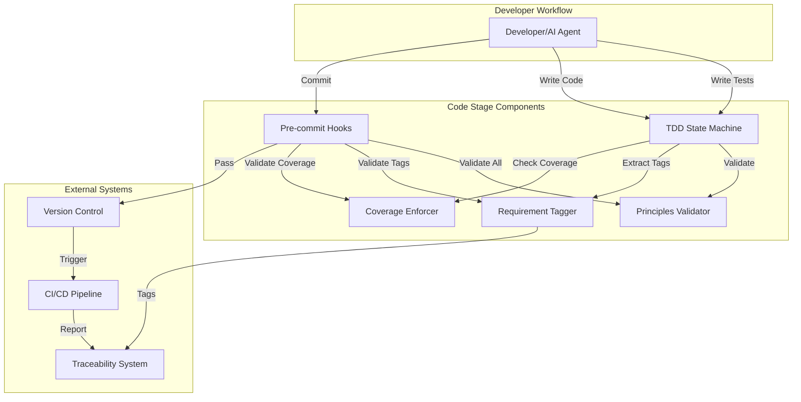
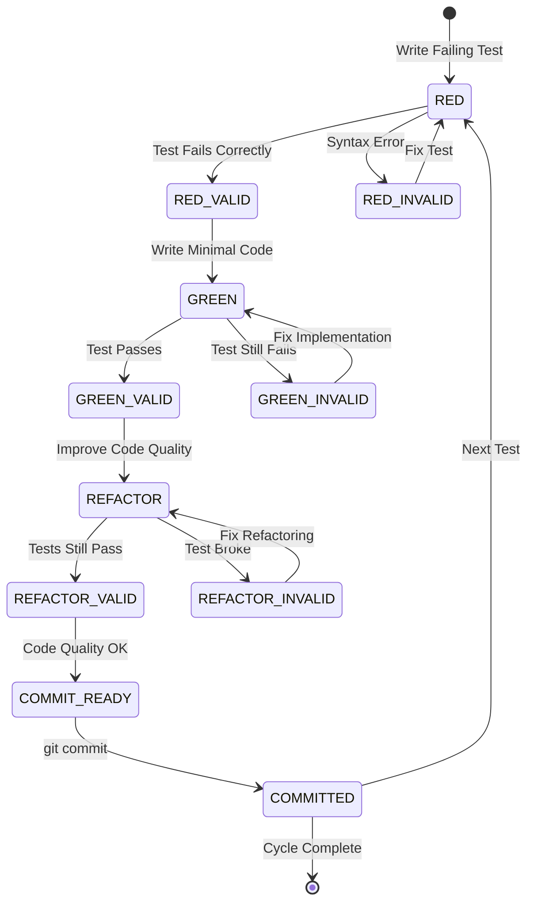
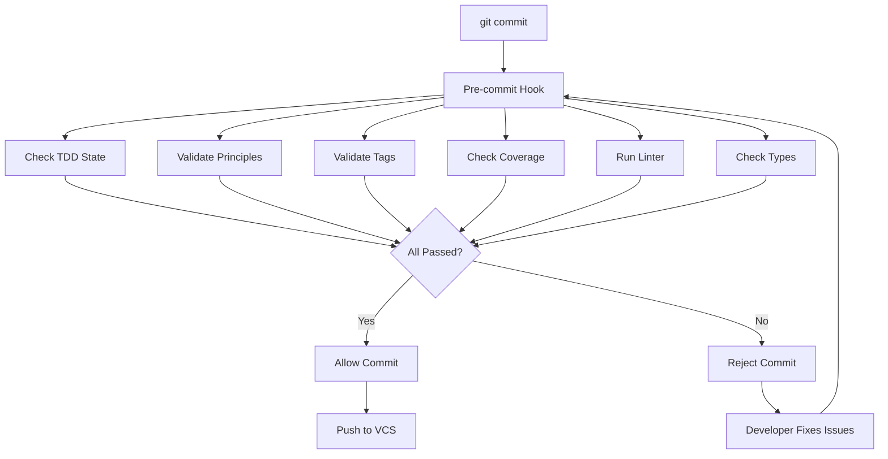
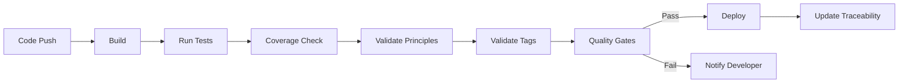

# Code Stage Design Document

**Design Document**: CODE_STAGE_DESIGN.md
**Solution**: claude_aisdlc
**Stage**: 2 - Design (Section 5.0)
**Status**: Draft v1.0
**Created**: 2025-12-03

---

## Document Control

**Requirements Mapped**:
- REQ-CODE-001: TDD Workflow (Critical)
- REQ-CODE-002: Key Principles Enforcement (High)
- REQ-CODE-003: Code-to-Requirement Tagging (Critical)
- REQ-CODE-004: Test Coverage (High)

**References**:
- Section 7.0 (Code Stage) in ai_sdlc_method.md
- KEY_PRINCIPLES.md (7 principles)
- TDD_WORKFLOW.md (RED → GREEN → REFACTOR → COMMIT)
- stages_config.yml (Code stage configuration)

**Related Designs**:
- WORKFLOW_STAGE_DESIGN.md (Stage orchestration)
- TRACEABILITY_DESIGN.md (Requirement key tracking)

---

## 1. Executive Summary

### 1.1 Purpose

Transform Code Stage requirements into implementable technical specifications that enable:
1. **TDD Workflow Enforcement** - State machine for RED → GREEN → REFACTOR → COMMIT
2. **Key Principles Validation** - Automated checks for 7 principles
3. **Requirement Tagging** - Automatic extraction and validation of REQ-* tags
4. **Coverage Gates** - Test coverage enforcement and quality metrics

### 1.2 Design Goals

- **Zero Ambiguity** - Every requirement has clear, codeable solution
- **Automation First** - Maximum automation, minimal manual intervention
- **Developer Experience** - Seamless integration with existing workflows
- **100% Traceability** - Every code artifact maps to requirements

### 1.3 Non-Goals

- **NOT CI/CD platform-specific** - Design works with any CI/CD
- **NOT language-specific** - Patterns applicable to Python, JavaScript, TypeScript, etc.
- **NOT IDE-specific** - Works with any editor/IDE

---

## 2. Component Architecture

### 2.1 System Context Diagram



### 2.2 Component Responsibilities

| Component | Responsibility | Implements |
|:---|:---|:---|
| TDD State Machine | Track RED → GREEN → REFACTOR → COMMIT cycle | REQ-CODE-001 |
| Principles Validator | Validate 7 Key Principles compliance | REQ-CODE-002 |
| Requirement Tagger | Extract and validate REQ-* tags | REQ-CODE-003 |
| Coverage Enforcer | Ensure 80% minimum coverage | REQ-CODE-004 |
| Pre-commit Hooks | Validation gate before commits | All |

---

## 3. TDD State Machine Design

**Implements**: REQ-CODE-001 (TDD Workflow)

### 3.1 State Diagram



### 3.2 State Definitions

#### 3.2.1 RED State

**Purpose**: Write a failing test that defines desired behavior

**Entry Criteria**:
- Previous cycle completed OR starting new feature
- Test file exists or can be created

**Activities**:
1. Identify functionality to test
2. Write test case with clear AAA structure (Arrange-Act-Assert)
3. Run test (should fail)
4. Verify failure reason is correct (not syntax error)

**Exit Criteria**:
- Test exists
- Test fails when run
- Failure is for expected reason (function not implemented, wrong behavior, etc.)

**Validation**:
```python
def validate_red_state(test_result):
    """Validate RED state requirements."""
    assert test_result.status == "FAILED", "Test must fail in RED state"
    assert not test_result.has_syntax_errors, "Test must be syntactically valid"
    assert test_result.failure_reason_valid, "Failure must be for right reason"
    return True
```

**Artifacts**:
- Test file: `tests/test_*.py` (Python) or `*.test.js` (JavaScript)
- Test function with descriptive name
- Clear test structure (AAA pattern)

#### 3.2.2 GREEN State

**Purpose**: Write minimal code to make test pass

**Entry Criteria**:
- RED state validated
- Test file runs successfully (even if failing)

**Activities**:
1. Write simplest possible implementation
2. Run test (should pass)
3. No premature optimization
4. No extra features

**Exit Criteria**:
- Test passes when run
- Implementation is minimal
- No test modifications (only implementation changed)

**Validation**:
```python
def validate_green_state(test_result, code_diff):
    """Validate GREEN state requirements."""
    assert test_result.status == "PASSED", "Test must pass in GREEN state"
    assert not test_file_modified(code_diff), "Test files should not change"
    assert implementation_exists(code_diff), "Implementation code must exist"
    return True
```

**Artifacts**:
- Implementation file: `src/**/*.py` or `src/**/*.js`
- Function/class/method that makes test pass

#### 3.2.3 REFACTOR State

**Purpose**: Improve code quality while keeping tests green

**Entry Criteria**:
- GREEN state validated
- All tests passing

**Activities**:
1. Identify improvement opportunities
2. Refactor one change at a time
3. Run tests after each change
4. Keep tests passing throughout

**Exit Criteria**:
- All tests still passing
- Code quality improved (readability, structure, documentation)
- No behavior changes

**Refactoring Checklist**:
- [ ] Remove duplication
- [ ] Improve naming (variables, functions, classes)
- [ ] Add/improve docstrings
- [ ] Extract complex logic into functions
- [ ] Add type hints (Python) or types (TypeScript)
- [ ] Improve error handling

**Validation**:
```python
def validate_refactor_state(test_results, code_quality_metrics):
    """Validate REFACTOR state requirements."""
    assert all(t.status == "PASSED" for t in test_results), "All tests must pass"
    assert code_quality_metrics.improved, "Code quality must improve"
    assert not behavior_changed(test_results), "Behavior must not change"
    return True
```

**Artifacts**:
- Updated implementation with improved quality
- Optional: Updated documentation

#### 3.2.4 COMMIT_READY State

**Purpose**: Validate all quality gates before commit

**Entry Criteria**:
- REFACTOR state validated
- All tests passing
- Code quality acceptable

**Quality Gates**:
1. All tests pass
2. Coverage threshold met (80% minimum)
3. Key Principles validated
4. Requirement tags present
5. No linter errors
6. No type errors

**Validation**:
```python
def validate_commit_ready(project_state):
    """Validate COMMIT_READY state requirements."""
    gates = [
        ("Tests", all_tests_pass(project_state)),
        ("Coverage", coverage_threshold_met(project_state, min_coverage=80)),
        ("Principles", key_principles_validated(project_state)),
        ("Tags", requirement_tags_present(project_state)),
        ("Linter", no_linter_errors(project_state)),
        ("Types", no_type_errors(project_state))
    ]

    failed_gates = [(name, result) for name, result in gates if not result]

    if failed_gates:
        raise QualityGateFailure(f"Failed gates: {failed_gates}")

    return True
```

**Artifacts**:
- All code changes staged
- Quality gate report

#### 3.2.5 COMMITTED State

**Purpose**: Save validated changes with traceability

**Entry Criteria**:
- COMMIT_READY state validated
- Commit message prepared

**Activities**:
1. Stage all relevant changes
2. Create commit with structured message
3. Push to version control

**Commit Message Format**:
```
<type>: <short summary> (<REQ-KEY>)

<detailed description>

Implements: <REQ-KEY-1>, <REQ-KEY-2>
Tests: <test evidence>
Coverage: <coverage percentage>

Co-Authored-By: Claude <noreply@anthropic.com>
```

**Commit Types**:
- `feat`: New feature
- `fix`: Bug fix
- `refactor`: Code refactoring
- `test`: Test additions/changes
- `docs`: Documentation only
- `chore`: Build/config changes

**Example**:
```bash
git commit -m "$(cat <<'EOF'
feat: implement two-hierarchy merging (REQ-F-CONFIG-001)

Add merge() method to HierarchyMerger that combines two hierarchies
with priority-based override semantics. Later configs override earlier.

Implements: REQ-F-CONFIG-001, REQ-NFR-PERF-001
Tests:
- test_merge_two_hierarchies: PASS
- test_merge_single_hierarchy: PASS
- test_merge_empty_list_raises_error: PASS
Coverage: 95% (mergers/hierarchy_merger.py)

Co-Authored-By: Claude <noreply@anthropic.com>
EOF
)"
```

**Exit Criteria**:
- Changes committed to VCS
- Commit message includes requirement tags
- Traceability linkage established

**Next Action**: Start next cycle (RED state for next test)

### 3.3 State Transition Rules

| From State | To State | Trigger | Validation |
|:---|:---|:---|:---|
| RED | GREEN | Test fails correctly | `validate_red_state()` |
| GREEN | REFACTOR | Test passes | `validate_green_state()` |
| REFACTOR | COMMIT_READY | Tests still pass, quality improved | `validate_refactor_state()` |
| COMMIT_READY | COMMITTED | All gates pass | `validate_commit_ready()` |
| COMMITTED | RED | Ready for next test | Previous cycle complete |
| Any | Previous | Validation fails | Re-do current state |

### 3.4 Implementation Design

#### 3.4.1 State Tracker Module

**File**: `src/code_stage/tdd_state_machine.py`

```python
from enum import Enum
from dataclasses import dataclass
from typing import Optional, List
from datetime import datetime

class TDDState(Enum):
    """TDD workflow states."""
    RED = "red"
    GREEN = "green"
    REFACTOR = "refactor"
    COMMIT_READY = "commit_ready"
    COMMITTED = "committed"

@dataclass
class StateTransition:
    """Record of state transition."""
    from_state: TDDState
    to_state: TDDState
    timestamp: datetime
    validation_passed: bool
    validation_details: dict

@dataclass
class TDDCycle:
    """Complete TDD cycle tracking."""
    cycle_id: str
    requirement_keys: List[str]
    current_state: TDDState
    history: List[StateTransition]
    start_time: datetime
    end_time: Optional[datetime] = None
    artifacts: dict = None  # Files created/modified

class TDDStateMachine:
    """
    Tracks and validates TDD workflow state transitions.

    Implements: REQ-CODE-001
    """

    def __init__(self):
        self.current_cycle: Optional[TDDCycle] = None
        self.completed_cycles: List[TDDCycle] = []

    def start_cycle(self, requirement_keys: List[str]) -> TDDCycle:
        """Start new TDD cycle."""
        cycle = TDDCycle(
            cycle_id=self._generate_cycle_id(),
            requirement_keys=requirement_keys,
            current_state=TDDState.RED,
            history=[],
            start_time=datetime.now(),
            artifacts={}
        )
        self.current_cycle = cycle
        return cycle

    def transition_to(self, target_state: TDDState, validation_data: dict) -> bool:
        """
        Attempt state transition with validation.

        Returns: True if transition successful, False otherwise
        """
        if not self.current_cycle:
            raise ValueError("No active TDD cycle")

        current = self.current_cycle.current_state

        # Validate transition is allowed
        if not self._is_valid_transition(current, target_state):
            return False

        # Validate state requirements
        validation_passed = self._validate_state_transition(
            current, target_state, validation_data
        )

        # Record transition
        transition = StateTransition(
            from_state=current,
            to_state=target_state,
            timestamp=datetime.now(),
            validation_passed=validation_passed,
            validation_details=validation_data
        )
        self.current_cycle.history.append(transition)

        if validation_passed:
            self.current_cycle.current_state = target_state

            # If COMMITTED, complete cycle
            if target_state == TDDState.COMMITTED:
                self._complete_cycle()

        return validation_passed

    def _validate_state_transition(
        self, from_state: TDDState, to_state: TDDState, data: dict
    ) -> bool:
        """Validate state transition requirements."""
        validators = {
            (TDDState.RED, TDDState.GREEN): self._validate_red_to_green,
            (TDDState.GREEN, TDDState.REFACTOR): self._validate_green_to_refactor,
            (TDDState.REFACTOR, TDDState.COMMIT_READY): self._validate_refactor_to_commit,
            (TDDState.COMMIT_READY, TDDState.COMMITTED): self._validate_commit_ready,
        }

        validator = validators.get((from_state, to_state))
        if not validator:
            return False

        return validator(data)

    def _validate_red_to_green(self, data: dict) -> bool:
        """Validate RED → GREEN transition."""
        test_result = data.get('test_result')
        if not test_result:
            return False

        return (
            test_result.get('status') == 'FAILED' and
            not test_result.get('has_syntax_errors') and
            test_result.get('failure_reason_valid')
        )

    def _validate_green_to_refactor(self, data: dict) -> bool:
        """Validate GREEN → REFACTOR transition."""
        test_result = data.get('test_result')
        code_diff = data.get('code_diff')

        if not test_result or not code_diff:
            return False

        return (
            test_result.get('status') == 'PASSED' and
            not self._test_files_modified(code_diff)
        )

    def _validate_refactor_to_commit(self, data: dict) -> bool:
        """Validate REFACTOR → COMMIT_READY transition."""
        test_results = data.get('test_results', [])
        quality_metrics = data.get('quality_metrics', {})

        return (
            all(t.get('status') == 'PASSED' for t in test_results) and
            quality_metrics.get('improved', False)
        )

    def _validate_commit_ready(self, data: dict) -> bool:
        """Validate COMMIT_READY → COMMITTED transition."""
        gates = data.get('quality_gates', {})

        required_gates = [
            'tests_pass',
            'coverage_met',
            'principles_validated',
            'tags_present',
            'no_linter_errors',
            'no_type_errors'
        ]

        return all(gates.get(gate, False) for gate in required_gates)

    def get_cycle_summary(self) -> dict:
        """Get current cycle summary."""
        if not self.current_cycle:
            return {}

        return {
            'cycle_id': self.current_cycle.cycle_id,
            'requirement_keys': self.current_cycle.requirement_keys,
            'current_state': self.current_cycle.current_state.value,
            'transitions': len(self.current_cycle.history),
            'duration_seconds': (
                datetime.now() - self.current_cycle.start_time
            ).total_seconds()
        }
```

#### 3.4.2 CLI Integration

**File**: `src/code_stage/cli.py`

```python
import click
from .tdd_state_machine import TDDStateMachine, TDDState

@click.group()
def tdd():
    """TDD workflow commands."""
    pass

@tdd.command()
@click.option('--req', '-r', multiple=True, help='Requirement keys')
def start(req):
    """Start new TDD cycle."""
    machine = TDDStateMachine.load_or_create()
    cycle = machine.start_cycle(list(req))
    click.echo(f"Started TDD cycle {cycle.cycle_id}")
    click.echo(f"Current state: RED")
    click.echo("Write a failing test to continue")

@tdd.command()
def status():
    """Show current TDD state."""
    machine = TDDStateMachine.load_or_create()
    summary = machine.get_cycle_summary()

    if not summary:
        click.echo("No active TDD cycle")
        return

    click.echo(f"Cycle: {summary['cycle_id']}")
    click.echo(f"State: {summary['current_state']}")
    click.echo(f"Requirements: {', '.join(summary['requirement_keys'])}")
    click.echo(f"Duration: {summary['duration_seconds']:.1f}s")

@tdd.command()
@click.argument('state', type=click.Choice(['green', 'refactor', 'commit']))
def next(state):
    """Move to next TDD state."""
    machine = TDDStateMachine.load_or_create()

    # Collect validation data
    validation_data = collect_validation_data(state)

    target_state = TDDState[state.upper()]
    success = machine.transition_to(target_state, validation_data)

    if success:
        click.echo(f"Transitioned to {state.upper()} state")
    else:
        click.echo(f"Validation failed for {state.upper()} transition")
        click.echo("Check requirements and try again")
```

**Usage Examples**:
```bash
# Start TDD cycle
aisdlc-tdd start --req REQ-F-AUTH-001 --req REQ-NFR-PERF-001

# Check status
aisdlc-tdd status

# Move to GREEN (after writing failing test)
aisdlc-tdd next green

# Move to REFACTOR (after test passes)
aisdlc-tdd next refactor

# Ready to commit (after refactoring)
aisdlc-tdd next commit
```

---

## 4. Key Principles Validator Design

**Implements**: REQ-CODE-002 (Key Principles Enforcement)

### 4.1 Principles Checklist

The 7 Key Principles from KEY_PRINCIPLES.md:

1. Test Driven Development - "No code without tests"
2. Fail Fast & Root Cause - "Break loudly, fix completely"
3. Modular & Maintainable - "Single responsibility, loose coupling"
4. Reuse Before Build - "Check first, create second"
5. Open Source First - "Suggest alternatives, human decides"
6. No Legacy Baggage - "Clean slate, no debt"
7. Perfectionist Excellence - "Best of breed only"

### 4.2 Validation Rules

#### 4.2.1 Principle #1: Test Driven Development

**Validation Rule**: Every function/method must have corresponding test

**Implementation**:
```python
def validate_tdd_principle(codebase: Codebase) -> ValidationResult:
    """
    Validate TDD principle - every function has tests.

    Implements: REQ-CODE-002 (Principle #1)
    """
    violations = []

    # Find all functions/methods in implementation code
    functions = extract_functions(codebase, exclude_patterns=['test_*', '*_test.py'])

    # Find all test functions
    test_functions = extract_test_functions(codebase)

    # Check each function has tests
    for func in functions:
        if not has_corresponding_test(func, test_functions):
            violations.append({
                'principle': 'TDD',
                'severity': 'CRITICAL',
                'file': func.file_path,
                'function': func.name,
                'message': f"Function '{func.name}' has no tests"
            })

    # Check test coverage
    coverage = run_coverage_analysis(codebase)
    if coverage.percentage < 80:
        violations.append({
            'principle': 'TDD',
            'severity': 'HIGH',
            'message': f"Coverage {coverage.percentage}% < 80% minimum"
        })

    return ValidationResult(
        principle='TDD',
        passed=len(violations) == 0,
        violations=violations
    )
```

**Automated Check**:
```yaml
# .aisdlc/validation/principles.yml
tdd:
  enabled: true
  rules:
    - name: "functions_have_tests"
      severity: "critical"
      check: "every function has test"
    - name: "minimum_coverage"
      severity: "high"
      threshold: 80
      check: "coverage >= threshold"
```

#### 4.2.2 Principle #2: Fail Fast & Root Cause

**Validation Rule**: No silent error handling, all errors raised explicitly

**Implementation**:
```python
def validate_fail_fast_principle(codebase: Codebase) -> ValidationResult:
    """
    Validate Fail Fast principle - no silent error handling.

    Implements: REQ-CODE-002 (Principle #2)
    """
    violations = []

    # Pattern: except: pass (silent error)
    silent_errors = find_patterns(codebase, patterns=[
        r'except:\s*pass',
        r'except\s+\w+:\s*pass',
        r'except.*:\s*\.\.\.',  # Empty except with ellipsis
    ])

    for match in silent_errors:
        violations.append({
            'principle': 'Fail Fast',
            'severity': 'CRITICAL',
            'file': match.file_path,
            'line': match.line_number,
            'code': match.matched_text,
            'message': 'Silent error handling detected - errors must fail loudly'
        })

    # Pattern: return None on error (hiding failure)
    hidden_failures = find_patterns(codebase, patterns=[
        r'except.*:\s*return None',
        r'if\s+error:\s*return None',
    ])

    for match in hidden_failures:
        violations.append({
            'principle': 'Fail Fast',
            'severity': 'HIGH',
            'file': match.file_path,
            'line': match.line_number,
            'message': 'Hidden failure - should raise exception instead'
        })

    return ValidationResult(
        principle='Fail Fast',
        passed=len(violations) == 0,
        violations=violations
    )
```

**Example - Violation**:
```python
# ❌ VIOLATION: Silent error handling
try:
    result = load_config(path)
except:
    pass  # Silent failure
```

**Example - Compliant**:
```python
# ✅ COMPLIANT: Fail loudly
def load_config(path: Path) -> Config:
    if not path.exists():
        raise FileNotFoundError(f"Config not found: {path}")

    try:
        return Config.from_yaml(path)
    except YAMLError as e:
        raise ConfigurationError(f"Invalid YAML in {path}: {e}")
```

#### 4.2.3 Principle #3: Modular & Maintainable

**Validation Rule**: Functions/classes have single responsibility, low coupling

**Implementation**:
```python
def validate_modularity_principle(codebase: Codebase) -> ValidationResult:
    """
    Validate Modularity principle - single responsibility.

    Implements: REQ-CODE-002 (Principle #3)
    """
    violations = []

    # Check function complexity (cyclomatic complexity)
    for func in extract_functions(codebase):
        complexity = calculate_cyclomatic_complexity(func)
        if complexity > 10:
            violations.append({
                'principle': 'Modular',
                'severity': 'HIGH',
                'file': func.file_path,
                'function': func.name,
                'complexity': complexity,
                'message': f"Complexity {complexity} > 10 - consider refactoring"
            })

    # Check function length
    for func in extract_functions(codebase):
        if len(func.lines) > 50:
            violations.append({
                'principle': 'Modular',
                'severity': 'MEDIUM',
                'file': func.file_path,
                'function': func.name,
                'lines': len(func.lines),
                'message': f"Function {len(func.lines)} lines - consider splitting"
            })

    # Check class size (God class detection)
    for cls in extract_classes(codebase):
        if len(cls.methods) > 15:
            violations.append({
                'principle': 'Modular',
                'severity': 'HIGH',
                'file': cls.file_path,
                'class': cls.name,
                'methods': len(cls.methods),
                'message': f"Class has {len(cls.methods)} methods - consider splitting"
            })

    return ValidationResult(
        principle='Modular',
        passed=len(violations) == 0,
        violations=violations
    )
```

**Metrics**:
- **Cyclomatic Complexity**: Max 10 per function
- **Function Length**: Max 50 lines
- **Class Size**: Max 15 methods
- **Coupling**: Max 7 dependencies per module

#### 4.2.4 Principle #4: Reuse Before Build

**Validation Rule**: Check for duplicate functionality

**Implementation**:
```python
def validate_reuse_principle(codebase: Codebase) -> ValidationResult:
    """
    Validate Reuse principle - avoid duplication.

    Implements: REQ-CODE-002 (Principle #4)
    """
    violations = []

    # Detect code duplication
    duplicates = find_duplicate_code(codebase, min_lines=6)

    for dup in duplicates:
        violations.append({
            'principle': 'Reuse',
            'severity': 'MEDIUM',
            'files': [dup.location1.file, dup.location2.file],
            'lines': dup.line_count,
            'message': f"Duplicate code found ({dup.line_count} lines)"
        })

    # Check for reinventing stdlib
    stdlib_violations = find_stdlib_reinvention(codebase)

    for violation in stdlib_violations:
        violations.append({
            'principle': 'Reuse',
            'severity': 'HIGH',
            'file': violation.file_path,
            'function': violation.function_name,
            'stdlib_equivalent': violation.stdlib_function,
            'message': f"Use {violation.stdlib_function} instead of reimplementing"
        })

    return ValidationResult(
        principle='Reuse',
        passed=len(violations) == 0,
        violations=violations
    )
```

#### 4.2.5 Principle #5: Open Source First

**Validation Rule**: Document library choices with rationale

**Implementation**:
```python
def validate_open_source_principle(codebase: Codebase) -> ValidationResult:
    """
    Validate Open Source principle - document dependencies.

    Implements: REQ-CODE-002 (Principle #5)
    """
    violations = []

    # Check dependencies are documented
    dependencies = extract_dependencies(codebase)  # From requirements.txt, package.json
    documented = extract_documented_dependencies(codebase)  # From docs/dependencies.md

    undocumented = set(dependencies) - set(documented)

    for dep in undocumented:
        violations.append({
            'principle': 'Open Source',
            'severity': 'MEDIUM',
            'dependency': dep,
            'message': f"Dependency '{dep}' not documented with rationale"
        })

    return ValidationResult(
        principle='Open Source',
        passed=len(violations) == 0,
        violations=violations
    )
```

**Expected Documentation** (`docs/dependencies.md`):
```markdown
# Dependencies

## requests (v2.31.0)
**Purpose**: HTTP client for API calls
**Alternatives Considered**:
- urllib (built-in): Too low-level
- httpx: Async support not needed
**Rationale**: Industry standard, well-tested, simple API

## pyyaml (v6.0)
**Purpose**: YAML configuration parsing
**Alternatives Considered**:
- json (built-in): YAML more readable for configs
- toml: Less widespread adoption
**Rationale**: Human-friendly config format
```

#### 4.2.6 Principle #6: No Legacy Baggage

**Validation Rule**: No deprecated code, no technical debt markers

**Implementation**:
```python
def validate_no_legacy_principle(codebase: Codebase) -> ValidationResult:
    """
    Validate No Legacy principle - no technical debt.

    Implements: REQ-CODE-002 (Principle #6)
    """
    violations = []

    # Find TODO comments (technical debt markers)
    todos = find_patterns(codebase, patterns=[
        r'#\s*TODO',
        r'#\s*FIXME',
        r'#\s*HACK',
        r'#\s*XXX',
    ])

    for todo in todos:
        violations.append({
            'principle': 'No Legacy',
            'severity': 'MEDIUM',
            'file': todo.file_path,
            'line': todo.line_number,
            'message': f"Technical debt marker found: {todo.matched_text}"
        })

    # Find deprecated decorators/comments
    deprecated = find_patterns(codebase, patterns=[
        r'@deprecated',
        r'#\s*DEPRECATED',
    ])

    for dep in deprecated:
        violations.append({
            'principle': 'No Legacy',
            'severity': 'HIGH',
            'file': dep.file_path,
            'line': dep.line_number,
            'message': 'Deprecated code should be removed, not kept'
        })

    return ValidationResult(
        principle='No Legacy',
        passed=len(violations) == 0,
        violations=violations
    )
```

**Note**: This principle can evolve per project context. For operational systems, it may become "Feature Flag All Changes" instead.

#### 4.2.7 Principle #7: Perfectionist Excellence

**Validation Rule**: Code quality metrics meet high standards

**Implementation**:
```python
def validate_excellence_principle(codebase: Codebase) -> ValidationResult:
    """
    Validate Excellence principle - high quality standards.

    Implements: REQ-CODE-002 (Principle #7)
    """
    violations = []

    # Check documentation completeness
    undocumented = find_undocumented_functions(codebase)

    for func in undocumented:
        violations.append({
            'principle': 'Excellence',
            'severity': 'MEDIUM',
            'file': func.file_path,
            'function': func.name,
            'message': 'Public function missing docstring'
        })

    # Check type hints (Python)
    untyped = find_untyped_functions(codebase)

    for func in untyped:
        violations.append({
            'principle': 'Excellence',
            'severity': 'MEDIUM',
            'file': func.file_path,
            'function': func.name,
            'message': 'Function missing type hints'
        })

    # Run linter
    linter_issues = run_linter(codebase)

    for issue in linter_issues:
        if issue.severity in ['error', 'warning']:
            violations.append({
                'principle': 'Excellence',
                'severity': 'HIGH' if issue.severity == 'error' else 'MEDIUM',
                'file': issue.file_path,
                'line': issue.line_number,
                'message': issue.message
            })

    return ValidationResult(
        principle='Excellence',
        passed=len(violations) == 0,
        violations=violations
    )
```

**Quality Metrics**:
- **Documentation**: 100% of public functions
- **Type Hints**: 100% of function signatures
- **Linter**: 0 errors, 0 warnings
- **Test Coverage**: ≥80%

### 4.3 Principles Validator Implementation

**File**: `src/code_stage/principles_validator.py`

```python
from typing import List, Dict
from dataclasses import dataclass

@dataclass
class ValidationResult:
    """Result of principle validation."""
    principle: str
    passed: bool
    violations: List[Dict]
    severity_summary: Dict[str, int] = None

    def __post_init__(self):
        if self.severity_summary is None:
            self.severity_summary = self._calculate_severity_summary()

    def _calculate_severity_summary(self) -> Dict[str, int]:
        """Calculate count of violations by severity."""
        summary = {'CRITICAL': 0, 'HIGH': 0, 'MEDIUM': 0, 'LOW': 0}
        for v in self.violations:
            severity = v.get('severity', 'MEDIUM')
            summary[severity] = summary.get(severity, 0) + 1
        return summary

class PrinciplesValidator:
    """
    Validates Key Principles compliance.

    Implements: REQ-CODE-002
    """

    def __init__(self, config: dict = None):
        self.config = config or self._default_config()
        self.validators = {
            'TDD': validate_tdd_principle,
            'Fail Fast': validate_fail_fast_principle,
            'Modular': validate_modularity_principle,
            'Reuse': validate_reuse_principle,
            'Open Source': validate_open_source_principle,
            'No Legacy': validate_no_legacy_principle,
            'Excellence': validate_excellence_principle,
        }

    def validate_all(self, codebase: Codebase) -> Dict[str, ValidationResult]:
        """
        Validate all 7 Key Principles.

        Returns: Dictionary mapping principle name to ValidationResult
        """
        results = {}

        for principle_name, validator_func in self.validators.items():
            if self._is_principle_enabled(principle_name):
                result = validator_func(codebase)
                results[principle_name] = result

        return results

    def validate_principle(
        self, principle_name: str, codebase: Codebase
    ) -> ValidationResult:
        """Validate specific principle."""
        validator = self.validators.get(principle_name)
        if not validator:
            raise ValueError(f"Unknown principle: {principle_name}")

        return validator(codebase)

    def generate_report(self, results: Dict[str, ValidationResult]) -> str:
        """Generate human-readable validation report."""
        lines = ["Key Principles Validation Report", "=" * 50, ""]

        passed_count = sum(1 for r in results.values() if r.passed)
        total_count = len(results)

        lines.append(f"Overall: {passed_count}/{total_count} principles passed")
        lines.append("")

        for principle, result in results.items():
            status = "✅ PASS" if result.passed else "❌ FAIL"
            lines.append(f"{principle}: {status}")

            if not result.passed:
                for severity, count in result.severity_summary.items():
                    if count > 0:
                        lines.append(f"  {severity}: {count} violation(s)")

                # Show first 3 violations
                for violation in result.violations[:3]:
                    lines.append(f"  - {violation['message']}")
                    if 'file' in violation:
                        lines.append(f"    File: {violation['file']}")

                if len(result.violations) > 3:
                    lines.append(f"  ... and {len(result.violations) - 3} more")

            lines.append("")

        return "\n".join(lines)

    def _is_principle_enabled(self, principle_name: str) -> bool:
        """Check if principle validation is enabled."""
        return self.config.get('principles', {}).get(principle_name, {}).get('enabled', True)

    def _default_config(self) -> dict:
        """Default validation configuration."""
        return {
            'principles': {
                'TDD': {'enabled': True, 'min_coverage': 80},
                'Fail Fast': {'enabled': True},
                'Modular': {'enabled': True, 'max_complexity': 10},
                'Reuse': {'enabled': True, 'min_duplicate_lines': 6},
                'Open Source': {'enabled': True},
                'No Legacy': {'enabled': True},
                'Excellence': {'enabled': True},
            }
        }
```

### 4.4 CLI Integration

```bash
# Validate all principles
aisdlc-principles validate

# Validate specific principle
aisdlc-principles validate --principle TDD

# Generate report
aisdlc-principles report --output principles_report.txt

# CI/CD integration (fail on violations)
aisdlc-principles validate --strict
```

---

## 5. Requirement Tagger Design

**Implements**: REQ-CODE-003 (Code-to-Requirement Tagging)

### 5.1 Tag Format Specification

#### 5.1.1 Comment Tag Format

**Python**:
```python
# Implements: REQ-F-AUTH-001
# Implements: REQ-F-AUTH-001, REQ-NFR-PERF-001
# Validates: REQ-DATA-001
# Related: REQ-F-CONFIG-001
```

**JavaScript/TypeScript**:
```javascript
// Implements: REQ-F-AUTH-001
// Implements: REQ-F-AUTH-001, REQ-NFR-PERF-001
/* Implements: REQ-F-AUTH-001 */
```

**Tag Types**:
- `Implements`: This code implements the requirement
- `Validates`: This test validates the requirement
- `Related`: This code is related but doesn't fully implement

#### 5.1.2 Commit Message Tags

```
feat: implement user login (REQ-F-AUTH-001)

Implements: REQ-F-AUTH-001, REQ-NFR-PERF-001
Validates: REQ-DATA-001
```

#### 5.1.3 Requirement Key Format

**Pattern**: `REQ-<TYPE>-<CATEGORY>-<ID>`

**Types**:
- `F` - Functional
- `NFR` - Non-Functional
- `DATA` - Data Quality
- `BR` - Business Rule

**Examples**:
- `REQ-F-AUTH-001` - Functional requirement for authentication
- `REQ-NFR-PERF-001` - Non-functional performance requirement
- `REQ-DATA-001` - Data quality requirement
- `REQ-BR-CALC-001` - Business rule for calculations

### 5.2 Tag Extraction Patterns

#### 5.2.1 Regex Patterns

```python
TAG_PATTERNS = {
    'python': {
        'inline': r'#\s*(Implements|Validates|Related):\s*(REQ-[A-Z]+-[A-Z0-9]+-\d+(?:,\s*REQ-[A-Z]+-[A-Z0-9]+-\d+)*)',
        'docstring': r'"""[\s\S]*?(Implements|Validates|Related):\s*(REQ-[A-Z]+-[A-Z0-9]+-\d+(?:,\s*REQ-[A-Z]+-[A-Z0-9]+-\d+)*)[\s\S]*?"""',
    },
    'javascript': {
        'single_line': r'//\s*(Implements|Validates|Related):\s*(REQ-[A-Z]+-[A-Z0-9]+-\d+(?:,\s*REQ-[A-Z]+-[A-Z0-9]+-\d+)*)',
        'multi_line': r'/\*[\s\S]*?(Implements|Validates|Related):\s*(REQ-[A-Z]+-[A-Z0-9]+-\d+(?:,\s*REQ-[A-Z]+-[A-Z0-9]+-\d+)*)[\s\S]*?\*/',
    },
    'commit': {
        'subject': r'\(REQ-[A-Z]+-[A-Z0-9]+-\d+\)',
        'body': r'(Implements|Validates|Related):\s*(REQ-[A-Z]+-[A-Z0-9]+-\d+(?:,\s*REQ-[A-Z]+-[A-Z0-9]+-\d+)*)',
    }
}

REQ_KEY_PATTERN = r'REQ-[A-Z]+-[A-Z0-9]+-\d+'
```

### 5.3 Tag Extractor Implementation

**File**: `src/code_stage/requirement_tagger.py`

```python
import re
from pathlib import Path
from typing import List, Dict, Set
from dataclasses import dataclass

@dataclass
class RequirementTag:
    """A requirement tag found in code."""
    req_key: str
    tag_type: str  # 'Implements', 'Validates', 'Related'
    file_path: str
    line_number: int
    context: str  # Surrounding code context

@dataclass
class TaggingReport:
    """Report of requirement tagging status."""
    total_files: int
    tagged_files: int
    total_tags: int
    tags_by_type: Dict[str, int]
    tags_by_requirement: Dict[str, List[RequirementTag]]
    untagged_files: List[str]
    coverage_percentage: float

class RequirementTagger:
    """
    Extracts and validates requirement tags in code.

    Implements: REQ-CODE-003
    """

    def __init__(self):
        self.patterns = TAG_PATTERNS
        self.req_key_pattern = re.compile(REQ_KEY_PATTERN)

    def extract_tags_from_file(self, file_path: Path) -> List[RequirementTag]:
        """Extract all requirement tags from a file."""
        tags = []

        # Detect language
        language = self._detect_language(file_path)
        if not language:
            return tags

        # Read file
        try:
            content = file_path.read_text()
        except Exception as e:
            print(f"Error reading {file_path}: {e}")
            return tags

        # Extract tags
        patterns = self.patterns.get(language, {})

        for pattern_name, pattern_regex in patterns.items():
            matches = re.finditer(pattern_regex, content, re.MULTILINE)

            for match in matches:
                tag_type = match.group(1)  # Implements, Validates, Related
                req_keys_str = match.group(2)  # REQ-F-AUTH-001, REQ-NFR-PERF-001

                # Split multiple requirements
                req_keys = [k.strip() for k in req_keys_str.split(',')]

                # Get line number
                line_number = content[:match.start()].count('\n') + 1

                # Get context (surrounding lines)
                context = self._get_context(content, match.start(), match.end())

                # Create tag for each requirement
                for req_key in req_keys:
                    tags.append(RequirementTag(
                        req_key=req_key,
                        tag_type=tag_type,
                        file_path=str(file_path),
                        line_number=line_number,
                        context=context
                    ))

        return tags

    def extract_tags_from_codebase(self, root_path: Path) -> List[RequirementTag]:
        """Extract all tags from entire codebase."""
        all_tags = []

        # Find all code files
        code_files = self._find_code_files(root_path)

        for file_path in code_files:
            tags = self.extract_tags_from_file(file_path)
            all_tags.extend(tags)

        return all_tags

    def generate_tagging_report(
        self, root_path: Path, all_tags: List[RequirementTag]
    ) -> TaggingReport:
        """Generate tagging status report."""
        code_files = self._find_code_files(root_path)

        # Group tags by file
        tags_by_file = {}
        for tag in all_tags:
            if tag.file_path not in tags_by_file:
                tags_by_file[tag.file_path] = []
            tags_by_file[tag.file_path].append(tag)

        # Count tags by type
        tags_by_type = {}
        for tag in all_tags:
            tags_by_type[tag.tag_type] = tags_by_type.get(tag.tag_type, 0) + 1

        # Group tags by requirement
        tags_by_requirement = {}
        for tag in all_tags:
            if tag.req_key not in tags_by_requirement:
                tags_by_requirement[tag.req_key] = []
            tags_by_requirement[tag.req_key].append(tag)

        # Find untagged files
        tagged_file_paths = set(tags_by_file.keys())
        all_file_paths = set(str(f) for f in code_files)
        untagged_files = list(all_file_paths - tagged_file_paths)

        # Calculate coverage
        tagged_count = len(tagged_file_paths)
        total_count = len(all_file_paths)
        coverage = (tagged_count / total_count * 100) if total_count > 0 else 0

        return TaggingReport(
            total_files=total_count,
            tagged_files=tagged_count,
            total_tags=len(all_tags),
            tags_by_type=tags_by_type,
            tags_by_requirement=tags_by_requirement,
            untagged_files=untagged_files,
            coverage_percentage=coverage
        )

    def validate_tags(
        self, tags: List[RequirementTag], valid_requirements: Set[str]
    ) -> List[Dict]:
        """
        Validate extracted tags against known requirements.

        Returns: List of validation errors
        """
        errors = []

        for tag in tags:
            # Check requirement exists
            if tag.req_key not in valid_requirements:
                errors.append({
                    'type': 'unknown_requirement',
                    'file': tag.file_path,
                    'line': tag.line_number,
                    'req_key': tag.req_key,
                    'message': f"Unknown requirement: {tag.req_key}"
                })

            # Check tag type is valid
            if tag.tag_type not in ['Implements', 'Validates', 'Related']:
                errors.append({
                    'type': 'invalid_tag_type',
                    'file': tag.file_path,
                    'line': tag.line_number,
                    'tag_type': tag.tag_type,
                    'message': f"Invalid tag type: {tag.tag_type}"
                })

        return errors

    def _detect_language(self, file_path: Path) -> str:
        """Detect programming language from file extension."""
        extension_map = {
            '.py': 'python',
            '.js': 'javascript',
            '.ts': 'javascript',
            '.jsx': 'javascript',
            '.tsx': 'javascript',
        }
        return extension_map.get(file_path.suffix, None)

    def _find_code_files(self, root_path: Path) -> List[Path]:
        """Find all code files in codebase."""
        patterns = ['**/*.py', '**/*.js', '**/*.ts', '**/*.jsx', '**/*.tsx']
        exclude_patterns = ['node_modules', 'venv', '__pycache__', '.git', 'dist', 'build']

        code_files = []
        for pattern in patterns:
            for file_path in root_path.glob(pattern):
                # Skip excluded directories
                if any(excl in file_path.parts for excl in exclude_patterns):
                    continue
                code_files.append(file_path)

        return code_files

    def _get_context(self, content: str, start: int, end: int, lines: int = 2) -> str:
        """Get surrounding context for a match."""
        lines_before_start = content[:start].split('\n')
        lines_after_end = content[end:].split('\n')

        context_before = '\n'.join(lines_before_start[-lines:])
        matched_text = content[start:end]
        context_after = '\n'.join(lines_after_end[:lines])

        return f"{context_before}\n>>> {matched_text} <<<\n{context_after}"
```

### 5.4 Tagging Validation

**Pre-commit Hook** (`.git/hooks/pre-commit`):
```bash
#!/bin/bash
# Pre-commit hook to validate requirement tags

echo "Validating requirement tags..."

# Extract tags from staged files
python -m code_stage.requirement_tagger validate --staged

if [ $? -ne 0 ]; then
    echo "ERROR: Requirement tag validation failed"
    echo "Please ensure all code files have valid requirement tags"
    exit 1
fi

echo "Requirement tags validated successfully"
```

**CLI Commands**:
```bash
# Extract all tags
aisdlc-tags extract --output tags_report.json

# Validate tags
aisdlc-tags validate --requirements-file requirements.yml

# Generate coverage report
aisdlc-tags report --format html --output tags_coverage.html

# List untagged files
aisdlc-tags untagged
```

### 5.5 Integration with Traceability System

```python
def export_tags_to_traceability_system(
    tags: List[RequirementTag], traceability_db: TraceabilityDB
):
    """
    Export requirement tags to traceability system.

    Implements: REQ-CODE-003 (integration with traceability)
    """
    for tag in tags:
        traceability_db.add_link(
            requirement_key=tag.req_key,
            artifact_type='code',
            artifact_path=tag.file_path,
            line_number=tag.line_number,
            link_type=tag.tag_type.lower(),  # implements, validates, related
            metadata={
                'context': tag.context,
                'timestamp': datetime.now().isoformat()
            }
        )
```

---

## 6. Coverage Enforcer Design

**Implements**: REQ-CODE-004 (Test Coverage)

### 6.1 Coverage Requirements

**Minimum Coverage**: 80% line coverage

**Coverage Types**:
- **Line Coverage**: Percentage of code lines executed
- **Branch Coverage**: Percentage of code branches taken
- **Function Coverage**: Percentage of functions called

**Exclusions**:
- Test files themselves
- Generated code
- Configuration files
- Migration scripts

### 6.2 Coverage Configuration

**Python** (`.coveragerc`):
```ini
[run]
source = src
omit =
    */tests/*
    */test_*.py
    */__pycache__/*
    */venv/*
    */migrations/*

[report]
fail_under = 80
show_missing = True
skip_covered = False

[html]
directory = coverage_html

[xml]
output = coverage.xml
```

**JavaScript** (`jest.config.js`):
```javascript
module.exports = {
  collectCoverage: true,
  coverageDirectory: 'coverage',
  coverageReporters: ['text', 'lcov', 'html'],
  coverageThreshold: {
    global: {
      lines: 80,
      branches: 80,
      functions: 80,
      statements: 80
    }
  },
  collectCoverageFrom: [
    'src/**/*.{js,jsx,ts,tsx}',
    '!src/**/*.test.{js,jsx,ts,tsx}',
    '!src/**/__tests__/**',
    '!src/**/node_modules/**'
  ]
};
```

### 6.3 Coverage Enforcer Implementation

**File**: `src/code_stage/coverage_enforcer.py`

```python
from pathlib import Path
from typing import Dict, List
from dataclasses import dataclass
import json

@dataclass
class CoverageMetrics:
    """Coverage metrics for codebase."""
    line_coverage: float
    branch_coverage: float
    function_coverage: float
    total_lines: int
    covered_lines: int
    total_branches: int
    covered_branches: int
    total_functions: int
    covered_functions: int
    files: Dict[str, float]  # file_path -> coverage percentage

@dataclass
class CoverageViolation:
    """Coverage threshold violation."""
    file_path: str
    current_coverage: float
    required_coverage: float
    missing_lines: List[int]

class CoverageEnforcer:
    """
    Enforces test coverage requirements.

    Implements: REQ-CODE-004
    """

    def __init__(self, config: dict = None):
        self.config = config or self._default_config()
        self.min_coverage = self.config.get('min_coverage', 80)

    def run_coverage_analysis(self, root_path: Path) -> CoverageMetrics:
        """Run coverage analysis on codebase."""
        # Run pytest with coverage (Python)
        result = subprocess.run(
            ['pytest', '--cov=src', '--cov-report=json', '--cov-report=term'],
            cwd=root_path,
            capture_output=True,
            text=True
        )

        # Parse coverage report
        coverage_json = root_path / 'coverage.json'
        with open(coverage_json) as f:
            data = json.load(f)

        # Extract metrics
        totals = data['totals']

        metrics = CoverageMetrics(
            line_coverage=totals['percent_covered'],
            branch_coverage=totals.get('percent_covered_branches', 0),
            function_coverage=totals.get('percent_covered_functions', 0),
            total_lines=totals['num_statements'],
            covered_lines=totals['covered_lines'],
            total_branches=totals.get('num_branches', 0),
            covered_branches=totals.get('covered_branches', 0),
            total_functions=totals.get('num_functions', 0),
            covered_functions=totals.get('covered_functions', 0),
            files=self._extract_file_coverage(data['files'])
        )

        return metrics

    def check_coverage_threshold(
        self, metrics: CoverageMetrics
    ) -> List[CoverageViolation]:
        """Check if coverage meets threshold."""
        violations = []

        # Check overall coverage
        if metrics.line_coverage < self.min_coverage:
            violations.append(CoverageViolation(
                file_path='OVERALL',
                current_coverage=metrics.line_coverage,
                required_coverage=self.min_coverage,
                missing_lines=[]
            ))

        # Check per-file coverage
        per_file_min = self.config.get('per_file_min_coverage', 70)

        for file_path, coverage in metrics.files.items():
            if coverage < per_file_min:
                missing_lines = self._get_missing_lines(file_path)
                violations.append(CoverageViolation(
                    file_path=file_path,
                    current_coverage=coverage,
                    required_coverage=per_file_min,
                    missing_lines=missing_lines
                ))

        return violations

    def enforce_coverage(self, root_path: Path) -> bool:
        """
        Enforce coverage requirements.

        Returns: True if coverage meets requirements, False otherwise
        """
        # Run coverage analysis
        metrics = self.run_coverage_analysis(root_path)

        # Check threshold
        violations = self.check_coverage_threshold(metrics)

        # Generate report
        report = self.generate_coverage_report(metrics, violations)
        print(report)

        # Return success/failure
        return len(violations) == 0

    def generate_coverage_report(
        self, metrics: CoverageMetrics, violations: List[CoverageViolation]
    ) -> str:
        """Generate human-readable coverage report."""
        lines = ["Test Coverage Report", "=" * 50, ""]

        # Overall metrics
        lines.append(f"Line Coverage: {metrics.line_coverage:.1f}%")
        lines.append(f"Branch Coverage: {metrics.branch_coverage:.1f}%")
        lines.append(f"Function Coverage: {metrics.function_coverage:.1f}%")
        lines.append("")

        # Threshold check
        if len(violations) == 0:
            lines.append("✅ All coverage thresholds met")
        else:
            lines.append(f"❌ {len(violations)} coverage violation(s)")
            lines.append("")

            for v in violations:
                lines.append(f"File: {v.file_path}")
                lines.append(f"  Current: {v.current_coverage:.1f}%")
                lines.append(f"  Required: {v.required_coverage:.1f}%")
                lines.append(f"  Gap: {v.required_coverage - v.current_coverage:.1f}%")

                if v.missing_lines:
                    lines.append(f"  Missing lines: {self._format_line_ranges(v.missing_lines)}")
                lines.append("")

        return "\n".join(lines)

    def _extract_file_coverage(self, files_data: Dict) -> Dict[str, float]:
        """Extract per-file coverage from coverage data."""
        file_coverage = {}
        for file_path, data in files_data.items():
            summary = data['summary']
            coverage_pct = summary['percent_covered']
            file_coverage[file_path] = coverage_pct
        return file_coverage

    def _get_missing_lines(self, file_path: str) -> List[int]:
        """Get list of uncovered line numbers."""
        # Parse from coverage data
        # Implementation depends on coverage tool
        return []  # Placeholder

    def _format_line_ranges(self, lines: List[int]) -> str:
        """Format line numbers as ranges (e.g., '1-5, 8, 10-12')."""
        if not lines:
            return ""

        lines_sorted = sorted(lines)
        ranges = []
        start = lines_sorted[0]
        end = lines_sorted[0]

        for line in lines_sorted[1:]:
            if line == end + 1:
                end = line
            else:
                if start == end:
                    ranges.append(str(start))
                else:
                    ranges.append(f"{start}-{end}")
                start = line
                end = line

        # Add last range
        if start == end:
            ranges.append(str(start))
        else:
            ranges.append(f"{start}-{end}")

        return ", ".join(ranges)

    def _default_config(self) -> dict:
        """Default coverage configuration."""
        return {
            'min_coverage': 80,
            'per_file_min_coverage': 70,
            'exclude_patterns': [
                '*/tests/*',
                '*/test_*.py',
                '*/__pycache__/*',
                '*/migrations/*'
            ]
        }
```

### 6.4 Coverage Gates

#### 6.4.1 Pre-commit Hook

```bash
#!/bin/bash
# Pre-commit hook to enforce coverage

echo "Checking test coverage..."

# Run coverage on changed files only
python -m code_stage.coverage_enforcer check --incremental

if [ $? -ne 0 ]; then
    echo "ERROR: Coverage below threshold"
    echo "Run: aisdlc-coverage report"
    exit 1
fi

echo "Coverage check passed"
```

#### 6.4.2 CI/CD Integration

**GitHub Actions** (`.github/workflows/coverage.yml`):
```yaml
name: Coverage Check

on: [push, pull_request]

jobs:
  coverage:
    runs-on: ubuntu-latest

    steps:
      - uses: actions/checkout@v3

      - name: Set up Python
        uses: actions/setup-python@v4
        with:
          python-version: '3.10'

      - name: Install dependencies
        run: |
          pip install -r requirements.txt
          pip install pytest pytest-cov

      - name: Run tests with coverage
        run: |
          pytest --cov=src --cov-report=xml --cov-report=term --cov-fail-under=80

      - name: Upload coverage to Codecov
        uses: codecov/codecov-action@v3
        with:
          file: ./coverage.xml
          fail_ci_if_error: true

      - name: Generate coverage report
        run: |
          python -m code_stage.coverage_enforcer report --output coverage_report.txt

      - name: Comment PR with coverage
        if: github.event_name == 'pull_request'
        uses: py-cov-action/python-coverage-comment-action@v3
        with:
          GITHUB_TOKEN: ${{ secrets.GITHUB_TOKEN }}
```

### 6.5 CLI Commands

```bash
# Run coverage analysis
aisdlc-coverage run

# Check coverage threshold
aisdlc-coverage check

# Generate report
aisdlc-coverage report --format html --output coverage_report.html

# Check incremental coverage (changed files only)
aisdlc-coverage check --incremental

# Exclude specific files from coverage
aisdlc-coverage run --exclude "tests/*,migrations/*"
```

---

## 7. Pre-commit Hooks Integration

**Implements**: All requirements (orchestration layer)

### 7.1 Hook Architecture



### 7.2 Pre-commit Configuration

**`.pre-commit-config.yaml`**:
```yaml
repos:
  # TDD State Validation
  - repo: local
    hooks:
      - id: tdd-state-check
        name: Check TDD State
        entry: python -m code_stage.tdd_state_machine validate
        language: system
        pass_filenames: false
        always_run: true

  # Key Principles Validation
  - repo: local
    hooks:
      - id: principles-validation
        name: Validate Key Principles
        entry: python -m code_stage.principles_validator validate --strict
        language: system
        pass_filenames: false
        always_run: true

  # Requirement Tags Validation
  - repo: local
    hooks:
      - id: requirement-tags
        name: Validate Requirement Tags
        entry: python -m code_stage.requirement_tagger validate --staged
        language: system
        types: [python, javascript]

  # Coverage Check
  - repo: local
    hooks:
      - id: coverage-check
        name: Check Test Coverage
        entry: python -m code_stage.coverage_enforcer check --incremental
        language: system
        pass_filenames: false
        always_run: true

  # Code Quality
  - repo: https://github.com/pre-commit/pre-commit-hooks
    rev: v4.4.0
    hooks:
      - id: trailing-whitespace
      - id: end-of-file-fixer
      - id: check-yaml
      - id: check-json
      - id: check-added-large-files

  # Python Linting
  - repo: https://github.com/psf/black
    rev: 23.7.0
    hooks:
      - id: black
        language_version: python3.10

  - repo: https://github.com/PyCQA/flake8
    rev: 6.1.0
    hooks:
      - id: flake8
        args: ['--max-line-length=100']

  - repo: https://github.com/pre-commit/mirrors-mypy
    rev: v1.5.0
    hooks:
      - id: mypy
        additional_dependencies: [types-all]
```

### 7.3 Hook Installation

```bash
# Install pre-commit framework
pip install pre-commit

# Install hooks
pre-commit install

# Run on all files
pre-commit run --all-files

# Update hooks
pre-commit autoupdate
```

### 7.4 Bypass Mechanism (Emergency Only)

```bash
# Bypass hooks (use sparingly!)
git commit --no-verify -m "Emergency fix"

# Note: CI/CD will still validate
```

**Warning**: Bypassing hooks should be rare and documented in commit message.

---

## 8. CI/CD Pipeline Integration

**Implements**: All requirements (enforcement layer)

### 8.1 Pipeline Architecture



### 8.2 GitHub Actions Pipeline

**`.github/workflows/code-stage-validation.yml`**:
```yaml
name: Code Stage Validation

on:
  push:
    branches: [ main, develop ]
  pull_request:
    branches: [ main, develop ]

jobs:
  validate:
    runs-on: ubuntu-latest

    steps:
      - name: Checkout code
        uses: actions/checkout@v3
        with:
          fetch-depth: 0  # Full history for traceability

      - name: Set up Python
        uses: actions/setup-python@v4
        with:
          python-version: '3.10'

      - name: Install dependencies
        run: |
          pip install -r requirements.txt
          pip install pytest pytest-cov black flake8 mypy

      - name: Run TDD State Validation
        run: |
          python -m code_stage.tdd_state_machine validate

      - name: Run Tests
        run: |
          pytest tests/ -v --tb=short

      - name: Check Coverage
        run: |
          pytest --cov=src --cov-report=xml --cov-report=term --cov-fail-under=80

      - name: Validate Key Principles
        run: |
          python -m code_stage.principles_validator validate --strict

      - name: Validate Requirement Tags
        run: |
          python -m code_stage.requirement_tagger validate --requirements-file requirements.yml

      - name: Run Linter (Black)
        run: |
          black --check src/ tests/

      - name: Run Linter (Flake8)
        run: |
          flake8 src/ tests/ --max-line-length=100

      - name: Type Check (MyPy)
        run: |
          mypy src/ --strict

      - name: Generate Reports
        if: always()
        run: |
          python -m code_stage.principles_validator report --output principles_report.txt
          python -m code_stage.requirement_tagger report --output tags_report.json
          python -m code_stage.coverage_enforcer report --output coverage_report.html

      - name: Upload Reports
        if: always()
        uses: actions/upload-artifact@v3
        with:
          name: code-stage-reports
          path: |
            principles_report.txt
            tags_report.json
            coverage_report.html

      - name: Update Traceability System
        if: success()
        run: |
          python -m code_stage.requirement_tagger export-to-traceability

      - name: Comment PR
        if: github.event_name == 'pull_request'
        uses: actions/github-script@v6
        with:
          script: |
            const fs = require('fs');
            const report = fs.readFileSync('principles_report.txt', 'utf8');

            github.rest.issues.createComment({
              issue_number: context.issue.number,
              owner: context.repo.owner,
              repo: context.repo.repo,
              body: `## Code Stage Validation Report\n\`\`\`\n${report}\n\`\`\``
            });
```

### 8.3 GitLab CI Pipeline

**`.gitlab-ci.yml`**:
```yaml
stages:
  - test
  - validate
  - report
  - deploy

variables:
  MIN_COVERAGE: 80

test:
  stage: test
  image: python:3.10
  script:
    - pip install -r requirements.txt
    - pip install pytest pytest-cov
    - pytest tests/ -v --cov=src --cov-report=xml --cov-report=term
  coverage: '/TOTAL.*\s+(\d+%)$/'
  artifacts:
    reports:
      coverage_report:
        coverage_format: cobertura
        path: coverage.xml

validate_principles:
  stage: validate
  image: python:3.10
  script:
    - pip install -r requirements.txt
    - python -m code_stage.principles_validator validate --strict
  artifacts:
    paths:
      - principles_report.txt

validate_tags:
  stage: validate
  image: python:3.10
  script:
    - pip install -r requirements.txt
    - python -m code_stage.requirement_tagger validate --requirements-file requirements.yml
  artifacts:
    paths:
      - tags_report.json

validate_coverage:
  stage: validate
  image: python:3.10
  script:
    - pip install -r requirements.txt pytest pytest-cov
    - python -m code_stage.coverage_enforcer check
  allow_failure: false

quality_gate:
  stage: validate
  image: python:3.10
  script:
    - pip install black flake8 mypy
    - black --check src/ tests/
    - flake8 src/ tests/ --max-line-length=100
    - mypy src/ --strict

generate_reports:
  stage: report
  image: python:3.10
  script:
    - pip install -r requirements.txt
    - python -m code_stage.coverage_enforcer report --output coverage_report.html
  artifacts:
    paths:
      - coverage_report.html
    expire_in: 30 days

update_traceability:
  stage: deploy
  image: python:3.10
  only:
    - main
  script:
    - pip install -r requirements.txt
    - python -m code_stage.requirement_tagger export-to-traceability
```

---

## 9. Architecture Decision Records

### ADR-001: TDD State Machine Implementation

**Status**: Accepted

**Context**:
We need to enforce TDD workflow (RED → GREEN → REFACTOR → COMMIT) across AI agents and human developers.

**Decision**:
Implement explicit state machine with validation gates at each transition.

**Rationale**:
1. **Enforceability** - State machine makes workflow explicit and enforceable
2. **Traceability** - State transitions are logged for audit
3. **Flexibility** - Can be integrated with IDEs, CLI, or CI/CD
4. **Visibility** - Developers always know current state

**Consequences**:
- Positive: Clear workflow, enforceable quality gates
- Negative: Adds ceremony to development process
- Mitigation: CLI commands make state transitions simple

**Alternatives Considered**:
1. Trust developers to follow TDD (rejected - not enforceable)
2. Post-commit validation only (rejected - too late to fix)

---

### ADR-002: Regex-Based Tag Extraction

**Status**: Accepted

**Context**:
Need to extract requirement tags from code comments in multiple languages.

**Decision**:
Use regex patterns for tag extraction, language-specific patterns.

**Rationale**:
1. **Simplicity** - Regex is simple and fast
2. **Portability** - Works without AST parsing
3. **Multi-language** - Easy to add new languages

**Consequences**:
- Positive: Simple, fast, portable
- Negative: Fragile to complex comment patterns
- Mitigation: Strict tag format specification

**Alternatives Considered**:
1. AST-based parsing (rejected - language-specific, complex)
2. IDE plugins (rejected - not universal)

---

### ADR-003: Coverage Threshold at 80%

**Status**: Accepted

**Context**:
Need to balance comprehensive testing with development velocity.

**Decision**:
Set minimum coverage at 80% line coverage, enforced in CI/CD.

**Rationale**:
1. **Industry Standard** - 80% is widely accepted as "good" coverage
2. **Pragmatic** - 100% can be expensive for diminishing returns
3. **Enforceable** - Can be automated in CI/CD

**Consequences**:
- Positive: Clear target, enforceable
- Negative: Can lead to "coverage gaming"
- Mitigation: Principles validator checks test quality, not just quantity

**Alternatives Considered**:
1. 100% coverage (rejected - too rigid, expensive)
2. No threshold (rejected - allows untested code)

---

### ADR-004: Pre-commit Hooks for Early Validation

**Status**: Accepted

**Context**:
Want to catch quality issues before they reach CI/CD pipeline.

**Decision**:
Implement pre-commit hooks for TDD state, principles, tags, and coverage.

**Rationale**:
1. **Fast Feedback** - Developers get immediate feedback
2. **Cost Savings** - Catch issues before CI/CD execution
3. **Shift Left** - Move quality checks earlier in process

**Consequences**:
- Positive: Faster feedback, lower CI/CD load
- Negative: Slower local commits
- Mitigation: Bypass mechanism for emergencies

**Alternatives Considered**:
1. CI/CD only validation (rejected - slow feedback)
2. IDE plugins only (rejected - not universal)

---

## 10. Traceability Matrix

| Requirement | Component | Implementation | Validation | Status |
|:---|:---|:---|:---|:---|
| REQ-CODE-001 | TDD State Machine | `tdd_state_machine.py` | Unit tests + State validation | ✅ Designed |
| REQ-CODE-002 | Principles Validator | `principles_validator.py` | Principle-specific validators | ✅ Designed |
| REQ-CODE-003 | Requirement Tagger | `requirement_tagger.py` | Regex extraction + validation | ✅ Designed |
| REQ-CODE-004 | Coverage Enforcer | `coverage_enforcer.py` | Coverage analysis + gates | ✅ Designed |

**Cross-cutting Concerns**:
- **Pre-commit Hooks**: Orchestrates all validations
- **CI/CD Pipeline**: Enforces all validations
- **CLI**: User-facing commands for all components

---

## 11. Quality Gates Summary

### 11.1 Pre-commit Gates

| Gate | Check | Tool | Failure Action |
|:---|:---|:---|:---|
| TDD State | Current state valid | `tdd_state_machine` | Reject commit |
| All Tests Pass | pytest exit code 0 | `pytest` | Reject commit |
| Coverage | ≥80% line coverage | `coverage_enforcer` | Reject commit |
| Principles | All 7 principles pass | `principles_validator` | Reject commit |
| Tags | Valid REQ-* tags | `requirement_tagger` | Reject commit |
| Linter | No errors/warnings | `black`, `flake8` | Reject commit |
| Types | No type errors | `mypy` | Reject commit |

### 11.2 CI/CD Gates

All pre-commit gates PLUS:
- Integration test suite
- Security scan
- Traceability validation
- Report generation

---

## 12. Implementation Roadmap

### Phase 1: TDD State Machine (Week 1)
- [ ] Implement `TDDStateMachine` class
- [ ] Add CLI commands (`aisdlc-tdd`)
- [ ] Write unit tests
- [ ] Document usage

### Phase 2: Principles Validator (Week 2)
- [ ] Implement principle validators (1-7)
- [ ] Add CLI commands (`aisdlc-principles`)
- [ ] Write unit tests
- [ ] Create validation report templates

### Phase 3: Requirement Tagger (Week 3)
- [ ] Implement tag extraction (regex)
- [ ] Add CLI commands (`aisdlc-tags`)
- [ ] Write unit tests
- [ ] Integrate with traceability system

### Phase 4: Coverage Enforcer (Week 4)
- [ ] Implement coverage analysis
- [ ] Add CLI commands (`aisdlc-coverage`)
- [ ] Write unit tests
- [ ] Create coverage report templates

### Phase 5: Integration (Week 5)
- [ ] Pre-commit hooks configuration
- [ ] CI/CD pipeline templates
- [ ] End-to-end testing
- [ ] Documentation

### Phase 6: Rollout (Week 6)
- [ ] Developer training
- [ ] Pilot with one team
- [ ] Gather feedback
- [ ] Iterate and improve

---

## 13. Success Metrics

| Metric | Target | Measurement |
|:---|:---|:---|
| Code Coverage | ≥80% | Coverage reports |
| Principle Compliance | 100% | Principles validator |
| Tag Coverage | 100% | Tags report |
| TDD Adoption | 100% of commits | State machine logs |
| Defect Density | ≤1 per KLOC | Bug tracking |
| Deployment Failures | ≤2% | CI/CD logs |

---

## 14. Open Questions

1. **Q**: How to handle emergencies when quality gates block urgent fixes?
   **A**: Bypass mechanism (`--no-verify`) with mandatory CI/CD validation

2. **Q**: Should principles be configurable per project?
   **A**: Yes - principles should evolve per project context (see KEY_PRINCIPLES.md)

3. **Q**: How to validate tests are meaningful, not just coverage-gaming?
   **A**: Principles validator checks test quality (assertions, mocking patterns)

4. **Q**: Integration with existing CI/CD platforms (Jenkins, CircleCI)?
   **A**: Design is platform-agnostic - provide templates for all major platforms

---

## 15. References

**Internal Documents**:
- KEY_PRINCIPLES.md - 7 principles specification
- TDD_WORKFLOW.md - RED → GREEN → REFACTOR workflow
- stages_config.yml - Code stage configuration
- TRACEABILITY_DESIGN.md - Requirement tracking system
- WORKFLOW_STAGE_DESIGN.md - Stage orchestration

**External References**:
- [Test-Driven Development by Example](https://www.amazon.com/Test-Driven-Development-Kent-Beck/dp/0321146530) - Kent Beck
- [Clean Code](https://www.amazon.com/Clean-Code-Handbook-Software-Craftsmanship/dp/0132350882) - Robert C. Martin
- [Coverage.py Documentation](https://coverage.readthedocs.io/)
- [Pre-commit Framework](https://pre-commit.com/)

---

**Design Status**: Ready for Implementation
**Next Steps**: Begin Phase 1 implementation (TDD State Machine)
**Approval Required**: Architecture Review Board

---

*This design document transforms Code Stage requirements into implementable specifications with 100% traceability.*
