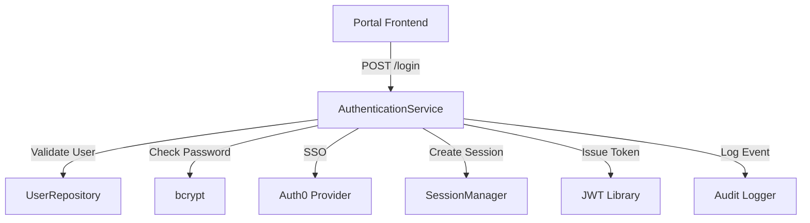

# Design Stage - Design Document

**Document Type**: Technical Design Specification
**Project**: ai_sdlc_method (claude_aisdlc solution)
**Version**: 1.0
**Date**: 2025-12-03
**Status**: Draft
**Stage**: Design (Section 5.0)

---

## Requirements Traceability

This design implements the following requirements:

| Requirement | Description | Priority |
|-------------|-------------|----------|
| REQ-DES-001 | Component Design | High |
| REQ-DES-002 | Architecture Decision Records | High |
| REQ-DES-003 | Design-to-Requirement Traceability | High |

**Source**: [AISDLC_IMPLEMENTATION_REQUIREMENTS.md](../../requirements/AISDLC_IMPLEMENTATION_REQUIREMENTS.md) Section 4

---

## Table of Contents

1. [Executive Summary](#1-executive-summary)
2. [Component Design Templates](#2-component-design-templates)
3. [Architecture Decision Records](#3-architecture-decision-records)
4. [Design Traceability System](#4-design-traceability-system)
5. [Orphan Detection Algorithm](#5-orphan-detection-algorithm)
6. [Coverage Reporting](#6-coverage-reporting)
7. [Workflows](#7-workflows)
8. [Integration Points](#8-integration-points)
9. [Examples](#9-examples)
10. [Implementation Guidance](#10-implementation-guidance)

---

## 1. Executive Summary

### 1.1 Purpose

The Design Stage transforms requirements into **technical solution architecture** with complete traceability. This document provides implementable specifications for:
1. **Component Design** - Map requirements to components with clear responsibilities and interfaces
2. **Architecture Decision Records (ADRs)** - Document design decisions with context and alternatives
3. **Design Traceability** - Maintain bidirectional links between requirements and design elements
4. **Orphan Detection** - Identify requirements without design and design without requirements
5. **Coverage Reporting** - Generate comprehensive requirement coverage reports

### 1.2 Design Principles

1. **Requirement-Driven** - Every design element traces to one or more requirements
2. **Explicit Decisions** - All significant decisions captured in ADRs
3. **Measurable Traceability** - Automated detection of coverage gaps and orphans
4. **File-Based** - Markdown format for version control and human readability
5. **Atomic Components** - One component per file for clean conflict resolution
6. **Bidirectional Links** - Navigate from requirements to design and vice versa

### 1.3 Key Design Decisions

| Decision | Rationale | Requirement |
|----------|-----------|-------------|
| Component design template in markdown | Human-readable, version-controllable, AI-friendly | REQ-DES-001 |
| ADR format with REQ-* references | Explicit decision context with traceability | REQ-DES-002 |
| Automated traceability validation | Prevent orphans, ensure coverage | REQ-DES-003 |
| Separate files per component | Atomic commits, easier merges | REQ-DES-001 |
| YAML metadata + markdown content | Structured data + rich documentation | REQ-DES-001 |
| Graph-based orphan detection | Comprehensive gap analysis | REQ-DES-003 |

---

## 2. Component Design Templates

**Implements**: REQ-DES-001 (Component Design)

### 2.1 Component Design Template

**Purpose**: Standardized format for documenting component designs with requirement traceability

**File Location**: `docs/design/{solution}/components/{component-name}.md`

**Template Structure**:

```markdown
# Component: {ComponentName}

**Component ID**: {COMP-DOMAIN-###}
**Type**: {Service | Library | Module | Interface | Data Store}
**Status**: {Draft | Approved | Implemented | Deprecated}
**Created**: {YYYY-MM-DD}
**Updated**: {YYYY-MM-DD}

---

## Requirements Traceability

**Implements**:
- REQ-F-{DOMAIN}-{###}: {requirement title}
- REQ-NFR-{DOMAIN}-{###}: {requirement title}
- REQ-DATA-{DOMAIN}-{###}: {requirement title}

**Depends On**:
- REQ-{TYPE}-{DOMAIN}-{###}: {requirement title}

**Related Components**:
- {COMP-OTHER-###}: {component name} (dependency | consumer | peer)

---

## 1. Overview

### 1.1 Purpose

{What problem does this component solve? What business value does it provide?}

### 1.2 Scope

**In Scope**:
- {Responsibility 1}
- {Responsibility 2}
- {Responsibility 3}

**Out of Scope**:
- {What this component does NOT do}
- {Boundaries with other components}

### 1.3 Success Criteria

- [ ] {Measurable criterion 1}
- [ ] {Measurable criterion 2}
- [ ] {Measurable criterion 3}

---

## 2. Architecture

### 2.1 Component Diagram

```mermaid
graph TB
    {Mermaid diagram showing component and its relationships}
```

### 2.2 Responsibilities

| Responsibility | Description | Requirement |
|:---|:---|:---|
| {Action/Capability} | {What it does and why} | REQ-{TYPE}-{DOMAIN}-{###} |

### 2.3 Dependencies

| Dependency | Purpose | Type |
|:---|:---|:---|
| {Component/Service} | {Why needed} | {Hard | Soft | Optional} |

---

## 3. Interface Design

### 3.1 Public API

**API Type**: {REST | GraphQL | gRPC | Library | CLI}

#### 3.1.1 Endpoint/Method 1

**Requirement**: REQ-{TYPE}-{DOMAIN}-{###}

```
{HTTP Method} {Path} or {function signature}

Description: {What this does}

Request:
{Request structure/parameters}

Response:
{Response structure}

Errors:
{Error scenarios and codes}

Example:
{Usage example}
```

#### 3.1.2 Endpoint/Method 2

{Repeat pattern above}

### 3.2 Events

**Events Published**:
- `{event.name}`: {description} (REQ-{TYPE}-{DOMAIN}-{###})

**Events Consumed**:
- `{event.name}`: {description} (REQ-{TYPE}-{DOMAIN}-{###})

---

## 4. Data Design

### 4.1 Data Model

**Requirement**: REQ-DATA-{DOMAIN}-{###}

```yaml
Entity: {EntityName}
  attributes:
    - name: {attribute_name}
      type: {data_type}
      required: {true|false}
      description: {purpose}
      constraints: {validation rules}

  relationships:
    - type: {one-to-one | one-to-many | many-to-many}
      target: {TargetEntity}
      description: {relationship purpose}
```

### 4.2 Storage

| Data | Storage Type | Rationale | Requirement |
|:---|:---|:---|:---|
| {Data type} | {Database | File | Cache | Queue} | {Why this choice} | REQ-{TYPE}-{DOMAIN}-{###} |

---

## 5. Quality Attributes

### 5.1 Performance

**Requirement**: REQ-NFR-PERF-{###}

- **Throughput**: {requests/sec, items/sec}
- **Latency**: {p50, p95, p99 targets}
- **Scalability**: {horizontal | vertical | both}

### 5.2 Security

**Requirement**: REQ-NFR-SEC-{###}

- **Authentication**: {mechanism}
- **Authorization**: {RBAC | ABAC | etc}
- **Data Protection**: {encryption, hashing}
- **Audit**: {logging requirements}

### 5.3 Reliability

**Requirement**: REQ-NFR-AVAIL-{###}

- **Availability**: {uptime target}
- **Error Handling**: {retry, fallback, circuit breaker}
- **Failure Recovery**: {RTO, RPO}

### 5.4 Observability

**Requirement**: REQ-NFR-OBS-{###}

- **Metrics**: {key metrics to track}
- **Logs**: {structured logging format}
- **Traces**: {distributed tracing strategy}
- **Alerts**: {alerting conditions}

---

## 6. Implementation Guidance

### 6.1 Technology Stack

| Layer | Technology | Rationale | Requirement |
|:---|:---|:---|:---|
| {Layer name} | {Tech choice} | {Why chosen} | REQ-{TYPE}-{DOMAIN}-{###} |

### 6.2 Design Patterns

| Pattern | Application | Requirement |
|:---|:---|:---|
| {Pattern name} | {How and why used} | REQ-{TYPE}-{DOMAIN}-{###} |

### 6.3 Testing Strategy

**Unit Testing**:
- Test: {what to test}
- Coverage: {minimum coverage target}
- Validates: REQ-{TYPE}-{DOMAIN}-{###}

**Integration Testing**:
- Test: {integration scenarios}
- Validates: REQ-{TYPE}-{DOMAIN}-{###}

**Performance Testing**:
- Test: {load/stress scenarios}
- Validates: REQ-NFR-PERF-{###}

---

## 7. References

### 7.1 Requirements

- [REQ-{TYPE}-{DOMAIN}-{###}](../../requirements/{filename}.md)

### 7.2 ADRs

- [ADR-{###}](../adrs/ADR-{###}-{slug}.md): {title}

### 7.3 Related Components

- [COMP-{DOMAIN}-{###}]({filename}.md): {component name}

---

## 8. Change History

| Version | Date | Author | Changes | Requirements |
|:---|:---|:---|:---|:---|
| 1.0 | {YYYY-MM-DD} | {Author} | Initial design | REQ-{TYPE}-{DOMAIN}-{###} |
```

### 2.2 Component Metadata Schema

**Purpose**: Machine-readable component metadata for traceability automation

**File Location**: `docs/design/{solution}/components/{component-name}.meta.yml`

```yaml
# Component metadata for traceability
component:
  id: COMP-AUTH-001
  name: AuthenticationService
  type: service  # service | library | module | interface | datastore
  status: approved  # draft | approved | implemented | deprecated

  # Requirement traceability
  implements:
    - REQ-F-AUTH-001
    - REQ-F-AUTH-002
    - REQ-NFR-SEC-001
    - REQ-NFR-PERF-001

  depends_on:
    - REQ-DATA-USER-001
    - REQ-F-SESSION-001

  # Component relationships
  relationships:
    depends_on:
      - component: COMP-USER-001
        type: hard
        reason: "Requires user data validation"

    consumed_by:
      - component: COMP-PORTAL-001
        reason: "Portal uses authentication"

    peers:
      - component: COMP-SESSION-001
        reason: "Coordinates session management"

  # API summary
  apis:
    - type: REST
      path: /api/v1/auth/login
      method: POST
      implements: REQ-F-AUTH-001

    - type: REST
      path: /api/v1/auth/logout
      method: POST
      implements: REQ-F-AUTH-002

  # Data entities
  entities:
    - name: User
      storage: PostgreSQL
      implements: REQ-DATA-USER-001

  # Quality attributes
  quality_attributes:
    performance:
      latency_p95: 500ms
      implements: REQ-NFR-PERF-001

    security:
      authentication: JWT
      implements: REQ-NFR-SEC-001

# Traceability validation
validation:
  orphan_check: true
  coverage_check: true
  last_validated: "2025-12-03T14:00:00Z"
```

### 2.3 Component Registry

**Purpose**: Central registry of all components for discovery and traceability

**File Location**: `docs/design/{solution}/COMPONENT_REGISTRY.yml`

```yaml
# Component Registry
# Auto-generated and manually maintained

registry:
  solution: claude_aisdlc
  version: 1.0
  generated_at: "2025-12-03T14:00:00Z"

components:
  # Authentication Domain
  - id: COMP-AUTH-001
    name: AuthenticationService
    file: components/authentication-service.md
    status: approved
    implements: [REQ-F-AUTH-001, REQ-F-AUTH-002, REQ-NFR-SEC-001]

  - id: COMP-AUTH-002
    name: SessionManager
    file: components/session-manager.md
    status: draft
    implements: [REQ-F-SESSION-001, REQ-NFR-PERF-002]

  # Requirements Domain
  - id: COMP-REQ-001
    name: RequirementKeyGenerator
    file: components/requirement-key-generator.md
    status: approved
    implements: [REQ-REQ-001]

  - id: COMP-REQ-002
    name: RequirementValidator
    file: components/requirement-validator.md
    status: approved
    implements: [REQ-REQ-003, REQ-REQ-004]

  # Design Domain
  - id: COMP-DES-001
    name: ComponentDesignValidator
    file: components/component-design-validator.md
    status: draft
    implements: [REQ-DES-001]

  - id: COMP-DES-002
    name: ADRManager
    file: components/adr-manager.md
    status: draft
    implements: [REQ-DES-002]

  - id: COMP-DES-003
    name: TraceabilityAnalyzer
    file: components/traceability-analyzer.md
    status: draft
    implements: [REQ-DES-003]

# Statistics
statistics:
  total_components: 7
  by_status:
    draft: 4
    approved: 3
    implemented: 0
    deprecated: 0

  by_type:
    service: 3
    library: 2
    module: 2
    interface: 0
    datastore: 0
```

---

## 3. Architecture Decision Records

**Implements**: REQ-DES-002 (Architecture Decision Records)

### 3.1 ADR Template

**Purpose**: Standardized format for documenting architecture decisions with requirement traceability

**File Location**: `docs/design/{solution}/adrs/ADR-{###}-{slug}.md`

**Naming Convention**:
- `{###}`: Zero-padded 3-digit sequential number (001, 002, ...)
- `{slug}`: Kebab-case short description (e.g., "file-based-requirements")

**Template Structure**:

```markdown
# ADR-{###}: {Title}

**Status**: {Proposed | Accepted | Rejected | Superseded | Deprecated}
**Date**: {YYYY-MM-DD}
**Deciders**: {Role or Team}
**Requirements**: REQ-{TYPE}-{DOMAIN}-{###}, REQ-{TYPE}-{DOMAIN}-{###}

{If superseded}
**Supersedes**: [ADR-{###}](ADR-{###}-{slug}.md)
**Superseded By**: [ADR-{###}](ADR-{###}-{slug}.md)

---

## Context

### Problem Statement

{What is the issue we're addressing? Why do we need to make this decision?}

### Ecosystem Context E(t)

**Technology Constraints**:
- {Relevant technology limitations or opportunities}

**Standards and Patterns**:
- {Industry standards, organizational patterns}

**Available Options**:
- {What choices are available to us?}

### Requirements Context

**Functional Requirements**:
- [REQ-F-{DOMAIN}-{###}](../../requirements/{file}.md): {title}
  - {How this requirement influences the decision}

**Non-Functional Requirements**:
- [REQ-NFR-{DOMAIN}-{###}](../../requirements/{file}.md): {title}
  - {How this requirement influences the decision}

**Data Requirements**:
- [REQ-DATA-{DOMAIN}-{###}](../../requirements/{file}.md): {title}
  - {How this requirement influences the decision}

---

## Decision

**We will {decision statement}.**

Specifically:
- {Specific choice 1}
- {Specific choice 2}
- {Specific choice 3}

---

## Rationale

### Why This Decision

**1. {Reason 1}** {Symbol: ✅ | ⚠️ | ❌}
{Detailed explanation}

**Requirement Impact**: REQ-{TYPE}-{DOMAIN}-{###}
{How this reason addresses the requirement}

**2. {Reason 2}** {Symbol: ✅ | ⚠️ | ❌}
{Detailed explanation}

**Requirement Impact**: REQ-{TYPE}-{DOMAIN}-{###}
{How this reason addresses the requirement}

**3. {Reason 3}** {Symbol: ✅ | ⚠️ | ❌}
{Detailed explanation}

**Requirement Impact**: REQ-{TYPE}-{DOMAIN}-{###}
{How this reason addresses the requirement}

### Ecosystem Alignment

{How this decision aligns with or adapts to ecosystem constraints E(t)}

---

## Alternatives Considered

### Alternative 1: {Name}

**Description**: {What is this alternative?}

**Why Rejected**:
- ❌ {Rejection reason 1}
- ❌ {Rejection reason 2}
- ❌ {Rejection reason 3}

**Requirement Impact**:
- REQ-{TYPE}-{DOMAIN}-{###}: {How it would have addressed requirement}

**When to Reconsider**: {Under what future conditions would this become viable?}

### Alternative 2: {Name}

{Repeat pattern above}

### Alternative 3: {Name}

{Repeat pattern above}

---

## Consequences

### Positive

✅ **{Benefit 1}**
{Explanation}

**Requirements Addressed**: REQ-{TYPE}-{DOMAIN}-{###}, REQ-{TYPE}-{DOMAIN}-{###}

✅ **{Benefit 2}**
{Explanation}

**Requirements Addressed**: REQ-{TYPE}-{DOMAIN}-{###}

### Negative

❌ **{Drawback 1}**
{Explanation}

**Mitigation**: {How we'll address this drawback}

**Requirements Impacted**: REQ-{TYPE}-{DOMAIN}-{###}

❌ **{Drawback 2}**
{Explanation}

**Mitigation**: {How we'll address this drawback}

### Neutral

⚠️ **{Trade-off 1}**
{Explanation}

### Technical Debt

{Any technical debt incurred by this decision}

**Repayment Plan**: {How and when we'll address the debt}

---

## Implementation Notes

### Components Affected

- [COMP-{DOMAIN}-{###}]({file}.md): {component name}
  - {What changes}

### Action Items

- [ ] {Action item 1} (Owner: {name}, Due: {date})
- [ ] {Action item 2} (Owner: {name}, Due: {date})
- [ ] {Action item 3} (Owner: {name}, Due: {date})

### Validation Criteria

- [ ] {How we'll know this decision was correct}
- [ ] {Measurable success criteria}
- [ ] {Timeline for evaluation}

---

## References

### Requirements

- [REQ-{TYPE}-{DOMAIN}-{###}](../../requirements/{file}.md): {title}

### Related ADRs

- [ADR-{###}](ADR-{###}-{slug}.md): {title}

### External References

- {Link to external documentation, standards, articles}

---

## Notes

{Additional context, discussion points, or future considerations}

---

## Change History

| Date | Author | Change | Status |
|:---|:---|:---|:---|
| {YYYY-MM-DD} | {Author} | Created | Proposed |
| {YYYY-MM-DD} | {Author} | Accepted after review | Accepted |
```

### 3.2 ADR Metadata Schema

**Purpose**: Machine-readable ADR metadata for traceability automation

**File Location**: `docs/design/{solution}/adrs/ADR-{###}-{slug}.meta.yml`

```yaml
# ADR metadata for traceability
adr:
  id: ADR-001
  title: "File-Based Requirements Storage"
  slug: file-based-requirements-storage
  status: accepted  # proposed | accepted | rejected | superseded | deprecated
  date: "2025-12-03"

  # Requirement traceability
  addresses:
    - REQ-REQ-001  # Requirement Key Generation
    - REQ-REQ-002  # Requirement Types
    - REQ-REQ-003  # Requirement Refinement

  # Decision relationships
  supersedes: []  # ADR-###
  superseded_by: null  # ADR-###
  related: [ADR-002, ADR-003]

  # Decision summary
  decision: "Store requirements as individual YAML files (one per requirement) in version control"

  # Key alternatives
  alternatives:
    - name: "Database storage"
      rejected_reason: "Adds infrastructure complexity"

    - name: "Single monolithic file"
      rejected_reason: "Merge conflicts, poor scalability"

  # Components impacted
  components:
    - COMP-REQ-001  # RequirementKeyGenerator
    - COMP-REQ-002  # RequirementValidator

  # Implementation status
  implementation:
    status: completed  # not_started | in_progress | completed
    completion_date: "2025-12-03"
    validated: true

# Traceability validation
validation:
  requirements_covered: true
  alternatives_documented: true
  consequences_assessed: true
  last_validated: "2025-12-03T14:00:00Z"
```

### 3.3 ADR Registry

**Purpose**: Central registry of all ADRs for discovery and traceability

**File Location**: `docs/design/{solution}/adrs/ADR_REGISTRY.yml`

```yaml
# ADR Registry
# Auto-generated and manually maintained

registry:
  solution: claude_aisdlc
  version: 1.0
  generated_at: "2025-12-03T14:00:00Z"

adrs:
  - id: ADR-001
    title: "Claude Code as MVP Implementation Platform"
    file: ADR-001-claude-code-as-mvp-platform.md
    status: accepted
    date: "2025-11-25"
    addresses: [REQ-TOOL-001, REQ-TOOL-003, REQ-AI-003]

  - id: ADR-002
    title: "Commands for Workflow Integration"
    file: ADR-002-commands-for-workflow-integration.md
    status: accepted
    date: "2025-11-25"
    addresses: [REQ-TOOL-003]

  - id: ADR-003
    title: "Agents for Stage Personas"
    file: ADR-003-agents-for-stage-personas.md
    status: accepted
    date: "2025-11-25"
    addresses: [REQ-AI-003]

  - id: ADR-004
    title: "Skills for Reusable Capabilities"
    file: ADR-004-skills-for-reusable-capabilities.md
    status: accepted
    date: "2025-11-25"
    addresses: [REQ-AI-001]

  - id: ADR-005
    title: "Iterative Refinement Feedback Loops"
    file: ADR-005-iterative-refinement-feedback-loops.md
    status: accepted
    date: "2025-11-25"
    addresses: [REQ-STAGE-004, REQ-REQ-003]

  - id: ADR-006
    title: "Plugin Configuration and Discovery"
    file: ADR-006-plugin-configuration-and-discovery.md
    status: accepted
    date: "2025-11-25"
    addresses: [REQ-TOOL-001, REQ-TOOL-004]

  - id: ADR-007
    title: "Hooks for Methodology Automation"
    file: ADR-007-hooks-for-methodology-automation.md
    status: accepted
    date: "2025-11-25"
    addresses: [REQ-TOOL-008]

# Statistics
statistics:
  total_adrs: 7
  by_status:
    proposed: 0
    accepted: 7
    rejected: 0
    superseded: 0
    deprecated: 0

  requirements_coverage:
    total_requirements_addressed: 12
    requirements_with_adrs: 12
    requirements_without_adrs: 0
```

---

## 4. Design Traceability System

**Implements**: REQ-DES-003 (Design-to-Requirement Traceability)

### 4.1 Traceability Data Model

**Purpose**: Graph-based model linking requirements, components, ADRs, and downstream artifacts

```yaml
# Traceability graph schema
traceability:
  nodes:
    # Requirement nodes
    requirements:
      - id: REQ-F-AUTH-001
        type: requirement
        sub_type: functional
        title: "User login with email/password"
        status: approved
        file: requirements/REQ-F-AUTH-001.yml

    # Component nodes
    components:
      - id: COMP-AUTH-001
        type: component
        sub_type: service
        title: "AuthenticationService"
        status: approved
        file: design/components/authentication-service.md

    # ADR nodes
    adrs:
      - id: ADR-001
        type: adr
        title: "Claude Code as MVP Platform"
        status: accepted
        file: design/adrs/ADR-001-claude-code-as-mvp-platform.md

  # Edges (relationships)
  edges:
    # Component implements requirement
    - source: COMP-AUTH-001
      target: REQ-F-AUTH-001
      type: implements
      bidirectional: true

    # ADR addresses requirement
    - source: ADR-001
      target: REQ-TOOL-001
      type: addresses
      bidirectional: true

    # Component depends on requirement
    - source: COMP-AUTH-001
      target: REQ-DATA-USER-001
      type: depends_on
      bidirectional: false

    # ADR impacts component
    - source: ADR-001
      target: COMP-AUTH-001
      type: impacts
      bidirectional: true

# Query patterns
queries:
  # Forward traceability: requirement → design
  forward:
    - name: "components_implementing_requirement"
      query: "MATCH (r:Requirement {id: $req_id})<-[:implements]-(c:Component) RETURN c"

    - name: "adrs_addressing_requirement"
      query: "MATCH (r:Requirement {id: $req_id})<-[:addresses]-(a:ADR) RETURN a"

  # Backward traceability: design → requirement
  backward:
    - name: "requirements_for_component"
      query: "MATCH (c:Component {id: $comp_id})-[:implements]->(r:Requirement) RETURN r"

    - name: "requirements_for_adr"
      query: "MATCH (a:ADR {id: $adr_id})-[:addresses]->(r:Requirement) RETURN r"

  # Orphan detection
  orphans:
    - name: "requirements_without_design"
      query: "MATCH (r:Requirement) WHERE NOT (r)<-[:implements|addresses]-() RETURN r"

    - name: "components_without_requirements"
      query: "MATCH (c:Component) WHERE NOT (c)-[:implements]->(:Requirement) RETURN c"

    - name: "adrs_without_requirements"
      query: "MATCH (a:ADR) WHERE NOT (a)-[:addresses]->(:Requirement) RETURN a"
```

### 4.2 Traceability Matrix Format

**Purpose**: Human-readable and machine-parseable traceability matrix

**File Location**: `docs/design/{solution}/TRACEABILITY_MATRIX.md`

```markdown
# Design Stage Traceability Matrix

**Solution**: claude_aisdlc
**Generated**: 2025-12-03T14:00:00Z
**Coverage**: {percentage}%

---

## Forward Traceability: Requirements → Design

### Functional Requirements (REQ-F-*)

| Requirement | Title | Components | ADRs | Status |
|:---|:---|:---|:---|:---|
| REQ-F-AUTH-001 | User login | COMP-AUTH-001 | ADR-003 | ✅ Complete |
| REQ-F-AUTH-002 | User logout | COMP-AUTH-001 | ADR-003 | ✅ Complete |
| REQ-F-SESSION-001 | Session management | COMP-SESSION-001 | ADR-005 | ✅ Complete |
| REQ-F-CONFIG-001 | Hierarchy merging | COMP-CONFIG-001 | ADR-006 | ⚠️ Partial |
| REQ-F-CONFIG-002 | Priority override | - | - | ❌ Missing |

### Non-Functional Requirements (REQ-NFR-*)

| Requirement | Title | Components | ADRs | Status |
|:---|:---|:---|:---|:---|
| REQ-NFR-PERF-001 | Login latency < 500ms | COMP-AUTH-001 | ADR-003 | ✅ Complete |
| REQ-NFR-SEC-001 | JWT authentication | COMP-AUTH-001 | ADR-004 | ✅ Complete |
| REQ-NFR-SCALE-001 | Horizontal scaling | COMP-AUTH-001, COMP-SESSION-001 | ADR-007 | ✅ Complete |

### Data Requirements (REQ-DATA-*)

| Requirement | Title | Components | ADRs | Status |
|:---|:---|:---|:---|:---|
| REQ-DATA-USER-001 | User data model | COMP-USER-001 | ADR-002 | ✅ Complete |
| REQ-DATA-VALID-001 | Email validation | COMP-VALID-001 | ADR-002 | ✅ Complete |

---

## Backward Traceability: Design → Requirements

### Components

| Component | Type | Implements | Depends On | Status |
|:---|:---|:---|:---|:---|
| COMP-AUTH-001 | Service | REQ-F-AUTH-001, REQ-F-AUTH-002, REQ-NFR-PERF-001, REQ-NFR-SEC-001 | REQ-DATA-USER-001 | ✅ Complete |
| COMP-SESSION-001 | Service | REQ-F-SESSION-001, REQ-NFR-SCALE-001 | REQ-F-AUTH-001 | ✅ Complete |
| COMP-CONFIG-001 | Library | REQ-F-CONFIG-001 | - | ⚠️ Partial |
| COMP-ORPHAN-001 | Module | - | - | ❌ Orphan |

### ADRs

| ADR | Title | Addresses | Impacts | Status |
|:---|:---|:---|:---|:---|
| ADR-001 | Claude Code Platform | REQ-TOOL-001, REQ-TOOL-003 | COMP-AUTH-001, COMP-SESSION-001 | ✅ Complete |
| ADR-002 | File-Based Storage | REQ-REQ-001, REQ-REQ-002 | COMP-USER-001, COMP-VALID-001 | ✅ Complete |
| ADR-003 | JWT Tokens | REQ-NFR-SEC-001 | COMP-AUTH-001 | ✅ Complete |

---

## Orphan Detection

### Requirements Without Design (❌ Gaps)

| Requirement | Title | Priority | Assigned To | Due Date |
|:---|:---|:---|:---|:---|
| REQ-F-CONFIG-002 | Priority override | High | Design Agent | 2025-12-05 |
| REQ-NFR-AVAIL-001 | 99.9% uptime | High | Design Agent | 2025-12-06 |

### Components Without Requirements (❌ Orphans)

| Component | Type | Status | Action |
|:---|:---|:---|:---|
| COMP-ORPHAN-001 | Module | Draft | Remove or map to requirement |

### ADRs Without Requirements (⚠️ Context-Only)

| ADR | Title | Status | Note |
|:---|:---|:---|:---|
| ADR-999 | Example Decision | Proposed | May be valid if documenting context |

---

## Coverage Statistics

### By Requirement Type

| Type | Total | With Design | Coverage |
|:---|:---:|:---:|:---:|
| Functional (REQ-F-*) | 15 | 13 | 87% |
| Non-Functional (REQ-NFR-*) | 10 | 9 | 90% |
| Data (REQ-DATA-*) | 5 | 5 | 100% |
| Business Rules (REQ-BR-*) | 3 | 3 | 100% |
| **Total** | **33** | **30** | **91%** |

### By Priority

| Priority | Total | With Design | Coverage |
|:---|:---:|:---:|:---:|
| Critical | 8 | 8 | 100% |
| High | 12 | 11 | 92% |
| Medium | 8 | 7 | 88% |
| Low | 5 | 4 | 80% |
| **Total** | **33** | **30** | **91%** |

### By Status

| Status | Requirements | Components | ADRs |
|:---|:---:|:---:|:---:|
| Draft | 3 | 5 | 2 |
| Approved | 25 | 8 | 5 |
| Implemented | 5 | 0 | - |
| Deprecated | 0 | 0 | 0 |

---

## Quality Gates

### Design Stage Completion Criteria

- [ ] All critical requirements have design (current: 100%)
- [ ] All high requirements have design (current: 92%)
- [ ] No orphaned components (current: 1 orphan)
- [ ] All ADRs have requirements (current: 100%)
- [ ] Overall coverage ≥ 90% (current: 91%) ✅

**Status**: ⚠️ PARTIAL - 1 orphan component, 3 requirements without design
**Next Actions**:
1. Design COMP-ORPHAN-001 or remove
2. Create design for REQ-F-CONFIG-002, REQ-NFR-AVAIL-001
3. Re-validate after changes
```

### 4.3 Traceability Validation Rules

**Purpose**: Automated validation rules to ensure traceability integrity

```yaml
# Traceability validation rules
validation_rules:
  # Rule 1: Every component must implement at least one requirement
  - rule: components_must_implement_requirements
    severity: error
    query: "MATCH (c:Component) WHERE NOT (c)-[:implements]->(:Requirement) RETURN c"
    message: "Component {component.id} does not implement any requirements"

  # Rule 2: Every ADR should address at least one requirement
  - rule: adrs_should_address_requirements
    severity: warning
    query: "MATCH (a:ADR) WHERE NOT (a)-[:addresses]->(:Requirement) RETURN a"
    message: "ADR {adr.id} does not address any requirements (may be context-only)"

  # Rule 3: Critical requirements must have design
  - rule: critical_requirements_must_have_design
    severity: error
    query: |
      MATCH (r:Requirement {priority: 'critical'})
      WHERE NOT (r)<-[:implements|addresses]-()
      RETURN r
    message: "Critical requirement {requirement.id} has no design coverage"

  # Rule 4: High priority requirements should have design
  - rule: high_requirements_should_have_design
    severity: warning
    query: |
      MATCH (r:Requirement {priority: 'high'})
      WHERE NOT (r)<-[:implements|addresses]-()
      RETURN r
    message: "High priority requirement {requirement.id} has no design coverage"

  # Rule 5: Components must reference valid requirements
  - rule: components_reference_valid_requirements
    severity: error
    validation: |
      For each requirement ID in component metadata:
        - Requirement file must exist
        - Requirement must not be deprecated
    message: "Component {component.id} references invalid requirement {requirement.id}"

  # Rule 6: ADRs must reference valid requirements
  - rule: adrs_reference_valid_requirements
    severity: error
    validation: |
      For each requirement ID in ADR metadata:
        - Requirement file must exist
        - Requirement must not be deprecated
    message: "ADR {adr.id} references invalid requirement {requirement.id}"

  # Rule 7: Circular dependencies detection
  - rule: no_circular_dependencies
    severity: error
    query: |
      MATCH path = (c1:Component)-[:depends_on*]->(c1)
      RETURN path
    message: "Circular dependency detected: {path}"

  # Rule 8: Interface completeness
  - rule: interfaces_must_be_complete
    severity: warning
    validation: |
      Components with type 'interface' must define:
        - At least one method/endpoint
        - Request/response formats
        - Error scenarios
    message: "Interface {component.id} has incomplete specification"

# Validation schedule
schedule:
  on_file_change: true   # Validate when design files change
  on_commit: true        # Pre-commit hook validation
  nightly: true          # Full validation scan
  on_demand: true        # Manual validation command

# Reporting
reporting:
  format: [markdown, json, html]
  output_dir: docs/design/{solution}/validation_reports/
  include_suggestions: true
  severity_threshold: warning  # Report warnings and errors
```

---

## 5. Orphan Detection Algorithm

**Implements**: REQ-DES-003 (Design-to-Requirement Traceability - Orphan Detection)

### 5.1 Algorithm Specification

**Purpose**: Identify design elements without requirements and requirements without design

**Input**:
- Requirements directory: `docs/requirements/`
- Design directory: `docs/design/{solution}/`
- Component metadata: `*.meta.yml`
- ADR metadata: `ADR-*.meta.yml`

**Output**:
- List of orphaned components
- List of orphaned ADRs
- List of requirements without design
- Coverage percentage

**Algorithm**:

```python
# Orphan Detection Algorithm
# File: src/design_stage/traceability_analyzer.py

from typing import Dict, List, Set, Tuple
from dataclasses import dataclass
from pathlib import Path
import yaml

@dataclass
class OrphanAnalysis:
    """Results of orphan detection analysis."""
    orphaned_components: List[str]
    orphaned_adrs: List[str]
    requirements_without_design: List[str]
    coverage_percentage: float
    total_requirements: int
    requirements_with_design: int
    total_components: int
    components_with_requirements: int
    total_adrs: int
    adrs_with_requirements: int

class OrphanDetector:
    """Detects orphans in design-to-requirement traceability."""

    def __init__(self, requirements_dir: Path, design_dir: Path):
        self.requirements_dir = requirements_dir
        self.design_dir = design_dir

    def analyze(self) -> OrphanAnalysis:
        """Run complete orphan analysis."""
        # Step 1: Load all requirements
        requirements = self._load_requirements()

        # Step 2: Load all components
        components = self._load_components()

        # Step 3: Load all ADRs
        adrs = self._load_adrs()

        # Step 4: Build traceability graph
        graph = self._build_traceability_graph(requirements, components, adrs)

        # Step 5: Detect orphans
        orphaned_components = self._find_orphaned_components(graph)
        orphaned_adrs = self._find_orphaned_adrs(graph)
        requirements_without_design = self._find_requirements_without_design(graph)

        # Step 6: Calculate coverage
        coverage = self._calculate_coverage(graph)

        return OrphanAnalysis(
            orphaned_components=orphaned_components,
            orphaned_adrs=orphaned_adrs,
            requirements_without_design=requirements_without_design,
            coverage_percentage=coverage,
            total_requirements=len(requirements),
            requirements_with_design=len(requirements) - len(requirements_without_design),
            total_components=len(components),
            components_with_requirements=len(components) - len(orphaned_components),
            total_adrs=len(adrs),
            adrs_with_requirements=len(adrs) - len(orphaned_adrs)
        )

    def _load_requirements(self) -> Dict[str, dict]:
        """Load all requirement files."""
        requirements = {}
        for req_file in self.requirements_dir.rglob("REQ-*.yml"):
            with open(req_file) as f:
                req_data = yaml.safe_load(f)
                requirements[req_data['id']] = req_data
        return requirements

    def _load_components(self) -> Dict[str, dict]:
        """Load all component metadata files."""
        components = {}
        component_dir = self.design_dir / "components"
        for meta_file in component_dir.rglob("*.meta.yml"):
            with open(meta_file) as f:
                comp_data = yaml.safe_load(f)
                components[comp_data['component']['id']] = comp_data
        return components

    def _load_adrs(self) -> Dict[str, dict]:
        """Load all ADR metadata files."""
        adrs = {}
        adr_dir = self.design_dir / "adrs"
        for meta_file in adr_dir.rglob("ADR-*.meta.yml"):
            with open(meta_file) as f:
                adr_data = yaml.safe_load(f)
                adrs[adr_data['adr']['id']] = adr_data
        return adrs

    def _build_traceability_graph(
        self,
        requirements: Dict[str, dict],
        components: Dict[str, dict],
        adrs: Dict[str, dict]
    ) -> Dict[str, Set[str]]:
        """Build bidirectional traceability graph."""
        graph = {
            'req_to_comp': {},  # requirement → components
            'req_to_adr': {},   # requirement → ADRs
            'comp_to_req': {},  # component → requirements
            'adr_to_req': {}    # ADR → requirements
        }

        # Build requirement → component edges
        for comp_id, comp_data in components.items():
            implements = comp_data['component'].get('implements', [])
            for req_id in implements:
                if req_id not in graph['req_to_comp']:
                    graph['req_to_comp'][req_id] = set()
                graph['req_to_comp'][req_id].add(comp_id)

                if comp_id not in graph['comp_to_req']:
                    graph['comp_to_req'][comp_id] = set()
                graph['comp_to_req'][comp_id].add(req_id)

        # Build requirement → ADR edges
        for adr_id, adr_data in adrs.items():
            addresses = adr_data['adr'].get('addresses', [])
            for req_id in addresses:
                if req_id not in graph['req_to_adr']:
                    graph['req_to_adr'][req_id] = set()
                graph['req_to_adr'][req_id].add(adr_id)

                if adr_id not in graph['adr_to_req']:
                    graph['adr_to_req'][adr_id] = set()
                graph['adr_to_req'][adr_id].add(req_id)

        return graph

    def _find_orphaned_components(self, graph: Dict) -> List[str]:
        """Find components that don't implement any requirements."""
        orphaned = []
        for comp_id in graph.get('comp_to_req', {}):
            if not graph['comp_to_req'][comp_id]:
                orphaned.append(comp_id)
        return sorted(orphaned)

    def _find_orphaned_adrs(self, graph: Dict) -> List[str]:
        """Find ADRs that don't address any requirements."""
        orphaned = []
        for adr_id in graph.get('adr_to_req', {}):
            if not graph['adr_to_req'][adr_id]:
                orphaned.append(adr_id)
        return sorted(orphaned)

    def _find_requirements_without_design(self, graph: Dict) -> List[str]:
        """Find requirements without components or ADRs."""
        requirements_with_design = set(graph['req_to_comp'].keys()) | set(graph['req_to_adr'].keys())
        all_requirements = set(self._load_requirements().keys())
        requirements_without_design = all_requirements - requirements_with_design
        return sorted(list(requirements_without_design))

    def _calculate_coverage(self, graph: Dict) -> float:
        """Calculate percentage of requirements with design coverage."""
        all_requirements = set(self._load_requirements().keys())
        requirements_with_design = set(graph['req_to_comp'].keys()) | set(graph['req_to_adr'].keys())

        if not all_requirements:
            return 0.0

        coverage = len(requirements_with_design) / len(all_requirements) * 100
        return round(coverage, 2)
```

### 5.2 Orphan Detection Usage

**Command-line interface**:

```bash
# Run orphan detection
python -m src.design_stage.traceability_analyzer orphan-detect \
    --requirements-dir docs/requirements/ \
    --design-dir docs/design/claude_aisdlc/ \
    --output docs/design/claude_aisdlc/ORPHAN_REPORT.md

# Output:
# Orphan Detection Report
# =====================
#
# Orphaned Components: 1
# - COMP-ORPHAN-001
#
# Orphaned ADRs: 0
#
# Requirements Without Design: 3
# - REQ-F-CONFIG-002
# - REQ-NFR-AVAIL-001
# - REQ-DATA-CACHE-001
#
# Coverage: 91% (30 of 33 requirements)
```

**Programmatic API**:

```python
from design_stage.traceability_analyzer import OrphanDetector
from pathlib import Path

detector = OrphanDetector(
    requirements_dir=Path("docs/requirements"),
    design_dir=Path("docs/design/claude_aisdlc")
)

analysis = detector.analyze()

print(f"Coverage: {analysis.coverage_percentage}%")
print(f"Orphaned components: {len(analysis.orphaned_components)}")
print(f"Requirements without design: {len(analysis.requirements_without_design)}")

if analysis.coverage_percentage < 90:
    print("WARNING: Coverage below 90% threshold")
```

---

## 6. Coverage Reporting

**Implements**: REQ-DES-003 (Design-to-Requirement Traceability - Coverage Report)

### 6.1 Coverage Report Generator

**Purpose**: Generate comprehensive coverage reports in multiple formats

**File**: `src/design_stage/coverage_reporter.py`

```python
from typing import Dict, List
from dataclasses import dataclass
from pathlib import Path
import json
from datetime import datetime

@dataclass
class CoverageReport:
    """Coverage report data structure."""
    solution: str
    generated_at: datetime
    overall_coverage: float
    coverage_by_type: Dict[str, float]
    coverage_by_priority: Dict[str, float]
    requirements_with_design: List[str]
    requirements_without_design: List[str]
    orphaned_components: List[str]
    orphaned_adrs: List[str]
    quality_gates: Dict[str, bool]

class CoverageReporter:
    """Generate coverage reports in multiple formats."""

    def __init__(self, orphan_analysis: OrphanAnalysis):
        self.analysis = orphan_analysis

    def generate_markdown(self, output_file: Path) -> None:
        """Generate markdown coverage report."""
        # Implementation: Generate markdown as shown in section 4.2
        pass

    def generate_json(self, output_file: Path) -> None:
        """Generate JSON coverage report for tooling."""
        report = {
            "solution": "claude_aisdlc",
            "generated_at": datetime.now().isoformat(),
            "coverage": {
                "overall": self.analysis.coverage_percentage,
                "by_type": self._calculate_coverage_by_type(),
                "by_priority": self._calculate_coverage_by_priority()
            },
            "requirements": {
                "total": self.analysis.total_requirements,
                "with_design": self.analysis.requirements_with_design,
                "without_design": len(self.analysis.requirements_without_design),
                "missing": self.analysis.requirements_without_design
            },
            "components": {
                "total": self.analysis.total_components,
                "with_requirements": self.analysis.components_with_requirements,
                "orphaned": len(self.analysis.orphaned_components),
                "orphans": self.analysis.orphaned_components
            },
            "adrs": {
                "total": self.analysis.total_adrs,
                "with_requirements": self.analysis.adrs_with_requirements,
                "orphaned": len(self.analysis.orphaned_adrs),
                "orphans": self.analysis.orphaned_adrs
            },
            "quality_gates": self._evaluate_quality_gates()
        }

        with open(output_file, 'w') as f:
            json.dump(report, f, indent=2)

    def generate_html(self, output_file: Path) -> None:
        """Generate HTML coverage report with visualizations."""
        # Implementation: Generate interactive HTML with charts
        pass

    def _calculate_coverage_by_type(self) -> Dict[str, float]:
        """Calculate coverage breakdown by requirement type."""
        # Group requirements by type (F, NFR, DATA, BR)
        # Calculate coverage for each type
        pass

    def _calculate_coverage_by_priority(self) -> Dict[str, float]:
        """Calculate coverage breakdown by priority."""
        # Group requirements by priority (critical, high, medium, low)
        # Calculate coverage for each priority
        pass

    def _evaluate_quality_gates(self) -> Dict[str, bool]:
        """Evaluate quality gate criteria."""
        return {
            "all_critical_have_design": self._check_critical_coverage(),
            "all_high_have_design": self._check_high_coverage(),
            "no_orphaned_components": len(self.analysis.orphaned_components) == 0,
            "coverage_above_90": self.analysis.coverage_percentage >= 90,
            "all_adrs_have_requirements": len(self.analysis.orphaned_adrs) == 0
        }
```

### 6.2 Coverage Report Formats

#### 6.2.1 Markdown Format

See section 4.2 for complete markdown format example.

#### 6.2.2 JSON Format

```json
{
  "solution": "claude_aisdlc",
  "generated_at": "2025-12-03T14:00:00Z",
  "coverage": {
    "overall": 91.0,
    "by_type": {
      "functional": 87.0,
      "non_functional": 90.0,
      "data": 100.0,
      "business_rule": 100.0
    },
    "by_priority": {
      "critical": 100.0,
      "high": 92.0,
      "medium": 88.0,
      "low": 80.0
    }
  },
  "requirements": {
    "total": 33,
    "with_design": 30,
    "without_design": 3,
    "missing": [
      "REQ-F-CONFIG-002",
      "REQ-NFR-AVAIL-001",
      "REQ-DATA-CACHE-001"
    ]
  },
  "components": {
    "total": 15,
    "with_requirements": 14,
    "orphaned": 1,
    "orphans": ["COMP-ORPHAN-001"]
  },
  "adrs": {
    "total": 7,
    "with_requirements": 7,
    "orphaned": 0,
    "orphans": []
  },
  "quality_gates": {
    "all_critical_have_design": true,
    "all_high_have_design": false,
    "no_orphaned_components": false,
    "coverage_above_90": true,
    "all_adrs_have_requirements": true
  }
}
```

#### 6.2.3 HTML Format

Interactive HTML report with:
- Coverage pie charts by type and priority
- Interactive traceability matrix
- Clickable requirement/component links
- Drill-down capability
- Export to CSV/Excel

---

## 7. Workflows

### 7.1 Component Design Workflow

**Purpose**: Step-by-step workflow for designing a component

**Workflow**:

```
1. START: Design Agent receives requirement(s)
   ↓
2. REVIEW REQUIREMENTS
   - Read requirement specifications
   - Identify functional, NFR, data requirements
   - Note dependencies and constraints
   ↓
3. CHECK FOR EXISTING COMPONENTS
   - Search component registry
   - Identify reusable components
   - Determine if new component needed
   ↓
4. CREATE COMPONENT DESIGN (if new)
   - Generate component ID (COMP-{DOMAIN}-{###})
   - Fill out component template
   - Map requirements to responsibilities
   - Define interfaces (API/methods)
   - Design data model
   - Specify quality attributes
   ↓
5. DOCUMENT TRACEABILITY
   - Add requirement IDs to "Implements" section
   - List dependencies
   - Update component metadata (.meta.yml)
   ↓
6. CREATE/UPDATE ADRs (if significant decisions)
   - Document technology choices
   - Explain architectural patterns
   - Reference requirements addressed
   - List alternatives considered
   ↓
7. UPDATE REGISTRIES
   - Add component to COMPONENT_REGISTRY.yml
   - Add ADR to ADR_REGISTRY.yml
   ↓
8. VALIDATE TRACEABILITY
   - Run orphan detection
   - Verify requirement coverage
   - Check for circular dependencies
   ↓
9. GENERATE COVERAGE REPORT
   - Create/update TRACEABILITY_MATRIX.md
   - Generate JSON report for automation
   ↓
10. REVIEW
    - Design review with stakeholders
    - Incorporate feedback
    - Update status to "approved"
    ↓
11. COMMIT
    - Stage all design files
    - Commit with message: "design: add {component} (REQ-{IDs})"
    ↓
12. END: Hand off to Tasks Stage
```

### 7.2 ADR Creation Workflow

**Purpose**: Step-by-step workflow for creating an ADR

**Workflow**:

```
1. START: Significant design decision needed
   ↓
2. IDENTIFY DECISION
   - What problem are we solving?
   - Why is this decision significant?
   - What requirements does it address?
   ↓
3. RESEARCH ALTERNATIVES
   - Investigate 2-4 viable options
   - Document pros/cons
   - Assess ecosystem constraints E(t)
   ↓
4. CREATE ADR FILE
   - Generate ADR ID (next sequential number)
   - Create ADR-{###}-{slug}.md
   - Create ADR-{###}-{slug}.meta.yml
   ↓
5. DOCUMENT CONTEXT
   - Problem statement
   - Requirements context
   - Ecosystem constraints E(t)
   - Available options
   ↓
6. DOCUMENT DECISION
   - State the chosen option clearly
   - List specific implementation details
   ↓
7. DOCUMENT RATIONALE
   - Explain WHY this choice
   - Map reasons to requirements
   - Show ecosystem alignment
   ↓
8. DOCUMENT ALTERNATIVES
   - For each rejected option:
     * What is it?
     * Why rejected?
     * When to reconsider?
   ↓
9. DOCUMENT CONSEQUENCES
   - Positive (benefits)
   - Negative (drawbacks + mitigation)
   - Neutral (trade-offs)
   - Technical debt (if any)
   ↓
10. ADD TRACEABILITY
    - List requirements addressed
    - List components impacted
    - Link related ADRs
    ↓
11. UPDATE REGISTRIES
    - Add to ADR_REGISTRY.yml
    - Update affected components
    ↓
12. REVIEW
    - Architecture review
    - Stakeholder review
    - Incorporate feedback
    ↓
13. APPROVE
    - Change status to "accepted"
    - Record approval date
    ↓
14. COMMIT
    - Commit with message: "design(adr): {title} (REQ-{IDs})"
    ↓
15. END: ADR is now canonical
```

### 7.3 Traceability Validation Workflow

**Purpose**: Automated and manual traceability validation

**Workflow**:

```
1. TRIGGER
   - File change (hook)
   - Pre-commit hook
   - CI/CD pipeline
   - Manual command
   ↓
2. LOAD DATA
   - Load all requirements
   - Load all components
   - Load all ADRs
   ↓
3. BUILD GRAPH
   - Create traceability graph
   - Link requirements → design
   - Link design → requirements
   ↓
4. RUN VALIDATIONS
   For each validation rule:
     - Execute query/validation
     - Collect violations
     - Assign severity
   ↓
5. DETECT ORPHANS
   - Find orphaned components
   - Find orphaned ADRs
   - Find requirements without design
   ↓
6. CALCULATE COVERAGE
   - Overall coverage
   - Coverage by type
   - Coverage by priority
   ↓
7. EVALUATE QUALITY GATES
   - Check critical coverage
   - Check high coverage
   - Check orphan count
   - Check overall threshold
   ↓
8. GENERATE REPORTS
   - Markdown report
   - JSON report
   - HTML report (optional)
   ↓
9. DECISION
   If quality gates pass:
     → APPROVE (continue to next stage)
   If quality gates fail:
     → REJECT (fix gaps and re-validate)
   ↓
10. NOTIFY
    - Report results
    - Suggest fixes
    - Create tasks for gaps
```

---

## 8. Integration Points

### 8.1 Requirements Stage Integration

**Interface**: Design Stage consumes requirements from Requirements Stage

**Inputs**:
- Requirement files: `docs/requirements/REQ-*.yml`
- Requirement registry: `docs/requirements/REQUIREMENT_REGISTRY.yml`
- Intent mappings: `INT-* → REQ-*`

**Contract**:
- All requirements have unique IDs (REQ-{TYPE}-{DOMAIN}-{SEQ})
- All requirements have status (draft | approved | implemented | validated)
- All requirements have acceptance criteria
- Requirements are versioned

**Usage**:
```python
from requirements_stage import RequirementLoader

loader = RequirementLoader("docs/requirements")
requirements = loader.load_all()

# Get requirements for a domain
auth_reqs = loader.get_by_domain("AUTH")

# Get requirements by type
functional_reqs = loader.get_by_type("F")

# Get critical requirements
critical_reqs = loader.get_by_priority("critical")
```

### 8.2 Tasks Stage Integration

**Interface**: Design Stage provides components to Tasks Stage

**Outputs**:
- Component designs: `docs/design/{solution}/components/*.md`
- Component metadata: `docs/design/{solution}/components/*.meta.yml`
- Component registry: `docs/design/{solution}/COMPONENT_REGISTRY.yml`
- ADRs: `docs/design/{solution}/adrs/ADR-*.md`
- Traceability matrix: `docs/design/{solution}/TRACEABILITY_MATRIX.md`

**Contract**:
- All components have unique IDs (COMP-{DOMAIN}-{###})
- All components reference at least one requirement
- All components have defined interfaces
- All ADRs reference requirements

**Usage**:
```python
from design_stage import ComponentLoader

loader = ComponentLoader("docs/design/claude_aisdlc")
components = loader.load_all()

# Get component by ID
comp = loader.get_by_id("COMP-AUTH-001")

# Get components implementing requirement
comps = loader.get_by_requirement("REQ-F-AUTH-001")

# Get component interfaces for task breakdown
interfaces = comp.get_interfaces()
```

### 8.3 Traceability System Integration

**Interface**: Design Stage reports to Traceability System

**Outputs**:
- Traceability events: component created, ADR approved, etc.
- Coverage metrics: overall coverage, by type, by priority
- Orphan alerts: components without requirements, etc.
- Quality gate status: pass/fail with details

**Contract**:
- Real-time traceability updates
- Metrics published in standard format
- Alerts include actionable suggestions

**Usage**:
```python
from traceability import TraceabilityReporter

reporter = TraceabilityReporter()

# Report component creation
reporter.log_event({
    "event": "component_created",
    "component_id": "COMP-AUTH-001",
    "implements": ["REQ-F-AUTH-001", "REQ-NFR-SEC-001"],
    "timestamp": "2025-12-03T14:00:00Z"
})

# Publish coverage metrics
reporter.publish_metrics({
    "stage": "design",
    "coverage": 91.0,
    "orphans": 1,
    "quality_gates_passed": False
})
```

### 8.4 AI Agent Integration

**Interface**: Design Agent provides design assistance

**Capabilities**:
- Suggest component designs from requirements
- Generate ADRs with alternatives
- Detect missing design elements
- Recommend design patterns
- Validate traceability

**Usage**:
```python
from ai_agents import DesignAgent

agent = DesignAgent()

# Get design suggestions for requirement
suggestions = agent.suggest_components_for_requirement("REQ-F-AUTH-001")

# Generate ADR draft
adr_draft = agent.generate_adr(
    decision="Use JWT tokens for authentication",
    requirements=["REQ-NFR-SEC-001"],
    alternatives=["Session cookies", "OAuth tokens"]
)

# Validate component design
validation = agent.validate_component_design("COMP-AUTH-001")
```

---

## 9. Examples

### 9.1 Complete Component Design Example

**File**: `docs/design/claude_aisdlc/components/authentication-service.md`

```markdown
# Component: AuthenticationService

**Component ID**: COMP-AUTH-001
**Type**: Service
**Status**: Approved
**Created**: 2025-12-03
**Updated**: 2025-12-03

---

## Requirements Traceability

**Implements**:
- REQ-F-AUTH-001: User login with email/password
- REQ-F-AUTH-002: User logout
- REQ-NFR-SEC-001: JWT authentication
- REQ-NFR-PERF-001: Login latency < 500ms p95

**Depends On**:
- REQ-DATA-USER-001: User data model
- REQ-F-SESSION-001: Session management

**Related Components**:
- COMP-USER-001: UserRepository (dependency)
- COMP-SESSION-001: SessionManager (dependency)
- COMP-PORTAL-001: PortalFrontend (consumer)

---

## 1. Overview

### 1.1 Purpose

AuthenticationService provides secure user authentication for the AI SDLC portal. It validates user credentials, issues JWT tokens, and manages authentication sessions.

**Business Value**: Enable secure self-service portal access with enterprise SSO integration.

### 1.2 Scope

**In Scope**:
- Email/password authentication
- JWT token issuance and validation
- Auth0 SSO integration
- Rate limiting and account lockout
- Audit logging of authentication events

**Out of Scope**:
- User registration (handled by UserService)
- Password reset (handled by PasswordResetService)
- Multi-factor authentication (future enhancement)

### 1.3 Success Criteria

- [ ] Login response time < 500ms (p95)
- [ ] 100% authentication events logged
- [ ] Zero password leaks (all hashed with bcrypt)
- [ ] Rate limiting prevents brute force attacks
- [ ] Integration tests pass for happy path and error scenarios

---

## 2. Architecture

### 2.1 Component Diagram



### 2.2 Responsibilities

| Responsibility | Description | Requirement |
|:---|:---|:---|
| Validate credentials | Check email/password against user database | REQ-F-AUTH-001 |
| Issue JWT tokens | Generate signed JWT with user claims | REQ-NFR-SEC-001 |
| Manage sessions | Create and track authentication sessions | REQ-F-SESSION-001 |
| Rate limiting | Prevent brute force attacks | REQ-NFR-SEC-001 |
| Audit logging | Log all authentication events | REQ-NFR-AUDIT-001 |

### 2.3 Dependencies

| Dependency | Purpose | Type |
|:---|:---|:---|
| UserRepository | Fetch user data and credentials | Hard |
| SessionManager | Create and manage sessions | Hard |
| Auth0 | External SSO provider | Soft |
| JWT Library | Token generation and validation | Hard |
| Audit Logger | Security event logging | Hard |

---

## 3. Interface Design

### 3.1 Public API

**API Type**: REST

#### 3.1.1 POST /api/v1/auth/login

**Requirement**: REQ-F-AUTH-001

```
POST /api/v1/auth/login

Description: Authenticate user with email and password

Request:
{
  "email": "user@example.com",
  "password": "SecureP@ss123",
  "csrf_token": "a1b2c3d4-e5f6-7890-abcd-ef1234567890"
}

Response (200 OK):
{
  "success": true,
  "token": "eyJhbGciOiJIUzI1NiIs...",
  "expires_at": "2025-12-03T15:00:00Z",
  "user": {
    "id": "user-123",
    "email": "user@example.com",
    "name": "John Doe",
    "roles": ["developer"]
  }
}

Response (401 Unauthorized):
{
  "success": false,
  "error": "invalid_credentials",
  "message": "Invalid email or password"
}

Response (429 Too Many Requests):
{
  "success": false,
  "error": "rate_limit_exceeded",
  "message": "Account locked due to multiple failed attempts. Try again in 15 minutes.",
  "retry_after": 900
}

Errors:
- 400: Missing required fields
- 401: Invalid credentials
- 403: CSRF token invalid
- 429: Rate limit exceeded (account locked)
- 500: Internal server error
- 503: Auth0 service unavailable

Example:
curl -X POST https://portal.example.com/api/v1/auth/login \
  -H "Content-Type: application/json" \
  -d '{"email":"user@example.com","password":"SecureP@ss123","csrf_token":"..."}'
```

#### 3.1.2 POST /api/v1/auth/logout

**Requirement**: REQ-F-AUTH-002

```
POST /api/v1/auth/logout

Description: Terminate user session

Request:
{
  "token": "eyJhbGciOiJIUzI1NiIs..."
}

Response (200 OK):
{
  "success": true,
  "message": "Logged out successfully"
}

Response (401 Unauthorized):
{
  "success": false,
  "error": "invalid_token",
  "message": "Invalid or expired token"
}

Errors:
- 401: Invalid or expired token
- 500: Internal server error
```

### 3.2 Events

**Events Published**:
- `auth.login.success`: User logged in successfully (REQ-F-AUTH-001)
- `auth.login.failed`: Login attempt failed (REQ-NFR-AUDIT-001)
- `auth.account.locked`: Account locked due to failed attempts (REQ-NFR-SEC-001)
- `auth.logout`: User logged out (REQ-F-AUTH-002)

**Events Consumed**:
- None

---

## 4. Data Design

### 4.1 Data Model

**Requirement**: REQ-DATA-USER-001

```yaml
Entity: User
  attributes:
    - name: id
      type: uuid
      required: true
      description: Unique user identifier
      constraints: Primary key

    - name: email
      type: string
      required: true
      description: User email address
      constraints: Unique, RFC 5322 format, max 255 chars

    - name: password_hash
      type: string
      required: true
      description: bcrypt hashed password
      constraints: bcrypt with cost factor 12

    - name: failed_login_attempts
      type: integer
      required: true
      description: Count of consecutive failed login attempts
      constraints: Default 0, range 0-99

    - name: account_locked_until
      type: timestamp
      required: false
      description: Timestamp when account lockout expires
      constraints: NULL if not locked

Entity: AuthenticationSession
  attributes:
    - name: session_id
      type: uuid
      required: true
      description: Unique session identifier
      constraints: Primary key

    - name: user_id
      type: uuid
      required: true
      description: User who owns this session
      constraints: Foreign key to User

    - name: token
      type: string
      required: true
      description: JWT token
      constraints: Unique

    - name: expires_at
      type: timestamp
      required: true
      description: When session expires
      constraints: Must be future timestamp

    - name: created_at
      type: timestamp
      required: true
      description: When session was created
      constraints: Immutable
```

### 4.2 Storage

| Data | Storage Type | Rationale | Requirement |
|:---|:---|:---|:---|
| User credentials | PostgreSQL | ACID compliance for security-critical data | REQ-DATA-USER-001 |
| Active sessions | Redis | Fast lookup, automatic expiration | REQ-NFR-PERF-001 |
| Audit logs | Elasticsearch | Efficient search and retention | REQ-NFR-AUDIT-001 |

---

## 5. Quality Attributes

### 5.1 Performance

**Requirement**: REQ-NFR-PERF-001

- **Throughput**: 100 requests/sec sustained
- **Latency**:
  - p50: < 200ms
  - p95: < 500ms
  - p99: < 1000ms
- **Scalability**: Horizontal (stateless service, sessions in Redis)

### 5.2 Security

**Requirement**: REQ-NFR-SEC-001

- **Authentication**: JWT tokens with HS256 signing
- **Authorization**: Token validation middleware
- **Data Protection**:
  - Passwords hashed with bcrypt (cost factor 12)
  - HTTPS required for all endpoints
  - CSRF protection enabled
- **Audit**: All authentication events logged to Elasticsearch

### 5.3 Reliability

**Requirement**: REQ-NFR-AVAIL-001

- **Availability**: 99.9% uptime (8.76 hours downtime/year)
- **Error Handling**:
  - Retry Auth0 calls (max 3 attempts)
  - Circuit breaker for Auth0 integration
  - Graceful degradation (fallback to local auth)
- **Failure Recovery**:
  - RTO: 5 minutes
  - RPO: 0 (no data loss acceptable)

### 5.4 Observability

**Requirement**: REQ-NFR-OBS-001

- **Metrics**:
  - `auth.login.attempts` (counter, by result)
  - `auth.login.latency` (histogram)
  - `auth.account.locked` (counter)
  - `auth.tokens.issued` (counter)
- **Logs**: Structured JSON logs with correlation IDs
- **Traces**: Distributed tracing with OpenTelemetry
- **Alerts**:
  - Login latency p95 > 500ms (5 min window)
  - Login failure rate > 10% (1 min window)
  - Account lockouts > 10/minute

---

## 6. Implementation Guidance

### 6.1 Technology Stack

| Layer | Technology | Rationale | Requirement |
|:---|:---|:---|:---|
| API Framework | FastAPI | Async, high performance, OpenAPI docs | REQ-NFR-PERF-001 |
| Password Hashing | bcrypt | Industry standard, cost factor | REQ-NFR-SEC-001 |
| JWT | PyJWT | Mature, well-tested library | REQ-NFR-SEC-001 |
| Session Store | Redis | In-memory, auto-expiration | REQ-NFR-PERF-001 |
| User Database | PostgreSQL | ACID, strong consistency | REQ-DATA-USER-001 |
| Audit Store | Elasticsearch | Efficient log search | REQ-NFR-AUDIT-001 |

### 6.2 Design Patterns

| Pattern | Application | Requirement |
|:---|:---|:---|
| Repository | UserRepository abstracts data access | REQ-DES-001 |
| Circuit Breaker | Auth0 integration resilience | REQ-NFR-AVAIL-001 |
| Rate Limiter | Sliding window for login attempts | REQ-NFR-SEC-001 |
| Decorator | @require_auth for protected endpoints | REQ-NFR-SEC-001 |

### 6.3 Testing Strategy

**Unit Testing**:
- Test: Credential validation logic
- Test: JWT token generation and validation
- Test: Rate limiting algorithm
- Coverage: 90% minimum
- Validates: REQ-F-AUTH-001, REQ-NFR-SEC-001

**Integration Testing**:
- Test: Full login flow with database
- Test: Auth0 SSO integration
- Test: Session management
- Validates: REQ-F-AUTH-001, REQ-F-SESSION-001

**Performance Testing**:
- Test: 100 req/sec sustained load
- Test: p95 latency < 500ms
- Validates: REQ-NFR-PERF-001

---

## 7. References

### 7.1 Requirements

- [REQ-F-AUTH-001](../../requirements/REQ-F-AUTH-001.yml): User login
- [REQ-F-AUTH-002](../../requirements/REQ-F-AUTH-002.yml): User logout
- [REQ-NFR-SEC-001](../../requirements/REQ-NFR-SEC-001.yml): JWT authentication
- [REQ-NFR-PERF-001](../../requirements/REQ-NFR-PERF-001.yml): Performance thresholds

### 7.2 ADRs

- [ADR-003](../adrs/ADR-003-jwt-authentication.md): Use JWT tokens for authentication

### 7.3 Related Components

- [COMP-USER-001](user-repository.md): UserRepository
- [COMP-SESSION-001](session-manager.md): SessionManager

---

## 8. Change History

| Version | Date | Author | Changes | Requirements |
|:---|:---|:---|:---|:---|
| 1.0 | 2025-12-03 | Design Agent | Initial design | REQ-F-AUTH-001, REQ-NFR-SEC-001 |
```

### 9.2 Complete ADR Example

See [ADR-001-claude-code-as-mvp-platform.md](adrs/ADR-001-claude-code-as-mvp-platform.md) in section 3.1 above for complete ADR example.

### 9.3 Traceability Matrix Example

See section 4.2 for complete traceability matrix example.

---

## 10. Implementation Guidance

### 10.1 File Organization

```
docs/design/{solution}/
├── COMPONENT_REGISTRY.yml              # Central component registry
├── ADR_REGISTRY.yml                    # Central ADR registry (in adrs/)
├── TRACEABILITY_MATRIX.md              # Human-readable traceability
├── TRACEABILITY_MATRIX.json            # Machine-readable traceability
├── ORPHAN_REPORT.md                    # Latest orphan detection report
│
├── components/                         # Component designs
│   ├── authentication-service.md
│   ├── authentication-service.meta.yml
│   ├── session-manager.md
│   ├── session-manager.meta.yml
│   └── ...
│
├── adrs/                               # Architecture Decision Records
│   ├── README.md                       # ADR index
│   ├── ADR_REGISTRY.yml                # ADR registry
│   ├── ADR-001-claude-code-platform.md
│   ├── ADR-001-claude-code-platform.meta.yml
│   ├── ADR-002-jwt-authentication.md
│   ├── ADR-002-jwt-authentication.meta.yml
│   └── ...
│
└── validation_reports/                 # Automated validation reports
    ├── 2025-12-03-traceability.md
    ├── 2025-12-03-traceability.json
    ├── 2025-12-03-traceability.html
    └── ...
```

### 10.2 Naming Conventions

**Component IDs**:
- Format: `COMP-{DOMAIN}-{###}`
- Examples: `COMP-AUTH-001`, `COMP-USER-002`, `COMP-CONFIG-001`
- Domain: 3-15 uppercase alphanumeric characters
- Sequence: Zero-padded 3-digit number (001-999)

**Component Files**:
- Design: `{component-name}.md` (kebab-case)
- Metadata: `{component-name}.meta.yml`
- Examples: `authentication-service.md`, `authentication-service.meta.yml`

**ADR IDs**:
- Format: `ADR-{###}`
- Examples: `ADR-001`, `ADR-023`, `ADR-999`
- Sequence: Zero-padded 3-digit number, globally sequential

**ADR Files**:
- Design: `ADR-{###}-{slug}.md` (kebab-case slug)
- Metadata: `ADR-{###}-{slug}.meta.yml`
- Examples: `ADR-001-claude-code-platform.md`, `ADR-001-claude-code-platform.meta.yml`

### 10.3 Development Workflow

**Step 1: Receive Requirements**
```bash
# Requirements Agent has completed requirements stage
# You have: docs/requirements/REQ-*.yml files
```

**Step 2: Create Component Design**
```bash
# Use component template (section 2.1)
cp templates/component-template.md docs/design/claude_aisdlc/components/my-component.md

# Fill in all sections
# Map requirements to responsibilities
# Define interfaces
```

**Step 3: Create Component Metadata**
```bash
# Use metadata schema (section 2.2)
# Create: my-component.meta.yml
```

**Step 4: Create ADRs (if needed)**
```bash
# Use ADR template (section 3.1)
# Document significant decisions
# Reference requirements addressed
```

**Step 5: Update Registries**
```bash
# Add to COMPONENT_REGISTRY.yml
# Add to ADR_REGISTRY.yml
```

**Step 6: Validate Traceability**
```bash
# Run orphan detection
python -m src.design_stage.traceability_analyzer orphan-detect \
    --requirements-dir docs/requirements/ \
    --design-dir docs/design/claude_aisdlc/

# Generate traceability matrix
python -m src.design_stage.coverage_reporter generate \
    --format markdown \
    --output docs/design/claude_aisdlc/TRACEABILITY_MATRIX.md
```

**Step 7: Fix Gaps**
```bash
# If orphans detected or coverage < 90%:
# - Design missing components
# - Create missing ADRs
# - Remove orphaned components
# - Re-validate
```

**Step 8: Review**
```bash
# Design review with stakeholders
# Incorporate feedback
# Update status to "approved"
```

**Step 9: Commit**
```bash
git add docs/design/claude_aisdlc/
git commit -m "design: add authentication service (REQ-F-AUTH-001, REQ-NFR-SEC-001)"
```

### 10.4 Quality Gates

**Design Stage Completion Criteria**:

1. **Requirement Coverage** ✅
   - All critical requirements have design: 100%
   - All high requirements have design: ≥ 95%
   - Overall coverage: ≥ 90%

2. **Traceability** ✅
   - No orphaned components
   - No orphaned ADRs
   - All requirements mapped to design

3. **Completeness** ✅
   - All components have interfaces defined
   - All ADRs have alternatives documented
   - All quality attributes specified

4. **Consistency** ✅
   - No circular dependencies
   - Naming conventions followed
   - Metadata schemas validated

5. **Review** ✅
   - Design review completed
   - Feedback incorporated
   - Status: "approved"

**Quality Gate Script**:

```bash
#!/bin/bash
# quality-gate.sh - Design stage quality gate validation

set -e

echo "Running Design Stage Quality Gates..."

# Gate 1: Orphan detection
echo "Gate 1: Orphan detection"
python -m src.design_stage.traceability_analyzer orphan-detect \
    --requirements-dir docs/requirements/ \
    --design-dir docs/design/claude_aisdlc/ \
    --fail-on-orphans

# Gate 2: Coverage threshold
echo "Gate 2: Coverage threshold (≥ 90%)"
python -m src.design_stage.coverage_reporter validate \
    --threshold 90 \
    --critical-threshold 100 \
    --high-threshold 95

# Gate 3: Traceability validation
echo "Gate 3: Traceability validation"
python -m src.design_stage.traceability_analyzer validate \
    --requirements-dir docs/requirements/ \
    --design-dir docs/design/claude_aisdlc/ \
    --rules validation_rules.yml

# Gate 4: Metadata validation
echo "Gate 4: Metadata validation"
python -m src.design_stage.metadata_validator validate \
    --design-dir docs/design/claude_aisdlc/

echo "✅ All quality gates passed!"
```

### 10.5 Automation Hooks

**Pre-commit Hook** (`.git/hooks/pre-commit`):
```bash
#!/bin/bash
# Validate traceability before commit

if git diff --cached --name-only | grep -q "docs/design/"; then
    echo "Design files changed - validating traceability..."
    python -m src.design_stage.traceability_analyzer validate \
        --quick \
        --requirements-dir docs/requirements/ \
        --design-dir docs/design/claude_aisdlc/

    if [ $? -ne 0 ]; then
        echo "❌ Traceability validation failed"
        exit 1
    fi
    echo "✅ Traceability validation passed"
fi
```

**CI/CD Pipeline** (`.github/workflows/design-validation.yml`):
```yaml
name: Design Stage Validation

on:
  pull_request:
    paths:
      - 'docs/design/**'

jobs:
  validate:
    runs-on: ubuntu-latest
    steps:
      - uses: actions/checkout@v3

      - name: Set up Python
        uses: actions/setup-python@v4
        with:
          python-version: '3.11'

      - name: Install dependencies
        run: pip install -r requirements.txt

      - name: Run quality gates
        run: ./scripts/quality-gate.sh

      - name: Generate reports
        run: |
          python -m src.design_stage.coverage_reporter generate \
            --format markdown json html \
            --output docs/design/claude_aisdlc/validation_reports/

      - name: Upload reports
        uses: actions/upload-artifact@v3
        with:
          name: design-validation-reports
          path: docs/design/claude_aisdlc/validation_reports/
```

---

## Document Status

**Status**: Draft
**Author**: Design Agent
**Last Updated**: 2025-12-03
**Next Review**: When implementing Code Stage

**Approval Status**:
- [ ] Requirements Agent review
- [ ] Architecture review
- [ ] Security review
- [ ] All feedback addressed

---

**"Every design decision traced to a requirement, every requirement implemented in design"** 🎨
