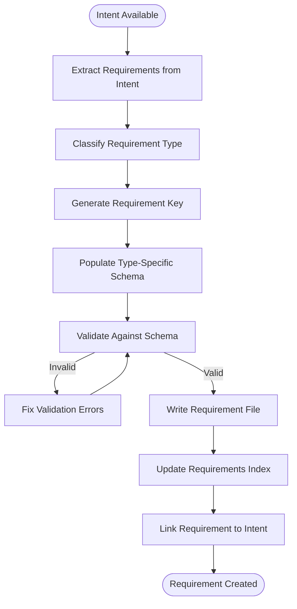
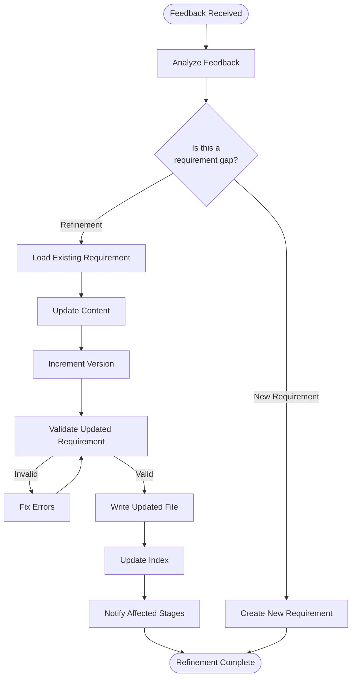
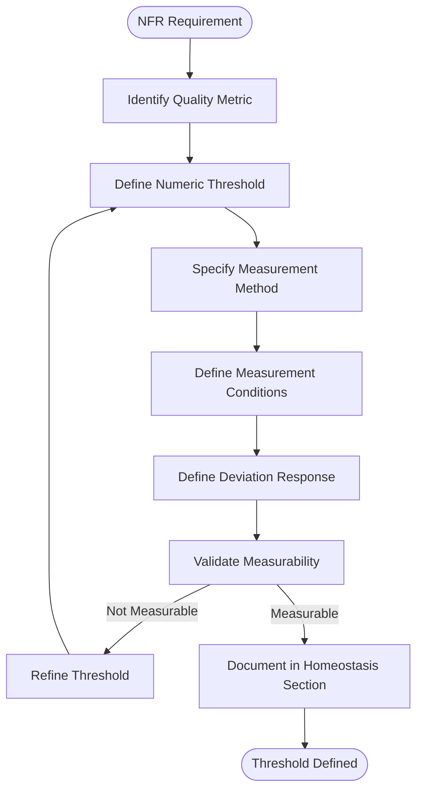

# Requirements Stage - Design Document

**Document Type**: Technical Design Specification
**Project**: ai_sdlc_method (claude_aisdlc solution)
**Version**: 1.0
**Date**: 2025-12-03
**Status**: Draft
**Stage**: Design (Section 5.0)

---

## Requirements Traceability

This design implements the following requirements:

| Requirement | Description | Priority |
|-------------|-------------|----------|
| REQ-REQ-001 | Requirement Key Generation | Critical |
| REQ-REQ-002 | Requirement Types | High |
| REQ-REQ-003 | Requirement Refinement | High |
| REQ-REQ-004 | Homeostasis Model Definition | High |

**Source**: [AISDLC_IMPLEMENTATION_REQUIREMENTS.md](../../requirements/AISDLC_IMPLEMENTATION_REQUIREMENTS.md) Section 3

---

## Table of Contents

1. [Executive Summary](#1-executive-summary)
2. [Data Structures](#2-data-structures)
3. [Storage Architecture](#3-storage-architecture)
4. [Algorithms](#4-algorithms)
5. [Workflows](#5-workflows)
6. [Validation Rules](#6-validation-rules)
7. [Integration Points](#7-integration-points)
8. [Examples](#8-examples)
9. [Implementation Guidance](#9-implementation-guidance)

---

## 1. Executive Summary

### 1.1 Purpose

The Requirements Stage transforms raw intents into **structured, traceable, testable requirements** that serve as:
1. **Intent Store** - Capture and document all intents in traceable format
2. **Control System** - Define target state (homeostasis model) for runtime comparison
3. **Traceability Anchor** - Provide REQ-* keys that propagate through all stages

### 1.2 Design Principles

1. **Immutable Keys** - REQ-* keys never change once assigned
2. **Versioned Content** - Requirement descriptions evolve, keys stay constant
3. **Typed Structure** - Four requirement types (F, NFR, DATA, BR) with specific schemas
4. **Measurable Criteria** - All requirements have testable acceptance criteria
5. **File-Based** - YAML format for version control and human readability
6. **Atomic Units** - One requirement per file for clean conflict resolution

### 1.3 Key Design Decisions

| Decision | Rationale | Requirement |
|----------|-----------|-------------|
| REQ-{TYPE}-{DOMAIN}-{SEQ} format | Hierarchical categorization + uniqueness + human readability | REQ-REQ-001 |
| Four requirement types | Different aspects of system behavior need different validation | REQ-REQ-002 |
| Content versioning (not key versioning) | Preserve traceability while allowing refinement | REQ-REQ-003 |
| NFR threshold schema | Enable runtime comparison for homeostasis | REQ-REQ-004 |
| Separate file per requirement | Atomic commits, easier merges, cleaner history | REQ-REQ-001 |
| YAML with embedded markdown | Structured + human-readable acceptance criteria | REQ-REQ-004 |

---

## 2. Data Structures

### 2.1 Requirement Key Format

**Purpose**: Generate unique, immutable, hierarchical requirement identifiers

**Format**: `REQ-{TYPE}-{DOMAIN}-{SEQ}`

**Components**:

```yaml
# Key format specification
format: "REQ-{TYPE}-{DOMAIN}-{SEQ}"

components:
  prefix: "REQ-"
    description: "Distinguishes requirements from intents (INT-) or other artifacts"

  type:
    description: "Requirement classification"
    values:
      - "F"        # Functional - system behavior
      - "NFR"      # Non-Functional - quality attributes
      - "DATA"     # Data Quality - data requirements
      - "BR"       # Business Rule - domain logic constraints
    examples:
      - "REQ-F-AUTH-001"
      - "REQ-NFR-PERF-001"
      - "REQ-DATA-USER-001"
      - "REQ-BR-PRICING-001"

  domain:
    description: "Business or technical domain area"
    format: "UPPERCASE alphanumeric string (3-15 chars)"
    naming_rules:
      - Use business domain names when possible (AUTH, USER, ORDER, PAYMENT)
      - Use technical domain names for infrastructure (CACHE, DB, API)
      - Keep short but descriptive
      - No special characters except hyphen
    examples:
      - "AUTH" (authentication)
      - "USER" (user management)
      - "ORDER" (order processing)
      - "PAYMENT" (payment processing)
      - "PERF" (performance)
      - "SEC" (security)
      - "SCALE" (scalability)

  sequence:
    description: "Sequential number within type+domain"
    format: "Zero-padded 3-digit integer (001-999)"
    rules:
      - Starts at 001 for each type+domain combination
      - Monotonically increasing
      - Never reused (even if requirement deleted)
      - Max 999 requirements per type+domain

# Examples of valid keys
valid_examples:
  - "REQ-F-AUTH-001"      # First functional requirement in authentication domain
  - "REQ-NFR-PERF-005"    # Fifth non-functional requirement in performance domain
  - "REQ-DATA-USER-023"   # 23rd data requirement in user domain
  - "REQ-BR-PRICING-002"  # Second business rule in pricing domain

# Examples of invalid keys
invalid_examples:
  - "REQ-AUTH-001"        # ❌ Missing type
  - "REQ-F-001"           # ❌ Missing domain
  - "REQ-F-AUTH-1"        # ❌ Sequence not zero-padded
  - "REQ-f-auth-001"      # ❌ Lowercase (must be uppercase)
  - "REQ-F-AUTH_SVC-001"  # ❌ Underscore in domain (use hyphen)
```

**Key Generation Algorithm**: See Section 4.1

---

### 2.2 Base Requirement Schema

**Purpose**: Common structure for all requirement types

**File Format**: YAML with embedded markdown for acceptance criteria

```yaml
# Requirement metadata (immutable after creation)
id: REQ-F-AUTH-001
type: F  # F | NFR | DATA | BR
domain: AUTH
sequence: 1

# Version tracking (content evolves, key remains constant)
version: 2
created_at: "2025-12-03T14:00:00Z"
updated_at: "2025-12-03T16:30:00Z"
version_history:
  - version: 1
    timestamp: "2025-12-03T14:00:00Z"
    author: "Requirements Agent"
    change_type: "created"
    comment: "Initial creation from INT-20251203-001"

  - version: 2
    timestamp: "2025-12-03T16:30:00Z"
    author: "Requirements Agent"
    change_type: "refined"
    comment: "Added error handling criteria based on Design Agent feedback"
    feedback_source:
      stage: "design"
      agent: "Design Agent"
      issue: "Error handling not specified"

# Core content
title: "User login with email/password"
priority: critical  # critical | high | medium | low
status: approved    # draft | approved | implemented | validated | deprecated

description: |
  Users shall be able to authenticate to the system using email address
  and password credentials. Authentication integrates with Auth0 SSO provider
  for enterprise single sign-on support.

  Security Requirements:
  - Passwords hashed with bcrypt (cost factor 12)
  - HTTPS required for all authentication endpoints
  - CSRF protection enabled
  - Rate limiting: max 5 failed attempts per 15 minutes per IP

# Acceptance criteria (testable, measurable)
acceptance_criteria:
  - criterion: "User can log in with valid email and password"
    testable: true
    test_scenario: |
      Given a registered user with email "user@example.com" and password "SecureP@ss123"
      When the user submits login form with correct credentials
      Then the user is authenticated and redirected to dashboard
      And a session token is created with 30-minute expiration

  - criterion: "Invalid credentials show error message"
    testable: true
    test_scenario: |
      Given a registered user
      When the user submits login form with incorrect password
      Then authentication fails
      And error message displays "Invalid email or password"
      And no information leaked about which field was incorrect (security)

  - criterion: "Account locks after 5 failed attempts"
    testable: true
    test_scenario: |
      Given a registered user
      When the user submits 5 consecutive failed login attempts
      Then the account is temporarily locked for 15 minutes
      And error message displays "Account locked due to multiple failed attempts"
      And account unlocks automatically after 15 minutes

# Relationships
derived_from:
  - INT-20251203-001  # Original intent

related_requirements:
  depends_on: []      # Requirements that must exist first
  relates_to:
    - REQ-NFR-SEC-001  # Security baseline
    - REQ-DATA-USER-001  # User data model
  conflicts_with: []  # Contradictory requirements (should be resolved)

# Downstream artifacts (populated by later stages)
implemented_by:
  design: []
    # - Component: AuthenticationService
    # - API: POST /api/v1/auth/login

  tasks: []
    # - PORTAL-123: Implement user login

  code: []
    # - src/auth/authentication_service.py:login()

  tests: []
    # - tests/auth/test_login.py
    # - features/auth/login.feature

# Validation metadata
validated_by:
  system_tests: []    # BDD scenarios validating this requirement
  uat_tests: []       # UAT test cases
  production: false   # Has this been validated in production?

# Custom metadata (extensible)
metadata:
  business_value: "Enable secure self-service portal access"
  risk_level: "high"  # Security-critical requirement
  compliance: ["SOC2", "GDPR"]
  tags: ["security", "authentication", "portal", "sso"]
```

---

### 2.3 Functional Requirement Schema (REQ-F-*)

**Purpose**: Define desired system behavior (WHAT the system does)

**Extension**: Adds functional-specific fields to base schema

```yaml
# Base schema fields (id, version, title, etc.)
id: REQ-F-AUTH-001
type: F
# ... (base fields)

# Functional-specific fields
functional:
  category: authentication  # Functional domain/category

  actors:  # Who interacts with this functionality
    - name: "End User"
      role: "Initiates login"
    - name: "Auth0 SSO Provider"
      role: "External authentication service"
    - name: "System"
      role: "Validates credentials and creates session"

  triggers:  # What initiates this behavior
    - type: "user_action"
      description: "User clicks 'Login' button"
    - type: "api_call"
      description: "POST /api/v1/auth/login"

  preconditions:  # What must be true before execution
    - "User has valid registration in system"
    - "HTTPS connection established"
    - "CSRF token present in request"

  postconditions:  # What must be true after execution
    success:
      - "Session token created with 30-minute expiration"
      - "User redirected to dashboard"
      - "Login event logged with timestamp"
    failure:
      - "No session token created"
      - "Error message displayed to user"
      - "Failed attempt logged for rate limiting"

  normal_flow:  # Happy path
    - step: 1
      action: "User enters email and password"
    - step: 2
      action: "User clicks 'Login' button"
    - step: 3
      action: "System validates CSRF token"
    - step: 4
      action: "System sends credentials to Auth0"
    - step: 5
      action: "Auth0 validates credentials"
    - step: 6
      action: "System creates session token"
    - step: 7
      action: "User redirected to dashboard"

  alternate_flows:  # Error paths and variations
    - name: "Invalid credentials"
      trigger: "Auth0 rejects credentials"
      steps:
        - "Display error message"
        - "Increment failed attempt counter"
        - "Check if account should be locked"

    - name: "Account locked"
      trigger: "5 failed attempts within 15 minutes"
      steps:
        - "Display lockout message"
        - "Log lockout event"
        - "Schedule automatic unlock after 15 minutes"

  error_handling:  # How to handle errors
    - error: "Auth0 service unavailable"
      response: "Display 'Service temporarily unavailable, please try again'"
      logging: "Log error with correlation ID for investigation"
      retry: "Automatic retry after 5 seconds (max 3 attempts)"

    - error: "Network timeout"
      response: "Display 'Request timed out, please try again'"
      logging: "Log timeout with request duration"
      retry: "No automatic retry (user must manually retry)"

  data_inputs:  # What data is consumed
    - name: "email"
      type: "string"
      format: "valid email address"
      required: true
      validation: "RFC 5322 email format"

    - name: "password"
      type: "string"
      format: "plaintext (hashed before storage)"
      required: true
      constraints: "Min 8 chars, transmitted over HTTPS only"

    - name: "csrf_token"
      type: "string"
      format: "UUID"
      required: true
      validation: "Must match server-side token"

  data_outputs:  # What data is produced
    - name: "session_token"
      type: "string"
      format: "JWT"
      contains: "user_id, email, issued_at, expires_at, roles"

    - name: "user_profile"
      type: "object"
      contains: "user_id, email, name, roles, preferences"
```

---

### 2.4 Non-Functional Requirement Schema (REQ-NFR-*)

**Purpose**: Define quality attributes with measurable thresholds for homeostasis model

**Extension**: Adds NFR-specific fields including threshold definitions

```yaml
# Base schema fields
id: REQ-NFR-PERF-001
type: NFR
domain: PERF
# ... (base fields)

# NFR-specific fields
non_functional:
  category: performance  # performance | security | scalability | reliability | usability | maintainability

  # CRITICAL: Homeostasis model thresholds
  # This enables runtime comparison: observed behavior vs. target state
  homeostasis:
    target_state:
      description: "Login response time under normal load"

      metrics:
        - name: "login_response_time_p95"
          description: "95th percentile login response time"
          threshold:
            operator: "<"  # < | <= | > | >= | == | !=
            value: 500
            unit: "milliseconds"
          measurement:
            method: "p95 latency measured at application level"
            sample_size: "minimum 1000 requests"
            conditions: "normal load (up to 1000 concurrent users)"

        - name: "login_response_time_p99"
          description: "99th percentile login response time"
          threshold:
            operator: "<"
            value: 1000
            unit: "milliseconds"
          measurement:
            method: "p99 latency measured at application level"
            sample_size: "minimum 1000 requests"
            conditions: "normal load"

      acceptable_range:
        warning: "response_time_p95 > 400ms"  # Warning threshold
        critical: "response_time_p95 > 500ms"  # Critical threshold (breach)

      measurement_window: "5 minutes"  # Time window for aggregation

      evaluation_frequency: "continuous"  # continuous | hourly | daily

    deviation_response:
      # What happens when observed != target
      on_warning:
        - "Generate monitoring alert"
        - "Log performance degradation event"
        - "Notify on-call engineer"

      on_critical:
        - "Generate critical alert"
        - "Create incident ticket"
        - "Page on-call engineer"
        - "Generate intent: INT-PERF-{timestamp} for remediation"

    validation:
      # How to validate this requirement
      load_test:
        tool: "k6 or Locust"
        scenario: "1000 concurrent users, 10 login requests per user per minute"
        duration: "30 minutes"
        acceptance: "p95 < 500ms for entire test duration"

      production_validation:
        method: "Monitor APM (Datadog/New Relic)"
        metrics: ["login_response_time_p95", "login_response_time_p99"]
        alert_conditions: "p95 > 500ms for 5 consecutive minutes"

  quality_attribute: "performance"

  applies_to:  # What this NFR applies to
    - "REQ-F-AUTH-001"  # User login functionality
    - "POST /api/v1/auth/login"  # Specific API endpoint

  measurement_criteria:
    metric: "response_time"
    aggregation: "p95"  # p50, p95, p99, mean, max
    unit: "milliseconds"
    sample_size: "minimum 1000 requests per measurement window"

  test_conditions:
    load: "1000 concurrent users"
    environment: "production-like staging environment"
    data_volume: "representative production dataset"

  degradation_handling:
    graceful_degradation: true
    degradation_strategy: |
      If Auth0 response > 300ms:
      - Enable aggressive caching of validation responses
      - Reduce token validation frequency
      - Consider fallback to local authentication

    failure_mode: |
      If Auth0 unavailable:
      - Display maintenance message
      - Queue authentication requests for retry
      - Do NOT allow unauthenticated access
```

**Additional NFR Categories**:

```yaml
# Security NFR example
id: REQ-NFR-SEC-001
non_functional:
  category: security
  homeostasis:
    target_state:
      metrics:
        - name: "failed_login_attempts_per_account"
          threshold:
            operator: "<"
            value: 5
            unit: "attempts per 15 minutes"

        - name: "password_strength"
          threshold:
            operator: ">="
            value: 3  # zxcvbn score
            unit: "score (0-4)"

      evaluation_frequency: "continuous"

    deviation_response:
      on_critical:
        - "Lock account"
        - "Generate security alert"
        - "Log to SIEM"

# Scalability NFR example
id: REQ-NFR-SCALE-001
non_functional:
  category: scalability
  homeostasis:
    target_state:
      metrics:
        - name: "concurrent_authenticated_users"
          threshold:
            operator: ">="
            value: 10000
            unit: "concurrent users"
          measurement:
            method: "Active session count"
            conditions: "Without performance degradation (p95 < 500ms)"

      validation:
        scaling_test:
          scenario: "Gradual ramp from 0 to 10000 users over 30 minutes"
          acceptance: "System remains responsive at peak load"
```

---

### 2.5 Data Requirement Schema (REQ-DATA-*)

**Purpose**: Define data quality, governance, and lineage requirements

**Extension**: Adds data-specific fields

```yaml
# Base schema fields
id: REQ-DATA-USER-001
type: DATA
domain: USER
# ... (base fields)

# Data-specific fields
data:
  category: quality  # quality | governance | lineage | privacy | retention

  entity: "User"  # What data entity this applies to

  attributes:  # Specific data fields
    - name: "email"
      type: "string"
      format: "RFC 5322 email address"
      required: true
      unique: true
      quality_rules:
        - rule: "valid_email_format"
          validation: "regex: ^[a-zA-Z0-9._%+-]+@[a-zA-Z0-9.-]+\\.[a-zA-Z]{2,}$"
        - rule: "no_disposable_emails"
          validation: "Not from disposable email provider list"
        - rule: "lowercase_normalized"
          transformation: "Convert to lowercase before storage"

      privacy:
        classification: "PII"  # PII | PHI | PCI | Public | Internal
        encryption_at_rest: true
        encryption_in_transit: true
        access_control: "Authenticated users can read own email only"
        retention: "30 days after account deletion"
        gdpr_right_to_erasure: true

    - name: "password_hash"
      type: "string"
      format: "bcrypt hash (cost factor 12)"
      required: true
      quality_rules:
        - rule: "bcrypt_hashed"
          validation: "Hash must use bcrypt with cost factor >= 12"
        - rule: "never_plaintext"
          validation: "Plain passwords never stored or logged"

      privacy:
        classification: "Sensitive"
        encryption_at_rest: true
        access_control: "System only (never exposed via API)"
        audit_logging: true

    - name: "created_at"
      type: "timestamp"
      format: "ISO 8601 UTC"
      required: true
      quality_rules:
        - rule: "immutable"
          validation: "Cannot be changed after creation"
        - rule: "utc_timezone"
          validation: "Must be stored in UTC"

  quality_targets:
    completeness:
      target: 100
      unit: "percent"
      description: "All required fields must be populated"

    accuracy:
      target: 99
      unit: "percent"
      description: "Email addresses must be valid and deliverable"
      validation_method: "Email verification link sent on registration"

    consistency:
      target: 100
      unit: "percent"
      description: "Email uniqueness enforced at database level"
      enforcement: "Unique constraint on email column"

    timeliness:
      target: 1
      unit: "seconds"
      description: "Data changes reflected in read views within 1 second"

  data_lineage:
    sources:
      - "User registration form"
      - "SSO provider (Auth0)"
      - "Admin user management API"

    transformations:
      - "Email normalized to lowercase"
      - "Password hashed with bcrypt"
      - "created_at set to current UTC timestamp"

    destinations:
      - "users table (PostgreSQL)"
      - "search index (Elasticsearch)"
      - "analytics warehouse (Snowflake)"

  governance:
    data_owner: "Product Owner"
    data_steward: "Security Team"
    classification: "PII"
    compliance: ["GDPR", "CCPA", "SOC2"]

    retention_policy:
      active_account: "Indefinite (while account active)"
      deleted_account: "30 days after deletion (for recovery), then permanent deletion"
      backup_retention: "90 days"

    access_control:
      read: ["user:self", "role:admin", "role:support"]
      write: ["user:self", "role:admin"]
      delete: ["role:admin"]
```

---

### 2.6 Business Rule Schema (REQ-BR-*)

**Purpose**: Define domain logic constraints and business policies

**Extension**: Adds business-rule-specific fields

```yaml
# Base schema fields
id: REQ-BR-PRICING-001
type: BR
domain: PRICING
# ... (base fields)

# Business rule specific fields
business_rule:
  category: calculation  # calculation | validation | authorization | workflow

  rule_type: "business_policy"  # business_policy | regulatory | operational

  natural_language: |
    Premium users receive a 20% discount on all orders over $100.
    The discount applies to the order subtotal before tax and shipping.

  formal_logic:
    condition: |
      IF user.subscription_type == "premium"
         AND order.subtotal > 100.00
      THEN order.discount_percent = 20.0

    pseudocode: |
      function calculate_discount(user, order):
          if user.subscription_type != "premium":
              return 0.0

          if order.subtotal <= 100.00:
              return 0.0

          discount_amount = order.subtotal * 0.20
          return discount_amount

  decision_table:
    inputs:
      - name: "subscription_type"
        values: ["free", "basic", "premium"]
      - name: "order_subtotal"
        values: ["<= $100", "> $100"]

    outputs:
      - name: "discount_percent"
        values: [0, 10, 20]

    rules:
      - condition: ["free", "<= $100"]
        result: 0
      - condition: ["free", "> $100"]
        result: 0
      - condition: ["basic", "<= $100"]
        result: 0
      - condition: ["basic", "> $100"]
        result: 10
      - condition: ["premium", "<= $100"]
        result: 0
      - condition: ["premium", "> $100"]
        result: 20

  constraints:
    - "Discount cannot exceed 50% of order subtotal"
    - "Discount applies before tax and shipping calculations"
    - "Discount is not stackable with promotional codes"

  edge_cases:
    - case: "Order subtotal exactly $100.00"
      handling: "No discount (must be > $100, not >= $100)"

    - case: "User upgrades to premium during checkout"
      handling: "Discount applies immediately if subtotal > $100"

    - case: "Partial refunds"
      handling: "Discount is recalculated based on new subtotal"

  validation:
    test_cases:
      - input:
          user: {subscription_type: "premium"}
          order: {subtotal: 150.00}
        expected_output:
          discount_amount: 30.00
          discount_percent: 20.0

      - input:
          user: {subscription_type: "premium"}
          order: {subtotal: 99.99}
        expected_output:
          discount_amount: 0.00
          discount_percent: 0.0

      - input:
          user: {subscription_type: "basic"}
          order: {subtotal: 150.00}
        expected_output:
          discount_amount: 15.00
          discount_percent: 10.0

  authority:
    defined_by: "Product Owner"
    approved_by: "CFO"
    effective_date: "2025-01-01"
    review_frequency: "quarterly"

  compliance:
    regulations: ["Tax code section XYZ"]
    audit_trail_required: true
    change_approval_required: true
```

---

### 2.7 Requirement Index Schema

**Purpose**: Fast lookup and querying without parsing all files

**File**: `.ai-workspace/requirements/requirements_index.yml`

```yaml
# Requirement index (auto-generated)
index_version: 1
last_updated: "2025-12-03T17:00:00Z"

# Statistics
statistics:
  total_requirements: 42
  by_type:
    F: 18    # Functional
    NFR: 12  # Non-Functional
    DATA: 8  # Data Quality
    BR: 4    # Business Rules
  by_status:
    draft: 5
    approved: 28
    implemented: 7
    validated: 2
  by_priority:
    critical: 8
    high: 20
    medium: 10
    low: 4

# Index entries (for fast lookup)
requirements:
  REQ-F-AUTH-001:
    title: "User login with email/password"
    type: F
    domain: AUTH
    priority: critical
    status: approved
    version: 2
    created_at: "2025-12-03T14:00:00Z"
    file_path: "requirements/functional/REQ-F-AUTH-001.yml"
    derived_from: ["INT-20251203-001"]

  REQ-NFR-PERF-001:
    title: "Login response time < 500ms (p95)"
    type: NFR
    domain: PERF
    priority: high
    status: approved
    version: 1
    created_at: "2025-12-03T14:15:00Z"
    file_path: "requirements/non-functional/REQ-NFR-PERF-001.yml"
    applies_to: ["REQ-F-AUTH-001"]

  # ... (other requirements)

# Domains (for categorization)
domains:
  AUTH:
    description: "Authentication and authorization"
    requirements: ["REQ-F-AUTH-001", "REQ-F-AUTH-002", "REQ-NFR-SEC-001"]
    count: 3

  USER:
    description: "User management"
    requirements: ["REQ-F-USER-001", "REQ-DATA-USER-001"]
    count: 2

  # ... (other domains)

# Relationships
relationships:
  by_intent:
    INT-20251203-001:
      requirements: ["REQ-F-AUTH-001", "REQ-NFR-PERF-001", "REQ-DATA-USER-001"]

  dependencies:
    REQ-F-AUTH-002:
      depends_on: ["REQ-F-AUTH-001"]
      required_by: ["REQ-F-AUTH-003"]
```

---

## 3. Storage Architecture

### 3.1 Directory Structure

**Purpose**: Organize requirements by type for clarity and discoverability

```
.ai-workspace/
├── requirements/
│   ├── requirements_index.yml          # Auto-generated index
│   │
│   ├── functional/                     # REQ-F-* requirements
│   │   ├── REQ-F-AUTH-001.yml
│   │   ├── REQ-F-AUTH-002.yml
│   │   ├── REQ-F-USER-001.yml
│   │   └── REQ-F-ORDER-001.yml
│   │
│   ├── non-functional/                 # REQ-NFR-* requirements
│   │   ├── REQ-NFR-PERF-001.yml
│   │   ├── REQ-NFR-PERF-002.yml
│   │   ├── REQ-NFR-SEC-001.yml
│   │   └── REQ-NFR-SCALE-001.yml
│   │
│   ├── data/                           # REQ-DATA-* requirements
│   │   ├── REQ-DATA-USER-001.yml
│   │   ├── REQ-DATA-ORDER-001.yml
│   │   └── REQ-DATA-LINEAGE-001.yml
│   │
│   ├── business-rules/                 # REQ-BR-* requirements
│   │   ├── REQ-BR-PRICING-001.yml
│   │   ├── REQ-BR-DISCOUNT-001.yml
│   │   └── REQ-BR-TAX-001.yml
│   │
│   └── _archive/                       # Deprecated requirements
│       └── REQ-F-AUTH-OLD-001.yml
│
└── intents/                            # Intent files (input to requirements)
    ├── human/
    │   └── INT-20251203-001.yml
    └── eco/
        └── INT-ECO-20251203-001.yml
```

**Rationale**:
- **Type-based directories**: Easy navigation, clear categorization
- **Single file per requirement**: Clean git history, atomic commits
- **Archive directory**: Preserve deprecated requirements for audit
- **Index file**: Fast queries without parsing all files

---

### 3.2 File Naming Convention

**Pattern**: `{REQUIREMENT_KEY}.yml`

**Examples**:
- `REQ-F-AUTH-001.yml`
- `REQ-NFR-PERF-001.yml`
- `REQ-DATA-USER-001.yml`
- `REQ-BR-PRICING-001.yml`

**Rules**:
- Filename MUST match `id` field in YAML
- YAML extension (not JSON) for human readability
- No spaces or special characters (except hyphen)

---

### 3.3 Version Control Integration

**Purpose**: Track requirement evolution with full audit trail

**Strategy**:

```bash
# Each requirement change is a separate commit
git add .ai-workspace/requirements/functional/REQ-F-AUTH-001.yml
git commit -m "refine: Update REQ-F-AUTH-001 v1→v2 - add error handling criteria

Feedback from Design Agent: error handling was not specified in v1.
Added acceptance criteria for invalid credentials, account lockout.

Feedback-Source: Design Agent (Stage 2)
Change-Type: refined
Requirement: REQ-F-AUTH-001"

# Index is regenerated and committed separately
git add .ai-workspace/requirements/requirements_index.yml
git commit -m "chore: Regenerate requirements index"
```

**Benefits**:
- Full history of requirement evolution
- Blame shows who changed what and why
- Revert capability if bad refinement
- Audit trail for compliance

---

## 4. Algorithms

### 4.1 Requirement Key Generation Algorithm

**Purpose**: Generate unique, collision-free requirement keys

**Input**:
- `type` (F | NFR | DATA | BR)
- `domain` (string, e.g., "AUTH")
- Existing requirements (for sequence lookup)

**Output**: Unique requirement key (e.g., `REQ-F-AUTH-001`)

**Algorithm**:

```python
from typing import Literal
from pathlib import Path
import yaml
import re

RequirementType = Literal["F", "NFR", "DATA", "BR"]

def generate_requirement_key(
    type: RequirementType,
    domain: str,
    requirements_dir: Path
) -> str:
    """
    Generate unique requirement key.

    Args:
        type: Requirement type (F, NFR, DATA, BR)
        domain: Business/technical domain (e.g., AUTH, USER, PERF)
        requirements_dir: Path to requirements directory

    Returns:
        Unique requirement key in format REQ-{TYPE}-{DOMAIN}-{SEQ}

    Raises:
        ValueError: If domain is invalid or sequence exhausted

    Examples:
        >>> generate_requirement_key("F", "AUTH", Path(".ai-workspace/requirements"))
        'REQ-F-AUTH-001'
    """
    # Validate domain format
    if not re.match(r'^[A-Z][A-Z0-9-]{2,14}$', domain):
        raise ValueError(
            f"Invalid domain '{domain}'. "
            f"Must be 3-15 uppercase alphanumeric characters (hyphens allowed)"
        )

    # Find type-specific subdirectory
    type_dir_map = {
        "F": "functional",
        "NFR": "non-functional",
        "DATA": "data",
        "BR": "business-rules"
    }
    subdir = requirements_dir / type_dir_map[type]

    # Find existing sequences for this type+domain
    pattern = f"REQ-{type}-{domain}-*.yml"
    existing_sequences = []

    if subdir.exists():
        for req_file in subdir.glob(pattern):
            # Extract sequence from filename
            match = re.match(
                rf'REQ-{type}-{domain}-(\d{{3}})\.yml',
                req_file.name
            )
            if match:
                existing_sequences.append(int(match.group(1)))

    # Find next available sequence
    if not existing_sequences:
        next_seq = 1
    else:
        next_seq = max(existing_sequences) + 1

    # Check for sequence exhaustion
    if next_seq > 999:
        raise ValueError(
            f"Sequence exhausted for {type}-{domain} "
            f"(max 999 requirements per type+domain)"
        )

    # Generate key
    return f"REQ-{type}-{domain}-{next_seq:03d}"


# Example usage
if __name__ == "__main__":
    requirements_dir = Path(".ai-workspace/requirements")

    # Generate first functional requirement in AUTH domain
    key1 = generate_requirement_key("F", "AUTH", requirements_dir)
    print(key1)  # REQ-F-AUTH-001

    # Generate second functional requirement in AUTH domain
    key2 = generate_requirement_key("F", "AUTH", requirements_dir)
    print(key2)  # REQ-F-AUTH-002

    # Generate first NFR in PERF domain
    key3 = generate_requirement_key("NFR", "PERF", requirements_dir)
    print(key3)  # REQ-NFR-PERF-001
```

**Collision Handling**:
- Atomic file creation with existence check
- Retry with next sequence on collision
- Maximum 3 retries (indicates race condition or exhaustion)

---

### 4.2 Type Validation Algorithm

**Purpose**: Validate requirement conforms to type-specific schema

**Input**: Requirement YAML data
**Output**: Validation result with specific errors

**Algorithm**:

```python
from typing import Dict, List, Any
from dataclasses import dataclass

@dataclass
class ValidationError:
    field: str
    message: str
    severity: str  # error | warning

@dataclass
class ValidationResult:
    valid: bool
    errors: List[ValidationError]
    warnings: List[ValidationError]

def validate_requirement(req_data: Dict[str, Any]) -> ValidationResult:
    """
    Validate requirement against type-specific schema.

    Args:
        req_data: Parsed requirement YAML

    Returns:
        ValidationResult with errors and warnings
    """
    errors = []
    warnings = []

    # Base validation (applies to all types)
    errors.extend(validate_base_schema(req_data))

    # Type-specific validation
    req_type = req_data.get("type")

    if req_type == "F":
        errors.extend(validate_functional_requirement(req_data))
    elif req_type == "NFR":
        errors.extend(validate_nfr_requirement(req_data))
    elif req_type == "DATA":
        errors.extend(validate_data_requirement(req_data))
    elif req_type == "BR":
        errors.extend(validate_business_rule(req_data))
    else:
        errors.append(ValidationError(
            field="type",
            message=f"Invalid type '{req_type}'. Must be F, NFR, DATA, or BR",
            severity="error"
        ))

    return ValidationResult(
        valid=(len(errors) == 0),
        errors=errors,
        warnings=warnings
    )

def validate_base_schema(req_data: Dict[str, Any]) -> List[ValidationError]:
    """Validate fields common to all requirement types."""
    errors = []

    # Required fields
    required = ["id", "type", "domain", "title", "priority", "status"]
    for field in required:
        if field not in req_data:
            errors.append(ValidationError(
                field=field,
                message=f"Required field '{field}' missing",
                severity="error"
            ))

    # Key format validation
    if "id" in req_data:
        key = req_data["id"]
        if not re.match(r'^REQ-(F|NFR|DATA|BR)-[A-Z][A-Z0-9-]+-\d{3}$', key):
            errors.append(ValidationError(
                field="id",
                message=f"Invalid key format: {key}",
                severity="error"
            ))

    # Priority validation
    if "priority" in req_data:
        valid_priorities = ["critical", "high", "medium", "low"]
        if req_data["priority"] not in valid_priorities:
            errors.append(ValidationError(
                field="priority",
                message=f"Priority must be one of: {valid_priorities}",
                severity="error"
            ))

    # Status validation
    if "status" in req_data:
        valid_statuses = ["draft", "approved", "implemented", "validated", "deprecated"]
        if req_data["status"] not in valid_statuses:
            errors.append(ValidationError(
                field="status",
                message=f"Status must be one of: {valid_statuses}",
                severity="error"
            ))

    # Acceptance criteria validation
    if "acceptance_criteria" in req_data:
        criteria = req_data["acceptance_criteria"]
        if not isinstance(criteria, list) or len(criteria) == 0:
            errors.append(ValidationError(
                field="acceptance_criteria",
                message="Must have at least one acceptance criterion",
                severity="error"
            ))

        for i, criterion in enumerate(criteria):
            if not isinstance(criterion, dict):
                errors.append(ValidationError(
                    field=f"acceptance_criteria[{i}]",
                    message="Criterion must be a dictionary",
                    severity="error"
                ))
            elif "testable" not in criterion or not criterion["testable"]:
                errors.append(ValidationError(
                    field=f"acceptance_criteria[{i}].testable",
                    message="Criterion must be marked as testable=true",
                    severity="warning"
                ))

    return errors

def validate_nfr_requirement(req_data: Dict[str, Any]) -> List[ValidationError]:
    """Validate NFR-specific fields including homeostasis model."""
    errors = []

    # NFR must have non_functional section
    if "non_functional" not in req_data:
        errors.append(ValidationError(
            field="non_functional",
            message="NFR requirements must have 'non_functional' section",
            severity="error"
        ))
        return errors

    nfr = req_data["non_functional"]

    # Homeostasis model validation (CRITICAL for REQ-REQ-004)
    if "homeostasis" not in nfr:
        errors.append(ValidationError(
            field="non_functional.homeostasis",
            message="NFR must define homeostasis model with target state",
            severity="error"
        ))
    else:
        homeostasis = nfr["homeostasis"]

        # Target state required
        if "target_state" not in homeostasis:
            errors.append(ValidationError(
                field="non_functional.homeostasis.target_state",
                message="Homeostasis model must define target_state",
                severity="error"
            ))
        else:
            target = homeostasis["target_state"]

            # Metrics required
            if "metrics" not in target or not target["metrics"]:
                errors.append(ValidationError(
                    field="non_functional.homeostasis.target_state.metrics",
                    message="Target state must define at least one metric",
                    severity="error"
                ))
            else:
                # Validate each metric
                for i, metric in enumerate(target["metrics"]):
                    required_metric_fields = ["name", "threshold"]
                    for field in required_metric_fields:
                        if field not in metric:
                            errors.append(ValidationError(
                                field=f"metrics[{i}].{field}",
                                message=f"Metric must have '{field}' field",
                                severity="error"
                            ))

                    # Validate threshold format
                    if "threshold" in metric:
                        threshold = metric["threshold"]
                        required_threshold_fields = ["operator", "value", "unit"]
                        for field in required_threshold_fields:
                            if field not in threshold:
                                errors.append(ValidationError(
                                    field=f"metrics[{i}].threshold.{field}",
                                    message=f"Threshold must have '{field}' field",
                                    severity="error"
                                ))

                        # Validate operator
                        if "operator" in threshold:
                            valid_operators = ["<", "<=", ">", ">=", "==", "!="]
                            if threshold["operator"] not in valid_operators:
                                errors.append(ValidationError(
                                    field=f"metrics[{i}].threshold.operator",
                                    message=f"Operator must be one of: {valid_operators}",
                                    severity="error"
                                ))

        # Deviation response required
        if "deviation_response" not in homeostasis:
            errors.append(ValidationError(
                field="non_functional.homeostasis.deviation_response",
                message="Must define how to respond to deviations",
                severity="warning"
            ))

    return errors

# ... (other type-specific validation functions)
```

---

### 4.3 Version Increment Algorithm

**Purpose**: Track requirement evolution while preserving immutable key

**Input**:
- Current requirement data
- Change description
- Feedback source (optional)

**Output**: Updated requirement with incremented version

**Algorithm**:

```python
from datetime import datetime, timezone

def increment_requirement_version(
    req_data: Dict[str, Any],
    change_type: str,  # created | refined | deprecated
    comment: str,
    author: str,
    feedback_source: Optional[Dict[str, str]] = None
) -> Dict[str, Any]:
    """
    Increment requirement version and update history.

    Args:
        req_data: Current requirement data
        change_type: Type of change (created | refined | deprecated)
        comment: Human-readable explanation of change
        author: Who made the change
        feedback_source: Optional feedback that triggered change

    Returns:
        Updated requirement data with new version
    """
    # Increment version
    current_version = req_data.get("version", 0)
    new_version = current_version + 1

    # Create version history entry
    history_entry = {
        "version": new_version,
        "timestamp": datetime.now(timezone.utc).isoformat(),
        "author": author,
        "change_type": change_type,
        "comment": comment
    }

    # Add feedback source if provided
    if feedback_source:
        history_entry["feedback_source"] = feedback_source

    # Update requirement data
    req_data["version"] = new_version
    req_data["updated_at"] = history_entry["timestamp"]

    # Add to version history
    if "version_history" not in req_data:
        req_data["version_history"] = []
    req_data["version_history"].append(history_entry)

    return req_data

# Example usage
requirement = {
    "id": "REQ-F-AUTH-001",
    "type": "F",
    "domain": "AUTH",
    "version": 1,
    "title": "User login",
    "version_history": [
        {
            "version": 1,
            "timestamp": "2025-12-03T14:00:00Z",
            "author": "Requirements Agent",
            "change_type": "created",
            "comment": "Initial creation"
        }
    ]
}

# Refine based on feedback from Design Agent
updated = increment_requirement_version(
    req_data=requirement,
    change_type="refined",
    comment="Added error handling acceptance criteria",
    author="Requirements Agent",
    feedback_source={
        "stage": "design",
        "agent": "Design Agent",
        "issue": "Error handling not specified"
    }
)

print(updated["version"])  # 2
print(len(updated["version_history"]))  # 2
```

---

### 4.4 Homeostasis Threshold Validation

**Purpose**: Validate NFR thresholds are measurable and testable

**Input**: NFR homeostasis model
**Output**: Validation result

**Algorithm**:

```python
def validate_homeostasis_threshold(
    metric: Dict[str, Any]
) -> ValidationResult:
    """
    Validate that a homeostasis metric threshold is measurable.

    A threshold is measurable if:
    1. It has a clear comparison operator
    2. It has a numeric value
    3. It has a unit of measurement
    4. It specifies how to measure
    5. It specifies conditions under which to measure

    Args:
        metric: Metric definition from NFR homeostasis model

    Returns:
        ValidationResult indicating if threshold is measurable
    """
    errors = []

    # Check required fields
    required = ["name", "description", "threshold", "measurement"]
    for field in required:
        if field not in metric:
            errors.append(ValidationError(
                field=field,
                message=f"Measurable metric must have '{field}'",
                severity="error"
            ))

    # Validate threshold
    if "threshold" in metric:
        threshold = metric["threshold"]

        # Operator validation
        if "operator" not in threshold:
            errors.append(ValidationError(
                field="threshold.operator",
                message="Threshold must specify comparison operator",
                severity="error"
            ))
        elif threshold["operator"] not in ["<", "<=", ">", ">=", "==", "!="]:
            errors.append(ValidationError(
                field="threshold.operator",
                message=f"Invalid operator: {threshold['operator']}",
                severity="error"
            ))

        # Value validation
        if "value" not in threshold:
            errors.append(ValidationError(
                field="threshold.value",
                message="Threshold must specify numeric value",
                severity="error"
            ))
        elif not isinstance(threshold["value"], (int, float)):
            errors.append(ValidationError(
                field="threshold.value",
                message="Threshold value must be numeric",
                severity="error"
            ))

        # Unit validation
        if "unit" not in threshold:
            errors.append(ValidationError(
                field="threshold.unit",
                message="Threshold must specify unit of measurement",
                severity="error"
            ))

    # Validate measurement method
    if "measurement" in metric:
        measurement = metric["measurement"]

        if "method" not in measurement:
            errors.append(ValidationError(
                field="measurement.method",
                message="Must specify how metric will be measured",
                severity="error"
            ))

        if "conditions" not in measurement:
            errors.append(ValidationError(
                field="measurement.conditions",
                message="Must specify conditions under which metric is measured",
                severity="warning"
            ))

    return ValidationResult(
        valid=(len(errors) == 0),
        errors=errors,
        warnings=[]
    )
```

---

## 5. Workflows

### 5.1 Requirement Creation Workflow

**Purpose**: Transform intent into structured requirement

**Trigger**: New intent (INT-*) needs requirements

**Steps**:



**Detailed Steps**:

1. **Extract Requirements from Intent**
   - Input: Intent file (INT-*.yml)
   - Process: AI-assisted extraction of discrete requirements
   - Output: List of requirement descriptions

2. **Classify Requirement Type**
   - Input: Requirement description
   - Decision Rules:
     - Contains "shall" + behavior → F (Functional)
     - Contains quality attribute (performance, security) → NFR
     - Contains data quality/governance → DATA
     - Contains business policy/rule → BR
   - Output: Requirement type (F | NFR | DATA | BR)

3. **Generate Requirement Key**
   - Input: Type, domain
   - Algorithm: See Section 4.1
   - Output: Unique key (e.g., REQ-F-AUTH-001)

4. **Populate Type-Specific Schema**
   - Input: Type, description, acceptance criteria
   - Process: Fill template with extracted information
   - Special handling:
     - **NFR**: Generate homeostasis model with thresholds
     - **DATA**: Define quality targets and governance
     - **BR**: Create decision table or formal logic
   - Output: Complete requirement YAML

5. **Validate Against Schema**
   - Input: Populated YAML
   - Algorithm: See Section 4.2
   - Output: Validation result (pass/fail + errors)

6. **Fix Validation Errors** (if needed)
   - Input: Validation errors
   - Process: Human or AI-assisted correction
   - Loop until valid

7. **Write Requirement File**
   - Input: Valid requirement YAML
   - File path: `.ai-workspace/requirements/{type_dir}/{key}.yml`
   - Atomic write with existence check

8. **Update Requirements Index**
   - Input: New requirement
   - Process: Regenerate index file
   - Output: Updated `requirements_index.yml`

9. **Link Requirement to Intent**
   - Input: Requirement key, intent ID
   - Process: Update intent file's `derived_requirements` field
   - Output: Bidirectional link

**Example**:

```bash
# Start with intent
Intent: INT-20251203-001
  Title: "Add user authentication"
  Description: "Users need to log in with email/password..."

# Extract requirements
→ Requirements Agent analyzes intent →

# Create requirements
REQ-F-AUTH-001: "User login with email/password"
REQ-NFR-PERF-001: "Login response time < 500ms (p95)"
REQ-NFR-SEC-001: "Account lockout after 5 failed attempts"
REQ-DATA-USER-001: "User email must be valid and unique"

# Write files
.ai-workspace/requirements/functional/REQ-F-AUTH-001.yml
.ai-workspace/requirements/non-functional/REQ-NFR-PERF-001.yml
.ai-workspace/requirements/non-functional/REQ-NFR-SEC-001.yml
.ai-workspace/requirements/data/REQ-DATA-USER-001.yml

# Update index
.ai-workspace/requirements/requirements_index.yml (4 new requirements)

# Link back to intent
INT-20251203-001.yml:
  derived_requirements:
    - REQ-F-AUTH-001
    - REQ-NFR-PERF-001
    - REQ-NFR-SEC-001
    - REQ-DATA-USER-001
```

---

### 5.2 Requirement Refinement Workflow

**Purpose**: Update requirement based on downstream feedback

**Trigger**: Feedback from Design, Code, Test, or Runtime stage

**Steps**:



**Detailed Steps**:

1. **Analyze Feedback**
   - Input: Feedback message from downstream stage
   - Questions:
     - Is this a gap (missing requirement)?
     - Is this an ambiguity (unclear requirement)?
     - Is this a clarification (add detail)?
     - Is this an error (incorrect requirement)?
   - Output: Feedback classification

2. **Decide Action**
   - **New Requirement**: Create new REQ-* (follow creation workflow)
   - **Refinement**: Update existing REQ-*

3. **Load Existing Requirement**
   - Input: Requirement key from feedback
   - Process: Read YAML file
   - Output: Current requirement data

4. **Update Content**
   - Common updates:
     - Add acceptance criteria
     - Clarify description
     - Add NFR thresholds
     - Define edge cases
     - Add error handling
   - Preserve: id, type, domain, created_at

5. **Increment Version**
   - Algorithm: See Section 4.3
   - Record: What changed, why, who requested (feedback source)

6. **Validate Updated Requirement**
   - Same validation as creation
   - Ensure refinement maintains testability

7. **Write Updated File**
   - Overwrite existing file
   - Atomic write operation

8. **Update Index**
   - Regenerate index with new version info

9. **Notify Affected Stages**
   - Who to notify:
     - Original feedback provider (acknowledge receipt)
     - Any stage that has downstream artifacts (design, code, tests)
   - What to communicate:
     - Requirement updated to version N
     - Review and adjust your artifacts if needed

**Example**:

```yaml
# Feedback from Design Agent
feedback:
  from_stage: "design"
  from_agent: "Design Agent"
  to_stage: "requirements"
  requirement_id: "REQ-F-AUTH-001"
  type: "ambiguity"
  issue: "Error handling not specified - what happens when login fails?"
  request: "Add acceptance criteria for error scenarios"

# Requirements Agent response
→ Load REQ-F-AUTH-001 (version 1)
→ Add acceptance criteria:
   - "Invalid credentials show error message"
   - "Account locks after 5 failed attempts"
→ Increment to version 2
→ Record feedback source in version history
→ Write updated file
→ Notify Design Agent: "REQ-F-AUTH-001 refined to v2"
```

---

### 5.3 Homeostasis Model Definition Workflow (NFRs)

**Purpose**: Define measurable thresholds for NFRs (REQ-REQ-004)

**Trigger**: Creating or refining NFR requirement

**Steps**:



**Detailed Steps**:

1. **Identify Quality Metric**
   - Input: NFR description (e.g., "Login must be fast")
   - Process: Extract measurable quality attribute
   - Output: Metric name (e.g., "login_response_time_p95")

2. **Define Numeric Threshold**
   - Input: Quality expectation
   - Process: Convert to numeric comparison
   - Output: Threshold (operator, value, unit)
   - Examples:
     - "Fast" → `{operator: "<", value: 500, unit: "milliseconds"}`
     - "Highly available" → `{operator: ">=", value: 99.9, unit: "percent"}`
     - "Secure" → `{operator: "<=", value: 5, unit: "failed attempts per 15 min"}`

3. **Specify Measurement Method**
   - Input: Metric name
   - Process: Define HOW to measure
   - Output: Measurement specification
   - Examples:
     - "p95 latency measured at application level using APM"
     - "Uptime percentage from health check endpoint"
     - "Failed login attempts from authentication logs"

4. **Define Measurement Conditions**
   - Input: Metric + method
   - Process: Define WHEN/WHERE to measure
   - Output: Conditions specification
   - Examples:
     - "Normal load (1000 concurrent users)"
     - "Production environment only"
     - "During business hours (9am-5pm UTC)"

5. **Define Deviation Response**
   - Input: Threshold
   - Process: Specify actions when threshold breached
   - Output: Deviation response actions
   - Levels:
     - **Warning**: Approaching threshold (alert, no action)
     - **Critical**: Threshold breached (alert + intent generation)

6. **Validate Measurability**
   - Algorithm: See Section 4.4
   - Check: Can this be objectively measured in runtime?
   - Common issues:
     - No numeric threshold (e.g., "good performance")
     - No measurement method (e.g., "secure" without defining how)
     - Subjective criteria (e.g., "user-friendly")

7. **Refine Threshold** (if not measurable)
   - Loop back to threshold definition
   - Make more specific

8. **Document in Homeostasis Section**
   - Write complete homeostasis model to NFR YAML
   - Include: metrics, thresholds, measurement, conditions, deviation response

**Example**:

```yaml
# Start with vague NFR
description: "Login must be fast and secure"

# Requirements Agent defines homeostasis model
→ Identify metrics: login_response_time, failed_login_attempts
→ Define thresholds:
   - login_response_time_p95 < 500ms
   - failed_login_attempts <= 5 per 15 min per account
→ Specify measurement:
   - APM (Datadog) for response time
   - Authentication service logs for failed attempts
→ Define conditions:
   - Normal load (1000 concurrent users)
   - Production environment
→ Define deviation response:
   - Warning: p95 > 400ms (alert)
   - Critical: p95 > 500ms (alert + generate intent)
→ Validate: ✅ Measurable
→ Document in homeostasis section

# Result: REQ-NFR-PERF-001 with complete homeostasis model
```

---

## 6. Validation Rules

### 6.1 Base Validation Rules (All Types)

**Purpose**: Ensure all requirements meet minimum quality bar

| Rule | Check | Severity |
|------|-------|----------|
| **Key Format** | Matches `REQ-{TYPE}-{DOMAIN}-{SEQ}` | Error |
| **Type Valid** | One of: F, NFR, DATA, BR | Error |
| **Domain Valid** | 3-15 uppercase alphanumeric (hyphen allowed) | Error |
| **Title Present** | Non-empty string | Error |
| **Description Present** | Non-empty string | Error |
| **Priority Valid** | One of: critical, high, medium, low | Error |
| **Status Valid** | One of: draft, approved, implemented, validated, deprecated | Error |
| **Acceptance Criteria Present** | At least one criterion | Error |
| **Criteria Testable** | Each criterion marked testable=true | Warning |
| **Test Scenarios Present** | Each criterion has test_scenario | Warning |
| **Version Present** | Positive integer | Error |
| **Timestamps Valid** | ISO 8601 UTC format | Error |

---

### 6.2 Type-Specific Validation Rules

#### 6.2.1 Functional Requirements (REQ-F-*)

| Rule | Check | Severity |
|------|-------|----------|
| **Functional Section** | Has `functional` YAML section | Error |
| **Actors Defined** | At least one actor specified | Warning |
| **Normal Flow** | Has at least one step | Warning |
| **Data Inputs** | Defined with types and validation | Warning |
| **Error Handling** | At least one error case defined | Warning |

#### 6.2.2 Non-Functional Requirements (REQ-NFR-*)

| Rule | Check | Severity |
|------|-------|----------|
| **NFR Section** | Has `non_functional` YAML section | Error |
| **Homeostasis Model** | Has complete homeostasis definition | Error |
| **Target State** | Has metrics with thresholds | Error |
| **Metric Name** | Each metric has unique name | Error |
| **Threshold Complete** | operator + value + unit defined | Error |
| **Threshold Operator** | One of: <, <=, >, >=, ==, != | Error |
| **Threshold Value** | Numeric (int or float) | Error |
| **Threshold Unit** | Non-empty string | Error |
| **Measurement Method** | How to measure defined | Error |
| **Measurement Conditions** | When/where to measure defined | Warning |
| **Deviation Response** | Actions for warning/critical defined | Warning |
| **Validation Method** | Load test or production monitoring defined | Warning |

#### 6.2.3 Data Requirements (REQ-DATA-*)

| Rule | Check | Severity |
|------|-------|----------|
| **Data Section** | Has `data` YAML section | Error |
| **Entity Defined** | Entity name specified | Error |
| **Attributes Defined** | At least one attribute | Error |
| **Attribute Types** | Each attribute has type | Error |
| **Quality Targets** | At least one quality dimension (completeness, accuracy, etc.) | Warning |
| **Privacy Classification** | PII/PHI/PCI classification if applicable | Warning |
| **Retention Policy** | Data retention specified | Warning |

#### 6.2.4 Business Rules (REQ-BR-*)

| Rule | Check | Severity |
|------|-------|----------|
| **Business Rule Section** | Has `business_rule` YAML section | Error |
| **Natural Language** | Human-readable rule description | Error |
| **Formal Logic** | Conditional logic or decision table | Warning |
| **Test Cases** | At least one test case with expected output | Warning |
| **Authority** | Defined by / approved by specified | Warning |

---

### 6.3 Traceability Validation Rules

**Purpose**: Ensure requirements maintain links to upstream and downstream artifacts

| Rule | Check | Severity |
|------|-------|----------|
| **Intent Link** | `derived_from` references valid intent(s) | Error |
| **Requirement Dependencies** | `depends_on` references existing requirements | Error |
| **No Self-Reference** | Requirement doesn't reference itself | Error |
| **No Circular Dependencies** | No circular dependency chains | Error |
| **Design Coverage** | Warning if status=approved but no design artifacts | Warning |
| **Implementation Coverage** | Warning if status=implemented but no code references | Warning |
| **Test Coverage** | Warning if status=validated but no tests | Warning |

---

## 7. Integration Points

### 7.1 Intent Management Integration

**Interface**: Intent → Requirements

**Input**: Intent file (INT-*.yml)
**Output**: One or more requirement files (REQ-*.yml)

**Integration Method**:

```python
def derive_requirements_from_intent(intent_path: Path) -> List[Path]:
    """
    Transform intent into structured requirements.

    Args:
        intent_path: Path to intent YAML file

    Returns:
        List of paths to created requirement files

    Process:
        1. Load intent file
        2. Extract requirement statements from description
        3. Classify each requirement (F, NFR, DATA, BR)
        4. Generate requirement keys
        5. Create requirement files
        6. Update intent file with derived_requirements links
        7. Update requirements index
    """
    # Implementation...
```

**Bidirectional Link**:
- Intent file has `derived_requirements: [REQ-F-*, REQ-NFR-*, ...]`
- Requirement file has `derived_from: [INT-*]`

---

### 7.2 Design Stage Integration

**Interface**: Requirements → Design

**Input**: Requirement files (REQ-*.yml)
**Output**: Design artifacts (components, APIs, data models, ADRs)

**Integration Method**:

```python
def requirements_to_design_context(requirement_keys: List[str]) -> Dict:
    """
    Load requirements as context for design stage.

    Args:
        requirement_keys: List of REQ-* keys to load

    Returns:
        Dict with requirements organized by type and domain

    Used by: Design Agent to understand what needs to be designed
    """
    # Implementation...
```

**Traceability**:
- Design artifacts reference: `Maps to: REQ-F-AUTH-001, REQ-NFR-PERF-001`
- Requirement file updated: `implemented_by.design: [Component: AuthenticationService]`

**Feedback Loop** (Design → Requirements):
- Design Agent discovers gap → Provides feedback
- Requirements Agent creates/refines requirement
- Design Agent notified of update

---

### 7.3 Tasks Stage Integration

**Interface**: Requirements + Design → Tasks

**Input**: Requirement files + Design artifacts
**Output**: Task/ticket definitions

**Integration Method**:

```python
def requirements_to_tasks(
    requirement_keys: List[str],
    design_components: List[str]
) -> List[Task]:
    """
    Break requirements into work units.

    Args:
        requirement_keys: REQ-* keys to implement
        design_components: Components from design stage

    Returns:
        List of task definitions with requirement tags

    Each task includes:
        - Title
        - Description
        - Acceptance criteria (from requirement)
        - Requirement references
        - Estimated effort
    """
    # Implementation...
```

**Traceability**:
- Task includes: `requirement: REQ-F-AUTH-001`
- Requirement file updated: `implemented_by.tasks: [PORTAL-123]`

---

### 7.4 Code Stage Integration

**Interface**: Requirements → Code Tags

**Input**: Requirement keys
**Output**: Code comments and commit messages

**Integration Method**:

```python
# Code includes requirement tags
# Implements: REQ-F-AUTH-001
def login(email: str, password: str) -> LoginResult:
    """
    Authenticate user with email and password.

    Requirements:
        - REQ-F-AUTH-001: User login functionality
        - REQ-NFR-SEC-001: Account lockout protection
        - REQ-DATA-USER-001: Email validation
    """
    # Implementation...

# Commit message includes requirement tags
git commit -m "feat: Add user login (REQ-F-AUTH-001)

Implements authentication flow with Auth0 integration.

Requirements:
- REQ-F-AUTH-001: User login with email/password
- REQ-NFR-PERF-001: Response time < 500ms

Tests:
- test_login_success
- test_login_invalid_credentials
- test_account_lockout
"
```

**Traceability**:
- Code file path recorded: `implemented_by.code: [src/auth/login.py:45]`
- Requirement file updated with implementation status

---

### 7.5 System Test Integration

**Interface**: Requirements → BDD Scenarios

**Input**: Requirement acceptance criteria
**Output**: BDD feature files (Gherkin)

**Integration Method**:

```python
def requirement_to_bdd_scenario(req_key: str) -> str:
    """
    Generate BDD scenario from requirement acceptance criteria.

    Args:
        req_key: Requirement key (e.g., REQ-F-AUTH-001)

    Returns:
        Gherkin feature file content

    Maps:
        requirement.acceptance_criteria[].test_scenario → Given/When/Then
    """
    # Implementation...
```

**Example**:

```gherkin
# Validates: REQ-F-AUTH-001
Feature: User Authentication
  As an end user
  I want to log in with email and password
  So that I can access my account

  Scenario: Successful login with valid credentials
    Given a registered user with email "user@example.com"
    And the user has password "SecureP@ss123"
    When the user submits login form with correct credentials
    Then the user is authenticated
    And a session token is created
    And the user is redirected to dashboard
```

**Traceability**:
- Feature file includes: `# Validates: REQ-F-AUTH-001`
- Requirement file updated: `validated_by.system_tests: [features/auth.feature]`

---

### 7.6 Runtime Feedback Integration

**Interface**: Requirements → Telemetry Tags

**Input**: Requirement keys
**Output**: Tagged logs, metrics, alerts

**Integration Method**:

```python
import logging

# Tag logs with requirement keys
logger.info(
    "User login successful",
    extra={
        "requirement": "REQ-F-AUTH-001",
        "user_id": user.id,
        "latency_ms": 120
    }
)

# Tag metrics with requirement keys
metrics.histogram(
    "login.response_time",
    value=120,
    tags=["requirement:REQ-F-AUTH-001"]
)

# Alerts reference requirements
alert = Alert(
    title="Login performance degraded",
    description="REQ-NFR-PERF-001 threshold breached",
    requirement="REQ-NFR-PERF-001",
    metric="login_response_time_p95",
    observed_value=650,
    threshold_value=500,
    action="Generate remediation intent"
)
```

**Homeostasis Loop**:
1. Runtime observes: `login_response_time_p95 = 650ms`
2. Compare to requirement: `REQ-NFR-PERF-001` threshold `< 500ms`
3. Deviation detected: `650ms > 500ms` (breach)
4. Generate intent: `INT-PERF-20251203-001` "Fix login performance"
5. Intent flows back to Requirements stage
6. Cycle repeats

---

## 8. Examples

### 8.1 Complete Functional Requirement Example

**File**: `.ai-workspace/requirements/functional/REQ-F-AUTH-001.yml`

```yaml
# Requirement metadata
id: REQ-F-AUTH-001
type: F
domain: AUTH
sequence: 1

# Version tracking
version: 2
created_at: "2025-12-03T14:00:00Z"
updated_at: "2025-12-03T16:30:00Z"
version_history:
  - version: 1
    timestamp: "2025-12-03T14:00:00Z"
    author: "Requirements Agent"
    change_type: "created"
    comment: "Initial creation from INT-20251203-001"

  - version: 2
    timestamp: "2025-12-03T16:30:00Z"
    author: "Requirements Agent"
    change_type: "refined"
    comment: "Added error handling criteria based on Design Agent feedback"
    feedback_source:
      stage: "design"
      agent: "Design Agent"
      issue: "Error handling not specified"

# Core content
title: "User login with email/password"
priority: critical
status: approved

description: |
  Users shall be able to authenticate to the system using email address
  and password credentials. Authentication integrates with Auth0 SSO provider
  for enterprise single sign-on support.

# Acceptance criteria
acceptance_criteria:
  - criterion: "User can log in with valid email and password"
    testable: true
    test_scenario: |
      Given a registered user with email "user@example.com" and password "SecureP@ss123"
      When the user submits login form with correct credentials
      Then the user is authenticated and redirected to dashboard
      And a session token is created with 30-minute expiration

  - criterion: "Invalid credentials show error message"
    testable: true
    test_scenario: |
      Given a registered user
      When the user submits login form with incorrect password
      Then authentication fails
      And error message displays "Invalid email or password"

  - criterion: "Account locks after 5 failed attempts"
    testable: true
    test_scenario: |
      Given a registered user
      When the user submits 5 consecutive failed login attempts
      Then the account is temporarily locked for 15 minutes

# Relationships
derived_from:
  - INT-20251203-001

related_requirements:
  relates_to:
    - REQ-NFR-SEC-001
    - REQ-DATA-USER-001

# Downstream artifacts (populated by later stages)
implemented_by:
  design:
    - "Component: AuthenticationService"
    - "API: POST /api/v1/auth/login"
  tasks:
    - "PORTAL-123: Implement user login"
  code:
    - "src/auth/authentication_service.py:login()"
  tests:
    - "tests/auth/test_login.py"
    - "features/auth/login.feature"

validated_by:
  system_tests:
    - "features/auth/login.feature:3"  # Line 3 in feature file
  uat_tests:
    - "UAT-001: Business validation of login flow"
  production: false

# Functional-specific fields
functional:
  category: authentication

  actors:
    - name: "End User"
      role: "Initiates login"
    - name: "Auth0 SSO Provider"
      role: "External authentication service"
    - name: "System"
      role: "Validates credentials and creates session"

  triggers:
    - type: "user_action"
      description: "User clicks 'Login' button"
    - type: "api_call"
      description: "POST /api/v1/auth/login"

  preconditions:
    - "User has valid registration in system"
    - "HTTPS connection established"

  postconditions:
    success:
      - "Session token created with 30-minute expiration"
      - "User redirected to dashboard"
    failure:
      - "No session token created"
      - "Error message displayed"

  normal_flow:
    - step: 1
      action: "User enters email and password"
    - step: 2
      action: "User clicks 'Login' button"
    - step: 3
      action: "System sends credentials to Auth0"
    - step: 4
      action: "Auth0 validates credentials"
    - step: 5
      action: "System creates session token"
    - step: 6
      action: "User redirected to dashboard"

  alternate_flows:
    - name: "Invalid credentials"
      trigger: "Auth0 rejects credentials"
      steps:
        - "Display error message"
        - "Increment failed attempt counter"

    - name: "Account locked"
      trigger: "5 failed attempts within 15 minutes"
      steps:
        - "Display lockout message"
        - "Schedule automatic unlock after 15 minutes"

  error_handling:
    - error: "Auth0 service unavailable"
      response: "Display 'Service temporarily unavailable'"
      retry: "Automatic retry after 5 seconds (max 3 attempts)"

  data_inputs:
    - name: "email"
      type: "string"
      format: "valid email address"
      required: true

    - name: "password"
      type: "string"
      format: "plaintext (hashed before storage)"
      required: true

  data_outputs:
    - name: "session_token"
      type: "string"
      format: "JWT"
      contains: "user_id, email, issued_at, expires_at"

# Metadata
metadata:
  business_value: "Enable secure self-service portal access"
  risk_level: "high"
  compliance: ["SOC2", "GDPR"]
  tags: ["security", "authentication", "portal"]
```

---

### 8.2 Complete NFR with Homeostasis Model Example

**File**: `.ai-workspace/requirements/non-functional/REQ-NFR-PERF-001.yml`

```yaml
# Requirement metadata
id: REQ-NFR-PERF-001
type: NFR
domain: PERF
sequence: 1

version: 1
created_at: "2025-12-03T14:15:00Z"
updated_at: "2025-12-03T14:15:00Z"
version_history:
  - version: 1
    timestamp: "2025-12-03T14:15:00Z"
    author: "Requirements Agent"
    change_type: "created"
    comment: "Initial creation from INT-20251203-001"

# Core content
title: "Login response time < 500ms (p95)"
priority: high
status: approved

description: |
  User login functionality shall respond within 500 milliseconds (95th percentile)
  under normal load conditions. This ensures a responsive user experience
  and meets business SLA commitments.

acceptance_criteria:
  - criterion: "p95 login response time < 500ms under normal load"
    testable: true
    test_scenario: |
      Given a load test with 1000 concurrent users
      When each user performs 10 login requests per minute
      And the test runs for 30 minutes
      Then the 95th percentile response time is less than 500ms
      And no individual request exceeds 2000ms (timeout)

# Relationships
derived_from:
  - INT-20251203-001

related_requirements:
  applies_to:
    - REQ-F-AUTH-001

# NFR-specific fields
non_functional:
  category: performance

  # HOMEOSTASIS MODEL (REQ-REQ-004)
  homeostasis:
    target_state:
      description: "Login response time under normal load"

      metrics:
        - name: "login_response_time_p95"
          description: "95th percentile login response time"
          threshold:
            operator: "<"
            value: 500
            unit: "milliseconds"
          measurement:
            method: "p95 latency measured at application level using APM (Datadog)"
            sample_size: "minimum 1000 requests"
            conditions: "normal load (up to 1000 concurrent users)"

        - name: "login_response_time_p99"
          description: "99th percentile login response time"
          threshold:
            operator: "<"
            value: 1000
            unit: "milliseconds"
          measurement:
            method: "p99 latency measured at application level"
            sample_size: "minimum 1000 requests"
            conditions: "normal load"

        - name: "login_success_rate"
          description: "Successful login rate"
          threshold:
            operator: ">="
            value: 99.5
            unit: "percent"
          measurement:
            method: "Successful logins / total login attempts * 100"
            conditions: "Excludes user error (wrong password)"

      acceptable_range:
        warning: "login_response_time_p95 > 400ms"
        critical: "login_response_time_p95 > 500ms"

      measurement_window: "5 minutes"
      evaluation_frequency: "continuous"

    # What happens when observed != target
    deviation_response:
      on_warning:
        - "Generate monitoring alert (Slack notification)"
        - "Log performance degradation event"
        - "Notify on-call engineer"
        - "Increase monitoring frequency"

      on_critical:
        - "Generate critical alert (PagerDuty page)"
        - "Create incident ticket in Jira"
        - "Page on-call engineer"
        - "Generate intent: INT-PERF-{timestamp} for remediation"
        - "Consider temporary traffic throttling"

    # How to validate this requirement
    validation:
      load_test:
        tool: "k6 or Locust"
        scenario: |
          - Ramp up: 0 to 1000 users over 5 minutes
          - Sustained: 1000 users for 30 minutes
          - Each user: 10 login requests per minute
        duration: "35 minutes total"
        acceptance: "p95 < 500ms for entire sustained period"
        environment: "Production-like staging environment"

      production_validation:
        method: "Monitor APM (Datadog)"
        metrics: ["login_response_time_p95", "login_response_time_p99", "login_success_rate"]
        alert_conditions: |
          - p95 > 500ms for 5 consecutive minutes
          - p99 > 1000ms for 5 consecutive minutes
          - Success rate < 99.5% for 5 consecutive minutes
        dashboard: "https://app.datadoghq.com/dashboard/auth-performance"

  quality_attribute: "performance"

  applies_to:
    - "REQ-F-AUTH-001"
    - "POST /api/v1/auth/login"

  measurement_criteria:
    metric: "response_time"
    aggregation: "p95"
    unit: "milliseconds"
    sample_size: "minimum 1000 requests per 5-minute window"

  test_conditions:
    load: "1000 concurrent users"
    environment: "production-like staging (same hardware, same data volume)"
    data_volume: "representative production dataset (10M users)"

  degradation_handling:
    graceful_degradation: true
    degradation_strategy: |
      If Auth0 response > 300ms:
      - Enable aggressive caching of validation responses (5-minute TTL)
      - Reduce token validation frequency
      - Consider fallback to local authentication cache
      - Display "Slow response" warning to user after 2 seconds

    failure_mode: |
      If Auth0 unavailable:
      - Display maintenance message to user
      - Queue authentication requests for retry (max 60 seconds)
      - Do NOT allow unauthenticated access
      - Fail closed (security over availability)

# Metadata
metadata:
  business_value: "Maintain user satisfaction and meet SLA commitments"
  risk_level: "medium"
  sla_commitment: "99.5% of logins complete in < 500ms"
  tags: ["performance", "sla", "user-experience"]
```

---

### 8.3 Requirement Refinement Example

**Initial Version** (v1):

```yaml
# REQ-F-AUTH-001 v1
id: REQ-F-AUTH-001
version: 1
title: "User login"
description: "Users can log in to the system"
acceptance_criteria:
  - criterion: "User can log in"
    testable: true
```

**Feedback from Design Agent**:

```yaml
feedback:
  from_stage: "design"
  from_agent: "Design Agent"
  to_stage: "requirements"
  requirement_id: "REQ-F-AUTH-001"
  type: "ambiguity"
  issue: |
    Designing AuthenticationService for REQ-F-AUTH-001...

    The requirement "Users can log in" is too vague:
    - What are the input fields? (email? username? phone?)
    - How are passwords validated?
    - What happens when login fails?
    - What happens after 5 failed attempts?
    - Is there social login (Google, Facebook)?

    Cannot design authentication component without this information.

  request: |
    Please refine REQ-F-AUTH-001 to specify:
    1. Login method (email/password)
    2. Error handling scenarios
    3. Account lockout policy
    4. Success/failure postconditions
```

**Refined Version** (v2):

```yaml
# REQ-F-AUTH-001 v2
id: REQ-F-AUTH-001
version: 2
version_history:
  - version: 1
    timestamp: "2025-12-03T14:00:00Z"
    author: "Requirements Agent"
    change_type: "created"
    comment: "Initial creation"

  - version: 2
    timestamp: "2025-12-03T16:30:00Z"
    author: "Requirements Agent"
    change_type: "refined"
    comment: "Added specifics based on Design Agent feedback"
    feedback_source:
      stage: "design"
      agent: "Design Agent"
      issue: "Login method and error handling not specified"

title: "User login with email/password"
description: |
  Users shall be able to authenticate to the system using email address
  and password credentials. Authentication integrates with Auth0 SSO provider.

acceptance_criteria:
  - criterion: "User can log in with valid email and password"
    testable: true
    test_scenario: |
      Given registered user with email "user@example.com" and password "SecureP@ss123"
      When user submits login form with correct credentials
      Then user is authenticated and redirected to dashboard

  - criterion: "Invalid credentials show error message"
    testable: true
    test_scenario: |
      Given registered user
      When user submits login form with incorrect password
      Then authentication fails
      And error message displays "Invalid email or password"

  - criterion: "Account locks after 5 failed attempts"
    testable: true
    test_scenario: |
      Given registered user
      When user submits 5 consecutive failed login attempts
      Then account is locked for 15 minutes

functional:
  # ... (complete functional schema)
```

**Notification to Design Agent**:

```
Requirements Agent → Design Agent:

"REQ-F-AUTH-001 has been refined to version 2 based on your feedback.

Changes:
- Specified login method: email/password
- Added error handling acceptance criteria
- Defined account lockout policy (5 attempts, 15-minute lock)
- Specified Auth0 integration

Please review updated requirement and continue design."
```

---

## 9. Implementation Guidance

### 9.1 Implementation Priorities

**Phase 1: Core Infrastructure** (REQ-REQ-001, REQ-REQ-002)
1. Implement requirement key generation algorithm
2. Create base requirement schema (YAML templates)
3. Implement type-specific schemas (F, NFR, DATA, BR)
4. Build file storage structure
5. Implement validation rules

**Phase 2: Homeostasis Model** (REQ-REQ-004)
1. Design NFR threshold schema
2. Implement threshold validation algorithm
3. Create homeostasis model templates
4. Build measurement specification format

**Phase 3: Versioning & Refinement** (REQ-REQ-003)
1. Implement version increment algorithm
2. Build feedback processing workflow
3. Create refinement templates
4. Implement change notification system

**Phase 4: Integration** (All requirements)
1. Intent → Requirements transformation
2. Requirements → Design context loading
3. Requirements → BDD scenario generation
4. Requirements → Runtime telemetry tagging

---

### 9.2 Testing Strategy

**Unit Tests**:
- Key generation algorithm (collision handling, sequence exhaustion)
- Type validation (all requirement types)
- Version increment logic
- Homeostasis threshold validation

**Integration Tests**:
- Intent → Requirements workflow
- Feedback → Refinement workflow
- Requirements → Design handoff
- Requirements → Code tagging

**End-to-End Tests**:
- Complete requirement lifecycle: Create → Refine → Implement → Validate → Runtime
- Homeostasis loop: NFR → Runtime monitoring → Deviation → Intent generation

**Test Coverage Targets**:
- Algorithms: 100% coverage
- Schemas: 100% validation coverage
- Workflows: 90% coverage

---

### 9.3 Migration Strategy

**Existing Projects**:

1. **Inventory Existing Requirements**
   - Extract requirements from existing docs (Word, Confluence, Jira)
   - Classify into types (F, NFR, DATA, BR)
   - Identify gaps

2. **Generate Requirement Keys**
   - Assign REQ-* keys to existing requirements
   - Maintain mapping from old IDs to new keys

3. **Populate YAML Files**
   - Convert to structured format
   - Add acceptance criteria
   - Define homeostasis models for NFRs

4. **Establish Traceability**
   - Link requirements to existing code
   - Tag code with requirement keys
   - Create traceability matrix

5. **Validate**
   - Run validation rules
   - Fix errors
   - Review and approve

---

### 9.4 Maintenance Guidelines

**Index Regeneration**:
- Regenerate index after any requirement file change
- Automate with git hook (post-commit)
- Validate index consistency

**Deprecated Requirements**:
- Never delete requirement files
- Move to `_archive/` directory
- Update status to `deprecated`
- Preserve traceability links

**Requirement Reviews**:
- Quarterly review of all requirements
- Check for outdated acceptance criteria
- Validate homeostasis thresholds still relevant
- Update based on production learnings

**Quality Metrics**:
- Track: Requirements with testable criteria (target: 100%)
- Track: NFRs with homeostasis models (target: 100%)
- Track: Requirements linked to code (target: 90%+)
- Track: Requirements validated in production (target: 80%+)

---

## 10. Architecture Decision Records

### ADR: Immutable Keys with Versioned Content

**Status**: Accepted
**Date**: 2025-12-03
**Requirement**: REQ-REQ-001, REQ-REQ-003

**Context**:
Should requirements keys change when content evolves (e.g., REQ-F-AUTH-001-v2) or should keys be immutable while content is versioned?

**Decision**:
Keys are immutable. Content is versioned.

**Rationale**:
- **Traceability**: Code, tests, and runtime telemetry reference keys. If keys change, all references break.
- **Simplicity**: One key, one requirement, forever. No need to update downstream references.
- **Audit**: Version history shows evolution of single requirement, not creation of "new" requirements.

**Consequences**:
- Requirement key never changes once assigned
- Version field in YAML tracks content evolution
- Version history records all changes with rationale
- Downstream stages always reference same key

**Example**:
```yaml
# REQ-F-AUTH-001 v1 → v2 (content changes, key stays same)
id: REQ-F-AUTH-001  # Never changes
version: 2           # Increments
version_history:
  - version: 1
    comment: "Initial creation"
  - version: 2
    comment: "Added error handling"
```

---

### ADR: Four Requirement Types (F, NFR, DATA, BR)

**Status**: Accepted
**Date**: 2025-12-03
**Requirement**: REQ-REQ-002

**Context**:
How many requirement types should the system support? Options:
1. Two types: Functional and Non-Functional
2. Three types: Functional, Non-Functional, Data
3. Four types: Functional, Non-Functional, Data, Business Rules

**Decision**:
Four types: F, NFR, DATA, BR

**Rationale**:
- **Functional (F)**: Defines WHAT the system does (behavior)
- **Non-Functional (NFR)**: Defines HOW WELL the system does it (quality attributes)
- **Data (DATA)**: Defines DATA QUALITY and governance (data requirements distinct from behavior)
- **Business Rules (BR)**: Defines DOMAIN LOGIC constraints (business policies separate from functional behavior)

**Why not combine?**
- NFRs need homeostasis models (thresholds, measurement) - distinct from functional requirements
- Data requirements need quality targets, lineage, governance - different concerns than behavior
- Business rules need decision tables, formal logic - distinct from functional flows

**Consequences**:
- Four type-specific schemas
- Four subdirectories in storage
- Clear separation of concerns
- Each type has appropriate validation rules

---

### ADR: YAML Format for Requirements

**Status**: Accepted
**Date**: 2025-12-03
**Requirement**: REQ-REQ-001

**Context**:
What format for requirement files? Options: JSON, YAML, XML, Markdown

**Decision**:
YAML with embedded markdown for acceptance criteria

**Rationale**:
- **Human-readable**: Easier to read/edit than JSON
- **Git-friendly**: Clean diffs, easy conflict resolution
- **Structured**: Can be parsed and validated
- **Comments**: Supports comments (JSON doesn't)
- **Embedded markdown**: Acceptance criteria can use markdown for rich formatting

**Consequences**:
- YAML parsing required
- Schema validation tools available
- Markdown rendering for acceptance criteria
- Standard format across all requirement types

---

### ADR: One Requirement Per File

**Status**: Accepted
**Date**: 2025-12-03
**Requirement**: REQ-REQ-001

**Context**:
Should requirements be:
1. One file per requirement
2. All requirements in single file
3. Requirements grouped by domain in files

**Decision**:
One requirement per file

**Rationale**:
- **Atomic commits**: Each requirement change is a single commit
- **Clean git history**: Easy to see evolution of specific requirement
- **Conflict resolution**: Multiple people can work on different requirements without merge conflicts
- **Selective loading**: Load only needed requirements without parsing entire file

**Consequences**:
- More files in repository
- Need index file for fast lookup
- File naming convention critical
- Directory structure by type

---

## Conclusion

This design document provides complete specifications for implementing the Requirements Stage of the AI SDLC methodology. Key accomplishments:

**REQ-REQ-001: Requirement Key Generation** ✅
- Algorithm defined (Section 4.1)
- Format: REQ-{TYPE}-{DOMAIN}-{SEQ}
- Collision handling specified
- Immutability enforced

**REQ-REQ-002: Requirement Types** ✅
- Four types: F, NFR, DATA, BR (Section 2.3-2.6)
- Type-specific schemas defined
- Validation rules per type (Section 6)

**REQ-REQ-003: Requirement Refinement** ✅
- Versioning scheme defined (Section 4.3)
- Feedback workflow specified (Section 5.2)
- Version history preserved
- Change tracking with rationale

**REQ-REQ-004: Homeostasis Model Definition** ✅
- NFR threshold schema (Section 2.4)
- Measurability validation (Section 4.4)
- Runtime comparison format
- Deviation response specification

**Implementation Ready**:
- All data structures defined with examples
- All algorithms specified with pseudocode
- All workflows documented with diagrams
- All validation rules enumerated
- All integration points specified

**Next Steps**:
1. Design review and approval
2. Tasks stage: Break into implementation work units
3. Code stage: TDD implementation of algorithms and schemas
4. System Test stage: BDD scenarios for validation
5. UAT stage: Business stakeholder validation

---

**Design Version**: 1.0
**Requirement Coverage**: 4/4 (100%)
**Status**: Ready for Review
**Reviewer**: [To be assigned]
**Approval Date**: [Pending review]
