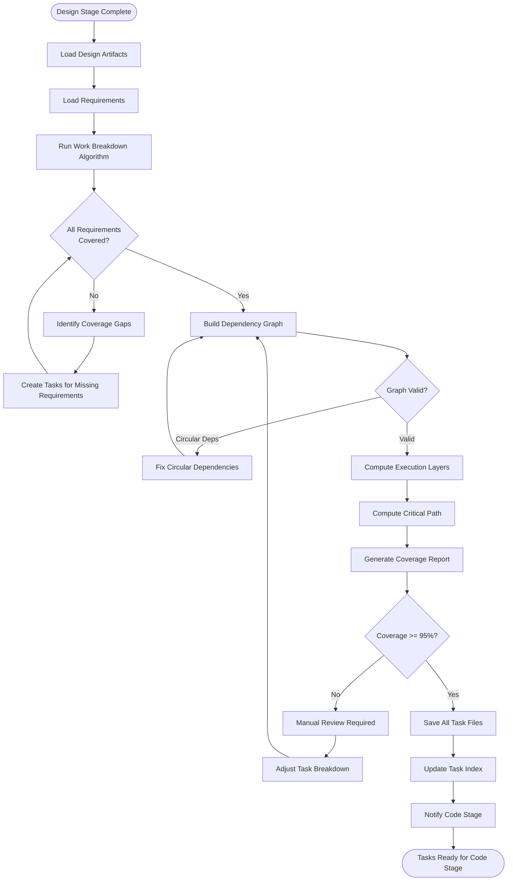
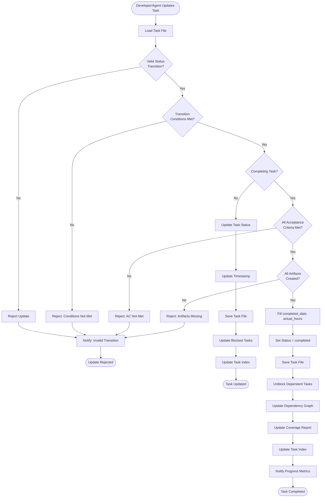
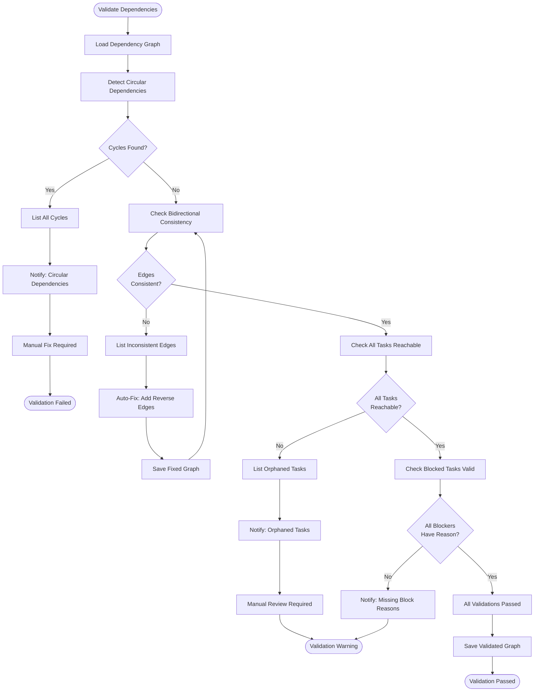

# Tasks Stage - Design Document

**Document Type**: Technical Design Specification
**Project**: ai_sdlc_method (claude_aisdlc solution)
**Version**: 1.0
**Date**: 2025-12-03
**Status**: Draft
**Stage**: Design (Section 5.0)

---

## Requirements Traceability

This design implements the following requirements:

| Requirement | Description | Priority |
|-------------|-------------|----------|
| REQ-TASK-001 | Work Breakdown - Break design into discrete work units | High |
| REQ-TASK-002 | Dependency Tracking - Track dependencies between work units | Medium |
| REQ-TASK-003 | Task-to-Requirement Traceability - Every task references REQ-* keys | High |

**Source**: Design Agent prompt - Tasks Stage requirements

---

## Table of Contents

1. [Executive Summary](#1-executive-summary)
2. [Data Structures](#2-data-structures)
3. [Storage Architecture](#3-storage-architecture)
4. [Algorithms](#4-algorithms)
5. [Workflows](#5-workflows)
6. [Validation Rules](#6-validation-rules)
7. [Integration Points](#7-integration-points)
8. [Examples](#8-examples)
9. [Implementation Guidance](#9-implementation-guidance)

---

## 1. Executive Summary

### 1.1 Purpose

The Tasks Stage transforms design artifacts into **discrete, executable work units** that serve as:
1. **Work Breakdown Structure** - Decompose design into developer-sized chunks
2. **Dependency Graph** - Track relationships and execution order
3. **Requirement Traceability** - Link every work unit to REQ-* keys
4. **Progress Tracking** - Monitor work status from not_started → completed
5. **Coverage Validation** - Ensure all requirements have corresponding tasks

### 1.2 Design Principles

1. **Atomic Work Units** - Each task is independently executable and testable
2. **Explicit Dependencies** - Blocks/blocked-by relationships clearly defined
3. **100% Traceability** - Every task maps to at least one REQ-* key
4. **File-Based** - YAML format for version control and human readability
5. **Status Workflow** - Clear states: not_started → in_progress → blocked → completed
6. **Acceptance-Driven** - Tasks have explicit acceptance criteria

### 1.3 Key Design Decisions

| Decision | Rationale | Requirement |
|----------|-----------|-------------|
| YAML task files | Human-readable, git-friendly, structured | REQ-TASK-001 |
| Separate task + dependency files | Tasks evolve independently of dependency graph | REQ-TASK-002 |
| Task ID format: TASK-{DOMAIN}-{SEQ} | Hierarchical, unique, sortable | REQ-TASK-001 |
| Dependency types: blocks, blocked_by | Bidirectional tracking for validation | REQ-TASK-002 |
| Status workflow with blocked state | Handle dependency waiting explicitly | REQ-TASK-001 |
| Coverage report algorithm | Ensure no requirements left without tasks | REQ-TASK-003 |

---

## 2. Data Structures

### 2.1 Task File Schema

**Purpose**: Define discrete work units with acceptance criteria
**Implements**: REQ-TASK-001

**File Format**: `docs/tasks/{solution}/{TASK-ID}.yml`

```yaml
# Task file schema
task:
  id: "TASK-AUTH-001"
  title: "Implement user authentication service"
  description: |
    Create AuthenticationService class with login/logout functionality.
    Service must validate credentials, manage sessions, and enforce
    security policies.

  # Requirement traceability (REQ-TASK-003)
  requirements:
    - "REQ-F-AUTH-001"      # User login with email/password
    - "REQ-NFR-SEC-001"     # Password hashing with bcrypt
    - "REQ-NFR-PERF-001"    # Login response < 500ms

  # Status workflow (REQ-TASK-001)
  status: "not_started"  # not_started | in_progress | blocked | completed

  # Dependencies (REQ-TASK-002)
  dependencies:
    blocks: []              # Tasks that cannot start until this completes
    blocked_by: []          # Tasks that must complete before this starts

  # Work estimation
  estimated_hours: 8
  actual_hours: null  # Filled when completed

  # Assignment
  assignee: null  # Developer name or AI agent
  priority: "high"  # critical | high | medium | low

  # Acceptance criteria (REQ-TASK-001)
  acceptance_criteria:
    - id: "AC-TASK-AUTH-001-01"
      description: "AuthenticationService class exists with login() method"
      verification: "Unit test passes: test_authentication_service_exists()"

    - id: "AC-TASK-AUTH-001-02"
      description: "Login validates email/password and returns user token"
      verification: "Unit test passes: test_login_with_valid_credentials()"

    - id: "AC-TASK-AUTH-001-03"
      description: "Login rejects invalid credentials with appropriate error"
      verification: "Unit test passes: test_login_with_invalid_credentials()"

    - id: "AC-TASK-AUTH-001-04"
      description: "Passwords hashed with bcrypt (cost factor >= 12)"
      verification: "Unit test passes: test_password_hashing_strength()"

    - id: "AC-TASK-AUTH-001-05"
      description: "Login response time < 500ms (p95)"
      verification: "Performance test passes: test_login_performance()"

  # Artifacts
  artifacts:
    design:
      - "docs/design/{solution}/AUTH_SERVICE_DESIGN.md"
    code:
      - "src/services/authentication_service.py"
    tests:
      - "tests/unit/test_authentication_service.py"
      - "tests/performance/test_auth_performance.py"

  # Notes
  notes: |
    Consider using JWT tokens for stateless authentication.
    Ensure session management is thread-safe.
    Add rate limiting to prevent brute force attacks.

  # Metadata
  created_date: "2025-12-03T10:00:00Z"
  updated_date: "2025-12-03T10:00:00Z"
  completed_date: null
```

**Field Specifications**:

```yaml
field_definitions:
  id:
    type: "string"
    format: "TASK-{DOMAIN}-{SEQ}"
    required: true
    unique: true
    immutable: true
    examples:
      - "TASK-AUTH-001"
      - "TASK-USER-042"
      - "TASK-PAYMENT-005"
    validation:
      pattern: "^TASK-[A-Z][A-Z0-9-]{2,14}-\\d{3}$"

  title:
    type: "string"
    required: true
    max_length: 120
    description: "Short, action-oriented task description"
    examples:
      - "Implement user authentication service"
      - "Create database migration for users table"
      - "Add password reset endpoint"

  description:
    type: "string (markdown)"
    required: true
    description: "Detailed task description with context"

  requirements:
    type: "array[string]"
    required: true
    min_items: 1
    description: "List of REQ-* keys this task implements"
    validation:
      - "Each item must match pattern: ^REQ-(F|NFR|DATA|BR)-[A-Z][A-Z0-9-]{2,14}-\\d{3}$"
      - "All referenced requirements must exist"

  status:
    type: "enum"
    required: true
    values:
      - "not_started"    # Task created, not begun
      - "in_progress"    # Currently being worked
      - "blocked"        # Waiting on dependencies or external factor
      - "completed"      # All acceptance criteria met
    default: "not_started"

  dependencies:
    type: "object"
    required: true
    properties:
      blocks:
        type: "array[string]"
        description: "Task IDs that cannot start until this completes"
        default: []
      blocked_by:
        type: "array[string]"
        description: "Task IDs that must complete before this starts"
        default: []
    validation:
      - "All referenced task IDs must exist"
      - "No circular dependencies allowed"
      - "Bidirectional consistency: if A blocks B, then B blocked_by A"

  estimated_hours:
    type: "number"
    required: false
    minimum: 0.5
    description: "Estimated effort in hours"

  actual_hours:
    type: "number | null"
    required: false
    minimum: 0
    description: "Actual effort in hours (filled when completed)"

  assignee:
    type: "string | null"
    required: false
    description: "Developer name or AI agent identifier"
    examples:
      - "Alice Johnson"
      - "AISDLC Code Agent"
      - null

  priority:
    type: "enum"
    required: true
    values:
      - "critical"  # Blocks release, must complete
      - "high"      # Important for release
      - "medium"    # Should complete if time permits
      - "low"       # Nice to have
    default: "medium"

  acceptance_criteria:
    type: "array[object]"
    required: true
    min_items: 1
    description: "Explicit completion criteria"
    item_schema:
      id:
        type: "string"
        format: "AC-{TASK-ID}-{SEQ}"
        required: true
        unique: true
      description:
        type: "string"
        required: true
        description: "What must be true when task is complete"
      verification:
        type: "string"
        required: true
        description: "How to verify this criterion is met"

  artifacts:
    type: "object"
    required: false
    description: "Expected file outputs"
    properties:
      design: { type: "array[string]" }
      code: { type: "array[string]" }
      tests: { type: "array[string]" }
      docs: { type: "array[string]" }

  notes:
    type: "string (markdown)"
    required: false
    description: "Additional context, considerations, or decisions"

  created_date:
    type: "datetime (ISO 8601)"
    required: true

  updated_date:
    type: "datetime (ISO 8601)"
    required: true

  completed_date:
    type: "datetime (ISO 8601) | null"
    required: false
    description: "When status changed to completed"
```

---

### 2.2 Dependency Graph Schema

**Purpose**: Track relationships between tasks
**Implements**: REQ-TASK-002

**File Format**: `docs/tasks/{solution}/DEPENDENCY_GRAPH.yml`

```yaml
# Dependency graph schema
dependency_graph:
  solution: "claude_aisdlc"
  version: "1.0"
  generated_date: "2025-12-03T10:00:00Z"

  # Summary statistics
  stats:
    total_tasks: 42
    total_edges: 68
    max_depth: 5
    critical_path_length: 12

  # Nodes (tasks)
  nodes:
    - id: "TASK-AUTH-001"
      title: "Implement user authentication service"
      status: "completed"
      priority: "critical"
      estimated_hours: 8
      actual_hours: 10

    - id: "TASK-AUTH-002"
      title: "Create authentication middleware"
      status: "in_progress"
      priority: "high"
      estimated_hours: 4
      actual_hours: null

    - id: "TASK-USER-001"
      title: "Create user management endpoints"
      status: "blocked"
      priority: "high"
      estimated_hours: 6
      actual_hours: null

  # Edges (dependencies)
  edges:
    - from: "TASK-AUTH-001"
      to: "TASK-AUTH-002"
      type: "blocks"
      reason: "Middleware depends on authentication service interface"

    - from: "TASK-AUTH-001"
      to: "TASK-USER-001"
      type: "blocks"
      reason: "User endpoints need authentication service for auth checks"

    - from: "TASK-AUTH-002"
      to: "TASK-USER-001"
      type: "blocks"
      reason: "User endpoints need middleware for route protection"

  # Execution layers (tasks that can run in parallel)
  layers:
    - layer: 0
      tasks: ["TASK-DB-001", "TASK-CONFIG-001"]
      description: "Foundation - no dependencies"

    - layer: 1
      tasks: ["TASK-AUTH-001", "TASK-LOGGING-001"]
      description: "Core services - depend on foundation"

    - layer: 2
      tasks: ["TASK-AUTH-002", "TASK-USER-001", "TASK-PAYMENT-001"]
      description: "Business logic - depend on core services"

    - layer: 3
      tasks: ["TASK-API-001", "TASK-UI-001"]
      description: "Interfaces - depend on business logic"

    - layer: 4
      tasks: ["TASK-DEPLOY-001"]
      description: "Deployment - depends on all components"

  # Critical path (longest sequence determining minimum completion time)
  critical_path:
    - id: "TASK-DB-001"
      cumulative_hours: 4
    - id: "TASK-AUTH-001"
      cumulative_hours: 12
    - id: "TASK-AUTH-002"
      cumulative_hours: 16
    - id: "TASK-USER-001"
      cumulative_hours: 22
    - id: "TASK-API-001"
      cumulative_hours: 28
    - id: "TASK-DEPLOY-001"
      cumulative_hours: 30

  # Validation results
  validation:
    circular_dependencies: []
    orphaned_tasks: []
    bidirectional_consistency: true
    all_tasks_reachable: true
```

---

### 2.3 Coverage Report Schema

**Purpose**: Identify requirements without tasks
**Implements**: REQ-TASK-003

**File Format**: `docs/tasks/{solution}/COVERAGE_REPORT.yml`

```yaml
# Coverage report schema
coverage_report:
  solution: "claude_aisdlc"
  generated_date: "2025-12-03T10:00:00Z"

  # Summary
  summary:
    total_requirements: 54
    requirements_with_tasks: 52
    requirements_without_tasks: 2
    coverage_percentage: 96.3

  # Requirements by status
  by_status:
    completed:
      count: 30
      percentage: 55.6
    in_progress:
      count: 15
      percentage: 27.8
    not_started:
      count: 7
      percentage: 13.0
    no_tasks:
      count: 2
      percentage: 3.7

  # Requirements with full coverage
  covered_requirements:
    - requirement: "REQ-F-AUTH-001"
      title: "User login with email/password"
      tasks:
        - id: "TASK-AUTH-001"
          title: "Implement user authentication service"
          status: "completed"
        - id: "TASK-AUTH-002"
          title: "Create authentication middleware"
          status: "in_progress"
      coverage: "full"

    - requirement: "REQ-NFR-PERF-001"
      title: "Login response < 500ms"
      tasks:
        - id: "TASK-AUTH-001"
          title: "Implement user authentication service"
          status: "completed"
        - id: "TASK-PERF-001"
          title: "Optimize authentication query performance"
          status: "completed"
      coverage: "full"

  # Requirements without tasks (GAPS!)
  uncovered_requirements:
    - requirement: "REQ-F-ADMIN-003"
      title: "Admin can disable user accounts"
      priority: "medium"
      reason: "Not scheduled for current release"
      action_needed: "Create TASK-ADMIN-003 or defer to next release"

    - requirement: "REQ-NFR-SEC-007"
      title: "Security audit logging for sensitive operations"
      priority: "high"
      reason: "Overlooked in design breakdown"
      action_needed: "Create TASK-SECURITY-004 immediately"

  # Requirements with partial coverage (single task for complex requirement)
  partial_coverage_warnings:
    - requirement: "REQ-F-PAYMENT-001"
      title: "Process credit card payments via Stripe"
      tasks:
        - id: "TASK-PAYMENT-001"
          title: "Integrate Stripe payment processing"
          status: "not_started"
      warning: "Complex payment requirement covered by single task - consider breaking down"
      suggestion: "Split into: integration, error handling, refund processing, reconciliation"

  # Requirements mapped to many tasks (potential over-engineering)
  over_tasking_warnings:
    - requirement: "REQ-F-USER-002"
      title: "User can update profile information"
      tasks:
        - "TASK-USER-005"
        - "TASK-USER-006"
        - "TASK-USER-007"
        - "TASK-USER-008"
        - "TASK-USER-009"
      task_count: 5
      warning: "Simple requirement mapped to 5 tasks - consider consolidation"

  # Traceability matrix (full mapping)
  traceability_matrix:
    - requirement: "REQ-F-AUTH-001"
      tasks: ["TASK-AUTH-001", "TASK-AUTH-002"]
      status: "in_progress"

    - requirement: "REQ-F-AUTH-002"
      tasks: ["TASK-AUTH-003"]
      status: "completed"

    - requirement: "REQ-NFR-PERF-001"
      tasks: ["TASK-AUTH-001", "TASK-PERF-001"]
      status: "completed"

    # ... (all requirements)

  # Action items
  action_items:
    - priority: "critical"
      description: "Create tasks for REQ-NFR-SEC-007 (security audit logging)"
      owner: "Tasks Agent"
      due_date: "2025-12-04"

    - priority: "medium"
      description: "Decide on REQ-F-ADMIN-003 - defer to v2.0 or add to current release"
      owner: "Product Owner"
      due_date: "2025-12-05"
```

---

### 2.4 Task Status Workflow

**Purpose**: Define valid state transitions
**Implements**: REQ-TASK-001

```yaml
# Status workflow state machine
status_workflow:
  states:
    - id: "not_started"
      description: "Task created but not begun"
      allowed_transitions:
        - "in_progress"
        - "blocked"
      conditions:
        - "All blocked_by dependencies must be completed OR task can be marked blocked"

    - id: "in_progress"
      description: "Currently being worked on"
      allowed_transitions:
        - "completed"
        - "blocked"
        - "not_started"  # If work needs to restart
      conditions:
        - "Must have assignee when entering this state"

    - id: "blocked"
      description: "Waiting on dependencies or external factors"
      allowed_transitions:
        - "in_progress"
        - "not_started"
      conditions:
        - "Must document blocking reason"
        - "Can transition to in_progress when blocker resolved"

    - id: "completed"
      description: "All acceptance criteria met"
      allowed_transitions: []  # Terminal state (no transitions out)
      conditions:
        - "All acceptance criteria must be verified"
        - "All required artifacts must exist"
        - "actual_hours must be filled"
        - "completed_date must be set"

  # Validation rules
  validation_rules:
    - rule: "no_reverse_completion"
      description: "Cannot transition out of completed state"
      enforcement: "System prevents status change when status='completed'"

    - rule: "assignee_required_for_progress"
      description: "Must have assignee to be in_progress"
      enforcement: "System requires assignee field when status='in_progress'"

    - rule: "blocking_reason_required"
      description: "Must document why task is blocked"
      enforcement: "System requires notes field when status='blocked'"

    - rule: "completion_criteria"
      description: "All acceptance criteria must be met before completion"
      enforcement: "System checks all AC verified before allowing completed status"
```

---

## 3. Storage Architecture

### 3.1 Directory Structure

```
docs/
└── tasks/
    └── {solution}/              # e.g., claude_aisdlc
        ├── TASK-AUTH-001.yml    # Individual task files
        ├── TASK-AUTH-002.yml
        ├── TASK-USER-001.yml
        ├── ...
        ├── DEPENDENCY_GRAPH.yml       # Dependency relationships
        ├── COVERAGE_REPORT.yml        # Coverage analysis
        └── TASK_INDEX.yml             # Quick reference index
```

**Rationale**:
- **One file per task** - Atomic git commits, clean merges
- **Separate dependency graph** - Tasks evolve independently
- **Coverage report** - Generated artifact, not manually edited
- **Task index** - Quick lookup without reading all files

---

### 3.2 Task Index Schema

**Purpose**: Quick reference without loading all task files

```yaml
# TASK_INDEX.yml
task_index:
  solution: "claude_aisdlc"
  generated_date: "2025-12-03T10:00:00Z"
  total_tasks: 42

  # Quick lookup
  tasks:
    - id: "TASK-AUTH-001"
      title: "Implement user authentication service"
      status: "completed"
      priority: "critical"
      requirements: ["REQ-F-AUTH-001", "REQ-NFR-SEC-001"]
      file: "TASK-AUTH-001.yml"

    - id: "TASK-AUTH-002"
      title: "Create authentication middleware"
      status: "in_progress"
      priority: "high"
      requirements: ["REQ-F-AUTH-001"]
      file: "TASK-AUTH-002.yml"

  # By status
  by_status:
    not_started: ["TASK-USER-003", "TASK-PAYMENT-001", ...]
    in_progress: ["TASK-AUTH-002", "TASK-API-001"]
    blocked: ["TASK-USER-001"]
    completed: ["TASK-AUTH-001", "TASK-DB-001", ...]

  # By priority
  by_priority:
    critical: ["TASK-AUTH-001", "TASK-DB-001"]
    high: ["TASK-AUTH-002", "TASK-USER-001", "TASK-PAYMENT-001"]
    medium: ["TASK-LOGGING-001", "TASK-MONITORING-001"]
    low: ["TASK-DOCS-001"]

  # By requirement
  by_requirement:
    "REQ-F-AUTH-001": ["TASK-AUTH-001", "TASK-AUTH-002"]
    "REQ-NFR-PERF-001": ["TASK-AUTH-001", "TASK-PERF-001"]
    # ...
```

---

## 4. Algorithms

### 4.1 Work Breakdown Algorithm

**Purpose**: Decompose design into tasks
**Implements**: REQ-TASK-001

```python
def break_down_design_into_tasks(design_artifacts, requirements):
    """
    Break design artifacts into discrete work units.

    Args:
        design_artifacts: List of design documents (components, APIs, data models)
        requirements: List of REQ-* keys from requirements stage

    Returns:
        List of Task objects
    """
    tasks = []
    task_sequence = {}  # Track sequence numbers by domain

    # Step 1: Identify work units from design components
    for component in design_artifacts['components']:
        domain = component['domain']

        # Initialize sequence for domain
        if domain not in task_sequence:
            task_sequence[domain] = 1

        # Create task for component implementation
        task = Task(
            id=f"TASK-{domain}-{task_sequence[domain]:03d}",
            title=f"Implement {component['name']}",
            description=component['description'],
            requirements=component['implements'],  # REQ-* keys from design
            status="not_started",
            priority=determine_priority(component),
            estimated_hours=estimate_effort(component),
            acceptance_criteria=generate_acceptance_criteria(component, requirements)
        )

        tasks.append(task)
        task_sequence[domain] += 1

    # Step 2: Create tasks for cross-cutting concerns
    for nfr in filter(lambda r: r.startswith("REQ-NFR-"), requirements):
        if not is_covered_by_tasks(nfr, tasks):
            domain = extract_domain(nfr)

            if domain not in task_sequence:
                task_sequence[domain] = 1

            task = Task(
                id=f"TASK-{domain}-{task_sequence[domain]:03d}",
                title=f"Implement {nfr}",
                description=get_requirement_description(nfr),
                requirements=[nfr],
                status="not_started",
                priority="high",  # NFRs are high priority
                estimated_hours=estimate_nfr_effort(nfr),
                acceptance_criteria=get_nfr_acceptance_criteria(nfr)
            )

            tasks.append(task)
            task_sequence[domain] += 1

    # Step 3: Create tasks for data models
    for data_model in design_artifacts['data_models']:
        domain = data_model['domain']

        if domain not in task_sequence:
            task_sequence[domain] = 1

        task = Task(
            id=f"TASK-{domain}-{task_sequence[domain]:03d}",
            title=f"Create {data_model['name']} schema and migrations",
            description=f"Implement database schema for {data_model['name']}",
            requirements=data_model['satisfies'],
            status="not_started",
            priority="critical",  # Data layer is foundational
            estimated_hours=4,
            acceptance_criteria=generate_data_acceptance_criteria(data_model)
        )

        tasks.append(task)
        task_sequence[domain] += 1

    # Step 4: Validate all requirements have tasks
    coverage = validate_requirement_coverage(requirements, tasks)
    if coverage['uncovered']:
        raise ValidationError(f"Requirements without tasks: {coverage['uncovered']}")

    return tasks


def determine_priority(component):
    """Determine task priority from component metadata."""
    if component.get('critical', False):
        return "critical"
    elif component.get('foundational', False):
        return "critical"
    elif component.get('nfr_related', False):
        return "high"
    else:
        return "medium"


def estimate_effort(component):
    """Estimate task effort in hours."""
    complexity = component.get('complexity', 'medium')

    base_hours = {
        'low': 4,
        'medium': 8,
        'high': 16
    }

    return base_hours.get(complexity, 8)


def generate_acceptance_criteria(component, requirements):
    """Generate acceptance criteria from component and requirements."""
    criteria = []
    seq = 1

    # Criterion 1: Component exists
    criteria.append({
        'id': f"AC-{component['id']}-{seq:02d}",
        'description': f"{component['name']} class/module exists",
        'verification': f"Unit test passes: test_{component['name'].lower()}_exists()"
    })
    seq += 1

    # Criterion 2: Interface implemented
    if component.get('interface'):
        criteria.append({
            'id': f"AC-{component['id']}-{seq:02d}",
            'description': f"Implements {component['interface']} interface",
            'verification': f"Unit test passes: test_{component['name'].lower()}_interface()"
        })
        seq += 1

    # Criterion 3: Requirements satisfied
    for req_id in component['implements']:
        req = find_requirement(req_id, requirements)
        for ac in req['acceptance_criteria']:
            criteria.append({
                'id': f"AC-{component['id']}-{seq:02d}",
                'description': ac['description'],
                'verification': ac['verification']
            })
            seq += 1

    return criteria
```

---

### 4.2 Dependency Graph Generation Algorithm

**Purpose**: Build dependency graph from task relationships
**Implements**: REQ-TASK-002

```python
def generate_dependency_graph(tasks, design_artifacts):
    """
    Generate dependency graph from tasks and design.

    Args:
        tasks: List of Task objects
        design_artifacts: Design documents with component dependencies

    Returns:
        DependencyGraph object
    """
    graph = DependencyGraph()

    # Step 1: Add all tasks as nodes
    for task in tasks:
        graph.add_node(
            task_id=task.id,
            title=task.title,
            status=task.status,
            priority=task.priority,
            estimated_hours=task.estimated_hours
        )

    # Step 2: Add edges from design component dependencies
    for component in design_artifacts['components']:
        task_id = find_task_for_component(component, tasks)

        # Component depends on other components
        for dependency in component.get('depends_on', []):
            dep_task_id = find_task_for_component(dependency, tasks)

            if dep_task_id:
                graph.add_edge(
                    from_task=dep_task_id,
                    to_task=task_id,
                    type="blocks",
                    reason=f"{dependency['name']} must exist before {component['name']}"
                )

    # Step 3: Add edges from data model dependencies
    for data_model in design_artifacts['data_models']:
        task_id = find_task_for_data_model(data_model, tasks)

        # Tables with foreign keys depend on referenced tables
        for foreign_key in data_model.get('foreign_keys', []):
            ref_table = foreign_key['references']
            ref_task_id = find_task_for_table(ref_table, tasks)

            if ref_task_id:
                graph.add_edge(
                    from_task=ref_task_id,
                    to_task=task_id,
                    type="blocks",
                    reason=f"{ref_table} table must exist for foreign key constraint"
                )

    # Step 4: Add edges from explicit task dependencies
    for task in tasks:
        for blocked_by_id in task.dependencies['blocked_by']:
            graph.add_edge(
                from_task=blocked_by_id,
                to_task=task.id,
                type="blocks",
                reason="Explicit dependency in task definition"
            )

    # Step 5: Validate graph integrity
    validation_results = validate_dependency_graph(graph)

    if validation_results['circular_dependencies']:
        raise ValidationError(
            f"Circular dependencies detected: {validation_results['circular_dependencies']}"
        )

    if not validation_results['bidirectional_consistency']:
        raise ValidationError("Dependency graph has inconsistent edges")

    # Step 6: Compute execution layers (topological sort)
    graph.layers = compute_execution_layers(graph)

    # Step 7: Compute critical path
    graph.critical_path = compute_critical_path(graph)

    return graph


def validate_dependency_graph(graph):
    """Validate dependency graph for common issues."""
    results = {
        'circular_dependencies': [],
        'orphaned_tasks': [],
        'bidirectional_consistency': True,
        'all_tasks_reachable': True
    }

    # Check for circular dependencies (cycles)
    cycles = detect_cycles(graph)
    results['circular_dependencies'] = cycles

    # Check for orphaned tasks (no incoming or outgoing edges)
    orphaned = find_orphaned_nodes(graph)
    results['orphaned_tasks'] = orphaned

    # Check bidirectional consistency
    # If A blocks B, then B must be blocked_by A
    for edge in graph.edges:
        reverse_edge_exists = graph.has_edge(
            from_task=edge.to_task,
            to_task=edge.from_task,
            type="blocked_by"
        )

        if not reverse_edge_exists:
            results['bidirectional_consistency'] = False
            break

    # Check all tasks reachable from roots
    roots = graph.find_root_nodes()
    reachable = set()
    for root in roots:
        reachable.update(graph.traverse_from(root))

    if len(reachable) != len(graph.nodes):
        results['all_tasks_reachable'] = False

    return results


def compute_execution_layers(graph):
    """
    Compute execution layers via topological sort.
    Tasks in same layer can execute in parallel.
    """
    layers = []
    remaining_nodes = set(graph.nodes.keys())
    in_degree = {node: graph.in_degree(node) for node in remaining_nodes}

    while remaining_nodes:
        # Find nodes with no dependencies (in_degree = 0)
        current_layer = [
            node for node in remaining_nodes
            if in_degree[node] == 0
        ]

        if not current_layer:
            raise ValidationError("Circular dependency detected in graph")

        layers.append({
            'layer': len(layers),
            'tasks': current_layer,
            'description': f"Layer {len(layers)} - {len(current_layer)} tasks"
        })

        # Remove current layer from graph
        for node in current_layer:
            remaining_nodes.remove(node)

            # Decrease in_degree for dependent nodes
            for successor in graph.successors(node):
                in_degree[successor] -= 1

    return layers


def compute_critical_path(graph):
    """
    Compute critical path (longest path determining minimum completion time).
    Uses dynamic programming on DAG.
    """
    # Topological sort
    topo_order = topological_sort(graph)

    # Initialize distances
    dist = {node: 0 for node in graph.nodes}
    predecessor = {node: None for node in graph.nodes}

    # Compute longest path
    for node in topo_order:
        node_hours = graph.nodes[node]['estimated_hours']

        for successor in graph.successors(node):
            new_dist = dist[node] + node_hours

            if new_dist > dist[successor]:
                dist[successor] = new_dist
                predecessor[successor] = node

    # Find terminal node with maximum distance
    terminal_node = max(dist, key=dist.get)

    # Reconstruct path
    critical_path = []
    current = terminal_node
    cumulative = dist[terminal_node]

    while current is not None:
        critical_path.insert(0, {
            'id': current,
            'cumulative_hours': cumulative
        })
        current = predecessor[current]
        if current:
            cumulative -= graph.nodes[current]['estimated_hours']

    return critical_path
```

---

### 4.3 Coverage Report Generation Algorithm

**Purpose**: Identify requirements without tasks
**Implements**: REQ-TASK-003

```python
def generate_coverage_report(requirements, tasks):
    """
    Generate coverage report showing requirement-to-task mapping.

    Args:
        requirements: List of requirement objects from Requirements stage
        tasks: List of task objects

    Returns:
        CoverageReport object
    """
    report = CoverageReport(
        solution="claude_aisdlc",
        generated_date=datetime.now()
    )

    # Step 1: Build requirement → tasks mapping
    req_to_tasks = defaultdict(list)
    for task in tasks:
        for req_id in task.requirements:
            req_to_tasks[req_id].append(task)

    # Step 2: Classify requirements
    covered = []
    uncovered = []
    partial_coverage = []
    over_tasking = []

    for requirement in requirements:
        req_id = requirement['id']
        req_tasks = req_to_tasks.get(req_id, [])

        if not req_tasks:
            # No tasks for this requirement
            uncovered.append({
                'requirement': req_id,
                'title': requirement['title'],
                'priority': requirement['priority'],
                'reason': "No tasks created",
                'action_needed': f"Create task for {req_id}"
            })

        elif len(req_tasks) == 1 and is_complex_requirement(requirement):
            # Single task for complex requirement (potential under-planning)
            partial_coverage.append({
                'requirement': req_id,
                'title': requirement['title'],
                'tasks': [{'id': t.id, 'title': t.title} for t in req_tasks],
                'warning': "Complex requirement covered by single task",
                'suggestion': "Consider breaking down into smaller tasks"
            })

            covered.append({
                'requirement': req_id,
                'title': requirement['title'],
                'tasks': [
                    {'id': t.id, 'title': t.title, 'status': t.status}
                    for t in req_tasks
                ],
                'coverage': "partial"
            })

        elif len(req_tasks) > 4 and is_simple_requirement(requirement):
            # Many tasks for simple requirement (potential over-engineering)
            over_tasking.append({
                'requirement': req_id,
                'title': requirement['title'],
                'tasks': [t.id for t in req_tasks],
                'task_count': len(req_tasks),
                'warning': "Simple requirement mapped to many tasks",
                'suggestion': "Consider consolidating tasks"
            })

            covered.append({
                'requirement': req_id,
                'title': requirement['title'],
                'tasks': [
                    {'id': t.id, 'title': t.title, 'status': t.status}
                    for t in req_tasks
                ],
                'coverage': "full"
            })

        else:
            # Normal coverage
            covered.append({
                'requirement': req_id,
                'title': requirement['title'],
                'tasks': [
                    {'id': t.id, 'title': t.title, 'status': t.status}
                    for t in req_tasks
                ],
                'coverage': "full"
            })

    # Step 3: Compute summary statistics
    report.summary = {
        'total_requirements': len(requirements),
        'requirements_with_tasks': len(covered),
        'requirements_without_tasks': len(uncovered),
        'coverage_percentage': (len(covered) / len(requirements)) * 100
    }

    # Step 4: Compute status breakdown
    report.by_status = compute_status_breakdown(covered, tasks)

    # Step 5: Populate report sections
    report.covered_requirements = covered
    report.uncovered_requirements = uncovered
    report.partial_coverage_warnings = partial_coverage
    report.over_tasking_warnings = over_tasking

    # Step 6: Build full traceability matrix
    report.traceability_matrix = [
        {
            'requirement': req['id'],
            'tasks': [t.id for t in req_to_tasks.get(req['id'], [])],
            'status': compute_requirement_status(req_to_tasks.get(req['id'], []))
        }
        for req in requirements
    ]

    # Step 7: Generate action items
    report.action_items = generate_action_items(uncovered, partial_coverage)

    return report


def is_complex_requirement(requirement):
    """Determine if requirement is complex (should have multiple tasks)."""
    # Heuristics:
    # - Multiple acceptance criteria (> 3)
    # - NFR requirements (usually cross-cutting)
    # - Data requirements (schema + migrations + validation)

    if len(requirement.get('acceptance_criteria', [])) > 3:
        return True

    if requirement['id'].startswith('REQ-NFR-'):
        return True

    if requirement['id'].startswith('REQ-DATA-'):
        return True

    return False


def is_simple_requirement(requirement):
    """Determine if requirement is simple (should have 1-2 tasks)."""
    # Heuristics:
    # - Single acceptance criterion
    # - CRUD operations
    # - Simple functional requirements

    if len(requirement.get('acceptance_criteria', [])) == 1:
        return True

    if any(keyword in requirement['title'].lower()
           for keyword in ['list', 'view', 'display', 'show']):
        return True

    return False


def compute_requirement_status(tasks):
    """Compute overall status for a requirement based on its tasks."""
    if not tasks:
        return "no_tasks"

    statuses = [t.status for t in tasks]

    if all(s == "completed" for s in statuses):
        return "completed"
    elif any(s == "in_progress" for s in statuses):
        return "in_progress"
    elif any(s == "blocked" for s in statuses):
        return "blocked"
    else:
        return "not_started"


def generate_action_items(uncovered, partial_coverage):
    """Generate prioritized action items from coverage analysis."""
    actions = []

    # Action items for uncovered requirements
    for req in uncovered:
        actions.append({
            'priority': 'critical' if req['priority'] in ['critical', 'high'] else 'medium',
            'description': f"Create tasks for {req['requirement']} ({req['title']})",
            'owner': "Tasks Agent",
            'due_date': (datetime.now() + timedelta(days=1)).isoformat()
        })

    # Action items for partial coverage
    for req in partial_coverage:
        actions.append({
            'priority': 'medium',
            'description': f"Review task breakdown for {req['requirement']} - {req['warning']}",
            'owner': "Tasks Agent",
            'due_date': (datetime.now() + timedelta(days=3)).isoformat()
        })

    return sorted(actions, key=lambda x: (
        0 if x['priority'] == 'critical' else 1 if x['priority'] == 'high' else 2
    ))
```

---

## 5. Workflows

### 5.1 Task Creation Workflow



---

### 5.2 Task Status Update Workflow



---

### 5.3 Dependency Validation Workflow



---

## 6. Validation Rules

### 6.1 Task Validation Rules

```yaml
validation_rules:
  - rule_id: "VR-TASK-001"
    name: "Unique Task ID"
    description: "Task ID must be unique across solution"
    severity: "error"
    validation: |
      def validate(task, all_tasks):
          other_tasks = [t for t in all_tasks if t.id != task.id]
          return task.id not in [t.id for t in other_tasks]
    error_message: "Task ID {task.id} already exists"

  - rule_id: "VR-TASK-002"
    name: "Valid Task ID Format"
    description: "Task ID must match TASK-{DOMAIN}-{SEQ} format"
    severity: "error"
    validation: |
      import re
      def validate(task):
          pattern = r'^TASK-[A-Z][A-Z0-9-]{2,14}-\d{3}$'
          return re.match(pattern, task.id) is not None
    error_message: "Task ID {task.id} does not match format TASK-{DOMAIN}-{SEQ}"

  - rule_id: "VR-TASK-003"
    name: "Requirements Exist"
    description: "All referenced REQ-* keys must exist"
    severity: "error"
    validation: |
      def validate(task, all_requirements):
          req_ids = {r['id'] for r in all_requirements}
          return all(req_id in req_ids for req_id in task.requirements)
    error_message: "Task {task.id} references non-existent requirements: {missing}"

  - rule_id: "VR-TASK-004"
    name: "At Least One Requirement"
    description: "Task must implement at least one requirement"
    severity: "error"
    validation: |
      def validate(task):
          return len(task.requirements) >= 1
    error_message: "Task {task.id} must reference at least one requirement"

  - rule_id: "VR-TASK-005"
    name: "At Least One Acceptance Criterion"
    description: "Task must have at least one acceptance criterion"
    severity: "error"
    validation: |
      def validate(task):
          return len(task.acceptance_criteria) >= 1
    error_message: "Task {task.id} must have at least one acceptance criterion"

  - rule_id: "VR-TASK-006"
    name: "Valid Status"
    description: "Status must be one of: not_started, in_progress, blocked, completed"
    severity: "error"
    validation: |
      def validate(task):
          valid_statuses = ['not_started', 'in_progress', 'blocked', 'completed']
          return task.status in valid_statuses
    error_message: "Task {task.id} has invalid status: {task.status}"

  - rule_id: "VR-TASK-007"
    name: "Completed Task Requirements"
    description: "Completed tasks must have actual_hours and completed_date"
    severity: "error"
    validation: |
      def validate(task):
          if task.status == 'completed':
              return (task.actual_hours is not None and
                      task.completed_date is not None)
          return True
    error_message: "Completed task {task.id} missing actual_hours or completed_date"

  - rule_id: "VR-TASK-008"
    name: "In-Progress Task Has Assignee"
    description: "Tasks in_progress must have an assignee"
    severity: "warning"
    validation: |
      def validate(task):
          if task.status == 'in_progress':
              return task.assignee is not None
          return True
    error_message: "Task {task.id} is in_progress but has no assignee"

  - rule_id: "VR-TASK-009"
    name: "Blocked Task Has Reason"
    description: "Blocked tasks should document blocking reason in notes"
    severity: "warning"
    validation: |
      def validate(task):
          if task.status == 'blocked':
              return task.notes and 'block' in task.notes.lower()
          return True
    error_message: "Task {task.id} is blocked but no blocking reason in notes"

  - rule_id: "VR-TASK-010"
    name: "Valid Priority"
    description: "Priority must be: critical, high, medium, or low"
    severity: "error"
    validation: |
      def validate(task):
          valid_priorities = ['critical', 'high', 'medium', 'low']
          return task.priority in valid_priorities
    error_message: "Task {task.id} has invalid priority: {task.priority}"
```

---

### 6.2 Dependency Validation Rules

```yaml
dependency_validation_rules:
  - rule_id: "VR-DEP-001"
    name: "No Circular Dependencies"
    description: "Dependency graph must be a DAG (no cycles)"
    severity: "error"
    validation: |
      def validate(graph):
          cycles = detect_cycles(graph)
          return len(cycles) == 0
    error_message: "Circular dependencies detected: {cycles}"

  - rule_id: "VR-DEP-002"
    name: "Bidirectional Consistency"
    description: "If A blocks B, then B must be blocked_by A"
    severity: "error"
    validation: |
      def validate(graph):
          for edge in graph.edges:
              if edge.type == 'blocks':
                  reverse_exists = graph.has_edge(
                      from_task=edge.to_task,
                      to_task=edge.from_task,
                      type='blocked_by'
                  )
                  if not reverse_exists:
                      return False
          return True
    error_message: "Dependency graph has inconsistent edges"

  - rule_id: "VR-DEP-003"
    name: "Referenced Tasks Exist"
    description: "All dependency references must be valid task IDs"
    severity: "error"
    validation: |
      def validate(graph, all_tasks):
          task_ids = {t.id for t in all_tasks}
          for edge in graph.edges:
              if edge.from_task not in task_ids or edge.to_task not in task_ids:
                  return False
          return True
    error_message: "Dependency references non-existent task"

  - rule_id: "VR-DEP-004"
    name: "No Self Dependencies"
    description: "Task cannot depend on itself"
    severity: "error"
    validation: |
      def validate(graph):
          for edge in graph.edges:
              if edge.from_task == edge.to_task:
                  return False
          return True
    error_message: "Task {task.id} has self-dependency"

  - rule_id: "VR-DEP-005"
    name: "Blocked Task Dependencies Met"
    description: "If task status is blocked, blocked_by tasks should exist"
    severity: "warning"
    validation: |
      def validate(task, graph):
          if task.status == 'blocked':
              return len(task.dependencies['blocked_by']) > 0
          return True
    error_message: "Task {task.id} is blocked but has no blocked_by dependencies"
```

---

### 6.3 Coverage Validation Rules

```yaml
coverage_validation_rules:
  - rule_id: "VR-COV-001"
    name: "All Requirements Have Tasks"
    description: "Every requirement must have at least one task"
    severity: "error"
    validation: |
      def validate(requirements, tasks):
          req_ids_with_tasks = set()
          for task in tasks:
              req_ids_with_tasks.update(task.requirements)

          all_req_ids = {r['id'] for r in requirements}
          missing = all_req_ids - req_ids_with_tasks

          return len(missing) == 0
    error_message: "Requirements without tasks: {missing}"

  - rule_id: "VR-COV-002"
    name: "Coverage >= 95%"
    description: "At least 95% of requirements must have tasks"
    severity: "warning"
    validation: |
      def validate(coverage_report):
          return coverage_report.summary['coverage_percentage'] >= 95.0
    error_message: "Coverage {coverage}% is below 95% threshold"

  - rule_id: "VR-COV-003"
    name: "Critical Requirements Covered"
    description: "All critical priority requirements must have tasks"
    severity: "error"
    validation: |
      def validate(requirements, tasks, coverage_report):
          critical_reqs = [r for r in requirements if r['priority'] == 'critical']
          uncovered = coverage_report.uncovered_requirements
          uncovered_ids = {u['requirement'] for u in uncovered}

          critical_uncovered = [
              r for r in critical_reqs
              if r['id'] in uncovered_ids
          ]

          return len(critical_uncovered) == 0
    error_message: "Critical requirements without tasks: {critical_uncovered}"

  - rule_id: "VR-COV-004"
    name: "No Orphaned Tasks"
    description: "All tasks must reference valid requirements"
    severity: "error"
    validation: |
      def validate(tasks, requirements):
          req_ids = {r['id'] for r in requirements}
          for task in tasks:
              if not all(req_id in req_ids for req_id in task.requirements):
                  return False
          return True
    error_message: "Task {task.id} references invalid requirements"
```

---

## 7. Integration Points

### 7.1 Requirements Stage Integration

**Interface**: Tasks Stage consumes requirements from Requirements Stage

```yaml
requirements_stage_outputs:
  - artifact: "docs/requirements/{intent_id}_REQUIREMENTS.md"
    format: "markdown"
    contains:
      - "REQ-F-* keys"
      - "REQ-NFR-* keys"
      - "REQ-DATA-* keys"
      - "REQ-BR-* keys"
      - "Acceptance criteria for each requirement"

  - artifact: "docs/requirements/{intent_id}_TRACEABILITY.yml"
    format: "yaml"
    contains:
      - "Intent → Requirements mapping"

tasks_stage_usage:
  - purpose: "Ensure all requirements have corresponding tasks"
  - validation: "100% requirement coverage"
  - mapping: "REQ-* keys → TASK-* IDs"
```

---

### 7.2 Design Stage Integration

**Interface**: Tasks Stage consumes design artifacts from Design Stage

```yaml
design_stage_outputs:
  - artifact: "docs/design/{solution}/COMPONENT_DESIGN.md"
    format: "markdown"
    contains:
      - "Component specifications"
      - "Component dependencies"
      - "API specifications"

  - artifact: "docs/design/{solution}/DATA_MODEL_DESIGN.md"
    format: "markdown"
    contains:
      - "Database schemas"
      - "Table relationships"
      - "Migration scripts"

  - artifact: "docs/design/{solution}/adrs/*.md"
    format: "markdown"
    contains:
      - "Architectural decisions"
      - "Technology choices"

tasks_stage_usage:
  - purpose: "Break design components into implementable work units"
  - decomposition: "Component → Task(s)"
  - dependencies: "Component dependencies → Task dependencies"
```

---

### 7.3 Code Stage Integration

**Interface**: Tasks Stage provides work units to Code Stage

```yaml
tasks_stage_outputs:
  - artifact: "docs/tasks/{solution}/TASK-*.yml"
    format: "yaml"
    contains:
      - "Task specifications"
      - "Acceptance criteria"
      - "Requirement traceability"

  - artifact: "docs/tasks/{solution}/DEPENDENCY_GRAPH.yml"
    format: "yaml"
    contains:
      - "Task dependencies"
      - "Execution order"

  - artifact: "docs/tasks/{solution}/TASK_INDEX.yml"
    format: "yaml"
    contains:
      - "Quick task lookup"
      - "Status tracking"

code_stage_usage:
  - purpose: "Execute tasks in dependency order"
  - workflow: "Pick not_started task → Implement → Complete → Unblock dependents"
  - traceability: "Code comments reference TASK-* IDs and REQ-* keys"
```

---

### 7.4 Traceability System Integration

**Interface**: Tasks Stage updates traceability matrix

```yaml
traceability_matrix_updates:
  - entry_type: "task_created"
    fields:
      - task_id: "TASK-AUTH-001"
      - requirements: ["REQ-F-AUTH-001", "REQ-NFR-SEC-001"]
      - status: "not_started"
      - created_date: "2025-12-03T10:00:00Z"

  - entry_type: "task_status_changed"
    fields:
      - task_id: "TASK-AUTH-001"
      - old_status: "not_started"
      - new_status: "in_progress"
      - changed_date: "2025-12-03T11:00:00Z"

  - entry_type: "task_completed"
    fields:
      - task_id: "TASK-AUTH-001"
      - requirements: ["REQ-F-AUTH-001", "REQ-NFR-SEC-001"]
      - artifacts: ["src/services/authentication_service.py"]
      - completed_date: "2025-12-03T18:00:00Z"
      - actual_hours: 10
```

---

## 8. Examples

### 8.1 Complete Task Example

```yaml
# File: docs/tasks/claude_aisdlc/TASK-AUTH-001.yml
task:
  id: "TASK-AUTH-001"
  title: "Implement user authentication service"
  description: |
    Create AuthenticationService class that handles user login and logout.

    **Scope**:
    - Email/password validation
    - Password hashing with bcrypt (cost factor 12)
    - Session token generation (JWT)
    - Login rate limiting (5 attempts per 15 minutes)

    **Out of Scope**:
    - Password reset (separate task: TASK-AUTH-003)
    - OAuth integration (separate task: TASK-AUTH-004)
    - Multi-factor authentication (future release)

    **Technical Approach**:
    - Use bcrypt library for password hashing
    - Use PyJWT for token generation
    - Implement Redis for rate limiting
    - Follow existing service patterns in codebase

  requirements:
    - "REQ-F-AUTH-001"   # User login with email/password
    - "REQ-NFR-SEC-001"  # Password hashing with bcrypt
    - "REQ-NFR-PERF-001" # Login response < 500ms

  status: "completed"

  dependencies:
    blocks:
      - "TASK-AUTH-002"  # Middleware needs auth service interface
      - "TASK-USER-001"  # User endpoints need auth service
    blocked_by:
      - "TASK-DB-001"    # Needs users table

  estimated_hours: 8
  actual_hours: 10

  assignee: "AISDLC Code Agent"
  priority: "critical"

  acceptance_criteria:
    - id: "AC-TASK-AUTH-001-01"
      description: "AuthenticationService class exists with login() and logout() methods"
      verification: "Unit test passes: tests/unit/test_authentication_service.py::test_service_exists"

    - id: "AC-TASK-AUTH-001-02"
      description: "login() validates email format and returns error for invalid email"
      verification: "Unit test passes: test_login_validates_email_format"

    - id: "AC-TASK-AUTH-001-03"
      description: "login() returns user token for valid credentials"
      verification: "Unit test passes: test_login_with_valid_credentials"

    - id: "AC-TASK-AUTH-001-04"
      description: "login() returns error for invalid password"
      verification: "Unit test passes: test_login_with_invalid_password"

    - id: "AC-TASK-AUTH-001-05"
      description: "Passwords hashed with bcrypt, cost factor >= 12"
      verification: "Unit test passes: test_password_hashing_strength"

    - id: "AC-TASK-AUTH-001-06"
      description: "Login response time < 500ms at p95"
      verification: "Performance test passes: tests/performance/test_auth_performance.py::test_login_latency"

    - id: "AC-TASK-AUTH-001-07"
      description: "Rate limiting: max 5 login attempts per 15 minutes per IP"
      verification: "Integration test passes: test_login_rate_limiting"

  artifacts:
    design:
      - "docs/design/claude_aisdlc/AUTH_SERVICE_DESIGN.md"
    code:
      - "src/services/authentication_service.py"
      - "src/utils/password_hasher.py"
      - "src/utils/token_generator.py"
    tests:
      - "tests/unit/test_authentication_service.py"
      - "tests/unit/test_password_hasher.py"
      - "tests/integration/test_auth_flow.py"
      - "tests/performance/test_auth_performance.py"
    docs:
      - "docs/api/authentication_api.md"

  notes: |
    ## Implementation Notes

    - Used bcrypt with cost factor 12 (REQ-NFR-SEC-001)
    - JWT tokens expire after 24 hours
    - Refresh token mechanism deferred to TASK-AUTH-005
    - Rate limiting uses Redis INCR with TTL

    ## Performance Optimization

    - Added database index on users.email (REQ-NFR-PERF-001)
    - Implemented connection pooling for database
    - Login p95 latency: 320ms (target: < 500ms) ✅

    ## Security Considerations

    - Constant-time password comparison to prevent timing attacks
    - Failed login attempts logged for security monitoring
    - IP-based rate limiting (future: user-based rate limiting)

    ## Known Issues

    - None

  created_date: "2025-12-03T10:00:00Z"
  updated_date: "2025-12-03T18:30:00Z"
  completed_date: "2025-12-03T18:30:00Z"
```

---

### 8.2 Dependency Graph Example

```yaml
# File: docs/tasks/claude_aisdlc/DEPENDENCY_GRAPH.yml
dependency_graph:
  solution: "claude_aisdlc"
  version: "1.0"
  generated_date: "2025-12-03T10:00:00Z"

  stats:
    total_tasks: 12
    total_edges: 18
    max_depth: 4
    critical_path_length: 30

  nodes:
    - id: "TASK-DB-001"
      title: "Create database schema and migrations"
      status: "completed"
      priority: "critical"
      estimated_hours: 4
      actual_hours: 5

    - id: "TASK-CONFIG-001"
      title: "Setup application configuration"
      status: "completed"
      priority: "critical"
      estimated_hours: 2
      actual_hours: 2

    - id: "TASK-AUTH-001"
      title: "Implement user authentication service"
      status: "completed"
      priority: "critical"
      estimated_hours: 8
      actual_hours: 10

    - id: "TASK-AUTH-002"
      title: "Create authentication middleware"
      status: "in_progress"
      priority: "high"
      estimated_hours: 4
      actual_hours: null

    - id: "TASK-USER-001"
      title: "Create user management endpoints"
      status: "blocked"
      priority: "high"
      estimated_hours: 6
      actual_hours: null

    - id: "TASK-LOGGING-001"
      title: "Setup structured logging"
      status: "completed"
      priority: "medium"
      estimated_hours: 3
      actual_hours: 3

    - id: "TASK-PAYMENT-001"
      title: "Integrate Stripe payment processing"
      status: "not_started"
      priority: "high"
      estimated_hours: 10
      actual_hours: null

    - id: "TASK-API-001"
      title: "Create REST API routes"
      status: "not_started"
      priority: "high"
      estimated_hours: 6
      actual_hours: null

    - id: "TASK-UI-001"
      title: "Create frontend authentication UI"
      status: "not_started"
      priority: "medium"
      estimated_hours: 8
      actual_hours: null

    - id: "TASK-PERF-001"
      title: "Optimize authentication query performance"
      status: "completed"
      priority: "high"
      estimated_hours: 4
      actual_hours: 4

    - id: "TASK-TEST-001"
      title: "Create integration test suite"
      status: "not_started"
      priority: "high"
      estimated_hours: 8
      actual_hours: null

    - id: "TASK-DEPLOY-001"
      title: "Setup production deployment pipeline"
      status: "not_started"
      priority: "critical"
      estimated_hours: 6
      actual_hours: null

  edges:
    # Database dependencies
    - from: "TASK-DB-001"
      to: "TASK-AUTH-001"
      type: "blocks"
      reason: "Authentication service needs users table"

    - from: "TASK-DB-001"
      to: "TASK-PAYMENT-001"
      type: "blocks"
      reason: "Payment service needs transactions table"

    # Configuration dependencies
    - from: "TASK-CONFIG-001"
      to: "TASK-AUTH-001"
      type: "blocks"
      reason: "Auth service needs config for JWT secret, bcrypt cost"

    - from: "TASK-CONFIG-001"
      to: "TASK-LOGGING-001"
      type: "blocks"
      reason: "Logging needs config for log levels, destinations"

    # Authentication dependencies
    - from: "TASK-AUTH-001"
      to: "TASK-AUTH-002"
      type: "blocks"
      reason: "Middleware depends on authentication service interface"

    - from: "TASK-AUTH-001"
      to: "TASK-USER-001"
      type: "blocks"
      reason: "User endpoints need authentication service for auth checks"

    - from: "TASK-AUTH-001"
      to: "TASK-UI-001"
      type: "blocks"
      reason: "UI needs authentication API endpoints"

    # Middleware dependencies
    - from: "TASK-AUTH-002"
      to: "TASK-USER-001"
      type: "blocks"
      reason: "User endpoints need middleware for route protection"

    - from: "TASK-AUTH-002"
      to: "TASK-PAYMENT-001"
      type: "blocks"
      reason: "Payment endpoints need authentication middleware"

    - from: "TASK-AUTH-002"
      to: "TASK-API-001"
      type: "blocks"
      reason: "API routes need authentication middleware"

    # Logging dependencies
    - from: "TASK-LOGGING-001"
      to: "TASK-AUTH-001"
      type: "blocks"
      reason: "Authentication service uses structured logging"

    - from: "TASK-LOGGING-001"
      to: "TASK-PAYMENT-001"
      type: "blocks"
      reason: "Payment service uses structured logging"

    # Performance dependencies
    - from: "TASK-PERF-001"
      to: "TASK-API-001"
      type: "blocks"
      reason: "API should use optimized auth queries"

    # API dependencies
    - from: "TASK-API-001"
      to: "TASK-UI-001"
      type: "blocks"
      reason: "UI consumes API endpoints"

    - from: "TASK-API-001"
      to: "TASK-TEST-001"
      type: "blocks"
      reason: "Integration tests validate API endpoints"

    # Testing dependencies
    - from: "TASK-TEST-001"
      to: "TASK-DEPLOY-001"
      type: "blocks"
      reason: "Deployment pipeline runs integration tests"

    # UI dependencies
    - from: "TASK-UI-001"
      to: "TASK-DEPLOY-001"
      type: "blocks"
      reason: "Deployment includes UI build"

    # Payment dependencies
    - from: "TASK-PAYMENT-001"
      to: "TASK-DEPLOY-001"
      type: "blocks"
      reason: "Deployment requires all services complete"

  layers:
    - layer: 0
      tasks: ["TASK-DB-001", "TASK-CONFIG-001"]
      description: "Foundation - database and configuration"

    - layer: 1
      tasks: ["TASK-LOGGING-001"]
      description: "Infrastructure - logging and monitoring"

    - layer: 2
      tasks: ["TASK-AUTH-001", "TASK-PERF-001"]
      description: "Core services - authentication and optimization"

    - layer: 3
      tasks: ["TASK-AUTH-002"]
      description: "Middleware - authentication middleware"

    - layer: 4
      tasks: ["TASK-USER-001", "TASK-PAYMENT-001", "TASK-API-001"]
      description: "Business logic - user management, payments, API"

    - layer: 5
      tasks: ["TASK-UI-001", "TASK-TEST-001"]
      description: "Interfaces - frontend UI and integration tests"

    - layer: 6
      tasks: ["TASK-DEPLOY-001"]
      description: "Deployment - production deployment pipeline"

  critical_path:
    - id: "TASK-DB-001"
      cumulative_hours: 5
    - id: "TASK-AUTH-001"
      cumulative_hours: 15
    - id: "TASK-AUTH-002"
      cumulative_hours: 19
    - id: "TASK-API-001"
      cumulative_hours: 25
    - id: "TASK-TEST-001"
      cumulative_hours: 33
    - id: "TASK-DEPLOY-001"
      cumulative_hours: 39

  validation:
    circular_dependencies: []
    orphaned_tasks: []
    bidirectional_consistency: true
    all_tasks_reachable: true
```

---

### 8.3 Coverage Report Example

```yaml
# File: docs/tasks/claude_aisdlc/COVERAGE_REPORT.yml
coverage_report:
  solution: "claude_aisdlc"
  generated_date: "2025-12-03T10:00:00Z"

  summary:
    total_requirements: 15
    requirements_with_tasks: 14
    requirements_without_tasks: 1
    coverage_percentage: 93.3

  by_status:
    completed:
      count: 6
      percentage: 40.0
    in_progress:
      count: 2
      percentage: 13.3
    not_started:
      count: 6
      percentage: 40.0
    no_tasks:
      count: 1
      percentage: 6.7

  covered_requirements:
    - requirement: "REQ-F-AUTH-001"
      title: "User login with email/password"
      tasks:
        - id: "TASK-AUTH-001"
          title: "Implement user authentication service"
          status: "completed"
        - id: "TASK-AUTH-002"
          title: "Create authentication middleware"
          status: "in_progress"
      coverage: "full"

    - requirement: "REQ-F-AUTH-002"
      title: "User logout invalidates session"
      tasks:
        - id: "TASK-AUTH-001"
          title: "Implement user authentication service"
          status: "completed"
      coverage: "full"

    - requirement: "REQ-F-USER-001"
      title: "User can create account"
      tasks:
        - id: "TASK-USER-001"
          title: "Create user management endpoints"
          status: "blocked"
      coverage: "full"

    - requirement: "REQ-F-USER-002"
      title: "User can update profile"
      tasks:
        - id: "TASK-USER-001"
          title: "Create user management endpoints"
          status: "blocked"
      coverage: "full"

    - requirement: "REQ-F-PAYMENT-001"
      title: "Process credit card payments via Stripe"
      tasks:
        - id: "TASK-PAYMENT-001"
          title: "Integrate Stripe payment processing"
          status: "not_started"
      coverage: "full"

    - requirement: "REQ-NFR-SEC-001"
      title: "Password hashing with bcrypt (cost >= 12)"
      tasks:
        - id: "TASK-AUTH-001"
          title: "Implement user authentication service"
          status: "completed"
      coverage: "full"

    - requirement: "REQ-NFR-PERF-001"
      title: "Login response < 500ms (p95)"
      tasks:
        - id: "TASK-AUTH-001"
          title: "Implement user authentication service"
          status: "completed"
        - id: "TASK-PERF-001"
          title: "Optimize authentication query performance"
          status: "completed"
      coverage: "full"

    - requirement: "REQ-NFR-PERF-002"
      title: "API response < 200ms (p95)"
      tasks:
        - id: "TASK-API-001"
          title: "Create REST API routes"
          status: "not_started"
      coverage: "full"

    - requirement: "REQ-DATA-USER-001"
      title: "Users table with email, password_hash, created_at"
      tasks:
        - id: "TASK-DB-001"
          title: "Create database schema and migrations"
          status: "completed"
      coverage: "full"

    - requirement: "REQ-DATA-TRANS-001"
      title: "Transactions table for payment records"
      tasks:
        - id: "TASK-DB-001"
          title: "Create database schema and migrations"
          status: "completed"
      coverage: "full"

  uncovered_requirements:
    - requirement: "REQ-F-ADMIN-003"
      title: "Admin can disable user accounts"
      priority: "medium"
      reason: "Not scheduled for current release (v1.0)"
      action_needed: "Create TASK-ADMIN-003 or defer to v2.0"

  partial_coverage_warnings:
    - requirement: "REQ-F-PAYMENT-001"
      title: "Process credit card payments via Stripe"
      tasks:
        - id: "TASK-PAYMENT-001"
          title: "Integrate Stripe payment processing"
          status: "not_started"
      warning: "Complex payment requirement covered by single task"
      suggestion: "Consider splitting: integration, error handling, refunds, reconciliation"

  over_tasking_warnings: []

  traceability_matrix:
    - requirement: "REQ-F-AUTH-001"
      tasks: ["TASK-AUTH-001", "TASK-AUTH-002"]
      status: "in_progress"

    - requirement: "REQ-F-AUTH-002"
      tasks: ["TASK-AUTH-001"]
      status: "completed"

    - requirement: "REQ-F-USER-001"
      tasks: ["TASK-USER-001"]
      status: "blocked"

    - requirement: "REQ-F-USER-002"
      tasks: ["TASK-USER-001"]
      status: "blocked"

    - requirement: "REQ-F-PAYMENT-001"
      tasks: ["TASK-PAYMENT-001"]
      status: "not_started"

    - requirement: "REQ-F-ADMIN-003"
      tasks: []
      status: "no_tasks"

    - requirement: "REQ-NFR-SEC-001"
      tasks: ["TASK-AUTH-001"]
      status: "completed"

    - requirement: "REQ-NFR-PERF-001"
      tasks: ["TASK-AUTH-001", "TASK-PERF-001"]
      status: "completed"

    - requirement: "REQ-NFR-PERF-002"
      tasks: ["TASK-API-001"]
      status: "not_started"

    - requirement: "REQ-DATA-USER-001"
      tasks: ["TASK-DB-001"]
      status: "completed"

    - requirement: "REQ-DATA-TRANS-001"
      tasks: ["TASK-DB-001"]
      status: "completed"

  action_items:
    - priority: "medium"
      description: "Decide on REQ-F-ADMIN-003 - defer to v2.0 or add to v1.0"
      owner: "Product Owner"
      due_date: "2025-12-05T00:00:00Z"

    - priority: "medium"
      description: "Review task breakdown for REQ-F-PAYMENT-001 - consider splitting"
      owner: "Tasks Agent"
      due_date: "2025-12-06T00:00:00Z"
```

---

## 9. Implementation Guidance

### 9.1 Phase 1: Core Data Structures (Week 1)

**Goal**: Implement task file schema and validation

```python
# src/tasks_stage/models/task.py

from dataclasses import dataclass, field
from typing import List, Optional
from datetime import datetime
from enum import Enum

class TaskStatus(Enum):
    NOT_STARTED = "not_started"
    IN_PROGRESS = "in_progress"
    BLOCKED = "blocked"
    COMPLETED = "completed"

class TaskPriority(Enum):
    CRITICAL = "critical"
    HIGH = "high"
    MEDIUM = "medium"
    LOW = "low"

@dataclass
class AcceptanceCriterion:
    id: str
    description: str
    verification: str

@dataclass
class TaskDependencies:
    blocks: List[str] = field(default_factory=list)
    blocked_by: List[str] = field(default_factory=list)

@dataclass
class TaskArtifacts:
    design: List[str] = field(default_factory=list)
    code: List[str] = field(default_factory=list)
    tests: List[str] = field(default_factory=list)
    docs: List[str] = field(default_factory=list)

@dataclass
class Task:
    id: str
    title: str
    description: str
    requirements: List[str]
    status: TaskStatus
    dependencies: TaskDependencies
    acceptance_criteria: List[AcceptanceCriterion]

    priority: TaskPriority = TaskPriority.MEDIUM
    estimated_hours: Optional[float] = None
    actual_hours: Optional[float] = None
    assignee: Optional[str] = None
    artifacts: TaskArtifacts = field(default_factory=TaskArtifacts)
    notes: Optional[str] = None

    created_date: datetime = field(default_factory=datetime.now)
    updated_date: datetime = field(default_factory=datetime.now)
    completed_date: Optional[datetime] = None

    def validate(self) -> List[str]:
        """Validate task against business rules."""
        errors = []

        # REQ-TASK-001: Task must have at least one requirement
        if not self.requirements:
            errors.append(f"Task {self.id} must reference at least one requirement")

        # REQ-TASK-001: Task must have at least one acceptance criterion
        if not self.acceptance_criteria:
            errors.append(f"Task {self.id} must have at least one acceptance criterion")

        # REQ-TASK-001: Completed tasks must have actual_hours and completed_date
        if self.status == TaskStatus.COMPLETED:
            if self.actual_hours is None:
                errors.append(f"Completed task {self.id} must have actual_hours")
            if self.completed_date is None:
                errors.append(f"Completed task {self.id} must have completed_date")

        return errors
```

**Deliverables**:
- Task data model with validation
- YAML serialization/deserialization
- Unit tests (100% coverage)

---

### 9.2 Phase 2: Work Breakdown Algorithm (Week 2)

**Goal**: Implement algorithm to decompose design into tasks

```python
# src/tasks_stage/algorithms/work_breakdown.py

from typing import List, Dict
from tasks_stage.models.task import Task, TaskStatus, TaskPriority
from design_stage.models.design import DesignArtifacts
from requirements_stage.models.requirement import Requirement

class WorkBreakdownService:
    def break_down_design(
        self,
        design_artifacts: DesignArtifacts,
        requirements: List[Requirement]
    ) -> List[Task]:
        """
        Break design artifacts into discrete work units.

        Implements: REQ-TASK-001
        """
        tasks = []
        task_sequence = {}  # Track sequence by domain

        # Step 1: Create tasks from components
        for component in design_artifacts.components:
            domain = component.domain
            task_id = self._generate_task_id(domain, task_sequence)

            task = Task(
                id=task_id,
                title=f"Implement {component.name}",
                description=self._generate_component_description(component),
                requirements=component.implements,
                status=TaskStatus.NOT_STARTED,
                priority=self._determine_priority(component),
                estimated_hours=self._estimate_effort(component),
                dependencies=TaskDependencies(),
                acceptance_criteria=self._generate_acceptance_criteria(
                    component, requirements
                )
            )

            tasks.append(task)

        # Step 2: Create tasks for data models
        for data_model in design_artifacts.data_models:
            domain = data_model.domain
            task_id = self._generate_task_id(domain, task_sequence)

            task = Task(
                id=task_id,
                title=f"Create {data_model.name} schema",
                description=f"Implement database schema and migrations for {data_model.name}",
                requirements=data_model.satisfies,
                status=TaskStatus.NOT_STARTED,
                priority=TaskPriority.CRITICAL,  # Data layer is foundational
                estimated_hours=4,
                dependencies=TaskDependencies(),
                acceptance_criteria=self._generate_data_acceptance_criteria(data_model)
            )

            tasks.append(task)

        # Step 3: Validate coverage
        self._validate_requirement_coverage(requirements, tasks)

        return tasks

    def _generate_task_id(self, domain: str, sequence: Dict[str, int]) -> str:
        """Generate unique task ID in format TASK-{DOMAIN}-{SEQ}."""
        if domain not in sequence:
            sequence[domain] = 1

        task_id = f"TASK-{domain.upper()}-{sequence[domain]:03d}"
        sequence[domain] += 1
        return task_id

    def _determine_priority(self, component) -> TaskPriority:
        """Determine task priority from component metadata."""
        if component.critical or component.foundational:
            return TaskPriority.CRITICAL
        elif component.nfr_related:
            return TaskPriority.HIGH
        else:
            return TaskPriority.MEDIUM

    def _estimate_effort(self, component) -> float:
        """Estimate task effort in hours."""
        complexity_hours = {
            'low': 4,
            'medium': 8,
            'high': 16
        }
        return complexity_hours.get(component.complexity, 8)
```

**Deliverables**:
- Work breakdown service
- Task ID generation
- Effort estimation logic
- Integration tests

---

### 9.3 Phase 3: Dependency Graph (Week 3)

**Goal**: Implement dependency tracking and validation

```python
# src/tasks_stage/algorithms/dependency_graph.py

from typing import List, Dict, Set
from tasks_stage.models.task import Task
from collections import defaultdict, deque

class DependencyGraph:
    def __init__(self):
        self.nodes: Dict[str, Dict] = {}
        self.edges: List[Dict] = []
        self.adjacency: Dict[str, List[str]] = defaultdict(list)

    def add_node(self, task: Task):
        """Add task as node in graph."""
        self.nodes[task.id] = {
            'id': task.id,
            'title': task.title,
            'status': task.status,
            'priority': task.priority,
            'estimated_hours': task.estimated_hours
        }

    def add_edge(self, from_task: str, to_task: str, reason: str):
        """
        Add dependency edge.

        Implements: REQ-TASK-002
        """
        self.edges.append({
            'from': from_task,
            'to': to_task,
            'type': 'blocks',
            'reason': reason
        })
        self.adjacency[from_task].append(to_task)

    def detect_cycles(self) -> List[List[str]]:
        """
        Detect circular dependencies using DFS.

        Returns: List of cycles (each cycle is a list of task IDs)
        """
        cycles = []
        visited = set()
        rec_stack = set()

        def dfs(node, path):
            visited.add(node)
            rec_stack.add(node)
            path.append(node)

            for neighbor in self.adjacency.get(node, []):
                if neighbor not in visited:
                    dfs(neighbor, path[:])
                elif neighbor in rec_stack:
                    # Found cycle
                    cycle_start = path.index(neighbor)
                    cycles.append(path[cycle_start:] + [neighbor])

            rec_stack.remove(node)

        for node in self.nodes:
            if node not in visited:
                dfs(node, [])

        return cycles

    def topological_sort(self) -> List[List[str]]:
        """
        Compute execution layers via topological sort.

        Returns: List of layers (tasks that can execute in parallel)
        """
        in_degree = {node: 0 for node in self.nodes}

        for from_task in self.adjacency:
            for to_task in self.adjacency[from_task]:
                in_degree[to_task] += 1

        layers = []
        queue = deque([node for node in self.nodes if in_degree[node] == 0])

        while queue:
            current_layer = list(queue)
            layers.append(current_layer)

            next_queue = deque()
            for node in current_layer:
                for neighbor in self.adjacency.get(node, []):
                    in_degree[neighbor] -= 1
                    if in_degree[neighbor] == 0:
                        next_queue.append(neighbor)

            queue = next_queue

        return layers

    def compute_critical_path(self) -> List[Dict]:
        """
        Compute critical path (longest path).

        Returns: List of tasks on critical path with cumulative hours
        """
        topo_order = self._flatten_layers(self.topological_sort())

        dist = {node: 0 for node in self.nodes}
        predecessor = {node: None for node in self.nodes}

        for node in topo_order:
            node_hours = self.nodes[node]['estimated_hours'] or 0

            for neighbor in self.adjacency.get(node, []):
                new_dist = dist[node] + node_hours

                if new_dist > dist[neighbor]:
                    dist[neighbor] = new_dist
                    predecessor[neighbor] = node

        # Find terminal node with max distance
        terminal_node = max(dist, key=dist.get)

        # Reconstruct path
        critical_path = []
        current = terminal_node

        while current:
            critical_path.insert(0, {
                'id': current,
                'cumulative_hours': dist[current]
            })
            current = predecessor[current]

        return critical_path
```

**Deliverables**:
- Dependency graph data structure
- Cycle detection algorithm
- Topological sort (execution layers)
- Critical path computation
- Unit tests

---

### 9.4 Phase 4: Coverage Report (Week 4)

**Goal**: Implement coverage analysis and reporting

```python
# src/tasks_stage/algorithms/coverage_report.py

from typing import List, Dict
from collections import defaultdict
from tasks_stage.models.task import Task
from requirements_stage.models.requirement import Requirement

class CoverageReportService:
    def generate_coverage_report(
        self,
        requirements: List[Requirement],
        tasks: List[Task]
    ) -> Dict:
        """
        Generate coverage report showing requirement-to-task mapping.

        Implements: REQ-TASK-003
        """
        # Build requirement → tasks mapping
        req_to_tasks = defaultdict(list)
        for task in tasks:
            for req_id in task.requirements:
                req_to_tasks[req_id].append(task)

        # Classify requirements
        covered = []
        uncovered = []
        partial_coverage = []

        for requirement in requirements:
            req_id = requirement.id
            req_tasks = req_to_tasks.get(req_id, [])

            if not req_tasks:
                uncovered.append({
                    'requirement': req_id,
                    'title': requirement.title,
                    'priority': requirement.priority,
                    'reason': "No tasks created",
                    'action_needed': f"Create task for {req_id}"
                })
            elif len(req_tasks) == 1 and self._is_complex_requirement(requirement):
                partial_coverage.append({
                    'requirement': req_id,
                    'title': requirement.title,
                    'tasks': [{'id': t.id, 'title': t.title} for t in req_tasks],
                    'warning': "Complex requirement covered by single task",
                    'suggestion': "Consider breaking down into smaller tasks"
                })
                covered.append(self._build_coverage_entry(requirement, req_tasks))
            else:
                covered.append(self._build_coverage_entry(requirement, req_tasks))

        # Compute summary
        total = len(requirements)
        with_tasks = len(covered)

        return {
            'summary': {
                'total_requirements': total,
                'requirements_with_tasks': with_tasks,
                'requirements_without_tasks': len(uncovered),
                'coverage_percentage': (with_tasks / total * 100) if total > 0 else 0
            },
            'covered_requirements': covered,
            'uncovered_requirements': uncovered,
            'partial_coverage_warnings': partial_coverage,
            'traceability_matrix': self._build_traceability_matrix(
                requirements, req_to_tasks
            ),
            'action_items': self._generate_action_items(uncovered, partial_coverage)
        }

    def _is_complex_requirement(self, requirement: Requirement) -> bool:
        """Determine if requirement is complex."""
        if len(requirement.acceptance_criteria) > 3:
            return True
        if requirement.id.startswith('REQ-NFR-'):
            return True
        if requirement.id.startswith('REQ-DATA-'):
            return True
        return False

    def _build_coverage_entry(self, requirement: Requirement, tasks: List[Task]) -> Dict:
        """Build coverage entry for a requirement."""
        return {
            'requirement': requirement.id,
            'title': requirement.title,
            'tasks': [
                {'id': t.id, 'title': t.title, 'status': t.status.value}
                for t in tasks
            ],
            'coverage': 'full'
        }
```

**Deliverables**:
- Coverage report service
- Coverage percentage calculation
- Gap identification
- Action item generation
- Unit tests

---

### 9.5 Phase 5: Integration & Testing (Week 5)

**Goal**: End-to-end integration and validation

**Test Scenarios**:

1. **Happy Path**: Design → Tasks → Coverage = 100%
2. **Missing Coverage**: Design → Tasks → Coverage < 100% → Error
3. **Circular Dependencies**: Tasks with cycles → Error
4. **Status Transitions**: Update task status through valid workflow
5. **Dependency Unblocking**: Complete task → Unblock dependent tasks

**Integration Tests**:

```python
# tests/integration/test_tasks_stage_e2e.py

def test_complete_tasks_stage_workflow(design_artifacts, requirements):
    """
    End-to-end test: Design → Tasks → Dependencies → Coverage
    """
    # Phase 1: Break down design into tasks
    work_breakdown = WorkBreakdownService()
    tasks = work_breakdown.break_down_design(design_artifacts, requirements)

    assert len(tasks) > 0
    assert all(len(task.requirements) >= 1 for task in tasks)

    # Phase 2: Build dependency graph
    graph_service = DependencyGraphService()
    graph = graph_service.build_graph(tasks, design_artifacts)

    assert len(graph.nodes) == len(tasks)
    assert len(graph.detect_cycles()) == 0  # No circular dependencies

    # Phase 3: Generate coverage report
    coverage_service = CoverageReportService()
    report = coverage_service.generate_coverage_report(requirements, tasks)

    assert report['summary']['coverage_percentage'] >= 95.0
    assert len(report['uncovered_requirements']) == 0

    # Phase 4: Validate all artifacts
    validator = TasksStageValidator()
    validation_results = validator.validate_all(tasks, graph, report)

    assert validation_results['valid'] == True
    assert validation_results['errors'] == []
```

**Deliverables**:
- Integration test suite
- Performance tests
- Documentation
- Example workflows

---

## Summary

This design document provides **codeable specifications** for the Tasks Stage:

1. **Data Structures** (Section 2)
   - Task file schema (REQ-TASK-001, REQ-TASK-003)
   - Dependency graph schema (REQ-TASK-002)
   - Coverage report schema (REQ-TASK-003)
   - Status workflow state machine (REQ-TASK-001)

2. **Algorithms** (Section 4)
   - Work breakdown algorithm (REQ-TASK-001)
   - Dependency graph generation (REQ-TASK-002)
   - Coverage report generation (REQ-TASK-003)
   - Cycle detection, topological sort, critical path

3. **Workflows** (Section 5)
   - Task creation workflow
   - Task status update workflow
   - Dependency validation workflow

4. **Validation Rules** (Section 6)
   - Task validation (10 rules)
   - Dependency validation (5 rules)
   - Coverage validation (4 rules)

5. **Integration Points** (Section 7)
   - Requirements Stage → Tasks Stage
   - Design Stage → Tasks Stage
   - Tasks Stage → Code Stage
   - Traceability System integration

6. **Examples** (Section 8)
   - Complete task example
   - Dependency graph example
   - Coverage report example

7. **Implementation Guidance** (Section 9)
   - 5-week phased implementation plan
   - Code samples for each phase
   - Integration test scenarios

**All requirements addressed**:
- ✅ REQ-TASK-001: Work breakdown with acceptance criteria
- ✅ REQ-TASK-002: Dependency tracking with cycle detection
- ✅ REQ-TASK-003: 100% requirement traceability

**Ready for Code Stage implementation.**
