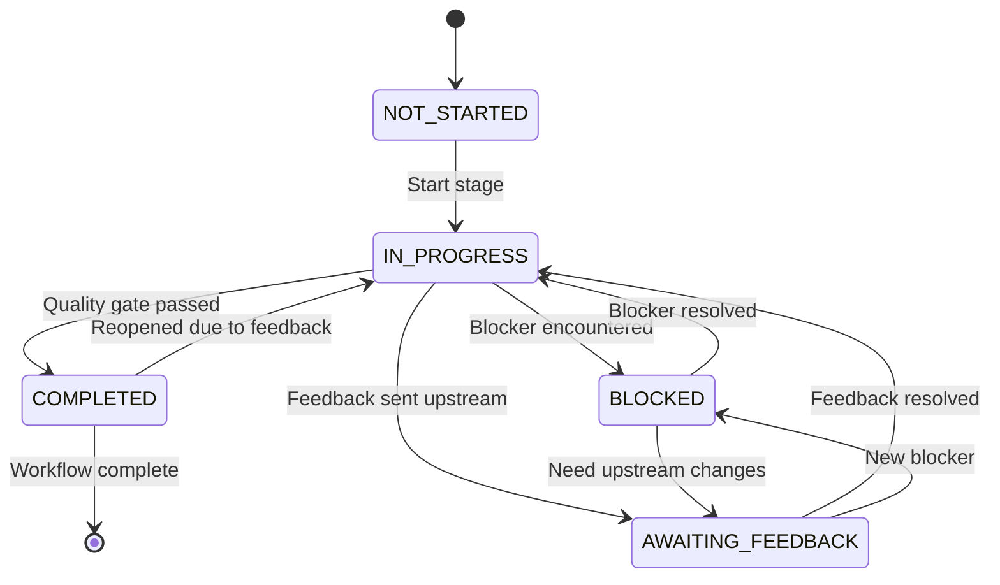
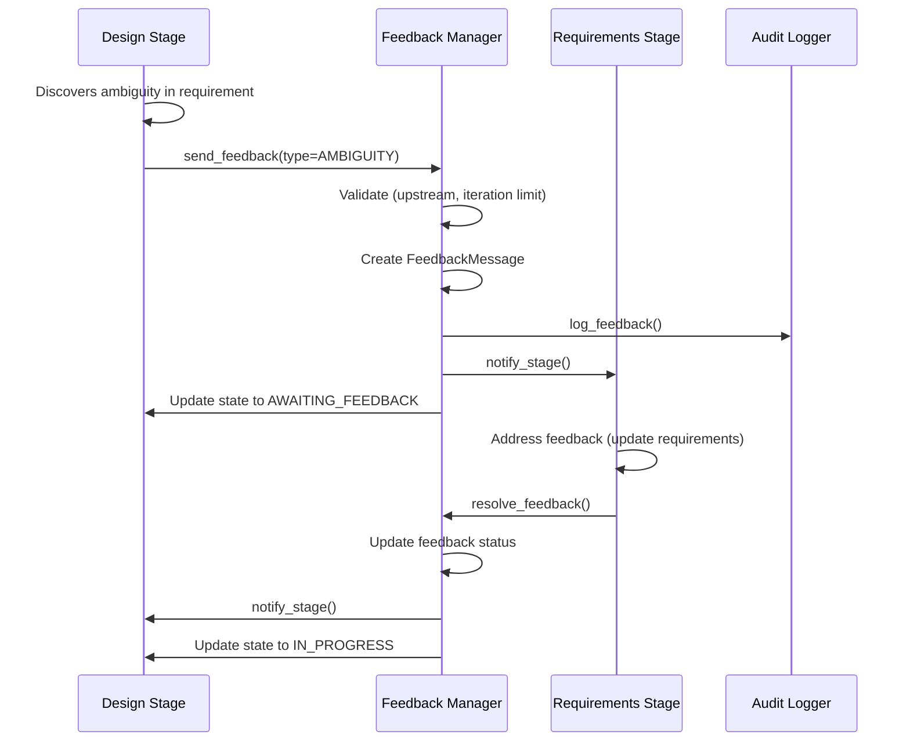

# 7-Stage Workflow - Design Document

**Document Type**: Technical Design Specification
**Project**: ai_sdlc_method (claude_aisdlc solution)
**Version**: 1.0
**Date**: 2025-12-03
**Status**: Draft
**Stage**: Design (Section 5.0)

---

## Requirements Traceability

This design implements the following requirements:

| Requirement | Description | Priority | Maps To |
|-------------|-------------|----------|---------|
| REQ-STAGE-001 | Stage Definitions | Critical | Sections 2, 3, 4 |
| REQ-STAGE-002 | Stage Transitions | High | Sections 5, 6 |
| REQ-STAGE-003 | Signal Transformation | High | Section 7 |
| REQ-STAGE-004 | Bidirectional Feedback | Critical | Section 8 |

**Source**: User-provided requirements for 7-Stage Workflow

---

## Table of Contents

1. [Executive Summary](#1-executive-summary)
2. [Stage Definitions](#2-stage-definitions)
3. [State Machine](#3-state-machine)
4. [Artifact Handoff](#4-artifact-handoff)
5. [Stage Transitions](#5-stage-transitions)
6. [Audit Trail](#6-audit-trail)
7. [Signal Transformation](#7-signal-transformation)
8. [Feedback Protocol](#8-feedback-protocol)
9. [Quality Gates](#9-quality-gates)
10. [Implementation Guidance](#10-implementation-guidance)
11. [Examples](#11-examples)

---

## 1. Executive Summary

### 1.1 Purpose

The 7-Stage Workflow is the **execution engine** of the AI SDLC methodology. It orchestrates the progression of work from intent to production, ensuring traceability, quality, and feedback throughout the lifecycle.

### 1.2 Design Principles

1. **Sequential Execution** - Stages execute in order with explicit handoffs
2. **Bidirectional Feedback** - Any stage can raise issues to upstream stages
3. **Quality Gates** - Each stage has explicit completion criteria
4. **Signal Accumulation** - Each stage adds constraints to the intent signal
5. **Audit Trail** - Every transition is logged with context
6. **Persona Ownership** - Each stage has a responsible persona/agent

### 1.3 Key Design Decisions

| Decision | Rationale | Requirement |
|----------|-----------|-------------|
| State machine model | Clear transitions, formal verification | REQ-STAGE-001, REQ-STAGE-002 |
| File-based artifacts | Version control, human-readable | REQ-STAGE-001 |
| Feedback iteration limit | Prevent infinite loops | REQ-STAGE-004 |
| Signal accumulation | Progressive constraint refinement | REQ-STAGE-003 |
| Quality gate checklist | Explicit completion criteria | REQ-STAGE-001 |

### 1.4 Architecture Overview

```
Intent → [Requirements] → [Design] → [Tasks] → [Code] → [System Test] → [UAT] → [Runtime Feedback]
           ↑                ↑          ↑         ↑          ↑              ↑          ↓
           └────────────────────────── Feedback loops ──────────────────────────────┘
```

---

## 2. Stage Definitions

### 2.1 Stage Schema

Each stage is defined by the following structure:

```yaml
stage:
  id: "requirements"  # Unique stage identifier
  name: "Requirements Stage"
  section: "4.0"  # Section in ai_sdlc_method.md

  # Ownership
  persona:
    role: "Requirements Analyst / Business Analyst"
    agent: "AISDLC Requirements Agent"
    responsibilities:
      - "Transform intent into structured requirements"
      - "Generate unique requirement keys (REQ-*)"
      - "Define acceptance criteria"

  # Inputs
  inputs:
    - artifact_type: "intent"
      format: "yaml"
      location: ".ai-workspace/intents/active/*.yml"
      required: true
      validation:
        - "Valid intent schema"
        - "Intent in 'approved' status"

    - artifact_type: "context"
      format: "markdown"
      location: ".ai-workspace/context/*.md"
      required: false

  # Outputs
  outputs:
    - artifact_type: "requirements"
      format: "markdown"
      location: "docs/requirements/{intent_id}_REQUIREMENTS.md"
      required: true
      contents:
        - "REQ-F-* (functional requirements)"
        - "REQ-NFR-* (non-functional requirements)"
        - "REQ-DATA-* (data quality requirements)"
        - "REQ-BR-* (business rules)"
        - "Acceptance criteria for each REQ"

    - artifact_type: "traceability_map"
      format: "yaml"
      location: "docs/requirements/{intent_id}_TRACEABILITY.yml"
      required: true
      contents:
        - "Intent → Requirements mapping"

  # Quality gate
  quality_gate:
    name: "Requirements Review"
    criteria:
      - id: "QG-REQ-001"
        description: "All acceptance criteria are testable"
        validation: "manual"

      - id: "QG-REQ-002"
        description: "No ambiguous terms (TBD, etc.)"
        validation: "automated"
        script: "scripts/validate_requirements.py"

      - id: "QG-REQ-003"
        description: "All REQ keys are unique"
        validation: "automated"
        script: "scripts/check_req_uniqueness.py"

      - id: "QG-REQ-004"
        description: "Requirements map 100% to intent"
        validation: "manual"

    approvers:
      - role: "Product Owner"
        required: true
      - role: "Technical Lead"
        required: false

  # Signal transformation
  signal:
    input: "Pure intent (what + why)"
    output: "Intent + Requirements (what + why + acceptance criteria)"
    constraints_added:
      - "Functional boundaries (REQ-F-*)"
      - "Non-functional constraints (REQ-NFR-*)"
      - "Data quality rules (REQ-DATA-*)"
      - "Business rules (REQ-BR-*)"
```

### 2.2 Complete Stage Definitions

#### Stage 1: Requirements

```yaml
stage:
  id: "requirements"
  name: "Requirements Stage"
  section: "4.0"

  persona:
    role: "Requirements Analyst"
    agent: "AISDLC Requirements Agent"

  inputs:
    - artifact_type: "intent"
      format: "yaml"
      location: ".ai-workspace/intents/active/*.yml"

  outputs:
    - artifact_type: "requirements"
      location: "docs/requirements/{intent_id}_REQUIREMENTS.md"
    - artifact_type: "traceability_map"
      location: "docs/requirements/{intent_id}_TRACEABILITY.yml"

  quality_gate:
    criteria: ["All acceptance criteria testable", "No ambiguous terms", "100% intent coverage"]

  signal:
    input: "Pure intent (what + why)"
    output: "Intent + Requirements"
```

#### Stage 2: Design

```yaml
stage:
  id: "design"
  name: "Design Stage"
  section: "5.0"

  persona:
    role: "Solution Architect"
    agent: "AISDLC Design Agent"

  inputs:
    - artifact_type: "requirements"
      location: "docs/requirements/{intent_id}_REQUIREMENTS.md"

  outputs:
    - artifact_type: "component_diagrams"
      location: "docs/design/{solution}/diagrams/*.mmd"
    - artifact_type: "api_specs"
      location: "docs/design/{solution}/api/*.yml"
    - artifact_type: "data_models"
      location: "docs/design/{solution}/data/*.md"
    - artifact_type: "adrs"
      location: "docs/design/{solution}/adrs/*.md"
    - artifact_type: "traceability_matrix"
      location: "docs/TRACEABILITY_MATRIX.md"

  quality_gate:
    criteria: ["100% requirement coverage", "Architecture review approved", "Security review approved"]

  signal:
    input: "Intent + Requirements"
    output: "Intent + Requirements + Architecture"
```

#### Stage 3: Tasks

```yaml
stage:
  id: "tasks"
  name: "Tasks Stage"
  section: "6.0"

  persona:
    role: "Project Manager / Scrum Master"
    agent: "AISDLC Tasks Agent"

  inputs:
    - artifact_type: "design"
      location: "docs/design/{solution}/**/*"

  outputs:
    - artifact_type: "work_items"
      location: ".ai-workspace/tasks/active/ACTIVE_TASKS.md"
    - artifact_type: "jira_tickets"
      format: "json"
      location: ".ai-workspace/tasks/jira/*.json"
    - artifact_type: "dependency_graph"
      format: "mermaid"
      location: ".ai-workspace/tasks/DEPENDENCY_GRAPH.mmd"

  quality_gate:
    criteria: ["All design components mapped to tasks", "Dependencies resolved", "Capacity allocated"]

  signal:
    input: "Intent + Requirements + Architecture"
    output: "Intent + Requirements + Architecture + Workload"
```

#### Stage 4: Code

```yaml
stage:
  id: "code"
  name: "Code Stage"
  section: "7.0"

  persona:
    role: "Developer"
    agent: "AISDLC Code Agent"

  inputs:
    - artifact_type: "work_items"
      location: ".ai-workspace/tasks/active/ACTIVE_TASKS.md"
    - artifact_type: "design"
      location: "docs/design/{solution}/**/*"

  outputs:
    - artifact_type: "source_code"
      location: "src/**/*.py"
    - artifact_type: "unit_tests"
      location: "tests/unit/**/*.py"
    - artifact_type: "integration_tests"
      location: "tests/integration/**/*.py"

  quality_gate:
    criteria: ["TDD cycle completed", "Code coverage >= 90%", "All tests passing", "Code review approved"]

  signal:
    input: "Intent + Requirements + Architecture + Workload"
    output: "Intent + Requirements + Architecture + Workload + Implementation"
```

#### Stage 5: System Test

```yaml
stage:
  id: "system_test"
  name: "System Test Stage"
  section: "8.0"

  persona:
    role: "QA Engineer"
    agent: "AISDLC System Test Agent"

  inputs:
    - artifact_type: "deployed_code"
      location: "deployed application"
    - artifact_type: "requirements"
      location: "docs/requirements/{intent_id}_REQUIREMENTS.md"

  outputs:
    - artifact_type: "bdd_features"
      location: "tests/features/*.feature"
    - artifact_type: "step_definitions"
      location: "tests/features/steps/*.py"
    - artifact_type: "test_results"
      location: "tests/reports/*.html"

  quality_gate:
    criteria: ["All BDD scenarios passing", "100% requirement coverage", "No critical bugs"]

  signal:
    input: "Intent + Requirements + Architecture + Workload + Implementation"
    output: "Intent + Requirements + Architecture + Workload + Implementation + Quality"
```

#### Stage 6: UAT

```yaml
stage:
  id: "uat"
  name: "UAT Stage"
  section: "9.0"

  persona:
    role: "Business Stakeholder"
    agent: "AISDLC UAT Agent"

  inputs:
    - artifact_type: "system_test_results"
      location: "tests/reports/*.html"
    - artifact_type: "requirements"
      location: "docs/requirements/{intent_id}_REQUIREMENTS.md"

  outputs:
    - artifact_type: "uat_test_cases"
      location: "tests/uat/*.feature"
    - artifact_type: "business_signoff"
      location: ".ai-workspace/approvals/{intent_id}_UAT.yml"

  quality_gate:
    criteria: ["Business acceptance", "All acceptance criteria met", "Sign-off received"]

  signal:
    input: "Intent + Requirements + Architecture + Workload + Implementation + Quality"
    output: "Intent + Requirements + Architecture + Workload + Implementation + Quality + Business Approval"
```

#### Stage 7: Runtime Feedback

```yaml
stage:
  id: "runtime_feedback"
  name: "Runtime Feedback Stage"
  section: "10.0"

  persona:
    role: "DevOps / SRE"
    agent: "AISDLC Runtime Feedback Agent"

  inputs:
    - artifact_type: "deployment"
      location: "production environment"
    - artifact_type: "requirements"
      location: "docs/requirements/{intent_id}_REQUIREMENTS.md"

  outputs:
    - artifact_type: "release_manifest"
      location: ".ai-workspace/releases/{version}_MANIFEST.yml"
    - artifact_type: "telemetry_config"
      location: "observability/telemetry.yml"
    - artifact_type: "alerts"
      location: "observability/alerts.yml"
    - artifact_type: "new_intents"
      location: ".ai-workspace/intents/eco/*.yml"

  quality_gate:
    criteria: ["Telemetry configured", "Alerts enabled", "Rollback plan documented"]

  signal:
    input: "Intent + Requirements + Architecture + Workload + Implementation + Quality + Business Approval"
    output: "Intent + Requirements + Architecture + Workload + Implementation + Quality + Business Approval + Operations"
```

---

## 3. State Machine

### 3.1 State Definitions

Each stage can be in one of the following states:

```yaml
states:
  NOT_STARTED:
    description: "Stage has not been entered"
    allowed_transitions:
      - IN_PROGRESS
    color: "#gray"

  IN_PROGRESS:
    description: "Stage is actively being worked on"
    allowed_transitions:
      - COMPLETED
      - BLOCKED
      - AWAITING_FEEDBACK
    color: "#yellow"

  AWAITING_FEEDBACK:
    description: "Waiting for upstream stage to address feedback"
    allowed_transitions:
      - IN_PROGRESS
      - BLOCKED
    color: "#orange"

  BLOCKED:
    description: "Stage cannot proceed due to blocker"
    allowed_transitions:
      - IN_PROGRESS
      - AWAITING_FEEDBACK
    color: "#red"
    metadata_required:
      - blocker_reason: "Description of what is blocking progress"
      - blocker_owner: "Who is responsible for resolving"

  COMPLETED:
    description: "Stage has met all quality gate criteria"
    allowed_transitions:
      - IN_PROGRESS  # Re-open due to feedback
    color: "#green"
    metadata_required:
      - completed_by: "Persona who completed"
      - approved_by: "Persona who approved"
      - completion_timestamp: "ISO 8601 timestamp"
```

### 3.2 State Machine Diagram



### 3.3 Transition Guards

Each transition has conditions that must be met:

```python
class TransitionGuard:
    """Guards for state transitions"""

    @staticmethod
    def can_start(stage: Stage, context: WorkflowContext) -> tuple[bool, str]:
        """Check if stage can transition to IN_PROGRESS"""
        # Previous stage must be completed (or this is first stage)
        if stage.index > 0:
            prev_stage = context.stages[stage.index - 1]
            if prev_stage.state != StageState.COMPLETED:
                return False, f"Previous stage '{prev_stage.name}' not completed"

        # Required input artifacts must exist
        for input_artifact in stage.inputs:
            if input_artifact.required and not input_artifact.exists():
                return False, f"Required artifact '{input_artifact.type}' not found"

        return True, "OK"

    @staticmethod
    def can_complete(stage: Stage, context: WorkflowContext) -> tuple[bool, str]:
        """Check if stage can transition to COMPLETED"""
        # All output artifacts must exist
        for output_artifact in stage.outputs:
            if output_artifact.required and not output_artifact.exists():
                return False, f"Required output '{output_artifact.type}' not generated"

        # Quality gate criteria must be met
        for criterion in stage.quality_gate.criteria:
            if not criterion.is_met():
                return False, f"Quality gate criterion '{criterion.id}' not met"

        # Required approvals must be obtained
        for approver in stage.quality_gate.approvers:
            if approver.required and not approver.has_approved():
                return False, f"Approval from '{approver.role}' required"

        return True, "OK"

    @staticmethod
    def can_send_feedback(stage: Stage, context: WorkflowContext) -> tuple[bool, str]:
        """Check if stage can send feedback upstream"""
        # Must be in progress
        if stage.state != StageState.IN_PROGRESS:
            return False, "Stage must be IN_PROGRESS to send feedback"

        # Feedback iteration limit not exceeded
        if stage.feedback_iterations >= context.config.max_feedback_iterations:
            return False, f"Max feedback iterations ({context.config.max_feedback_iterations}) exceeded"

        return True, "OK"

    @staticmethod
    def can_reopen(stage: Stage, context: WorkflowContext) -> tuple[bool, str]:
        """Check if completed stage can be reopened"""
        # Must be completed
        if stage.state != StageState.COMPLETED:
            return False, "Only completed stages can be reopened"

        # Must have feedback from downstream
        if not stage.has_pending_feedback():
            return False, "No feedback to address"

        return True, "OK"
```

### 3.4 Stage Workflow State

The overall workflow state is tracked in a YAML file:

```yaml
# .ai-workspace/workflow/STATE.yml

workflow:
  id: "WF-20251203-001"
  intent_id: "INT-20251203-001"
  created_at: "2025-12-03T14:32:15Z"
  updated_at: "2025-12-03T16:45:22Z"

  status: "in_progress"  # not_started | in_progress | completed | failed

  stages:
    - stage_id: "requirements"
      state: "COMPLETED"
      started_at: "2025-12-03T14:32:15Z"
      completed_at: "2025-12-03T15:10:30Z"
      completed_by: "requirements_agent"
      approved_by: "product_owner@company.com"
      feedback_iterations: 0

      artifacts:
        outputs:
          - type: "requirements"
            path: "docs/requirements/INT-20251203-001_REQUIREMENTS.md"
            created_at: "2025-12-03T15:08:12Z"
            checksum: "sha256:abc123..."

    - stage_id: "design"
      state: "IN_PROGRESS"
      started_at: "2025-12-03T15:15:45Z"
      completed_at: null
      feedback_iterations: 1

      blockers: []

      artifacts:
        outputs:
          - type: "component_diagrams"
            path: "docs/design/claude_aisdlc/diagrams/workflow.mmd"
            created_at: "2025-12-03T16:42:10Z"

    - stage_id: "tasks"
      state: "NOT_STARTED"
      started_at: null
      completed_at: null
      feedback_iterations: 0

    # ... remaining stages

  feedback:
    - feedback_id: "FB-20251203-001"
      from_stage: "design"
      to_stage: "requirements"
      type: "ambiguity"
      description: "REQ-NFR-PERF-001 doesn't specify acceptable latency"
      status: "resolved"
      created_at: "2025-12-03T16:20:15Z"
      resolved_at: "2025-12-03T16:35:42Z"
```

---

## 4. Artifact Handoff

### 4.1 Handoff Data Structure

When a stage completes, it hands off artifacts to the next stage:

```python
from dataclasses import dataclass
from typing import List, Dict, Any
from datetime import datetime
from pathlib import Path

@dataclass
class Artifact:
    """An artifact produced or consumed by a stage"""

    type: str  # e.g., "requirements", "design", "code"
    format: str  # e.g., "markdown", "yaml", "python"
    path: Path
    checksum: str  # SHA-256 hash for verification
    created_at: datetime
    metadata: Dict[str, Any]

    def exists(self) -> bool:
        """Check if artifact file exists"""
        return self.path.exists()

    def validate_checksum(self) -> bool:
        """Verify artifact hasn't been modified"""
        import hashlib
        current_hash = hashlib.sha256(self.path.read_bytes()).hexdigest()
        return current_hash == self.checksum


@dataclass
class Handoff:
    """Artifact handoff between stages"""

    handoff_id: str  # e.g., "HO-20251203-001"
    from_stage: str
    to_stage: str
    timestamp: datetime

    # Artifacts being handed off
    artifacts: List[Artifact]

    # Context preservation
    context: Dict[str, Any]  # Accumulated context from all previous stages

    # Validation results
    validation_passed: bool
    validation_errors: List[str]

    # Requirement traceability
    requirement_coverage: Dict[str, List[str]]  # REQ-ID -> [artifact paths]

    # Metadata
    metadata: Dict[str, Any]

    def to_yaml(self) -> str:
        """Serialize handoff to YAML"""
        import yaml
        data = {
            'handoff_id': self.handoff_id,
            'from_stage': self.from_stage,
            'to_stage': self.to_stage,
            'timestamp': self.timestamp.isoformat(),
            'artifacts': [
                {
                    'type': a.type,
                    'format': a.format,
                    'path': str(a.path),
                    'checksum': a.checksum,
                    'created_at': a.created_at.isoformat(),
                    'metadata': a.metadata
                }
                for a in self.artifacts
            ],
            'context': self.context,
            'validation_passed': self.validation_passed,
            'validation_errors': self.validation_errors,
            'requirement_coverage': self.requirement_coverage,
            'metadata': self.metadata
        }
        return yaml.dump(data, default_flow_style=False)
```

### 4.2 Handoff Process

```python
class HandoffManager:
    """Manages artifact handoff between stages"""

    def __init__(self, config: WorkflowConfig):
        self.config = config
        self.handoff_dir = Path(".ai-workspace/workflow/handoffs")
        self.handoff_dir.mkdir(parents=True, exist_ok=True)

    def create_handoff(
        self,
        from_stage: Stage,
        to_stage: Stage,
        context: WorkflowContext
    ) -> Handoff:
        """Create handoff package for next stage"""

        # Generate handoff ID
        handoff_id = f"HO-{datetime.now().strftime('%Y%m%d')}-{self._next_sequence()}"

        # Collect output artifacts from source stage
        artifacts = []
        for output_spec in from_stage.outputs:
            if output_spec.exists():
                artifact = self._create_artifact(output_spec)
                artifacts.append(artifact)

        # Accumulate context
        accumulated_context = self._accumulate_context(from_stage, context)

        # Validate handoff
        validation_passed, errors = self._validate_handoff(
            from_stage, to_stage, artifacts, accumulated_context
        )

        # Build requirement coverage map
        req_coverage = self._build_requirement_coverage(artifacts)

        # Create handoff
        handoff = Handoff(
            handoff_id=handoff_id,
            from_stage=from_stage.id,
            to_stage=to_stage.id,
            timestamp=datetime.now(),
            artifacts=artifacts,
            context=accumulated_context,
            validation_passed=validation_passed,
            validation_errors=errors,
            requirement_coverage=req_coverage,
            metadata={
                'from_stage_completed_at': from_stage.completed_at,
                'from_stage_completed_by': from_stage.completed_by
            }
        )

        # Persist handoff
        handoff_path = self.handoff_dir / f"{handoff_id}.yml"
        handoff_path.write_text(handoff.to_yaml())

        # Log handoff
        self._log_handoff(handoff)

        return handoff

    def _accumulate_context(
        self,
        current_stage: Stage,
        context: WorkflowContext
    ) -> Dict[str, Any]:
        """Accumulate context from all previous stages"""

        accumulated = {
            'intent': context.intent,
            'workflow_id': context.workflow_id,
            'stages_completed': []
        }

        # Add context from each completed stage
        for stage in context.stages:
            if stage.state == StageState.COMPLETED:
                accumulated['stages_completed'].append({
                    'stage_id': stage.id,
                    'completed_at': stage.completed_at,
                    'artifacts': [str(a.path) for a in stage.output_artifacts],
                    'signal_output': stage.signal.output,
                    'constraints_added': stage.signal.constraints_added
                })

            if stage.id == current_stage.id:
                break  # Don't include stages after current

        return accumulated

    def _validate_handoff(
        self,
        from_stage: Stage,
        to_stage: Stage,
        artifacts: List[Artifact],
        context: Dict[str, Any]
    ) -> tuple[bool, List[str]]:
        """Validate handoff package"""

        errors = []

        # Check all required outputs exist
        for output_spec in from_stage.outputs:
            if output_spec.required:
                matching = [a for a in artifacts if a.type == output_spec.type]
                if not matching:
                    errors.append(f"Required output '{output_spec.type}' not found")

        # Check artifacts match next stage inputs
        for input_spec in to_stage.inputs:
            if input_spec.required:
                matching = [a for a in artifacts if a.type == input_spec.artifact_type]
                if not matching:
                    errors.append(f"Required input '{input_spec.artifact_type}' not provided")

        # Validate artifact checksums
        for artifact in artifacts:
            if not artifact.validate_checksum():
                errors.append(f"Artifact '{artifact.path}' checksum mismatch")

        return len(errors) == 0, errors

    def _build_requirement_coverage(
        self,
        artifacts: List[Artifact]
    ) -> Dict[str, List[str]]:
        """Build map of requirements to artifacts that implement them"""

        coverage = {}

        for artifact in artifacts:
            # Extract REQ-* tags from artifact
            req_tags = self._extract_requirement_tags(artifact)

            for req_id in req_tags:
                if req_id not in coverage:
                    coverage[req_id] = []
                coverage[req_id].append(str(artifact.path))

        return coverage

    def _extract_requirement_tags(self, artifact: Artifact) -> List[str]:
        """Extract REQ-* tags from artifact content"""
        import re

        # Read artifact content
        content = artifact.path.read_text()

        # Find all REQ-* patterns
        pattern = r'REQ-[A-Z]+-[A-Z0-9]+-\d{3}'
        matches = re.findall(pattern, content)

        return list(set(matches))  # Deduplicate
```

### 4.3 Handoff Validation

Each handoff is validated before acceptance:

```python
class HandoffValidator:
    """Validates handoff packages"""

    def validate(self, handoff: Handoff) -> tuple[bool, List[str]]:
        """Comprehensive handoff validation"""

        errors = []

        # 1. Artifact existence
        for artifact in handoff.artifacts:
            if not artifact.exists():
                errors.append(f"Artifact not found: {artifact.path}")

        # 2. Artifact integrity (checksums)
        for artifact in handoff.artifacts:
            if not artifact.validate_checksum():
                errors.append(f"Artifact corrupted: {artifact.path}")

        # 3. Context completeness
        required_context_keys = ['intent', 'workflow_id', 'stages_completed']
        for key in required_context_keys:
            if key not in handoff.context:
                errors.append(f"Missing context key: {key}")

        # 4. Requirement coverage
        # Ensure no requirements are "lost" in transition
        if handoff.from_stage != 'requirements':
            # Get requirements from context
            intent = handoff.context.get('intent', {})
            # Verify all requirements are tracked
            # (Implementation depends on intent structure)

        return len(errors) == 0, errors
```

---

## 5. Stage Transitions

### 5.1 Transition Types

```python
from enum import Enum

class TransitionType(Enum):
    """Types of stage transitions"""

    # Forward transitions (happy path)
    START = "start"  # NOT_STARTED → IN_PROGRESS
    COMPLETE = "complete"  # IN_PROGRESS → COMPLETED

    # Problem transitions
    BLOCK = "block"  # IN_PROGRESS → BLOCKED
    UNBLOCK = "unblock"  # BLOCKED → IN_PROGRESS

    # Feedback transitions
    SEND_FEEDBACK = "send_feedback"  # IN_PROGRESS → AWAITING_FEEDBACK
    RECEIVE_FEEDBACK = "receive_feedback"  # AWAITING_FEEDBACK → IN_PROGRESS

    # Reopening
    REOPEN = "reopen"  # COMPLETED → IN_PROGRESS (due to feedback)
```

### 5.2 Transition Algorithm

```python
class StageTransitionManager:
    """Manages stage state transitions"""

    def __init__(self, config: WorkflowConfig):
        self.config = config
        self.audit_logger = AuditLogger()

    def transition(
        self,
        stage: Stage,
        transition_type: TransitionType,
        context: WorkflowContext,
        reason: str = "",
        metadata: Dict[str, Any] = None
    ) -> tuple[bool, str]:
        """Execute a stage transition"""

        # Get target state
        target_state = self._get_target_state(stage.state, transition_type)

        # Check transition is allowed
        if target_state not in self._allowed_transitions(stage.state):
            return False, f"Transition {transition_type} not allowed from {stage.state}"

        # Check transition guards
        guard_passed, guard_msg = self._check_guards(
            stage, transition_type, context
        )
        if not guard_passed:
            return False, guard_msg

        # Execute pre-transition hooks
        self._execute_pre_hooks(stage, transition_type, context)

        # Perform transition
        old_state = stage.state
        stage.state = target_state
        stage.updated_at = datetime.now()

        # Update transition-specific metadata
        if transition_type == TransitionType.START:
            stage.started_at = datetime.now()
        elif transition_type == TransitionType.COMPLETE:
            stage.completed_at = datetime.now()
            stage.completed_by = context.current_user
        elif transition_type == TransitionType.BLOCK:
            stage.blockers.append({
                'reason': reason,
                'created_at': datetime.now(),
                'owner': metadata.get('blocker_owner', 'unassigned')
            })

        # Log transition
        self.audit_logger.log_transition(
            stage=stage,
            from_state=old_state,
            to_state=target_state,
            transition_type=transition_type,
            reason=reason,
            metadata=metadata
        )

        # Execute post-transition hooks
        self._execute_post_hooks(stage, transition_type, context)

        # Persist workflow state
        self._persist_state(context)

        return True, "Transition successful"

    def _check_guards(
        self,
        stage: Stage,
        transition_type: TransitionType,
        context: WorkflowContext
    ) -> tuple[bool, str]:
        """Check transition guards"""

        if transition_type == TransitionType.START:
            return TransitionGuard.can_start(stage, context)

        elif transition_type == TransitionType.COMPLETE:
            return TransitionGuard.can_complete(stage, context)

        elif transition_type == TransitionType.SEND_FEEDBACK:
            return TransitionGuard.can_send_feedback(stage, context)

        elif transition_type == TransitionType.REOPEN:
            return TransitionGuard.can_reopen(stage, context)

        return True, "OK"

    def _execute_pre_hooks(
        self,
        stage: Stage,
        transition_type: TransitionType,
        context: WorkflowContext
    ):
        """Execute pre-transition hooks"""
        # Hook implementation (notify agents, update external systems, etc.)
        pass

    def _execute_post_hooks(
        self,
        stage: Stage,
        transition_type: TransitionType,
        context: WorkflowContext
    ):
        """Execute post-transition hooks"""

        # If completing a stage, create handoff to next stage
        if transition_type == TransitionType.COMPLETE:
            next_stage = self._get_next_stage(stage, context)
            if next_stage:
                handoff_manager = HandoffManager(self.config)
                handoff_manager.create_handoff(stage, next_stage, context)

        # If sending feedback, notify upstream stage
        if transition_type == TransitionType.SEND_FEEDBACK:
            # Implementation for feedback notification
            pass
```

### 5.3 Transition Validation Rules

```yaml
# Transition validation rules
transition_rules:

  # Starting a stage
  start:
    preconditions:
      - "Previous stage is COMPLETED or this is first stage"
      - "All required input artifacts exist"
      - "Stage is in NOT_STARTED state"
    postconditions:
      - "Stage is in IN_PROGRESS state"
      - "started_at timestamp is set"

  # Completing a stage
  complete:
    preconditions:
      - "Stage is in IN_PROGRESS state"
      - "All required output artifacts exist"
      - "All quality gate criteria met"
      - "All required approvals obtained"
    postconditions:
      - "Stage is in COMPLETED state"
      - "completed_at timestamp is set"
      - "completed_by is set"
      - "Handoff to next stage created"

  # Blocking a stage
  block:
    preconditions:
      - "Stage is in IN_PROGRESS or AWAITING_FEEDBACK state"
      - "blocker_reason provided"
    postconditions:
      - "Stage is in BLOCKED state"
      - "Blocker added to stage.blockers list"

  # Unblocking a stage
  unblock:
    preconditions:
      - "Stage is in BLOCKED state"
      - "Blocker has been resolved"
    postconditions:
      - "Stage is in IN_PROGRESS state"
      - "Blocker marked as resolved"

  # Sending feedback
  send_feedback:
    preconditions:
      - "Stage is in IN_PROGRESS state"
      - "Feedback iteration limit not exceeded"
      - "Target stage is upstream"
    postconditions:
      - "Stage is in AWAITING_FEEDBACK state"
      - "Feedback message created"
      - "Target stage notified"
      - "feedback_iterations incremented"

  # Receiving feedback resolution
  receive_feedback:
    preconditions:
      - "Stage is in AWAITING_FEEDBACK state"
      - "Upstream stage has addressed feedback"
    postconditions:
      - "Stage is in IN_PROGRESS state"
      - "Feedback marked as resolved"

  # Reopening completed stage
  reopen:
    preconditions:
      - "Stage is in COMPLETED state"
      - "Feedback received from downstream stage"
    postconditions:
      - "Stage is in IN_PROGRESS state"
      - "Reason for reopening logged"
```

---

## 6. Audit Trail

### 6.1 Audit Log Schema

```python
from dataclasses import dataclass
from datetime import datetime
from typing import Dict, Any, Optional

@dataclass
class AuditLogEntry:
    """Single audit log entry"""

    # Identity
    entry_id: str  # e.g., "AUDIT-20251203-001"
    timestamp: datetime

    # What happened
    event_type: str  # "transition" | "feedback" | "quality_gate" | "handoff"
    action: str  # "start_stage" | "complete_stage" | "send_feedback" | etc.

    # Where
    workflow_id: str
    stage_id: str

    # State change
    from_state: Optional[str]  # Previous state (for transitions)
    to_state: Optional[str]  # New state (for transitions)

    # Who
    actor: str  # User or agent who triggered the action
    actor_type: str  # "human" | "agent"

    # Why
    reason: str  # Human-readable reason

    # Context
    artifacts_affected: List[str]  # Paths to affected artifacts
    metadata: Dict[str, Any]  # Additional context

    # Traceability
    related_entries: List[str]  # Related audit entry IDs
    requirement_tags: List[str]  # REQ-* tags involved


class AuditLogger:
    """Centralized audit logging"""

    def __init__(self):
        self.log_dir = Path(".ai-workspace/workflow/audit")
        self.log_dir.mkdir(parents=True, exist_ok=True)

        # Current log file (rotates daily)
        self.log_file = self.log_dir / f"audit_{datetime.now().strftime('%Y%m%d')}.jsonl"

    def log_transition(
        self,
        stage: Stage,
        from_state: StageState,
        to_state: StageState,
        transition_type: TransitionType,
        reason: str,
        metadata: Dict[str, Any]
    ):
        """Log a stage transition"""

        entry = AuditLogEntry(
            entry_id=self._generate_id(),
            timestamp=datetime.now(),
            event_type="transition",
            action=f"{transition_type.value}_stage",
            workflow_id=stage.workflow_id,
            stage_id=stage.id,
            from_state=from_state.value,
            to_state=to_state.value,
            actor=metadata.get('actor', 'system'),
            actor_type=metadata.get('actor_type', 'agent'),
            reason=reason,
            artifacts_affected=[str(a.path) for a in stage.output_artifacts],
            metadata=metadata,
            related_entries=[],
            requirement_tags=[]
        )

        self._write_entry(entry)

    def log_feedback(
        self,
        feedback: FeedbackMessage,
        context: WorkflowContext
    ):
        """Log feedback sent between stages"""

        entry = AuditLogEntry(
            entry_id=self._generate_id(),
            timestamp=datetime.now(),
            event_type="feedback",
            action="send_feedback",
            workflow_id=context.workflow_id,
            stage_id=feedback.from_stage,
            from_state=None,
            to_state=None,
            actor=feedback.author,
            actor_type="agent",
            reason=feedback.description,
            artifacts_affected=[],
            metadata={
                'feedback_id': feedback.feedback_id,
                'feedback_type': feedback.type.value,
                'to_stage': feedback.to_stage,
                'severity': feedback.severity
            },
            related_entries=[],
            requirement_tags=feedback.requirement_tags
        )

        self._write_entry(entry)

    def log_quality_gate(
        self,
        stage: Stage,
        criterion: QualityGateCriterion,
        passed: bool,
        details: str
    ):
        """Log quality gate check"""

        entry = AuditLogEntry(
            entry_id=self._generate_id(),
            timestamp=datetime.now(),
            event_type="quality_gate",
            action="check_criterion",
            workflow_id=stage.workflow_id,
            stage_id=stage.id,
            from_state=None,
            to_state=None,
            actor="quality_gate_validator",
            actor_type="system",
            reason=f"Quality gate check: {criterion.description}",
            artifacts_affected=[],
            metadata={
                'criterion_id': criterion.id,
                'passed': passed,
                'details': details
            },
            related_entries=[],
            requirement_tags=[]
        )

        self._write_entry(entry)

    def log_handoff(
        self,
        handoff: Handoff
    ):
        """Log artifact handoff"""

        entry = AuditLogEntry(
            entry_id=self._generate_id(),
            timestamp=datetime.now(),
            event_type="handoff",
            action="create_handoff",
            workflow_id=handoff.metadata.get('workflow_id', 'unknown'),
            stage_id=handoff.from_stage,
            from_state=None,
            to_state=None,
            actor="handoff_manager",
            actor_type="system",
            reason=f"Handoff from {handoff.from_stage} to {handoff.to_stage}",
            artifacts_affected=[str(a.path) for a in handoff.artifacts],
            metadata={
                'handoff_id': handoff.handoff_id,
                'to_stage': handoff.to_stage,
                'validation_passed': handoff.validation_passed,
                'validation_errors': handoff.validation_errors
            },
            related_entries=[],
            requirement_tags=list(handoff.requirement_coverage.keys())
        )

        self._write_entry(entry)

    def _write_entry(self, entry: AuditLogEntry):
        """Write entry to log file"""
        import json

        # Convert to JSON
        entry_dict = {
            'entry_id': entry.entry_id,
            'timestamp': entry.timestamp.isoformat(),
            'event_type': entry.event_type,
            'action': entry.action,
            'workflow_id': entry.workflow_id,
            'stage_id': entry.stage_id,
            'from_state': entry.from_state,
            'to_state': entry.to_state,
            'actor': entry.actor,
            'actor_type': entry.actor_type,
            'reason': entry.reason,
            'artifacts_affected': entry.artifacts_affected,
            'metadata': entry.metadata,
            'related_entries': entry.related_entries,
            'requirement_tags': entry.requirement_tags
        }

        # Append to log file (JSONL format)
        with open(self.log_file, 'a') as f:
            f.write(json.dumps(entry_dict) + '\n')

    def query(
        self,
        workflow_id: Optional[str] = None,
        stage_id: Optional[str] = None,
        event_type: Optional[str] = None,
        start_date: Optional[datetime] = None,
        end_date: Optional[datetime] = None
    ) -> List[AuditLogEntry]:
        """Query audit logs"""
        # Implementation for querying logs
        # Returns filtered list of audit entries
        pass
```

### 6.2 Audit Log Storage

```
.ai-workspace/workflow/audit/
├── audit_20251203.jsonl      # Daily log file (JSONL format)
├── audit_20251202.jsonl
├── audit_20251201.jsonl
└── index.db                   # SQLite index for fast queries
```

### 6.3 Audit Query Examples

```python
# Query all transitions for a workflow
audit_logger.query(
    workflow_id="WF-20251203-001",
    event_type="transition"
)

# Query feedback sent to Requirements stage
audit_logger.query(
    stage_id="requirements",
    event_type="feedback"
)

# Query quality gate failures
audit_logger.query(
    event_type="quality_gate",
    metadata={'passed': False}
)
```

---

## 7. Signal Transformation

### 7.1 Signal Accumulation Model

As the intent flows through stages, each stage adds constraints to the signal:

```python
from dataclasses import dataclass
from typing import List, Dict, Any

@dataclass
class Signal:
    """Signal representing accumulated constraints from all stages"""

    # Core intent (immutable)
    intent_id: str
    intent_title: str
    intent_description: str

    # Accumulated constraints (grows at each stage)
    constraints: Dict[str, Any]

    # Transformation history
    transformations: List[Dict[str, Any]]

    def add_stage_constraints(
        self,
        stage_id: str,
        constraints_added: Dict[str, Any]
    ):
        """Add constraints from a stage"""

        # Merge new constraints
        for key, value in constraints_added.items():
            if key not in self.constraints:
                self.constraints[key] = value
            elif isinstance(value, list):
                # Append to list
                self.constraints[key].extend(value)
            elif isinstance(value, dict):
                # Merge dicts
                self.constraints[key].update(value)
            else:
                # Overwrite
                self.constraints[key] = value

        # Record transformation
        self.transformations.append({
            'stage': stage_id,
            'timestamp': datetime.now().isoformat(),
            'constraints_added': constraints_added
        })


class SignalTransformer:
    """Transforms signal as it flows through stages"""

    def transform(
        self,
        signal: Signal,
        stage: Stage,
        artifacts: List[Artifact]
    ) -> Signal:
        """Transform signal by adding stage-specific constraints"""

        # Extract constraints from stage artifacts
        constraints_added = self._extract_constraints(stage, artifacts)

        # Add constraints to signal
        signal.add_stage_constraints(stage.id, constraints_added)

        return signal

    def _extract_constraints(
        self,
        stage: Stage,
        artifacts: List[Artifact]
    ) -> Dict[str, Any]:
        """Extract constraints added by this stage"""

        if stage.id == "requirements":
            return self._extract_requirements_constraints(artifacts)

        elif stage.id == "design":
            return self._extract_design_constraints(artifacts)

        elif stage.id == "tasks":
            return self._extract_tasks_constraints(artifacts)

        elif stage.id == "code":
            return self._extract_code_constraints(artifacts)

        elif stage.id == "system_test":
            return self._extract_test_constraints(artifacts)

        elif stage.id == "uat":
            return self._extract_uat_constraints(artifacts)

        elif stage.id == "runtime_feedback":
            return self._extract_runtime_constraints(artifacts)

        return {}

    def _extract_requirements_constraints(
        self,
        artifacts: List[Artifact]
    ) -> Dict[str, Any]:
        """Extract constraints from Requirements stage"""

        constraints = {
            'functional_requirements': [],
            'nonfunctional_requirements': [],
            'data_quality_requirements': [],
            'business_rules': [],
            'acceptance_criteria': {}
        }

        # Parse requirements document
        for artifact in artifacts:
            if artifact.type == "requirements":
                content = artifact.path.read_text()

                # Extract REQ-F-* (functional)
                import re
                req_f_pattern = r'(REQ-F-[A-Z]+-\d{3}): (.+?)(?=\n\n|\n#|$)'
                for match in re.finditer(req_f_pattern, content, re.DOTALL):
                    req_id, req_text = match.groups()
                    constraints['functional_requirements'].append({
                        'id': req_id,
                        'text': req_text.strip()
                    })

                # Extract REQ-NFR-* (non-functional)
                req_nfr_pattern = r'(REQ-NFR-[A-Z]+-\d{3}): (.+?)(?=\n\n|\n#|$)'
                for match in re.finditer(req_nfr_pattern, content, re.DOTALL):
                    req_id, req_text = match.groups()
                    constraints['nonfunctional_requirements'].append({
                        'id': req_id,
                        'text': req_text.strip()
                    })

                # Similar for REQ-DATA-*, REQ-BR-*

        return constraints

    def _extract_design_constraints(
        self,
        artifacts: List[Artifact]
    ) -> Dict[str, Any]:
        """Extract constraints from Design stage"""

        constraints = {
            'components': [],
            'apis': [],
            'data_models': [],
            'architecture_decisions': []
        }

        # Parse component diagrams, API specs, data models, ADRs
        for artifact in artifacts:
            if artifact.type == "component_diagrams":
                # Extract components from Mermaid diagrams
                pass

            elif artifact.type == "api_specs":
                # Extract API endpoints from OpenAPI specs
                pass

            elif artifact.type == "data_models":
                # Extract data entities and relationships
                pass

            elif artifact.type == "adrs":
                # Extract architecture decisions
                pass

        return constraints

    def _extract_tasks_constraints(
        self,
        artifacts: List[Artifact]
    ) -> Dict[str, Any]:
        """Extract constraints from Tasks stage"""

        constraints = {
            'work_items': [],
            'dependencies': [],
            'sprint_allocation': {}
        }

        # Parse work items, dependency graph
        # ...

        return constraints

    def _extract_code_constraints(
        self,
        artifacts: List[Artifact]
    ) -> Dict[str, Any]:
        """Extract constraints from Code stage"""

        constraints = {
            'modules': [],
            'classes': [],
            'functions': [],
            'test_coverage': {},
            'coding_standards': []
        }

        # Parse source code, tests
        # ...

        return constraints

    def _extract_test_constraints(
        self,
        artifacts: List[Artifact]
    ) -> Dict[str, Any]:
        """Extract constraints from System Test stage"""

        constraints = {
            'test_scenarios': [],
            'test_results': {},
            'bugs_found': [],
            'quality_metrics': {}
        }

        # Parse BDD features, test results
        # ...

        return constraints

    def _extract_uat_constraints(
        self,
        artifacts: List[Artifact]
    ) -> Dict[str, Any]:
        """Extract constraints from UAT stage"""

        constraints = {
            'uat_test_cases': [],
            'business_approval': {},
            'sign_off': {}
        }

        # Parse UAT test cases, sign-off documents
        # ...

        return constraints

    def _extract_runtime_constraints(
        self,
        artifacts: List[Artifact]
    ) -> Dict[str, Any]:
        """Extract constraints from Runtime Feedback stage"""

        constraints = {
            'deployment_info': {},
            'telemetry_config': {},
            'alerts': [],
            'incidents': [],
            'new_intents_generated': []
        }

        # Parse release manifests, telemetry config, alerts
        # ...

        return constraints
```

### 7.2 Signal Visualization

```python
class SignalVisualizer:
    """Visualize signal transformation across stages"""

    def generate_diagram(self, signal: Signal) -> str:
        """Generate Mermaid diagram showing signal transformation"""

        mermaid = ["graph LR"]
        mermaid.append(f"    INTENT[Intent: {signal.intent_title}]")

        prev_node = "INTENT"
        for i, transformation in enumerate(signal.transformations):
            stage = transformation['stage']
            node = f"STAGE{i}"

            # Add stage node
            mermaid.append(f"    {node}[{stage.upper()}]")

            # Add edge with constraints
            constraints = transformation['constraints_added']
            edge_label = ", ".join(constraints.keys())
            mermaid.append(f"    {prev_node} -->|{edge_label}| {node}")

            prev_node = node

        return "\n".join(mermaid)
```

Example output:

```mermaid
graph LR
    INTENT[Intent: Add user authentication]
    STAGE0[REQUIREMENTS]
    STAGE1[DESIGN]
    STAGE2[TASKS]
    STAGE3[CODE]
    STAGE4[SYSTEM_TEST]
    STAGE5[UAT]
    STAGE6[RUNTIME_FEEDBACK]

    INTENT -->|Intent| STAGE0
    STAGE0 -->|Requirements, Acceptance Criteria| STAGE1
    STAGE1 -->|Architecture, APIs, Data Models| STAGE2
    STAGE2 -->|Work Items, Dependencies| STAGE3
    STAGE3 -->|Code, Tests| STAGE4
    STAGE4 -->|Test Results, Quality Metrics| STAGE5
    STAGE5 -->|Business Approval| STAGE6
    STAGE6 -->|Deployment, Telemetry| END[Production]
```



### 7.3 Signal Validation

```python
class SignalValidator:
    """Validate signal constraints"""

    def validate(self, signal: Signal, stage: Stage) -> tuple[bool, List[str]]:
        """Validate signal has required constraints for this stage"""

        errors = []

        # Check required constraints for this stage
        required_constraints = self._get_required_constraints(stage)

        for constraint_key in required_constraints:
            if constraint_key not in signal.constraints:
                errors.append(f"Missing required constraint: {constraint_key}")
            elif not signal.constraints[constraint_key]:
                errors.append(f"Empty constraint: {constraint_key}")

        return len(errors) == 0, errors

    def _get_required_constraints(self, stage: Stage) -> List[str]:
        """Get required constraints for this stage"""

        requirements = {
            'requirements': [],
            'design': ['functional_requirements', 'nonfunctional_requirements'],
            'tasks': ['functional_requirements', 'nonfunctional_requirements', 'components', 'apis'],
            'code': ['functional_requirements', 'components', 'apis', 'work_items'],
            'system_test': ['functional_requirements', 'code', 'tests'],
            'uat': ['functional_requirements', 'test_results'],
            'runtime_feedback': ['business_approval', 'deployment_info']
        }

        return requirements.get(stage.id, [])
```

---

## 8. Feedback Protocol

### 8.1 Feedback Message Schema

```python
from enum import Enum
from dataclasses import dataclass
from typing import List, Optional
from datetime import datetime

class FeedbackType(Enum):
    """Types of feedback"""
    GAP = "gap"  # Something missing entirely
    AMBIGUITY = "ambiguity"  # Something unclear/vague
    CLARIFICATION = "clarification"  # Need more detail
    ERROR = "error"  # Something incorrect
    CONFLICT = "conflict"  # Contradictory specifications


class FeedbackSeverity(Enum):
    """Severity levels for feedback"""
    BLOCKER = "blocker"  # Cannot proceed without resolution
    CRITICAL = "critical"  # Significant issue but workaround possible
    MAJOR = "major"  # Important but not blocking
    MINOR = "minor"  # Nice to have, low priority


@dataclass
class FeedbackMessage:
    """Feedback sent from one stage to another"""

    # Identity
    feedback_id: str  # e.g., "FB-20251203-001"
    created_at: datetime

    # Routing
    from_stage: str  # Stage sending feedback
    to_stage: str  # Target stage (upstream)

    # Classification
    type: FeedbackType
    severity: FeedbackSeverity

    # Content
    title: str  # Short summary
    description: str  # Detailed explanation

    # Context
    affected_artifacts: List[str]  # Paths to affected artifacts
    requirement_tags: List[str]  # REQ-* tags involved

    # Suggested resolution (optional)
    suggested_action: Optional[str]

    # Status
    status: str  # "open" | "in_progress" | "resolved" | "rejected"
    resolution: Optional[str]  # How it was resolved
    resolved_at: Optional[datetime]
    resolved_by: Optional[str]

    # Metadata
    author: str  # Who raised the feedback
    iteration: int  # Feedback iteration number
    parent_feedback_id: Optional[str]  # If this is a follow-up

    def to_yaml(self) -> str:
        """Serialize to YAML"""
        import yaml
        data = {
            'feedback_id': self.feedback_id,
            'created_at': self.created_at.isoformat(),
            'from_stage': self.from_stage,
            'to_stage': self.to_stage,
            'type': self.type.value,
            'severity': self.severity.value,
            'title': self.title,
            'description': self.description,
            'affected_artifacts': self.affected_artifacts,
            'requirement_tags': self.requirement_tags,
            'suggested_action': self.suggested_action,
            'status': self.status,
            'resolution': self.resolution,
            'resolved_at': self.resolved_at.isoformat() if self.resolved_at else None,
            'resolved_by': self.resolved_by,
            'author': self.author,
            'iteration': self.iteration,
            'parent_feedback_id': self.parent_feedback_id
        }
        return yaml.dump(data, default_flow_style=False)
```

### 8.2 Feedback Manager

```python
class FeedbackManager:
    """Manages feedback between stages"""

    def __init__(self, config: WorkflowConfig):
        self.config = config
        self.feedback_dir = Path(".ai-workspace/workflow/feedback")
        self.feedback_dir.mkdir(parents=True, exist_ok=True)
        self.audit_logger = AuditLogger()

    def send_feedback(
        self,
        from_stage: Stage,
        to_stage: Stage,
        feedback_type: FeedbackType,
        severity: FeedbackSeverity,
        title: str,
        description: str,
        affected_artifacts: List[str] = None,
        requirement_tags: List[str] = None,
        suggested_action: str = None,
        author: str = None,
        context: WorkflowContext = None
    ) -> FeedbackMessage:
        """Send feedback to upstream stage"""

        # Validate feedback is upstream
        if not self._is_upstream(to_stage, from_stage, context):
            raise ValueError(f"Feedback must be sent upstream. {to_stage.id} is not upstream of {from_stage.id}")

        # Check iteration limit
        if from_stage.feedback_iterations >= self.config.max_feedback_iterations:
            raise ValueError(f"Max feedback iterations ({self.config.max_feedback_iterations}) exceeded")

        # Generate feedback ID
        feedback_id = f"FB-{datetime.now().strftime('%Y%m%d')}-{self._next_sequence()}"

        # Create feedback message
        feedback = FeedbackMessage(
            feedback_id=feedback_id,
            created_at=datetime.now(),
            from_stage=from_stage.id,
            to_stage=to_stage.id,
            type=feedback_type,
            severity=severity,
            title=title,
            description=description,
            affected_artifacts=affected_artifacts or [],
            requirement_tags=requirement_tags or [],
            suggested_action=suggested_action,
            status="open",
            resolution=None,
            resolved_at=None,
            resolved_by=None,
            author=author or from_stage.persona.agent,
            iteration=from_stage.feedback_iterations + 1,
            parent_feedback_id=None
        )

        # Persist feedback
        feedback_path = self.feedback_dir / f"{feedback_id}.yml"
        feedback_path.write_text(feedback.to_yaml())

        # Update stage states
        from_stage.state = StageState.AWAITING_FEEDBACK
        from_stage.feedback_iterations += 1

        # Notify target stage
        self._notify_stage(to_stage, feedback)

        # Log feedback
        self.audit_logger.log_feedback(feedback, context)

        return feedback

    def resolve_feedback(
        self,
        feedback_id: str,
        resolution: str,
        resolved_by: str,
        context: WorkflowContext
    ) -> FeedbackMessage:
        """Mark feedback as resolved"""

        # Load feedback
        feedback_path = self.feedback_dir / f"{feedback_id}.yml"
        if not feedback_path.exists():
            raise ValueError(f"Feedback {feedback_id} not found")

        import yaml
        with open(feedback_path) as f:
            data = yaml.safe_load(f)

        feedback = FeedbackMessage(**data)

        # Update status
        feedback.status = "resolved"
        feedback.resolution = resolution
        feedback.resolved_at = datetime.now()
        feedback.resolved_by = resolved_by

        # Persist updated feedback
        feedback_path.write_text(feedback.to_yaml())

        # Notify source stage
        from_stage = context.get_stage(feedback.from_stage)
        self._notify_stage(from_stage, feedback)

        # Update source stage state
        from_stage.state = StageState.IN_PROGRESS

        return feedback

    def get_pending_feedback(
        self,
        stage: Stage
    ) -> List[FeedbackMessage]:
        """Get all pending feedback for a stage"""

        pending = []

        for feedback_path in self.feedback_dir.glob("*.yml"):
            import yaml
            with open(feedback_path) as f:
                data = yaml.safe_load(f)

            feedback = FeedbackMessage(**data)

            if feedback.to_stage == stage.id and feedback.status == "open":
                pending.append(feedback)

        return pending

    def _is_upstream(
        self,
        target_stage: Stage,
        source_stage: Stage,
        context: WorkflowContext
    ) -> bool:
        """Check if target stage is upstream of source stage"""

        stage_order = [s.id for s in context.stages]

        target_index = stage_order.index(target_stage.id)
        source_index = stage_order.index(source_stage.id)

        return target_index < source_index

    def _notify_stage(self, stage: Stage, feedback: FeedbackMessage):
        """Notify stage of feedback"""
        # Implementation: send notification to agent, update UI, etc.
        pass
```

### 8.3 Feedback Workflow



### 8.4 Feedback Iteration Limit

To prevent infinite loops, feedback is limited to N iterations (configurable, default 3):

```yaml
# Workflow config
workflow:
  max_feedback_iterations: 3

  feedback_escalation:
    enabled: true
    on_limit_exceeded:
      action: "escalate_to_human"
      notify:
        - "product_owner@company.com"
        - "technical_lead@company.com"
```

### 8.5 Feedback Examples

**Example 1: Ambiguous Requirement**

```yaml
feedback_id: FB-20251203-001
created_at: "2025-12-03T16:20:15Z"
from_stage: design
to_stage: requirements
type: ambiguity
severity: major

title: "REQ-NFR-PERF-001 lacks measurable target"
description: |
  REQ-NFR-PERF-001 states "Login response must be fast" but doesn't specify:
  - What "fast" means (< 500ms? < 1000ms?)
  - What percentile (p50, p95, p99?)
  - Under what load (normal, peak, stress?)

  Without this, I cannot design an architecture that meets the requirement.

affected_artifacts:
  - "docs/requirements/INT-20251203-001_REQUIREMENTS.md"

requirement_tags:
  - "REQ-NFR-PERF-001"

suggested_action: |
  Refine REQ-NFR-PERF-001 to:
  "Login response time < 500ms (p95) under normal load (100 concurrent users)"

status: open
author: design_agent
iteration: 1
```

**Example 2: Missing Requirement**

```yaml
feedback_id: FB-20251203-002
created_at: "2025-12-03T17:15:32Z"
from_stage: code
to_stage: requirements
type: gap
severity: blocker

title: "No error handling requirements for authentication"
description: |
  While implementing REQ-F-AUTH-001 (user login), I discovered there are no
  requirements for error handling scenarios:
  - What happens on wrong password?
  - What happens on account locked?
  - What happens on network timeout?
  - Should we log failed attempts?
  - Should we implement rate limiting?

affected_artifacts:
  - "docs/requirements/INT-20251203-001_REQUIREMENTS.md"

requirement_tags:
  - "REQ-F-AUTH-001"

suggested_action: |
  Create new requirements:
  - REQ-F-AUTH-002: Error handling for authentication failures
  - REQ-NFR-SEC-002: Rate limiting for failed login attempts

status: open
author: code_agent
iteration: 1
```

---

## 9. Quality Gates

### 9.1 Quality Gate Schema

```python
from dataclasses import dataclass
from typing import List, Optional, Callable
from enum import Enum

class ValidationType(Enum):
    """How to validate a criterion"""
    MANUAL = "manual"  # Human review required
    AUTOMATED = "automated"  # Automated script
    HYBRID = "hybrid"  # Automated check + human approval


@dataclass
class QualityGateCriterion:
    """A single quality gate criterion"""

    id: str  # e.g., "QG-REQ-001"
    description: str
    validation_type: ValidationType

    # For automated validation
    validation_script: Optional[str] = None  # Path to validation script
    validation_function: Optional[Callable] = None  # Python function

    # Status
    checked: bool = False
    passed: bool = False
    details: str = ""
    checked_at: Optional[datetime] = None
    checked_by: Optional[str] = None

    def check(self, context: Any) -> tuple[bool, str]:
        """Run validation check"""

        if self.validation_type == ValidationType.MANUAL:
            # Manual checks must be explicitly approved
            return self.passed, "Manual validation required"

        elif self.validation_type == ValidationType.AUTOMATED:
            if self.validation_function:
                try:
                    result, details = self.validation_function(context)
                    self.passed = result
                    self.details = details
                    self.checked = True
                    self.checked_at = datetime.now()
                    return result, details
                except Exception as e:
                    self.passed = False
                    self.details = f"Validation error: {e}"
                    self.checked = True
                    self.checked_at = datetime.now()
                    return False, self.details

            elif self.validation_script:
                # Run external validation script
                import subprocess
                try:
                    result = subprocess.run(
                        [self.validation_script],
                        capture_output=True,
                        text=True,
                        timeout=300
                    )
                    self.passed = result.returncode == 0
                    self.details = result.stdout if self.passed else result.stderr
                    self.checked = True
                    self.checked_at = datetime.now()
                    return self.passed, self.details
                except Exception as e:
                    self.passed = False
                    self.details = f"Script error: {e}"
                    self.checked = True
                    self.checked_at = datetime.now()
                    return False, self.details

        return False, "No validation method configured"


@dataclass
class Approver:
    """A person who must approve a quality gate"""

    role: str  # e.g., "Product Owner", "Technical Lead"
    required: bool  # Is approval required?
    email: Optional[str] = None

    # Approval status
    approved: bool = False
    approval_timestamp: Optional[datetime] = None
    approval_notes: str = ""

    def approve(self, notes: str = ""):
        """Record approval"""
        self.approved = True
        self.approval_timestamp = datetime.now()
        self.approval_notes = notes


@dataclass
class QualityGate:
    """Quality gate for a stage"""

    name: str
    stage_id: str

    # Criteria that must be met
    criteria: List[QualityGateCriterion]

    # Approvers
    approvers: List[Approver]

    def check_all(self, context: Any) -> tuple[bool, List[str]]:
        """Check all criteria"""

        errors = []

        # Check automated criteria
        for criterion in self.criteria:
            if criterion.validation_type == ValidationType.AUTOMATED:
                passed, details = criterion.check(context)
                if not passed:
                    errors.append(f"{criterion.id}: {details}")

        # Check manual criteria
        for criterion in self.criteria:
            if criterion.validation_type == ValidationType.MANUAL:
                if not criterion.checked:
                    errors.append(f"{criterion.id}: Not checked")
                elif not criterion.passed:
                    errors.append(f"{criterion.id}: Failed - {criterion.details}")

        # Check approvals
        for approver in self.approvers:
            if approver.required and not approver.approved:
                errors.append(f"Approval required from {approver.role}")

        return len(errors) == 0, errors

    def is_passed(self) -> bool:
        """Check if quality gate is passed"""
        passed, _ = self.check_all(None)
        return passed
```

### 9.2 Quality Gate Examples

**Requirements Stage Quality Gate:**

```python
requirements_qg = QualityGate(
    name="Requirements Review",
    stage_id="requirements",
    criteria=[
        QualityGateCriterion(
            id="QG-REQ-001",
            description="All acceptance criteria are testable",
            validation_type=ValidationType.MANUAL
        ),
        QualityGateCriterion(
            id="QG-REQ-002",
            description="No ambiguous terms (TBD, etc.)",
            validation_type=ValidationType.AUTOMATED,
            validation_script="scripts/check_ambiguous_terms.py"
        ),
        QualityGateCriterion(
            id="QG-REQ-003",
            description="All REQ keys are unique",
            validation_type=ValidationType.AUTOMATED,
            validation_function=lambda ctx: check_req_uniqueness(ctx)
        ),
        QualityGateCriterion(
            id="QG-REQ-004",
            description="Requirements map 100% to intent",
            validation_type=ValidationType.MANUAL
        )
    ],
    approvers=[
        Approver(role="Product Owner", required=True),
        Approver(role="Technical Lead", required=False)
    ]
)
```

**Code Stage Quality Gate:**

```python
code_qg = QualityGate(
    name="Code Review",
    stage_id="code",
    criteria=[
        QualityGateCriterion(
            id="QG-CODE-001",
            description="TDD cycle completed (RED → GREEN → REFACTOR)",
            validation_type=ValidationType.MANUAL
        ),
        QualityGateCriterion(
            id="QG-CODE-002",
            description="Code coverage >= 90%",
            validation_type=ValidationType.AUTOMATED,
            validation_script="pytest --cov --cov-fail-under=90"
        ),
        QualityGateCriterion(
            id="QG-CODE-003",
            description="All tests passing",
            validation_type=ValidationType.AUTOMATED,
            validation_script="pytest"
        ),
        QualityGateCriterion(
            id="QG-CODE-004",
            description="Linting passes",
            validation_type=ValidationType.AUTOMATED,
            validation_script="flake8 src/"
        ),
        QualityGateCriterion(
            id="QG-CODE-005",
            description="Type checking passes",
            validation_type=ValidationType.AUTOMATED,
            validation_script="mypy src/"
        )
    ],
    approvers=[
        Approver(role="Tech Lead", required=True),
        Approver(role="Senior Developer", required=False)
    ]
)
```

### 9.3 Quality Gate Automation

```python
class QualityGateRunner:
    """Runs quality gate checks"""

    def __init__(self, config: WorkflowConfig):
        self.config = config
        self.audit_logger = AuditLogger()

    def run_quality_gate(
        self,
        stage: Stage,
        context: WorkflowContext
    ) -> tuple[bool, List[str]]:
        """Run all quality gate checks for a stage"""

        quality_gate = stage.quality_gate

        # Run all checks
        passed, errors = quality_gate.check_all(context)

        # Log each criterion check
        for criterion in quality_gate.criteria:
            if criterion.checked:
                self.audit_logger.log_quality_gate(
                    stage=stage,
                    criterion=criterion,
                    passed=criterion.passed,
                    details=criterion.details
                )

        return passed, errors

    def request_approval(
        self,
        stage: Stage,
        approver: Approver
    ):
        """Request approval from an approver"""

        # Send notification (email, Slack, etc.)
        self._send_approval_request(stage, approver)

    def record_approval(
        self,
        stage: Stage,
        approver_role: str,
        notes: str = ""
    ):
        """Record approval from an approver"""

        quality_gate = stage.quality_gate

        for approver in quality_gate.approvers:
            if approver.role == approver_role:
                approver.approve(notes)

                # Log approval
                self.audit_logger.log_transition(
                    stage=stage,
                    from_state=stage.state,
                    to_state=stage.state,
                    transition_type=TransitionType.COMPLETE,
                    reason=f"Approval from {approver_role}",
                    metadata={
                        'approver': approver_role,
                        'notes': notes
                    }
                )

                return

        raise ValueError(f"Approver {approver_role} not found")
```

---

## 10. Implementation Guidance

### 10.1 File Structure

```
.ai-workspace/workflow/
├── STATE.yml                          # Current workflow state
├── CONFIG.yml                         # Workflow configuration
│
├── handoffs/                          # Artifact handoffs between stages
│   ├── HO-20251203-001.yml
│   ├── HO-20251203-002.yml
│   └── ...
│
├── feedback/                          # Feedback messages
│   ├── FB-20251203-001.yml
│   ├── FB-20251203-002.yml
│   └── ...
│
├── audit/                             # Audit trail
│   ├── audit_20251203.jsonl
│   ├── audit_20251202.jsonl
│   └── index.db
│
└── signals/                           # Signal transformation history
    ├── SIG-20251203-001.yml
    └── ...
```

### 10.2 Core Classes

```python
# workflow_engine.py

from dataclasses import dataclass
from typing import List, Dict, Any
from pathlib import Path

@dataclass
class WorkflowConfig:
    """Workflow configuration"""
    max_feedback_iterations: int = 3
    auto_transition: bool = False
    enable_audit: bool = True


@dataclass
class WorkflowContext:
    """Context for workflow execution"""
    workflow_id: str
    intent: Dict[str, Any]
    stages: List[Stage]
    current_stage_index: int
    signal: Signal

    def get_stage(self, stage_id: str) -> Stage:
        """Get stage by ID"""
        for stage in self.stages:
            if stage.id == stage_id:
                return stage
        raise ValueError(f"Stage {stage_id} not found")

    def get_current_stage(self) -> Stage:
        """Get current stage"""
        return self.stages[self.current_stage_index]


class WorkflowEngine:
    """Orchestrates workflow execution"""

    def __init__(self, config: WorkflowConfig):
        self.config = config
        self.transition_manager = StageTransitionManager(config)
        self.handoff_manager = HandoffManager(config)
        self.feedback_manager = FeedbackManager(config)
        self.quality_gate_runner = QualityGateRunner(config)
        self.signal_transformer = SignalTransformer()

    def start_workflow(self, intent_id: str) -> WorkflowContext:
        """Start a new workflow for an intent"""

        # Load intent
        intent = self._load_intent(intent_id)

        # Generate workflow ID
        workflow_id = f"WF-{datetime.now().strftime('%Y%m%d')}-{self._next_sequence()}"

        # Initialize stages
        stages = self._initialize_stages()

        # Create signal
        signal = Signal(
            intent_id=intent['id'],
            intent_title=intent['title'],
            intent_description=intent['description'],
            constraints={},
            transformations=[]
        )

        # Create context
        context = WorkflowContext(
            workflow_id=workflow_id,
            intent=intent,
            stages=stages,
            current_stage_index=0,
            signal=signal
        )

        # Persist workflow state
        self._persist_state(context)

        return context

    def advance_stage(self, context: WorkflowContext) -> tuple[bool, str]:
        """Advance to next stage"""

        current_stage = context.get_current_stage()

        # Check if current stage is completed
        if current_stage.state != StageState.COMPLETED:
            return False, "Current stage not completed"

        # Check if there is a next stage
        if context.current_stage_index >= len(context.stages) - 1:
            return False, "No more stages (workflow complete)"

        # Move to next stage
        context.current_stage_index += 1
        next_stage = context.get_current_stage()

        # Start next stage
        success, msg = self.transition_manager.transition(
            stage=next_stage,
            transition_type=TransitionType.START,
            context=context
        )

        if not success:
            return False, msg

        # Persist updated state
        self._persist_state(context)

        return True, "Advanced to next stage"

    def complete_stage(self, context: WorkflowContext) -> tuple[bool, str]:
        """Complete current stage"""

        current_stage = context.get_current_stage()

        # Run quality gate
        passed, errors = self.quality_gate_runner.run_quality_gate(
            stage=current_stage,
            context=context
        )

        if not passed:
            return False, f"Quality gate failed: {', '.join(errors)}"

        # Transform signal
        artifacts = current_stage.output_artifacts
        self.signal_transformer.transform(
            signal=context.signal,
            stage=current_stage,
            artifacts=artifacts
        )

        # Transition to completed
        success, msg = self.transition_manager.transition(
            stage=current_stage,
            transition_type=TransitionType.COMPLETE,
            context=context
        )

        if not success:
            return False, msg

        # Persist updated state
        self._persist_state(context)

        # Auto-advance if configured
        if self.config.auto_transition:
            self.advance_stage(context)

        return True, "Stage completed"

    def send_feedback(
        self,
        context: WorkflowContext,
        to_stage_id: str,
        feedback_type: FeedbackType,
        severity: FeedbackSeverity,
        title: str,
        description: str,
        **kwargs
    ) -> tuple[bool, str]:
        """Send feedback to upstream stage"""

        current_stage = context.get_current_stage()
        target_stage = context.get_stage(to_stage_id)

        try:
            feedback = self.feedback_manager.send_feedback(
                from_stage=current_stage,
                to_stage=target_stage,
                feedback_type=feedback_type,
                severity=severity,
                title=title,
                description=description,
                context=context,
                **kwargs
            )

            # Transition current stage to AWAITING_FEEDBACK
            self.transition_manager.transition(
                stage=current_stage,
                transition_type=TransitionType.SEND_FEEDBACK,
                context=context
            )

            # Persist updated state
            self._persist_state(context)

            return True, f"Feedback sent: {feedback.feedback_id}"

        except Exception as e:
            return False, str(e)

    def _initialize_stages(self) -> List[Stage]:
        """Initialize all stages"""
        # Load stage definitions from config
        # Return list of Stage objects
        pass

    def _persist_state(self, context: WorkflowContext):
        """Persist workflow state to disk"""
        # Save STATE.yml
        pass

    def _load_intent(self, intent_id: str) -> Dict[str, Any]:
        """Load intent from disk"""
        # Read intent YAML file
        pass
```

### 10.3 Command-Line Interface

```python
# cli.py

import click
from workflow_engine import WorkflowEngine, WorkflowConfig

@click.group()
def cli():
    """7-Stage Workflow CLI"""
    pass

@cli.command()
@click.argument('intent_id')
def start(intent_id):
    """Start a new workflow for an intent"""
    config = WorkflowConfig()
    engine = WorkflowEngine(config)

    context = engine.start_workflow(intent_id)
    click.echo(f"Workflow started: {context.workflow_id}")
    click.echo(f"Current stage: {context.get_current_stage().name}")

@cli.command()
@click.argument('workflow_id')
def status(workflow_id):
    """Show workflow status"""
    # Load workflow state
    # Display current stage, progress, blockers
    pass

@cli.command()
@click.argument('workflow_id')
def complete(workflow_id):
    """Complete current stage"""
    # Load workflow context
    # Run quality gate
    # Complete stage
    pass

@cli.command()
@click.argument('workflow_id')
@click.option('--to-stage', required=True)
@click.option('--type', required=True, type=click.Choice(['gap', 'ambiguity', 'clarification', 'error', 'conflict']))
@click.option('--severity', required=True, type=click.Choice(['blocker', 'critical', 'major', 'minor']))
@click.option('--title', required=True)
@click.option('--description', required=True)
def feedback(workflow_id, to_stage, type, severity, title, description):
    """Send feedback to upstream stage"""
    # Load workflow context
    # Send feedback
    pass

if __name__ == '__main__':
    cli()
```

Usage:

```bash
# Start workflow
python cli.py start INT-20251203-001

# Check status
python cli.py status WF-20251203-001

# Complete stage
python cli.py complete WF-20251203-001

# Send feedback
python cli.py feedback WF-20251203-001 \
    --to-stage requirements \
    --type ambiguity \
    --severity major \
    --title "REQ-NFR-PERF-001 lacks measurable target" \
    --description "Requirement doesn't specify what 'fast' means"
```

### 10.4 Integration with Claude Code

The workflow engine integrates with Claude Code commands:

```yaml
# .claude-plugin/commands/workflow-start.md
---
name: workflow-start
description: Start 7-stage workflow for an intent
args:
  - name: intent_id
    description: Intent ID (e.g., INT-20251203-001)
    required: true
---

Starting workflow for intent: {{intent_id}}

1. Initialize workflow context
2. Start Requirements stage
3. Create workflow state file

```python
from workflow_engine import WorkflowEngine, WorkflowConfig

config = WorkflowConfig()
engine = WorkflowEngine(config)

context = engine.start_workflow("{{intent_id}}")
print(f"Workflow ID: {context.workflow_id}")
print(f"Current stage: {context.get_current_stage().name}")
```
```

### 10.5 Testing Strategy

```python
# tests/test_workflow_engine.py

import pytest
from workflow_engine import WorkflowEngine, WorkflowConfig, WorkflowContext
from workflow_engine import StageState, TransitionType, FeedbackType, FeedbackSeverity

def test_start_workflow():
    """Test starting a new workflow"""
    config = WorkflowConfig()
    engine = WorkflowEngine(config)

    context = engine.start_workflow("INT-20251203-001")

    assert context.workflow_id.startswith("WF-")
    assert context.current_stage_index == 0
    assert context.get_current_stage().id == "requirements"
    assert context.get_current_stage().state == StageState.IN_PROGRESS

def test_complete_stage():
    """Test completing a stage"""
    config = WorkflowConfig()
    engine = WorkflowEngine(config)

    context = engine.start_workflow("INT-20251203-001")

    # Mock quality gate passing
    current_stage = context.get_current_stage()
    current_stage.quality_gate.criteria[0].checked = True
    current_stage.quality_gate.criteria[0].passed = True

    success, msg = engine.complete_stage(context)

    assert success
    assert current_stage.state == StageState.COMPLETED

def test_send_feedback():
    """Test sending feedback"""
    config = WorkflowConfig()
    engine = WorkflowEngine(config)

    context = engine.start_workflow("INT-20251203-001")

    # Advance to Design stage
    context.current_stage_index = 1

    success, msg = engine.send_feedback(
        context=context,
        to_stage_id="requirements",
        feedback_type=FeedbackType.AMBIGUITY,
        severity=FeedbackSeverity.MAJOR,
        title="Test feedback",
        description="Test description"
    )

    assert success
    assert context.get_current_stage().state == StageState.AWAITING_FEEDBACK

def test_feedback_iteration_limit():
    """Test feedback iteration limit"""
    config = WorkflowConfig(max_feedback_iterations=3)
    engine = WorkflowEngine(config)

    context = engine.start_workflow("INT-20251203-001")

    # Send feedback 3 times
    for i in range(3):
        # (mock feedback send)
        pass

    # 4th attempt should fail
    success, msg = engine.send_feedback(
        context=context,
        to_stage_id="requirements",
        feedback_type=FeedbackType.AMBIGUITY,
        severity=FeedbackSeverity.MAJOR,
        title="Test feedback",
        description="Test description"
    )

    assert not success
    assert "exceeded" in msg.lower()
```

---

## 11. Examples

### 11.1 Complete Workflow Example

**Scenario**: Implement user authentication feature

#### 1. Start Workflow

```yaml
# Intent: INT-20251203-001
id: INT-20251203-001
title: "Add user authentication to portal"
description: |
  Users need to log in with email/password to access the customer portal.
  Authentication should integrate with existing SSO provider (Auth0).
classification:
  work_type: create
  category: feature
  priority: high
```

#### 2. Requirements Stage

**Output**: `docs/requirements/INT-20251203-001_REQUIREMENTS.md`

```markdown
# Requirements: Add User Authentication

## REQ-F-AUTH-001: User Login
Users shall be able to log in with email and password.

**Acceptance Criteria**:
- Login page with email and password fields
- "Remember me" checkbox
- "Forgot password" link
- Error messages for invalid credentials

## REQ-NFR-PERF-001: Login Performance
Login response time shall be < 500ms (p95) under normal load (100 concurrent users).

## REQ-NFR-SEC-001: Password Security
Passwords shall be hashed using bcrypt with cost factor 12.

## REQ-DATA-001: Email Validation
Email addresses shall be validated against RFC 5322 format.
```

**Quality Gate**: Requirements Review
- ✅ All acceptance criteria testable
- ✅ No ambiguous terms
- ✅ All REQ keys unique
- ✅ Requirements map 100% to intent
- ✅ Approved by Product Owner

**Handoff**: `HO-20251203-001.yml` → Design Stage

#### 3. Design Stage

**Feedback to Requirements**:

```yaml
# FB-20251203-001
from_stage: design
to_stage: requirements
type: gap
severity: major
title: "Missing error handling requirements"
description: |
  No requirements for error handling scenarios:
  - Wrong password
  - Account locked
  - Network timeout
```

**Requirements Update**: Added REQ-F-AUTH-002 for error handling

**Design Output**:

```yaml
# docs/design/claude_aisdlc/AUTH_DESIGN.md

Component: AuthenticationService
Dependencies:
  - Auth0Client (external)
  - UserRepository
  - SessionManager

API:
  POST /api/v1/auth/login:
    request:
      email: string
      password: string
      remember_me: boolean
    response:
      token: string
      expires_at: timestamp

Data Model:
  User:
    id: UUID
    email: string (unique, indexed)
    password_hash: string
    created_at: timestamp
    last_login_at: timestamp
```

**Quality Gate**: Design Review
- ✅ 100% requirement coverage
- ✅ Architecture review approved
- ✅ Security review approved

**Handoff**: `HO-20251203-002.yml` → Tasks Stage

#### 4. Tasks Stage

**Output**: Work items in `.ai-workspace/tasks/active/ACTIVE_TASKS.md`

```markdown
- [ ] PORTAL-123: Implement AuthenticationService (REQ-F-AUTH-001)
- [ ] PORTAL-124: Integrate Auth0 client (REQ-F-AUTH-001)
- [ ] PORTAL-125: Create User model and repository (REQ-DATA-001)
- [ ] PORTAL-126: Add password hashing (REQ-NFR-SEC-001)
- [ ] PORTAL-127: Implement error handling (REQ-F-AUTH-002)
- [ ] PORTAL-128: Add performance monitoring (REQ-NFR-PERF-001)
```

**Quality Gate**: Tasks Review
- ✅ All design components mapped to tasks
- ✅ Dependencies resolved
- ✅ Capacity allocated

**Handoff**: `HO-20251203-003.yml` → Code Stage

#### 5. Code Stage

**TDD Workflow**:

```python
# RED: Write failing test
def test_user_login_with_valid_credentials():
    # Implements: REQ-F-AUTH-001
    user = create_test_user(email="test@example.com", password="password123")
    result = auth_service.login("test@example.com", "password123")

    assert result.success == True
    assert result.token is not None

# GREEN: Implement minimal solution
class AuthenticationService:
    # Implements: REQ-F-AUTH-001, REQ-NFR-SEC-001
    def login(self, email: str, password: str) -> LoginResult:
        user = self.user_repo.get_by_email(email)
        if user and bcrypt.verify(password, user.password_hash):
            token = self.session_manager.create_token(user)
            return LoginResult(success=True, token=token)
        return LoginResult(success=False)

# REFACTOR: Improve code quality
# (Add logging, error handling, type hints, etc.)

# COMMIT
git commit -m "Add user login (REQ-F-AUTH-001)"
```

**Quality Gate**: Code Review
- ✅ TDD cycle completed
- ✅ Code coverage >= 90%
- ✅ All tests passing
- ✅ Code review approved

**Handoff**: `HO-20251203-004.yml` → System Test Stage

#### 6. System Test Stage

**BDD Scenarios**:

```gherkin
# tests/features/authentication.feature
# Validates: REQ-F-AUTH-001

Feature: User Authentication

  Scenario: Successful login with valid credentials
    Given I am on the login page
    When I enter email "test@example.com"
    And I enter password "password123"
    And I click "Login"
    Then I should see "Welcome back"
    And I should be redirected to the dashboard

  Scenario: Failed login with wrong password
    # Validates: REQ-F-AUTH-002
    Given I am on the login page
    When I enter email "test@example.com"
    And I enter password "wrongpassword"
    And I click "Login"
    Then I should see error "Invalid email or password"
```

**Quality Gate**: System Test Review
- ✅ All BDD scenarios passing
- ✅ 100% requirement coverage
- ✅ No critical bugs

**Handoff**: `HO-20251203-005.yml` → UAT Stage

#### 7. UAT Stage

**Business Testing**:

```yaml
# UAT-001
title: "Validate user login flow"
requirement: REQ-F-AUTH-001
tester: jane.doe@company.com
test_steps:
  - Navigate to login page
  - Enter valid credentials
  - Click Login
  - Verify dashboard loads
status: APPROVED
approved_at: "2025-12-03T18:30:00Z"
notes: "Works as expected. UX is intuitive."
```

**Quality Gate**: UAT Review
- ✅ Business acceptance
- ✅ All acceptance criteria met
- ✅ Sign-off received

**Handoff**: `HO-20251203-006.yml` → Runtime Feedback Stage

#### 8. Runtime Feedback Stage

**Deployment**:

```yaml
# Release: v1.5.0
features:
  - INT-20251203-001: User authentication

requirements_implemented:
  - REQ-F-AUTH-001
  - REQ-F-AUTH-002
  - REQ-NFR-PERF-001
  - REQ-NFR-SEC-001
  - REQ-DATA-001
```

**Telemetry**:

```python
# Tag metrics with requirement keys
logger.info("User login", extra={
    "requirement": "REQ-F-AUTH-001",
    "latency_ms": 120,
    "success": True
})
```

**Alert (if issue occurs)**:

```yaml
alert:
  severity: critical
  title: "REQ-F-AUTH-001: Login timeout"
  description: "Login response time > 2000ms"
  requirement: REQ-F-AUTH-001
  action: "Generate new intent to investigate"

# New intent generated
new_intent:
  id: INT-20251204-042
  title: "Fix authentication timeout issues"
  source:
    type: runtime_feedback
    parent_intent: INT-20251203-001
    requirement: REQ-F-AUTH-001
```

**Quality Gate**: Runtime Review
- ✅ Telemetry configured
- ✅ Alerts enabled
- ✅ Rollback plan documented

**Workflow Complete!** ✅

---

## 12. Conclusion

This design document provides a complete, implementable specification for the 7-Stage Workflow system, including:

✅ **Stage Definitions** - All 7 stages with inputs, outputs, personas, quality gates
✅ **State Machine** - States, transitions, guards, validation rules
✅ **Artifact Handoff** - Data structures, validation, context preservation
✅ **Stage Transitions** - Algorithms, guards, hooks
✅ **Audit Trail** - Logging schema, storage, queries
✅ **Signal Transformation** - Constraint accumulation, validation
✅ **Feedback Protocol** - Message schema, workflow, iteration limits
✅ **Quality Gates** - Criteria, approvals, automation
✅ **Implementation Guidance** - File structure, core classes, CLI, testing
✅ **Examples** - Complete end-to-end workflow

### Next Steps

1. **Review Design** - Stakeholder approval
2. **Create ADRs** - Document key architectural decisions
3. **Implement Core Classes** - `WorkflowEngine`, `Stage`, `Handoff`, etc.
4. **Build CLI** - Command-line interface for workflow operations
5. **Integrate with Claude Code** - Commands and hooks
6. **Write Tests** - Unit, integration, end-to-end tests
7. **Document API** - API reference for developers

---

**Traceability**:

- **REQ-STAGE-001**: Implemented in Section 2 (Stage Definitions)
- **REQ-STAGE-002**: Implemented in Section 5 (Stage Transitions)
- **REQ-STAGE-003**: Implemented in Section 7 (Signal Transformation)
- **REQ-STAGE-004**: Implemented in Section 8 (Feedback Protocol)

**Design Agent Output Complete** ✅
