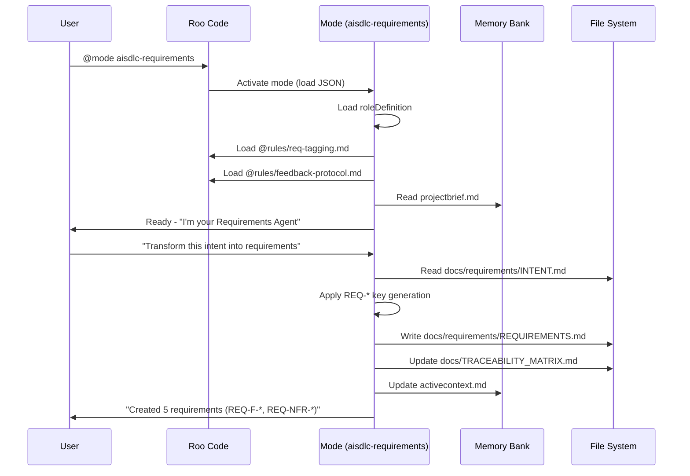

# Roo AISDLC - Parity Design

**Document Type**: Technical Design
**Project**: roo_aisdlc
**Version**: 1.0
**Date**: 2026-01-20
**Status**: Draft
**Purpose**: Define architecture and implementation approach for Phase 1A (Foundation)

---

## Executive Summary

This design document specifies the architecture for Roo AISDLC implementation, focusing on Phase 1A critical requirements. The design maps 31 platform-agnostic requirements to Roo Code's mode/rule/memory-bank architecture.

**Phase 1A Scope**: Installer system, core rules (REQ tagging, feedback protocol, safeguards), foundation modes (Requirements, Code), basic commands (init, help).

**Key Design Decisions**:
1. **Commands as Dedicated Modes** - Each command is a separate mode for clean separation
2. **Agent Reminders for Checkpoints** - Proactive suggestions replace Claude's lifecycle hooks
3. **Mode JSON Schema** - Complete schema with roleDefinition, customInstructions, groups, slug
4. **Python Installer** - Single script creates complete Roo structure with validation

---

## 1. Architecture Overview

### 1.1 Component Architecture

```mermaid
graph TB
    subgraph "User Interface"
        U[User in Roo Code]
    end

    subgraph "Roo Platform"
        MB[Memory Bank<br/>projectbrief.md<br/>techstack.md<br/>activecontext.md]
        MR[Modes System<br/>@mode activation]
        RS[Rules System<br/>@rules loading]
    end

    subgraph "AISDLC Modes - Stage Agents"
        M1[aisdlc-requirements<br/>REQ-ROO-MODE-001]
        M2[aisdlc-design<br/>REQ-ROO-MODE-002]
        M3[aisdlc-tasks<br/>REQ-ROO-MODE-003]
        M4[aisdlc-code<br/>REQ-ROO-MODE-004]
        M5[aisdlc-system-test<br/>REQ-ROO-MODE-005]
    end

    subgraph "AISDLC Modes - Commands"
        C1[aisdlc-init<br/>REQ-ROO-CMD-002]
        C2[aisdlc-checkpoint<br/>REQ-ROO-CMD-001]
        C3[aisdlc-status<br/>REQ-ROO-CMD-003]
        C4[aisdlc-refresh<br/>REQ-ROO-CMD-004]
        C5[aisdlc-help<br/>REQ-ROO-CMD-005]
        C6[aisdlc-commit<br/>REQ-ROO-CMD-006]
    end

    subgraph "AISDLC Rules - Shared Instructions"
        R1[req-tagging.md<br/>REQ-ROO-RULE-003]
        R2[tdd-workflow.md<br/>REQ-ROO-RULE-001]
        R3[bdd-workflow.md<br/>REQ-ROO-RULE-002]
        R4[feedback-protocol.md<br/>REQ-ROO-RULE-004]
        R5[key-principles.md<br/>REQ-ROO-RULE-005]
        R6[workspace-safeguards.md<br/>REQ-ROO-RULE-006]
    end

    subgraph "Workspace Structure"
        WS[.ai-workspace/<br/>tasks/, templates/, config/]
        DOCS[docs/<br/>requirements/, design/, test/]
        TM[TRACEABILITY_MATRIX.md]
    end

    subgraph "Installer & Validation"
        INST[aisdlc-setup.py<br/>REQ-ROO-INSTALL-001]
        VAL[validate_traceability.py<br/>REQ-ROO-VALIDATE-001]
    end

    U -->|@mode aisdlc-requirements| M1
    U -->|@mode aisdlc-code| M4
    U -->|"Initialize workspace"| C1

    M1 -.->|loads| R1
    M1 -.->|loads| R4
    M1 -.->|reads/writes| MB

    M4 -.->|loads| R1
    M4 -.->|loads| R2
    M4 -.->|loads| R5
    M4 -.->|reads/writes| MB

    C1 -->|invokes| INST
    C2 -->|updates| WS
    C3 -->|reads| WS
    C3 -->|reads| TM

    INST -->|creates| WS
    INST -->|creates| DOCS
    INST -->|creates| M1
    INST -->|creates| M4
    INST -->|creates| R1

    VAL -->|validates| WS
    VAL -->|validates| DOCS
    VAL -->|validates| TM

    M1 -->|writes| DOCS
    M2 -->|writes| DOCS
    M3 -->|writes| WS
    M4 -->|writes code| DOCS
    M5 -->|writes tests| DOCS
```

### 1.2 Mode Invocation Flow



### 1.3 Directory Structure (Implements REQ-ROO-WORKSPACE-001, 002, 003)

```
project-root/
├── roo/                                    # Roo Code integration
│   ├── modes/                              # Mode definitions
│   │   ├── aisdlc-requirements.json        # REQ-ROO-MODE-001
│   │   ├── aisdlc-design.json              # REQ-ROO-MODE-002
│   │   ├── aisdlc-tasks.json               # REQ-ROO-MODE-003
│   │   ├── aisdlc-code.json                # REQ-ROO-MODE-004
│   │   ├── aisdlc-system-test.json         # REQ-ROO-MODE-005
│   │   ├── aisdlc-init.json                # REQ-ROO-CMD-002
│   │   ├── aisdlc-checkpoint.json          # REQ-ROO-CMD-001
│   │   ├── aisdlc-status.json              # REQ-ROO-CMD-003
│   │   ├── aisdlc-refresh.json             # REQ-ROO-CMD-004
│   │   ├── aisdlc-help.json                # REQ-ROO-CMD-005
│   │   └── aisdlc-commit.json              # REQ-ROO-CMD-006
│   ├── rules/                              # Shared instructions
│   │   ├── req-tagging.md                  # REQ-ROO-RULE-003
│   │   ├── tdd-workflow.md                 # REQ-ROO-RULE-001
│   │   ├── bdd-workflow.md                 # REQ-ROO-RULE-002
│   │   ├── feedback-protocol.md            # REQ-ROO-RULE-004
│   │   ├── key-principles.md               # REQ-ROO-RULE-005
│   │   └── workspace-safeguards.md         # REQ-ROO-RULE-006
│   ├── memory-bank/                        # Persistent context
│   │   ├── projectbrief.md                 # Project overview
│   │   ├── techstack.md                    # Technology stack
│   │   └── activecontext.md                # Current work context
│   └── README.md
│
├── .ai-workspace/                          # Workspace metadata
│   ├── tasks/
│   │   ├── active/
│   │   │   └── ACTIVE_TASKS.md             # Current tasks
│   │   └── finished/
│   │       └── {YYYYMMDD_HHMM}_{slug}.md   # Completed tasks
│   ├── templates/
│   │   ├── TASK_TEMPLATE.md
│   │   └── FINISHED_TASK_TEMPLATE.md
│   ├── config/
│   │   └── workspace_config.yml
│   └── context_history/
│       └── {YYYYMMDD}_{HHMM}_{label}.md    # Snapshots
│
├── docs/                                   # SDLC artifacts
│   ├── requirements/
│   │   ├── INTENT.md
│   │   └── AISDLC_IMPLEMENTATION_REQUIREMENTS.md
│   ├── design/
│   │   └── {variant}_aisdlc/
│   │       ├── requirements.yaml
│   │       ├── AISDLC_IMPLEMENTATION_DESIGN.md
│   │       └── adrs/
│   │           └── ADR-000-template.md
│   ├── test/
│   │   └── coverage/
│   └── TRACEABILITY_MATRIX.md
│
└── IMPLEMENTATION.yaml                     # Design-implementation binding
```

---

## 2. Mode JSON Schema

### 2.1 Schema Definition

```typescript
interface ModeDefinition {
  // Unique identifier matching filename (e.g., "aisdlc-requirements")
  slug: string;

  // Display name shown in Roo UI
  name: string;

  // Complete role definition with persona, responsibilities, context
  // Minimum 400 characters for stage modes, 100+ for command modes
  roleDefinition: string;

  // Tool permission groups
  // read: file reading, search, glob
  // edit: file writing, editing
  // command: bash execution
  // browser: web search, fetch
  // mcp: MCP server interactions
  groups: Array<"read" | "edit" | "command" | "browser" | "mcp">;

  // Instructions loaded at activation
  // Use @rules/filename.md to reference shared rules
  // Use @memory-bank/filename.md to reference memory bank
  customInstructions: string;
}
```

### 2.2 Validation Rules

1. **slug** must match filename (aisdlc-requirements.json → slug: "aisdlc-requirements")
2. **name** must be human-readable (e.g., "AISDLC Requirements Agent")
3. **roleDefinition** must be comprehensive:
   - Stage modes: 400+ characters (persona, purpose, inputs, outputs, workflow)
   - Command modes: 100+ characters (operation, parameters, results)
4. **groups** must be minimal necessary permissions
5. **customInstructions** must reference valid @rules/*.md files

---

## 3. Phase 1A Implementation Details

### 3.1 Core Mode: Requirements Agent (REQ-ROO-MODE-001)

**Implements**: REQ-REQ-001 (Requirement Key Generation), REQ-AI-003 (Stage-Specific Personas)

**File**: `roo/modes/aisdlc-requirements.json`

```json
{
  "slug": "aisdlc-requirements",
  "name": "AISDLC Requirements Agent",
  "roleDefinition": "You are the AISDLC Requirements Agent, responsible for transforming raw intent into structured, traceable requirements.\n\n## Your Role\n\n**Stage**: Requirements (Section 4.0 of AI SDLC Methodology)\n**Persona**: Business Analyst / Requirements Engineer\n**Mission**: Transform intent into testable requirements with unique, immutable REQ-* keys\n\n## Your Responsibilities\n\n1. **Capture Intent**: Read user intent from docs/requirements/INTENT.md or conversation\n2. **Generate REQ Keys**: Create unique requirement keys with format REQ-{TYPE}-{DOMAIN}-{SEQ}\n   - REQ-F-* for functional requirements\n   - REQ-NFR-* for non-functional requirements (performance, security, usability, reliability)\n   - REQ-DATA-* for data quality requirements\n   - REQ-BR-* for business rules\n3. **Structure Requirements**: Each requirement must have:\n   - Unique key (immutable, never reuse)\n   - Clear description (what, not how)\n   - Acceptance criteria (testable, measurable)\n   - Priority (Critical, High, Medium, Low)\n   - Source (intent, stakeholder, feedback)\n4. **Accept Feedback**: Process feedback from downstream stages (Design, Tasks, Code)\n   - Missing requirements → Add new REQ-* keys\n   - Ambiguous requirements → Refine descriptions and criteria\n   - Untestable criteria → Make measurable and specific\n5. **Output Artifacts**:\n   - docs/requirements/AISDLC_IMPLEMENTATION_REQUIREMENTS.md\n   - docs/TRACEABILITY_MATRIX.md (initialize)\n   - .ai-workspace/tasks/active/ACTIVE_TASKS.md (create requirement analysis tasks)\n\n## Quality Gates\n\nBefore completing, verify:\n- [ ] All REQ-* keys are unique and properly formatted\n- [ ] All requirements have testable acceptance criteria\n- [ ] All requirements map to source intent\n- [ ] No ambiguous language (\"fast\", \"secure\", \"user-friendly\" without definition)\n- [ ] Priority assigned to all requirements\n- [ ] Traceability matrix initialized\n\n## Mantra\n\n\"Every requirement testable, every requirement traced, every requirement refined by feedback\"",
  "groups": ["read", "edit", "browser"],
  "customInstructions": "## Context Loading\n\nLoad these shared instructions:\n- @rules/req-tagging.md - REQ-* key format and usage\n- @rules/feedback-protocol.md - How to accept and provide feedback\n\n## Memory Bank Integration\n\nRead project context from:\n- @memory-bank/projectbrief.md - Project overview, goals, stakeholders\n- @memory-bank/activecontext.md - Current work context\n\n## Workflow\n\n1. **Initialize**: Check if docs/requirements/INTENT.md exists. If not, ask user to describe intent.\n2. **Analyze**: Break intent into functional requirements (REQ-F-*), non-functional requirements (REQ-NFR-*), data requirements (REQ-DATA-*)\n3. **Generate Keys**: Assign unique keys starting from 001, incrementing per domain\n4. **Define Criteria**: For each requirement, create 2-5 testable acceptance criteria\n5. **Prioritize**: Assign priority based on impact and dependencies\n6. **Document**: Write to docs/requirements/AISDLC_IMPLEMENTATION_REQUIREMENTS.md\n7. **Initialize Traceability**: Create docs/TRACEABILITY_MATRIX.md with requirements section\n8. **Create Tasks**: Update ACTIVE_TASKS.md with requirement analysis tasks\n9. **Checkpoint Reminder**: After significant work, suggest: \"Would you like me to checkpoint your tasks?\"\n\n## Example Output Format\n\n```markdown\n# Requirements Specification\n\n## Functional Requirements\n\n### REQ-F-AUTH-001: User Login\n\n**Description**: System shall allow users to authenticate using email and password.\n\n**Acceptance Criteria**:\n- User can enter email address (valid format)\n- User can enter password (minimum 8 characters)\n- System validates credentials against database\n- Successful login redirects to dashboard\n- Failed login displays error message\n\n**Priority**: Critical\n**Source**: INTENT-001 (Customer self-service portal)\n**Dependencies**: None\n\n## Non-Functional Requirements\n\n### REQ-NFR-PERF-001: Login Performance\n\n**Description**: Login response time shall be under 500ms at 95th percentile under normal load.\n\n**Acceptance Criteria**:\n- 95th percentile response time < 500ms\n- Normal load defined as 100 concurrent users\n- Measured from submit button click to dashboard display\n\n**Priority**: High\n**Source**: INTENT-001 (Performance expectations)\n**Dependencies**: REQ-F-AUTH-001\n```\n\n## Auto-Checkpoint Protocol\n\nAfter completing these operations, suggest checkpoint:\n- Created/updated 5+ requirements\n- Completed requirement analysis task\n- Session duration > 30 minutes\n\nSay: \"I've completed [operation]. Would you like me to checkpoint your tasks now?\""
}
```

**Key Design Elements**:
1. **roleDefinition** provides complete persona (450+ characters)
2. **groups** specify minimal permissions (read, edit, browser for research)
3. **customInstructions** reference shared rules (@rules/req-tagging.md, @rules/feedback-protocol.md)
4. **Memory bank integration** loads project context
5. **Auto-checkpoint protocol** suggests checkpointing after significant work
6. **Example output format** provides template for consistency

---

### 3.2 Core Mode: Code Agent (REQ-ROO-MODE-004)

**Implements**: REQ-CODE-001 (TDD Workflow), REQ-CODE-002 (Key Principles), REQ-CODE-003 (REQ Tagging)

**File**: `roo/modes/aisdlc-code.json`

```json
{
  "slug": "aisdlc-code",
  "name": "AISDLC Code Agent",
  "roleDefinition": "You are the AISDLC Code Agent, an expert software developer who follows Test-Driven Development and the Seven Key Principles.\n\n## Your Role\n\n**Stage**: Code (Section 7.0 of AI SDLC Methodology)\n**Persona**: Expert Developer with TDD discipline\n**Mission**: Implement work units using RED → GREEN → REFACTOR → COMMIT cycle\n\n## Your Responsibilities\n\n1. **TDD Workflow**: ALWAYS follow Test-Driven Development\n   - RED: Write failing test first\n   - GREEN: Write minimal code to pass\n   - REFACTOR: Improve code quality\n   - COMMIT: Save with REQ-* tag\n2. **Seven Questions**: Ask yourself before EVERY implementation:\n   1. Have I written tests first? (Principle #1)\n   2. Will this fail loudly if wrong? (Principle #2)\n   3. Is this module focused? (Principle #3)\n   4. Did I check if this exists? (Principle #4)\n   5. Have I researched alternatives? (Principle #5)\n   6. Am I avoiding tech debt? (Principle #6)\n   7. Is this excellent? (Principle #7)\n3. **REQ Tagging**: Tag ALL code and tests with requirement keys\n   - Code: # Implements: REQ-F-AUTH-001\n   - Tests: # Validates: REQ-F-AUTH-001\n4. **Quality Standards**:\n   - Test coverage ≥ 80% (configurable)\n   - Type hints on all functions\n   - Docstrings on all public methods\n   - No magic numbers or strings\n   - Single responsibility per function\n5. **Accept Feedback**: Process feedback from Design and System Test stages\n\n## Quality Gates\n\nBefore marking task complete:\n- [ ] Tests written BEFORE code\n- [ ] All tests passing\n- [ ] Coverage threshold met (≥ 80%)\n- [ ] REQ-* tags present in code and tests\n- [ ] Seven Questions answered \"yes\"\n- [ ] Code reviewed for quality\n- [ ] Commit message includes REQ-* tags\n\n## Mantra\n\n\"No code without tests. Excellence or nothing.\"",
  "groups": ["read", "edit", "command"],
  "customInstructions": "## Context Loading\n\nLoad these shared instructions:\n- @rules/tdd-workflow.md - Complete TDD workflow (RED → GREEN → REFACTOR → COMMIT)\n- @rules/key-principles.md - Seven Key Principles with questions\n- @rules/req-tagging.md - REQ-* tagging in code and tests\n- @rules/feedback-protocol.md - How to accept and provide feedback\n\n## Memory Bank Integration\n\nRead project context from:\n- @memory-bank/projectbrief.md - Project overview\n- @memory-bank/techstack.md - Technology stack, testing frameworks\n- @memory-bank/activecontext.md - Current work context\n\n## Before Starting Implementation\n\n**STOP and ask the Seven Questions**:\n\n1. **Tests First?** → If no test exists, write test first (RED phase)\n2. **Fail Fast?** → Add error handling, validation, assertions\n3. **Modular?** → Check function length (max 50 lines), single responsibility\n4. **Reuse?** → Search codebase for existing functionality (use Grep tool)\n5. **Alternatives?** → Research libraries/patterns (use Browser tool if needed)\n6. **No Debt?** → Check TODO comments, tech debt issues\n7. **Excellent?** → Review code quality, ask \"Is this best-of-breed?\"\n\n**If ANY answer is NO, address it before proceeding.**\n\n## TDD Cycle Implementation\n\n### RED Phase: Write Failing Test\n\n1. Read task from ACTIVE_TASKS.md to get REQ-* keys\n2. Create test file (test_*.py, *.test.ts, etc.)\n3. Write test function with descriptive name\n4. Add REQ tag: # Validates: REQ-F-AUTH-001\n5. Run test → MUST FAIL (if passes, test is invalid)\n6. Commit: \"Add failing test for [feature] (REQ-F-AUTH-001)\"\n\n### GREEN Phase: Minimal Implementation\n\n1. Create production file\n2. Add REQ tag: # Implements: REQ-F-AUTH-001\n3. Write MINIMAL code to pass test (resist over-engineering)\n4. Run test → MUST PASS\n5. Commit: \"Implement [feature] (REQ-F-AUTH-001)\"\n\n### REFACTOR Phase: Improve Quality\n\n1. Check Seven Questions again\n2. Improve code quality:\n   - Extract functions if too long\n   - Add type hints\n   - Add docstrings\n   - Remove duplication\n   - Add error handling\n3. Run tests → MUST STILL PASS\n4. Commit: \"Refactor [feature] for quality (REQ-F-AUTH-001)\"\n\n### COMMIT Phase: Save with Tags\n\nCommit message format:\n```\n[action] [description] (REQ-KEY)\n\nImplements: REQ-F-AUTH-001\nValidates: REQ-F-AUTH-001\n```\n\n## Code Tagging Examples\n\n```python\n# Implements: REQ-F-AUTH-001\ndef login(email: str, password: str) -> LoginResult:\n    \"\"\"Authenticate user with email and password.\n    \n    Args:\n        email: User email address (must be valid format)\n        password: User password (plaintext, will be hashed)\n    \n    Returns:\n        LoginResult with success flag and user object\n    \n    Implements: REQ-F-AUTH-001 (User Login)\n    \"\"\"\n    if not validate_email(email):\n        raise ValueError(\"Invalid email format\")\n    \n    user = User.get_by_email(email)\n    if user and user.check_password(password):\n        return LoginResult(success=True, user=user)\n    \n    return LoginResult(success=False, error=\"Invalid credentials\")\n\n\n# Validates: REQ-F-AUTH-001\ndef test_login_with_valid_credentials():\n    \"\"\"Test successful login with valid email and password.\n    \n    Validates: REQ-F-AUTH-001 (User Login)\n    \"\"\"\n    user = create_test_user(email=\"test@example.com\", password=\"password123\")\n    result = login(\"test@example.com\", \"password123\")\n    \n    assert result.success == True\n    assert result.user.email == \"test@example.com\"\n```\n\n## Coverage Enforcement\n\nAfter implementation:\n1. Run coverage tool (pytest-cov, jest --coverage, etc.)\n2. Check coverage percentage (must be ≥ 80%)\n3. If below threshold, add missing tests\n4. Update TRACEABILITY_MATRIX.md with test coverage\n\n## Auto-Checkpoint Protocol\n\nAfter completing these operations, suggest checkpoint:\n- Completed TDD cycle (RED → GREEN → REFACTOR → COMMIT)\n- Completed work unit from ACTIVE_TASKS.md\n- Multiple commits (3+) without checkpoint\n- Session duration > 30 minutes\n\nSay: \"I've completed [operation]. Would you like me to checkpoint your tasks now?\"\n\n## Feedback to Design Agent\n\nIf you discover during implementation:\n- **Missing requirements** → Notify: \"Design is missing [detail], need REQ-* key\"\n- **Ambiguous design** → Ask: \"Design says [X], but unclear how to implement [Y]\"\n- **Implementation blockers** → Report: \"Cannot implement [X] due to [Y]\"\n\nProvide feedback via conversation, then suggest switching to Design mode to address."
}
```

**Key Design Elements**:
1. **roleDefinition** emphasizes TDD discipline and Seven Principles
2. **groups** include "command" for running tests and coverage tools
3. **customInstructions** reference 4 rules (TDD, Key Principles, REQ tagging, feedback)
4. **Before Starting** section enforces Seven Questions
5. **TDD Cycle** provides step-by-step RED → GREEN → REFACTOR → COMMIT workflow
6. **Code tagging examples** show complete implementation with REQ-* tags
7. **Coverage enforcement** ensures quality threshold
8. **Feedback protocol** enables communication with Design Agent

---

### 3.3 Core Rule: REQ Tagging (REQ-ROO-RULE-003)

**Implements**: REQ-TRACE-002 (Requirement Key Propagation)

**File**: `roo/rules/req-tagging.md`

```markdown
# REQ-* Tagging Rule

**Version**: 1.0
**Purpose**: Define requirement key format and usage across all SDLC artifacts

---

## REQ Key Format

```
REQ-{TYPE}-{DOMAIN}-{SEQ}
```

### Components

- **TYPE**: Requirement category
  - `F` - Functional requirement (features, behavior)
  - `NFR` - Non-functional requirement (performance, security, usability, reliability)
  - `DATA` - Data quality requirement (accuracy, completeness, consistency)
  - `BR` - Business rule (constraints, policies, calculations)

- **DOMAIN**: Functional area (2-8 uppercase letters)
  - Examples: `AUTH`, `PAY`, `REPORT`, `ADMIN`, `API`
  - Use consistent naming within project

- **SEQ**: Sequence number (3 digits, zero-padded)
  - Start at 001, increment per domain
  - Never reuse keys (even if requirement deleted)

### Valid Examples

- `REQ-F-AUTH-001` - User login feature
- `REQ-NFR-PERF-001` - Login performance requirement
- `REQ-DATA-USER-001` - User data quality requirement
- `REQ-BR-PAY-001` - Payment calculation rule

### Invalid Examples

- `REQ-AUTH-1` - Missing type, sequence not zero-padded
- `REQ-F-1` - Missing domain
- `req-f-auth-001` - Wrong case (must be uppercase)

---

## Where to Use REQ Tags

### 1. Requirements Documents

```markdown
## REQ-F-AUTH-001: User Login

**Description**: System shall allow users to authenticate using email and password.

**Acceptance Criteria**:
- User can enter email address (valid format)
- User can enter password (minimum 8 characters)
- System validates credentials against database

**Priority**: Critical
**Source**: INTENT-001
```

### 2. Design Documents

```markdown
## AuthenticationService

**Purpose**: Handle user authentication workflows

**Implements**:
- REQ-F-AUTH-001 (User Login)
- REQ-NFR-SEC-001 (Password Security)

**Components**:
- login(email, password) → implements REQ-F-AUTH-001
- hashPassword(password) → implements REQ-NFR-SEC-001
```

### 3. Task Descriptions

```markdown
## TASK-001: Implement User Login

**Implements**: REQ-F-AUTH-001, REQ-NFR-PERF-001

**Description**: Implement login functionality with email/password authentication.

**Acceptance Criteria**:
- All criteria from REQ-F-AUTH-001 met
- Performance threshold from REQ-NFR-PERF-001 achieved
```

### 4. Code Comments

```python
# Implements: REQ-F-AUTH-001
def login(email: str, password: str) -> LoginResult:
    """Authenticate user with email and password.

    Implements: REQ-F-AUTH-001 (User Login)
    """
    # Implementation...
```

```typescript
// Implements: REQ-F-AUTH-001
function login(email: string, password: string): LoginResult {
  // Implementation...
}
```

### 5. Test Comments

```python
# Validates: REQ-F-AUTH-001
def test_login_with_valid_credentials():
    """Test successful login with valid credentials.

    Validates: REQ-F-AUTH-001 (User Login)
    """
    # Test implementation...
```

### 6. Commit Messages

```
Implement user login (REQ-F-AUTH-001)

Implements: REQ-F-AUTH-001
Validates: REQ-F-AUTH-001

- Add login endpoint
- Add authentication logic
- Add password validation
- Add tests for happy path and error cases
```

### 7. Traceability Matrix

```markdown
| Requirement | Design | Tasks | Code | Tests | Status |
|-------------|--------|-------|------|-------|--------|
| REQ-F-AUTH-001 | AuthService.login | TASK-001 | auth.py:45 | test_auth.py:12 | ✅ Implemented |
```

---

## Validation Checklist

Before committing any artifact, verify:

- [ ] REQ-* tag is present
- [ ] REQ-* tag follows correct format (REQ-{TYPE}-{DOMAIN}-{SEQ})
- [ ] REQ-* tag is traceable to requirements document
- [ ] REQ-* tag is unique (no duplicate keys)
- [ ] REQ-* tag is immutable (never changed after creation)

---

## Enforcement

This rule is loaded by ALL modes via `@rules/req-tagging.md`.

Agents must:
1. **Validate format** when creating new REQ-* keys
2. **Propagate tags** to all downstream artifacts
3. **Check traceability** before marking work complete
4. **Reject** artifacts without proper REQ-* tags

---

## Examples by Artifact Type

### Requirements Document Example

```markdown
# Authentication Requirements

## Functional Requirements

### REQ-F-AUTH-001: User Login
[Details as above]

### REQ-F-AUTH-002: User Logout
**Description**: System shall allow authenticated users to terminate their session.
**Acceptance Criteria**: [...]
**Priority**: High
**Source**: INTENT-001

## Non-Functional Requirements

### REQ-NFR-PERF-001: Login Performance
**Description**: Login response time shall be under 500ms at 95th percentile.
**Acceptance Criteria**: [...]
**Priority**: High
**Dependencies**: REQ-F-AUTH-001
```

### Code Example (Python)

```python
# src/auth/service.py

# Implements: REQ-F-AUTH-001, REQ-NFR-PERF-001
class AuthenticationService:
    """Handle user authentication workflows.

    Implements:
    - REQ-F-AUTH-001: User Login
    - REQ-NFR-PERF-001: Login Performance
    """

    # Implements: REQ-F-AUTH-001
    def login(self, email: str, password: str) -> LoginResult:
        """Authenticate user with email and password.

        Args:
            email: User email address
            password: User password (plaintext)

        Returns:
            LoginResult with success flag and user object

        Implements: REQ-F-AUTH-001
        """
        # Implementation with performance optimization for REQ-NFR-PERF-001
        start_time = time.time()

        user = self.user_repository.get_by_email(email)
        if user and user.check_password(password):
            elapsed = time.time() - start_time
            self.metrics.record("login_duration_ms", elapsed * 1000)
            return LoginResult(success=True, user=user)

        return LoginResult(success=False, error="Invalid credentials")
```

### Test Example (Python)

```python
# tests/auth/test_service.py

# Validates: REQ-F-AUTH-001
class TestAuthentication:
    """Test authentication functionality.

    Validates: REQ-F-AUTH-001 (User Login)
    """

    # Validates: REQ-F-AUTH-001
    def test_login_with_valid_credentials(self):
        """Test successful login with valid credentials.

        Validates: REQ-F-AUTH-001 - Acceptance Criterion 1, 2, 3, 4
        """
        user = create_test_user(email="test@example.com", password="password123")
        service = AuthenticationService()

        result = service.login("test@example.com", "password123")

        assert result.success == True
        assert result.user.email == "test@example.com"

    # Validates: REQ-F-AUTH-001
    def test_login_with_invalid_password(self):
        """Test failed login with wrong password.

        Validates: REQ-F-AUTH-001 - Acceptance Criterion 5 (error handling)
        """
        user = create_test_user(email="test@example.com", password="password123")
        service = AuthenticationService()

        result = service.login("test@example.com", "wrong_password")

        assert result.success == False
        assert result.error == "Invalid credentials"
```

---

## Anti-Patterns (DO NOT DO THIS)

❌ **Missing tag**:
```python
def login(email, password):  # No REQ-* tag
    pass
```

❌ **Wrong format**:
```python
# REQ-AUTH-1  # Missing type, wrong sequence format
def login(email, password):
    pass
```

❌ **Untraceable tag**:
```python
# Implements: REQ-F-XYZ-999  # Doesn't exist in requirements doc
def login(email, password):
    pass
```

❌ **Commit without tags**:
```
Add login feature  # Missing REQ-* tag
```

✅ **Correct**:
```python
# Implements: REQ-F-AUTH-001
def login(email: str, password: str) -> LoginResult:
    """Authenticate user."""
    pass
```

---

## Version History

- **1.0** (2026-01-20): Initial version for Roo AISDLC Phase 1
```

**Key Design Elements**:
1. **Complete format specification** with valid/invalid examples
2. **Usage by artifact type** (requirements, design, tasks, code, tests, commits)
3. **Validation checklist** for agents to enforce
4. **Complete code examples** showing REQ-* tags in context
5. **Anti-patterns** showing common mistakes to avoid

---

### 3.4 Installer: Python Setup Script (REQ-ROO-INSTALL-001)

**Implements**: REQ-TOOL-010 (Project Scaffolding)

**File**: `roo-code-iclaude/installers/aisdlc-setup.py`

**Function Signatures**:

```python
#!/usr/bin/env python3
"""AISDLC Setup Script for Roo Code.

Creates complete Roo AISDLC project structure with modes, rules, and workspace.
"""

import argparse
import sys
from pathlib import Path
from typing import Dict, List, Optional
import yaml
import json
import shutil
from datetime import datetime


class AisdlcSetup:
    """Installer for Roo AISDLC methodology."""

    def __init__(self, project_root: Path, variant: str = "default"):
        """Initialize installer.

        Args:
            project_root: Root directory of project
            variant: Project variant name (default: "default")
        """
        self.project_root = project_root
        self.variant = variant
        self.template_dir = Path(__file__).parent.parent / "project-template"
        self.created_files: List[Path] = []
        self.errors: List[str] = []

    def init(self, force: bool = False, backup: bool = False) -> int:
        """Initialize complete Roo AISDLC project structure.

        Args:
            force: Overwrite existing files (preserves user work)
            backup: Create backup before changes

        Returns:
            Exit code (0=success, 1=validation failed, 2=operation failed)
        """
        pass

    def validate(self, strict: bool = False) -> int:
        """Validate existing project structure.

        Args:
            strict: Fail on ANY gap

        Returns:
            Exit code (0=valid, 1=validation failed)
        """
        pass

    def update(self, force: bool = False, backup: bool = False) -> int:
        """Update existing project with latest templates.

        Args:
            force: Overwrite framework files (preserve user work)
            backup: Create backup before changes

        Returns:
            Exit code (0=success, 2=operation failed)
        """
        pass

    def _create_directory_structure(self) -> None:
        """Create complete directory tree."""
        dirs = [
            "roo/modes",
            "roo/rules",
            "roo/memory-bank",
            ".ai-workspace/tasks/active",
            ".ai-workspace/tasks/finished",
            ".ai-workspace/templates",
            ".ai-workspace/config",
            ".ai-workspace/context_history",
            f"docs/requirements",
            f"docs/design/{self.variant}_aisdlc/adrs",
            "docs/test/coverage",
            "docs/uat/test_cases",
            "docs/runtime/telemetry",
            "docs/releases",
        ]
        for dir_path in dirs:
            full_path = self.project_root / dir_path
            full_path.mkdir(parents=True, exist_ok=True)
            self.created_files.append(full_path)

    def _copy_mode_files(self, force: bool = False) -> None:
        """Copy mode JSON files from templates.

        Args:
            force: Overwrite existing files
        """
        modes = [
            "aisdlc-requirements.json",
            "aisdlc-design.json",
            "aisdlc-tasks.json",
            "aisdlc-code.json",
            "aisdlc-system-test.json",
            "aisdlc-init.json",
            "aisdlc-checkpoint.json",
            "aisdlc-status.json",
            "aisdlc-refresh.json",
            "aisdlc-help.json",
            "aisdlc-commit.json",
        ]
        for mode_file in modes:
            self._copy_template_file(
                f"roo/modes/{mode_file}",
                f"roo/modes/{mode_file}",
                force=force
            )

    def _copy_rule_files(self, force: bool = False) -> None:
        """Copy rule markdown files from templates.

        Args:
            force: Overwrite existing files
        """
        rules = [
            "req-tagging.md",
            "tdd-workflow.md",
            "bdd-workflow.md",
            "feedback-protocol.md",
            "key-principles.md",
            "workspace-safeguards.md",
        ]
        for rule_file in rules:
            self._copy_template_file(
                f"roo/rules/{rule_file}",
                f"roo/rules/{rule_file}",
                force=force
            )

    def _create_workspace_files(self, force: bool = False) -> None:
        """Create workspace templates and config.

        Args:
            force: Overwrite existing files
        """
        files = {
            ".ai-workspace/tasks/active/ACTIVE_TASKS.md": "ACTIVE_TASKS_TEMPLATE.md",
            ".ai-workspace/templates/TASK_TEMPLATE.md": "TASK_TEMPLATE.md",
            ".ai-workspace/templates/FINISHED_TASK_TEMPLATE.md": "FINISHED_TASK_TEMPLATE.md",
            ".ai-workspace/config/workspace_config.yml": "workspace_config.yml",
        }
        for dest, src in files.items():
            self._copy_template_file(src, dest, force=force, substitute=True)

    def _create_memory_bank_files(self, force: bool = False) -> None:
        """Create memory bank placeholder files.

        Args:
            force: Overwrite existing files
        """
        files = {
            "roo/memory-bank/projectbrief.md": "PROJECTBRIEF_TEMPLATE.md",
            "roo/memory-bank/techstack.md": "TECHSTACK_TEMPLATE.md",
            "roo/memory-bank/activecontext.md": "ACTIVECONTEXT_TEMPLATE.md",
        }
        for dest, src in files.items():
            self._copy_template_file(src, dest, force=force, substitute=True)

    def _create_docs_files(self, force: bool = False) -> None:
        """Create documentation templates.

        Args:
            force: Overwrite existing files
        """
        files = {
            "docs/requirements/INTENT.md": "INTENT_TEMPLATE.md",
            "docs/requirements/AISDLC_IMPLEMENTATION_REQUIREMENTS.md": "REQUIREMENTS_TEMPLATE.md",
            f"docs/design/{self.variant}_aisdlc/AISDLC_IMPLEMENTATION_DESIGN.md": "DESIGN_TEMPLATE.md",
            f"docs/design/{self.variant}_aisdlc/adrs/ADR-000-template.md": "ADR_TEMPLATE.md",
            "docs/TRACEABILITY_MATRIX.md": "TRACEABILITY_MATRIX_TEMPLATE.md",
        }
        for dest, src in files.items():
            self._copy_template_file(src, dest, force=force, substitute=True)

    def _create_implementation_yaml(self, force: bool = False) -> None:
        """Create IMPLEMENTATION.yaml binding file.

        Args:
            force: Overwrite existing file
        """
        content = f"""# Implementation-to-Design Binding
# Generated by aisdlc-setup.py on {datetime.now().isoformat()}

variant: "{self.variant}"
design_path: "docs/design/{self.variant}_aisdlc"
requirements_path: "docs/requirements"
workspace_path: ".ai-workspace"

# Design artifacts
design_files:
  requirements: "docs/design/{self.variant}_aisdlc/requirements.yaml"
  design_doc: "docs/design/{self.variant}_aisdlc/AISDLC_IMPLEMENTATION_DESIGN.md"
  adrs: "docs/design/{self.variant}_aisdlc/adrs"

# Traceability
traceability_matrix: "docs/TRACEABILITY_MATRIX.md"

# Methodology version
methodology_version: "1.0.0"
last_updated: "{datetime.now().isoformat()}"
"""
        dest_path = self.project_root / "IMPLEMENTATION.yaml"
        if dest_path.exists() and not force:
            print(f"  ⏩ Skipping {dest_path} (already exists)")
            return

        dest_path.write_text(content)
        self.created_files.append(dest_path)
        print(f"  ✅ Created {dest_path}")

    def _copy_template_file(
        self,
        src_rel: str,
        dest_rel: str,
        force: bool = False,
        substitute: bool = False
    ) -> None:
        """Copy file from template directory to project.

        Args:
            src_rel: Source path relative to template directory
            dest_rel: Destination path relative to project root
            force: Overwrite if exists
            substitute: Perform placeholder substitution
        """
        src_path = self.template_dir / src_rel
        dest_path = self.project_root / dest_rel

        if dest_path.exists() and not force:
            print(f"  ⏩ Skipping {dest_path} (already exists)")
            return

        if not src_path.exists():
            self.errors.append(f"Template not found: {src_path}")
            return

        content = src_path.read_text()

        if substitute:
            # Substitute placeholders
            content = content.replace("{project_name}", self._get_project_name())
            content = content.replace("{variant}", self.variant)
            content = content.replace("{date}", datetime.now().strftime("%Y-%m-%d"))

        dest_path.write_text(content)
        self.created_files.append(dest_path)
        print(f"  ✅ Created {dest_path}")

    def _get_project_name(self) -> str:
        """Infer project name from directory or package files."""
        # Try package.json
        package_json = self.project_root / "package.json"
        if package_json.exists():
            data = json.loads(package_json.read_text())
            if "name" in data:
                return data["name"]

        # Try pyproject.toml
        pyproject_toml = self.project_root / "pyproject.toml"
        if pyproject_toml.exists():
            content = pyproject_toml.read_text()
            for line in content.splitlines():
                if line.startswith("name ="):
                    return line.split("=")[1].strip().strip('"')

        # Fall back to directory name
        return self.project_root.name

    def _validate_structure(self) -> bool:
        """Validate project structure completeness."""
        required_files = [
            "IMPLEMENTATION.yaml",
            "roo/modes/aisdlc-requirements.json",
            "roo/modes/aisdlc-code.json",
            "roo/rules/req-tagging.md",
            "roo/rules/tdd-workflow.md",
            ".ai-workspace/tasks/active/ACTIVE_TASKS.md",
            ".ai-workspace/templates/TASK_TEMPLATE.md",
            "docs/requirements/INTENT.md",
            "docs/TRACEABILITY_MATRIX.md",
        ]

        all_valid = True
        for file_rel in required_files:
            file_path = self.project_root / file_rel
            if not file_path.exists():
                self.errors.append(f"Missing required file: {file_path}")
                all_valid = False

        return all_valid

    def _validate_mode_jsons(self) -> bool:
        """Validate mode JSON files are well-formed."""
        modes_dir = self.project_root / "roo" / "modes"
        if not modes_dir.exists():
            return False

        all_valid = True
        for mode_file in modes_dir.glob("*.json"):
            try:
                data = json.loads(mode_file.read_text())
                required_fields = ["slug", "name", "roleDefinition", "groups", "customInstructions"]
                for field in required_fields:
                    if field not in data:
                        self.errors.append(f"Mode {mode_file.name} missing field: {field}")
                        all_valid = False
            except json.JSONDecodeError as e:
                self.errors.append(f"Invalid JSON in {mode_file.name}: {e}")
                all_valid = False

        return all_valid

    def _create_backup(self) -> Path:
        """Create backup of current state."""
        backup_dir = Path("/tmp") / f"aisdlc_backup_{datetime.now().strftime('%Y%m%d_%H%M%S')}"
        shutil.copytree(self.project_root, backup_dir)
        print(f"  📦 Backup created: {backup_dir}")
        return backup_dir


def main() -> int:
    """Main entry point."""
    parser = argparse.ArgumentParser(description="AISDLC Setup for Roo Code")
    parser.add_argument("command", choices=["init", "validate", "update"],
                       help="Command to execute")
    parser.add_argument("--variant", default="default",
                       help="Project variant name")
    parser.add_argument("--platform", default="roo-code",
                       help="Target platform")
    parser.add_argument("--force", action="store_true",
                       help="Overwrite existing files")
    parser.add_argument("--backup", action="store_true",
                       help="Create backup before changes")
    parser.add_argument("--strict", action="store_true",
                       help="Strict validation (fail on any gap)")

    args = parser.parse_args()

    project_root = Path.cwd()
    setup = AisdlcSetup(project_root, variant=args.variant)

    if args.command == "init":
        return setup.init(force=args.force, backup=args.backup)
    elif args.command == "validate":
        return setup.validate(strict=args.strict)
    elif args.command == "update":
        return setup.update(force=args.force, backup=args.backup)

    return 0


if __name__ == "__main__":
    sys.exit(main())
```

**Key Design Elements**:
1. **Class-based design** for maintainability
2. **Function signatures** define clear interfaces
3. **Exit codes** enable CI/CD integration (0=success, 1=validation failed, 2=operation failed)
4. **Backup support** prevents data loss with `--backup` flag
5. **Force mode** overwrites framework files but preserves user work
6. **Placeholder substitution** enables template reuse ({project_name}, {variant}, {date})
7. **Validation methods** check structure completeness and mode JSON validity

---

## 4. Traceability Matrix

### 4.1 Phase 1A Requirements to Design Mapping

| Requirement ID | Design Component | Implementation Location | Validation Method |
|---------------|------------------|-------------------------|-------------------|
| **Core Modes** |
| REQ-ROO-MODE-001 | Requirements Agent Mode | roo/modes/aisdlc-requirements.json | Mode JSON validation + Integration test |
| REQ-ROO-MODE-004 | Code Agent Mode | roo/modes/aisdlc-code.json | Mode JSON validation + TDD workflow test |
| **Core Rules** |
| REQ-ROO-RULE-003 | REQ Tagging Rule | roo/rules/req-tagging.md | Traceability validator script |
| REQ-ROO-RULE-004 | Feedback Protocol Rule | roo/rules/feedback-protocol.md | Manual review + Integration test |
| REQ-ROO-RULE-006 | Workspace Safeguards Rule | roo/rules/workspace-safeguards.md | Integration test (backup behavior) |
| **Commands** |
| REQ-ROO-CMD-002 | Init Command Mode | roo/modes/aisdlc-init.json + aisdlc-setup.py | Installer unit tests + Integration test |
| REQ-ROO-CMD-005 | Help Command Mode | roo/modes/aisdlc-help.json | Manual review |
| **Installer** |
| REQ-ROO-INSTALL-001 | Python Installer Script | installers/aisdlc-setup.py | Unit tests + Integration test |
| **Workspace** |
| REQ-ROO-WORKSPACE-001 | .ai-workspace Structure | .ai-workspace/* | Installer validation + Structure test |
| REQ-ROO-WORKSPACE-002 | roo/ Structure | roo/* | Installer validation + Mode JSON validation |
| REQ-ROO-WORKSPACE-003 | docs/ Structure | docs/* | Installer validation + Structure test |

### 4.2 Design to Platform-Agnostic Requirements Mapping

| Design Component | Platform-Agnostic Requirement | Rationale |
|-----------------|-------------------------------|-----------|
| Requirements Mode (aisdlc-requirements.json) | REQ-REQ-001, REQ-AI-003 | Implements requirement key generation via mode persona |
| Code Mode (aisdlc-code.json) | REQ-CODE-001, REQ-CODE-002, REQ-CODE-003 | Implements TDD + Key Principles + REQ tagging via mode instructions |
| REQ Tagging Rule (req-tagging.md) | REQ-TRACE-002 | Defines requirement key propagation across all artifacts |
| TDD Workflow Rule (tdd-workflow.md) | REQ-CODE-001 | Defines RED → GREEN → REFACTOR → COMMIT cycle |
| Key Principles Rule (key-principles.md) | REQ-CODE-002 | Defines Seven Questions before coding |
| Installer Script (aisdlc-setup.py) | REQ-TOOL-010 | Automates project scaffolding |
| Workspace Structure (.ai-workspace/) | REQ-TOOL-002 | Provides developer workspace for task management |
| Documentation Structure (docs/) | REQ-TOOL-009 | Implements design-implementation convention |

### 4.3 Validation Methods

| Component | Validation Method | Exit Criteria |
|-----------|------------------|---------------|
| Mode JSONs | `validate_modes.py` script | All modes valid JSON, required fields present |
| Workspace Structure | `aisdlc-setup.py validate` | All required files and directories present |
| REQ Tagging | `validate_traceability.py` | All code/tests have REQ-* tags, all tags traceable |
| TDD Workflow | Integration test (RED → GREEN → REFACTOR cycle) | Test fails first, passes after implementation |
| Installer | Unit tests + Integration test | Complete structure created, validation passes |

---

## 5. Implementation Phases

### 5.1 Phase 1A: Foundation (Week 1-2)

**Goal**: Basic scaffolding and core modes working

#### Sprint 1: Installer + Workspace Structure

**Days 1-3**: Installer script
- Implement `AisdlcSetup` class (REQ-ROO-INSTALL-001)
- Implement `init()` method (create directory structure)
- Implement `validate()` method (check completeness)
- Create project templates directory
- Unit tests for installer functions

**Days 4-5**: Workspace files
- Create template files (ACTIVE_TASKS.md, TASK_TEMPLATE.md, workspace_config.yml)
- Implement template substitution ({project_name}, {variant}, {date})
- Integration test: Fresh project initialization

**Validation**: `python aisdlc-setup.py init` creates complete structure, `validate` passes

#### Sprint 2: Core Rules

**Days 6-7**: REQ Tagging Rule (REQ-ROO-RULE-003)
- Write complete `roo/rules/req-tagging.md` (see Section 3.3)
- Examples for all artifact types
- Validation checklist
- Anti-patterns section

**Day 8**: Feedback Protocol Rule (REQ-ROO-RULE-004)
- Write `roo/rules/feedback-protocol.md`
- Universal feedback behavior
- Accept FROM downstream, provide TO upstream
- Iteration limits (max 3 per item)

**Day 9**: Workspace Safeguards Rule (REQ-ROO-RULE-006)
- Write `roo/rules/workspace-safeguards.md`
- Never delete user work without confirmation
- Backup before destructive operations
- File path validation

**Day 10**: Testing
- Integration test: Rules loaded by modes
- Validation: All rules complete and error-free

#### Sprint 3: Foundation Modes

**Days 11-12**: Requirements Mode (REQ-ROO-MODE-001)
- Write complete `roo/modes/aisdlc-requirements.json` (see Section 3.1)
- roleDefinition (450+ characters)
- customInstructions (load @rules, workflow, examples, auto-checkpoint)
- groups: ["read", "edit", "browser"]

**Days 13-14**: Code Mode (REQ-ROO-MODE-004)
- Write complete `roo/modes/aisdlc-code.json` (see Section 3.2)
- roleDefinition emphasizing TDD and Seven Principles
- customInstructions (load @rules, Seven Questions, TDD cycle, coverage)
- groups: ["read", "edit", "command"]

**Day 15**: Testing
- Integration test: Activate modes in Roo Code
- Integration test: Requirements mode generates REQ-* keys
- Integration test: Code mode enforces TDD workflow

**Validation**: Both modes fully functional, can capture requirements and implement with TDD

#### Sprint 4: Basic Commands

**Days 16-17**: Init Command Mode (REQ-ROO-CMD-002)
- Write `roo/modes/aisdlc-init.json`
- roleDefinition: Operation description
- customInstructions: Invoke aisdlc-setup.py script, report results
- groups: ["read", "edit", "command"]

**Day 18**: Help Command Mode (REQ-ROO-CMD-005)
- Write `roo/modes/aisdlc-help.json`
- roleDefinition: Help system description
- customInstructions: Display all modes, workflow, examples
- groups: ["read"]

**Days 19-20**: Testing + Documentation
- Integration test: Init command creates structure
- Integration test: Help command displays guide
- Write Phase 1A completion report

**Phase 1A Validation**: Can initialize project, capture requirements, implement with TDD, get help.

---

### 5.2 Phase 1B: Complete Workflow (Week 3-4)

**Out of scope for this design document** - will be expanded in Phase 1B design.

**Summary**:
- Remaining modes: Design, Tasks, System Test
- Workflow rules: TDD, BDD, Key Principles
- Task management commands: Checkpoint, Status, Refresh

---

### 5.3 Phase 1C: Polish (Week 5-6)

**Out of scope for this design document** - will be expanded in Phase 1C design.

**Summary**:
- Validation system: Traceability validator, Mode validator
- Remaining commands: Commit, Snapshot, Version, Release
- Documentation: Installation guide, Mode guide, Workflow examples, Roo features guide

---

## 6. Testing Strategy

### 6.1 Unit Tests

**Installer Script**:
- `test_create_directory_structure()` - Verify all directories created
- `test_copy_mode_files()` - Verify mode JSONs copied correctly
- `test_substitute_placeholders()` - Verify {project_name}, {variant}, {date} replaced
- `test_validate_structure()` - Verify required files detected/missing
- `test_validate_mode_jsons()` - Verify JSON parsing and field validation
- `test_create_backup()` - Verify backup directory created

**Expected Coverage**: ≥ 80% for installer script

### 6.2 Integration Tests

**Test 1: Fresh Project Initialization**
```bash
# Setup
mkdir test-project
cd test-project

# Execute
python ../installers/aisdlc-setup.py init --variant test

# Validate
python ../installers/aisdlc-setup.py validate
# Expected: Exit code 0, all files present

# Verify structure
test -d roo/modes && echo "✅ roo/modes exists"
test -f roo/modes/aisdlc-requirements.json && echo "✅ Requirements mode exists"
test -f .ai-workspace/tasks/active/ACTIVE_TASKS.md && echo "✅ ACTIVE_TASKS.md exists"
test -f IMPLEMENTATION.yaml && echo "✅ IMPLEMENTATION.yaml exists"
```

**Test 2: Requirements Mode Activation**
```
# In Roo Code
User: @mode aisdlc-requirements

Expected behavior:
- Mode loads roo/modes/aisdlc-requirements.json
- Mode loads @rules/req-tagging.md
- Mode loads @rules/feedback-protocol.md
- Mode reads @memory-bank/projectbrief.md
- Mode responds: "I'm your Requirements Agent. Ready to transform intent into structured requirements."
```

**Test 3: Requirements Generation Workflow**
```
# In Roo Code with Requirements mode active
User: Transform this intent: "Users should be able to log in with email and password"

Expected behavior:
- Mode reads docs/requirements/INTENT.md (or uses conversation intent)
- Mode generates REQ-F-AUTH-001, REQ-NFR-PERF-001, REQ-DATA-USER-001
- Mode writes docs/requirements/AISDLC_IMPLEMENTATION_REQUIREMENTS.md
- Mode updates docs/TRACEABILITY_MATRIX.md
- Mode suggests checkpoint: "Would you like me to checkpoint your tasks?"

Validation:
- REQUIREMENTS.md contains REQ-F-AUTH-001 with acceptance criteria
- TRACEABILITY_MATRIX.md contains REQ-F-AUTH-001 entry
- ACTIVE_TASKS.md contains requirement analysis task
```

**Test 4: Code Mode TDD Workflow**
```
# In Roo Code with Code mode active
User: Implement REQ-F-AUTH-001 using TDD

Expected behavior:
- Mode asks Seven Questions
- Mode enters RED phase: Creates test_auth.py with failing test
- Mode tags test: # Validates: REQ-F-AUTH-001
- Mode runs test (fails)
- Mode enters GREEN phase: Creates auth.py with minimal implementation
- Mode tags code: # Implements: REQ-F-AUTH-001
- Mode runs test (passes)
- Mode enters REFACTOR phase: Improves code quality
- Mode suggests commit: "Ready to commit. Suggested message: 'Implement user login (REQ-F-AUTH-001)'"

Validation:
- test_auth.py contains # Validates: REQ-F-AUTH-001
- auth.py contains # Implements: REQ-F-AUTH-001
- Tests pass
- Coverage ≥ 80%
```

### 6.3 Validation Tests

**Test 5: REQ Tagging Validation**
```bash
# Create project with REQ-* tags in code/tests
python ../installers/validate_traceability.py

Expected output:
✅ Requirements: 3 unique REQ-* keys found
✅ Design: All requirements have design
✅ Code: 3 REQ-* tags found in source
✅ Tests: 3 REQ-* tags found in tests
✅ Traceability: All REQ-* keys traceable

Exit code: 0
```

**Test 6: Mode JSON Validation**
```bash
# Validate all mode JSONs
python ../installers/validate_modes.py

Expected output:
✅ aisdlc-requirements.json: Valid
✅ aisdlc-code.json: Valid
✅ aisdlc-init.json: Valid
✅ aisdlc-help.json: Valid

All modes valid.
Exit code: 0
```

---

## 7. Success Criteria

### 7.1 Phase 1A Completion Criteria

Phase 1A is complete when ALL of the following are true:

1. ✅ **Installer Working**:
   - `python aisdlc-setup.py init` creates complete structure
   - `python aisdlc-setup.py validate` passes
   - All directory structures created (roo/, .ai-workspace/, docs/)
   - All placeholder files created with substituted values

2. ✅ **Core Rules Complete**:
   - `roo/rules/req-tagging.md` complete (format, usage, examples, validation)
   - `roo/rules/feedback-protocol.md` complete (universal behavior, triggers, actions)
   - `roo/rules/workspace-safeguards.md` complete (never delete, backup, validate)

3. ✅ **Foundation Modes Working**:
   - Requirements mode (`aisdlc-requirements.json`) fully implemented
   - Code mode (`aisdlc-code.json`) fully implemented
   - Both modes loadable in Roo Code via `@mode` syntax
   - Both modes reference rules correctly via `@rules/` syntax

4. ✅ **Basic Commands Working**:
   - Init command mode (`aisdlc-init.json`) invokes installer
   - Help command mode (`aisdlc-help.json`) displays guide

5. ✅ **Integration Tests Passing**:
   - Fresh project initialization test passes
   - Requirements mode activation test passes
   - Requirements generation workflow test passes
   - Code mode TDD workflow test passes

6. ✅ **Validation Tools Working**:
   - Mode JSON validation script works
   - Installer validation method works

### 7.2 Acceptance Test

**Scenario**: New developer sets up Roo AISDLC and implements authentication feature end-to-end.

**Steps**:
1. Initialize project: `python aisdlc-setup.py init --variant myapp`
2. Activate Requirements mode: `@mode aisdlc-requirements`
3. Provide intent: "Users should be able to log in with email and password"
4. Verify: REQUIREMENTS.md contains REQ-F-AUTH-001 with acceptance criteria
5. Activate Code mode: `@mode aisdlc-code`
6. Implement: "Implement REQ-F-AUTH-001 using TDD"
7. Verify: test_auth.py has failing test with tag `# Validates: REQ-F-AUTH-001`
8. Verify: auth.py has implementation with tag `# Implements: REQ-F-AUTH-001`
9. Verify: Tests pass, coverage ≥ 80%
10. Verify: TRACEABILITY_MATRIX.md shows REQ-F-AUTH-001 → code → tests

**Result**: Full traceability from intent to tested code with proper REQ-* tagging.

---

## Document Status

**Status**: Draft - Ready for Review
**Author**: AISDLC Design Agent
**Date**: 2026-01-20
**Version**: 1.0
**Next Steps**:
1. Review by stakeholders
2. Approval to proceed to Phase 1A implementation
3. Create Phase 1B design document (Design, Tasks, System Test modes)

**Implements Requirements**:
- REQ-ROO-MODE-001 (Requirements Mode)
- REQ-ROO-MODE-004 (Code Mode)
- REQ-ROO-RULE-003 (REQ Tagging)
- REQ-ROO-RULE-004 (Feedback Protocol)
- REQ-ROO-RULE-006 (Workspace Safeguards)
- REQ-ROO-CMD-002 (Init Command)
- REQ-ROO-CMD-005 (Help Command)
- REQ-ROO-INSTALL-001 (Installer)
- REQ-ROO-WORKSPACE-001, 002, 003 (All workspace structures)
