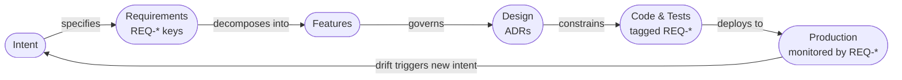

# Governing AI in Software Engineering: The Case for Spec-Driven Development

---

Software systems rest on the assumption that you can account for what your systems do. Which rule does this component enforce? Which control does this process satisfy? When this behaviour changes, what changes with it?

AI is now writing significant portions of enterprise software. The tooling has outpaced the governance. The result is a growing inventory of production systems where the chain from business requirement to delivered behaviour is informal, undocumented, and unverifiable.

Spec-Driven Development restores that accountability — not as an additional process layer, but as the architecture that makes AI development auditable by construction.

---

## History repeating itself, an opporunity to break the cycle

Two decades ago, every business adopted spreadsheets enthusiastically. Fast, flexible, no IT involvement required. Every department built on them.

Business-critical calculations ended up on personal drives. Pricing logic lived in models only one person understood. Risk computations sat in spreadsheets outside any system of record. When auditors asked how a number was arrived at, the answer was a file called FINAL_v3_REVISED.xlsx, last modified by someone who had since left.

Organisations spent twenty years trying to regain visibility over what their own systems were computing.

Now we have spreadsheets that can think for themselves.

AI-generated code is that problem, running at an exponential scale.

A developer can now produce in an afternoon what previously took a team a week. That capability is already in use across the enterprise. The code it produces is in production systems, running business logic, making decisions. And unless something specific was done to prevent it, nobody — including the developer — can fully account for what it does, which business requirement it satisfies, or what changes when something goes wrong.

The spreadsheet problem was contained by what a spreadsheet could do. AI has no such limit. It writes entire systems.

Spec-Driven Development is the governance framework built for this moment. It does not slow AI down. It gives organisations the full productivity of AI construction with complete visibility into what is being built, why, and whether it matches what the business asked for. The spreadsheet era ended in governance debt. This one does not have to.

---

## Getting it right

After seeing Spec-Driven Development for the first time, the question that comes up is: how do you know it built everything you wanted?

We have spent decades perfecting the process to guarantee that what was specified was built. To this end we have armies of Architects, Business Analysts, Tech Leads, Scrum Masters, Project Managers, Developers and Testers.

It is an expensive and fragile answer. It breaks down when teams grow, people leave, requirements change, or delivery is under pressure — which is most of the time.

Spec-Driven Development answers the same question with a mechanism instead of headcount. Every requirement has a unique identifier. The system will not advance until that identifier appears in a feature, a design, a code unit, and a test — as a gate that cannot be bypassed. The answer to "did we build everything we specified?" is not a status report. It is a coverage check that either passes or fails.

Those roles exist because the question has historically had no structural answer. They are the workaround for a missing mechanism. Spec-Driven Development is that mechanism.

---

## The Accountability Gap

Under AI-assisted development today, a developer describes what they need, the AI produces code, the developer reviews it, and the cycle continues until the output looks right. Faster than writing it manually. The same accountability problem as always, now at higher velocity.

The chain from business requirement to live behaviour is a series of informal handoffs, with no mechanism that verifies the chain is intact — or detects when it breaks.

For any organisation running critical software, that gap is a risk issue, not a quality issue. A deviation between specified behaviour and actual behaviour is not a bug to fix next sprint. It is a control failure — requiring investigation, remediation, and an audit trail. The cost is measured in operational disruption, not user complaints.

Spec-Driven Development applies the logic of formal governance to the software delivery process itself.

---

## What Governed Delivery Looks Like

The methodology establishes formal governance at every stage of delivery: business intent, requirements, feature decomposition, architecture, code, testing, deployment, and production monitoring.

At each stage, the work produces a deliverable. Before that deliverable is accepted and the next stage begins, a defined set of checks must pass. Some are automated — does the code satisfy the test suite, does the coverage report confirm every requirement has been addressed. Some use AI to evaluate quality — does the architecture honour the constraints that were specified, does the implementation match the design intent. Some require human approval — is the feature decomposition complete, has the architecture been reviewed and accepted.

These are not steps teams are asked to follow — they are gates. The result is a delivery record of what actually happened, not what the team intended.

Independent verification, documented methodology, ongoing monitoring, a record that can withstand examination. The same principle that governs any serious compliance framework, applied to software delivery.

---

## Traceability: From Requirement to Production

Every business requirement in the system is tagged with a unique identifier at the point of specification. That tag travels with the requirement through every downstream stage.

When the team decomposes requirements into features, an automated check confirms that every requirement tag is covered. If any requirement is unaddressed, the check fails and delivery does not advance.

The same tags appear in the architecture, the code, the test cases, and the production monitoring configuration. At any point — including during an audit or governance examination — you can answer: which test validates this requirement? Which production control is watching it? Which code implements it? Which change introduced it, and when?

Complete traceability is not a document describing the system. It is a live record embedded in the delivery process. The document describes what was intended. The record proves what was done.

---

## Production: Continuous Verification, Not Post-Hoc Detection

The dangerous failure is not a system that crashes. It is a system that drifts — behaving slightly differently from its specification, accumulating deviation until something material surfaces.

Spec-Driven Development closes the loop at production. The live system is monitored using the same requirement tags that governed its construction. When behaviour deviates from the specification — error rates rise, latency profiles shift, outputs fall outside expected ranges — the system identifies which requirement is in drift and initiates a formal response.

That response runs through the same delivery process that built the system — specified, reviewed, built, tested, deployed — triggered by a production signal instead of a business request. No emergency patches. The system detects drift before a user complains, identifies which requirement is affected, and the audit trail from anomaly to remediated deployment is complete.

---

## Risk Management for AI Development Itself

Imagine a brilliant graduate from a top institution. You would not hand them the keys to the business and say "go for it." You would give them context, constraints, defined expectations. You would review their work. Raw intelligence is not the same as knowing your business.

An LLM has read everything ever written and knows every programming language. It has zero knowledge of your organisation. It answers every question with confidence and will never say "I don't know your constraints." It produces something that looks exactly right, even when it isn't — because it has no way to know the difference.

Prompt-driven development is handing that graduate the keys. What gets built depends on the developer's skill at articulating requirements to the model. That is a key-person dependency dressed up as productivity tooling — not repeatable, not auditable, not scalable.

Spec-Driven Development separates the specification — what the system must do — from the construction — how it is built. The specification is formal, versioned, and independent of any particular AI model or developer. The AI works against it and is evaluated by whether its output satisfies it. When the model misunderstands something, the model iterates. The specification does not change.

The business requirement governs the AI, not the other way around.

---

## What This Is and Is Not

It is not bureaucracy. It does not add review meetings, sign-off chains, or documentation overhead for its own sake. The gates are automated where automation is sufficient and human where judgment is genuinely required.

It is not a replacement for skilled people. It is the process that makes skilled people more effective — because they spend their time on specification and judgment rather than on prompt iteration and rework.

What it is: **total visibility and control over what AI is building, why it is building it, and whether the result matches what the organisation asked for.** The same visibility that organisations have spent years trying to recover from the spreadsheet era — delivered by construction, not by retrospective governance effort.

---

## What the Evidence Shows

This is not a new hypothesis. The industry has been building evidence for decades.

The DORA research programme (*Accelerate*, Forsgren et al., 2018) tracked thousands of organisations over four years. Elite performers — those with the fastest delivery and lowest failure rates — shared one consistent characteristic: documented standards enforced by automated checks. Teams relying on human interpretation of informal standards did not appear in the elite category.

Google's internal engineering culture requires formal design documents before significant work begins. Their analysis consistently showed fewer post-deployment regressions on projects with upfront written specifications than on comparable projects without them.

ThoughtWorks has recommended Architectural Decision Records as a core practice since 2016, specifically because they address what happens when the people who made a decision leave. A written constraint applied uniformly is more reliable than a human who remembers it most of the time.

The Specification by Example movement, documented by Gojko Adzic, showed that formalising requirements as testable examples — rather than prose documents — reduced misunderstandings between business and development teams by measurable margins. The mechanism is straightforward: ambiguity in natural language disappears when the requirement must be stated precisely enough to be checked.

The pattern across all of this research is the same: **human consistency degrades with scale, time, and team turnover. Written constraints applied uniformly do not.** A specification checked by a machine never has a bad day, never misremembers the standard, and never makes an exception because the deadline is close.

AI amplifies this dynamic. The case for formal specification was already strong when humans were doing the construction work. When the constructor is an AI with no knowledge of your organisation, the specification is not a best practice — it is the only mechanism that keeps the construction accountable.

---

## Competitive Position

Spec-Driven Development changes where the competitive advantage in technology sits.

AI removes the scarcity in code construction. The bottleneck shifts to the quality of specification — the precision with which the business translates its requirements into something that can govern AI construction.

Teams with rigorous specification practice will build faster, with fewer findings, with cleaner audit trails, and with production systems that stay aligned to their specifications. They will deliver more features per delivery cycle, respond to change with lower operational risk, and withstand audit examination without reconstruction effort.

Teams without that practice will build faster than before, accumulate unverifiable behaviour faster than before, and face a growing inventory of systems that cannot be fully accounted for.

---

## Genuine Agility

The biggest change this model enables is genuine agility — the actual ability to respond to change.

In conventional development, changing a system is expensive. Requirements must be re-gathered, designs revised, code rewritten, tests updated, deployments re-run. The cost of change increases as a system matures. Organisations learn to resist it.

When the specification is the source of truth and AI does the construction work, this relationship inverts. A regulatory change or a new market opportunity both reduce to the same operation: update the specification. The AI rebuilds what needs rebuilding, the evaluators confirm conformance, and the audit trail records exactly what changed and when.

A single person with a clear specification and governed AI construction has the productive leverage that previously required a team. Not because the work is trivial — because the work is correctly divided: human judgment defines what the system must do, AI constructs it, and the methodology guarantees the result can be accounted for.

The specification is the system. Change the specification, and the system follows.

The specification is not a technical document. It is the organisation's knowledge of itself — what it does, what rules it operates under, what it must never get wrong. The WHAT. Expressed precisely enough that a machine can build against it.

That precision is the competitive asset. Organisations that know themselves clearly enough to write it down can regenerate their systems on demand. Organisations that cannot will find that AI builds faster, but builds the wrong thing faster.

---

## Current Status

This methodology is being developed using itself. One specification. Three independent AI development agents working against it simultaneously, each producing a distinct implementation, each evaluated against the same formal criteria.

The process is the proof. A methodology that cannot govern its own construction is not a governance methodology.

---

*The formal specification, implementation, and architectural decision records are maintained at [github.com/foolishimp/ai_sdlc_method](https://github.com/foolishimp/ai_sdlc_method).*

---

## Theoretical Foundations

This methodology is grounded in ideas I've tried to formalise and test in the following documents.

---

**Constraint-Emergence Ontology: Reality as Self-Organising Constraint Network**
Popov, D. (2026). Zenodo. [https://zenodo.org/records/18682622](https://zenodo.org/records/18682622)

The foundational theory. Proposes that stable, governable structures — in physical systems, engineered systems, and organisations — emerge from constraint networks rather than from top-down design. The central claim relevant here: the pattern "encoded representation → constructor → constructed structure" recurs across substrates. Software development is one instance of this pattern. The specification is the encoded representation. The AI is the constructor. The delivered software is the constructed structure. Governance means governing the constraint network, not supervising the constructor.

---

**Emergent Reasoning in Large Language Models: Soft Unification, Constraint Mechanisms, and Computational Traversal**
Popov, D. (2026). Zenodo. [https://zenodo.org/records/18653552](https://zenodo.org/records/18653552)

The theoretical explanation for why AI models behave differently under formal constraints than under natural language prompts. The paper establishes that LLMs perform reasoning by traversing a learned structure, where hallucination — the production of plausible but incorrect output — occurs when constraints are sparse or absent. This is the theoretical basis for the core claim of Spec-Driven Development: that a formal specification reduces the space within which the AI can produce non-conforming output. More constraints, fewer possible wrong answers.

---

**Programming LLM Reasoning: A Meta-Template for Constraint Specifications**
Popov, D. (2026). Zenodo. [https://zenodo.org/records/18653642](https://zenodo.org/records/18653642)

The applied companion to the theory above. Describes the practical method for loading formal constraint specifications into an LLM such that it functions as an evaluator — testing whether outputs satisfy the specification — rather than as a generative system producing its best guess. The key distinction for practitioners: "The LLM does not execute the formal system — it predicts what execution would produce." This paper is the direct theoretical basis for the evaluator framework used in every stage gate described in this document.

---

**The Political Operating System: Formal Constraint Specifications for Political Philosophy**
Popov, D. (2026). Zenodo. [https://zenodo.org/records/18661906](https://zenodo.org/records/18661906)

Included as evidence that the constraint specification method generalises beyond software. The same technique — loading a formal specification into an LLM to produce governed, auditable, repeatable reasoning — has been applied to formalising political philosophies as executable systems. The significance for this document's audience: the method is not a software-development trick. It is a general approach to converting an AI from an opinion-generator into a rules-bound evaluator. Software delivery governance is one domain of application.

---

---

# For Technical Leaders: What Changes at Each Stage

The table below shows what each stage of the delivery lifecycle looks like under three approaches: conventional development, AI prompt-driven development, and Spec-Driven Development. The question after each stage is the one that an auditor, a risk officer, or a senior technical reviewer would ask.

---

## Requirements

| | Traditional | Prompt-Driven | Spec-Driven |
|---|---|---|---|
| **How it works** | Workshops, Word documents, Jira tickets, informal sign-off | Developer describes what they want in natural language; AI interprets | Every requirement has a unique identifier (REQ-*) defined once in a formal document, reviewed and baselined |
| **Who verifies completeness** | A human reviewer, informally | Nobody — the AI does not know what it doesn't know | An automated check confirms every requirement identifier is covered before delivery can advance |
| **Audit answer: "What were you asked to build?"** | Find the right version of the right document | Reconstruct from conversation history | Read the baselined requirements file; every item has a unique key and a version |

---

## Feature Decomposition and Planning

| | Traditional | Prompt-Driven | Spec-Driven |
|---|---|---|---|
| **How it works** | Sprint planning, backlog grooming, estimation sessions | "Break this down into tasks" — AI suggests a plan | Requirements are formally decomposed into features; each feature declares which requirements it satisfies |
| **Completeness check** | Team judgment; gaps surface during build | No check — missing requirements are discovered late or not at all | Automated gate: every requirement identifier must be claimed by at least one feature. Delivery cannot proceed until the check passes |
| **Audit answer: "Did you plan for everything?"** | Difficult to prove without reconstructing meeting notes | Cannot prove | Show the coverage report: N requirements, all N covered, timestamp, approver |

The gate here is not a review meeting. It is a rule the system enforces: if any requirement is uncovered, the system reports the gap and will not advance. A human then either adds the missing feature or disputes the requirement. Either way, the decision is recorded.

---

## Architecture and Design

| | Traditional | Prompt-Driven | Spec-Driven |
|---|---|---|---|
| **How it works** | Architects document decisions in Confluence or Visio; developers interpret | "Design this system" — AI proposes an architecture with no knowledge of your constraints | Technology choices, integration patterns, and constraints are encoded as formal Architectural Decision Records (ADRs). Each ADR traces to the requirements it satisfies |
| **Technology constraints** | Documented in a wiki; may or may not be followed | The AI uses whatever it finds plausible | The constraint surface is loaded into every subsequent AI invocation as mandatory context. The AI cannot ignore it |
| **Audit answer: "Why was this architectural decision made?"** | Find the relevant Confluence page and hope it is current | Cannot answer | The ADR is numbered, dated, states the alternatives considered, the trade-offs, and the requirements it addresses |

The volume here matters. This project has over thirty architectural decision records, each governing a specific aspect of how the system behaves. That is the constraint surface. It is not a style guide or a set of suggestions — it is the formal definition of what conforming implementations must do.

---

## Development

| | Traditional | Prompt-Driven | Spec-Driven |
|---|---|---|---|
| **How it works** | Developers write code manually | AI generates code; developer reviews and iterates | AI generates code against the specification; automated and AI-assisted evaluators check conformance before the output is accepted |
| **Quality gate** | Code review, manual testing | Developer judgment | The work cannot close until it passes a defined set of checks. A partial or non-conforming output does not advance |
| **Audit answer: "Which requirement does this code satisfy?"** | Read comments if they exist; ask the developer | Cannot reliably answer | Every code unit is tagged with the requirement identifier it implements. The tag is searchable and verifiable |

---

## Testing

| | Traditional | Prompt-Driven | Spec-Driven |
|---|---|---|---|
| **How it works** | QA team writes and runs test cases, often manually | "Did you test this?" — AI reports it tested; coverage is informal | Test cases are generated and tagged to the requirement they validate. Coverage is a measurable number, not an estimate |
| **Completeness** | Depends on QA team capacity and judgment | Unknown | Every requirement identifier must appear in at least one test. The same automated check that governs feature decomposition applies here |
| **Audit answer: "How do you know this requirement is validated?"** | Show the test case and hope the mapping is documented | Cannot answer | Show the test tagged REQ-F-AUTH-001 and the record showing it passed |

---

## Deployment

| | Traditional | Prompt-Driven | Spec-Driven |
|---|---|---|---|
| **How it works** | Release process, change advisory board, manual verification | Build what the AI produced and deploy it | Every artifact deployed carries a fingerprint computed at the point it was accepted. The deployment record includes what was deployed, from which verified state, and which requirements it satisfies |
| **Change record** | Change management ticket, often completed after the fact | Informal | The delivery record is generated continuously during build. The deployment record is a projection of it, not a separate document |
| **Audit answer: "What exactly was deployed on this date?"** | Find the release notes and hope they are complete | Cannot answer | Read the delivery record: requirements satisfied, artifacts fingerprinted, evaluators that confirmed acceptance |

---

## Production Operations

| | Traditional | Prompt-Driven | Spec-Driven |
|---|---|---|---|
| **How it works** | Monitoring, alerting, incident response | Wait for something to break, then re-prompt a fix | The production system emits signals tagged to the same requirement identifiers used in development. Deviation from specified behaviour is detected automatically |
| **Drift detection** | Humans notice when something breaks | No mechanism | When a signal tagged REQ-F-AUTH-001 shows anomalous behaviour, the system identifies which specified requirement is in drift and initiates a governed response |
| **Audit answer: "How do you know the live system still satisfies this requirement?"** | Manual review, penetration testing, periodic audit | Cannot answer | The production monitor is watching it continuously, using the same requirement identifier that governed its construction |

---

---

# Appendix: This Is Not a Prompt

A reasonable question from anyone familiar with AI tooling is: what makes Spec-Driven Development different from sophisticated prompt engineering? The answer is the nature of the documents that govern AI behaviour.

A prompt is a natural language instruction. It is interpreted by the model, which applies its best judgement about intent. Two prompts that appear similar can produce meaningfully different outputs. There is no formal definition of what a correct response looks like.

A constraint document is different in kind. It specifies rules that must be satisfied, stated precisely enough that a system can check compliance automatically. The model is not interpreting intent — it is working within a defined space and will be evaluated against defined criteria.

Below are two fragments from this project's constraint documents. There are currently over thirty such documents in the specification. Each governs a specific aspect of how any conforming implementation must behave.

---

## Fragment 1: The Completeness Gate (ADR-S-013)

This document governs what it means for the feature planning stage to be complete. The following is the formal convergence rule — the condition that must be satisfied before delivery advances to architecture.

> **The feature decomposition stage converges when, and only when, two conditions are both true:**
>
> **Condition A — Coverage Check (automated):** Every requirement identifier defined in the requirements document must appear in at least one feature's declared scope. This is computed automatically. If any requirement is missing, the check fails. There is no partial credit.
>
> **Condition B — Human Approval:** A human reviewer must explicitly confirm that the feature list is the correct decomposition of the requirements — not merely complete, but correctly structured, correctly ordered, and correctly scoped to the agreed delivery boundary.
>
> *Coverage alone is not sufficient. A feature list can cover every requirement and still be the wrong plan — wrong granularity, wrong sequencing, wrong MVP boundary. The automated check gates the human review. The human review gates advancement.*

This rule applies uniformly — every implementation, every team, every delivery. There is no version of this methodology where a project skips the coverage check because the team felt confident. The gate is not a guideline.

---

## Fragment 2: The Execution Contract (ADR-S-015)

This document governs how work is recorded at runtime. Every unit of work — every stage transition — is treated as a transaction with the following structure.

> **Every stage transition opens a transaction when it begins and closes it only when work is confirmed complete. The closing record is the commit point.**
>
> | Phase | What is recorded | Meaning |
> |---|---|---|
> | Begin | START — input artifacts fingerprinted | Work has commenced; prior state is on record |
> | Execute | Nothing | Work is in progress; no commitment yet |
> | Accept | COMPLETE — output artifacts fingerprinted | Work is confirmed; this is the point of record |
> | Reject | FAIL or ABORT | Prior state remains authoritative |
>
> *An artifact written to the system without a corresponding COMPLETE record is uncommitted work. On restart, the system detects the open transaction, compares the current state of every affected file against the fingerprints recorded at the start, and flags any file that was modified but never committed. This is how the system detects crashes, partial writes, and incomplete AI outputs.*

The fingerprint is a SHA-256 hash — a standard technique producing a unique signature for any file. Change a single character, the hash changes. Applying it to every artifact at every stage is what makes the audit trail mathematically verifiable rather than document-based.

---

---

## Fragment 3: The Derivation Constraint (ADR-S-004)

This document governs how documents relate to each other in the specification hierarchy. When a design document conflicts with a requirement, this rule determines which is wrong.

> **A downstream document may not contradict an upstream document.**
>
> In any conflict, the upstream document is authoritative. The downstream document is wrong and must be fixed.
>
> Downstream documents may not:
> - Contradict an upstream statement
> - Relax an upstream constraint
> - Silently omit an upstream requirement (omission = violation)
> - Redefine upstream terminology with a different meaning

The alternatives considered section of this document records three rejected options. One is worth quoting directly:

> *"Downstream can override with justification" — rejected. The downstream document will always have a rationale. "Justification" becomes a bypass.*

That sentence captures something important: a governance rule that can be argued around is not a governance rule.

---

## Fragment 4: One Agent for All Stages (ADR-008)

This document governs how the AI construction mechanism is implemented. The methodology defines one operation applied at every stage. The implementation must reflect that.

> **The agent has no hard-coded knowledge of "stages". It reads:**
> - The edge type (which transition is being traversed)
> - The evaluator configuration (which checks constitute convergence)
> - The context (which constraints bound construction)
> - The asset type schema (what the output must satisfy)
>
> *Using multiple stage-specific agents would be the implementation contradicting its own theory.*

New stages require only a configuration file. No new code. No new agent. The methodology is extensible by design, not by accident.

---

## Fragment 5: Design That Monitors Itself (ADR-016)

This document governs how architectural decisions are maintained over time. Every technology choice implies tolerances. Every tolerance is something the system can monitor.

> **When a tolerance is breached, the pipeline fires:**
>
> Tolerance breached → monitor detects → severity classified →
>
> Zero ambiguity: log and auto-tune
> Bounded: generate optimisation intent — "reduce overhead"
> Persistent: propose rebinding — "replace this technology with X"
>
> *A persistent breach means the binding decision itself should be revisited. The ADR that made the choice becomes the target of a new design iteration. The methodology doesn't just maintain the system — it evolves the design.*

This is how the system avoids becoming legacy: not through scheduled rewrites, but through continuous monitoring of its own architectural fitness.

---

## Fragment 6: Zoom as a Model Concept (ADR-S-017)

This document resolves what happens when the delivery unit changes scale — from a single AI invocation to a full feature, from a feature to a programme.

> **Spawn is zoom in. Fold-back is zoom out.**
>
> When a step discovers sub-structure requiring its own convergence loop, it spawns a child unit of work. The child is structurally identical to the parent — same format, same event schema, same artifact versioning — but at finer grain.
>
> The parent graph still sees the original transition as one step. The zoomed view sees the internal structure. Both are valid simultaneously.
>
> *Spawn and fold-back are not special mechanisms added to support recursion. They are the natural expression of zoom in/out in a model that is scale-invariant by construction.*

Scale-invariance means the same governance rules apply whether the unit of work is a single check or an entire programme. There is no "project-level process" that bypasses the methodology. The methodology is the process at every level.

---

These fragments are six of over thirty constraint documents in the specification. Each governs a specific aspect of how conforming implementations must behave. Each was written, reviewed, and recorded before a line of code was produced.

That is the difference between a prompt and a specification.
