# AI-Augmented Software Development Lifecycle (AI SDLC)

## A Complete Methodology for Intent-Driven Development with AI

---

# Slide 1: The Problem

## AI Coding Assistants Are Powerful but Chaotic

**Current State of AI-Assisted Development:**

- **No Methodology**: Developers use AI ad-hoc with no standardized process
- **Lost Context**: AI forgets discussions; developers re-explain repeatedly
- **Quality Varies Wildly**: TDD ignored, technical debt accumulates
- **Enterprise Gap**: Can't use AI for regulated workloads (no traceability)
- **Each Team Reinvents**: No shared framework; every team creates their own prompts

```
Developer → AI → Code → ???
    ↑                    ↓
    └── No feedback ←────┘
```

> *"We have powerful AI tools but no discipline for using them."*

---

# Slide 2: The Vision

## AI Assistance with the Rigor of Traditional SDLC, but 10× Faster

**AI SDLC Core Promise:**

| Traditional SDLC | Ad-hoc AI | AI SDLC |
|-----------------|-----------|---------|
| Rigorous but slow | Fast but chaotic | Rigorous AND fast |
| Full traceability | No traceability | Full traceability |
| Human-only | AI-only decisions | Human decides, AI accelerates |
| Static requirements | No requirements | Living requirements |

**Key Insight**: Requirements become a *control system* (like a thermostat), not a static document.

---

# Slide 3: The Chain of Intentionality

## Where Does Intent Come From?

```mermaid
flowchart LR
    subgraph Origin["Origin of Intent"]
        RW["🌍 Real World<br/>(Infinitely Complex)"]
        PERSON["👤 Person<br/>Observes"]
        MENTAL["🧠 Mental Model<br/>(Abstraction of Reality)"]
    end

    RW -->|"Observes"| PERSON
    PERSON -->|"Compares against"| MENTAL
    MENTAL -->|"Mismatch detected"| INT["💡 Intent<br/>(Problem to Solve)"]
```




**The Insight:**
- IT Systems are built to solve real-world problems
- The real world is infinitely complex
- Our minds store only a small abstraction of reality
- Our IT Systems (for now) store even less
- **Intent arises from mismatch between observation and mental model**

---

# Slide 4: The Complete Consciousness Loop

## Builder → Executor → Observer → Evaluator → Intent


### Builder / Executor Pattern


### Observer / Evaluator Pattern


**The Four Phases:**

| Phase | Purpose | Output |
|-------|---------|--------|
| **Builder** | Transform intent into executable assets | Code, Tests, Configs |
| **Executor** | Run assets to create domain data | Running system + World Model |
| **Observer** | Monitor the changing world | Observations, Metrics |
| **Evaluator** | Compare actual vs. required state | Deviations → New Intent |

**This is the Consciousness Loop**: The system becomes *aware* of its own behavior and self-corrects.

---

# Slide 5: Intent Categories

## Discovery vs. Builder

```mermaid
flowchart LR
    INT["💡 Intent"] --> DISC["🔍 Discovery<br/>(Find new solutions)"]
    INT --> BUILD["🔨 Builder<br/>(Build known solutions)"]

    DISC -->|"Research, POC"| NEWMODEL["Improve<br/>Homeostasis Model"]
    BUILD -->|"AI SDLC"| ASSETS["Create<br/>Domain Assets"]

    NEWMODEL -.-> INT
    ASSETS --> EXEC["Execute"] --> DATA["Domain Data"]
    DATA -.-> INT
```



| Category | Purpose | When to Use |
|----------|---------|-------------|
| **Discovery** | Find new solutions to improve the homeostasis model | Unknown problem space, research, POC |
| **Builder** | Build assets using known solution patterns | Known solution, ready to implement |

**Builder Work Types (CRUD):**
- **Create**: Build something new (greenfield)
- **Update**: Change existing behavior (enhancement)
- **Remediation**: Fix risks/bugs (urgent)
- **Read**: Analysis/discovery (investigation)
- **Delete**: Decommission (tech debt reduction)

---

# Slide 6: The Homeostasis Model in Detail

## Requirements as Living Control System


**Leading Concept:**

- **Traditional**: Requirements = fixed specifications (written once, forgotten)
- **AI SDLC**: Requirements = living control system (continuously compared to runtime)

**Example**:
- Requirement: "Login < 2 seconds (p95)"
- Runtime detects: 5 seconds → Deviation → New intent: "Optimize login"
- New cycle completes → 1.2 seconds → Homeostasis restored

---

# Slide 7: The 7-Stage Pipeline

## Complete Lifecycle with Full Traceability

```mermaid
flowchart LR
    INT["🎯 Intent"] --> REQ["📋 Requirements"]
    REQ --> DES["🏗️ Design"]
    DES --> TASKS["📝 Tasks"]
    TASKS --> CODE["💻 Code"]
    CODE --> ST["🧪 System Test"]
    ST --> UAT["✅ UAT"]
    UAT --> RUNTIME["🚀 Runtime"]
    RUNTIME -.->|"Feedback Loop"| INT

    style INT fill:#e1f5fe
    style RUNTIME fill:#e8f5e9
```



| Stage | Input | Output | AI Agent |
|-------|-------|--------|----------|
| **Requirements** | Intent | REQ-F-*, REQ-NFR-*, BDD | Requirements Agent |
| **Design** | Requirements | Components, APIs, ADRs | Design Agent |
| **Tasks** | Design | Jira tickets tagged with REQ | Tasks Agent |
| **Code** | Tasks | TDD code, unit tests | Code Agent |
| **System Test** | Code | BDD integration tests | QA Agent |
| **UAT** | Tested build | Business sign-off | UAT Agent |
| **Runtime** | Deployed system | Telemetry, new intent | Feedback Agent |

---

# Slide 8: The Golden Thread

## Requirement Traceability from Intent to Runtime

```mermaid
flowchart LR
    subgraph Row1["Intent → Requirements → Design"]
        I["Intent:<br/>'Users need login'"] --> R["REQ-F-AUTH-001"] --> D["AuthService<br/>Component"]
    end

    subgraph Row2["Tasks → Code → Test"]
        T["JIRA:<br/>PORTAL-101"] --> C["auth_service.py"] --> S["test_auth.feature"]
    end

    subgraph Row3["UAT → Runtime"]
        U["UAT-001:<br/>Login Test"] --> M["Metric:<br/>auth_success_rate"]
    end

    D --> T
    S --> U
    M -.->|"Alert traces to REQ"| R
```



**Every artifact tagged with REQ keys:** Code (`# Implements: REQ-F-AUTH-001`), Tests (`# Validates: REQ-F-AUTH-001`), Logs (`extra={"req": "REQ-F-AUTH-001"}`)

---

# Slide 9: Code Stage - TDD + Key Principles

## The Heart of Quality: No Code Without Tests

```mermaid
flowchart LR
    RED["🔴 RED<br/>Write failing test"] --> GREEN["🟢 GREEN<br/>Minimal code to pass"]
    GREEN --> REFACTOR["🔵 REFACTOR<br/>Improve quality"]
    REFACTOR --> COMMIT["✅ COMMIT<br/>Save with REQ key"]
    COMMIT --> RED
```



### The Key Principles (Code Stage Foundation)

| # | Principle | Mantra |
|---|-----------|--------|
| 1 | **Test Driven Development** | "No code without tests" |
| 2 | **Fail Fast & Root Cause** | "Break loudly, fix completely" |
| 3 | **Modular & Maintainable** | "Single responsibility, loose coupling" |
| 4 | **Reuse Before Build** | "Check first, create second" |
| 5 | **Open Source First** | "Suggest alternatives, human decides" |
| 6 | **No Legacy Baggage** | "Clean slate, no debt" |
| 7 | **Perfectionist Excellence** | "Best of breed only" |

**Ultimate Mantra**: *"Excellence or nothing"* 🔥

---

# Slide 10: AI Augmented Asset Building

## Human in the Middle - Managing Context


**The Unit of AI Builder:**
1. **Full Context** - Complete project knowledge available
2. **Intent Manager** - Human decides on intent, manages context
3. **Agent LLM** - AI executes within context window
4. **Output** - Assets evaluated by human before acceptance

**Key Principle**: AI augments human capability; human maintains control and context.

---

# Slide 11: BDD - Executable Specifications

## Business-Readable Tests That Validate Requirements

**System Test Stage (Technical BDD):**

```gherkin
Feature: User Authentication
  # Validates: REQ-F-AUTH-001

  Scenario: Successful login
    Given a user exists with email "user@example.com"
    When they log in with correct password
    Then authentication succeeds
    And a session token is returned
```

**UAT Stage (Business BDD - No Technical Jargon):**

```gherkin
Feature: Customer Self-Service Portal

  Scenario: Customer views account
    Given I am logged in as a customer
    When I navigate to my dashboard
    Then I should see my account balance
    And I should see my recent transactions
```

**Coverage Requirements:**
- Unit tests: ≥80% (critical paths 100%)
- BDD scenarios: Every REQ must have ≥1 scenario
- Requirement coverage: ≥95%

---

# Slide 12: Ecosystem-Aware Development

## Acknowledging External Reality: E(t)


**Key Distinction:**
- **E(t) is GIVEN** (external reality we operate within)
- **Design is CHOSEN** (decisions we make given E(t))

**ADRs document**: "Given these ecosystem constraints, we chose X"

---

# Slide 13: What Makes AI SDLC Unique

## Differentiators from Traditional and Ad-hoc Approaches

| Feature | Traditional | Ad-hoc AI | AI SDLC |
|---------|------------|-----------|---------|
| **Traceability** | Manual | None | Automatic |
| **Requirements** | Static | None | Living |
| **Quality Gates** | Human only | None | Auto + Human |
| **Feedback Loop** | Quarterly | None | Continuous |
| **AI Role** | None | Uncontrolled | Augmenter |

**Unique to AI SDLC:** Requirements as homeostasis, REQ key propagation, Ecosystem-aware ADRs, Sub-vectors, Federated plugins

---

# Slide 14: Sub-Vectors - Concurrent Development

## Complex Activities Spawn Their Own AI SDLC


**Single developer orchestrates multiple AI agents:**
- Main code agent: Develops authentication feature
- UAT test agent: Simultaneously develops test coverage
- Data agent: Builds analytics pipeline

**Synchronization**: Shared requirement keys provide natural integration points

---

# Slide 15: Complete Walkthrough

## REQ-F-AUTH-001: From Intent to Runtime

```mermaid
flowchart LR
    subgraph Stage1["1. Requirements"]
        I["Intent: Users need secure login"]
        R["REQ-F-AUTH-001:<br/>User login with email/password"]
        BDD1["BDD: Given user exists...<br/>When login with correct password...<br/>Then authentication succeeds"]
    end

    subgraph Stage2["2. Design"]
        COMP["AuthenticationService"]
        API["POST /api/v1/auth/login"]
        ADR["ADR-001: JWT tokens<br/>(team knows, stateless)"]
    end

    subgraph Stage3["3. Tasks"]
        JIRA["PORTAL-101:<br/>Implement AuthService<br/>Tags: REQ-F-AUTH-001"]
    end

    subgraph Stage4["4. Code (TDD)"]
        TEST["def test_user_login():<br/>  # Validates: REQ-F-AUTH-001"]
        CODE["def authenticate():<br/>  # Implements: REQ-F-AUTH-001"]
    end

    subgraph Stage5["5-6. Test & UAT"]
        SYS["System Test: ✅ Pass"]
        UAT["UAT: Business approves ✅"]
    end

    subgraph Stage7["7. Runtime"]
        METRIC["auth_success_rate{req='REQ-F-AUTH-001'}"]
        ALERT["Alert: Auth timeout spike"]
        NEW["New Intent: Fix auth timeout"]
    end

    I --> R --> BDD1
    BDD1 --> COMP --> API --> ADR
    ADR --> JIRA
    JIRA --> TEST --> CODE
    CODE --> SYS --> UAT
    UAT --> METRIC
    METRIC --> ALERT --> NEW
    NEW -.->|"Feedback Loop"| I
```



---

# Slide 16: Getting Started

## Three Paths to Adoption

### Quick Start (5 minutes)
```bash
# Install Claude Code plugin
/plugin marketplace add foolishimp/ai_sdlc_method
/plugin install @aisdlc/aisdlc-methodology

# Claude now follows 7-stage methodology
```

### Full Setup (30 minutes)
```bash
# Clone and install workspace
git clone https://github.com/foolishimp/ai_sdlc_method
python installers/setup_workspace.py /your/project
python installers/setup_commands.py /your/project
```

### Enterprise Deployment
```
Corporate Marketplace
  └─ aisdlc-methodology
  └─ python-standards
       ↓
Division Marketplace
  └─ payment-services-standards
       ↓
Project Plugin
  └─ customer-portal-context
```

---

## Summary: Why AI SDLC?

| Benefit | How |
|---------|-----|
| **10× Faster** | AI accelerates every stage |
| **Full Traceability** | REQ keys from intent to runtime |
| **Self-Correcting** | Homeostasis model auto-generates intent |
| **Enterprise Ready** | Audit trails, compliance, governance |
| **Quality Built-In** | TDD mandatory, BDD validation |
| **Future-Proof** | Requirements control AI-generated code |

**The Bottom Line:**

> *"AI SDLC gives you the speed of AI with the discipline of traditional engineering."*

---

## Resources

- **Repository**: [github.com/foolishimp/ai_sdlc_method](https://github.com/foolishimp/ai_sdlc_method)
- **Examples**: [github.com/foolishimp/ai_sdlc_examples](https://github.com/foolishimp/ai_sdlc_examples)
- **Documentation**: `docs/requirements/AI_SDLC_OVERVIEW.md`
- **Full Methodology**: `docs/requirements/AI_SDLC_REQUIREMENTS.md` (3,300+ lines)

---

*"Excellence or nothing"* 🔥

---

# Appendix A: Use Case Example - Categorical Data Mapping Engine (CDME)

## Real-World Demonstration of AI SDLC in Practice

**Project**: `/ai_sdlc_examples/local_projects/data_mapper.test02`

This production-grade example demonstrates the complete 7-stage AI SDLC methodology applied to a mathematically rigorous data transformation engine.

---

## A.1: Project Overview

### What is CDME?

A **type-safe data transformation engine** built on Category Theory principles that:

- **Prevents silent data bugs** through compile-time validation
- **Proves no data loss** with accounting ledger invariants
- **Tracks complete lineage** from source to destination
- **Enforces grain safety** (can't accidentally mix atomic and aggregated data)

### Technology Stack

| Component | Choice |
|-----------|--------|
| Language | Scala 2.13.12 |
| Engine | Apache Spark 4.0.1 |
| Runtime | Java 25 |
| Testing | ScalaTest (BDD) |
| Methodology | AI SDLC (all 7 stages) |

### Quality Metrics

| Metric | Value |
|--------|-------|
| Formal Requirements | 60+ (REQ-* tagged) |
| Architectural Decisions | 24 ADRs |
| Passing Tests | 234 |
| BDD Scenarios | 53 |
| Test Coverage | ≥80% |

---

## A.2: Stage-by-Stage Implementation

### Stage 1: Requirements

**Artifact**: `docs/requirements/AISDLC_IMPLEMENTATION_REQUIREMENTS.md`

```
Intent: INT-001 "Build categorical data mapping engine"
    ↓
Requirements (60 formal specifications):
├── REQ-LDM-01 through REQ-LDM-06: Logical Data Model
├── REQ-PDM-01 through REQ-PDM-05: Physical Data Model
├── REQ-TRV-01 through REQ-TRV-06: Traversal & Composition
├── REQ-TYP-01 through REQ-TYP-07: Type System
├── REQ-ADJ-01 through REQ-ADJ-05: Adjoint Morphisms
├── REQ-ACC-01 through REQ-ACC-05: Accounting Ledger
└── REQ-ERROR-*, REQ-AI-*, REQ-CFG-*: Cross-cutting concerns
```

**Example Requirement**:
```yaml
REQ-ACC-01: Accounting Invariant
  Description: Every input record must appear in exactly one output
               (either valid results or error domain)
  Rationale: Prove no data loss during transformations
  Priority: MUST
  Acceptance: sum(input) = sum(valid_output) + sum(errors)
```

---

### Stage 2: Design

**Artifact**: `docs/design/data_mapper/AISDLC_IMPLEMENTATION_DESIGN.md` (3,279 lines)


**Key ADRs**:

| ADR | Decision | Rationale |
|-----|----------|-----------|
| ADR-001 | Adjoint over Dagger | Cleaner reversibility semantics |
| ADR-002 | Schema Registry as source of truth | Single validation point |
| ADR-003 | Either monad for errors | Type-safe error propagation |
| ADR-005 | Grain as first-class concept | Prevent aggregation bugs |
| ADR-006 | Deterministic execution | Reproducible results |

---

### Stage 3: Tasks

**Artifact**: `.ai-workspace/tasks/active/ACTIVE_TASKS.md`

```markdown
## Task #11: Tax Agent Domain Model
Status: COMPLETE
Requirements: REQ-LDM-01 through REQ-LDM-06, REQ-TRV-01, REQ-TRV-02
Deliverable: Domain model with 6 business types

## Task #12: Tax Agent Data Generator
Status: COMPLETE
Requirements: REQ-TRV-05 (reproducibility)
Deliverable: Generator producing 818,876 entries in 8.5s

## Task #13: Tax Agent System Spec
Status: COMPLETE
Requirements: REQ-LDM-03, REQ-TRV-02, REQ-INT-01, REQ-ACC-01-05
Deliverable: 20 BDD scenarios, 234 total tests passing
```

---

### Stage 4: Code (TDD)

**Location**: `src/data_mapper.spark.scala/src/main/scala/cdme/`

**TDD Cycle Applied**:

```scala
// 🔴 RED: Write failing test first
"AccountingLedger" should "prove no data loss" in {
  val input = generateTestData(1000)
  val result = executor.run(input)

  // Validates: REQ-ACC-01
  result.ledger.inputCount shouldBe 1000
  result.ledger.validCount + result.ledger.errorCount shouldBe 1000
}

// 🟢 GREEN: Implement minimal solution
// Implements: REQ-ACC-01, REQ-ACC-02, REQ-ACC-03, REQ-ACC-04
class AccountingLedger {
  def record(input: DataFrame, valid: DataFrame, errors: DataFrame): Proof = {
    val inputCount = input.count()
    val validCount = valid.count()
    val errorCount = errors.count()

    require(inputCount == validCount + errorCount,
      s"Accounting invariant violated: $inputCount != $validCount + $errorCount")

    Proof(inputCount, validCount, errorCount, verified = true)
  }
}

// 🔵 REFACTOR: Improve quality
// ✅ COMMIT: "feat: Implement AccountingLedger (REQ-ACC-01/02/03/04)"
```

---

### Stage 5: System Test (BDD)

**Artifact**: `src/test/scala/cdme/airline/AirlineSystemSpec.scala`

```gherkin
Feature: Multi-Leg International Booking with Currency Conversion
  # Validates: REQ-TRV-02, REQ-TYP-03, REQ-ADJ-01, REQ-ACC-01

  Scenario: Daily revenue summary for cross-border flights
    Given FlightSegment entities (SFO→LHR, LHR→CDG) with currencies (USD, GBP, EUR)
    When traversing path FlightSegment.Journey.Customer
    And aggregating revenue to daily grain
    Then grain transitions from Atomic to Daily
    And currency normalizes to reporting currency (USD)
    And adjoint metadata captures reverse path
    And accounting ledger proves all segments accounted for
```

**Tax Agent Example** (`TaxAgentSystemSpec.scala`):

```gherkin
Feature: Tax Form Consolidation
  # Validates: REQ-LDM-03, REQ-TRV-02, REQ-ACC-01

  Scenario: Route PersonalLedger entries to TaxForm.PersonalSection
    Given PersonalLedger with income/deductions/credits (atomic grain)
    When aggregating to TaxForm (yearly grain) grouped by customer_id, tax_year
    Then grain safety prevents invalid direct copy
    And only valid (status='POSTED') entries included
    And accounting invariant holds
    And adjoint metadata traces each line to source entries
```

---

### Stage 6: UAT

**Artifact**: `src/test/scala/cdme/UATSpec.scala` (33 scenarios)

```gherkin
Feature: Business User Data Transformation
  # Pure business language, no technical jargon

  Scenario: Accountant views daily revenue summary
    Given I have flight booking data for last week
    When I request a daily revenue summary
    Then I should see totals by day
    And every booking should be accounted for
    And I can trace any total back to individual bookings
```

---

### Stage 7: Runtime Feedback

**Implementation**: `AccountingLedger.scala`

```scala
// Runtime proof artifact
case class LedgerProof(
  runId: String,
  timestamp: Instant,
  inputCount: Long,
  validCount: Long,
  errorCount: Long,
  invariantHolds: Boolean,
  // Tagged with requirement for traceability
  requirement: String = "REQ-ACC-01"
)

// If production issue occurs:
// Alert: "VIOLATION: REQ-ACC-01 - Accounting invariant failed"
//   → Traces to: REQ-ACC-01 specification
//   → Generates: New intent INT-042 "Fix data loss in aggregation"
//   → Feedback loop completes
```

---

## A.3: Traceability Matrix

```
INT-001 (Build CDME)
    │
    ├── REQ-ACC-01 (Accounting Invariant)
    │       │
    │       ├── ADR-009 (Immutable Run Hierarchy)
    │       │
    │       ├── Task #11 (Implement AccountingLedger)
    │       │
    │       ├── AccountingLedger.scala
    │       │   └── Comment: "// Implements: REQ-ACC-01"
    │       │
    │       ├── AccountingLedgerSpec.scala
    │       │   └── Comment: "// Validates: REQ-ACC-01"
    │       │
    │       ├── AirlineSystemSpec.scala
    │       │   └── Scenario: "accounting ledger proves..."
    │       │
    │       └── UATSpec.scala
    │           └── Scenario: "every booking accounted for"
    │
    └── [60+ other requirements with similar chains]
```

---

## A.4: Key Takeaways

### What This Example Demonstrates

| AI SDLC Concept | How CDME Shows It |
|-----------------|-------------------|
| **REQ Key Propagation** | 60 requirements flow from intent to code to tests to runtime |
| **TDD Discipline** | 234 tests, RED→GREEN→REFACTOR cycle in every commit |
| **BDD Validation** | 53 business-readable scenarios validating requirements |
| **ADR Documentation** | 24 decisions with explicit rationale and ecosystem context |
| **Task Traceability** | Each task links to specific REQ keys |
| **Runtime Feedback** | AccountingLedger proves correctness, alerts trace to REQ keys |
| **Mathematics as Enforcement** | Category Theory guarantees prevent entire bug classes |

### Why This Matters

1. **AI-Generated Code is Verified**: Compiler rejects invalid paths before runtime
2. **No Silent Failures**: Type system catches errors at compile time
3. **Audit Trail**: Every transformation traced and accounted for
4. **Human Oversight**: LLM-generated code must pass type-checker to execute
5. **Self-Correcting**: Runtime violations generate new intents automatically

---

## A.5: Project Structure

```
data_mapper.test02/
├── INTENT.md                          # Original intent
├── docs/
│   ├── requirements/
│   │   ├── AISDLC_IMPLEMENTATION_REQUIREMENTS.md  # 60 REQ-* keys
│   │   └── INTENT.md                  # 6 formal intents
│   └── design/
│       ├── data_mapper/
│       │   ├── AISDLC_IMPLEMENTATION_DESIGN.md    # 3,279 lines
│       │   └── adrs/                  # 11 ADRs
│       └── design_spark/
│           └── adrs/                  # 13 Scala/Spark ADRs
├── src/data_mapper.spark.scala/
│   └── src/
│       ├── main/scala/cdme/           # Production code
│       │   ├── core/                  # Types, Domain, Algebra
│       │   ├── compiler/              # Path validation
│       │   └── executor/              # Spark execution
│       └── test/scala/cdme/           # 234 tests
│           ├── UATSpec.scala          # 33 BDD scenarios
│           ├── airline/               # 22 scenarios
│           └── taxagent/              # 20 scenarios
└── .ai-workspace/
    └── tasks/active/ACTIVE_TASKS.md   # Task tracking
```

---

## A.6: Try It Yourself

```bash
# Clone the examples repository
git clone https://github.com/foolishimp/ai_sdlc_examples
cd ai_sdlc_examples/local_projects/data_mapper.test02

# Run all 234 tests
cd src/data_mapper.spark.scala
sbt test

# Run specific test suites
sbt "testOnly cdme.airline.*"     # Airline domain (22 tests)
sbt "testOnly cdme.taxagent.*"    # Tax Agent domain (50 tests)
sbt "testOnly cdme.UATSpec"       # UAT scenarios (33 tests)
```

**Explore the Traceability**:
1. Read `docs/requirements/AISDLC_IMPLEMENTATION_REQUIREMENTS.md`
2. Find REQ-ACC-01 (Accounting Invariant)
3. Grep for "REQ-ACC-01" across the codebase
4. See how it appears in design, code, and tests

---

*This appendix demonstrates that AI SDLC is not just theory—it's a practical methodology producing real, tested, traceable software.*

**Version**: 1.0
**Date**: February 2026
