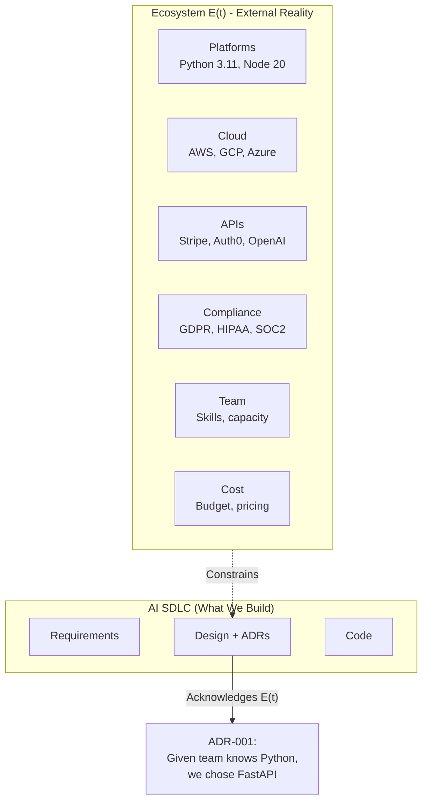

# AI-Augmented Software Development Lifecycle (AI SDLC)

## A Complete Methodology for Intent-Driven Development with AI

---

# Slide 1: The Problem

## AI Coding Assistants Are Powerful but Chaotic

**Current State of AI-Assisted Development:**

- **No Methodology**: Developers use AI ad-hoc with no standardized process
- **Lost Context**: AI forgets discussions; developers re-explain repeatedly
- **Quality Varies Wildly**: TDD ignored, technical debt accumulates
- **Enterprise Gap**: Can't use AI for regulated workloads (no traceability)
- **Each Team Reinvents**: No shared framework; every team creates their own prompts

```
Developer → AI → Code → ???
    ↑                    ↓
    └── No feedback ←────┘
```

> *"We have powerful AI tools but no discipline for using them."*

---

# Slide 2: The Vision

## AI Assistance with the Rigor of Traditional SDLC, but 10× Faster

**AI SDLC Core Promise:**

| Traditional SDLC | Ad-hoc AI | AI SDLC |
|-----------------|-----------|---------|
| Rigorous but slow | Fast but chaotic | Rigorous AND fast |
| Full traceability | No traceability | Full traceability |
| Human-only | AI-only decisions | Human decides, AI accelerates |
| Static requirements | No requirements | Living requirements |

**Key Insight**: Requirements become a *control system* (like a thermostat), not a static document.

---

# Slide 3: Theoretical Foundation

## Requirements as Homeostasis Model


**Revolutionary Concept:**

- **Traditional**: Requirements = fixed specifications (written once, forgotten)
- **AI SDLC**: Requirements = living control system (continuously compared to runtime)

**Example**:
- Requirement: "Login < 2 seconds (p95)"
- Runtime detects: 5 seconds → Deviation → New intent: "Optimize login"
- New cycle completes → 1.2 seconds → Homeostasis restored

---

# Slide 4: The 7-Stage Pipeline

## Complete Lifecycle with Full Traceability

```mermaid
flowchart LR
    INT["🎯 Intent"] --> REQ["📋 Requirements"]
    REQ --> DES["🏗️ Design"]
    DES --> TASKS["📝 Tasks"]
    TASKS --> CODE["💻 Code"]
    CODE --> ST["🧪 System Test"]
    ST --> UAT["✅ UAT"]
    UAT --> RUNTIME["🚀 Runtime"]
    RUNTIME -.->|"Feedback Loop"| INT

    style INT fill:#e1f5fe
    style RUNTIME fill:#e8f5e9
```



| Stage | Input | Output | AI Agent |
|-------|-------|--------|----------|
| **Requirements** | Intent | REQ-F-*, REQ-NFR-*, BDD | Requirements Agent |
| **Design** | Requirements | Components, APIs, ADRs | Design Agent |
| **Tasks** | Design | Jira tickets tagged with REQ | Tasks Agent |
| **Code** | Tasks | TDD code, unit tests | Code Agent |
| **System Test** | Code | BDD integration tests | QA Agent |
| **UAT** | Tested build | Business sign-off | UAT Agent |
| **Runtime** | Deployed system | Telemetry, new intent | Feedback Agent |

---

# Slide 5: The Golden Thread

## Requirement Traceability from Intent to Runtime


**Every artifact tagged with REQ keys:**

```python
# Code: Implements: REQ-F-AUTH-001
def authenticate(email: str, password: str) -> AuthResult:
    ...

# Test: Validates: REQ-F-AUTH-001
def test_user_login():
    ...

# Log: Tagged with REQ key
logger.info("Login failed", extra={"req": "REQ-F-AUTH-001"})
```

---

# Slide 6: Code Stage - TDD + Key Principles

## The Heart of Quality: No Code Without Tests

```mermaid
flowchart LR
    RED["🔴 RED<br/>Write failing test"] --> GREEN["🟢 GREEN<br/>Minimal code to pass"]
    GREEN --> REFACTOR["🔵 REFACTOR<br/>Improve quality"]
    REFACTOR --> COMMIT["✅ COMMIT<br/>Save with REQ key"]
    COMMIT --> RED
```



### The Key Principles (Code Stage Foundation)

| # | Principle | Mantra |
|---|-----------|--------|
| 1 | **Test Driven Development** | "No code without tests" |
| 2 | **Fail Fast & Root Cause** | "Break loudly, fix completely" |
| 3 | **Modular & Maintainable** | "Single responsibility, loose coupling" |
| 4 | **Reuse Before Build** | "Check first, create second" |
| 5 | **Open Source First** | "Suggest alternatives, human decides" |
| 6 | **No Legacy Baggage** | "Clean slate, no debt" |
| 7 | **Perfectionist Excellence** | "Best of breed only" |

**Ultimate Mantra**: *"Excellence or nothing"* 🔥

---

# Slide 7: BDD - Executable Specifications

## Business-Readable Tests That Validate Requirements

**System Test Stage (Technical BDD):**

```gherkin
Feature: User Authentication
  # Validates: REQ-F-AUTH-001

  Scenario: Successful login
    Given a user exists with email "user@example.com"
    When they log in with correct password
    Then authentication succeeds
    And a session token is returned
```

**UAT Stage (Business BDD - No Technical Jargon):**

```gherkin
Feature: Customer Self-Service Portal

  Scenario: Customer views account
    Given I am logged in as a customer
    When I navigate to my dashboard
    Then I should see my account balance
    And I should see my recent transactions
```

**Coverage Requirements:**
- Unit tests: ≥80% (critical paths 100%)
- BDD scenarios: Every REQ must have ≥1 scenario
- Requirement coverage: ≥95%

---

# Slide 8: Ecosystem-Aware Development

## Acknowledging External Reality: E(t)



**Key Distinction:**
- **E(t) is GIVEN** (external reality we operate within)
- **Design is CHOSEN** (decisions we make given E(t))

**ADRs document**: "Given these ecosystem constraints, we chose X"

---

# Slide 9: What Makes AI SDLC Unique

## Differentiators from Traditional and Ad-hoc Approaches


| Feature | Traditional | Ad-hoc AI | AI SDLC |
|---------|------------|-----------|---------|
| **Traceability** | Manual, partial | None | Automatic, complete |
| **Requirements** | Static docs | None | Living control system |
| **Quality Gates** | Human review | None | Automated + Human |
| **Feedback Loop** | Quarterly | None | Continuous |
| **AI Role** | None | Uncontrolled | Augmenter (human decides) |
| **Context** | Lost in docs | Lost each session | Persistent workspace |

**Unique to AI SDLC:**
1. ✅ Requirements as homeostasis (self-correcting system)
2. ✅ REQ key propagation (intent → runtime → back to intent)
3. ✅ Ecosystem-aware ADRs (E(t) explicitly acknowledged)
4. ✅ Sub-vectors (concurrent AI SDLCs for complex activities)
5. ✅ Federated plugin architecture (corporate → team → project)

---

# Slide 10: Sub-Vectors - Concurrent Development

## Complex Activities Spawn Their Own AI SDLC


**Single developer orchestrates multiple AI agents:**
- Main code agent: Develops authentication feature
- UAT test agent: Simultaneously develops test coverage
- Data agent: Builds analytics pipeline

**Synchronization**: Shared requirement keys provide natural integration points

---

# Slide 11: Complete Walkthrough

## REQ-F-AUTH-001: From Intent to Runtime

```mermaid
flowchart TB
    subgraph Stage1["1. Requirements"]
        I["Intent: Users need secure login"]
        R["REQ-F-AUTH-001:<br/>User login with email/password"]
        BDD1["BDD: Given user exists...<br/>When login with correct password...<br/>Then authentication succeeds"]
    end

    subgraph Stage2["2. Design"]
        COMP["AuthenticationService"]
        API["POST /api/v1/auth/login"]
        ADR["ADR-001: JWT tokens<br/>(team knows, stateless)"]
    end

    subgraph Stage3["3. Tasks"]
        JIRA["PORTAL-101:<br/>Implement AuthService<br/>Tags: REQ-F-AUTH-001"]
    end

    subgraph Stage4["4. Code (TDD)"]
        TEST["def test_user_login():<br/>  # Validates: REQ-F-AUTH-001"]
        CODE["def authenticate():<br/>  # Implements: REQ-F-AUTH-001"]
    end

    subgraph Stage5["5-6. Test & UAT"]
        SYS["System Test: ✅ Pass"]
        UAT["UAT: Business approves ✅"]
    end

    subgraph Stage7["7. Runtime"]
        METRIC["auth_success_rate{req='REQ-F-AUTH-001'}"]
        ALERT["Alert: Auth timeout spike"]
        NEW["New Intent: Fix auth timeout"]
    end

    I --> R --> BDD1
    BDD1 --> COMP --> API --> ADR
    ADR --> JIRA
    JIRA --> TEST --> CODE
    CODE --> SYS --> UAT
    UAT --> METRIC
    METRIC --> ALERT --> NEW
    NEW -.->|"Feedback Loop"| I
```



---

# Slide 12: Getting Started

## Three Paths to Adoption

### Quick Start (5 minutes)
```bash
# Install Claude Code plugin
/plugin marketplace add foolishimp/ai_sdlc_method
/plugin install @aisdlc/aisdlc-methodology

# Claude now follows 7-stage methodology
```

### Full Setup (30 minutes)
```bash
# Clone and install workspace
git clone https://github.com/foolishimp/ai_sdlc_method
python installers/setup_workspace.py /your/project
python installers/setup_commands.py /your/project
```

### Enterprise Deployment
```
Corporate Marketplace
  └─ aisdlc-methodology
  └─ python-standards
       ↓
Division Marketplace
  └─ payment-services-standards
       ↓
Project Plugin
  └─ customer-portal-context
```

---

## Summary: Why AI SDLC?

| Benefit | How |
|---------|-----|
| **10× Faster** | AI accelerates every stage |
| **Full Traceability** | REQ keys from intent to runtime |
| **Self-Correcting** | Homeostasis model auto-generates intent |
| **Enterprise Ready** | Audit trails, compliance, governance |
| **Quality Built-In** | TDD mandatory, BDD validation |
| **Future-Proof** | Requirements control AI-generated code |

**The Bottom Line:**

> *"AI SDLC gives you the speed of AI with the discipline of traditional engineering."*

---

## Resources

- **Repository**: [github.com/foolishimp/ai_sdlc_method](https://github.com/foolishimp/ai_sdlc_method)
- **Examples**: [github.com/foolishimp/ai_sdlc_examples](https://github.com/foolishimp/ai_sdlc_examples)
- **Documentation**: `docs/requirements/AI_SDLC_OVERVIEW.md`
- **Full Methodology**: `docs/requirements/AI_SDLC_REQUIREMENTS.md` (3,300+ lines)

---

*"Excellence or nothing"* 🔥

**Version**: 1.0
**Date**: February 2026
