# Constraint-Emergence Ontology

## A Foundational Framework for Reality and Computation

*Exploring structural invariants across physics, computation, and engineered systems*

---

# Slide 1: Introduction

## What is This Document?

**Philosophy, not physics** - but science starts with philosophy.

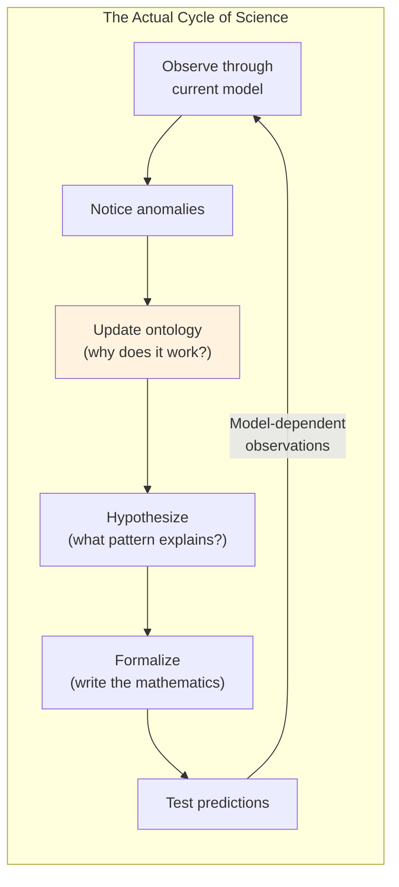

**We are here**: At the "update ontology" stage - refining conceptual models based on what computation, AI, and modern physics have revealed.

**Key insight**: Observation is never raw - we always observe *through* a model. A better model reveals phenomena a worse model hides.

---

# Slide 2: The Central Claim

## Structural Realism About Dynamics

> **The invariants of reality live in the structure of admissible transformations, not in the material being transformed.**

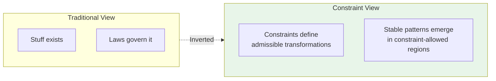

**The shift**: From "what things ARE" to "what transformations are ALLOWED"

---

# Slide 3: The Level of Abstraction

## Not About Substance - About Structure

This framework operates at the level of **the structure of change itself**.

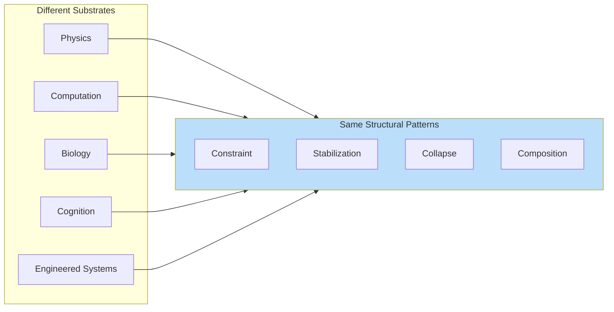

**The claim**: These recurring patterns are not coincidental - they reflect structural invariants that persist across substrates.

---

# Slide 4: Category Theory as Philosophical Orientation

## Morphisms Over Objects

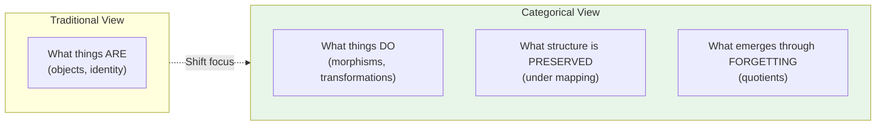

**Category theory privileges**:
- **Morphisms over objects** - what things *do* over what things *are*
- **Structure-preservation over identity** - family resemblance over strict equivalence
- **Quotients over constructions** - emergence through forgetting irrelevant distinctions

---

# Slide 5: Constraint as a Morphism-Level Concept

## What Constraints Actually Are

> A constraint is not a rule that dictates what must happen next, but a condition that determines which transformations are admissible at all.

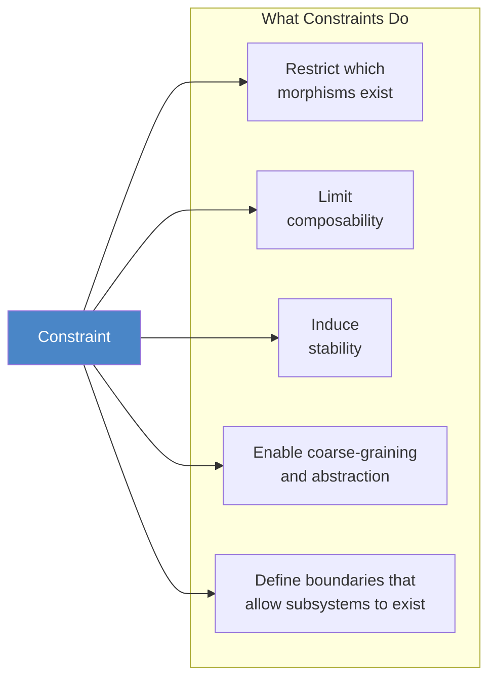

**Key insight**: Without constraint, everything is permitted - and nothing persists.

---

# Slide 6: Universal Computation vs. Inhabitable Reality

## The Division of Labor

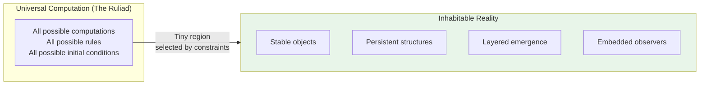

| Programme | Question |
|-----------|----------|
| **Universal computation** | What is *possible*? |
| **Constraint-emergence** | What is *inhabitable*? |

**The question**: Why do only tiny regions of all possible computations resemble physics, minds, or stable systems?

---

# Slide 7: Emergence as Quotienting

## Emergence Through Forgetting

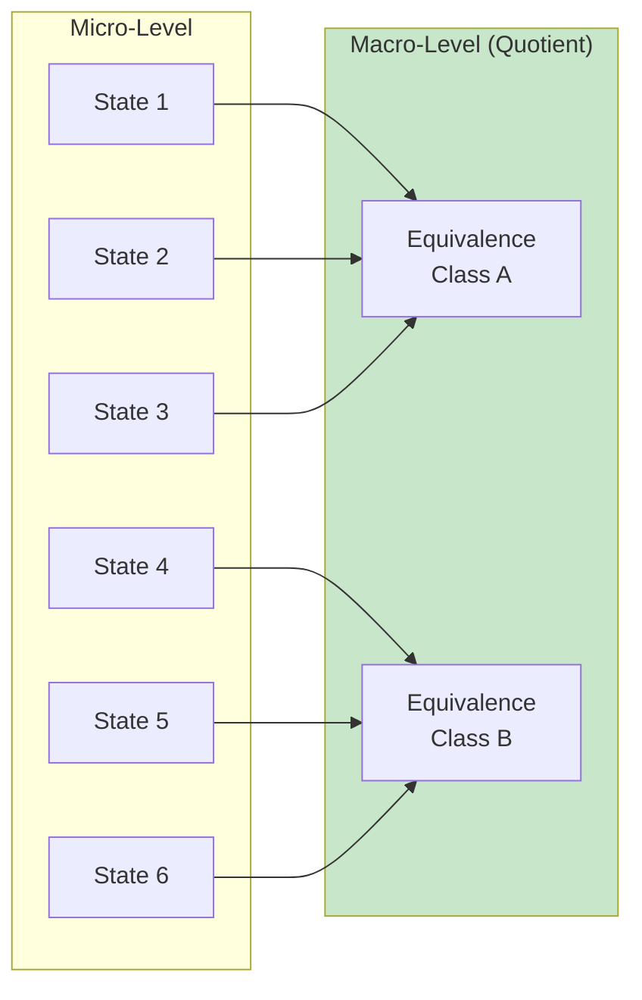

**Emergence is passing to a quotient structure**:
- Collapsing many micro-states into effective macro-states
- Identifying equivalence classes of transformations
- Replacing detailed dynamics with higher-level invariants

This appears in: renormalization, abstraction boundaries, interface design, modular software, semantic stabilization in LLMs.

---

# Slide 8: Reality as a Self-Consistent Constraint System

## The Fundamental Substrate

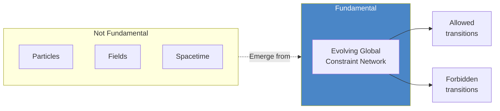

**The universe**: One gigantic coupled dynamical system. We carve it into "fields" because symmetry decomposition makes equations tractable - but the decomposition is computational bookkeeping, not ontological.

---

# Slide 9: Markov Objects - Stable Constraint Patterns

## The Universal Concept of Stable Emergence

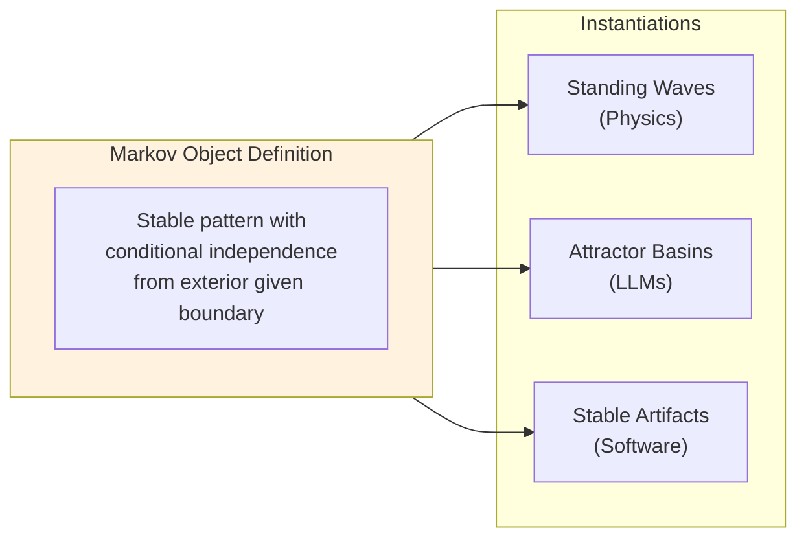

**Defining property**: Internal dynamics are conditionally independent of external dynamics given the boundary state.

| Domain | Markov Object | Boundary |
|--------|--------------|----------|
| Physics | Particle, Atom | Potential well |
| LLM | Coherent concept | Context window |
| SDLC | Approved artifact | Interface contract |

---

# Slide 10: Fields as Constraint Geometry

## The Nerf Ball Model

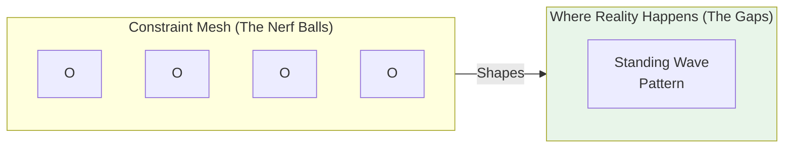

**Fields are not "stuff that exists"** - they are the structure of allowable constraint configurations.

- The field IS the mesh (the nerf balls)
- The particle IS the pattern in the gaps
- Different "fields" = different mesh densities and topologies

---

# Slide 11: The Hierarchy of Constraint Resolution

## The Engine of Emergence

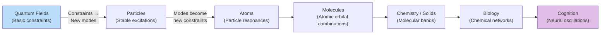

**The recursive loop**: Constraints → Modes → New constraints → New modes → ...

At every level, stable patterns become the walls for the next level's standing waves.

---

# Slide 12: Hilbert Space is Compression

## The Map is Not the Territory

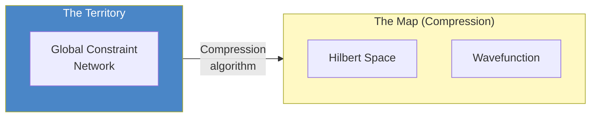

**The wavefunction**: A complete encoding of everything the theory says is predictively accessible - not a physical object, but bookkeeping of the constraint structure.

| | What it is | What Platonists claim |
|---|-----------|---------------------|
| **Laws of physics** | Descriptions, models, compression | The fundamental reality itself |
| **Physics itself** | The actual constraint network | Derivative of the laws |

---

# Slide 13: Collapse is Constraint Locking

## Not a Physical Discontinuity

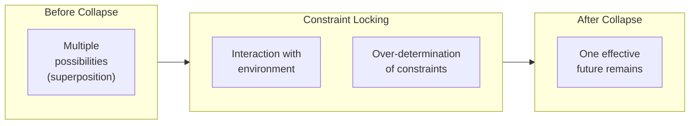

**Three processes involved**:
1. **Global deterministic evolution** - Full constraint network evolves smoothly
2. **Constraint locking (decoherence)** - System entangles with environment
3. **Information projection** - Observer updates description as alternatives become inaccessible

---

# Slide 14: Motion is Pattern Propagation

## Nothing Travels Through Space

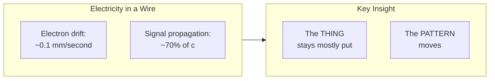

| System | "Particle" | What Actually Propagates |
|--------|-----------|-------------------------|
| Wire | Electron | EM field disturbance |
| Sound | Air molecule | Pressure wave |
| Ocean | Water molecule | Energy pattern |
| Constraint network | Markov object | Constraint pattern |

**The speed of light reframed**: c is not a "speed limit on things" - it is the constraint network's propagation rate.

---

# Slide 15: Spacetime is Emergent

## Scale-Dependent Time

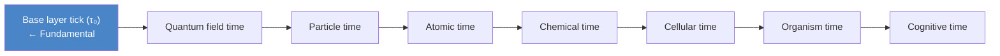

| Emergence Layer | Timescale | What "Changes" |
|-----------------|-----------|----------------|
| Quantum fields | ~10⁻⁴³ s | Network micro-updates |
| Particles | ~10⁻²³ s | Field excitations |
| Atoms | ~10⁻¹⁵ s | Orbital transitions |
| Cognition/LLMs | ms to hours | Inference, learning |

**Time at any scale** = rate of change upon that scale's emergent constraint plane.

---

# Slide 16: Gravity as Emergent from Constraint Density

## The Nerf Ball Thought Experiment

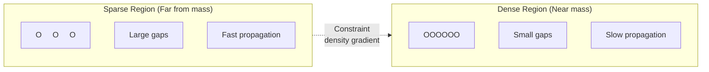

**Near a superdense object**:
- Constraint network maximally compressed
- Updates propagate through "thicker" medium
- Time slows (local update rate decreases)
- Space "stretches" (more constraint structure per coordinate)

**This unifies three phenomena**:

| Phenomenon | Constraint View | Coordinate View |
|------------|-----------------|-----------------|
| Time dilation | Same tick rate | Fewer ticks per second |
| Length contraction | Same standing wave | Fewer coordinate units |
| Variable c | Same propagation rate | Fewer units per tick |

---

# Slide 17: The Platonist vs. Aristotelian Fork

## Mathematical Existence vs. Ontological Existence

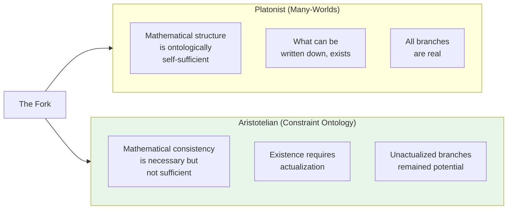

| Concept | Platonist | Aristotelian |
|---------|-----------|--------------|
| Superposition | Multiple actual states | Potentialities |
| Wavefunction | The real thing | Description of potentiality |
| Collapse | Illusion | Actualization |
| Unobserved branches | Real but inaccessible | Never actual |

---

# Slide 18: The Honest Disagreement

## Same Formalism, Different Metaphysics

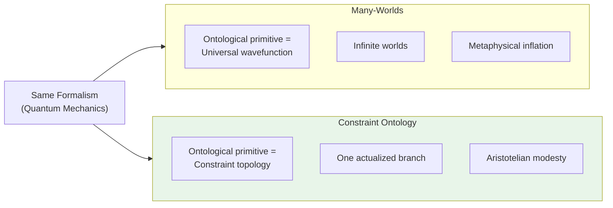

**The response to "you're adding collapse"**:

> "You're adding branches. Infinite branches, unobservable in principle. I add nothing. I say mathematics describes potentiality, and potentiality is not actuality. That is subtraction, not addition."

---

# Slide 19: The 22 Consolidated Principles

## The Complete Ontology

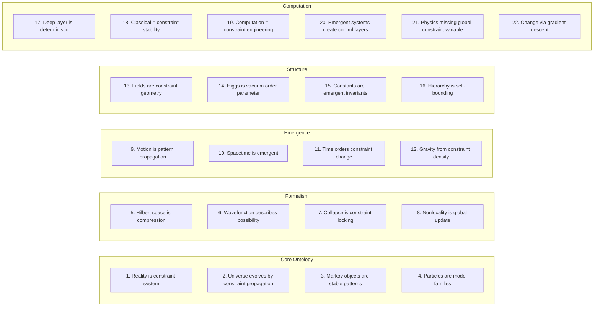

---

# Slide 20: The Isomorphism - Physics, LLMs, SDLC

## Same Structure, Different Substrates


---

# Slide 21: The Unified Correspondence Table

## Precise Mapping Across Domains

| Concept | Physical Reality | LLM | SDLC |
|---------|------------------|-----|------|
| **Constraint manifold** | Global constraint network | Learned distribution | Requirements stack |
| **Update rule** | Hamiltonian flow | D(x,c) via attention | Builder transitions |
| **Interference** | Amplitude superposition | Soft unification | Design alternatives |
| **Markov object** | Particle | Attractor basin | Approved artifact |
| **Collapse** | Decoherence | Sampling | Deploy |
| **Instability** | Decay / scattering | Hallucination | Failed tests |
| **Boundary** | Potential well | Context / prompt | NFRs, SLAs |

**This is not analogy** - these are the same formal objects in different substrates.

---

# Slide 22: SDLC as Constraint Engine

## The Full Mapping

```mermaid
flowchart LR
    subgraph ConstraintStack["SDLC Constraint Manifold"]
        REQ["Requirements<br/>(functional, NFR, risk, SLA)"]
        ARCH["Architecture Context<br/>(tech stack, patterns, ADRs)"]
        DATA["Data Architecture<br/>(models, schemas, lineage)"]
        STD["Coding & Data Standards"]
    end

    subgraph OntologyTerms["Ontology Terms"]
        INTENT["Intent = Initial constraint bundle"]
        ASSETS["Assets = Standing patterns"]
        OPS["Operators = Constraint transformations"]
        ENV["Environment = Irreducible world"]
        COLL["Collapse = Commit/release"]
    end

    ConstraintStack --> OntologyTerms
```

**AI SDLC**: A system that repeatedly applies transformations until constraints lock into a stable artifact.

---

# Slide 23: The Two Compute Regimes

## Probabilistic Expansion, Deterministic Contraction

```mermaid
flowchart LR
    subgraph Prob["Probabilistic Compute"]
        P1["LLM generation"]
        P2["Retrieval"]
        P3["Heuristic scoring"]
    end

    subgraph Det["Deterministic Compute"]
        D1["Build + Tests"]
        D2["Static analysis"]
        D3["Schema validation"]
        D4["Security gates"]
    end

    Prob -->|"Propose"| Det
    Det -->|"Dispose"| LOCK["Lock<br/>(Collapse)"]

    style Prob fill:#bbdefb
    style Det fill:#c8e6c9
    style LOCK fill:#fff3e0
```

**Clean rule**: Probabilistic compute may propose. Deterministic compute must dispose.

```
Stochastic expansion (explore) → Deterministic contraction (verify) → Lock (collapse)
```

This is literally **"explore → constrain → collapse"** - the same pattern as physical reality.

---

# Slide 24: The Computational Engine - Gradient Descent

## The Fundamental Operation of All Computation

```mermaid
flowchart LR
    subgraph Engine["The Universal Engine"]
        LAND["The Landscape<br/>(Manifold shaped by constraints)"]
        EVAL["The Evaluator<br/>(Senses the 'slope')"]
        MOVE["The Move<br/>(Favors the pre-order)"]
    end

    LAND --> EVAL --> MOVE
    MOVE -->|"New position"| LAND
```

| Component | Physics | LLM | SDLC |
|-----------|---------|-----|------|
| **Landscape** | Potential wells | Learned distribution | Requirement stack |
| **Evaluator** | Field interactions | Attention mechanism | Builder (Agent) |
| **Move** | Pattern propagation | Token sampling | Code change |

**The profound implication**: Gradient descent explains emergence without a designer. The system rolls "downhill" into increasingly complex, nested attractor basins.

---

# Slide 25: SDLC as Optimization Loop

## Engineering a Gradient

```mermaid
flowchart LR
    HIGH["High Energy<br/>(Many failed tests,<br/>missing features)"]

    WORK["Gradient Descent<br/>(Builder work)"]

    LOW["Low Energy<br/>(All tests pass,<br/>stable artifact)"]

    HIGH -->|"Transform"| WORK
    WORK -->|"Minimize"| LOW

    style HIGH fill:#ffccbc
    style LOW fill:#c8e6c9
```

**Software development is engineering a gradient**:
- **Energy** = unsatisfied constraints (failed tests, missing features)
- **Work** = Builder traversing gradient, transforming code
- **Ground State** = local minimum where gradient flattens (Markov object formed)

---

# Slide 26: Hallucination as Instability

## Leaving the Stable Manifold Region

```mermaid
flowchart LR
    subgraph Stable["Well-Constrained Region"]
        ATTR["Deep Attractor<br/>(Markov object)"]
        TRAJ1["Trajectory →"]
    end

    subgraph Chaotic["Sparse/Chaotic Region"]
        CHAOS["No stable attractors"]
        TRAJ2["← Divergent trajectory"]
    end

    Stable -->|"Exit"| Chaotic

    style Stable fill:#c8e6c9
    style Chaotic fill:#ffccbc
```

**Hallucination is not "making things up"** - it's leaving the stable manifold region.

**What predicts hallucination-equivalent failures?**
- Few tests (weak constraint boundaries)
- Unclear requirements (undefined potential well)
- Novel architecture (no established attractors)

---

# Slide 27: SDLC Analogues to Physics

## Precise Correspondences

| Physics Concept | SDLC Analogue |
|-----------------|---------------|
| **Entanglement** | Shared dependencies (common interfaces, data contracts) |
| **Decoherence** | Integration/deployment (artifact "decoheres" into production) |
| **Decay** | Technical debt accumulation |
| **Particle creation** | Create (new capability) |
| **Scattering** | Update (change behavior) |
| **Annihilation** | Delete (decommission) |

**Shared dependencies are "entanglement"**: Two artifacts are entangled when they share constraint structure. Changing one requires updating the other. The coupling is non-local in the codebase.

---

# Slide 28: The Meta-Principle

## Truth as Markov Object

```mermaid
flowchart LR
    subgraph MetaPrinciple["Truth = Markov Object in Constraint Manifold"]
        PHYS["Physics:<br/>Stable standing waves<br/>persisting under perturbation"]
        LLM["LLMs:<br/>Attractor basins where<br/>sequences remain coherent"]
        SDLC["Software:<br/>Artifacts that pass all constraints<br/>and resist perturbation"]
    end

    style MetaPrinciple fill:#fff3e0
```

**All three domains**:
```
Physical manifold     → particles, spacetime, gravity
LLM probability space → concepts, reasoning, generation
SDLC constraint space → requirements, code, verified artifacts
```

All are constraint satisfaction systems producing emergent stability.

---

# Slide 29: Research Directions

## What This Framework Suggests

```mermaid
flowchart LR
    subgraph Near["Near-Term (Accessible)"]
        LLM_LAB["LLMs as Constraint<br/>Manifold Laboratories"]
        MECH["Mechanistic<br/>Interpretability"]
    end

    subgraph Medium["Medium-Term"]
        GRAV_ENT["Gravity-Entanglement<br/>Correspondence"]
        VAR_C["Variable-c<br/>Precision Tests"]
    end

    subgraph Long["Long-Term"]
        MASS["Derive Proton-Electron<br/>Mass Ratio (~1836)"]
        FORM["Constraint Network<br/>Mathematics"]
    end

    Near --> Medium --> Long
```

**The concrete test**: Derive one "arbitrary" constant from constraint topology. A single success would validate the entire approach.

---

# Slide 30: Key Influences

## Standing on Shoulders

```mermaid
flowchart LR
    subgraph Philosophy["Philosophy"]
        DEC["Terrence Deacon<br/>(Absential causation)"]
        SOLMS["Mark Solms<br/>(Consciousness)"]
        HAWK["Jeff Hawkins<br/>(Reference frames)"]
    end

    subgraph Physics["Physics"]
        BOHM["David Bohm<br/>(Implicate order)"]
        THOOFT["Gerard 't Hooft<br/>(Deterministic substratum)"]
        WHEEL["John Wheeler<br/>(It from bit)"]
        SMOL["Lee Smolin<br/>(Relational space)"]
        UNZ["Alex Unzicker<br/>(Conceptual clarity)"]
    end

    subgraph Math["Mathematics"]
        ATI["Michael Atiyah"]
        WIT["Edward Witten"]
        WILS["Kenneth Wilson<br/>(Renormalization)"]
    end

    subgraph Emergence["Emergence"]
        LEV["Michael Levin<br/>(Topological order)"]
        WEN["Xiao-Gang Wen<br/>(String-net)"]
        WOLF["Stephen Wolfram<br/>(Ruliad)"]
    end
```

---

# Slide 31: The Edinburgh Error

## Map/Territory Confusion at the Social Level

```mermaid
flowchart LR
    subgraph Valid["Valid Insight"]
        V1["Social position affects<br/>which questions get asked"]
    end

    subgraph Invalid["Invalid Extension"]
        I1["Therefore there are<br/>no objective answers"]
    end

    Valid -.->|"Does NOT<br/>follow"| Invalid

    subgraph Clarification["Constraint Ontology Clarifies"]
        C1["Questions we ask =<br/>socially shaped"]
        C2["Answers reality gives =<br/>NOT socially shaped"]
    end

    style Clarification fill:#e8f5e9
```

| Level | Status of beliefs/models |
|-------|-------------------------|
| Base constraint network | Indifferent - beliefs don't change physics |
| Social emergent plane | Causal - beliefs ARE constraints here |
| Individual behavior | Shaped by social constraint landscape |

**The Edinburgh error**: Concluding that because social beliefs shape social reality, *base reality* is also just belief.

---

# Slide 32: Connection to AI SDLC Methodology

## The Deep Inheritance

```mermaid
flowchart LR
    subgraph Ontology["Constraint-Emergence Ontology"]
        O_CONST["Constraints define<br/>admissible change"]
        O_MARKOV["Stable patterns<br/>emerge"]
        O_FEEDBACK["Feedback maintains<br/>homeostasis"]
    end

    subgraph AISDLC["AI SDLC Methodology"]
        A_REQ["Requirements as<br/>living control system"]
        A_ART["Artifacts as<br/>Markov objects"]
        A_LOOP["Observer/Evaluator<br/>governance loop"]
    end

    O_CONST -->|"Instantiates as"| A_REQ
    O_MARKOV -->|"Instantiates as"| A_ART
    O_FEEDBACK -->|"Instantiates as"| A_LOOP
```

**The AI SDLC methodology inherits this structure**:
- Intent generates constraints
- Constraints shape artifacts through probabilistic and deterministic operators
- Stable artifacts emerge through constraint satisfaction
- Feedback loops maintain homeostasis

---

# Slide 33: Final Statement

## The Synthesis

```mermaid
flowchart LR
    subgraph Reality["Reality"]
        R["Self-organizing constraint network"]
    end

    subgraph Projections["What We Observe"]
        PART["Particles<br/>(Markov objects)"]
        SPACE["Spacetime<br/>(Emergent canvas)"]
        GRAV["Gravity<br/>(Constraint density)"]
        HILB["Hilbert Space<br/>(Compression)"]
    end

    Reality --> Projections

    subgraph Computation["Computation / SDLC"]
        SDLC["Same architecture<br/>in different medium"]
    end

    Reality --> Computation

    style Reality fill:#4a86c7,color:#fff
```

> Reality can be described as a self-organizing constraint network whose stable Markov objects project as particles and spacetime, whose density variations manifest as what we call gravity, whose compression is Hilbert space, and whose evolution produces everything we observe.
>
> The AI SDLC methodology is not merely analogous to physical law - it is an instance of the same abstract structure operating in a different medium.

---

# Slide 34: The Axiom Table

## What This Framework Assumes vs. Conjectures

| Concept | Status | Validation Path |
|---------|--------|-----------------|
| Constraint network substrate | Core axiom | Derive predictions differing from standard physics |
| Markov objects | Definitional + empirical | Testable in LLMs via interpretability |
| Fields as constraint geometry | Interpretive | No test unless predictions differ |
| Base time exists | Axiom | Detect Planck-scale discreteness |
| Constants are emergent | Conjecture | Derive one constant from topology |
| Spacetime is emergent | Shared with other programs | Consistent with ER=EPR, AdS/CFT |
| Collapse = constraint locking | Interpretation | Compatible with decoherence |
| Laws ≠ Physics | Philosophical axiom | Cannot be empirically resolved |
| Gradient descent as engine | Structural claim | Unifies physics, LLMs, SDLC |

**This table is a research agenda** - each validation path is a potential project.

---

# Slide 35: Summary

## What This Framework Provides

```mermaid
flowchart LR
    subgraph Provides["What It Provides"]
        BRIDGE["Bridge between physics,<br/>computation, and AI"]
        SUGGEST["Suggests where new<br/>mathematics might be found"]
        IDENTIFY["Identifies which questions<br/>are worth formalizing"]
        GROUND["Grounds AI SDLC in<br/>same principles as physics"]
    end

    subgraph NotYet["What It Is Not (Yet)"]
        NOMATH["No new mathematics"]
        NOPRED["No unique predictions"]
        INTERP["Interpretation, not theory"]
    end
```

**The honest position**: This is pre-physics. The value now is conceptual clarity and a generative mental model. Whether it becomes more depends on whether it leads to formalism that makes new predictions.

**You cannot formalize what you cannot conceive.**

---

*This presentation synthesizes the Constraint-Emergence Ontology as a foundational framework for understanding reality, computation, and engineered systems through the common lens of constraint satisfaction.*

**Document Version**: 1.1
**Date**: February 2026
