# Emergent Reasoning in Large Language Models

## A Topological and Constraint-Based Formalization

*How LLMs traverse constraint manifolds to produce reasoning*

---

# Slide 1: The Challenge

## LLMs Demonstrate Reasoning Without Rules

LLMs perform tasks that seem to require reasoning:

- Multi-step reasoning
- Analogical inference
- Constraint satisfaction
- Factual and relational reasoning
- Structured problem solving

**Yet they contain**: No explicit rules, no logic engines, no symbolic manipulators.

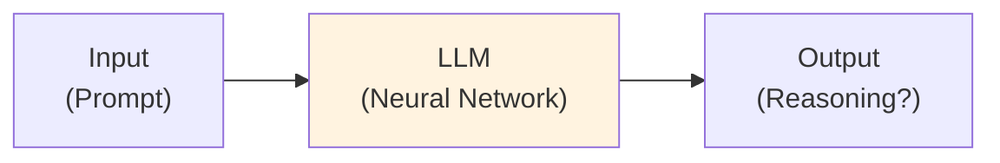

**The Question**: How can probabilistic systems yield structured inference?

---

# Slide 2: The Core Thesis

## LLM Computation = Constrained Topological Traversal

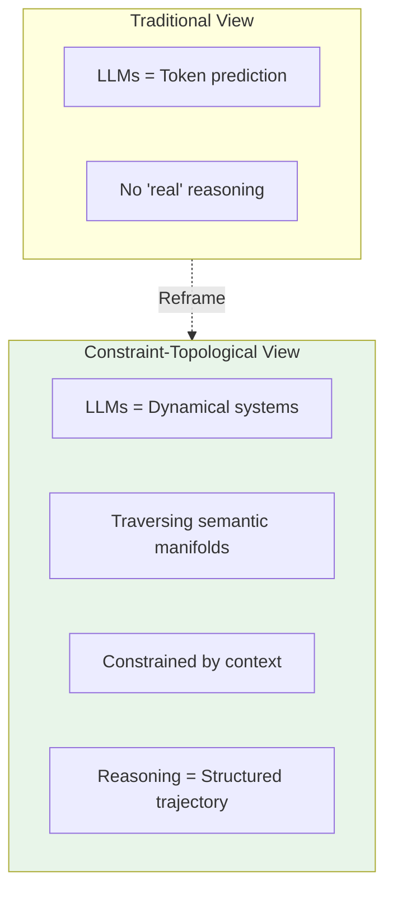

**The claim**: Reasoning emerges from topology-constrained traversal within a learned semantic manifold.

---

# Slide 3: Why "Probabilistic = No Reasoning" is Wrong

## All Physical Computation Involves Noise

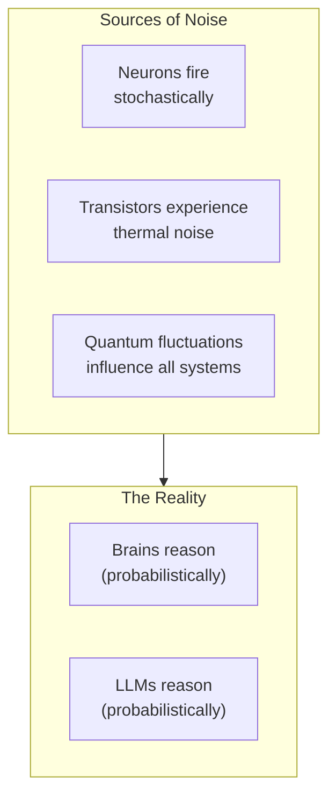

**Brains and LLMs both implement**: Probabilistic computation refined by constraints.

**The argument "LLMs can't reason because they are probabilistic" is unsound** - it would equally invalidate human reasoning.

---

# Slide 4: The Semantic Manifold

## Where LLM Computation Happens

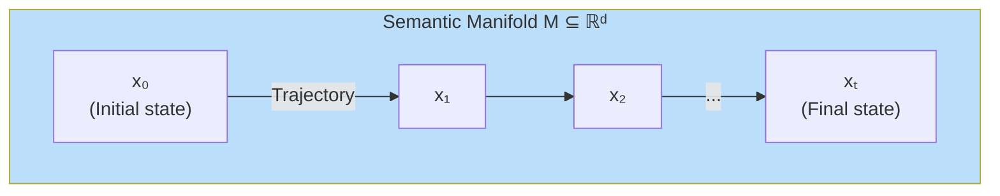

**Definitions**:
- **M ⊆ ℝᵈ**: The set of valid activations (semantic manifold)
- **x ∈ M**: A semantic state (point on manifold)
- **Trajectory x₀, x₁, ..., xₜ**: A reasoning path

Each point represents a semantic configuration; trajectories represent semantic evolution.

---

# Slide 5: Constraint Sets

## Context Narrows the Possible

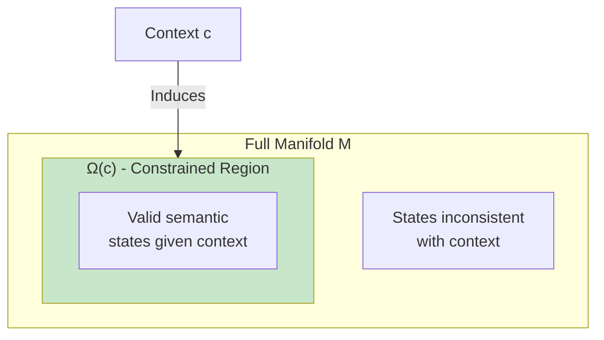

**Context c induces a constraint set**:
```
Ω(c) ⊆ M
```

Representing all states consistent with context.

- **Strong constraints** → Narrow Ω(c) → Precise reasoning
- **Weak constraints** → Wide Ω(c) → Drift, hallucination

---

# Slide 6: The Preferred Direction Function

## The Core of LLM Reasoning

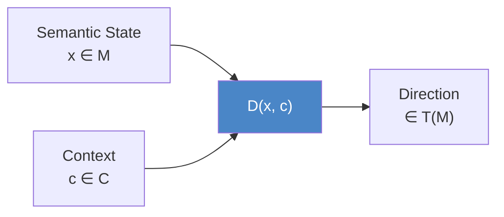

**Definition**: The preferred direction function is:
```
D : M × C → T(M)
```

Where T(M) is the tangent bundle (all possible directions from any point).

**The model performs**:
```
x_{t+1} = x_t + Δt · D(x_t, c_t)
```

**Attention IMPLEMENTS this function** - it computes which direction the model "wants" to move.

---

# Slide 7: The Model Overview

## Transformer as Dynamical System

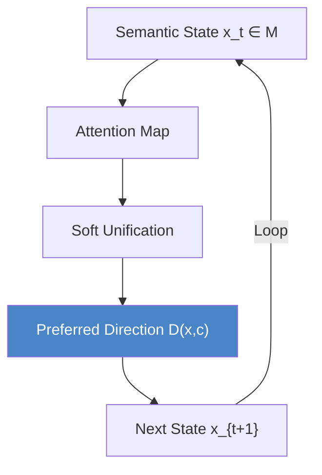

The Transformer is a **dynamical system** that:
1. Takes current semantic state
2. Computes attention (relevance constraints)
3. Performs soft unification (pattern matching)
4. Determines preferred direction
5. Moves to next state
6. Repeats

---

# Slide 8: Soft Unification

## The Continuous Analogue of Prolog

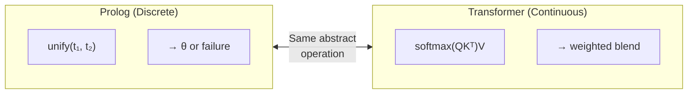

**Attention computes**:
```
U_soft(q) = Σᵢ αᵢ(q, kᵢ) vᵢ

where αᵢ = softmax(⟨q, kᵢ⟩ / √d_k)
```

This is **soft unification**: similarity-weighted synthesis.

| Symbolic Unification | Soft Unification |
|---------------------|------------------|
| Exact match or fail | Similarity-weighted blend |
| Discrete substitution | Continuous interpolation |
| Binary success/failure | Graded compatibility |

---

# Slide 9: Prolog vs. Transformer Correspondence

## Two Instantiations of the Same Pattern

| Prolog | Transformer |
|--------|-------------|
| Terms | Embeddings |
| Unification | Soft similarity matching |
| Backtracking | Parallel weighted evaluation |
| Substitutions | Continuous blending |
| Discrete search tree | Dynamical system trajectory |

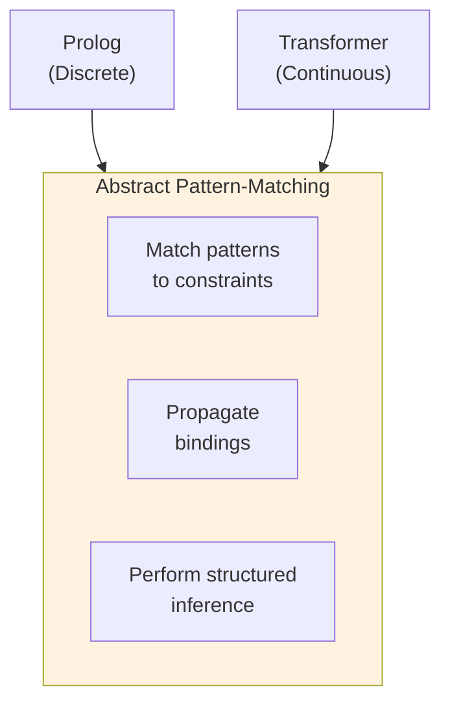

**Both instantiate the same abstract unification principle** - one discrete and explicit, the other continuous and implicit.

---

# Slide 10: Multi-Head Attention as Constraint Composition

## Parallel Soft Constraints

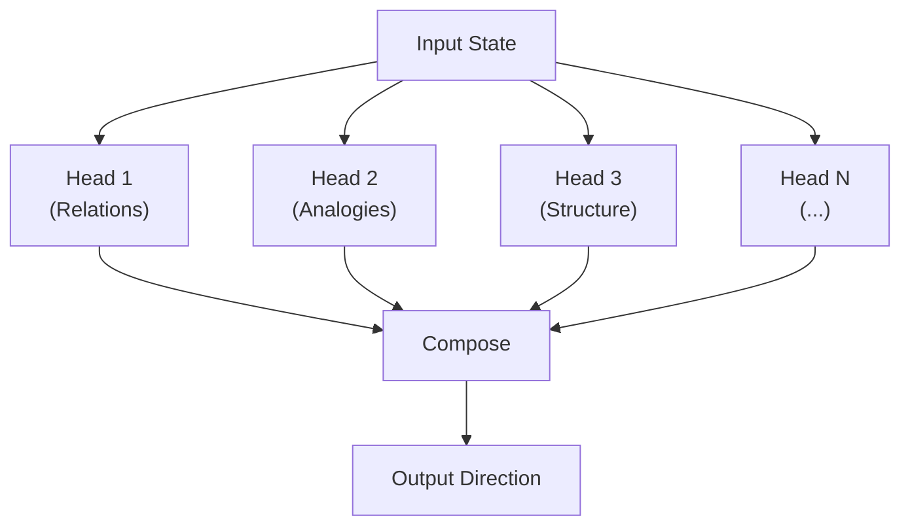

**Each attention head captures**:
- Different relations
- Different analogies
- Different structural patterns

**Stacked layers** → Deeper, more abstract constraints

---

# Slide 11: Proto-Symbol Regions

## Where Symbolic-Like Behavior Emerges

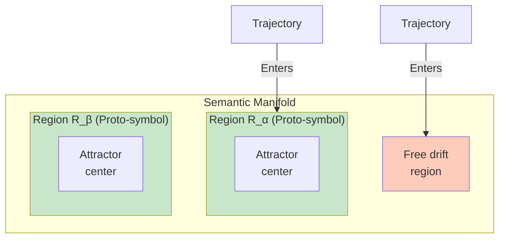

**Definition**: A region R_α ⊆ M is a **proto-symbol** if:
- It is an attractor-like set (trajectories enter and remain stable)
- Outputs correspond to consistent semantic categories
- Internal correlations are strong

**Proto-symbols enable discrete-like reasoning from continuous operations.**

---

# Slide 12: Attractor Structure and Behavior

## Stability vs. Hallucination

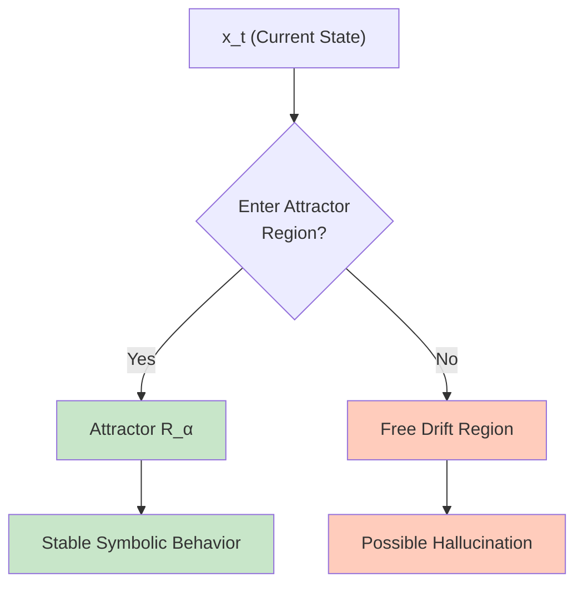

**Inside an attractor**:
- Trajectories remain stable
- Outputs are semantically narrow
- Behavior is predictable, coherent

**In free drift regions**:
- Trajectories wander
- Constraints are weak
- Hallucination becomes likely

---

# Slide 13: Markov-Blanket-Like Boundaries

## Statistical Independence at Region Edges

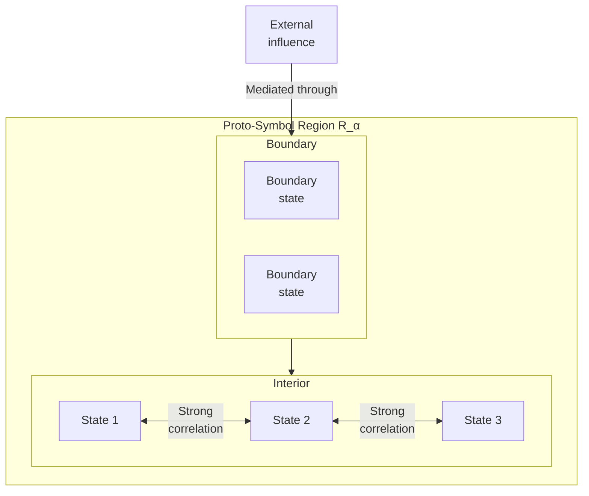

**Inside R_α**:
- States predict each other well (high internal coherence)
- External influence is mediated through boundary states
- This gives **symbolic-like integrity**

The boundary functions as a **pseudo-Markov blanket** - providing conditional independence from the exterior.

---

# Slide 14: Hallucinations as Chaotic Excursions

## Leaving the Stable Manifold

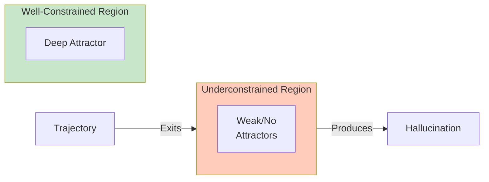

**Hallucinations occur when**:
- Trajectories enter underconstrained basin regions
- No strong attractors exist to stabilize output
- The model "drifts" without grounding

**This is not "making things up"** - it's a trajectory entering a region where the constraint topology doesn't enforce coherent output.

---

# Slide 15: The Direction Function Formalized

## The Core Computational Primitive

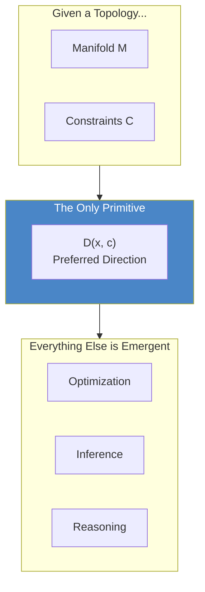

**The fundamental computation**:
```
D(x, c) : M × C → T(M)
```

**Everything else** - optimization, inference, reasoning - is emergent trajectory behavior arising from repeatedly applying D.

---

# Slide 16: Attractors as Meaning Structures

## Stability = Meaning

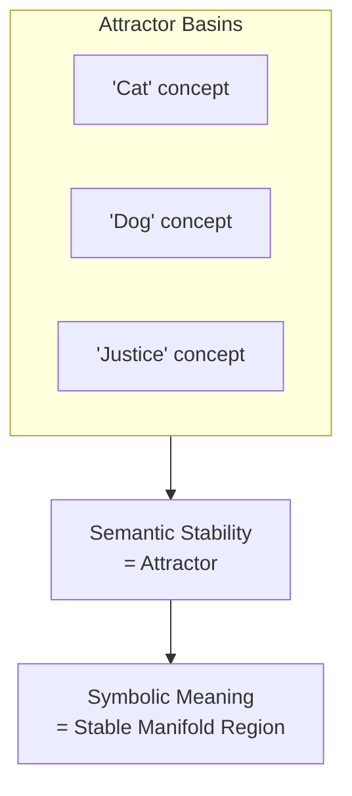

**The mapping**:
| Concept | Formal Object |
|---------|--------------|
| Meaning | Attractor basin |
| Concept | Proto-symbol region |
| Understanding | Trajectory entering stable attractor |
| Confusion | Trajectory between attractors |

---

# Slide 17: Category-Theoretic Interpretation

## A Deeper Formalism

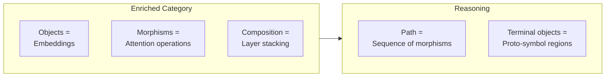

**Category-theoretic view**:
- **Embeddings** = Objects in an enriched category
- **Attention** = Enriched morphisms
- **Reasoning** = Sequence of morphisms forming a path
- **Proto-symbol regions** = Limits or terminal objects

This provides a rigorous mathematical foundation for the framework.

---

# Slide 18: Architectural Implications

## How to Build Explicit Reasoning

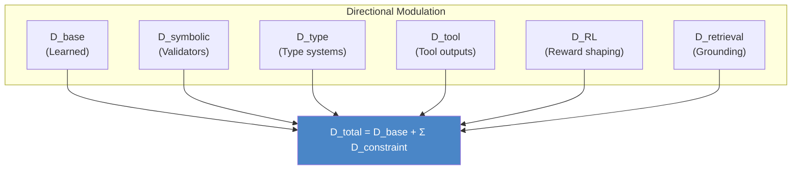

**Modify the direction function**:
```
D_total(x, c) = D_base + Σₖ D_constraint^(k)
```

**Sources of constraint directions**:
- Symbolic validators
- Type systems
- Tool outputs
- RL reward shaping
- Retrieval grounding

---

# Slide 19: Topology-Aware Regularization

## Training for Better Reasoning

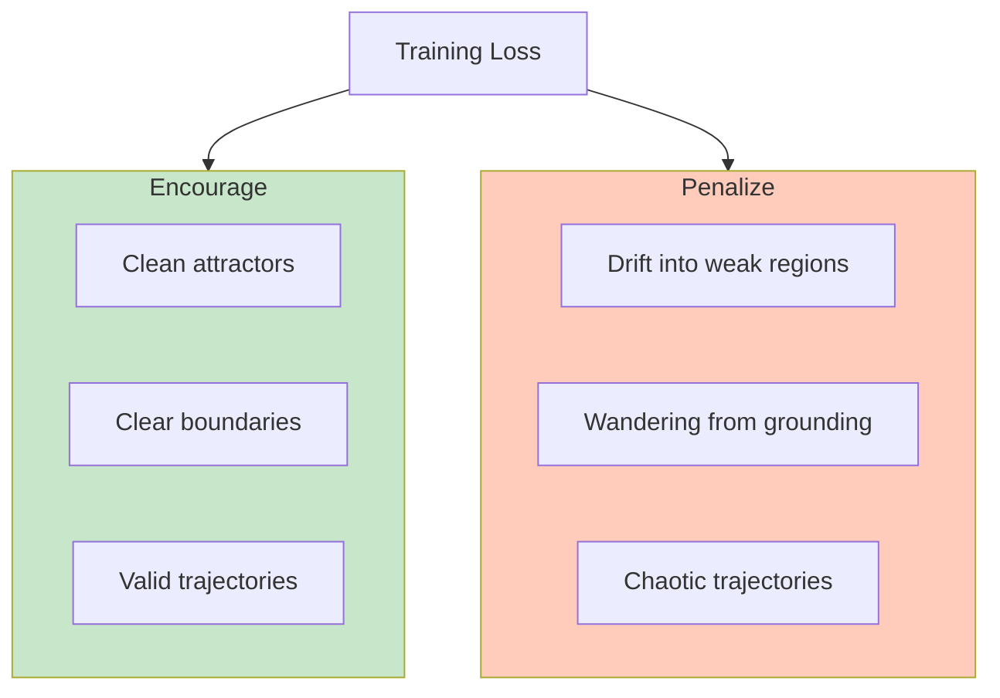

**Better training objectives**:
- Reward trajectories that stay in well-defined attractor basins
- Penalize excursions into underconstrained regions
- Shape the manifold topology for cleaner reasoning

---

# Slide 20: Hybrid Neuro-Symbolic Systems

## The Best of Both Worlds

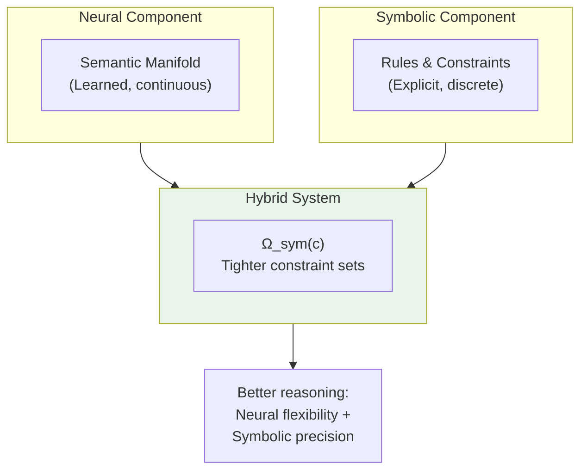

**Symbolic components define tighter constraint sets**:
```
Ω_sym(c) ⊂ Ω(c)
```

These reshape manifold traversal, preventing hallucination while preserving flexibility.

---

# Slide 21: Connection to Constraint-Emergence Ontology

## LLMs as Constraint Manifold Laboratories

```mermaid
flowchart TB
    subgraph Ontology["Constraint-Emergence Ontology"]
        O1["Reality = Constraint network"]
        O2["Stable patterns = Markov objects"]
        O3["Change = Constraint-directed flow"]
    end

    subgraph LLM["LLM Framework"]
        L1["Manifold = Constraint network"]
        L2["Proto-symbols = Markov objects"]
        L3["Inference = Constraint-directed flow"]
    end

    Ontology <-->|"Same structure<br/>different substrate"| LLM

    style Ontology fill:#bbdefb
    style LLM fill:#c8e6c9
```

**LLMs instantiate the same abstract pattern as physical reality**:
- High-dimensional constraint manifold
- Markov objects (proto-symbols) emerge through stability
- Trajectories follow constraint-directed flow

**LLMs are accessible laboratories** for studying constraint dynamics.

---

# Slide 22: The SDLC Connection

## From LLM Reasoning to Software Development

```mermaid
flowchart LR
    subgraph LLM["LLM Reasoning"]
        L1["Manifold traversal"]
        L2["Context constraints"]
        L3["Attractor = Valid output"]
    end

    subgraph SDLC["AI SDLC"]
        S1["Artifact evolution"]
        S2["Requirement constraints"]
        S3["Attractor = Working software"]
    end

    LLM -->|"Same pattern"| SDLC
```

| LLM Concept | SDLC Application |
|-------------|------------------|
| Preferred direction D(x,c) | Builder stage transition |
| Context constraints | Requirements + Standards |
| Proto-symbol attractor | Approved artifact |
| Hallucination | Failed tests, defects |
| Grounding (retrieval) | Architecture context, ADRs |

---

# Slide 23: Summary - The Framework

## What We've Established

```mermaid
flowchart TB
    subgraph Framework["The Framework"]
        M["Semantic Manifold M"]
        D["Preferred Direction D(x,c)"]
        SOFT["Soft Unification (Attention)"]
        PROTO["Proto-Symbol Attractors"]
        MARKOV["Markov-Blanket Boundaries"]
    end

    subgraph Explains["This Explains"]
        REAS["How reasoning emerges"]
        HALL["Why hallucination occurs"]
        GROUND["Why grounding helps"]
        PROMPT["Why prompting works"]
    end

    Framework --> Explains
```

**The framework shows**:
1. LLM reasoning = constrained manifold traversal
2. Attention = soft unification (same as Prolog, different substrate)
3. Proto-symbols = attractor regions with Markov-like boundaries
4. Hallucination = trajectory leaving stable region
5. Grounding = adding constraint sources

---

# Slide 24: Key Takeaways

## What This Means for AI Development

```mermaid
flowchart TB
    subgraph Takeaways["Key Insights"]
        T1["Probabilistic ≠ No reasoning"]
        T2["Reasoning = Structured trajectory"]
        T3["Hallucination = Topological problem"]
        T4["Better reasoning = Better constraints"]
        T5["Neural + Symbolic = Complementary"]
    end

    subgraph Implications["Practical Implications"]
        I1["Design better prompts<br/>(tighter constraints)"]
        I2["Use retrieval<br/>(grounding)"]
        I3["Add verification<br/>(external constraints)"]
        I4["Train for topology<br/>(cleaner attractors)"]
    end

    Takeaways --> Implications
```

**The path forward**:
- Don't fight the probabilistic nature - work with it
- Add constraint sources to tighten valid regions
- Shape the manifold topology through training
- Build hybrid systems that combine neural flexibility with symbolic precision

---

# Slide 25: Conclusion

## Bridging the Gap

```mermaid
flowchart LR
    subgraph Gap["The Traditional Gap"]
        SYM["Symbolic AI<br/>(Explicit rules)"]
        CONN["Connectionist AI<br/>(Learned patterns)"]
    end

    subgraph Bridge["The Bridge"]
        UNIFIED["Unified Unification Theory<br/>(Same abstract operation,<br/>different substrates)"]
    end

    Gap -->|"Connected by"| Bridge

    style Bridge fill:#e8f5e9
```

**This framework**:
- Closes the explanatory gap between symbolic and neural reasoning
- Provides formal foundations for understanding LLM behavior
- Offers architectural guidance for building better reasoners
- Connects to the broader constraint-emergence ontology

> **Reasoning is not magic. It is structured traversal of a constraint manifold. Both brains and LLMs do it - just with different implementations of the same abstract pattern.**

---

*This presentation formalizes how Large Language Models perform reasoning through topology-constrained traversal of semantic manifolds.*

**Document Version**: 2.0
**Date**: February 2026
