# Emotion Simulator

## Emergent Culture from Beliefs & Emotions

*A computational model for simulating emergent cultural behaviors from biological and psychological primitives*

---

# Slide 1: Introduction

## What is the Emotion Simulator?

A simulation framework exploring how **culture emerges** from:

- Individual agents ("Pops") with beliefs and emotions
- Homeostatic drives (survival, reproduction, habitability)
- Social interactions and belief transmission
- Environmental constraints and resources

**Core Question**: Can complex cultural phenomena emerge from simple biological rules?

---

# Slide 2: The Pops Domain Model

## Entities and Their Relationships

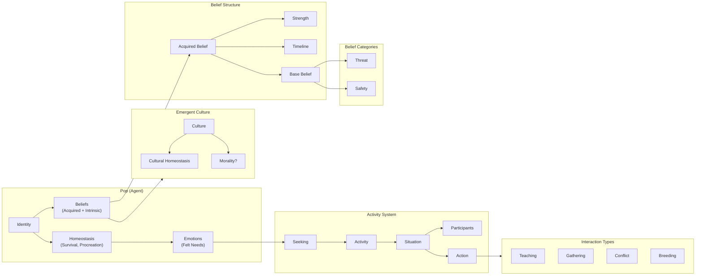

---

# Slide 3: Homeostasis - The Biological Foundation

## The Three Pillars of Survival

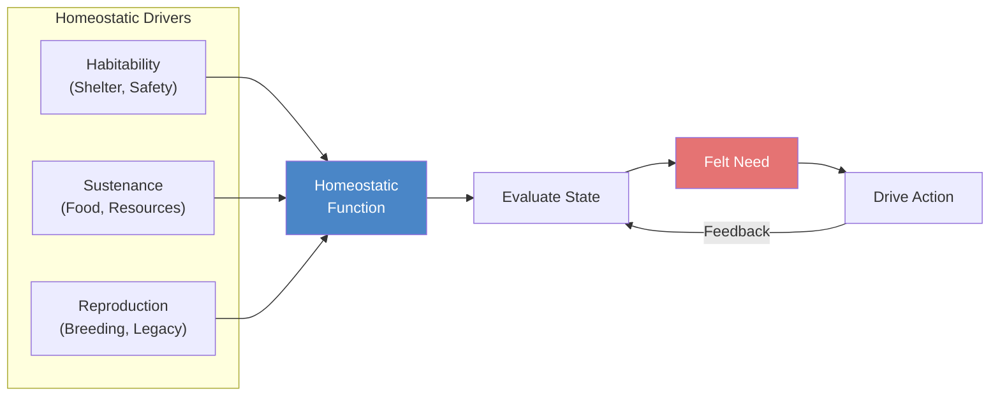

**Key Insight**: All behavior ultimately serves homeostatic functions. Culture emerges as a *collective homeostatic mechanism*.

---

# Slide 4: Life Cycle Model

## From Birth to Death: Belief Acquisition Over Time

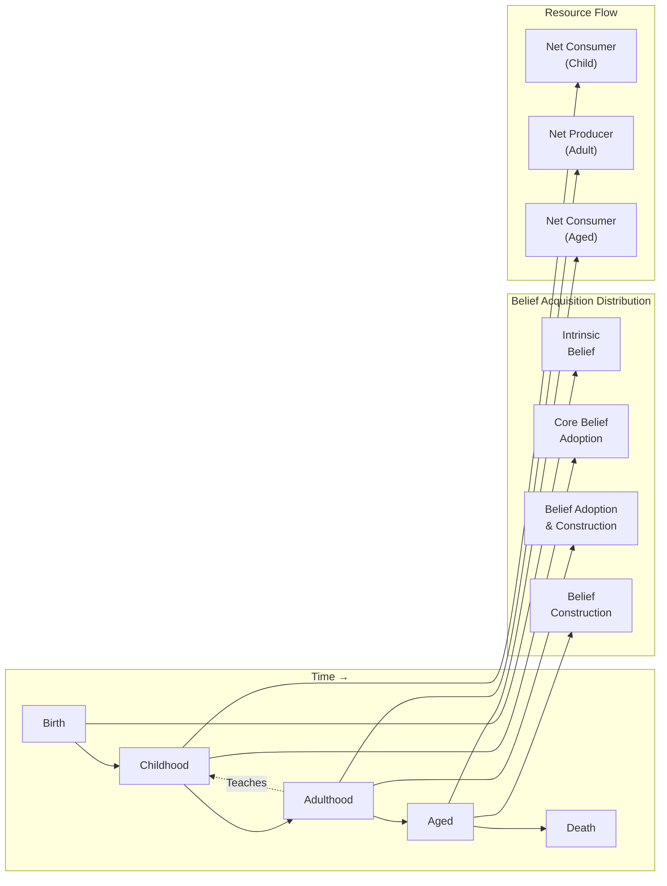

**Life Stages Shape Capability**:
- **Child**: Consume resources, acquire beliefs, require care
- **Adult**: Generate resources, distribute beliefs, breed, give care
- **Senior**: Consume resources, distribute beliefs, give care

---

# Slide 5: Life Cycle Reproduction Model

## Population Dynamics

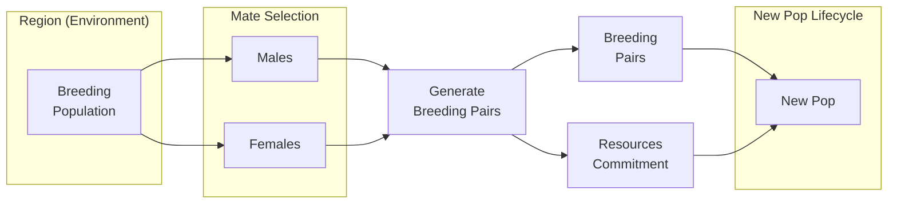

---

# Slide 6: Embodied Simulation as the Seat of Consciousness

## The Complete Cognitive Architecture

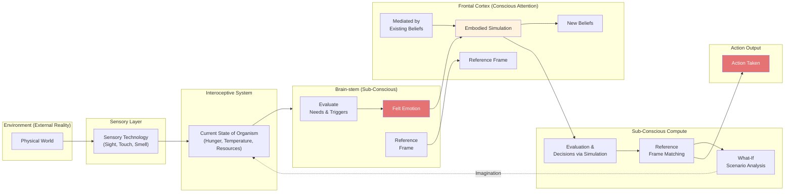

**Reference Frame**: A specific instance of embodied simulation against which needs and triggers are evaluated. Provides context for interoceptive information. Enables "What-If" analysis (imagination, hallucination).

---

# Slide 7: Belief Structures and Mapping

## How Beliefs Drive Behavior

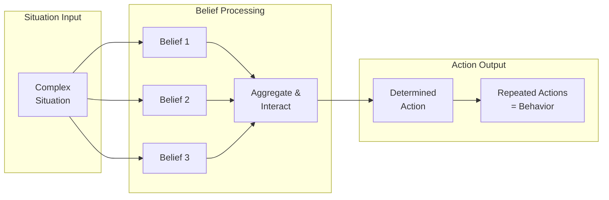

**Belief as Probability Function**:
- Variables: Childhood imprinting, strength of belief (multi-variable)
- Beliefs aggregate and interact in complex situations

**Emergent Behaviors from Belief Model**:
1. **Identity Model** - Overrides basic homeostatic functions (e.g., cultural preservation)
2. **Belief Clusters** - Emergent clusters promulgated around population
3. **Belief Chains** - Layered beliefs referencing prior beliefs

---

# Slide 8: The Meaning of Beliefs

## Beliefs ARE Memories (But Transmissible)

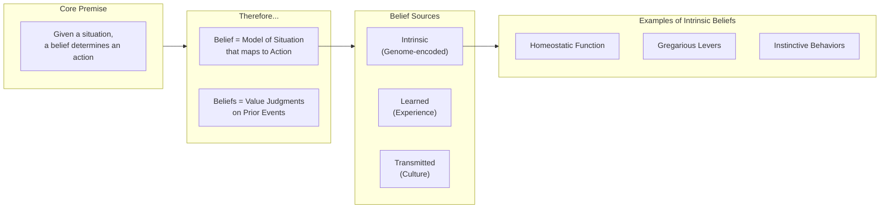

**Key Insight**: Beliefs can be:
- Hard-coded into genome (evolutionary)
- Acquired through experience
- Transmitted through social interaction (culture)

---

# Slide 9: Supported Situations for the Model

## Mapping Beliefs to Actions

| Behavior Type | Definition | Implementation |
|--------------|------------|----------------|
| **Seeking** | Traversal over solution space | Find food, find mate, find shelter |
| **Play** | Finding boundaries within limits | Seeking with exploration constraints |
| **Optimising** | Tech advancement chance | Individual intelligence as seeking capability |

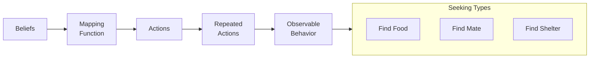

---

# Slide 10: Pop Physical Actions

## Tech-Constrained Capabilities

```mermaid
flowchart LR
    subgraph Actions["Physical Actions (Tech-Constrained)"]
        GATHER["Gather Resource"]
        CONSUME["Consume Resource"]
        MOVE["Move"]
        BREED["Breed"]
        COMM["Communicate<br/>(Belief / Deception)"]
        FORCE["Force"]
        SEEK["Seek (Search Space)<br/>Level Up Tech"]
    end

    subgraph Basic["Basic Operations"]
        B_MOVE["Move"]
        B_SEARCH["Search"]
        B_EXTRACT["Extract Resource"]
        B_CONSUME["Consume Resource"]
        B_COMM["Communicate Belief"]
    end

    TECH["Tech Level"] -->|"Constrains"| Actions
    Actions --> Basic
```

**All physical actions have an associated Tech Level** - capabilities expand as technology improves.

---

# Slide 11: Tech Optimisations

## Technology as Efficiency Multiplier

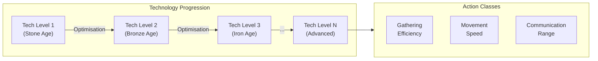

**Tech optimisations facilitate actions**:
- Each tech level in a particular Action Class improves capability
- Tech is a measure of efficiency
- Higher tech = more resources gathered per unit effort

---

# Slide 12: Environment Description - Objective Reality

## The Terrain Grid

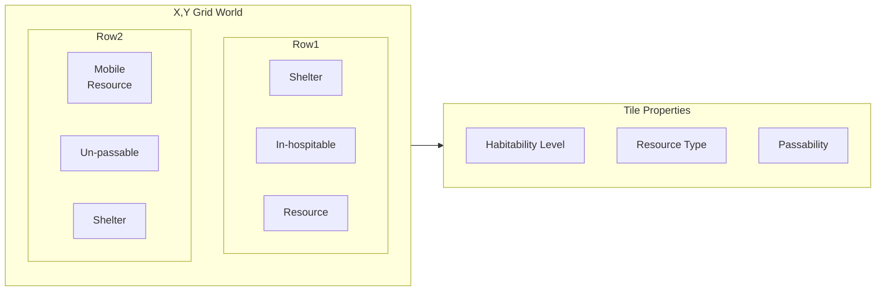

**Terrain Types**:

| Type | Description | Requirements |
|------|-------------|--------------|
| **Shelter** | Required for procreation, child-rearing, elder care | Habitability Level 1, No Tech |
| **In-hospitable** | Can survive limited period | Habitability < threshold |
| **Un-passable** | Cannot traverse | In-hospitable >= 8 |
| **Resource** | Contains extractable resources | Tech level to extract/consume |
| **Mobile-Resource** | Resource that moves | Can be hunted |

---

# Slide 13: Pop Description - Emotions

## Felt Needs Drive Behavior

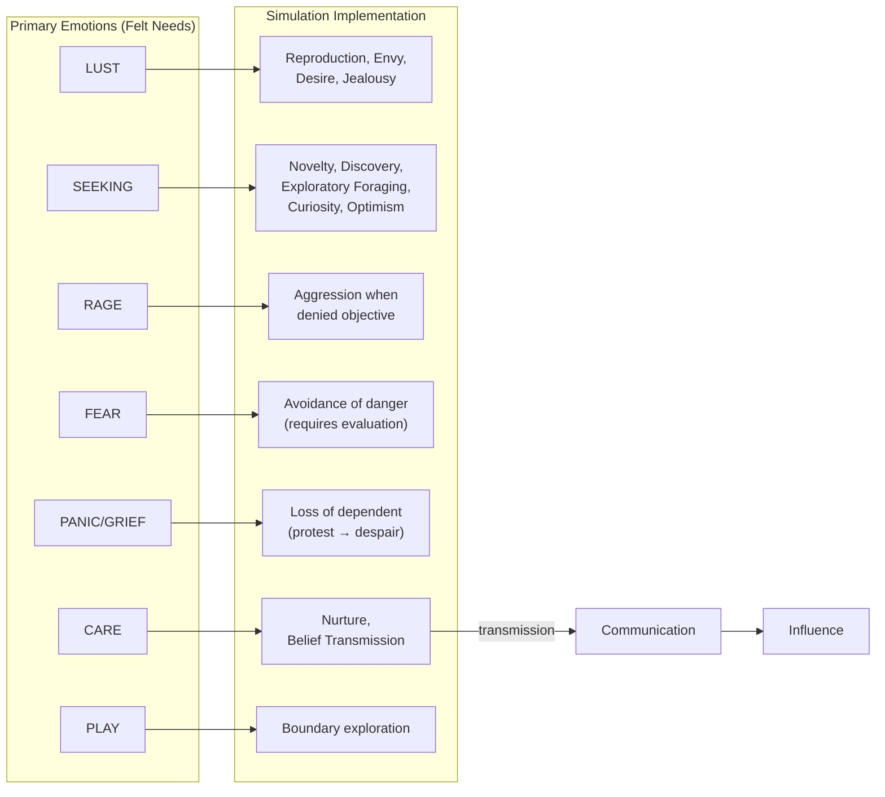

---

# Slide 14: Personality Traits (Big Five / OCEAN)

## Individual Variation in the Population

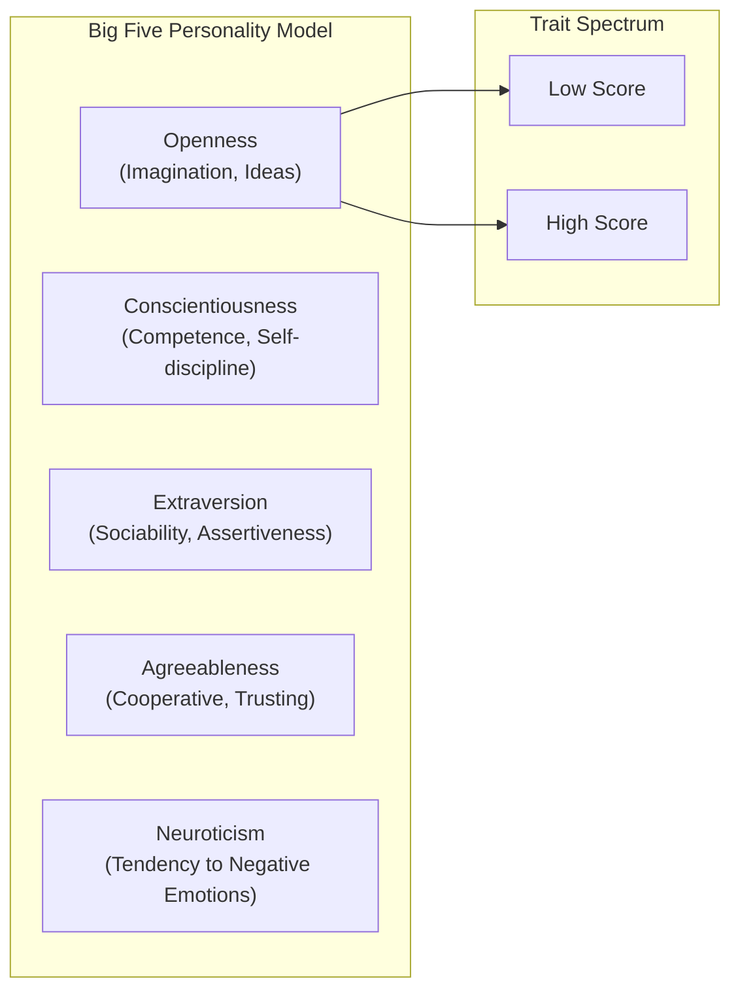

| Trait | Low Score | High Score |
|-------|-----------|------------|
| **Openness** | Practical, conventional, routine | Curious, wide interests, independent |
| **Conscientiousness** | Impulsive, careless, disorganized | Hardworking, dependable, organized |
| **Extraversion** | Quiet, reserved, withdrawn | Outgoing, warm, seeks adventure |
| **Agreeableness** | Critical, uncooperative, suspicious | Helpful, trusting, empathetic |
| **Neuroticism** | Calm, even-tempered, secure | Anxious, unhappy, prone to negative emotions |

---

# Slide 15: Initial MVP - Building the Simulation

## Core Components to Implement

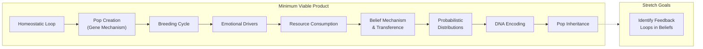

**Implementation Order**:
1. Create homeostatic loop
2. Pop creation with gene mechanism (key, value => positional)
3. Breeding cycle <= Belief-driven decision making <= Life cycle <= Birth
4. Pop emotional drivers <= Interoceptive system
5. Resource consumption
6. Belief mechanism & transference
7. Probabilistic distribution for triggering on/off
8. Encode DNA into pop
9. Include pop inheritance

---

# Slide 16: Pop Mental Drivers on Homeostasis

## The Core Algorithm

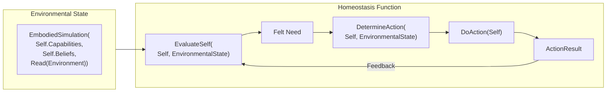

**Pseudocode**:
```
EvaluateSelf(Self, EnvironmentalState) -> FeltNeed
    -> DetermineAction(Self, EnvironmentalState): Action
    -> DoAction(Self): ActionResult

EnvironmentalState = EmbodiedSimulation(
    Self.Capabilities,
    Self.Beliefs,
    Read(Environment)
)
```

---

# Slide 17: Conclusions

## Key Insights from the Model

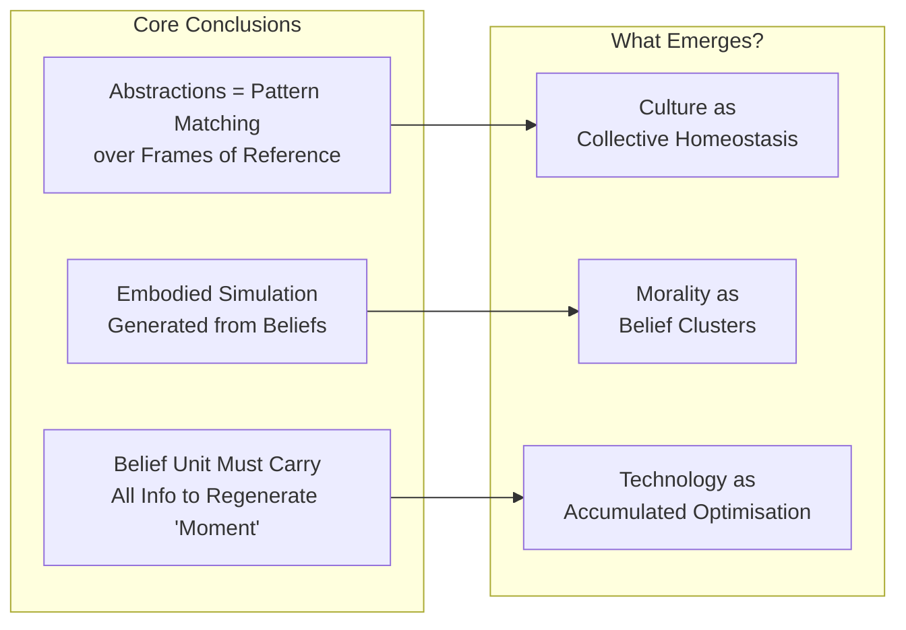

**Three Fundamental Insights**:

1. **Abstractions are Pattern Matching** over frames of reference
2. **Embodied Simulation** must be generated from a set of beliefs
3. **The Belief Unit** is critical - must carry all information to regenerate the "Moment"

---

# Slide 18: Capabilities Segmented by Age Cycles

## Age-Based Capability Distribution

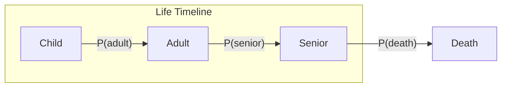

| Stage | Capabilities |
|-------|-------------|
| **Child** | 1. Consume Resources, 2. Acquire Beliefs, 3. Require Care |
| **Adult** | 1. Consume Resources, 2. Generate Resources, 3. Acquire Beliefs, 4. Distribute Beliefs, 5. Breed, 6. Give Care |
| **Senior** | 1. Consume Resources, 2. Acquire Beliefs, 3. Distribute Beliefs, 4. Require Care, 5. Give Care |

**Distribution Functions**:
- childDistribution
- adultDistribution
- seniorDistribution
- deathDistribution
- Avg_Death_Age

---

# Slide 19: Distribution Functions - Future State

## Continuous Capability Model

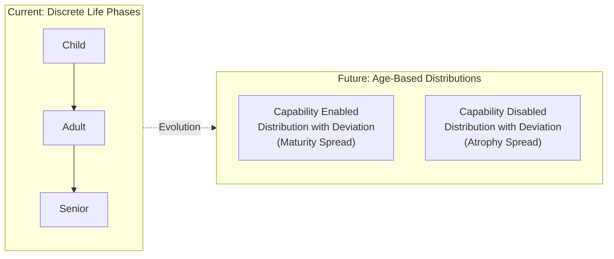

**Future Enhancement**: Switch from distinct life phases to capabilities that are age-based:
1. **Enabled** by a distribution with deviation indicating spread of maturity
2. **Disabled** by a separate distribution indicating atrophy of capability

---

# Slide 20: Bayes Theorem in Belief Updates

## How Beliefs Change Over Time

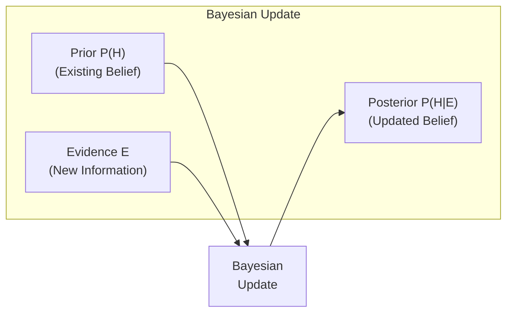

**Bayes Theorem**:
```
P(H|E) = P(H) * P(E|H) / P(E)
       = P(H) * P(E|H) / [P(H)*P(E|H) + P(!H)*P(E|!H)]
```

**Simplified**:
```
P(H|E) = P(s1) / (P(s1) + P(s2))
```

Where:
- H = Hypothesis (belief)
- E = Evidence (observation)
- s1 = Support for hypothesis
- s2 = Support against hypothesis

---

# Slide 21: Community for Innovation & Excellence

## Emergent Social Dynamics

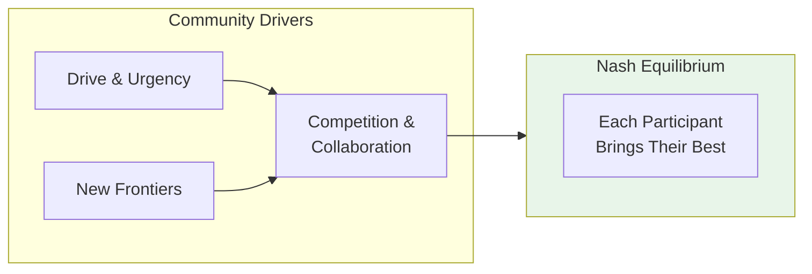

**Community Dynamics**:
- Create drive & urgency
- Create new frontiers
- Competition & Collaboration lead to Nash Equilibrium
- Each participant can bring their best

---

# Slide 22: Economic Fragility

## Systemic Risks in Complex Societies

```mermaid
flowchart LR
    subgraph Risks["Economic Fragility Sources"]
        JIT["Modern Supply Chain<br/>(Hidden Counterparties, JIT)"]
        REG["Regulatory Capture<br/>(Walled Garden + Deregulation)"]
        POW["Financial & Political Power<br/>(Regulatory Capture)"]
        VALUE["Lost Value of<br/>Building Economy"]
        DISC["Disconnect:<br/>Financial Markets vs Real Economy"]
    end

    JIT --> FRAGILE["Systemic<br/>Fragility"]
    REG --> FRAGILE
    POW --> FRAGILE
    VALUE --> FRAGILE
    DISC --> FRAGILE
```

**Warning Signs**:
- Hidden explosion of counterparties in modern supply chains
- Regulatory capture creating walled gardens
- Disconnect between financial markets and real economy
- Lost value of building vs. extracting from economy

---

# Slide 23: Summary - The Emergence Stack

## From Biology to Culture

```mermaid
flowchart LR
    subgraph L1["Layer 1: Biology"]
        HOMEO["Homeostasis<br/>(Survival, Sustenance, Reproduction)"]
    end

    subgraph L2["Layer 2: Psychology"]
        EMO["Emotions<br/>(Felt Needs)"]
        BEL["Beliefs<br/>(Acquired + Intrinsic)"]
    end

    subgraph L3["Layer 3: Behavior"]
        ACT["Actions<br/>(Seeking, Play, Optimising)"]
        BEH["Behaviors<br/>(Repeated Patterns)"]
    end

    subgraph L4["Layer 4: Society"]
        INTER["Interactions<br/>(Teaching, Conflict, Breeding)"]
        CULT["Culture<br/>(Shared Beliefs)"]
    end

    subgraph L5["Layer 5: Emergence"]
        MORAL["Morality"]
        TECH["Technology"]
        ECON["Economy"]
    end

    L1 --> L2
    L2 --> L3
    L3 --> L4
    L4 --> L5

    style L1 fill:#bbdefb
    style L2 fill:#c8e6c9
    style L3 fill:#fff9c4
    style L4 fill:#ffccbc
    style L5 fill:#e1bee7
```

---

# Slide 24: Connection to AI SDLC

## Precursor Thinking

This **Emotion Simulator** model directly influenced the AI SDLC methodology:

| Emotion Simulator Concept | AI SDLC Application |
|--------------------------|---------------------|
| **Homeostasis** | Requirements as living control system |
| **Felt Needs → Actions** | Intent → Requirements → Code |
| **Belief Transmission** | Context propagation through stages |
| **Feedback Loops** | Runtime feedback to requirements |
| **Embodied Simulation** | AI agent "understanding" via context |

```mermaid
flowchart LR
    subgraph EmotionSim["Emotion Simulator"]
        ES_HOMEO["Homeostasis"]
        ES_BEL["Beliefs"]
        ES_ACT["Actions"]
    end

    subgraph AISDLC["AI SDLC"]
        AI_REQ["Requirements<br/>(Target State)"]
        AI_CTX["Context<br/>(Beliefs)"]
        AI_CODE["Code<br/>(Actions)"]
    end

    ES_HOMEO -.->|"Inspired"| AI_REQ
    ES_BEL -.->|"Inspired"| AI_CTX
    ES_ACT -.->|"Inspired"| AI_CODE
```

**The consciousness loop in AI SDLC** (Builder → Executor → Observer → Evaluator) directly mirrors the homeostatic loop in biological systems.

---

# Appendix A: Technical Stack (Historical)

## MacOS M1: Apache Tensor/Spark/Hadoop

```mermaid
flowchart LR
    subgraph Python["Python Environment"]
        PY["Python 3.9"]
        PYSPARK["PySpark"]
    end

    subgraph DevEnv["Development Environment"]
        IDLE["IDLE"]
        VSCODE["VSCode"]
    end

    subgraph PackageManagers["Package Managers"]
        BREW["Homebrew"]
        CASK["Cask"]
        PIP["Pip"]
        CONDA["Conda"]
    end

    subgraph ML["ML Stack"]
        TF["TensorFlow"]
        JUP["Jupyter<br/>Notebook"]
    end

    subgraph Compute["Compute (Native vs Docker)"]
        SPARK["Spark"]
        HADOOP["Hadoop"]
        JAVA["Java 8"]
    end

    subgraph Cluster["Cluster/K8"]
        C_SPARK["Spark"]
        C_YARN["Yarn"]
        C_HDFS["HDFS"]
    end

    subgraph Hardware["M1 Hardware"]
        CPU["10 CPU Cores"]
        GPU["32 GPU Cores"]
        MLC["ML Cores"]
        METAL["Metal"]
        XCODE["Xcode"]
    end

    Python --> ML
    PackageManagers --> Python
    DevEnv --> Python
    ML --> Compute
    Compute --> Cluster
    METAL --> TF
    Hardware --> METAL
```

---

## References

**Influences on this model**:

- **Mark Solms** - *The Hidden Spring* (Consciousness from brainstem)
- **Jaak Panksepp** - Primary emotions (SEEKING, RAGE, FEAR, LUST, CARE, PANIC, PLAY)
- **Big Five Personality Model** (OCEAN)
- **Bayesian Inference** - Belief updating
- **Homeostasis Theory** - Biological self-regulation
- **Embodied Cognition** - Simulation as the basis of understanding

---

*This presentation represents precursor thinking on emergence and biological systems that later influenced the AI SDLC methodology's homeostasis model.*

**Version**: 1.0
**Date**: February 2026
