# On-Demand Data Architecture

## Event-Driven Systems, Domain Modeling, and Systematic Modernization

*A comprehensive framework for building composable, evolvable enterprise data systems*

---

# Slide 1: The Challenge

## Information Systems Lag Reality

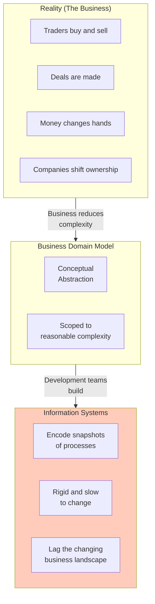

**The problem**: Systems traditionally are rigid, slow to change, slow to extend - generally lagging the changing business landscape reflected by reality.

---

# Slide 2: The Domain Landscape

## From Reality to Systems

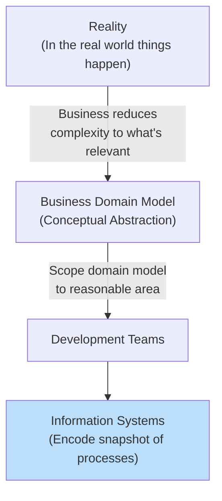

**Key insight**: The broader the domain model, the more abstract it needs to be. We don't try to model the entire business end-to-end in a single domain.

---

# Slide 3: Bounded Contexts

## Managing Complexity Through Separation

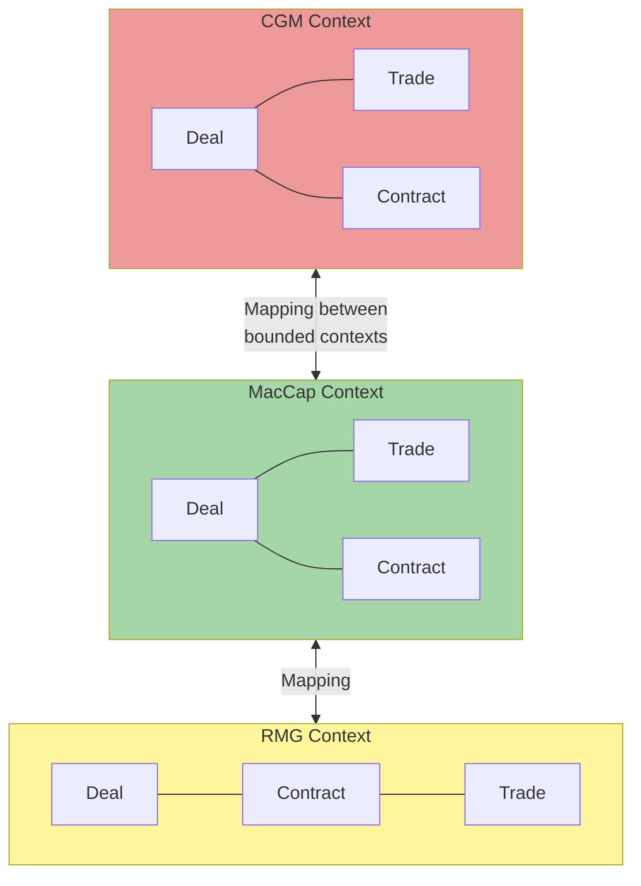

**Bounded Context principle**:
- An organization is complex
- Single model = excessively challenging, costly, hard to maintain
- Separate into areas with **consistent language, operations, and data model**
- Each context may use the same term but with subtly different definitions

---

# Slide 4: Corporate Anti-Patterns

## What We're Fighting Against

| Anti-Pattern | Description |
|--------------|-------------|
| **Monolithic Big Ball of Mud** | Everything coupled together, no clear boundaries |
| **File Transfers** | Custom point-to-point integrations |
| **Manual Processes** | Humans bridging gaps in integrations |
| **Output-Only Focus** | Ignoring the transform, focusing only on output data |
| **Attribute-Level Thinking** | Dealing with data at attribute level instead of Entity level |

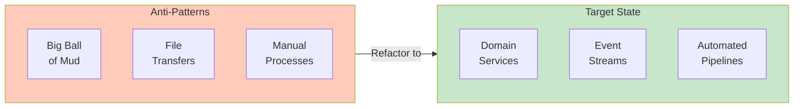

---

# Slide 5: Event-Driven Architecture

## Systems Composable Through Events

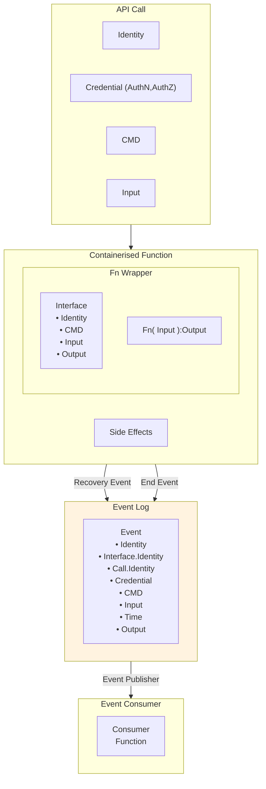

**Identity structure**:
- GUID
- Credential (AuthN, AuthZ)
- Creation Time UTC

---

# Slide 6: What Does a Good Event Look Like?

## Event Design Principles

**Every event must have**:

1. **Captured and available** to authorized subscribers
2. **Security token** under which it was authorized
3. **Signature of parent event** (lineage)
4. **Adaptive to schema changes** over time

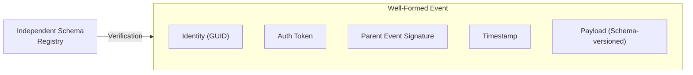

**Data pipelines need to be adaptive** to changes in data over time - independent source for schema verification consumed by integration endpoints.

---

# Slide 7: Event Consumer Use Cases

## Four Patterns for Event Consumption

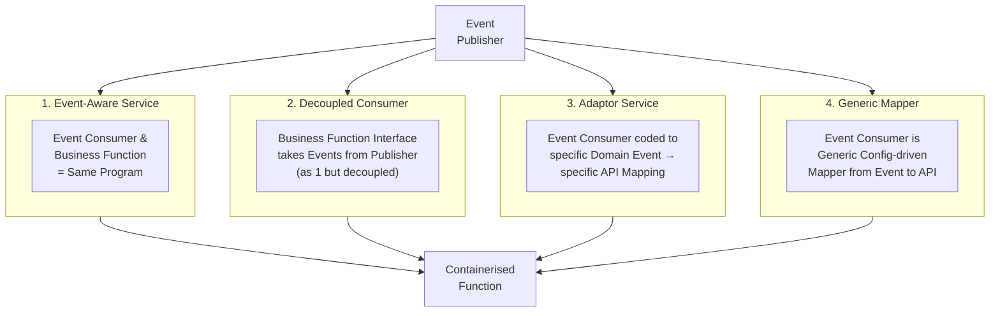

---

# Slide 8: Use Case - Serverless Application

## Event Flow Through Functions

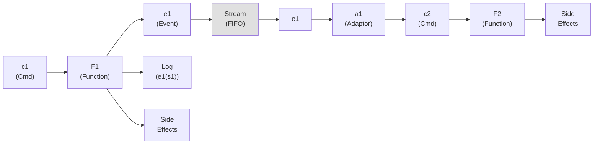

**Key pattern**:
- `State ++ Event -> Current State`
- Current State refers to the accumulated state from events
- Reliance on ODBC or equivalent for side effects

---

# Slide 9: Event-Driven Scoring Service Example

## Real-World Architecture

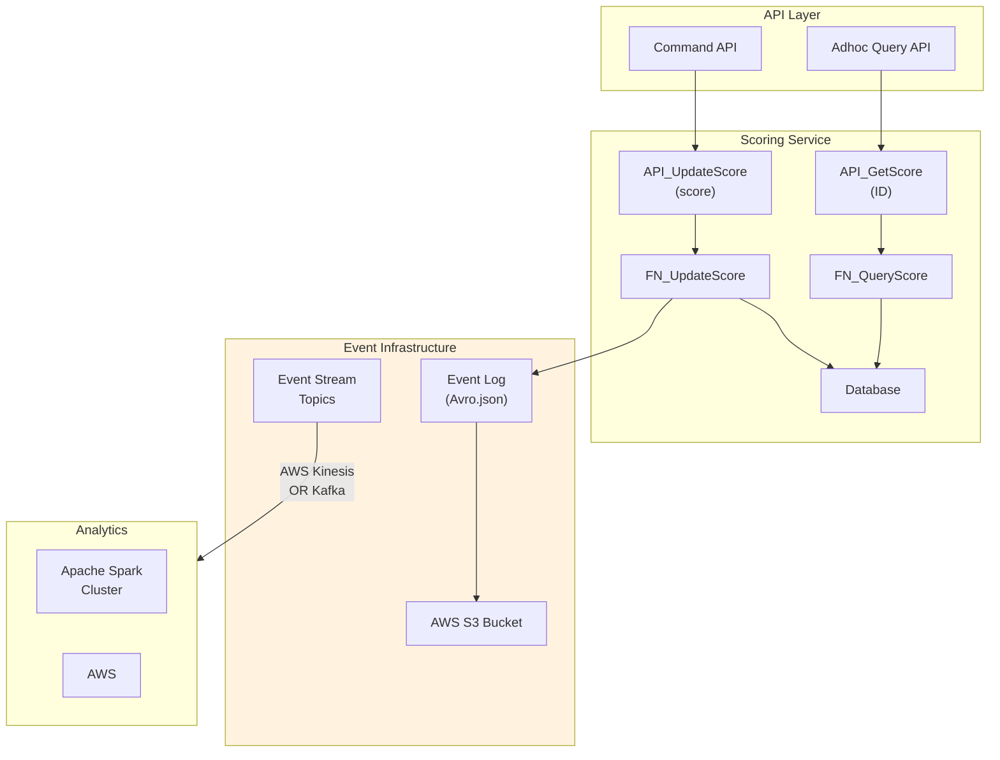

---

# Slide 10: On-Demand Resource Pipeline (Data Pipes V3)

## Complete Architecture

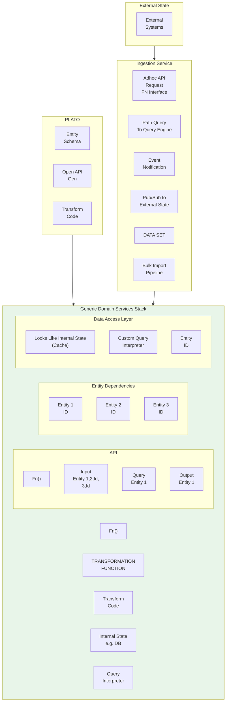

---

# Slide 11: On-Demand Function Modules

## Serverless Execution Architecture

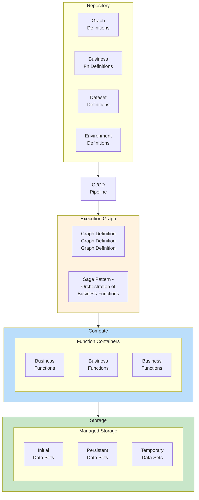

---

# Slide 12: Spark Invoker Use Case

## Workflow Orchestration

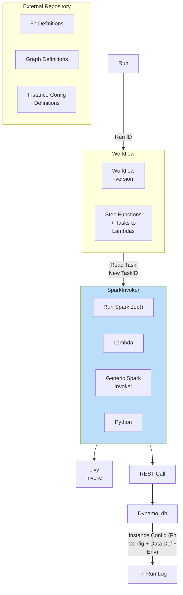

---

# Slide 13: Fine-Graining Your Functions

## Improving Lineage Through Decomposition

**Problem**: User-defined function does filtering internally, reducing trackable granularity.

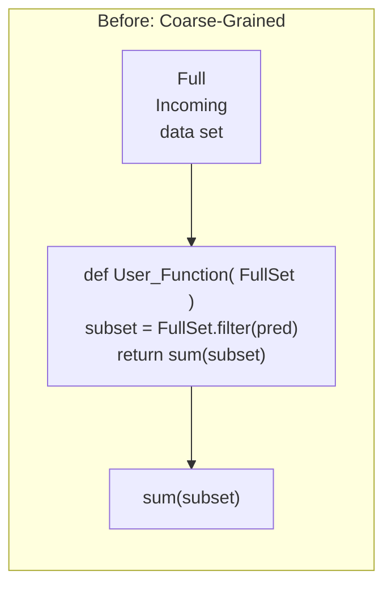

**Lineage Outcome**: ResultSet was generated by User_Function using InputSet (no detail on filter)

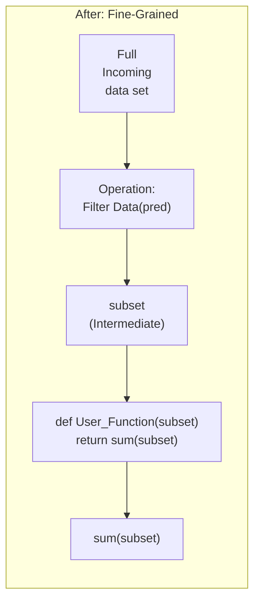

**To improve granularity**: The filtering functionality should be a separate function.

---

# Slide 14: Managed Data Sets

## Technology-Agnostic Data Storage

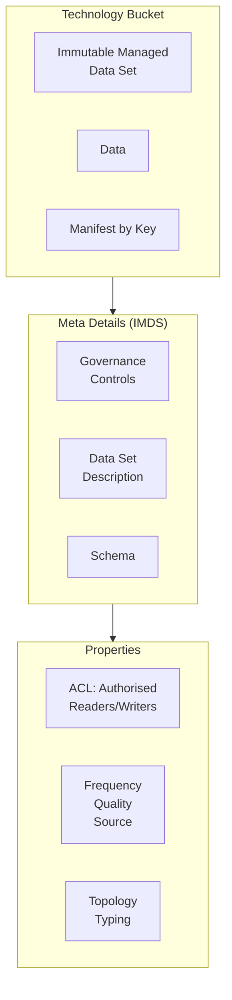

**S3 Implementation**:
| Property | Value |
|----------|-------|
| Security | IMS |
| Governance | Configurable |
| Physical Location | Regional Replication |
| Access Methods | Sockets, Object Model |
| Encoding | Configurable |

---

# Slide 15: CDH Domain Model Modules

## Data Storage Architecture

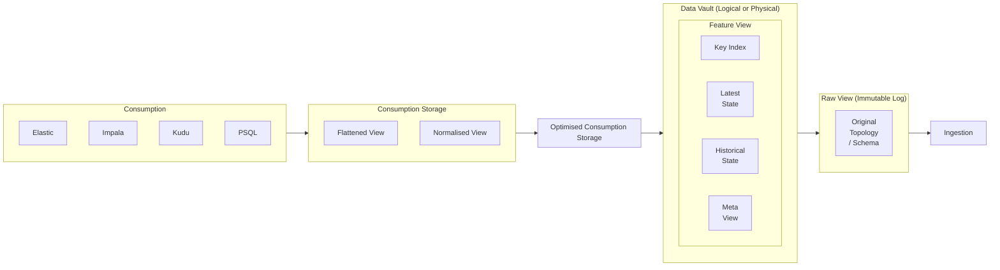

---

# Slide 16: Refactoring - You Got to Have a Plan

## The Two-Phase Approach

**There is no point refactoring towards a technology unless it is in service to your model.**

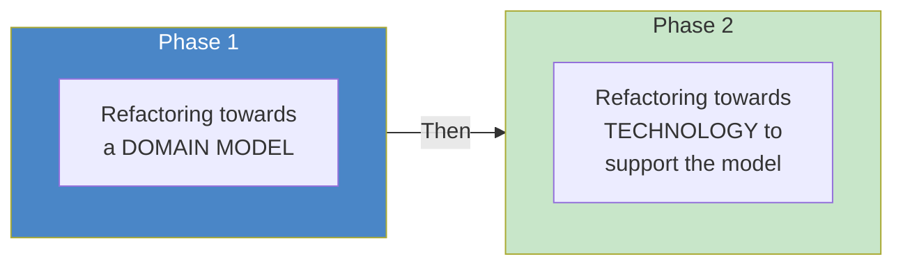

**Key insight**: Technology serves the model, not the other way around.

---

# Slide 17: Refactoring a Slice Pattern

## Consumer-Backward Approach

**Step 1**: Go to the end point and identify the model the consumer needs
- E.g., FP&A CTOs report has a specific 'bounded context'
- It may have a unique language and requirement

**Step 2**: Work backwards from the Consumer
- Identify entities needed to fulfill the consumer's model
- Build the model for those entities

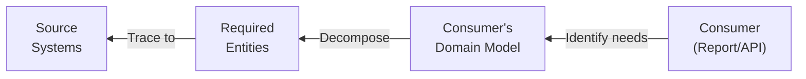

---

# Slide 18: Section Outlines - The Refactoring Roadmap

## From Current State to Future State

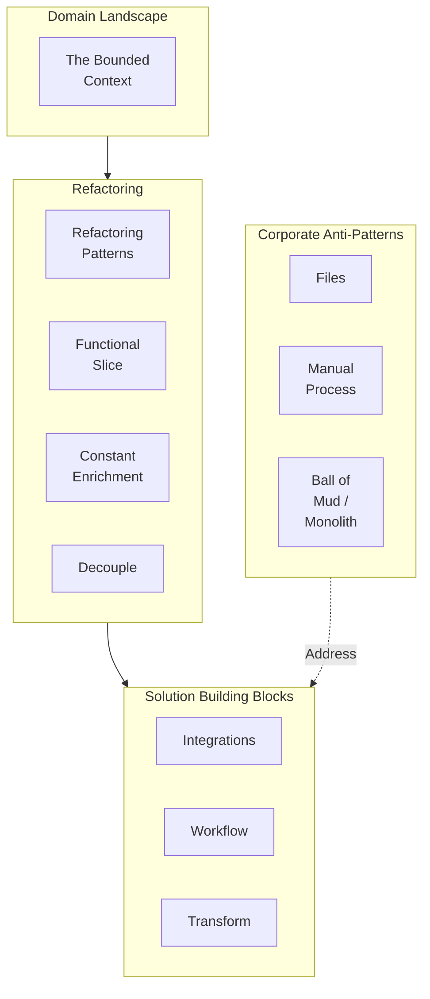

**The Journey**:
0. Example Future State
1. Domain Model Consumer
2. Domain Model Sources
3. Create APIs over each Model
4. Integrate
5. Solution Building Blocks
6. Parallel Verification

---

# Slide 19: Orchestra - Philosophy of Product Development

## Domain-Driven, Event-Sourced Architecture

**Philosophy of Designing for Product**:
1. Background in Start-ups & Product-driven development
2. Elements of a start-up culture:
   - Use a real-world problem to bootstrap a product
   - Separate the Business Domain from the Capabilities needed
   - Discover requirements through iteration - don't be paralysed by lack of requirements

**Philosophy of Orchestra**:
1. **Domain-Driven Design** to define your services
2. **Event-Driven Architecture / Event Sourcing** for modeling
3. **Orchestrating Domain Services**:
   - Avoiding creating dependency chains
   - Introducing the **Saga Pattern**

---

# Slide 20: The Saga Pattern

## Orchestrating Without Dependency Chains

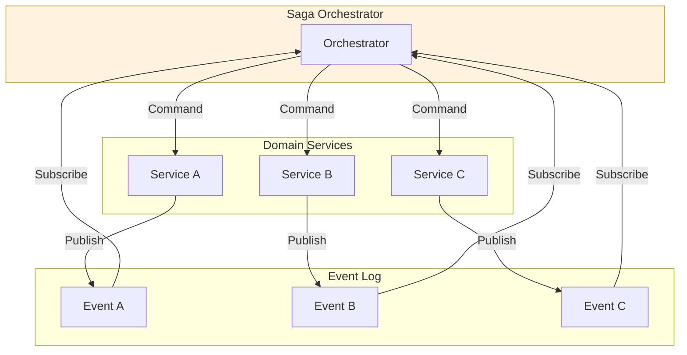

**Key benefits**:
- No direct service-to-service dependencies
- Compensating transactions for rollback
- Event log provides complete audit trail
- Services remain independently deployable

---

# Slide 21: Bi-Temporal Views

## Business View vs Systems View

```mermaid
flowchart TB
    subgraph SystemsTime["Systems Activity Time Line: As At"]
        T1["T1:a"]
        T2["T2:x"]
        T3["T3:y"]
        T4["T4:z"]
        T5["T5:b"]
        T6["T6:c"]
        T7["T7:d"]
        T8["T8:e"]
        T9["T9:f"]
    end

    subgraph BusinessTime["Business Activity Time Line: As Of"]
        B1["1"]
        B2["2"]
        B3["3"]
        B4["4"]
        B5["5"]
        B6["6"]
        B7["7"]
    end

    T1 --> B1
    T2 --> B2
    T3 --> B2
    T4 --> B3
    T5 --> B4
    T6 --> B5
    T7 --> B6
    T8 --> B6
    T9 --> B7
```

**Two timelines**:
- **As At**: When the system recorded the event
- **As Of**: When the business event actually occurred

**View: As of Till** - Business activity timeline is a view of the underlying system events.

---

# Slide 22: Information Systems & Intentional Design

## From Reality to Composable Architecture

```mermaid
flowchart LR
    REALITY["Reality"]

    BA["Business<br/>(deals directly<br/>with reality)"]

    EVENT["Event Storming<br/>(builds abstract<br/>domain)"]

    DOMAIN["Abstract<br/>Problem Domain<br/>(e.g. How users see CATS)"]

    ARCH["Architect &<br/>Programmer"]

    SYSTEMS["Systems Architecture<br/>& Programs"]

    TECH["Technology"]

    REALITY --> BA --> EVENT --> DOMAIN --> ARCH --> SYSTEMS
    ARCH --> TECH

    style DOMAIN fill:#bbdefb
    style SYSTEMS fill:#c8e6c9
```

**Event Storming** helps build the abstract domain by focusing on what actually happens in the business.

---

# Slide 23: Parallel Registration Strategy

## Phased Migration Approach

**Stage 1: Full Segregation**
- Separation on Product Boundaries
- Users register independently
- **Data unified at Registered Person Records** coming out of both systems
- Advantages: Easiest, cheapest, quickest to stand up
- Disadvantages: Double registration for cross-product users

**Stage 2: Registration Integration**
- WSA implements registration synchronization from existing system
- Consistent user experience with minimal re-keying

**Stage 3: Product Migration**
- Selective controlled product migration from existing systems to WSA

---

# Slide 24: Patterns of Integration

## The Two Fundamental Patterns

```mermaid
flowchart TB
    subgraph Patterns["Integration Patterns"]
        EVENTS["Events<br/>(Asynchronous)"]
        APIS["APIs<br/>(Synchronous)"]
    end

    subgraph EventTypes["Event Types"]
        DOMAIN["Domain Events"]
        INTEG["Integration Events"]
        CMD["Command Events"]
    end

    subgraph APITypes["API Types"]
        REST["REST"]
        GRPC["gRPC"]
        ODBC["ODBC"]
    end

    EVENTS --> EventTypes
    APIS --> APITypes
```

**APIs** include all programmatic interfaces such as REST & ODBC.

---

# Slide 25: Highest Value Automation Testing

## Outside-In Testing Strategy

**For highest value, test from the outside in:**

1. **Test from outside to inwards** of your releasable Product
2. Examples:
   - Releasing an **Application** → test its interfaces, imports and exports
   - Releasing a **Library** → test its interface calls

3. **If modules need refactoring** → automate testing their interfaces where possible

4. **BUT**: If your automated API tests exercise the execution paths, then the need for internal testing is greatly mitigated

```mermaid
flowchart TB
    subgraph Product["Releasable Product"]
        INTERFACE["Public Interface"]
        INTERNAL["Internal Modules"]
    end

    TESTS["Automated<br/>API Tests"] -->|"Exercise"| INTERFACE
    INTERFACE -->|"Exercises"| INTERNAL

    style TESTS fill:#c8e6c9
```

---

# Slide 26: Summary - The Complete Picture

## On-Demand Data Architecture

```mermaid
flowchart TB
    subgraph Foundation["Foundation"]
        DOMAIN["Domain-Driven<br/>Design"]
        BOUNDED["Bounded<br/>Contexts"]
        EVENTS["Event-Driven<br/>Architecture"]
    end

    subgraph Patterns["Key Patterns"]
        SAGA["Saga Pattern"]
        BITEMPORAL["Bi-Temporal<br/>Views"]
        FINE["Fine-Grained<br/>Functions"]
    end

    subgraph Infrastructure["Infrastructure"]
        MANAGED["Managed<br/>Data Sets"]
        PIPELINES["On-Demand<br/>Pipelines"]
        SERVERLESS["Serverless<br/>Functions"]
    end

    subgraph Process["Process"]
        REFACTOR["Systematic<br/>Refactoring"]
        SLICE["Consumer-Backward<br/>Slicing"]
        PARALLEL["Parallel<br/>Migration"]
    end

    Foundation --> Patterns
    Patterns --> Infrastructure
    Infrastructure --> Process
```

**Key Takeaways**:

1. **Domain First** - Refactor towards domain model, then technology
2. **Bounded Contexts** - Manage complexity through separation
3. **Events as First-Class** - Every business event captured and available
4. **Saga for Orchestration** - Avoid dependency chains
5. **Fine-Grained Functions** - Improve lineage through decomposition
6. **Consumer-Backward** - Start from the end and work backwards
7. **Parallel Migration** - Staged approach minimizes risk

---

*This presentation covers the architecture patterns for building composable, event-driven, domain-modeled enterprise data systems.*

**Version**: 1.0
**Date**: February 2026
