# Plato Transformations

## Structure-Preserving Transforms Through Functors

*A framework for automatic, provably correct data transformations using category theory*

---

# Slide 1: The Problem

## Data Transformation is Hard

Every enterprise faces the same challenge:

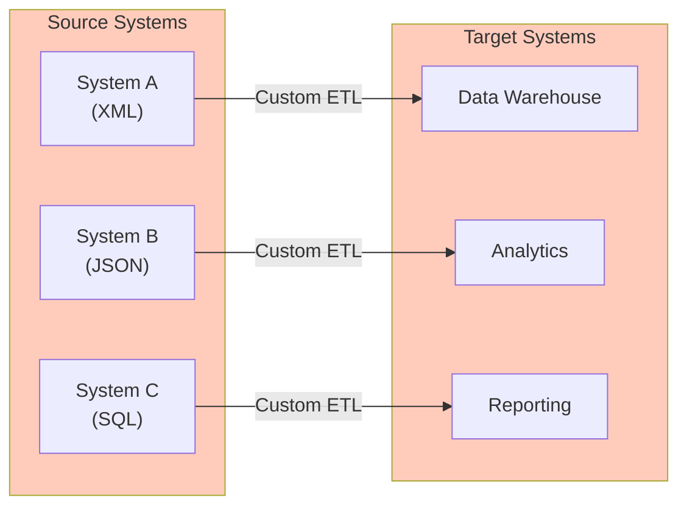

**The pain**:
- N sources × M targets = N×M custom transformations
- Each transformation is hand-coded
- Changes propagate unpredictably
- No guarantees about correctness

---

# Slide 2: The Observe/Interpret/Solve Cycle

## How We Actually Solve Problems

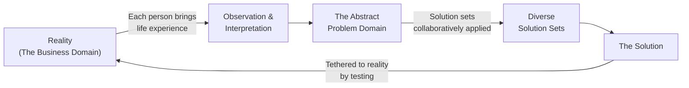

**Key insight**: This is the scientific method applied at every granularity.

---

# Slide 3: Business Domain Software Life Cycle

## The Traditional Approach

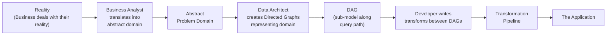

**Problem**: Developer manually writes transforms between DAGs - error-prone and expensive.

---

# Slide 4: Business Domain Life Cycle with Plato

## The Automated Approach

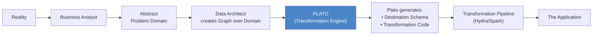

**Key change**: Developer declares the destination DAG; Plato generates the transformation code automatically.

---

# Slide 5: TLDR - What Plato Does

## The Value Proposition

**Plato allows**:
1. Definition of a **network of entities and their relationships**
2. The Transformation module generates **instructions to copy data** from any projection to any other projection
3. The DSL can be converted to **any target language** (Spark, Java, Python, Beam, SQL)
4. Generated code used by **Hydra or standalone**

**Example flow**:
```
Source: Trade XML in Avro format
    ↓ (Plato projection definition)
User defines: Destination Projection from common Universe
    ↓ (Transformation module)
Generated: DSL instruction set (source → destination)
    ↓ (Adaptor)
Output: Executable Spark code for Hydra
```

---

# Slide 6: The Core Concept - Structure Preservation

## Automatic Structure-Preserving Transformation

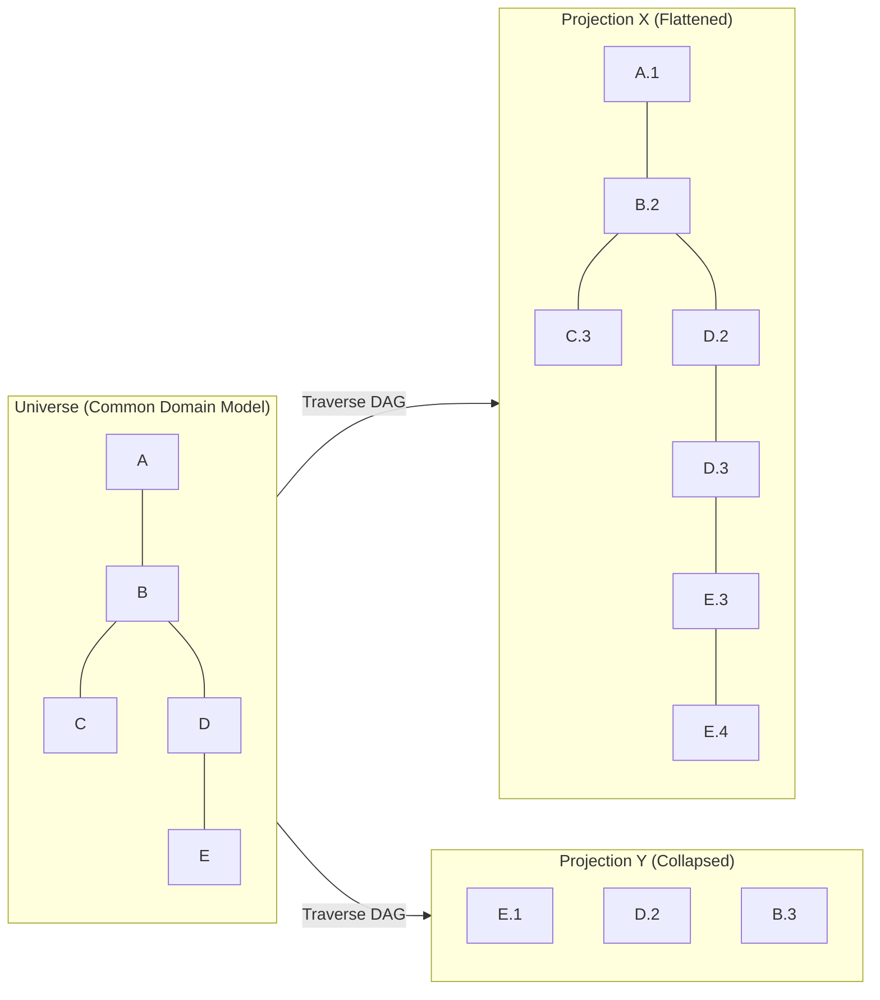

**Language** (minimal instruction set):
1. `CREATE node`
2. `COPY (node).ATTRIBUTES (a).FILTER(predicate)`

---

# Slide 7: Graph Representation

## Entities, Relationships, and Arcs

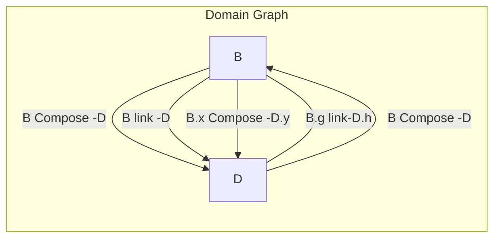

**Arc properties**:
- **Relationship**: Table key (Link, Composition)
- **Multiplicity**: Foreign Key - Mono (Single, Many)
- **Direction**: Mono(Left, Right), BiDirection

**Processing rules**:
- A → Adjacent Nodes & Arcs
- For each Arc: check if reference exists → FK if Mono
- For each unique Arc to same table: different reference name
- If Bidirectional: Create Join table for each unique Arc

---

# Slide 8: The Plato DSL

## SQL Code Construction from Plato DSL

```
Plato DSL Commands:
    CREATE, COPY
    Copy Result([source.Path]) to [destination.Path]
    Result <= Query( A )(Result A)

Path = Seq[Arc] from Src to Dest
Arc = (left_node, right_node, ref_type(link,composition))

Query( Path(n) => Arc 'n)
    (L1, R1) => (L2, R2) => (L3, R3) => (L4, R4) ...
    Where A'n( Ln, Rn) :: R(n) == L(n+1)

Result'n ( Query(Arc(L,R) ) )
```

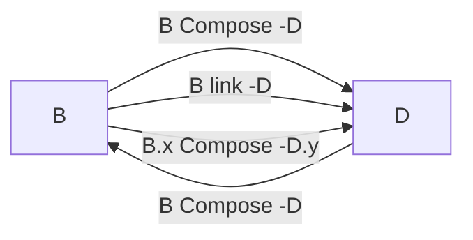

---

# Slide 9: Copy Transform Algorithm

## How Transformations Are Generated

```
create A
copy ( A=>A ) ::
create D
copy ( A=>D ) :: [ A, B, right, link, many, A_id, B_id],
                 [ B, D, right, link, many, B_id, D_id]
create B
copy ( A=>B ) :: [ A, B, right, link, many, A_id, B_id]
```

**SQL Generation**:
```sql
Select * from D where d_id in
    ( select d_id from B where b_id in
        ( select b_id from A ) )

RESULT_SET = select * from D
RESULT_KEYS = select d_id from B
RESULT_SET = Query_SET ( RESULT_KEYS )
RESULT_KEYS = Query_KEYS( Path, Arc = Path.head, RESULT_KEYS )
```

---

# Slide 10: The Algorithm - Network to Projections

## Transform ( {U:P1->X} -> {U:P2->Y} )

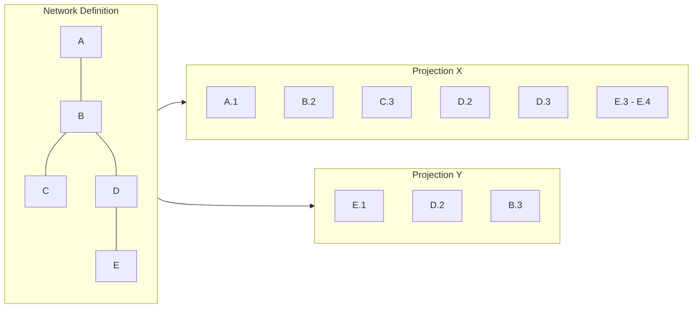

**Algorithm**:
1. Given Y, traverse over X.Data → Y.Data
2. META SETS - Mapping each node type
3. Traverse DAG Y
4. Traverse Y.E → Query X for Y.E → Create Y.E (X.E <- Query X)
5. Construct E.attribute <- Query(U:X.E).attributes
6. Resolve Links from B.E to B.D

---

# Slide 11: Plato Meta Model

## HOCON Definition Structure

```hocon
{
  // bundles of attributes - independent of nodes
  // nodes need the same tags as attributes
  attributes_lists: {
    Attrib_bundle1:[]
    Attrib_bundle2:[]
  }

  // nodes don't need to be defined all here
  // these are the common universe spanning definitions
  Nodes: { }

  // still need to think about how universes map (bounded context)
  PlatonicUniverse: {
    universeName: u {
      Nodes: [n1,n2]
      Arcs: [
        [n1,n2]
      ]
    }
  }

  // can all projections be stored as projection set rules?
  ProjectionSets: {
    projName: {
      Universe: u
      From: n1
      Ruleset: [
        // Arc definitions with type, multiplicity, direction
        {
          start: Trade,
          end: Order,
          type: composition,
          multiplicity: single,
          direction: bidirectional,
          end_identity_alias: "trade_key2_order_id"
        }
      ]
    }
  }
}
```

---

# Slide 12: Plato Module Architecture

## System Components

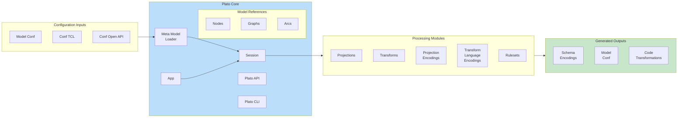

---

# Slide 13: Transformation Engine

## Code Generation Pipeline

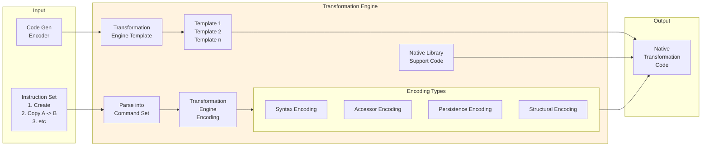

---

# Slide 14: Projections and Ideologies

## Monads for Different Target Structures

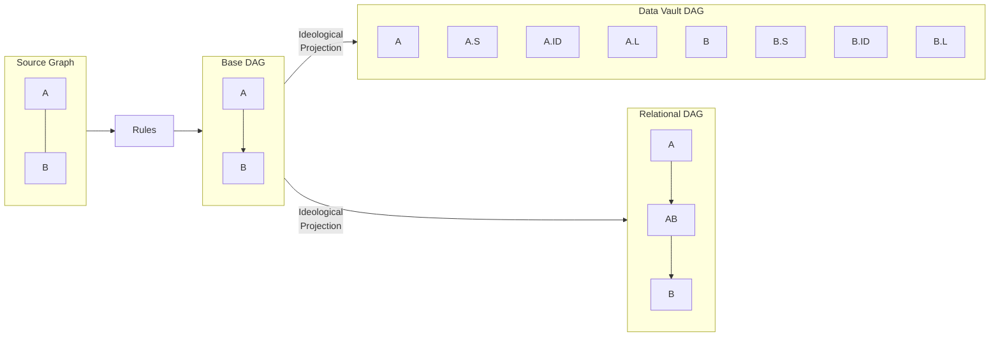

**Composability** is against the base DAG, but prior to encoding needs to be projected into the adjacent category.

---

# Slide 15: Projection From a Universe

## Session and Lineage Tracking

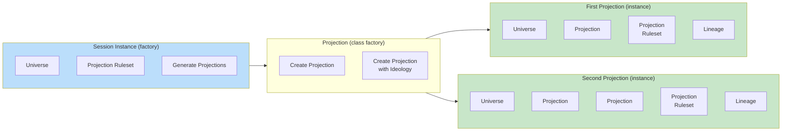

---

# Slide 16: Graph Joins

## Composing Universes

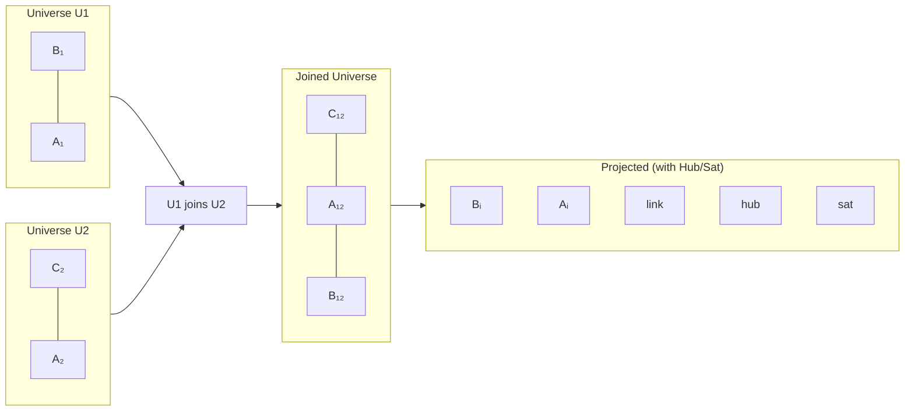

---

# Slide 17: Transformation Between DAGs

## Path-Based Transformation

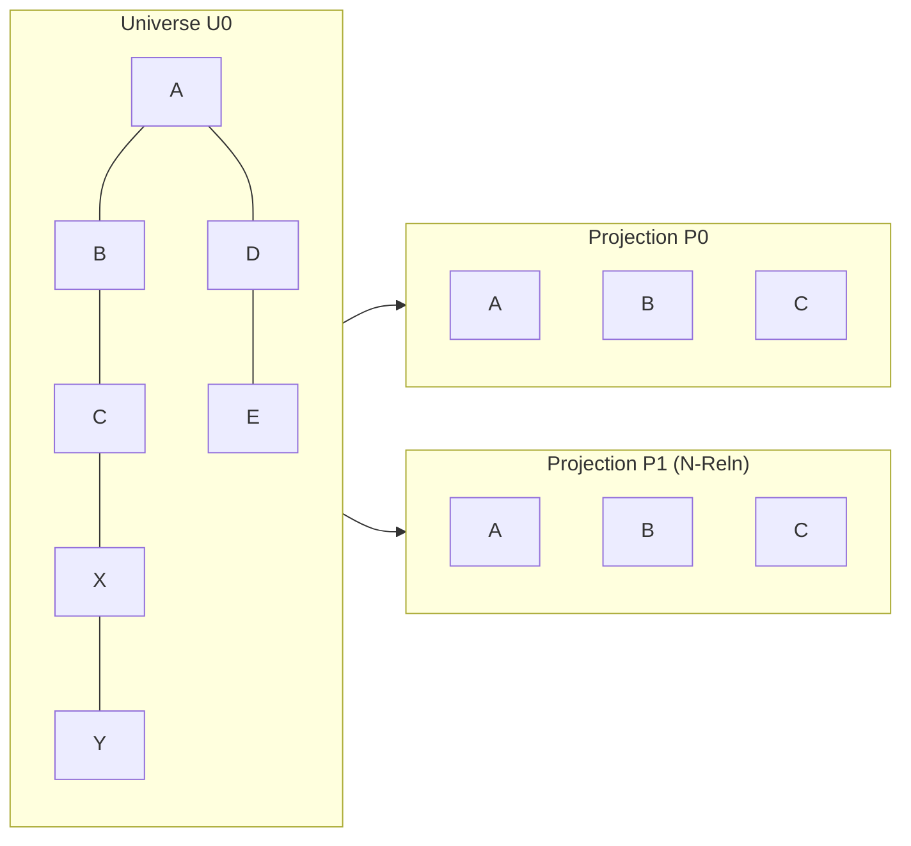

**Pre-Condition**:
1. Get Path: U0.Path(A,B)
2. Missing Nodes P0 needs to be fully contained within P0 - U0.Path(A,B)

**Transformation**:
```
P1.Traverse(P0.Path(A,B)).Arcs_Sequence.map(
    (p1.A, Seq(p0.A)) => Create_Node( Read_Node(p0.A), p1.A )
)
```

---

# Slide 18: Transform Instruction Set

## Aggregation and Optimization

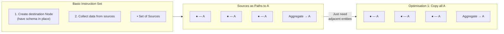

---

# Slide 19: Transforms Over Entities

## Two Fundamental Transform Types

### Type 1: Identity Preserving Transforms

- Usually **row-level operations** where entity identity is preserved through transformation
- New Aggregate Entities are created, but composing entity identities are preserved in the new aggregate

### Type 2: Aggregate Transforms

- New Aggregate Entities are created
- Composing entity identities are preserved in the new aggregate

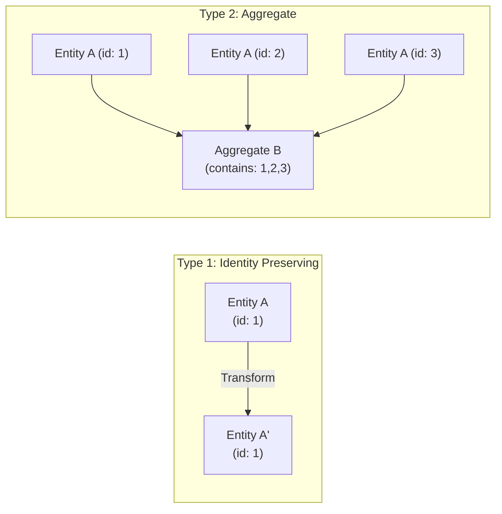

---

# Slide 20: Connection to Constraint Ontology

## Plato as Constraint-Preserving Transformation

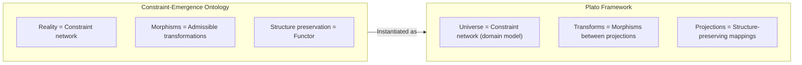

| Category Theory | Plato Implementation |
|-----------------|---------------------|
| **Objects** | Entities (Nodes) |
| **Morphisms** | Arcs (Relationships) |
| **Functor** | Projection (structure-preserving map) |
| **Natural Transformation** | Transform between projections |
| **Composition** | Path traversal |

**Plato is category theory made practical** - it automates what mathematicians call "functorial mappings" between data structures.

---

# Slide 21: Why This Matters

## The Business Value

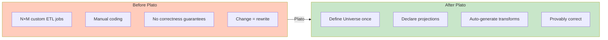

**Benefits**:
1. **Reduced development time** - Declare, don't code
2. **Correctness by construction** - Structure preservation is guaranteed
3. **Change resilience** - Modify universe, regenerate transforms
4. **Multi-target** - Same model → Spark, SQL, Python, etc.
5. **Lineage built-in** - Every transformation is traceable

---

# Slide 22: Summary

## Plato Transformations

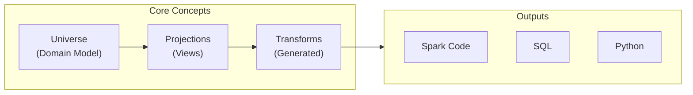

**Key Takeaways**:

1. **Define once, transform anywhere** - Single domain model, multiple projections
2. **Structure preservation** - Category-theoretic guarantees
3. **Automatic code generation** - DSL → executable transformation code
4. **Ideological projections** - Same model → Data Vault, Relational, etc.
5. **Composable universes** - Graph joins for cross-domain integration

> **The insight**: Data transformation is not about writing code - it's about declaring structure and letting mathematics generate the correct transformations.

---

*This presentation covers the Plato Transformations framework for automatic, structure-preserving data transformations using category theory principles.*

**Version**: 1.0
**Date**: February 2026
