# Political OS v1.0

## Constraint-Based Political Analysis Framework

*Applying the Constraint-Emergence Ontology to Political Systems*

---

# Slide 1: The Problem

## Political Analysis Without Shared Framework

Current political discourse suffers from:

- **No shared definitions** - "Freedom," "rights," "legitimacy" mean different things
- **Motive-based reasoning** - Judging policies by perceived intentions
- **Narrative capture** - Conclusions follow tribal affiliation
- **Category confusion** - Mixing OS-level constraints with program preferences

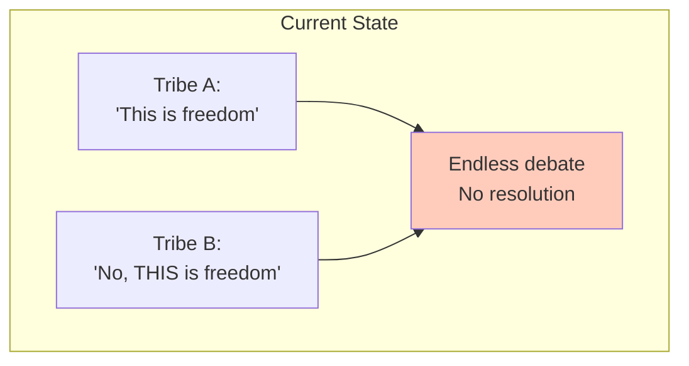

**The Question**: Can we build a constraint-based framework for political analysis?

---

# Slide 2: The Solution

## Political OS - A Constraint Specification

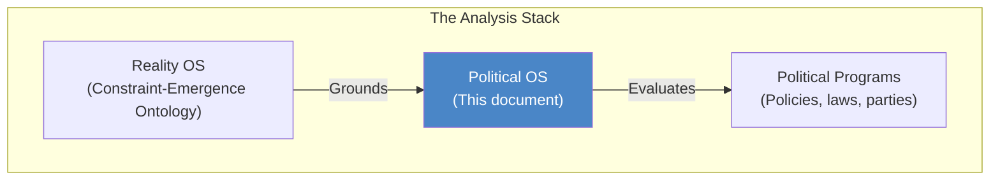

**Key insight**: Separate the **Operating System** (invariant constraints) from **Programs** (policies that run on it).

> Programs may fail. The Operating System must not be broken.

---

# Slide 3: Philosophical Grounding

## This OS is Not Neutral

**Explicitly grounded in Classical Western Liberalism** (Locke, Mill, etc.):

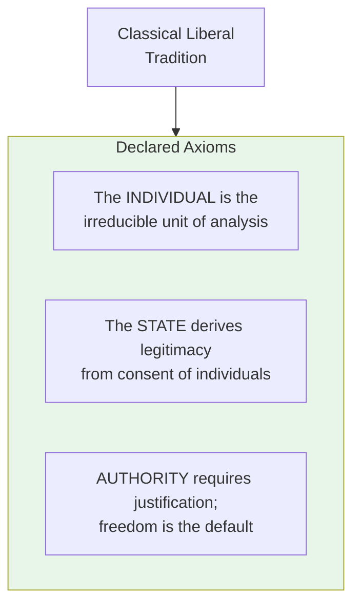

**This is a philosophical COMMITMENT, not a discovered truth.**

---

# Slide 4: Alternative Political Operating Systems

## One OS Among Many

| Political OS Variant | Primary Unit | Pre-Order (Gradient Direction) |
|---------------------|--------------|-------------------------------|
| **Classical Liberal (this document)** | Individual | Consent > Coercion |
| Collectivist | Class / Nation / State | Collective good > Individual preference |
| Theocratic | Divine order | Submission > Autonomy |
| Communitarian | Community | Belonging > Exit |

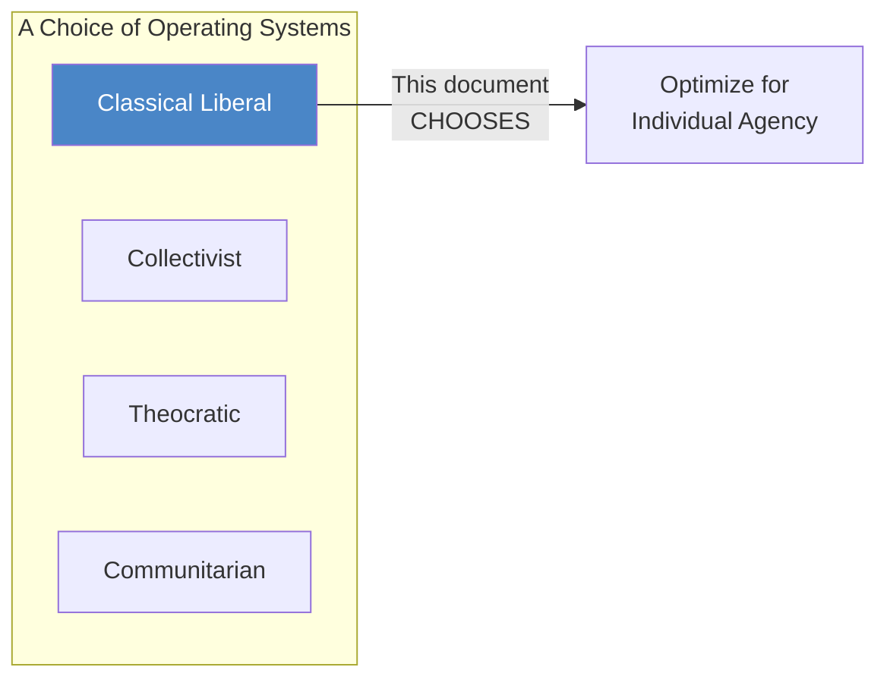

Each OS is internally consistent. This document adopts Classical Liberalism.

---

# Slide 5: The Individual as Markov Object

## Mapping to Constraint Ontology

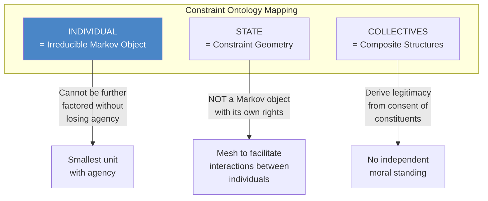

**Key insight**: The State is infrastructure, not an entity with its own interests.

---

# Slide 6: The Pre-Order - Consent > Coercion

## The Topological Gradient

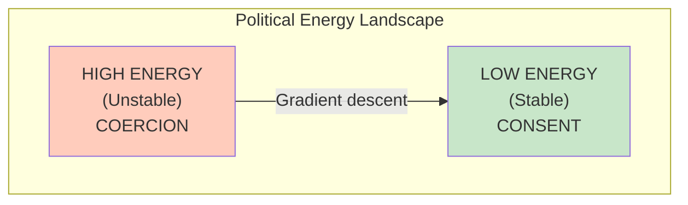

**The pre-order of this OS is directional**:

- **Consent** = Ground state (lowest energy, most stable)
- **Coercion** = Potential energy (instability to be minimized)
- System "rolls downhill" toward consent via gradient descent

**Agency and Information are load-bearing constraints** - compress them and the gradient inverts.

---

# Slide 7: Rights as Admissible Transformations

## Aristotelian, Not Platonic

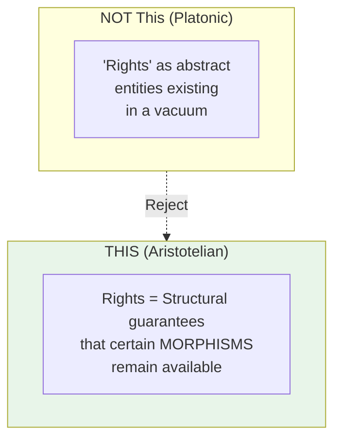

**Rights are meta-constraints** - constraints on the constraint geometry:

| Right | Structural Guarantee |
|-------|---------------------|
| Right to Information | Transformation "Exchange Information" never deleted |
| Right to Exit | Transformation "Leave Association" remains accessible |
| Legitimacy | System's potential for revocability remains actualized |

---

# Slide 8: Core Definitions

## Consent and Legitimacy

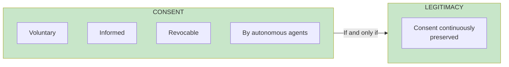

**Consent**: Voluntary, informed, and revocable authorization of authority by autonomous agents.

**Legitimacy**: A political system is legitimate **if and only if** consent is continuously preserved.

---

# Slide 9: The Four System Invariants

## Hard Constraints That Must Never Be Violated

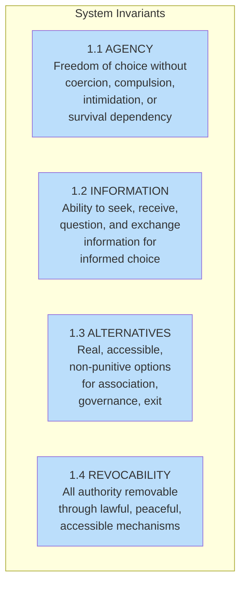

**These are the load-bearing walls of legitimate governance.**

---

# Slide 10: Invariant 1.1 - Agency

## Freedom of Choice

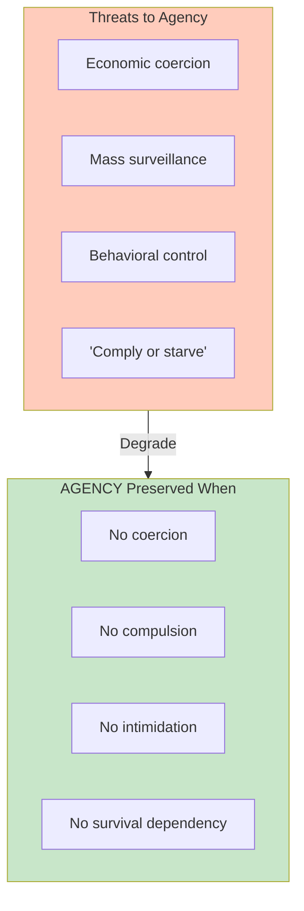

**Agency means**: Individuals can make choices without having their survival held hostage.

---

# Slide 11: Invariant 1.2 - Information

## The Prerequisite for Informed Consent

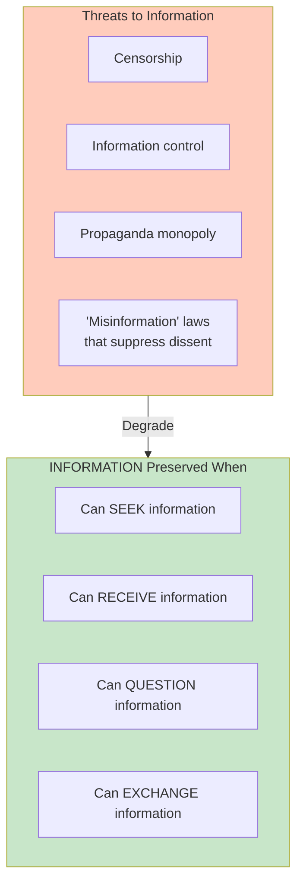

**Without information, consent is meaningless** - you can't agree to what you don't understand.

---

# Slide 12: Invariant 1.3 - Alternatives

## Exit Options Must Exist

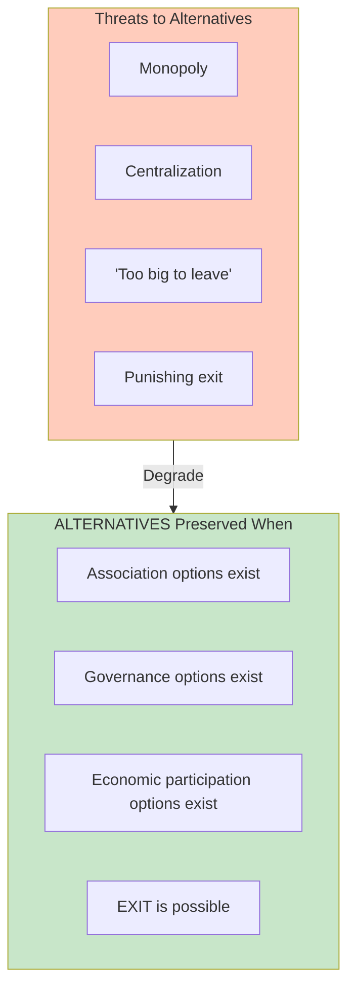

**"Consent" without alternatives is coercion** - you need real options to meaningfully choose.

---

# Slide 13: Invariant 1.4 - Revocability

## Authority Must Be Removable

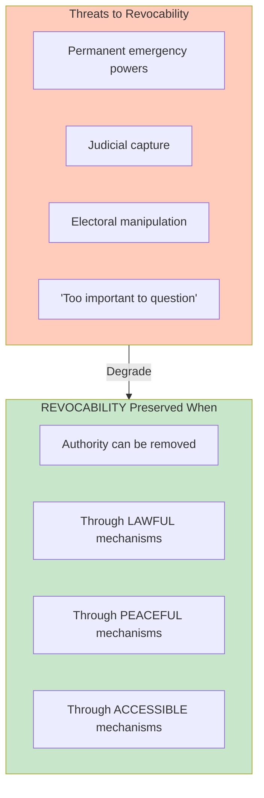

**Irrevocable authority is tyranny by definition** - no matter how benevolent.

---

# Slide 14: Threat Domain Classification

## Mapping Threats to Invariants

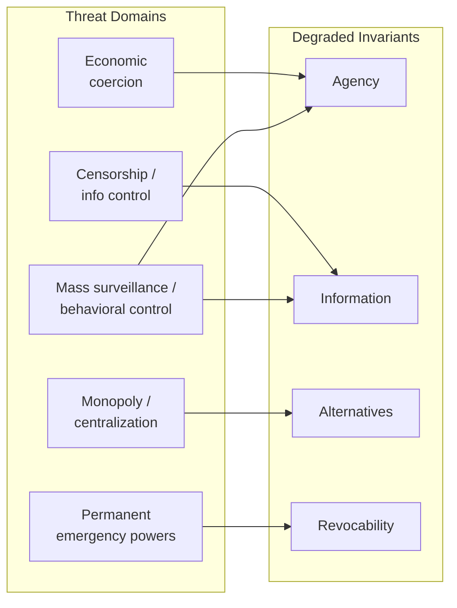

| Threat | Degrades |
|--------|----------|
| Economic coercion | Agency |
| Censorship / information control | Information |
| Monopoly / centralization | Alternatives |
| Permanent emergency powers | Revocability |
| Mass surveillance / behavioral control | Agency & Information |

---

# Slide 15: The Evaluation Algorithm

## Mechanical Analysis Process

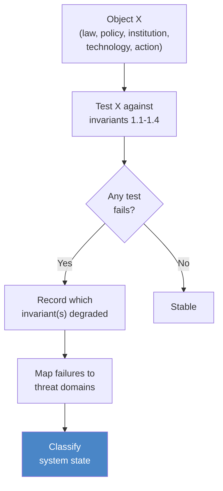

**The algorithm is mechanical** - no interpretation, no motives, just effects on invariants.

---

# Slide 16: System State Classification

## The Taxonomy

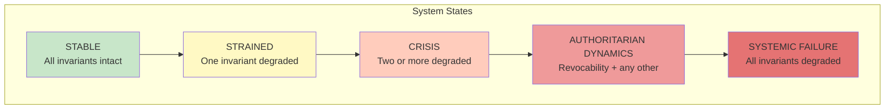

| State | Condition |
|-------|-----------|
| **Stable** | All invariants intact |
| **Strained** | One invariant degraded |
| **Crisis** | Two or more degraded |
| **Authoritarian Dynamics** | Revocability + any other degraded |
| **Systemic Failure** | All invariants degraded |

---

# Slide 17: Scope Rules

## What the Framework Does NOT Evaluate

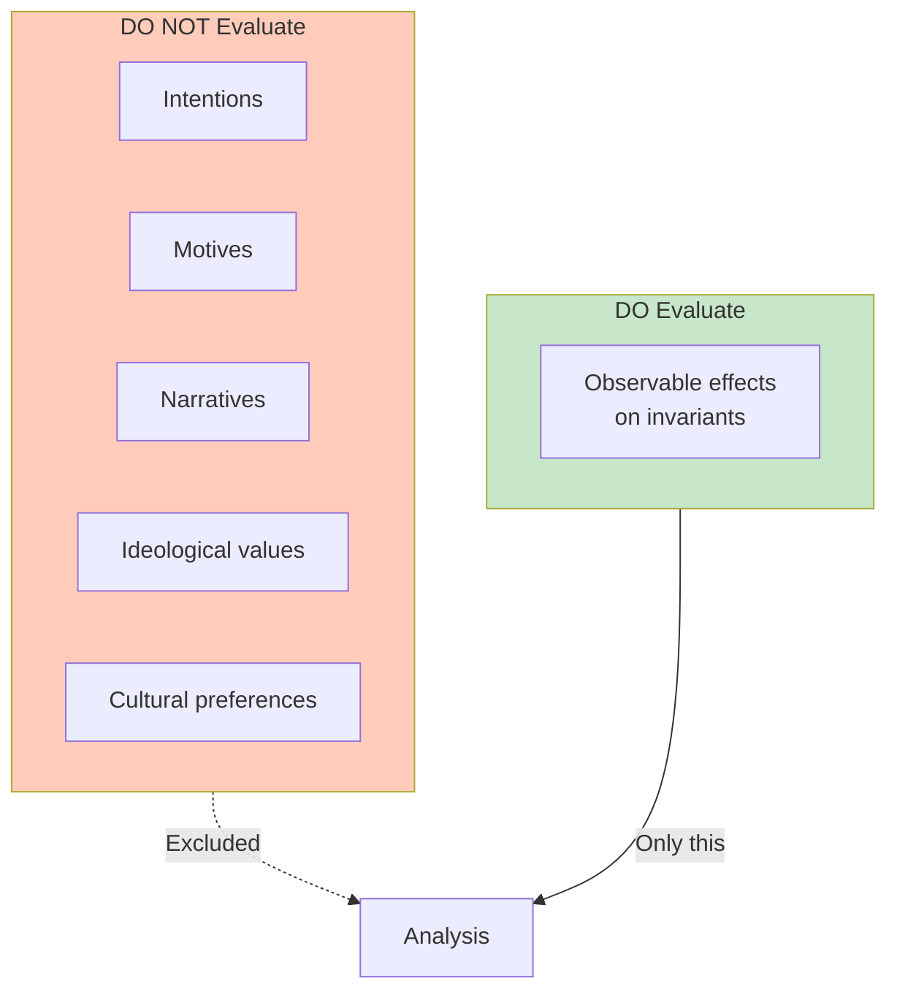

**Key principle**: Political programs may be good or bad subjectively. **Only OS violations matter** for this analysis.

---

# Slide 18: Example Analysis - Censorship Law

## Applying the Framework

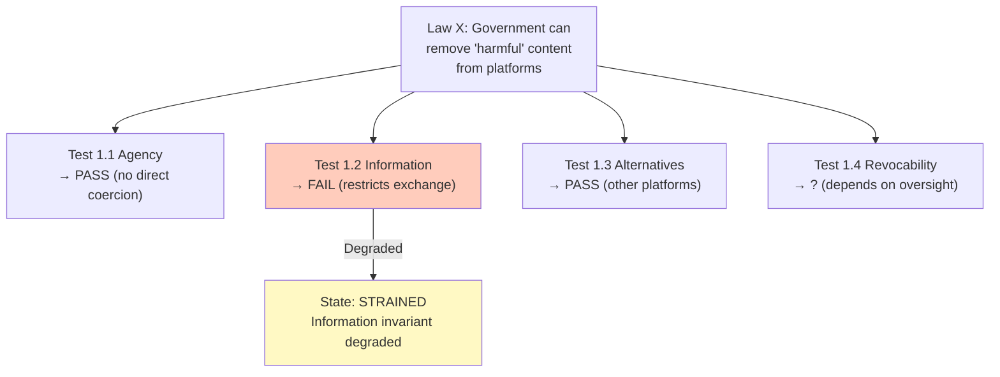

**Note**: Analysis is about effects, not whether the law is "well-intentioned."

---

# Slide 19: Example Analysis - Emergency Powers

## Compounding Degradation

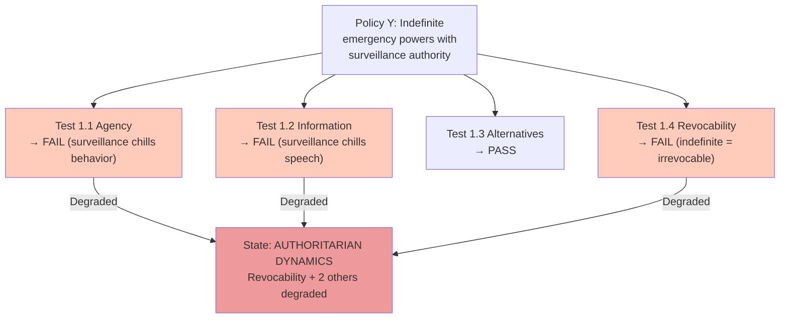

**Multiple invariant failures compound** - this triggers "Authoritarian Dynamics" classification.

---

# Slide 20: The Gradient Inversion Problem

## When the System Rolls Uphill

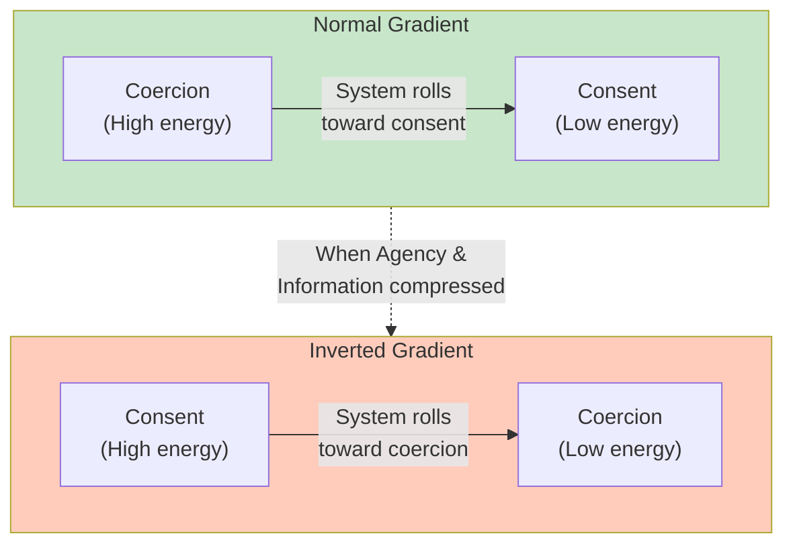

**Agency and Information are load-bearing constraints**. Compress them and the consent gradient inverts - the system naturally drifts toward coercion rather than away from it.

---

# Slide 21: Connection to Constraint-Emergence Ontology

## Political Systems as Constraint Manifolds

```mermaid
flowchart TB
    subgraph Ontology["Constraint-Emergence Ontology"]
        O1["Reality = Constraint network"]
        O2["Stable patterns = Markov objects"]
        O3["Change = Gradient descent"]
    end

    subgraph Political["Political OS"]
        P1["Society = Constraint network"]
        P2["Individuals = Markov objects"]
        P3["Politics = Gradient toward consent"]
    end

    Ontology -->|"Instantiated in"| Political
```

| Ontology Concept | Political Mapping |
|------------------|-------------------|
| Constraint network | Social/legal structure |
| Markov object | Individual with agency |
| Constraint geometry | The State |
| Admissible transformations | Rights |
| Gradient descent | Movement toward consent |
| Attractor basin | Stable governance |

---

# Slide 22: Why This Framework Matters

## Objective Analysis Becomes Possible

```mermaid
flowchart TB
    subgraph Without["Without Framework"]
        W1["'That policy is fascist!'"]
        W2["'No, it's protecting democracy!'"]
        W3["Endless tribal conflict"]
    end

    subgraph With["With Framework"]
        A1["Test against invariants"]
        A2["Classify system state"]
        A3["Objective assessment"]
    end

    Without -.->|"Replace with"| With

    style Without fill:#ffccbc
    style With fill:#c8e6c9
```

**The framework enables**:
- Analysis without tribal affiliation
- Consistent evaluation across policies
- Early detection of systemic degradation
- Common vocabulary for disagreement

---

# Slide 23: Limitations

## What This Framework Cannot Do

```mermaid
flowchart TB
    subgraph Cannot["Framework CANNOT"]
        C1["Tell you which<br/>programs to prefer"]
        C2["Resolve individual<br/>conflicts"]
        C3["Address international<br/>relations"]
        C4["Choose between<br/>OS variants"]
    end

    subgraph Can["Framework CAN"]
        D1["Detect OS-level<br/>violations"]
        D2["Classify system<br/>state"]
        D3["Identify which<br/>invariants at risk"]
    end
```

**This is a diagnostic tool, not a prescription** - it tells you when the OS is breaking, not which programs to run.

---

# Slide 24: The Single Operating Principle

## The Meta-Rule

```mermaid
flowchart TB
    subgraph Principle["The Operating Principle"]
        PROG["Programs may fail"]
        OS["The Operating System<br/>must not be broken"]
    end

    PROG --> ACCEPTABLE["Acceptable:<br/>Bad policy, repeal it"]
    OS --> UNACCEPTABLE["Unacceptable:<br/>Broken OS, can't repeal anything"]

    style UNACCEPTABLE fill:#ffccbc
```

**Programs failing is normal** - democracies pass bad laws and repeal them.

**OS breaking is catastrophic** - once invariants are degraded, the mechanisms for correction are gone.

---

# Slide 25: Summary

## Political OS v1.0

```mermaid
flowchart TB
    subgraph Framework["The Framework"]
        GROUND["Grounded in<br/>Classical Liberalism"]
        UNIT["Individual as<br/>irreducible Markov object"]
        GRADIENT["Consent > Coercion<br/>as pre-order"]
        INV["Four invariants:<br/>Agency, Information,<br/>Alternatives, Revocability"]
        ALGO["Mechanical<br/>evaluation algorithm"]
    end

    subgraph Output["Framework Outputs"]
        STATE["System state<br/>classification"]
        THREAT["Threat domain<br/>identification"]
        EARLY["Early warning of<br/>OS degradation"]
    end

    Framework --> Output
```

**Key takeaways**:
1. Separate OS (invariants) from Programs (policies)
2. Evaluate effects, not intentions
3. Rights are meta-constraints preserving morphisms
4. The gradient points toward consent
5. Multiple invariant failures compound
6. OS breakdown prevents correction of programs

---

# Slide 26: Applying the Framework

## Your Turn

**For any policy, law, institution, or technology X**:

1. **Test against invariants 1.1-1.4**
   - Does it degrade Agency?
   - Does it degrade Information?
   - Does it degrade Alternatives?
   - Does it degrade Revocability?

2. **Map to threat domains**

3. **Classify system state**
   - Stable / Strained / Crisis / Authoritarian Dynamics / Systemic Failure

4. **Ask**: Is this an OS violation or just a bad program?

> **Programs may fail. The Operating System must not be broken.**

---

*This presentation applies the Constraint-Emergence Ontology to political systems, treating legitimacy as a constraint satisfaction problem with individual agency as the irreducible Markov object.*

**Document Version**: 1.0
**Date**: February 2026
