# Thermodynamics of Information Systems

## Energy Gradients, Entropy, and the Emergence of Structure

*How physical principles govern the behavior of information systems*

---

# Slide 1: The Deep Connection

## Information Systems Obey Physical Laws

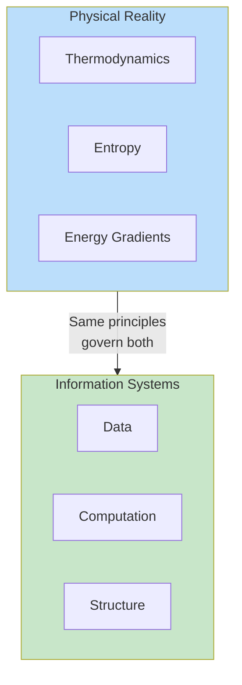

**Core insight**: Information systems are physical systems. They consume energy, increase entropy, and follow thermodynamic principles.

This presentation explores the deep isomorphism between thermodynamics and information processing.

---

# Slide 2: Energy Carriers and Resources

## The Fundamental Unit

**Resources are captured energy that can be consumed. They are Energy Carriers.**

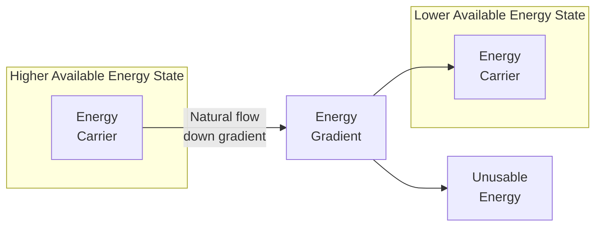

**In information systems**:
- Data is an energy carrier
- Processing consumes the gradient
- Some energy always becomes unusable (overhead, heat, latency)

---

# Slide 3: The Natural Energy Gradient

## Topology Creates the Gradient

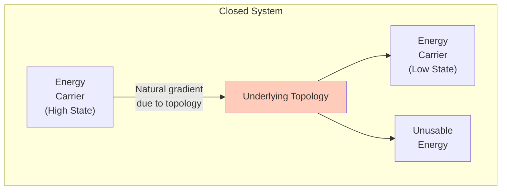

**Key insight**: The underlying topology of a system creates the energy gradient. Energy flows "downhill" according to the structure.

**Some energy will always become unusable** for a closed system - it hasn't left the system, but has become unavailable to the many topologies of that system.

---

# Slide 4: Natural Systems and Energy Gradients

## Entropy Always Increases in Closed Systems

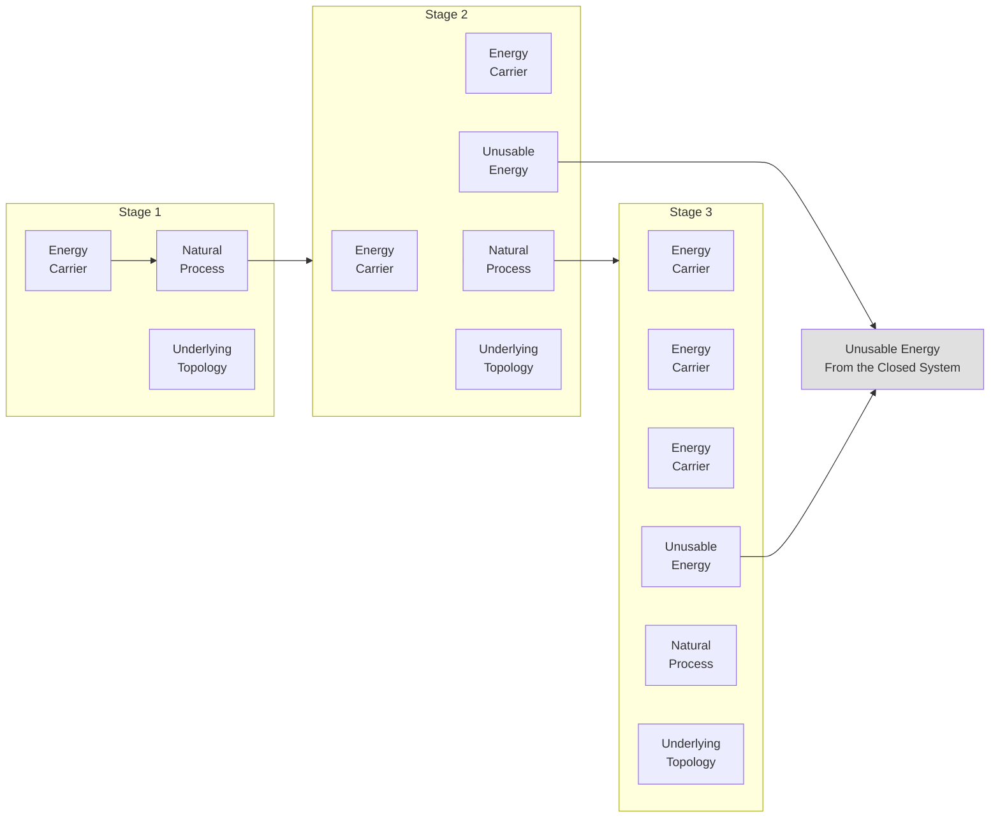

**Closed system rule**: Entropy always increases. Some energy will always become unusable at each stage.

---

# Slide 5: Entropy Decreasing Gradients

## The Emergence of Information

**Closed System, Entropy Always Increases** - BUT NET Entropy always increases **more quickly** when it contains **Entropy Decreasing sub-systems**.

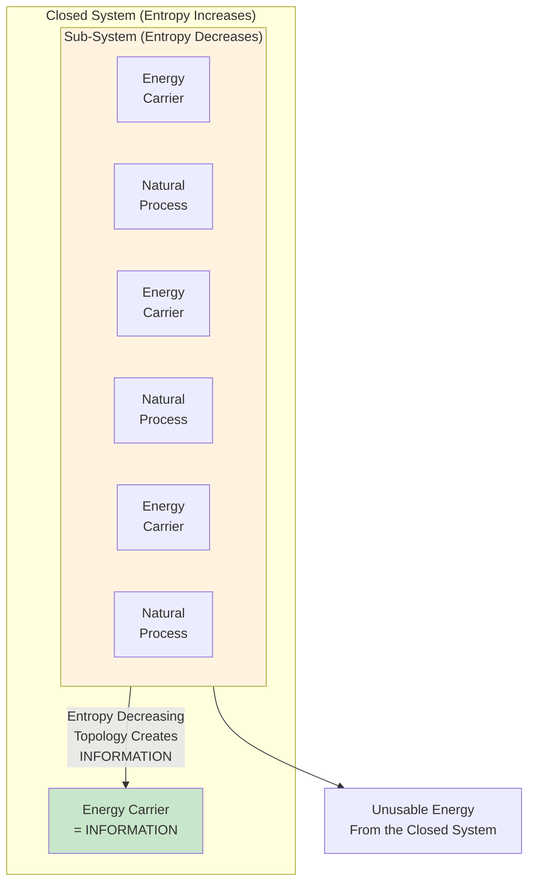

**The profound insight**: Entropy-decreasing topology **creates information**.

---

# Slide 6: Capture and Release Processes

## The Two Fundamental Operations

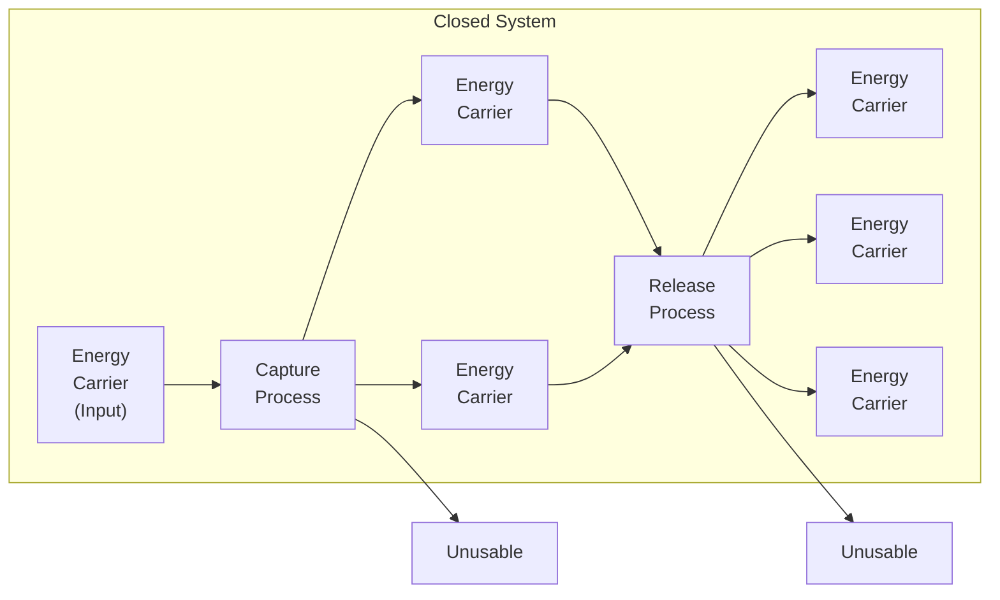

**In information systems**:
- **Capture** = Ingest, parse, validate, store
- **Release** = Query, transform, export, serve

Both processes have inherent energy loss (unusable energy).

---

# Slide 7: Self-Identity as Optimization

## The Emergence of Self

> **Self-Identity arose as an optimization for constant preservation on feedback from underlying sense system.**

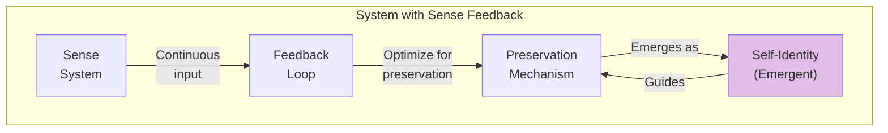

**Key insight**: Self-identity is not fundamental - it emerges as an optimization strategy for systems that need to preserve themselves over time.

This connects to:
- Homeostasis in biological systems
- State preservation in information systems
- The "consciousness loop" in AI SDLC

---

# Slide 8: Open vs Closed Systems

## The Critical Distinction

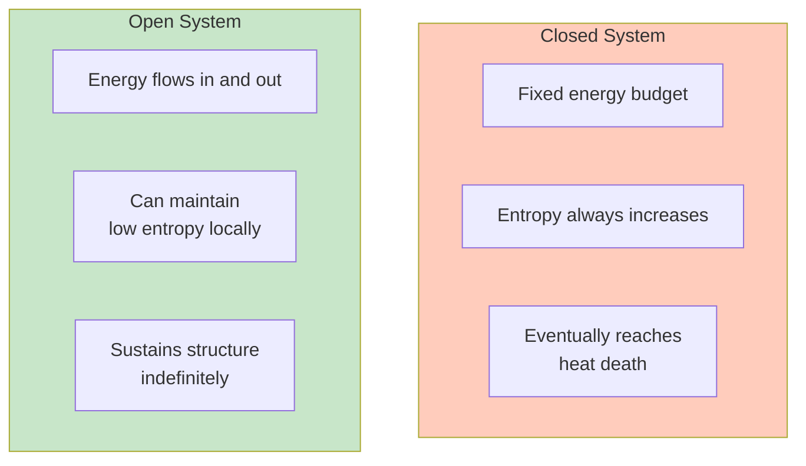

| Property | Closed System | Open System |
|----------|--------------|-------------|
| Energy | Fixed | Flows through |
| Entropy | Always increases | Can decrease locally |
| Structure | Degrades | Can emerge and persist |
| Examples | Isolated universe | Living organisms, businesses |

**Information systems must be open** - they require continuous energy input to maintain structure.

---

# Slide 9: The Thermodynamic Cost of Computation

## Landauer's Principle

**Erasing one bit of information requires a minimum energy dissipation**:

```
E_min = k_B * T * ln(2)
```

Where:
- k_B = Boltzmann constant
- T = Temperature
- ln(2) ≈ 0.693

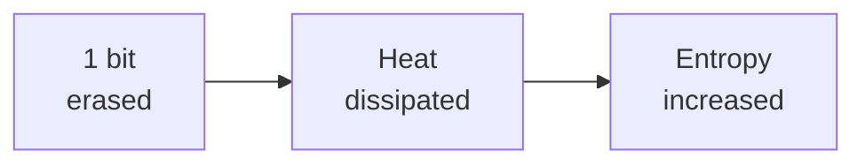

**Implication**: Every computation has a thermodynamic cost. Data processing is not free - it consumes energy and produces heat.

---

# Slide 10: Information as Negative Entropy

## Maxwell's Demon and the Cost of Knowledge

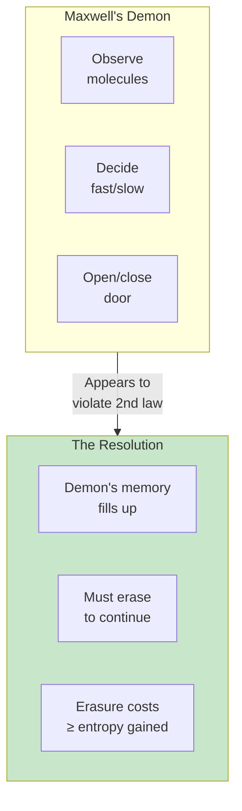

**The resolution**: The demon must store information about each molecule. When memory fills, erasure costs at least as much entropy as was gained.

**Information = Negative Entropy** (negentropy)

Gaining information requires expending energy. There is no free lunch.

---

# Slide 11: Structure Requires Energy Maintenance

## The Cost of Order

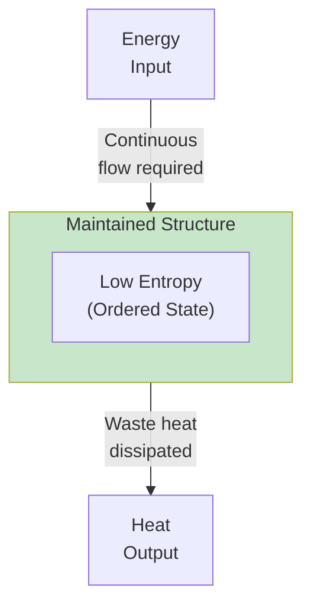

**Examples in information systems**:

| Structure | Energy Cost |
|-----------|-------------|
| Database indices | CPU cycles to maintain |
| Cached data | Memory power |
| Replicated data | Network + storage |
| Running services | Continuous compute |

**If energy input stops, structure degrades** (data corruption, cache invalidation, service failure).

---

# Slide 12: Entropy and Data Quality

## The Decay of Information

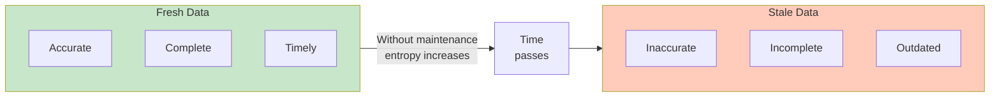

**Data quality degrades naturally** - this is entropy in action:
- Reference data becomes stale
- Relationships break
- Business rules change
- Formats evolve

**Maintaining data quality requires continuous energy investment**.

---

# Slide 13: The Energy Budget of Information Systems

## Where Does the Energy Go?

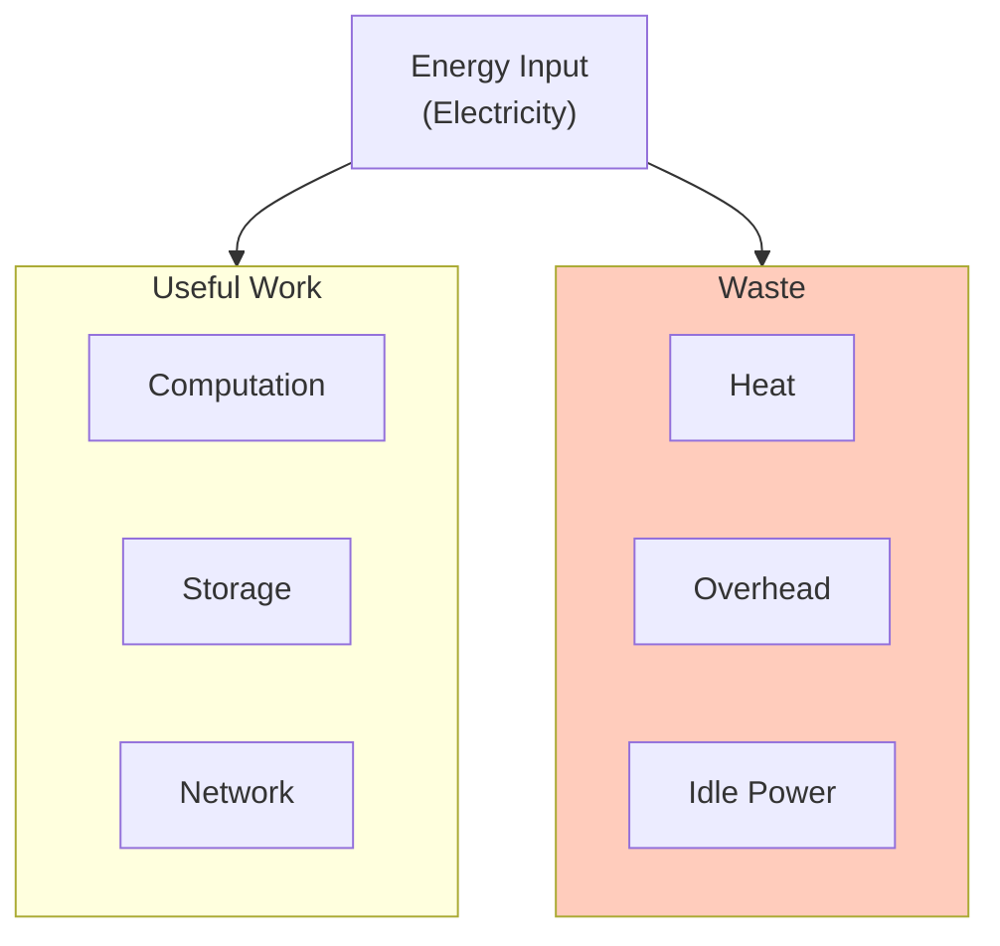

**Typical data center efficiency**:
- ~40-60% goes to actual computation
- ~40-60% goes to cooling, power conversion, overhead

**This is thermodynamics in action** - no system can be 100% efficient.

---

# Slide 14: Emergence Through Energy Flow

## Structure Emerges from Gradients

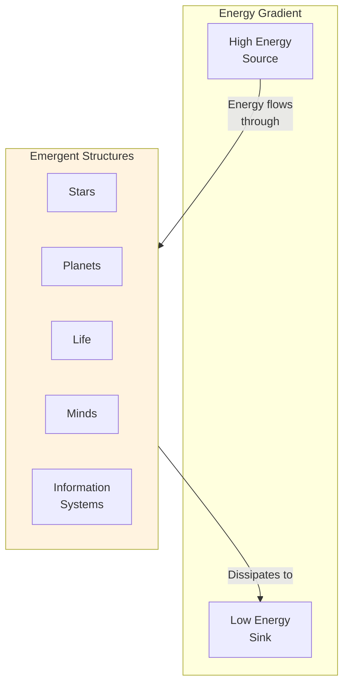

**The profound insight**: Complex structures emerge **because** they are efficient at dissipating energy gradients.

- Stars emerge because fusion dissipates gravitational potential
- Life emerges because metabolism dissipates chemical gradients
- Information systems emerge because they dissipate economic gradients

---

# Slide 15: The Dissipative Structure

## Ilya Prigogine's Insight

**Dissipative structures** are systems that:
1. Exist far from thermodynamic equilibrium
2. Exchange energy/matter with environment
3. Maintain internal order by exporting entropy

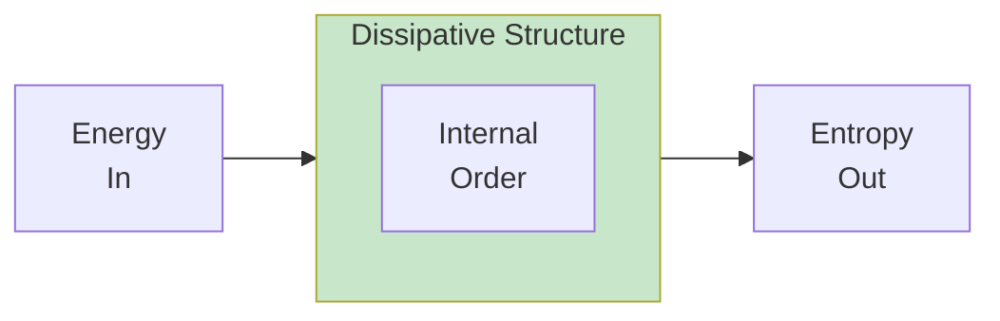

**Examples**:
- Hurricanes
- Living cells
- Economies
- Information systems

---

# Slide 16: Connection to Constraint Ontology

## Energy Gradients as Constraints

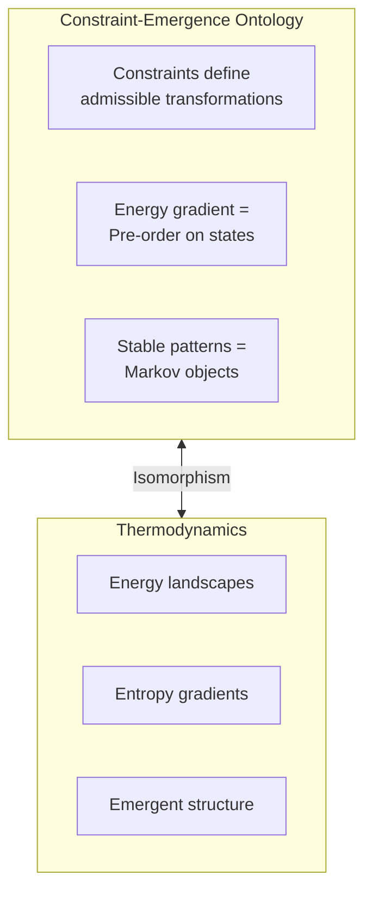

| Constraint Ontology | Thermodynamics |
|---------------------|----------------|
| Constraint manifold | Energy landscape |
| Pre-order (gradient) | Entropy gradient |
| Markov object | Dissipative structure |
| Collapse | Equilibration |

**They are the same thing** described in different languages.

---

# Slide 17: Implications for System Design

## Designing with Thermodynamics

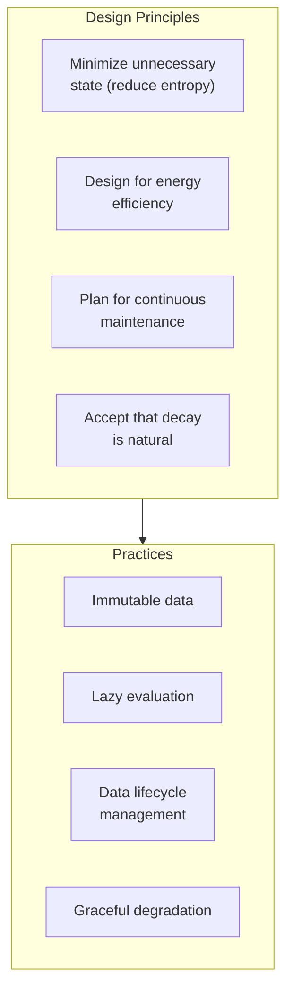

**Design with thermodynamics, not against it**:
- Don't fight entropy - manage it
- Budget for maintenance energy
- Design for graceful degradation
- Embrace immutability (preserves order)

---

# Slide 18: The Information-Energy Equivalence

## Landauer Meets Shannon

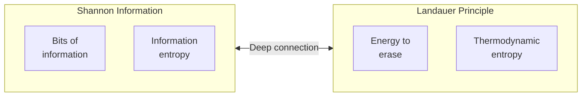

**The connection**:
- Shannon entropy measures uncertainty/information content
- Thermodynamic entropy measures disorder
- They are mathematically identical (up to a constant)

**Information IS physical** - it has mass, takes up space, requires energy to process.

---

# Slide 19: The Arrow of Time in Information Systems

## Why Time Flows Forward

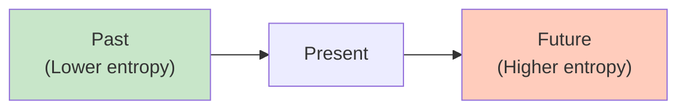

**The thermodynamic arrow of time**:
- Entropy increases into the future
- This is why we remember the past but not the future
- This is why cause precedes effect

**In information systems**:
- Event logs flow forward
- State accumulates
- Undo is expensive (requires storing history)

---

# Slide 20: Summary - The Thermodynamics of Information

## Key Principles

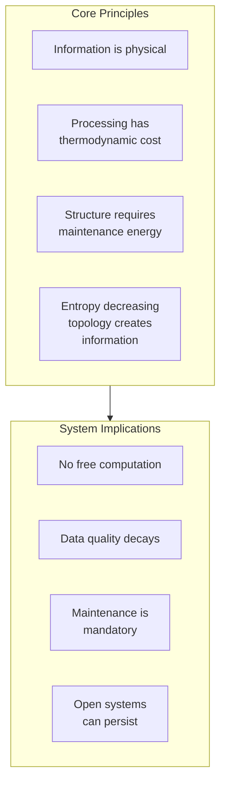

**Key Takeaways**:

1. **Information is physical** - it obeys thermodynamic laws
2. **Computation has costs** - minimum energy per bit erased
3. **Structure requires energy** - stop the input, lose the order
4. **Entropy decreases locally** by increasing globally faster
5. **Self-identity emerges** as preservation optimization
6. **Design with physics** - don't fight thermodynamics, work with it

---

# Slide 21: Connection to AI SDLC

## Homeostasis as Thermodynamic Equilibrium

```mermaid
flowchart TB
    subgraph AISDLC["AI SDLC"]
        HOMEO["Homeostasis Model"]
        FEEDBACK["Feedback Loops"]
        STABLE["Stable Artifacts"]
    end

    subgraph Thermo["Thermodynamics"]
        DISSIP["Dissipative Structure"]
        ENERGY_FLOW["Energy Flow"]
        ORDER["Maintained Order"]
    end

    HOMEO <-->|"Same pattern"| DISSIP
    FEEDBACK <-->|"Same pattern"| ENERGY_FLOW
    STABLE <-->|"Same pattern"| ORDER
```

**The AI SDLC methodology** is a dissipative structure:
- Requires continuous energy input (human intent, compute)
- Maintains internal order (requirements, code, tests)
- Exports entropy (heat, failed builds, rejected PRs)
- Persists by processing gradients (business needs → working software)

---

*This presentation explores how thermodynamic principles govern information systems, connecting physical law to system design.*

**Version**: 1.0
**Date**: February 2026
