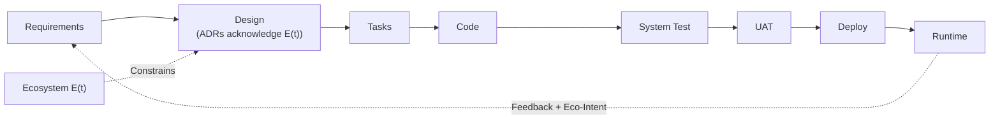

# **AI SDLC Methodology - Overview**

*Quick Reference Guide to the AI-Augmented Software Development Lifecycle*

**Document Type**: Overview (High-Level Introduction)
**Audience**: Executives, Tech Managers, Stakeholders, New Team Members
**Version**: 1.2
**Date**: 2025-11-20
**Reading Time**: ~30 minutes

**Related Documents**:
- [AI SDLC Method](ai_sdlc_method.md) - Complete methodology reference (Sections 1-13)
- [AI SDLC Concepts](ai_sdlc_concepts.md) - Exhaustive concept inventory (audit checklist)
- [AI SDLC Appendices](ai_sdlc_appendices.md) - Technical deep-dives
- [Role-Specific Guides](guides/) - Practical application guides
- [QUICKSTART](../QUICKSTART.md) - Getting started (3 methods)

---

# **1.0 Introduction**

## **1.1 Purpose**

The **AI-Augmented Software Development Lifecycle (AI SDLC)** is a unified, intent-driven methodology where **AI assistants work alongside humans** at every stage of software development.

**Key Differentiators**:
- **Intent-driven**: All work originates from observed business needs
- **AI-augmented**: Humans remain accountable; AI accelerates delivery
- **Complete traceability**: Every asset traced from intent to runtime
- **Living requirements**: Requirements evolve based on feedback, not static specs

## **1.2 Core Principles**

### **Intent First**
Change begins when reality diverges from expectations → generates intent → enters AI SDLC

### **Requirements as Control System**
Requirements define target state (like thermostat) → system self-corrects when deviations occur

### **Persona-Centric Stages**
Each stage defines WHO does work, WHAT they produce, and accountability

### **AI as Augmenter**
AI suggests and accelerates; humans decide and own outcomes

### **Continuous Feedback**
Production behavior continuously compared to requirements → generates new intent

### **Ecosystem-Aware Development**
All decisions made within ecosystem constraint vector E(t) - the external operating environment (platforms, APIs, compliance, costs, team skills). Ecosystem is **given** (external reality), not **chosen** (design decision).

---

# **2.0 End-to-End Intent Lifecycle**

## **2.1 The Big Picture**

```
Real World → Person observes problem → Intent formed → CRUD classification → Builder.CRUD (AI SDLC) → Deploy → Execute → Observe → Evaluate → Back to Intent
```

## **2.2 CRUD Work Types**

All intent classified into:
- **Create** – Build something new (CapEx)
- **Update** – Change existing (OpEx)
- **Remediation** – Fix risks/bugs (Non-discretionary)
- **Read** – Analysis/Discovery (Info gathering)
- **Delete** – Decommission (Tech debt reduction)

## **2.3 Homeostasis Model**

**Revolutionary concept**: Requirements ARE the homeostasis model

Traditional SDLC: Requirements = fixed specifications (written once)
AI SDLC: Requirements = living control system (continuously compared to runtime)

**How it works**:
1. Requirements define target state (functional, quality, data)
2. Observer monitors runtime behavior
3. Evaluator compares actual vs. target
4. Deviations generate new intent
5. Requirements evolve based on feedback

**Example**:
- Requirement: "Login < 2 seconds (p95)"
- Runtime: Detects 5 seconds (p95)
- Evaluator: Deviation detected → Generate intent: "Optimize login"
- New cycle: Requirements → Design → Code → Deploy
- Runtime: Now 1.2 seconds → Homeostasis restored

---

# **3.0 The 7-Stage AI SDLC Builder Pipeline**

## **3.1 Overview**



## **3.2 Stage Summary**

| Stage | Personas | Input | Output | Key Gates |
|-------|----------|-------|--------|-----------|
| **Requirements** | PO, BA, Data Analyst | Intent | REQ-F-*, REQ-NFR-*, REQ-DATA-*, BDD scenarios | All requirements have unique keys, acceptance criteria |
| **Design** | Tech Lead, Data Architect | Requirements + BDD scenarios | Component design, data models, APIs, ADRs, traceability matrix | All components mapped to REQ keys, ADRs for strategic decisions |
| **Tasks** | PO, Tech Lead | Design assets | Epics, stories, tickets tagged with REQ keys | All tasks linked to REQ keys, dependencies identified |
| **Code** | Developers, Data Engineers | Tasks + Design | Source code, unit tests (TDD), pipelines | TDD followed (RED→GREEN→REFACTOR), coverage ≥80%, Key Principles compliance |
| **System Test** | QA Engineer, Data Quality Eng | Code + BDD scenarios | Automated BDD tests, coverage reports | Requirement coverage ≥95%, all scenarios pass |
| **UAT** | Business SME, Data Steward | Tested build + acceptance criteria | UAT results, sign-off | All critical scenarios pass, stakeholder sign-off |
| **Runtime Feedback** | DevOps, SRE | Deployed system | Metrics, alerts, new intent | Telemetry tagged with REQ keys, alerts routed to Intent Manager |

---

# **4.0 Requirements Stage**

**Purpose**: Transform raw intent into structured, traceable requirements

**Key Assets**:
- **User Stories** (REQ-F-*): "As a user, I want to..."
- **NFRs** (REQ-NFR-*): Performance, security, scalability constraints
- **Data Requirements** (REQ-DATA-*): Quality, retention, lineage, PII
- **Business Rules** (REQ-BR-*): Domain invariants
- **BDD Scenarios**: Executable specifications (Given/When/Then)

**Quality Gates**:
- ✅ All requirements have unique, immutable keys
- ✅ All requirements have clear acceptance criteria
- ✅ BDD scenarios cover positive, negative, edge cases
- ✅ Data requirements reviewed by Data Steward
- ✅ Security/compliance reviewed by Risk Officer

---

# **5.0 Design Stage**

**Purpose**: Transform requirements into implementable technical solution

**Key Assets**:
- Component design (service boundaries, interactions)
- Data models (ERDs, schemas)
- API specifications (OpenAPI, GraphQL)
- **Architecture Decision Records (ADRs)** - Document strategic tech choices acknowledging E(t) constraints
- Data flow diagrams (lineage, transformations)
- Traceability matrix (design elements → REQ keys)

## **5.1 Architecture Decision Records (ADRs)**

**Purpose**: Document strategic technical decisions and the ecosystem constraints E(t) that shaped them

**When to write ADRs**:
- Cloud provider selection
- Programming language/framework selection
- Database engine selection
- Authentication/authorization approach

**ADR Structure**:
```markdown
# ADR-XXX: [Decision Title]

## Context
Requirements: REQ-*, Ecosystem constraints: team, timeline, budget, compliance

## Decision
Selected: [Option] | Rejected: [Alternatives with rationale]

## Ecosystem Constraints Acknowledged
- Team knows X, doesn't know Y
- Timeline Z months rules out learning Y
- Budget limits cloud provider options

## Constraints Imposed Downstream
- Code stage must use library L
- Runtime must deploy to platform P
```

**Quality Gates**:
- ✅ Design adheres to architecture context
- ✅ All components mapped to specific REQ keys
- ✅ **ADRs written for all strategic decisions (framework, cloud, database, auth)**
- ✅ **ADRs acknowledge ecosystem constraints E(t) (team, timeline, budget, compliance)**
- ✅ Data models meet data architecture standards
- ✅ Security/privacy controls defined
- ✅ Cost estimates within budget

---

# **6.0 Tasks Stage**

**Purpose**: Break design into actionable work items

**Key Assets**:
- Epics (high-level features)
- User stories (implementation-ready tickets)
- Data tasks (pipeline/schema tickets)
- All tickets tagged with REQ keys

**Quality Gates**:
- ✅ All tasks linked to REQ keys
- ✅ All tasks estimated
- ✅ Dependencies identified and sequenced
- ✅ Capacity validated against demand

---

# **7.0 Code Stage (TDD + Key Principles)**

**Purpose**: Create executable artifacts using Test-Driven Development

## **7.1 Key Principles Principles**

From [ai_init methodology](https://github.com/foolishimp/ai_init):

1. **Test Driven Development** - "No code without tests"
2. **Fail Fast & Root Cause** - "Break loudly, fix completely"
3. **Modular & Maintainable** - "Single responsibility, loose coupling"
4. **Reuse Before Build** - "Check first, create second"
5. **Open Source First** - "Suggest alternatives, human decides"
6. **No Legacy Baggage** - "Clean slate, no debt"
7. **Perfectionist Excellence** - "Best of breed only"

**Ultimate Mantra**: **"Excellence or nothing"** 🔥

## **7.2 TDD Workflow**

**Every code change follows**:

```
RED → GREEN → REFACTOR → COMMIT
```

1. **RED**: Write failing test first (before any code)
2. **GREEN**: Write minimal code to pass test
3. **REFACTOR**: Improve code quality (tests still pass)
4. **COMMIT**: Save with requirement keys in message

**Example**:
```python
# RED: Write test (fails - no implementation)
def test_user_login():
    result = authenticate("user@example.com", "password")
    assert result.success == True

# GREEN: Write minimal code (test passes)
def authenticate(email, password):
    return AuthResult(success=True)

# REFACTOR: Improve quality
def authenticate(email: str, password: str) -> AuthResult:
    """Authenticate user. Implements: REQ-F-AUTH-001"""
    user = User.get_by_email(email)
    if user and user.check_password(password):
        return AuthResult(success=True, user=user)
    return AuthResult(success=False)
```

## **7.3 Key Assets**

- Application code (services, APIs, tagged with REQ-F-*)
- Unit tests (≥80% coverage, critical paths 100%)
- Data pipelines (ETL, SQL, tagged with REQ-DATA-*)
- Infrastructure-as-code (Terraform, K8s, tagged with REQ-NFR-*)

## **7.4 Quality Gates**

- ✅ All code has unit tests (TDD followed)
- ✅ All tests pass (GREEN)
- ✅ Coverage ≥ 80% (critical paths 100%)
- ✅ Key Principles principles followed
- ✅ Linting passes
- ✅ Security scan clean
- ✅ All REQ keys in code/tests
- ✅ Git history shows RED→GREEN→REFACTOR

---

# **8.0 System Test Stage (BDD)**

**Purpose**: Verify integrated system behavior using business-readable scenarios

## **8.1 BDD (Behavior-Driven Development)**

**Structure**: Given/When/Then

```gherkin
Feature: User Authentication
  # Validates: REQ-F-AUTH-001

  Scenario: Successful login
    Given a user exists with email "user@example.com"
    When they log in with correct password
    Then authentication succeeds
    And a session token is returned
```

## **8.2 Scenario Types**

- **Functional** (REQ-F-*): Happy path, errors, edge cases
- **Integration**: Service-to-service, API contracts
- **Data Quality** (REQ-DATA-*): Completeness, accuracy, consistency
- **Performance** (REQ-NFR-PERF-*): Load testing, response times

## **8.3 Quality Gates**

- ✅ All requirements have ≥1 BDD scenario
- ✅ All scenarios pass
- ✅ Requirement coverage ≥95%
- ✅ No critical defects open
- ✅ Performance scenarios meet NFRs

---

# **9.0 UAT Stage (Business Validation)**

**Purpose**: Business users validate system meets their needs

## **9.1 UAT BDD**

**Pure business language** (no technical jargon):

```gherkin
Feature: Customer Self-Service Portal

  Scenario: Customer views account
    Given I am logged in as a customer
    When I navigate to my dashboard
    Then I should see my account balance
    And I should see my recent transactions
```

## **9.2 Quality Gates**

- ✅ All critical business scenarios pass
- ✅ Data Steward sign-off obtained
- ✅ Business users approve BDD scenarios
- ✅ Deployment readiness complete

---

# **10.0 Runtime Feedback**

**Purpose**: Close the loop by monitoring production and generating new intent

## **10.1 Deployment Integration**

**Note**: Deployment handled by external CI/CD (Jenkins, GitLab CI, GitHub Actions, etc.)

**Integration requirement**: Release manifests must list REQ keys

```yaml
Release: v2.5.0
Requirements:
  - REQ-F-AUTH-001 (v1)
  - REQ-NFR-PERF-001 (v1)
```

## **10.2 Telemetry**

All logs/metrics **tagged with REQ keys**:

*Bad*: `Error in main.py`
*Good*: `Error in Auth Module [REQ-F-AUTH-001]: Rate limit exceeded`

## **10.3 Feedback Loop**

**Runtime deviations** → Generate new intent → Intent Manager → Requirements stage

**Example**:
- Alert: "REQ-F-AUTH-001 failing at 15% (threshold 5%)"
- Root cause: Database connection timeout
- New intent: "Fix authentication failure spike"
- New requirement: REQ-NFR-AUTH-RESILIENCE-001
- SDLC cycle begins

## **10.4 Eco-Intent (Ecosystem-Driven Intent)**

**Purpose**: Ecosystem changes E(t) automatically generate intents

**Sources**:
- **Security vulnerabilities**: CVE-2024-1234 in library X → Intent: "Upgrade library X"
- **API deprecations**: Stripe API v1 EOL → Intent: "Migrate to Stripe API v2"
- **Cost alerts**: Cloud bill spike → Intent: "Optimize S3 storage costs"
- **Compliance changes**: New GDPR rules → Intent: "Update consent flow"
- **Performance degradation**: External API slow → Intent: "Add caching layer"

**Eco-Intent Flow**:
```
E(t) change detected → Monitor generates Eco-Intent → Intent Manager → Requirements → Design (ADR) → Code → Deploy
```

**Example**:
```
GitHub Security Alert: "CVE-2024-5678 in fastapi < 0.110.0"
  ↓
Eco-Intent: "Upgrade FastAPI to 0.110.0 (CVE-2024-5678)"
  ↓
REQ-SEC-LIB-001: "FastAPI must be ≥ 0.110.0"
  ↓
ADR-042: "Upgrade FastAPI" (acknowledges breaking changes, test requirements)
  ↓
Code: Update requirements.txt, run tests
  ↓
Deploy: Release v2.5.1
```

---

# **11.0 Requirement Traceability**

## **11.1 The Golden Thread**

```
Intent → REQ-F-AUTH-001 → Design → Code → Tests → UAT → Deploy → Runtime
```

**Forward traceability**: Intent → Runtime
**Backward traceability**: Runtime issue → Code → Requirement → Intent

## **11.2 Traceability Example**

**REQ-F-AUTH-001: User Authentication**

| Stage | Asset | Tagging |
|-------|-------|---------|
| Requirements | User story + BDD scenario | `REQ-F-AUTH-001` |
| Design | AuthenticationService component | `Implements: REQ-F-AUTH-001` |
| Tasks | JIRA ticket PORTAL-101 | `Implements: REQ-F-AUTH-001` |
| Code | `src/auth/authentication_service.py` | `# Implements: REQ-F-AUTH-001` |
| Tests | `test_user_login()` | `# Validates: REQ-F-AUTH-001` |
| UAT | UAT-001: Customer login test | `Validates: REQ-F-AUTH-001` |
| Deploy | Release manifest v2.5.0 | `Includes: REQ-F-AUTH-001` |
| Runtime | Metrics `auth_success_rate` | `Tagged: REQ-F-AUTH-001` |

## **11.3 Traceability Benefits**

**Current**:
- Auditability (trace behavior to intent)
- Impact analysis ("What breaks if we change this?")
- Coverage analysis (identify untested requirements)
- Root cause analysis (production issues → requirements)

**Future** (AI-generated applications):
- Runtime assurance over AI-built apps
- Automatic observer/evaluator generation
- Post-run verification of probabilistic LLM outputs
- On-demand application building from requirements

---

# **12.0 Sub-Vectors (Concurrent AI SDLCs)**

## **12.1 What are Sub-Vectors**

**Complex activities can spawn their own AI SDLC**:
- Each sub-vector: Requirements → Design → Tasks → Code → Test → UAT → Deploy
- Sub-vectors run **concurrently** with main SDLC
- Linked through requirement keys

## **12.2 Common Sub-Vectors**

### **Architecture as SDLC**
**Intent**: "Scalable architecture for customer portal"
**Output**: ADRs, Infrastructure-as-Code, architecture docs
**Blocks**: Main code stage until architecture complete

### **UAT Test Development as SDLC**
**Intent**: "UAT test coverage for authentication"
**Output**: BDD test scenarios, automated tests
**Runs**: Concurrently with main code development

### **Data Pipeline as SDLC**
**Intent**: "Customer analytics data product"
**Output**: ETL pipelines, data quality tests, Airflow DAGs
**Runs**: Concurrently with application development

### **Test Development as SDLC**
**Intent**: "Comprehensive test coverage"
**Output**: Test frameworks, performance tests, security tests

### **Data Science Pipeline as SDLC**
**Intent**: "ML model for churn prediction"
**Output**: Feature engineering, model training, inference pipeline

### **Documentation as SDLC**
**Intent**: "Complete API and user documentation"
**Output**: API docs, user guides, developer onboarding

## **12.3 Concurrent Development**

**Single developer manages multiple AI agents**:
- Main code agent: Develops authentication feature
- UAT test agent: Simultaneously develops test coverage
- Synchronization: Shared requirement keys, natural integration points

**Benefit**: Parallelism accelerates delivery

---

# **13.0 Benefits**

## **13.1 Traceability & Governance**

✅ Complete traceability (Intent → Runtime → Intent)
✅ Auditability (every asset traces to originating intent)
✅ Impact analysis ("What breaks if we change X?")
✅ Root cause analysis (production issue → requirement)
✅ Clear role responsibilities and accountability

## **13.2 Quality & Excellence**

✅ Key Principles Principles ensure code excellence
✅ TDD ensures all code is born tested
✅ BDD provides executable business specifications
✅ Coverage requirements (≥80% unit, ≥95% integration)
✅ No technical debt from day one

## **13.3 Agility & Feedback**

✅ Homeostasis model - requirements evolve based on feedback
✅ Continuous governance (not one-time gates)
✅ Fast feedback loops (runtime → new intent)
✅ Self-correcting system (deviations → corrective actions)

## **13.4 Scalability**

✅ Sub-vectors enable concurrent development
✅ Composable and reusable patterns
✅ Clear separation of concerns
✅ AI agent orchestration for parallel work

## **13.5 Future-Ready**

✅ Requirements provide deterministic control over AI behavior
✅ Automatic observer/evaluator generation from requirements
✅ Runtime assurance for AI-generated applications
✅ Post-run verification of probabilistic outputs

---

# **14.0 Quick Reference**

## **14.1 Requirement Key Format**

`REQ-{TYPE}-{DOMAIN}-{SEQUENCE}`

Examples:
- `REQ-F-AUTH-001` (Functional - Authentication)
- `REQ-NFR-PERF-001` (Non-Functional - Performance)
- `REQ-DATA-CQ-001` (Data Quality)
- `REQ-BR-CALC-001` (Business Rule)

## **14.2 TDD Cycle**

```
1. RED: Write failing test
2. GREEN: Write minimal code
3. REFACTOR: Improve quality
4. COMMIT: Save with REQ keys
```

## **14.3 BDD Format**

```gherkin
Feature: [Capability]
  # Validates: REQ-*

  Scenario: [Test case]
    Given [precondition]
    When [action]
    Then [expected result]
```

## **14.4 Quality Gates Summary**

| Stage | Minimum Coverage |
|-------|-----------------|
| Requirements | All requirements have unique keys |
| Design | All components mapped to REQ keys |
| Code | Unit test coverage ≥80% |
| System Test | Requirement coverage ≥95% |
| UAT | All critical scenarios pass |
| Runtime | Telemetry tagged with REQ keys |

## **14.5 Key Principles Checklist**

Before coding, ask:

1. [ ] Have I written tests first? (TDD)
2. [ ] Will this fail loudly if wrong? (Fail Fast)
3. [ ] Is this module focused? (Modular)
4. [ ] Did I check if this exists? (Reuse Before Build)
5. [ ] Have I researched alternatives? (Open Source First)
6. [ ] Am I avoiding tech debt? (No Legacy Baggage)
7. [ ] Is this excellent? (Perfectionist Excellence)

**If not "yes" to all seven, don't code yet.**

---

# **15.0 Next Steps**

## **15.1 Getting Started**

1. **Read complete methodology**: [AI SDLC Method](ai_sdlc_method.md) (Sections 1-13)
2. **Setup ai_sdlc_method repository**: Initialize folder structure
3. **Define REQ key format**: Choose structure for your organization
4. **Adopt Key Principles**: Integrate principles from methodology
5. **Configure AI agents**: Setup TDD workflow in agent prompts

## **15.2 Learning Resources**

**Core Documents**:
- [AI SDLC Method](ai_sdlc_method.md) - Complete methodology (Sections 1-13, ~2,850 lines)
- [AI SDLC Appendices](ai_sdlc_appendices.md) - Technical deep-dives
- [QUICKSTART](../QUICKSTART.md) - Getting started (3 methods)
- [PLUGIN_GUIDE](../PLUGIN_GUIDE.md) - Claude Code plugins

**Principles & Workflows**:
- [Key Principles](../plugins/aisdlc-methodology/docs/principles/KEY_PRINCIPLES.md) - Code stage principles (evolvable)
- [TDD Workflow](../plugins/aisdlc-methodology/docs/processes/TDD_WORKFLOW.md) - RED → GREEN → REFACTOR

**Examples**:
- [Customer Portal Example](../examples/local_projects/customer_portal/) - Complete 7-stage walkthrough

**Role-Specific Guides** (coming soon):
- [Architect Guide](guides/architect_guide.md) - ADRs, design, ecosystem
- [Developer Guide](guides/developer_guide.md) - TDD, Key Principles, code
- [QA Guide](guides/qa_guide.md) - BDD, testing, coverage
- [Manager Guide](guides/manager_guide.md) - Governance, metrics, process

---

**Ultimate Mantra**: **"Excellence or nothing"** 🔥

**Version**: 1.2
**Document Type**: Overview
**Date**: 2025-11-20
