# **AI SDLC Methodology (v1.2)**

*Complete Reference - Intent-Driven Software Development for AI-Augmented Delivery*

**Document Type**: Method (Canonical Methodology Reference)
**Audience**: Practitioners (Architects, Developers, QA, Data Engineers, Tech Leads)
**Version**: 1.2
**Date**: 2025-11-20

**Related Documents**:
- [AI SDLC Overview](ai_sdlc_overview.md) - High-level introduction
- [AI SDLC Concepts](ai_sdlc_concepts.md) - Exhaustive concept inventory (audit checklist)
- [AI SDLC Appendices](ai_sdlc_appendices.md) - Technical deep-dives
- [Role-Specific Guides](guides/) - Practical application guides

---

# **1.0 Introduction**

## **1.1 Purpose**

### **1.1.1 Definition**
This document defines the **AI-Augmented Software Development Lifecycle (AI SDLC)**: a unified, intent-driven methodology for designing, building, validating, and deploying digital assets where **AI assistants work alongside humans at every stage**.

**What is AI-Augmented?** Artificial Intelligence (AI) tools—particularly Large Language Models (LLMs) like GPT, Claude, and others—assist human practitioners throughout the development process. Humans remain in control and accountable; AI accelerates and enriches their work.

### **1.1.2 Goals**
The methodology aims to preserve:

* **Traceability** – Track every asset from initial business need through to live system behavior
* **Iterability** – Every stage can be revisited and improved based on feedback
* **Context preservation** – Maintain shared understanding of constraints, standards, and decisions across all team members and stages
* **Governance & safety** – Continuously monitor system behavior against expectations and respond to deviations

## **1.2 Core Principles**

### **1.2.1 Intent First**

**What is Intent?** Intent is the desire for change—something that should be built, fixed, or improved.

**How does Intent arise?** A person (domain expert, user, developer, manager) observes a problem, opportunity, or risk in the real world. They compare what they see with what they **expect or desire** (their mental model). When these don't match, they form an **intent** to change the system.

**Example**:
- **Observation**: "Users are complaining about slow login times"
- **Mental Model**: "Login should be fast and responsive"
- **Mismatch**: Slow login ≠ Fast login
- **Intent**: "Make login faster" → enters the AI SDLC

### **1.2.2 Requirements as the Control System**

**Requirements serve two critical roles:**

1. **Intent Store**: Requirements capture and document all intents in a structured, traceable format. Every requirement gets a unique identifier (e.g., REQ-F-AUTH-001) that flows through the entire lifecycle.

2. **Control System**: Requirements define the **target state** the system should maintain (like a thermostat's temperature setting). The system continuously compares actual behavior against these targets and generates corrective actions when deviations occur.

**Signal Transformation**: Each stage transforms the requirement "signal" by adding stage-specific constraints:

- **Requirements** → Pure intent: "What needs to be built and why"
- **Design** → Intent + Architecture: "What technical approach and patterns to use"
- **Tasks** → Intent + Workload: "How to break work into manageable pieces"
- **Code** → Intent + Standards: "What coding style, libraries, and security rules to follow"
- **System Test** → Intent + Quality: "What tests to run and what coverage is needed"
- **UAT** → Intent + Business: "How users will validate the solution works"
- **Runtime Feedback** → Intent + Operations: "How to safely release and monitor in production"

### **1.2.3 Persona-Centric Stages**

**What are Personas?** Personas are the **roles** of people who work on the system (e.g., Product Owner, Developer, Tester).

**Why Personas matter**: Each stage clearly defines:
- **Who** does the work (persona)
- **What** they produce (artifacts like documents, code, tests)
- **What** they're responsible for (decisions, approvals, quality)

This clarity ensures everyone knows their role and that work is reproducible when team members change.

### **1.2.4 AI as an Augmenter, Not a Replacement**

**AI Role**: AI assistants (Large Language Models like GPT-4, Claude, GitHub Copilot) help humans by:
- Suggesting code implementations
- Generating test cases
- Drafting documentation
- Analyzing data quality
- Identifying patterns and issues

**Human Role**: Humans remain in control:
- Make final decisions
- Review and approve AI suggestions
- Take accountability for outcomes
- Apply judgment and domain expertise

**Key principle**: AI accelerates work but does not replace human responsibility.

### **1.2.5 Continuous Feedback**

**What is Continuous Feedback?** The system constantly monitors how the live application behaves and compares it to requirements.

**Feedback sources**:
- **Runtime behavior**: Performance metrics (response times, error rates)
- **Incidents**: System failures, bugs, security breaches
- **Usage metrics**: How users actually interact with the system
- **Data quality**: Accuracy and completeness of data

**Closing the loop**: When feedback reveals a problem or opportunity, it generates new **intent**, which flows back into Requirements, restarting the cycle.

### **1.2.6 Ecosystem-Aware Development**

**What is the Ecosystem?** The ecosystem E(t) is the **operating environment** - the totality of external constraints, capabilities, and resources available at time t:

- **Runtime platforms**: Programming languages, frameworks, cloud providers
- **Available services**: APIs, SaaS platforms, third-party integrations
- **Standards & protocols**: OAuth, REST, GraphQL, TLS, JWT
- **Compliance requirements**: GDPR, HIPAA, SOC2, PCI-DSS
- **Cost landscape**: Cloud pricing, API costs, license fees
- **Team capabilities**: Skills, experience, preferences

**Key principle**: The ecosystem is **given** (external reality), not **chosen** (design decision). Our decisions at every SDLC stage are **constrained** by what the ecosystem provides.

**Example**:
- **Inadequate**: "We need user authentication" (implies building from scratch)
- **Ecosystem-aware**: "We need user authentication **via Auth0** because the ecosystem provides a compliant, secure solution within our timeline/budget/capability constraints"

**Ecosystem Evolution**: E(t) changes over time:
- New API versions released
- Security vulnerabilities discovered
- Pricing changes
- New services become available
- Compliance requirements evolve

**Eco-Intent**: When E(t) changes, it generates **Eco-Intents** - automated feedback that triggers new SDLC cycles to adapt to ecosystem evolution (see Section 10.2.2).

---

# **2.0 End-to-End Intent Lifecycle (Macro View)**

## **2.1 Overview**

### **2.1.1 Scope**
This section describes the **full lifecycle from Real-World Observations to Runtime Execution and back into Intent**.

### **2.1.2 Key Concepts**
It introduces:

* How **intent** is formed.
* How intent is **classified into CRUD-style work types**.
* How all work types flow into a single **Builder.CRUD** engine.
* How certified assets are **deployed** and **governed** via continuous feedback.

---

## **2.2 Figure 2.1 – Full Intent → CRUD → Builder.CRUD → Runtime**

```mermaid
flowchart TD

    %% --- 1. Bootstrap from Real World to Intent ---
    subgraph BOOTSTRAP["Bootstrap: Real World → Intent"]
        RW["Real World"]
        P["Person / Domain Expert"]
        MM["Mental Model"]
        IM["Intent Manager"]

        RW -->|"Observes problem / opportunity / risk"| P
        P -->|"Updates understanding"| MM
        MM -->|"Mismatch: desired vs actual"| IM
    end

    %% --- 2. Intent Categorisation -> CRUD ---
    subgraph INTENTS["Intent → Work Type (CRUD)"]
        IC{"Classify Intent\n(Work Type)"}
        IM --> IC

        IC -->|"New capability"| OP_CREATE["Create"]
        IC -->|"Improve / change behaviour"| OP_UPDATE["Update"]
        IC -->|"Bug / incident / breach"| OP_REMEDIATE["Update (Remediation)"]
        IC -->|"Analysis / discovery"| OP_READ["Read / Analyse"]
        IC -->|"Decommission / retire"| OP_DELETE["Delete / Retire"]
    end

    %% --- 3. Builder.CRUD (AI SDLC) ---
    subgraph BUILDER["Builder.CRUD (AI SDLC)"]

        B_ENTRY["Builder (AI SDLC + Agent LLM)"]

        OP_CREATE --> B_ENTRY
        OP_UPDATE --> B_ENTRY
        OP_REMEDIATE --> B_ENTRY
        OP_READ --> B_ENTRY
        OP_DELETE --> B_ENTRY

        REQ["Requirements\n(incl. risk / SLA / control context)"]
        DES["Design"]
        TASKS["Tasks / Work Items"]
        CODE["Code / Config Change"]
        ST["System Test"]
        UAT["User Acceptance Test"]

        B_ENTRY --> REQ
        REQ --> DES
        DES --> TASKS
        TASKS --> CODE
        CODE --> ST
        REQ --> UAT
        ST --> UAT

        OP_REMEDIATE -. "Risk-driven constraints,\nregression focus" .-> REQ

        UAT -->|"Approved, versioned assets"| D["Deployer"]
    end

    %% --- 4. Deploy + Execute ---
    subgraph RUNTIME["Deploy & Execute"]
        EX["Executor (Runtime System)"]
        DD[("Domain Data")]
        D -->|"Release / promote"| EX
        EX -->|"Execute on data / traffic"| DD
    end

    %% --- 5. Observer / Evaluator Loop ---
    subgraph GOVERN["Governance Loop"]
        OB["Observer"]
        EV["Evaluator (Homeostasis Model)"]
        ECO_MON["Ecosystem Monitor
(CVEs, deprecations, costs)"]
        EX -->|"Metrics / logs / lineage"| OB
        OB -->|"Observations"| EV
        EV -->|"Deviation detected / new insight"| IM
        ECO_MON -->|"Eco-Intent
(ecosystem changes)"| IM
    end

    EV -.->|"Feeds new Intent"| IM
    IM -.->|"Continuous AI SDLC loop"| IC

    %% --- 6. Ecosystem Constraint Vector E(t) ---
    E_t["E(t)
Ecosystem Constraints
(platforms, APIs, compliance, costs, team)"]
    E_t -.->|"Constrains all stages"| BUILDER
```



---

## **2.3 Bootstrap: Real World → Intent**

### **2.3.1 What is Bootstrap**

* A **Person / Domain Expert** observes events in the **Real World**.
* Their **Mental Model** compares "expected" vs "actual" outcomes.
* Mismatch generates **Intent** and flows into the **Intent Manager (IM)**.

### **2.3.2 Why Bootstrap Matters**

* Establishes a clear origin story for all change.
* Anchors the system in reality, not in tooling.
* Provides an explicit interface between human judgement and the AI SDLC.

---

## **2.4 Intent Classification into CRUD Work Types**

### **2.4.1 What is Intent Classification**

Intent is classified into five work types:

* **Create** – build something new.
* **Update** – change existing behaviour/functionality.
* **Update (Remediation)** – specific form of Update driven by risk/incident.
* **Read / Analyse** – understand, document, or explore the current state.
* **Delete / Retire** – decommission or consolidate assets.

### **2.4.2 Why Classification Matters**

* Allows different control regimes (e.g. remediation = higher scrutiny).
* Keeps the **Builder stage generic**, with intent type expressed as metadata.
* Makes it easier to reason about portfolio health and lifecycle states.

---

## **2.5 Builder.CRUD (AI SDLC)**

### **2.5.1 What is Builder.CRUD**

All work types are fed into a **single Builder engine** that:

* Uses AI + humans to execute the internal SDLC stages:
  **Requirements → Design → Tasks → Code → System Test → UAT**.
* Applies extra risk controls where necessary (e.g. remediation).

### **2.5.2 Why Builder.CRUD Matters**

* Avoids duplicating SDLC for different work types.
* Keeps governance consistent while still allowing risk-based variation.
* Makes intent classification orthogonal to how we build.

---

## **2.6 Deploy & Execute**

### **2.6.1 What is Deploy & Execute**

* **Deployment** (external CI/CD platform) promotes assets to live environments.
* **Executor** runs these assets against **Domain Data**.

> **Note**: Deployment is handled by external CI/CD platforms (Jenkins, GitLab CI, GitHub Actions, ArgoCD, etc.) and is **outside the AI SDLC scope**. The AI SDLC integrates with any CI/CD platform. See [Section 10.0](#100-runtime-feedback-and-deployment-integration) for details.

### **2.6.2 Why Deploy & Execute Matters**

* Provides a clear separation between building and running.
* Supports multiple runtime targets (batch, streaming, services, UIs).
* Runtime feedback (tagged with requirement keys) closes the loop back to Requirements.

---

## **2.7 Governance Loop**

### **2.7.1 What is Governance Loop**

* **Observer** collects metrics, logs, lineage, and incidents.
* **Evaluator** compares behaviour against a **Homeostasis Model** (target behaviour, SLAs, risk thresholds).
* Deviations emit **new or refined Intent** back into the Intent Manager.

### **2.7.2 Why Governance Loop Matters**

* Creates a **homeostatic system** – always correcting towards desired state.
* Governance is not a one-off gate; it is continuous.

### **2.7.3 The Homeostasis Model and Requirements**

**The homeostasis model IS the Requirements phase output.**

The Governance Loop creates a **self-regulating system** analogous to biological homeostasis (e.g., body temperature regulation). The AI SDLC captures this model explicitly within the **Requirements phase**:

#### **Requirements Define the Homeostasis Model**

The Requirements phase captures three types of requirements that together form the homeostasis model:

1. **Functional Requirements** – Define desired system behavior
   - *Example*: "Users must be able to log in within 2 seconds"
   - *Homeostasis role*: Target functional state

2. **Non-Functional Requirements (NFRs)** – Define quality attributes and constraints
   - *Examples*:
     - Performance: "99.9% uptime" (SLA)
     - Security: "All passwords must be hashed with bcrypt"
     - Scalability: "Support 100k concurrent users"
   - *Homeostasis role*: Target quality thresholds

3. **Data Requirements** – Define data quality, governance, and lineage expectations
   - *Examples*:
     - Data quality: "Customer email addresses must be 95% valid"
     - Data governance: "PII must be encrypted at rest"
     - Data lineage: "All data transformations must be tracked"
   - *Homeostasis role*: Target data health state

#### **How the Homeostasis Loop Works**

```
Requirements Phase
  ↓
Defines Homeostasis Model
  ↓
(Design → Code → Test → Deploy → Execute)
  ↓
Runtime Execution produces Observable Behavior
  ↓
Observer collects metrics/logs/incidents
  ↓
Evaluator compares: Observed Behavior vs. Homeostasis Model
  ↓
Deviation detected?
  ├─ No → System is in homeostasis (desired state)
  └─ Yes → Generate corrective Intent
        ↓
     Intent Manager classifies Intent (Create/Update/Remediation)
        ↓
     Requirements Phase captures NEW requirement
        ↓
     Updates Homeostasis Model
        ↓
     (SDLC loop repeats with updated model)
```

#### **Homeostasis Examples**

**Example 1: Performance Degradation**

| **Phase** | **Activity** |
|-----------|-------------|
| **Requirements (initial)** | NFR: "Login response time < 2 seconds (p95)" |
| **Execute** | System runs in production |
| **Observer** | Detects: Login response time = 5 seconds (p95) |
| **Evaluator** | Deviation: 5s > 2s threshold → Generate Intent: "Performance degradation detected" |
| **Intent Manager** | Classify as: **Update (Remediation)** |
| **Requirements (updated)** | New requirement: "Optimize login query performance" + Update NFR: "Login response time < 1.5 seconds (p95)" |
| **SDLC executes** | Design → Code → Test → Deploy optimized query |
| **Execute** | New system runs with optimization |
| **Observer** | Detects: Login response time = 1.2 seconds (p95) |
| **Evaluator** | Within threshold → **Homeostasis restored** |

**Example 2: Data Quality Issue**

| **Phase** | **Activity** |
|-----------|-------------|
| **Requirements (initial)** | Data Req: "Customer email addresses must be 95% valid" |
| **Execute** | Data pipeline runs in production |
| **Observer** | Detects: Email validation rate = 78% |
| **Evaluator** | Deviation: 78% < 95% threshold → Generate Intent: "Data quality below threshold" |
| **Intent Manager** | Classify as: **Update (Remediation)** |
| **Requirements (updated)** | New requirement: "Add email validation at data ingestion" + Update Data Req: "Email validation must occur at ingestion with rejection logging" |
| **SDLC executes** | Design → Code validation logic → Test → Deploy |
| **Execute** | Pipeline runs with validation |
| **Observer** | Detects: Email validation rate = 97% |
| **Evaluator** | Within threshold → **Homeostasis restored** |

**Example 3: New Business Goal (Proactive Evolution)**

| **Phase** | **Activity** |
|-----------|-------------|
| **Requirements (initial)** | Functional: "Support 10k concurrent users" |
| **Execute** | System runs successfully |
| **Observer** | Detects: Usage growth trend → will hit 10k in 3 months |
| **Evaluator** | Predictive deviation → Generate Intent: "Scale capacity proactively" |
| **Intent Manager** | Classify as: **Create** (new capacity) |
| **Requirements (updated)** | New requirement: "Support 50k concurrent users" + NFR: "Horizontal scaling with Kubernetes" |
| **SDLC executes** | Design → Code → Test → Deploy scaled infrastructure |
| **Execute** | System runs with new capacity |
| **Observer** | Detects: System handles 15k users with headroom |
| **Evaluator** | Ahead of threshold → **Homeostasis maintained proactively** |

#### **Key Insights**

1. **Requirements ARE the homeostasis model** – They define the desired state the system should maintain
2. **Governance Loop is continuous** – Not a one-time gate, but constant observation and correction
3. **Deviations drive new Requirements** – Runtime observations create new intent, which updates the model
4. **Self-regulating system** – Like biological homeostasis, the system self-corrects toward desired state
5. **Requirements evolve** – The homeostasis model is not static; it improves based on feedback

#### **Homeostasis Model as Living Requirements**

Traditional SDLC treats requirements as **fixed specifications** written once at the beginning.

AI SDLC treats requirements as a **living homeostasis model** that:
- Defines target state (functional, quality, data)
- Is continuously compared against runtime behavior
- Evolves based on deviations and insights
- Drives corrective action automatically
- Improves over time through feedback

**This is the fundamental shift**: Requirements become the **control system** for maintaining desired system behavior, not just a static blueprint.

---

# **3.0 AI SDLC Builder Pipeline (Micro View)**

## **3.1 Overview**

### **3.1.1 Scope**
This section zooms into the **Builder.CRUD** box from Figure 2.1 and fully elaborates the AI SDLC stages:

* Requirements
* Design
* Tasks / Work Items
* Code
* System Test
* User Acceptance Test
* Deployment handoff
* Feedback loops into Requirements

---

## **3.2 Figure 3.1 – AI SDLC Builder Pipeline**


---

## **3.3 The Fundamental Unit of Asset Creation**

Every asset in this lifecycle (whether a requirement, a design doc, or a code file) is created using a recursive cybernetic loop. This is the "engine" that runs inside every stage.


### **3.3.1 The Cycle Components**

1.  **Input (Intent + Context):**
      * **Intent:** The "Why" and "What" (e.g., "Build a login page").
      * **Context:** The "How" constraints loaded from the repository (e.g., "Use React, use OAuth2").
2.  **Synthesis:** The collaborative act of creation.
      * *AI Role:* Generates the initial asset based on Input.
      * *Human Role:* Guides the AI, refines prompts, and reviews initial output.
3.  **Asset:** The tangible output (e.g., `auth_service.py`, `design_spec.md`).
4.  **Observe:** Validating the asset.
      * *Techniques:* Linting, compiling, unit testing, static analysis.
5.  **Evaluate:** Comparing observation against expectations.
      * *Criteria:* Does it meet the Intent? Does it adhere to Context?
6.  **Feedback:**
      * *Loop:* If evaluation fails, feedback updates the Input or Context for the next Synthesis cycle.

## **3.4 The Context Framework**

**Context** is the set of constraints, templates, and knowledge that guides the Synthesis step. In the AI SDLC, context is **explicit**, **versioned**, and stored in the `ai_sdlc_method` repository.

### **3.4.1 Context Configuration Schema**

Context is loaded lazily by stage. The repository structure maps directly to the SDLC stages.

```yaml
# Example: ai_sdlc_method/context/stages/code.yml
code_stage:
  standards:
    python: "file://standards/coding/python_style_guide.md"
    security: "file://standards/security/secure_coding.md"
  templates:
    service: "file://templates/code/service_template.py"
  data_governance:
    pii_rules: "file://context/data/pii_handling.md"
  governance:
    approval_threshold: 2
    required_checks: ["lint", "test", "security_scan"]
```

## **3.5 The Traceability System (Requirement Keys)**

To ensure governance, every requirement is assigned a **Unique Immutable Key**. This key must be tagged on every downstream asset.

### **3.5.1 Key Structure**

`REQ-{TYPE}-{DOMAIN}-{SEQUENCE}`

  * **Examples:**
      * `REQ-F-AUTH-001`: Functional Requirement, Auth Domain.
      * `REQ-DATA-CQ-001`: Data Quality Requirement.
      * `REQ-NFR-PERF-005`: Performance NFR.

### **3.5.2 The Golden Thread**

> **Intent** → **Requirement** (`REQ-001`) → **Design** (tags `REQ-001`) → **Code** (tags `REQ-001`) → **Test** (verifies `REQ-001`) → **Runtime Log** (emits `REQ-001`).

## **3.6 The Ecosystem Constraint Vector E(t)**

### **3.6.1 Definition**

The **ecosystem constraint vector** E(t) represents the external operating environment at time t. It is not something we build - it is the environment we build **within**.

```
E(t) = {
  runtime_platforms(t),    // Python 3.11, Node 20, Java 17
  cloud_providers(t),      // AWS, GCP, Azure
  available_apis(t),       // OpenAI, Stripe, Auth0, Twilio
  library_ecosystems(t),   // npm, PyPI, Maven
  compliance_reqs(t),      // GDPR, HIPAA, SOC2
  cost_landscape(t),       // Pricing models
  team_capabilities(t)     // Skills, experience
}
```

**Key insight**: Decisions at each stage are a function of both **intent** and **ecosystem constraints**:

```
Decisions(stage) = f(Intent, E(t))
```

### **3.6.2 Ecosystem Constrains Every Stage**

| Stage | How E(t) Constrains | Example |
|:---|:---|:---|
| **Requirements** | Available services limit what's feasible | Can't build custom auth in 6 months with 5 devs |
| **Design** | Framework choices constrained by team skills | Must use Python (team knows) not Go (unknown) |
| **Tasks** | Estimation depends on ecosystem solutions | Auth0 integration: 2 days vs custom auth: 4 weeks |
| **Code** | Must use library APIs, service contracts | Auth0 JWT format dictates token verification code |
| **System Test** | Testing constrained by sandbox environments | Limited to Auth0 test tenant (7,000 users max) |
| **UAT** | Third-party availability affects testing | Cannot test if Auth0 is down |
| **Runtime** | SLA limited by weakest dependency | Overall SLA ≤ min(app, Auth0, AWS, Stripe SLAs) |

### **3.6.3 Acknowledging vs Enumerating**

**Don't enumerate** all dependencies (that's what `requirements.txt`, `package.json` do).

**Do acknowledge** major strategic constraints in **Architecture Decision Records (ADRs)**:
- Which cloud provider and why (team skills, compliance, cost)
- Which authentication approach and why (timeline, compliance, maintenance)
- Which frameworks and why (performance, team capability, ecosystem maturity)

**ADRs document decisions given E(t) constraints** (see Section 5.2.1).

### **3.6.4 Ecosystem Evolution: Eco-Intent**

When E(t) changes, it triggers **Eco-Intents** that enter the normal SDLC flow:

| Ecosystem Change | Detection | Eco-Intent Example |
|:---|:---|:---|
| **Security vulnerability** | Dependabot, npm audit | "Upgrade lodash to 4.17.21 (CVE-2021-XXXX)" |
| **Deprecation notice** | AWS Trusted Advisor | "Migrate RDS MySQL 5.7 to 8.0 (EOL Feb 2025)" |
| **New version** | GitHub releases | "Evaluate FastAPI 1.0 upgrade" |
| **Cost threshold** | Cloud cost monitor | "Optimize S3 costs (exceeded $500/month)" |
| **Compliance change** | Regulatory alerts | "Implement new GDPR requirement" |

**Eco-Intents close the feedback loop** from the external ecosystem back to Requirements (detailed in Section 10.2.2).

---

# **4.0 Requirements Stage**

## **4.1 Overview**

The Requirements stage is the **Signal Source**. It transforms raw intent into structured, traceable keys. It is the nexus for all feedback loops.

## **4.2 The Workflow**

  * **Personas:**
      * **Product Owner (PO):** Owns business value and prioritization.
      * **Business Analyst (BA):** Formalizes rules and scenarios.
      * **Data Analyst:** Identifies data requirements and quality expectations.
  * **Input:** Intent from Intent Manager + Discovery results.
  * **Synthesis:**
      * **AI Role (Req-Agent):** Parses raw intent to draft user stories, identifies conflicting requirements, and suggests acceptance criteria.
      * **Human Role:** Refines value, approves requirements.

## **4.3 Context Configuration**

  * **Regulatory Context:** GDPR, HIPAA, Compliance rules.
  * **Business Context:** Strategic goals, market analysis.
  * **Templates:** User Story Template, NFR Template, BDD Scenario Template.

## **4.4 Assets Produced**

| Asset Type | Description | Key Type |
|:---|:---|:---|
| **User Stories** | Functional capabilities | `REQ-F-*` |
| **NFRs** | Performance, Security, Constraints | `REQ-NFR-*` |
| **Data Requirements** | Quality, Retention, Lineage, PII | `REQ-DATA-*` |
| **Business Rules** | Domain invariants | `REQ-BR-*` |
| **BDD Scenarios** | Executable specifications (Gherkin) | Linked to Keys |

### **4.4.1 BDD Scenario Example (Requirements Phase)**

**Feature: User Authentication (REQ-F-AUTH-001)**

```gherkin
Feature: User Authentication
  # Validates: REQ-F-AUTH-001, REQ-NFR-SEC-001

  Scenario: Successful authentication with valid credentials
    Given a user exists with username "testuser" and password "ValidPass123!"
    When the user attempts to authenticate
    Then authentication succeeds
    And a valid session token is returned
    And the token expires in 3600 seconds

  Scenario: Authentication fails with invalid password
    Given a user exists with username "testuser"
    When the user attempts to authenticate with password "WrongPass"
    Then authentication fails
    And an "invalid credentials" error is returned
    And no session token is created
```

## **4.5 Governance & Quality Gates**

  * [ ] All requirements have unique `REQ` keys.
  * [ ] All requirements have clear Acceptance Criteria.
  * [ ] BDD scenarios written for all functional requirements.
  * [ ] Data requirements reviewed by Data Steward.
  * [ ] Compliance/Security requirements reviewed by Risk Officer.
  * [ ] BDD Scenarios cover positive, negative, and edge cases.

---

# **5.0 Design Stage**

## **5.1 Overview**

The Design stage transforms Requirements into an **implementable technical and data solution**. It applies architectural constraints to the intent.

## **5.2 The Workflow**

  * **Personas:**
      * **Tech Lead:** Solution architecture, integration patterns, **strategic tech decisions constrained by E(t)**.
      * **Data Architect:** Data modeling, storage, and flow design.
  * **Input:** Requirements (Keys) + BDD Scenarios + **Ecosystem constraints E(t)**.
  * **Synthesis:**
      * **AI Role (Design-Agent):** Proposes component diagrams, API contracts, and data schemas based on patterns. Checks for NFR compliance. **Evaluates ecosystem constraints E(t) - available frameworks, cloud providers, third-party services**.
      * **Human Role (Tech Lead/Architect):** **Makes strategic decisions constrained by E(t)**. Documents decisions in **Architecture Decision Records (ADRs)** that acknowledge ecosystem constraints. Validates trade-offs (Cost vs. Perf), approves architecture.

### **5.2.1 Architecture Decision Records (ADRs)**

**Purpose**: Document strategic technical decisions and the ecosystem constraints E(t) that shaped them.

**When to write ADRs**:
- Cloud provider selection
- Programming language/framework selection
- Database engine selection
- Authentication/authorization approach
- Message queue/event bus selection
- Container orchestration platform

**Format**:
```markdown
# ADR-XXX: {Decision Title}

## Context
- What requirements drive this? (REQ-*)
- What ecosystem constraints exist?
  - Team capabilities
  - Timeline
  - Budget
  - Compliance
  - Available services/frameworks

## Decision
**Selected**: {Chosen option}
**Rejected**: {Alternative 1}, {Alternative 2}

## Rationale
| Option | Pros | Cons | Ecosystem Fit | Score |
|:---|:---|:---|:---|:---|
| {Chosen} | ... | ... | ... | 9/10 |
| {Alt 1} | ... | ... | ... | 6/10 |

## Ecosystem Constraints Acknowledged
- Team knows X, doesn't know Y
- Timeline of 6 months rules out learning Z
- Compliance requires W
- Budget limits to $X/month

## Constraints Imposed Downstream
- Code stage must use library L
- Tests must mock service S
- Deployment requires infrastructure I

## Links
- Requirements: REQ-*
- Supersedes: ADR-* (if replacing previous decision)
```

### **5.2.2 ADR Example: Backend Framework Selection**

```markdown
# ADR-001: Select Backend Framework

## Context
**Requirements**:
- REQ-NFR-PERF-001: API response time < 200ms (p95)
- REQ-NFR-SCALE-001: Support 10,000 concurrent users
- Timeline: 6 months to production
- Budget: $5,000/month cloud spend

**Ecosystem constraints**:
- Team knows: Python (5 years), JavaScript (3 years)
- Team doesn't know: Go, Rust, Elixir
- Available frameworks: Django, Flask, FastAPI (Python); Express (Node)

## Decision
**Selected**: FastAPI
**Rejected**: Flask (too slow), Django (too heavy), Express (team prefers Python)

## Rationale
| Framework | Performance | Async | Team Skill | Learning | Ecosystem | Score |
|:---|:---|:---|:---|:---|:---|:---|
| **FastAPI** | **High** | **Yes** | **Medium** | **1 week** | **Excellent** | **9/10** |
| Flask | Low | No | High | None | Good | 5/10 |
| Django | Medium | Partial | Medium | None | Excellent | 6/10 |
| Express | High | Yes | Medium | None | Excellent | 7/10 |
| Go+Gin | Highest | Yes | None | 3 months | Good | 3/10 |

## Ecosystem Constraints Acknowledged
1. **Team capability**: 1 week FastAPI learning acceptable, 3 months Go learning not
2. **Performance**: Async support required for 10k concurrent users
3. **Timeline**: Must use familiar language (Python)
4. **Ecosystem**: FastAPI has excellent async support, auto OpenAPI docs

## Constraints Imposed Downstream
1. **Code stage**: Must use Python 3.11+ (FastAPI async features)
2. **Code stage**: Must use Pydantic for validation (FastAPI dependency)
3. **Tasks stage**: 1 week training time required
4. **Runtime stage**: Requires ASGI server (uvicorn, hypercorn)

## Links
- Requirements: REQ-NFR-PERF-001, REQ-NFR-SCALE-001
- Supersedes: None (initial decision)
```

## **5.3 Context Configuration**

  * **Architecture Context:** Tech stack, approved patterns (Microservices, Event-driven).
  * **Data Context:** Data modeling standards, storage technologies, privacy controls.
  * **Templates:** Design Doc Template, ADR Template, ERD Template.

## **5.4 Assets Produced**

| Asset Type | Description | Traceability |
|:---|:---|:---|
| **Component Design** | Service boundaries, interactions | Maps to `REQ-F-*` |
| **Data Model** | Conceptual/Logical/Physical ERDs | Maps to `REQ-DATA-*` |
| **API Specifications** | OpenAPI/GraphQL contracts | Maps to `REQ-F-*` |
| **Data Flow Diagrams** | Lineage and transformation logic | Maps to `REQ-DATA-*` |
| **Architecture Decision Records (ADRs)** ⭐ **NEW** | Strategic tech decisions acknowledging E(t) constraints | Maps decisions to `REQ-*`, documents E(t) context |
| **Traceability Matrix** | Maps Design Elements → Req Keys → ADRs | Links requirements to technical decisions |

## **5.5 Governance & Quality Gates**

  * [ ] Design adheres to Architecture Context (patterns/stack).
  * [ ] All components mapped to specific `REQ` keys.
  * [ ] **ADRs written for all strategic decisions (framework, cloud, database, auth).** ⭐
  * [ ] **ADRs acknowledge ecosystem constraints E(t) (team, timeline, budget, compliance).** ⭐
  * [ ] Data models meet Data Architecture standards.
  * [ ] Security and Privacy (PII) controls explicitly defined.
  * [ ] Cost estimates fall within budget context.
  * [ ] **Ecosystem dependencies identified and monitored.** ⭐

---

# **6.0 Tasks Stage**

## **6.1 Overview**

Converts the Design into actionable work items. This is the bridge between "What we will build" and "Who will build it."

## **6.2 The Workflow**

  * **Personas:** Product Owner (Prioritization), Tech Lead (Feasibility).
  * **Input:** Design Assets.
  * **Synthesis:** Breakdown of Design into Epics, Stories, and Sub-tasks.

## **6.3 Context Configuration**

  * **Capacity Context:** Team velocity, available skills.
  * **Dependency Context:** External blockers, sequencing.
  * **Templates:** Jira/Issue Templates.

## **6.4 Assets Produced**

  * **Epics:** High-level features.
  * **User Stories:** Implementation-ready tickets.
  * **Data Tasks:** Pipeline/Schema tickets.
  * **Tagging:** Every ticket **MUST** reference the `REQ-*` keys it implements.

## **6.5 Governance & Quality Gates**

  * [ ] All tasks linked to `REQ` keys.
  * [ ] All tasks estimated.
  * [ ] Dependencies identified and sequenced.
  * [ ] Capacity validated against demand.

---

# **7.0 Code Stage (TDD + Key Principles Principles)**

## **7.1 Code – Overview**

### **7.1.1 What is Code Stage**

The Code stage creates the executable artifacts. This stage integrates **Test-Driven Development (TDD)** to ensure code is born tested and follows the **Key Principles Principles** from the ai_init methodology.

### **7.1.2 Why TDD Matters**

**TDD Benefits**:
* **Confidence**: Tests validate code behaves correctly
* **Design**: Writing tests first forces better design
* **Documentation**: Tests document expected behavior
* **Regression safety**: Tests catch breaking changes
* **Requirement validation**: Tests verify requirements are met

### **7.1.3 The Key Principles Principles**

The Code stage is built on seven foundational principles from the [ai_init methodology](https://github.com/foolishimp/ai_init):

#### **Principle #1: Test Driven Development**
**Mandate**: "No code without tests"

- Write failing test FIRST (RED)
- Write minimal code to pass (GREEN)
- Refactor for quality (REFACTOR)
- All code must have corresponding unit tests
- Coverage minimum: 80% (critical paths: 100%)

#### **Principle #2: Fail Fast & Root Cause**
**Mandate**: "Break loudly, fix completely"

- Errors must surface immediately with clear messages
- No silent failures or swallowed exceptions
- Root cause analysis for all failures
- Fix the cause, not the symptom
- Add tests to prevent recurrence

#### **Principle #3: Modular & Maintainable**
**Mandate**: "Single responsibility, loose coupling"

- Each module/class/function has one clear purpose
- Minimize dependencies between components
- Favor composition over inheritance
- Keep functions small and focused
- Use dependency injection for flexibility

#### **Principle #4: Reuse Before Build**
**Mandate**: "Check first, create second"

- Search for existing solutions before coding
- Prefer standard libraries over custom code
- Reuse proven patterns and components
- Don't reinvent the wheel
- Contribute improvements to existing code

#### **Principle #5: Open Source First**
**Mandate**: "Suggest alternatives, human decides"

- Prefer open-source libraries and tools
- Evaluate multiple options before selection
- Consider community support and maintenance
- Present alternatives to stakeholders
- Humans make final technology decisions

#### **Principle #6: No Legacy Baggage**
**Mandate**: "Clean slate, no debt"

- Start with clean architecture
- No technical debt from day one
- Refactor immediately, don't defer
- No "temporary" workarounds
- Excellence from the beginning

#### **Principle #7: Perfectionist Excellence**
**Mandate**: "Best of breed only"

- Code quality is non-negotiable
- Follow best practices rigorously
- Continuous improvement mindset
- Excellence in every commit
- No compromises on quality

**Ultimate Mantra**: **"Excellence or nothing"** 🔥

## **7.2 TDD Cycle (The Core Development Loop)**

### **7.2.1 Overview**

Every code change follows the TDD cycle:

```
RED → GREEN → REFACTOR → COMMIT
```

This cycle repeats for every requirement, feature, or bug fix.

### **7.2.2 RED Phase: Write Failing Test First**

**Before writing any production code**, write a test that:
- Specifies the expected behavior
- Is tagged with the requirement key (e.g., `# Validates: REQ-F-AUTH-001`)
- **Fails** because the implementation doesn't exist yet

**Example** (Python):
```python
# tests/test_auth.py
# Validates: REQ-F-AUTH-001

def test_user_authentication_with_valid_credentials():
    """Test successful user authentication with valid credentials."""
    # Arrange
    user = create_test_user(username="testuser", password="ValidPass123!")

    # Act
    result = authenticate(username="testuser", password="ValidPass123!")

    # Assert
    assert result.success == True
    assert result.user.username == "testuser"
    assert result.session_token is not None
```

**Verify RED**: Run the test → It should **FAIL** (implementation doesn't exist).

### **7.2.3 GREEN Phase: Write Minimal Code**

Now write the **minimal production code** needed to make the test pass:

**Example** (Python):
```python
# src/auth/authentication.py
# Implements: REQ-F-AUTH-001

def authenticate(username: str, password: str) -> AuthResult:
    """Authenticate user with username and password."""
    user = User.get_by_username(username)
    if user and user.check_password(password):
        token = create_session_token(user)
        return AuthResult(success=True, user=user, session_token=token)
    return AuthResult(success=False)
```

**Verify GREEN**: Run the test → It should **PASS**.

### **7.2.4 REFACTOR Phase: Improve Quality**

With passing tests as a safety net, improve code quality:

**Refactoring checklist**:
- [ ] Remove duplication
- [ ] Improve naming (variables, functions, classes)
- [ ] Apply design patterns where appropriate
- [ ] Add error handling and logging
- [ ] Ensure Key Principles compliance
- [ ] Add docstrings with requirement keys
- [ ] Verify tests still pass after refactoring

**Example** (Refactored):
```python
# src/auth/authentication.py
# Implements: REQ-F-AUTH-001

import logging

logger = logging.getLogger(__name__)

def authenticate(username: str, password: str) -> AuthResult:
    """
    Authenticate user with username and password.

    Implements: REQ-F-AUTH-001 - User Authentication

    Args:
        username: User's login username
        password: User's password (plain text, will be hashed)

    Returns:
        AuthResult with success status, user object, and session token
    """
    user = User.get_by_username(username)

    if not user:
        logger.warning(f"Authentication failed: User '{username}' not found")
        return AuthResult(success=False, error="Invalid credentials")

    if not user.check_password(password):
        logger.warning(f"Authentication failed: Invalid password for user '{username}'")
        return AuthResult(success=False, error="Invalid credentials")

    session_token = create_session_token(user)
    logger.info(f"Authentication successful for user '{username}'")

    return AuthResult(success=True, user=user, session_token=session_token)
```

**Verify tests still pass** after refactoring.

### **7.2.5 COMMIT Phase: Save with Traceability**

Commit code with a clear message including requirement keys:

```bash
git add src/auth/authentication.py tests/test_auth.py
git commit -m "Implement user authentication (REQ-F-AUTH-001)

- Add authenticate() function with password validation
- Include session token generation
- Add comprehensive error handling and logging
- Unit tests: test_user_authentication_with_valid_credentials

Implements: REQ-F-AUTH-001
Coverage: 95%"
```

### **7.2.6 Multiple TDD Cycles per Requirement**

A single requirement may require multiple TDD cycles:

**REQ-F-AUTH-001: User Authentication**

```
Cycle 1 (RED → GREEN → REFACTOR):
  Test: test_authentication_success
  Code: Basic authentication logic

Cycle 2 (RED → GREEN → REFACTOR):
  Test: test_authentication_invalid_password
  Code: Add password validation error handling

Cycle 3 (RED → GREEN → REFACTOR):
  Test: test_authentication_nonexistent_user
  Code: Add user existence validation

Cycle 4 (RED → GREEN → REFACTOR):
  Test: test_authentication_session_token
  Code: Add session token generation

All cycles complete → Requirement REQ-F-AUTH-001 fully implemented with 100% test coverage
```

## **7.3 AI Agent TDD Constraints**

### **7.3.1 Mandatory TDD Rules**

When AI agents write code, they **MUST** follow TDD strictly:

1. **No code without tests first**
   - Agent must write failing test before implementation
   - Agent must verify test fails (RED)

2. **Minimal implementation**
   - Agent writes only enough code to pass the test (GREEN)
   - No speculative features or premature optimization

3. **Refactor for quality**
   - Agent improves code after tests pass
   - Agent verifies tests still pass after refactoring

4. **Requirement tagging**
   - All tests tagged with `# Validates: REQ-*`
   - All code tagged with `# Implements: REQ-*`

5. **Coverage threshold**
   - Minimum 80% unit test coverage
   - Critical paths (auth, security, payment) require 100%

### **7.3.2 Agent Work Unit Execution with TDD**

From Section 6 agent orchestration, agents execute TDD cycles:

**Agent receives work unit** → **Executes TDD**:
1. Analyze requirement → identify test scenarios
2. RED: Generate failing test
3. Validate: Test fails (no implementation)
4. GREEN: Implement minimal code
5. Validate: Test passes
6. REFACTOR: Improve code quality
7. Validate: Tests still pass, coverage ≥ threshold
8. COMMIT: Save with requirement keys
9. Report: Update Jira ticket (Section 6.4)

## **7.4 Code Stage Outputs**

### **7.4.1 Personas**

* **Application Developer** – implements application logic with TDD
* **Data Engineer** – implements data pipelines with TDD
* **AI Agents** – execute TDD cycles autonomously per work units (Section 6.3)

### **7.4.2 Code Assets with Unit Tests**

**Application code**:
- Services, APIs, business logic with requirement keys in docstrings
- Type-safe models and interfaces
- Error handling and logging

**Unit tests** (TDD):
- Test files co-located with code
- Tests tagged with requirement keys
- Coverage ≥ 80%, critical paths 100%

**Data assets**:
- Data pipeline code (ingestion, transformation, aggregation)
- SQL/stored procedures with requirement keys
- Schema definitions and migration scripts
- Data quality validation logic

**Infrastructure-as-code**:
- Platform configurations tagged with NFR keys
- Storage and network provisioning
- CI/CD pipeline definitions

## **7.5 Iteration Within Build Loop**

### **7.5.1 Inner Loop: TDD Cycles (Agent Autonomous)**

Agents iterate rapidly within TDD without human intervention:

```
Design → Agent Work Unit
  ↓
[AGENT AUTONOMOUS ITERATION]
  TDD Cycle 1: Core feature
  TDD Cycle 2: Error handling
  TDD Cycle 3: Edge cases
  TDD Cycle 4: Performance optimization
[END AUTONOMOUS]
  ↓
All cycles complete → Report status to Section 6
```

### **7.5.2 When to Escalate**

**Escalate to Design (Section 5)** when:
- Design is ambiguous (can't write clear test)
- Design approach doesn't work (tests can't pass with current architecture)
- Performance NFRs can't be met with current design

**Escalate to Requirements (Section 4)** when:
- Requirement is contradictory (tests for two requirements conflict)
- Technical impossibility (requirement can't be implemented)
- External dependency blocking (requirement assumes unavailable system)

## **7.6 Code Stage Context**

### **7.6.1 Context Constraints**

Code implementation is constrained by:
* **Key Principles context** – All seven principles must be followed
* **TDD context** – Test frameworks (pytest, JUnit, Jest), mocking libraries, coverage tools (≥ 80%)
* **Coding standards context** – Style guides, linting rules, formatting conventions
* **Technology context** – Approved languages, frameworks, libraries, versions
* **Security context** – Secure coding practices, OWASP guidelines, vulnerability scanning
* **Data standards context** – Schema naming conventions, data type standards, SQL style guides

### **7.6.2 Templates**

**Code template requirements**:
- Module docstring with requirement keys
- Type-safe models with data requirement keys
- Public methods with requirement keys in docstrings
- Unit test template with test-to-requirement mapping

### **7.6.3 Assets Produced**

| Asset Type | Description | Tagged With |
|-----------|-------------|-------------|
| Application Code | Services, APIs, business logic | REQ-F-* keys in docstrings |
| Unit Tests (TDD) | Component-level tests | Requirement keys |
| Data Pipeline Code | ETL, streaming, transformations | REQ-DATA-* keys |
| SQL Scripts | Queries, stored procedures, migrations | REQ-DATA-*, REQ-BR-* keys |
| Infrastructure Code | Terraform, K8s manifests | REQ-NFR-* keys |

### **7.6.4 Governance**

**TDD Quality Gates**:
- ✅ All code has corresponding unit tests (TDD cycle followed)
- ✅ All tests pass (GREEN)
- ✅ Unit test coverage ≥ 80% (critical paths 100%)
- ✅ Code follows Key Principles principles
- ✅ Code follows coding standards (linting passes)
- ✅ Security scan clean (no critical vulnerabilities)
- ✅ All requirement keys documented in code and tests
- ✅ Git history shows RED → GREEN → REFACTOR commits

**TDD Audit Trail**:
- Tests committed before implementation
- Requirement keys in all test docstrings
- Coverage reports linked to requirements

---

# **8.0 System Test Stage (BDD-Driven)**

## **8.1 System Test – Overview**

### **8.1.1 What is System Test**

The System Test stage verifies **system behavior** using **Behavior-Driven Development (BDD)**. Testers write scenarios in business language (Given/When/Then) that validate the integrated system.

**BDD Purpose**: Ensure the system behaves correctly from an external perspective, validating business requirements through executable, business-readable specifications.

### **8.1.2 Why BDD Matters**

* **Business-readable**: Non-technical stakeholders can understand test scenarios
* **Requirements validation**: BDD scenarios directly map to and validate requirements
* **Integration testing**: Tests system components working together
* **Living documentation**: BDD scenarios document expected system behavior
* **Regression safety net**: Automated BDD scenarios catch breaking changes

### **8.1.3 BDD vs TDD**

**TDD (Section 7 - Completed)**:
- Developer/agent focused
- Unit tests (fast, isolated)
- Technical assertions
- Focus: Code correctness

**BDD (This Section - System Test)**:
- Tester focused
- Integration/system tests (integrated components)
- Business scenarios (Given/When/Then)
- Focus: System behavior

**BDD (Section 9 - UAT)**:
- Business user focused
- End-to-end user journeys
- Pure business language
- Focus: User acceptance

## **8.2 BDD Scenario Structure**

### **8.2.1 Given/When/Then Format**

All BDD scenarios use business-readable format:

**Structure**:
- **Feature**: High-level capability being tested
- **Background**: Common setup for all scenarios
- **Scenario**: Specific test case in Given/When/Then format
- **Tags**: Requirement keys for traceability

**Gherkin syntax** (example structure):
```gherkin
Feature: User Authentication
  # Validates: REQ-F-AUTH-001, REQ-NFR-SEC-001

  Scenario: Successful authentication with valid credentials
    Given a user exists with username "testuser" and password "ValidPass123!"
    When the user attempts to authenticate
    Then authentication succeeds
    And a valid session token is returned
    And the token expires in 3600 seconds

  Scenario: Authentication fails with invalid password
    Given a user exists with username "testuser"
    When the user attempts to authenticate with password "WrongPass"
    Then authentication fails
    And an "invalid credentials" error is returned
    And no session token is created
```

### **8.2.2 Scenario Types**

**Functional scenarios** (REQ-F-* requirements):
- Happy path flows
- Error handling
- Edge cases

**Integration scenarios** (system interactions):
- Service-to-service communication
- API contracts
- Message flows

**Data quality scenarios** (REQ-DATA-CQ-* requirements):
- Completeness validation
- Accuracy checks
- Consistency verification
- Timeliness requirements

**Performance scenarios** (REQ-NFR-PERF-* requirements):
- Load testing
- Response time validation
- Throughput requirements

## **8.3 System Test – Detailed Explanation**

### **8.3.1 Personas**

* **System Tester / QA Engineer** – writes and executes BDD scenarios for functional and integration testing
* **Data Quality Engineer** – writes BDD scenarios for data validation and compliance

### **8.3.2 BDD Test Automation**

**BDD frameworks**: Behave (Python), Cucumber (Java/JS), SpecFlow (.NET)

**Step definitions**: Implement Given/When/Then steps in code
- Given steps: Setup/preconditions
- When steps: Actions/operations
- Then steps: Assertions/validations

**Execution**: Automated BDD scenarios run in CI/CD pipeline

### **8.3.3 Requirement Coverage Reporting**

System Test produces **requirement coverage reports**:
- Which requirements have BDD scenarios
- Scenario pass/fail status per requirement
- Coverage gaps (requirements without scenarios)

**Example coverage report**:
```
REQ-F-AUTH-001: ✅ Covered (3 scenarios, all passing)
REQ-NFR-PERF-001: ✅ Covered (2 scenarios, all passing)
REQ-DATA-CQ-001: ⚠️  Covered (4 scenarios, 1 failing)
REQ-BR-CALC-001: ❌ Not covered (no scenarios)
```

## **8.4 System Test Stage Context**

### **8.4.1 Context Constraints**

**BDD context**:
- BDD frameworks (Behave, Cucumber, SpecFlow)
- Gherkin scenario writing standards
- Step definition libraries
- Test environments (staging, pre-prod)

**Test execution context**:
- Automated regression testing
- Performance baselines (NFR thresholds)
- Data quality thresholds
- Test data provisioning strategies

### **8.4.2 Templates**

**BDD Feature template**:
- Feature description with requirement keys
- Background setup (common preconditions)
- Scenario structure (Given/When/Then)
- Tags for requirement traceability

### **8.4.3 Assets Produced**

| Asset Type | Description | Tagged With |
|-----------|-------------|-------------|
| BDD Feature Files | Gherkin scenarios | Requirement keys in comments |
| Step Definitions | Automated test implementations | Requirement keys |
| Test Reports | Scenario execution results | Requirement coverage |
| Coverage Matrix | Scenario-to-requirement mapping | All requirement keys |
| Defect Reports | Bug tracking | Original requirement keys |

### **8.4.4 Governance**

**BDD Quality Gates**:
- ✅ All requirements have ≥ 1 BDD scenario
- ✅ All scenarios pass (or failures documented with tickets)
- ✅ Requirement coverage ≥ 95%
- ✅ No critical defects open
- ✅ Performance scenarios meet NFRs
- ✅ Data quality scenarios pass
- ✅ QA Lead approves test summary

---

# **9.0 User Acceptance Test Stage (BDD-Driven)**

## **9.1 UAT – Overview**

### **9.1.1 What is UAT**

User Acceptance Test validates that the system meets **business expectations** through **BDD scenarios written in pure business language**. Business users confirm the system solves their problems using Given/When/Then scenarios they can read and approve.

**UAT BDD Purpose**: Business stakeholders validate functionality through scenarios in plain language, with no technical jargon.

### **9.1.2 Why UAT BDD Matters**

* **Business validation**: Users confirm system meets their needs in their language
* **Plain language**: Scenarios use business terms, not technical terms
* **Acceptance criteria**: BDD scenarios ARE the acceptance criteria
* **Sign-off**: Passing scenarios = approved requirements, ready for deployment

### **9.1.3 UAT BDD vs System Test BDD**

**System Test BDD (Section 8)**:
- Written by: QA Engineers
- Focus: Technical integration and system behavior
- Language: Some technical detail acceptable
- Audience: Testers and developers

**UAT BDD (This Section)**:
- Written by: Business Analysts with user input
- Focus: User journeys and business value
- Language: Pure business terms only
- Audience: Business users and stakeholders

## **9.2 UAT – Detailed Explanation**

### **9.2.1 Personas**

* **UAT Tester / Business SME** – creates UAT test cases, validates business functionality and user workflows.
* **Business Data Steward** – validates data correctness, completeness, and business rule compliance.
* **QA Engineer** – translates UAT test cases into automated tests and automated data tests.

### **9.2.2 Inputs**

* Tested build from System Test.
* System test results (functional and data quality test outcomes).
* Acceptance criteria derived from Requirements (functional and data).
* Representative production-like data for testing.

### **9.2.3 UAT BDD Example**

**Feature: Customer Self-Service Portal (REQ-F-PORTAL-001)**

```gherkin
Feature: Customer Self-Service Portal
  # Validates: REQ-F-PORTAL-001

  As a customer
  I want to view my account information
  So that I can manage my account independently

  Scenario: Customer views account dashboard
    Given I am logged in as a customer
    When I navigate to my dashboard
    Then I should see my account balance
    And I should see my recent transactions
    And I should see my contact information

  Scenario: Customer updates contact information
    Given I am logged in as a customer
    And I am on my profile page
    When I update my email address to "newemail@example.com"
    And I click "Save Changes"
    Then I should see a confirmation message
    And my email address should be updated to "newemail@example.com"
```

## **9.3 UAT Stage Context**

### **9.3.1 Context Constraints**

**Business context**:
- Real-world workflows
- Business rules for data correctness
- Acceptance criteria from Requirements

**Test execution context**:
- Production-like test environment
- Representative test data
- BDD scenarios in pure business language

### **9.3.2 Assets Produced**

| Asset Type | Description | Tagged With |
|-----------|-------------|-------------|
| UAT Test Cases | Business scenarios (Given/When/Then) | Requirement keys |
| UAT Results | Pass/Fail per scenario | Requirement coverage |
| Data Acceptance | Data correctness validation | Data requirement keys |
| Sign-Off | Formal acceptance | Approved requirement keys |
| Feedback | Rejection triggers | Requirement keys needing refinement |

### **9.3.3 Governance**

**UAT Quality Gates**:
- ✅ All critical business scenarios passed
- ✅ Data Steward sign-off obtained
- ✅ UAT BDD scenarios approved by business users
- ✅ Deployment Readiness Checklist complete

---

# **10.0 Runtime Feedback and Deployment Integration**

## **10.1 Overview**

Runtime Feedback closes the loop by monitoring production behavior and generating new intent when deviations occur.

**Note**: Deployment itself is handled by external CI/CD platforms (Jenkins, GitLab CI, GitHub Actions, ArgoCD, etc.) and is **outside the AI SDLC scope**. This section describes how the AI SDLC integrates with deployment and runtime monitoring.

## **10.2 Deployment Integration**

### **10.2.1 Deployment Constraint**

Deployment Manifests must list the `REQ` keys contained in the release.

```yaml
Release: v2.5.0
Requirements:
  - REQ-F-AUTH-001 (v1)
  - REQ-DATA-001 (v1)
  - REQ-NFR-PERF-001 (v1)
```

### **10.2.2 CI/CD Platform Integration**

The AI SDLC integrates with any CI/CD platform:

**Integration points**:
1. **Build stage**: Tests must pass (Section 7 TDD, Section 8 BDD)
2. **Deploy stage**: Release manifest includes requirement keys
3. **Monitoring**: Telemetry tagged with requirement keys

**Supported platforms**: Jenkins, GitLab CI, GitHub Actions, CircleCI, ArgoCD, Spinnaker, etc.

## **10.3 Runtime & Observability**

The system enters the **Governance Loop** after deployment.

### **10.3.1 Telemetry**

Logs and metrics must be tagged with `REQ` keys to enable backward traceability.

  * *Bad:* `Error in main.py`
  * *Good:* `Error in Auth Module [REQ-F-AUTH-001]: Rate limit exceeded`

### **10.3.2 Closing the Loop**

  * **Operational Deviations (Incidents):** Become **Remediation Intent** → Intent Manager.
  * **Usage Insights (Analytics):** Become **Update/Create Intent** → Intent Manager.
  * **Data Quality Drifts:** Become **Data Remediation Intent**.

**Runtime feedback enables**:
- **Impact analysis**: "Which requirements are affected by this incident?"
- **Trend analysis**: "Which requirements generate the most issues?"
- **Root cause**: Trace from alert → Code → Design → Requirement → Intent

All runtime feedback feeds into the **Intent Manager**, creating **new or refined intent**, which re-enters the lifecycle at Requirements, **closing the loop**.

## **10.4 Runtime Feedback Context**

### **10.4.1 Context Constraints**

**Observability context**:
- Observability platforms (Datadog, New Relic, Prometheus, Grafana)
- Telemetry standards (requirement key tagging in logs, metrics, traces)
- Alert routing to Intent Manager

**Integration context**:
- CI/CD platforms (Jenkins, GitLab CI, GitHub Actions, ArgoCD)
- Release management tools
- Incident management systems (PagerDuty, Opsgenie)

### **10.4.2 Assets Produced**

| Asset Type | Description | Tagged With |
|-----------|-------------|-------------|
| Release Manifests | Deployed requirement keys per release | Requirement keys with versions |
| Runtime Telemetry | Metrics, logs, traces | Requirement keys from code |
| Alerts | Issues and anomalies | Requirement keys |
| Feedback Reports | New intent from runtime observations | Links to requirement keys |

### **10.4.3 Governance**

**Runtime observability gates**:
- ✅ All deployed code tagged with requirement keys
- ✅ Telemetry systems configured to capture requirement keys
- ✅ Alerts routed to Intent Manager
- ✅ Release manifests include requirement traceability
- ✅ Incident response links issues to requirements

**Feedback loop health**:
- Telemetry coverage (% of code with requirement key tags)
- Feedback latency (time from issue to new intent)
- Traceability completeness (% of alerts with requirement keys)

---

# **11.0 End-to-End Requirement Traceability**

## **11.1 Overview**

### **11.1.1 What is Traceability**
End-to-end requirement traceability ensures that **every requirement has a unique, immutable key** that can be traced through the entire lifecycle from intent to runtime behavior.

> **Note on Requirement Keys**: Throughout this document, we use the example format `REQ-F-AUTH-001` for requirement keys. This is illustrative only. Your organization can use any identifier system (GUIDs, Jira keys, sequential IDs, etc.) as long as each key is **unique and immutable**.

### **11.1.2 Why Traceability Matters**

**Current benefits**:
* **Auditability** – Regulators and auditors can trace any system behavior back to its originating intent
* **Impact Analysis** – Teams can answer "What will break if we change this requirement?"
* **Coverage Analysis** – Teams can identify untested or unimplemented requirements
* **Root Cause Analysis** – Production issues can be traced back to specific requirements
* **Change Management** – Teams can assess the scope and risk of proposed changes

**Future critical importance** (AI-generated applications):
* **Runtime Assurance** – Requirements enable automated assurance over AI-built applications
* **Probabilistic Behavior Control** – LLM-based agents need requirements as behavioral constraints
* **Post-Run Verification** – Every data artifact traces to requirement for audit after execution
* **Automatic Observer Generation** – Requirements enable auto-generated monitoring and evaluation
* **On-Demand Application Building** – Requirements are the specification for AI to build entire applications

---

## **11.2 Traceability Flow**

```
Intent → REQ-F-AUTH-001 → Design (AuthService) → TASK-001 → Code (auth.py) → TEST-001 → UAT Sign-off → Release v2.5.0 → Runtime Metrics
```

### **11.2.1 Forward Traceability** (Intent → Runtime)

```mermaid
flowchart LR
    INTENT["Intent: Users need secure login"]
    REQ["REQ-F-AUTH-001: User Authentication"]
    DESIGN["Design: AuthenticationService"]
    TASK["TASK-001: Implement login"]
    CODE["Code: auth.py (line 42)"]
    TEST["TEST-001: test_user_login"]
    UAT["UAT: Accepted ✅"]
    DEPLOY["Release v2.5.0"]
    RUNTIME["Metric: auth_success_rate"]

    INTENT --> REQ
    REQ --> DESIGN
    DESIGN --> TASK
    TASK --> CODE
    CODE --> TEST
    TEST --> UAT
    UAT --> DEPLOY
    DEPLOY --> RUNTIME
```



### **11.2.2 Backward Traceability** (Runtime → Intent)

When a production issue occurs:
```
ALERT: Authentication failure rate = 15% (threshold: 5%)
  ↓
Metric: auth_success_rate
  ↓
Requirement: REQ-F-AUTH-001 (User Authentication)
  ↓
Code: auth.py (line 42)
  ↓
Test: TEST-001 (passed in UAT, now failing in production)
  ↓
Root Cause: Environment-specific issue not covered in UAT
  ↓
New Intent: "Improve UAT to test production-like conditions"
```

---

## **11.3 Traceability Matrix**

A **traceability matrix** provides a comprehensive view of requirement status across all stages:

| Requirement Key | Intent | Design | Tasks | Code | Tests | UAT | Deployed | Runtime Status |
|----------------|--------|--------|-------|------|-------|-----|----------|----------------|
| REQ-F-AUTH-001 | ✅ | ✅ | ✅ | ✅ | ✅ (3 tests) | ✅ Accepted | v2.5.0 | ✅ Healthy |
| REQ-NFR-PERF-001 | ✅ | ✅ | ✅ | ✅ | ✅ (2 tests) | ✅ Accepted | v2.5.0 | ⚠️ Degraded |
| REQ-DATA-CQ-001 | ✅ | ✅ | ✅ | ✅ | ⚠️ (1 failing) | ❌ Rejected | - | - |
| REQ-BR-CALC-001 | ✅ | ✅ | ✅ | ❌ | ❌ | ❌ | - | - |

---

## **11.4 Traceability Example: REQ-F-AUTH-001 End-to-End**

This example demonstrates complete traceability for a user authentication requirement.

### **11.4.1 Stage 1: Intent → Requirements**

**Intent**: "Users need to securely log in to the customer portal"

**Requirements Output**:
```yaml
# requirements/REQ-F-AUTH-001.yml
requirement:
  key: REQ-F-AUTH-001
  version: 1
  type: functional
  domain: authentication
  title: "User Authentication with Email/Password"
  description: |
    As a customer
    I want to log in with my email and password
    So that I can access my account securely

  acceptance_criteria:
    - User can authenticate with valid email/password
    - Authentication fails with invalid credentials
    - Session token generated on successful login
    - Session expires after 1 hour of inactivity

  bdd_scenario: "file://requirements/auth/login_scenarios.feature"
  priority: high
  owner: product_owner@company.com
```

**BDD Scenario** (`requirements/auth/login_scenarios.feature`):
```gherkin
Feature: User Authentication (REQ-F-AUTH-001)

  Scenario: Successful login with valid credentials
    Given a user exists with email "user@example.com"
    When they log in with correct password
    Then authentication succeeds
    And a session token is returned
    And the session expires in 1 hour
```

### **11.4.2 Stage 2: Requirements → Design**

**Design Output**:
```yaml
# design/auth_service_design.yml
component:
  name: AuthenticationService
  implements: [REQ-F-AUTH-001]

  responsibilities:
    - Validate user credentials
    - Generate session tokens
    - Manage session lifecycle

  api:
    - endpoint: POST /api/v1/auth/login
      request:
        email: string
        password: string
      response:
        success: boolean
        session_token: string (if success)
        error: string (if failure)
      implements: REQ-F-AUTH-001

  dependencies:
    - UserRepository (read user data)
    - TokenService (generate session tokens)
    - PasswordHasher (verify passwords)

  data_model:
    - table: users
      fields: [id, email, password_hash, created_at]
    - table: sessions
      fields: [token, user_id, expires_at]
```

### **11.4.3 Stage 3: Design → Tasks**

**Tasks Output** (Jira):
```
PORTAL-101: Implement AuthenticationService
  Type: Story
  Implements: REQ-F-AUTH-001
  Description: Create authentication service with email/password login
  Subtasks:
    - Create AuthenticationService class
    - Implement credential validation
    - Implement session token generation
    - Add error handling
    - Write unit tests (TDD)
  Estimate: 5 points
  Assignee: developer@company.com
```

### **11.4.4 Stage 4: Tasks → Code (TDD)**

**Code Output** (`src/auth/authentication_service.py`):
```python
# src/auth/authentication_service.py
# Implements: REQ-F-AUTH-001

"""
Authentication Service

Provides user authentication with email/password credentials.
Implements: REQ-F-AUTH-001 - User Authentication
"""

import logging
from datetime import datetime, timedelta
from typing import Optional

from src.auth.models import AuthResult, User, Session
from src.auth.password_hasher import PasswordHasher
from src.auth.token_service import TokenService
from src.repositories.user_repository import UserRepository

logger = logging.getLogger(__name__)

class AuthenticationService:
    """
    Service for authenticating users.

    Implements: REQ-F-AUTH-001 - User Authentication with Email/Password
    """

    def __init__(
        self,
        user_repo: UserRepository,
        password_hasher: PasswordHasher,
        token_service: TokenService
    ):
        self.user_repo = user_repo
        self.password_hasher = password_hasher
        self.token_service = token_service

    def authenticate(self, email: str, password: str) -> AuthResult:
        """
        Authenticate user with email and password.

        Implements: REQ-F-AUTH-001

        Args:
            email: User's email address
            password: User's password (plain text)

        Returns:
            AuthResult with success status, session token if successful
        """
        # Validate inputs
        if not email or not password:
            logger.warning("Authentication failed: Missing email or password")
            return AuthResult(success=False, error="Invalid credentials")

        # Fetch user by email
        user = self.user_repo.get_by_email(email)
        if not user:
            logger.warning(f"Authentication failed: User not found for email '{email}'")
            return AuthResult(success=False, error="Invalid credentials")

        # Verify password
        if not self.password_hasher.verify(password, user.password_hash):
            logger.warning(f"Authentication failed: Invalid password for email '{email}'")
            return AuthResult(success=False, error="Invalid credentials")

        # Generate session token (expires in 1 hour per REQ-F-AUTH-001)
        session_token = self.token_service.create_session(
            user_id=user.id,
            expires_at=datetime.utcnow() + timedelta(hours=1)
        )

        logger.info(f"Authentication successful for user '{email}' (REQ-F-AUTH-001)")

        return AuthResult(
            success=True,
            user=user,
            session_token=session_token
        )
```

**Unit Tests** (`tests/test_authentication_service.py`):
```python
# tests/test_authentication_service.py
# Validates: REQ-F-AUTH-001

"""
Unit tests for AuthenticationService

Validates: REQ-F-AUTH-001 - User Authentication
"""

import pytest
from datetime import datetime, timedelta
from src.auth.authentication_service import AuthenticationService
from tests.fixtures import create_test_user

class TestAuthenticationService:
    """Test suite for AuthenticationService (REQ-F-AUTH-001)"""

    def test_authenticate_with_valid_credentials(self):
        """
        Test successful authentication with valid email/password.
        Validates: REQ-F-AUTH-001
        """
        # Arrange
        service = create_auth_service()
        user = create_test_user(email="user@example.com", password="ValidPass123!")

        # Act
        result = service.authenticate(email="user@example.com", password="ValidPass123!")

        # Assert
        assert result.success == True
        assert result.user.email == "user@example.com"
        assert result.session_token is not None
        assert result.error is None

    def test_authenticate_with_invalid_password(self):
        """
        Test authentication fails with invalid password.
        Validates: REQ-F-AUTH-001
        """
        # Arrange
        service = create_auth_service()
        user = create_test_user(email="user@example.com", password="ValidPass123!")

        # Act
        result = service.authenticate(email="user@example.com", password="WrongPassword")

        # Assert
        assert result.success == False
        assert result.session_token is None
        assert result.error == "Invalid credentials"

    def test_authenticate_with_nonexistent_user(self):
        """
        Test authentication fails for nonexistent user.
        Validates: REQ-F-AUTH-001
        """
        # Arrange
        service = create_auth_service()

        # Act
        result = service.authenticate(email="nonexistent@example.com", password="AnyPassword")

        # Assert
        assert result.success == False
        assert result.session_token is None
        assert result.error == "Invalid credentials"

    def test_session_token_expires_in_1_hour(self):
        """
        Test session token expiration time is 1 hour.
        Validates: REQ-F-AUTH-001 acceptance criteria
        """
        # Arrange
        service = create_auth_service()
        user = create_test_user(email="user@example.com", password="ValidPass123!")

        # Act
        result = service.authenticate(email="user@example.com", password="ValidPass123!")
        session = get_session_by_token(result.session_token)

        # Assert
        expected_expiry = datetime.utcnow() + timedelta(hours=1)
        assert abs((session.expires_at - expected_expiry).total_seconds()) < 5  # Within 5 seconds
```

**Test Coverage Report**:
```
src/auth/authentication_service.py
  Coverage: 100%
  Lines: 45
  Tests: 4
  Validates: REQ-F-AUTH-001
```

### **11.4.5 Stage 5: Code → System Test (BDD)**

**BDD Feature** (`tests/bdd/features/authentication.feature`):
```gherkin
Feature: User Authentication System Test
  # Validates: REQ-F-AUTH-001, REQ-NFR-SEC-001

  Background:
    Given the authentication service is running
    And a user exists with email "testuser@example.com" and password "TestPass123!"

  Scenario: Successful authentication with valid credentials
    When the user authenticates with email "testuser@example.com" and password "TestPass123!"
    Then authentication should succeed
    And a session token should be returned
    And the session should expire in 1 hour

  Scenario: Authentication fails with invalid password
    When the user authenticates with email "testuser@example.com" and password "WrongPassword"
    Then authentication should fail
    And an "Invalid credentials" error should be returned
    And no session token should be created

  Scenario: Authentication fails for nonexistent user
    When the user authenticates with email "nonexistent@example.com" and password "AnyPassword"
    Then authentication should fail
    And an "Invalid credentials" error should be returned
```

**Test Report**:
```
Feature: User Authentication System Test
  REQ-F-AUTH-001: User Authentication
    ✅ Scenario: Successful authentication with valid credentials (PASS)
    ✅ Scenario: Authentication fails with invalid password (PASS)
    ✅ Scenario: Authentication fails for nonexistent user (PASS)

  Coverage: REQ-F-AUTH-001 fully validated
```

### **11.4.6 Stage 6: System Test → UAT**

**UAT Test Case** (UAT-001):
```yaml
test_case:
  id: UAT-001
  validates: REQ-F-AUTH-001
  title: "Customer Portal Login"
  type: manual

  steps:
    - Navigate to https://portal.company.com
    - Enter email: uat_user@company.com
    - Enter password: UATPass123!
    - Click "Login" button

  expected_result:
    - User is redirected to dashboard
    - Welcome message displays user's name
    - Session remains active for 1 hour

  tester: business_analyst@company.com
  result: PASS
  signed_off_by: product_owner@company.com
  date: 2025-01-15
```

### **11.4.7 Stage 7: UAT → Deployment**

**Release Manifest** (v2.5.0):
```yaml
release:
  version: v2.5.0
  date: 2025-01-20

  requirements_implemented:
    - key: REQ-F-AUTH-001
      version: 1
      title: "User Authentication with Email/Password"
      status: DEPLOYED
      code_artifacts:
        - src/auth/authentication_service.py
        - src/auth/models.py
      test_artifacts:
        - tests/test_authentication_service.py (4 tests, 100% pass)
        - tests/bdd/features/authentication.feature (3 scenarios, 100% pass)
      uat_results:
        - UAT-001: PASS (signed off by product_owner@company.com)
```

### **11.4.8 Stage 8: Deployment → Runtime**

**Runtime Telemetry** (Datadog):
```python
# Runtime logging with requirement keys
logger.info(
    "Authentication successful",
    extra={
        "req_key": "REQ-F-AUTH-001",
        "user_email": user.email,
        "session_token": session_token,
        "timestamp": datetime.utcnow()
    }
)

# Metrics tagged with requirement keys
metrics.increment(
    "auth.success",
    tags=["req_key:REQ-F-AUTH-001", "env:production"]
)
```

**Observability Dashboard**:
```
REQ-F-AUTH-001: User Authentication
  Status: ✅ Healthy
  Metrics (Last 24 hours):
    - auth.success: 12,543 (99.2% success rate)
    - auth.failure: 98 (0.8% failure rate)
    - avg_response_time: 245ms (target: < 2000ms)
  Alerts: None
  Last Deployed: v2.5.0 (2025-01-20)
```

### **11.4.9 Stage 9: Runtime → Feedback (Closing the Loop)**

**Production Alert** (Day 30 after deployment):
```
ALERT: REQ-F-AUTH-001 - Authentication Failure Rate Spike
  Current: 15% failure rate
  Threshold: 5% failure rate
  Duration: Last 2 hours
  Affected users: ~500

  Metrics:
    - auth.success: 1,200
    - auth.failure: 212 (15%)

  Root Cause Analysis:
    - Traced to: src/auth/authentication_service.py:42
    - Requirement: REQ-F-AUTH-001
    - Likely cause: Database connection timeout
```

**New Intent Generated**:
```yaml
intent:
  id: INT-042
  type: remediation
  priority: high
  title: "Fix authentication failure spike"
  description: |
    Production alert shows REQ-F-AUTH-001 failing at 15% (threshold 5%).
    Root cause: Database connection timeouts during peak load.

  linked_requirements:
    - REQ-F-AUTH-001 (experiencing failures)

  proposed_new_requirement:
    key: REQ-NFR-AUTH-RESILIENCE-001
    type: non_functional
    title: "Authentication Service Resilience"
    description: |
      Authentication service must handle database connection failures gracefully
      with retry logic and circuit breaker pattern.
    acceptance_criteria:
      - Implement connection retry (max 3 attempts)
      - Implement circuit breaker (open after 5 consecutive failures)
      - Add fallback authentication cache
      - Maintain < 5% failure rate during peak load
```

**Feedback Loop Complete**: The new intent re-enters the AI SDLC at Requirements stage, creating REQ-NFR-AUTH-RESILIENCE-001 and starting a new lifecycle to address the production issue.

---

## **11.5 Traceability Tools and Automation**

### **11.5.1 Automated Extraction**

Tools can automatically extract requirement keys from:
* **Code annotations**: Comments, docstrings
* **Test metadata**: Test decorators, test names
* **Commit messages**: Git commit metadata
* **Release manifests**: Deployment configuration files
* **Runtime logs**: Structured logging with requirement tags

### **11.5.2 Traceability Dashboard**

A centralized dashboard provides real-time visibility:
* **Requirement Coverage**: % of requirements implemented, tested, deployed
* **Requirement Health**: Pass/fail status across all stages
* **Requirement Risk**: Which requirements are causing issues in production
* **Requirement Impact**: Dependency graph showing related requirements

### **11.5.3 Integration with ai_sdlc_method**

The **ai_sdlc_method** configuration system can manage requirement metadata:

```yaml
# requirements/REQ-F-AUTH-001.yml
requirement:
  key: REQ-F-AUTH-001
  version: 1
  title: "User Authentication"
  description: "file://requirements/auth/user_login.md"
  type: functional
  priority: high
  acceptance_criteria:
    - "file://requirements/auth/user_login_acceptance.md"

  # Traceability links
  design_artifacts:
    - "ref://design.components.AuthenticationService"
  code_artifacts:
    - "src/auth/authentication_service.py:42"
  test_artifacts:
    - "tests/test_auth.py::test_user_login_success"
  deployed_in:
    - "v2.5.0"
```

---

# **12.0 AI SDLC Sub-Vectors: Nested and Concurrent Lifecycles**

## **12.1 Overview**

The AI SDLC is **fractal** and **composable**: complex activities within a stage can spawn their own full AI SDLC lifecycle. These are called **sub-vectors**.

### **12.1.1 What are Sub-Vectors**

**Sub-vectors** are independent AI SDLCs that:
- Have their own Requirements → Design → Tasks → Code → Test → UAT → Deploy flow
- Produce their own deliverable assets
- Can run **concurrently** with the main SDLC
- Link back to the main SDLC through requirement keys

### **12.1.2 Why Sub-Vectors Matter**

**Benefits**:
- **Concurrent development**: Multiple AI agents work in parallel under single developer oversight
- **Specialization**: Each sub-vector has specialized agents, contexts, and validation criteria
- **Scalability**: Complex projects decompose into manageable sub-lifecycles
- **Reusability**: Sub-vector patterns reusable across projects
- **Traceability**: Requirement keys maintain traceability across all sub-vectors

## **12.2 Sub-Vector #1: Architecture as AI SDLC**

**Intent**: "We need a scalable, secure architecture for the customer portal"

High-complexity architecture work can be structured as its own AI SDLC.

### **12.2.1 Figure 12.1 – Architecture Development as AI SDLC**


### **12.2.2 Key Characteristics**

**What does the Architecture SDLC produce?**

* **Final Assets**:
  - Architecture Decision Records (ADRs)
  - Infrastructure-as-Code (Terraform, CloudFormation)
  - Component diagrams and API contracts
  - Security and compliance documentation
* **Requirements**: Architecture requirements (REQ-ARCH-*)
* **Code**: Infrastructure code, not application code
* **Tests**: Load tests, security tests, HA/DR tests
* **UAT**: CTO and security team approval
* **Deployment**: Published architecture standards and templates

### **12.2.3 Integration with Main SDLC**

The Architecture sub-vector **blocks** the main Code stage:

```
Main SDLC (Customer Portal):
  Requirements (REQ-F-*) → Design → [BLOCKED] → Wait for Architecture

Architecture SDLC (concurrent):
  Requirements (REQ-ARCH-*) → Design → Code (IaC) → Test → UAT → Deploy

Architecture SDLC Completes:
  Main SDLC resumes: Design → Tasks → Code (using published architecture)
```

## **12.3 Sub-Vector #2: UAT Test Development as AI SDLC**

**Intent**: "We need comprehensive UAT test coverage for the authentication feature"

UAT test development can run **concurrently** with main code development as its own AI SDLC.

### **12.3.1 Figure 12.2 – UAT Test Development as Concurrent AI SDLC**


### **12.3.2 Concurrent Development Pattern**

**How does concurrent development work in practice?**

In an **agentic AI SDLC**, a single developer manages multiple AI agents running concurrently:

**Concurrent execution flow**:
1. **Main code agent(s)**: Develop authentication feature (Requirements → Design → Code)
2. **UAT test agent(s)**: Simultaneously develop test coverage (Requirements → Design → Test Code)
3. **Synchronization points**:
   - Main requirements trigger UAT test requirements
   - Main design informs UAT test scenarios
   - UAT tests validate main code at UAT stage

**Developer orchestration**:
- Developer monitors both SDLCs through dashboard/status
- Agents coordinate through shared requirement keys
- Feedback loops operate independently for each SDLC
- Integration happens at natural synchronization points

**Concurrency principle**: When a common asset like Requirements exists, all dependent tasks can trigger and run concurrently. Any work that can run in parallel should run in parallel.

### **12.3.3 Sub-Vector Benefits**

**Why treat UAT test development as a separate SDLC?**

UAT test development is complex enough to warrant its own SDLC because:
- Test scenarios must be **designed** (not just written ad-hoc)
- Test code must be **implemented** and **tested** (meta-tests)
- Business SMEs must **review** test scenarios for completeness
- Tests must be **deployed** to CI/CD pipelines

**What does the UAT test SDLC produce?**

* **Final Assets**:
  - Manual UAT test cases (business-readable scenarios)
  - Automated UAT tests (executable BDD tests)
  - Automated data tests (data quality validation)
* **Requirements**: UAT test requirements (REQ-UAT-*)
* **Code**: Test code (test_*.py, feature files, data validation scripts)
* **Tests**: Meta-tests (tests that validate the UAT tests work correctly)
* **UAT**: Business SME and QA Lead review and approval
* **Deployment**: Tests added to CI/CD pipeline

## **12.4 Sub-Vector #3: Data Pipeline as AI SDLC**

**Intent**: "We need a data pipeline to deliver customer analytics data product"

Data pipeline development can be structured as its own AI SDLC **running concurrently** with application development.

### **12.4.1 Figure 12.3 – Data Pipeline Development as AI SDLC**


### **12.4.2 Key Characteristics**

* **Final Assets**:
  - Data extraction scripts
  - Transformation logic (SQL, Python)
  - Data quality tests
  - Pipeline orchestration (Airflow DAG)
  - Data product documentation
* **Requirements**: Data pipeline requirements (REQ-DATA-PIPE-*)
* **Code**: Pipeline code (SQL, Python, Airflow)
* **Tests**: Data quality tests, pipeline execution tests
* **UAT**: Analysts and stakeholders validate data accuracy and usability
* **Deployment**: Pipeline deployed with monitoring

### **12.4.3 Integration with Application SDLC**

The data pipeline SDLC can run:
- **Concurrently**: Pipeline development runs alongside application development
- **Integrated**: Application and pipeline share data requirements (REQ-DATA-*)
- **Coordinated**: Pipeline produces data products consumed by application

```
Application SDLC:
  Requirements (REQ-F-*) → Design → Code (app.py) → Test → UAT → Deploy

Data Pipeline SDLC (concurrent):
  Requirements (REQ-DATA-PIPE-*) → Design → Code (pipeline) → Test → UAT → Deploy

Shared Data Requirements (REQ-DATA-*):
  Used by both SDLCs, ensuring data consistency
```

## **12.5 Sub-Vector #4: Test Development as Parallel SDLC**

**Intent**: "Develop comprehensive test coverage in parallel with feature development"

### **12.5.1 Overview**

Test development (beyond UAT) can run as its own SDLC, producing:
- Unit test frameworks and utilities
- Integration test harnesses
- Performance test suites
- Security test automation

### **12.5.2 Test Development SDLC Pattern**

```
Test Development SDLC:
  Intent: "Comprehensive test coverage for payment processing"
  ↓
  Requirements: REQ-TEST-*
    - REQ-TEST-UNIT-001: Unit test framework setup
    - REQ-TEST-PERF-001: Load testing for 10k TPS
    - REQ-TEST-SEC-001: Security penetration testing
  ↓
  Design: Test architecture
    - Test frameworks (pytest, JUnit)
    - Test data generation strategies
    - Performance baselines
  ↓
  Tasks: Test work breakdown
    - TASK-TEST-001: Implement unit test utilities
    - TASK-TEST-002: Create load test scripts
  ↓
  Code: Test code (TDD for tests!)
    - Test utilities and fixtures
    - Performance test scripts
    - Security test scenarios
  ↓
  System Test: Meta-tests
    - Verify tests execute correctly
    - Validate test coverage metrics
  ↓
  UAT: QA Lead approval
    - Review test strategy
    - Approve test coverage
  ↓
  Deploy: Tests to CI/CD
    - Add to automated pipeline
    - Configure test execution
```

## **12.6 Sub-Vector #5: Data Science Pipeline as SDLC**

**Intent**: "Develop ML model for customer churn prediction"

### **12.6.1 Overview**

Data science and ML development follows AI SDLC pattern:

```
Data Science SDLC:
  Intent: "Predict customer churn with 85% accuracy"
  ↓
  Requirements: REQ-DS-*
    - REQ-DS-MODEL-001: Churn prediction model
    - REQ-DS-DATA-001: Feature engineering pipeline
    - REQ-DS-PERF-001: Model accuracy ≥ 85%
  ↓
  Design: ML architecture
    - Feature selection and engineering
    - Model architecture (XGBoost, Neural Network)
    - Training/inference infrastructure
  ↓
  Tasks: DS work breakdown
    - TASK-DS-001: Exploratory data analysis
    - TASK-DS-002: Feature engineering
    - TASK-DS-003: Model training
  ↓
  Code: ML pipeline code
    - Data preprocessing scripts
    - Model training code
    - Model evaluation metrics
    - Inference pipeline
  ↓
  System Test: Model validation
    - Holdout dataset evaluation
    - A/B testing framework
    - Model performance monitoring
  ↓
  UAT: Data Science Lead + Business approval
    - Model accuracy meets requirements
    - Business validates predictions
    - Fairness and bias checks pass
  ↓
  Deploy: Model to production
    - Model serving infrastructure
    - Monitoring and retraining pipelines
```

## **12.7 Sub-Vector #6: Documentation Development as SDLC**

**Intent**: "Create comprehensive user and developer documentation"

### **12.7.1 Overview**

Documentation development for complex systems can be its own SDLC:

```
Documentation SDLC:
  Intent: "Complete API and user documentation for customer portal"
  ↓
  Requirements: REQ-DOC-*
    - REQ-DOC-API-001: API reference documentation
    - REQ-DOC-USER-001: End-user guides
    - REQ-DOC-DEV-001: Developer onboarding docs
  ↓
  Design: Documentation structure
    - Information architecture
    - Documentation site design
    - Content organization
  ↓
  Tasks: Documentation work breakdown
    - TASK-DOC-001: API reference generation
    - TASK-DOC-002: User guide chapters
    - TASK-DOC-003: Code examples and tutorials
  ↓
  Code: Documentation artifacts
    - Markdown/RST documentation files
    - Code examples and samples
    - OpenAPI/Swagger specs
    - Documentation site configuration
  ↓
  System Test: Documentation validation
    - Link checking
    - Code example execution
    - Readability/clarity review
  ↓
  UAT: Stakeholder review
    - Technical writers review
    - End users validate guides
    - Developers test tutorials
  ↓
  Deploy: Documentation publication
    - Publish to docs site
    - Index for searchability
    - Version control alignment
```

---

## **12.8 Sub-Vector Patterns and Best Practices**

### **12.8.1 When to Use Sub-Vectors**

Use AI SDLC sub-vectors when:

1. **Complexity warrants decomposition**: Activity is complex enough to benefit from full lifecycle structure
2. **Independent delivery**: Sub-vector can deliver value independently (e.g., architecture docs, test suites, data pipelines)
3. **Concurrent development**: Sub-vector can run alongside main SDLC to accelerate delivery
4. **Separate concerns**: Different deliverables with distinct requirements (e.g., architecture, testing, data)

### **12.8.2 Sub-Vector Coordination**

Coordinate multiple AI SDLCs through:

1. **Requirement Keys**: Link requirements across SDLCs
   ```
   REQ-F-AUTH-001 (main SDLC)
     → REQ-UAT-AUTH-001 (UAT test SDLC)
     → REQ-ARCH-SEC-001 (architecture SDLC)
   ```

2. **Shared Context**: Use ai_sdlc_method to share constraints, templates, standards
   - Coding standards referenced by all code sub-vectors
   - Data standards referenced by all data sub-vectors
   - Security policies referenced across all sub-vectors
   - Template libraries shared for consistency

3. **Synchronization Points**: Define dependencies and integration points
   ```
   Architecture SDLC (Deployment) → Blocks → Code SDLC (Code)
   Code SDLC (Design) → Triggers → UAT Test SDLC (Requirements)
   UAT Test SDLC (Deployment) → Validates → Code SDLC (UAT)
   ```

### **12.8.3 Benefits of Sub-Vectors**

1. **Concurrent Development**: Multiple AI agents develop coordinated lifecycles simultaneously under single developer oversight
2. **Specialization**: Each sub-vector can have specialized agents, contexts, and validation criteria
3. **Scalability**: Complex projects decompose into manageable sub-lifecycles
4. **Reusability**: Sub-vector patterns (architecture, testing, data) reusable across projects
5. **Traceability**: Requirement keys maintain traceability across all sub-vectors

---

# **13.0 Conclusion**

## **13.1 Summary**

The AI SDLC methodology provides a **closed-loop, intent-driven** framework that:

* Connects **real-world observations** to **system change**.
* Uses **CRUD work types** to structure intent (Create, Read, Update, Delete).
* Channels all work through the **Builder AI SDLC pipeline**.
* Maintains **Requirements** as a living homeostasis model (not fixed specifications).
* Follows **Key Principles Principles** in Code stage for excellence.
* Enforces **TDD (RED → GREEN → REFACTOR)** for all code development.
* Uses **BDD (Given/When/Then)** for System Test and UAT stages.
* Ensures **continuous governance** through observation and evaluation.
* Provides **end-to-end traceability** through unique, immutable requirement keys.
* Supports **sub-vectors** (nested/concurrent AI SDLCs) for complex activities.

---

## **13.2 Benefits**

* **Complete traceability** from intent to runtime behavior using unique requirement keys:
  - Forward traceability: Intent → Requirements → Design → Code → Tests → Deployment → Runtime
  - Backward traceability: Production issues → Code → Requirements → Intent
* **Key Principles Principles** ensure code excellence (TDD, Fail Fast, Modular, Reuse Before Build, Open Source First, No Legacy Baggage, Perfectionist Excellence)
* **TDD workflow** ensures all code is born tested (RED → GREEN → REFACTOR → COMMIT)
* **BDD scenarios** provide executable specifications in business language
* Strong **governance** and auditability across the full software and data lifecycle.
* Clear **role responsibilities** and artifacts for AI agents, developers, and stakeholders.
* **Homeostasis model** - requirements as living control system, not static blueprint
* **Data as a first-class concern** throughout all stages, not an afterthought.
* Comprehensive **data quality and compliance** validation at every stage.
* **Requirement coverage analysis** at every stage (design, code, test, UAT).
* **Impact analysis** capabilities: "What will break if we change this requirement?"
* **Root cause analysis** from production issues back to originating requirements.
* **Recursive and composable**: AI SDLC sub-vectors enable concurrent and nested lifecycles for architecture, testing, documentation, and data pipelines.
* **Concurrent development**: UAT test development, architecture work, data science, and data pipeline development can run concurrently with main code development under AI agent orchestration, accelerating delivery.
* **Future-ready for AI-generated applications**: Requirements provide deterministic control over probabilistic AI behavior, enabling automatic observer/evaluator generation and runtime assurance for on-demand AI-built applications.
* AI used responsibly as a **context-aware augmenter**.

---

## **13.3 Next Steps**

### **For Implementation:**

1. **Setup ai_sdlc_method repository**: Initialize folder structure for context (Section 3.4)
2. **Define requirement key format**: Choose REQ key structure for your organization (Section 3.5)
3. **Adopt Key Principles Principles**: Integrate ai_init methodology into development workflow (Section 7.1.3)
4. **Configure AI agents**: Setup agent system prompts to follow TDD workflow (Section 7.3)
5. **Identify sub-vectors**: Determine which activities warrant concurrent AI SDLCs (Section 12)

### **For Learning:**

- **Start with examples**: Review complete traceability example (Section 11.4)
- **Practice TDD**: Follow RED → GREEN → REFACTOR cycle (Section 7.2)
- **Write BDD scenarios**: Practice Given/When/Then format (Section 8.2)
- **Understand homeostasis**: Study feedback loop examples (Section 2.7.3)

**Ultimate Mantra**: **"Excellence or nothing"** 🔥

---

**Version**: 1.2
**Date**: 2025-11-20
**Status**: Merged - Best of v1.0 + v1.1
**Changes from v1.1**: Restored Key Principles Principles, Homeostasis Model, End-to-End Traceability Section, Sub-Vectors 4-6, and BDD examples


---

## For Technical Deep-Dives

This methodology reference contains Sections 1.0-13.0 covering the complete AI SDLC.

**For technical deep-dives and formal foundations**, see:
- [AI SDLC Appendices](ai_sdlc_appendices.md) - Ecosystem dynamics, category theory, implementation patterns

**For practical application guides**, see:
- [Architect Guide](guides/architect_guide.md) - ADRs, design, ecosystem (coming soon)
- [Developer Guide](guides/developer_guide.md) - TDD, Key Principles, code (coming soon)
- [QA Guide](guides/qa_guide.md) - BDD, testing, coverage (coming soon)
- [Manager Guide](guides/manager_guide.md) - Governance, metrics, process (coming soon)

**Excellence or nothing** 🔥
