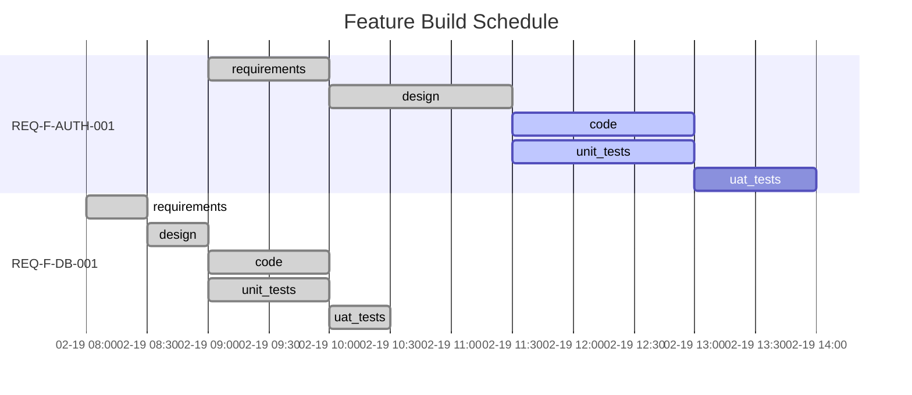

# /gen-status - Show Feature Vector Progress

Display the current state of all feature vectors and their trajectories through the graph. Enhanced with state detection, "you are here" indicators, project rollup, signals, and workspace health.

<!-- Implements: REQ-TOOL-002, REQ-FEAT-002, REQ-UX-003, REQ-UX-005, REQ-UX-007 (Edge Zoom Management) -->
<!-- Reference: AI_SDLC_ASSET_GRAPH_MODEL.md v2.8.0 §7.5 Event Sourcing, §7.6 Self-Observation, ADR-012 -->

## Usage

```
/gen-status [--feature "REQ-F-*"] [--verbose] [--gantt] [--health] [--functor]
```

| Option | Description |
|--------|-------------|
| (none) | Show summary of all feature vectors with state detection |
| `--feature` | Show detailed status for a specific feature |
| `--verbose` | Show iteration history and evaluator details |
| `--gantt` | Show Mermaid Gantt chart of feature build schedule |
| `--health` | Run workspace health check (event log integrity, orphaned spawns, stuck detection) |
| `--functor` | Show functor encoding registry, per-unit categories, and escalation history |

## Instructions

### Step 0: State Detection (always runs first)

Detect the current project state using the same algorithm as `/gen-start`:

1. Check for `.ai-workspace/` directory → UNINITIALISED if missing
2. Check for unresolved mandatory constraints → NEEDS_CONSTRAINTS
3. Check for intent → NEEDS_INTENT
4. Check for active features → NO_FEATURES
5. Check for stuck features (δ unchanged 3+ iterations) → STUCK
6. Check for all blocked → ALL_BLOCKED
7. Check for unconverged edges → IN_PROGRESS
8. Check for all converged → ALL_CONVERGED

Display at the top of output:

```
State: IN_PROGRESS
  What /gen-start would do: iterate REQ-F-AUTH-001 on code↔unit_tests
```

### Default View (No Arguments)

Read `.ai-workspace/features/feature_index.yml` and all feature files to produce:

```
AI SDLC Status — {project_name}
================================

State: IN_PROGRESS
  Start would: iterate REQ-F-AUTH-001 on code↔unit_tests (closest-to-complete)

You Are Here:
  REQ-F-AUTH-001  intent ✓ → req ✓ → design ✓ → code ● → tests ● → uat ○
  REQ-F-DB-001    intent ✓ → req ✓ → design ✓ → code ✓ → tests ✓ → uat ✓
  REQ-F-API-001   intent ✓ → req ● → design ○ → code ○ → tests ○ → uat ○

Project Rollup:
  Edges converged: 12/20 (60%)
  Features:  1 converged, 2 in-progress, 0 blocked, 0 stuck
  Signals:   1 unactioned intent_raised
  Functor:   standard/interactive/medium — 0 overrides, 2 η

Active Features:
  REQ-F-AUTH-001  "User authentication"      design→code (iter 3)
  REQ-F-DB-001    "Database schema"           code↔tests (converged)
  REQ-F-API-001   "REST API endpoints"        requirements (iter 1)

Completed Features:
  REQ-F-SETUP-001 "Project scaffolding"       all edges converged

Signals:
  INT-ECO-003 (unactioned) — "dependency update: requests 2.32.0 available"

Graph Coverage:
  Requirements:  12/15 (80%)
  Design:         8/12 (67%)
  Code:           5/8  (63%)
  Tests:          5/5  (100%)

Next Actions:
  - REQ-F-AUTH-001: iterate on design→code edge
  - REQ-F-API-001: human review pending on requirements
```

#### "You Are Here" Indicators

For each active feature, show a compact graph path using convergence markers:
- `✓` — converged (edge complete)
- `●` — iterating (in progress)
- `○` — pending (not started)
- `✗` — blocked (dependency or stuck)

Only show edges that are in the feature's active profile. Co-evolution edges show as a single unit.

#### Project Rollup

Aggregate across all features:
- Total edges converged / total edges required
- Feature count by status: converged, in-progress, blocked, stuck
- Unactioned signal count (intent_raised events not yet acted upon)

#### Signals

Read `events.jsonl` for `intent_raised` events that have not been followed by a corresponding `spawn_created` or `spec_modified` event. These are unactioned signals that need human attention.

#### "What Start Would Do"

Preview the action that `/gen-start` would take, including feature selection reasoning and edge determination. This helps the user understand the routing logic without invoking it.

### Detailed View (--feature)

Read the specific feature vector file and show:

```
Feature: REQ-F-AUTH-001 — "User authentication"
================================================

Intent:  INT-042
Status:  in_progress

Trajectory:
  intent         ✓ converged (2026-02-19T09:00)
  requirements   ✓ converged (2026-02-19T10:00)  [human approved]
  design         ✓ converged (2026-02-19T11:30)  [human approved]
  code           → iterating (iteration 3)       [delta: missing error handling]
  unit_tests     → iterating (iteration 3)       [co-evolving with code]
  uat_tests      ○ pending

Dependencies:
  REQ-F-DB-001   ✓ resolved (database schema available)

Constraint Dimensions (at design edge):
  ecosystem_compatibility  ✓ resolved (ADR-003: Python 3.12 + Django 5.0)
  deployment_target        ✓ resolved (ADR-004: Kubernetes on AWS EKS)
  security_model           ✓ resolved (ADR-005: OAuth2 + RBAC)
  build_system             ✓ resolved (ADR-006: pip + Docker multi-stage)
  data_governance          ~ advisory (acknowledged — GDPR not applicable)
  performance_envelope     ~ advisory (p99 < 200ms target documented)
  observability            ~ advisory (OpenTelemetry planned)
  error_handling           ~ advisory (fail-fast strategy documented)

Context Hash: sha256:a1b2c3...
```

### Gantt Chart View (--gantt)

Read the event stream from `.ai-workspace/events/events.jsonl` (source of truth). Fall back to feature vector files in `.ai-workspace/features/active/` and `.ai-workspace/features/completed/` if the event log doesn't exist yet. Extract timestamps to build a Mermaid Gantt chart.

#### Step 1: Collect Phase Data

For each feature vector file, extract:
- Feature ID and title
- For each trajectory entry (requirements, design, code, unit_tests, uat_tests):
  - `started_at` — when iteration began on this edge
  - `converged_at` — when the edge converged (null if still in progress)
  - `status` — pending, iterating, converged
  - `iteration` — current iteration count

#### Step 2: Generate Mermaid Gantt

Produce a Mermaid Gantt diagram. Each feature is a section; each edge traversal is a task bar.



#### Step 3: Status-to-Gantt Mapping

Map feature vector trajectory status to Gantt task states:

| Trajectory Status | Gantt State | Display |
|-------------------|-------------|---------|
| `converged` | `:done` | Solid bar with start→end timestamps |
| `iterating` | `:active` | Highlighted bar, end = now or estimated |
| `blocked` | `:crit` | Red bar, blocked on dependency or spawn |
| `pending` | (no prefix) | Grey bar, estimated duration |
| `time_box_expired` | `:done` | Solid bar (completed via time-box) |

#### Step 4: Handle Missing Timestamps

- If `started_at` is missing but status is `converged`: use `converged_at - estimated_duration`
- If `converged_at` is missing but status is `iterating`: use current time as provisional end
- For `pending` phases: estimate duration from profile or use 1 hour default, chain with `after {previous_phase_id}`
- Co-evolution edges (code↔unit_tests): show as parallel bars starting at the same time

#### Step 5: Write STATUS.md

Write the full Gantt output to `.ai-workspace/STATUS.md` so it is viewable as a workspace artifact:

1. **Write** `.ai-workspace/STATUS.md` with the following structure:

```markdown
# Project Status — {project_name}

Generated: {ISO timestamp}

## Feature Build Schedule

{Mermaid Gantt chart as a fenced code block}

## Phase Completion Summary

| Phase | Converged | In Progress | Pending | Blocked |
|-------|-----------|-------------|---------|---------|
| requirements | 3 | 1 | 0 | 0 |
| design | 2 | 1 | 1 | 0 |
| code | 1 | 1 | 2 | 0 |
| unit_tests | 1 | 1 | 2 | 0 |
| uat_tests | 0 | 0 | 3 | 1 |
| **Total** | **7** | **4** | **8** | **1** |

## Active Features

{List of active features with current edge and iteration}

## Next Actions

{Recommended next actions from graph topology}

---

## Process Telemetry

{Auto-generated observations from the iterate history}

### Convergence Pattern
- Iteration counts per edge (flag anomalies: 1-iteration convergence, >5 iterations)
- Evaluator pass/skip/fail ratios
- Deterministic check execution vs skip rates

### Traceability Coverage
- REQ key counts: defined vs tagged in code vs tested
- Gaps identified (cross-reference with /gen-gaps output if available)

### Constraint Surface Observations
- $variable resolution: which resolved, which undefined
- Skipped evaluators and why

## Self-Reflection — Feedback → New Intent

{Signals derived from telemetry that could become new intents or methodology improvements}

| Signal | Observation | Recommended Action |
|--------|-------------|-------------------|
| TELEM-NNN | {what the data shows} | {what to do about it} |
```

2. **Report** to the user: print the file path and a one-line summary (e.g., "Status written to `.ai-workspace/STATUS.md` — 3 features, 7/20 phases converged")
3. The file is viewable in VS Code with Mermaid preview extensions, or renderable to PDF via `md2pdf .ai-workspace/STATUS.md`

**Important**: The status command always OVERWRITES `STATUS.md` — it is a derived snapshot, not a log. The source of truth is `events/events.jsonl`.

### Functor Encoding View (--functor)

Show the functor encoding registry for all active features. Reads each feature vector's `functor:` section and the profile encoding.

```
Functor Encoding — {project_name}
===================================

Profile Encoding: standard
  Strategy:  balanced
  Mode:      interactive
  Valence:   medium (η threshold)

Functional Unit Registry:
┌──────────────┬──────────┬────────────────────────────────────────┐
│ Unit         │ Category │ Notes                                  │
├──────────────┼──────────┼────────────────────────────────────────┤
│ evaluate     │ F_D      │ deterministic tests                    │
│ construct    │ F_P      │ agent-generated                        │
│ classify     │ F_D      │ deterministic classification           │
│ route        │ F_H      │ human-directed                         │
│ propose      │ F_P      │ agent-proposed                         │
│ sense        │ F_D      │ deterministic sensing                  │
│ emit         │ F_D      │ category-fixed (always deterministic)  │
│ decide       │ F_H      │ category-fixed (always human)          │
└──────────────┴──────────┴────────────────────────────────────────┘

Feature Overrides:
  REQ-F-AUTH-001: route → F_D (override: emergency path)

Escalation History (η):
┌────────────────────┬──────────┬──────────────┬─────┬─────┬─────────────────────┐
│ Feature            │ Edge     │ Unit         │ From│ To  │ Trigger             │
├────────────────────┼──────────┼──────────────┼─────┼─────┼─────────────────────┤
│ REQ-F-AUTH-001     │ code↔tests│ evaluate    │ F_D │ F_H │ stuck delta 4 iters │
│ REQ-F-API-001      │ req→design│ route      │ F_H │ F_P │ pattern clear        │
└────────────────────┴──────────┴──────────────┴─────┴─────┴─────────────────────┘

Summary: 2 escalations across 2 features, 0 active overrides
```

Data sources:
- Profile encoding: from `.ai-workspace/profiles/{profile}.yml` or `v2/config/profiles/{profile}.yml`
- Feature overrides: from each feature vector's `functor.overrides` field
- Escalation history: from each feature vector trajectory's `escalations` arrays
- Event log: `encoding_escalated` events in `events.jsonl`

### Health Check View (--health)

Run workspace health diagnostics (REQ-UX-005):

```
Workspace Health — {project_name}
===================================

Event Log:
  ✓ events.jsonl exists (342 events)
  ✓ All lines valid JSON
  ✓ All events have required fields (event_type, timestamp, project)
  ✗ 2 events reference unknown feature IDs

Feature Vectors:
  ✓ 4 active feature vectors
  ✓ All feature IDs match REQ-F-* format
  ✗ 1 orphaned spawn (REQ-F-SPIKE-003 — parent REQ-F-AUTH-001 not found)

Convergence:
  ✓ No stuck features (all δ changing)
  ✓ No time-box expirations pending

Constraints:
  ✓ All mandatory dimensions resolved
  ✓ 2/4 advisory dimensions documented

Recommendations:
  1. Fix orphaned spawn: link REQ-F-SPIKE-003 to correct parent or archive
  2. Investigate 2 events with unknown feature IDs
```

Checks performed:
- **Event log integrity**: valid JSON, required fields, no orphan references
- **Feature vector consistency**: valid format, parent/child links resolve, no duplicates
- **Orphaned spawns**: child vectors with broken parent references
- **Stuck detection**: features with δ unchanged for 3+ iterations
- **Constraint resolution**: mandatory dimensions filled at design edge
- **Time-box monitoring**: approaching or expired time boxes

### Event Sourcing Architecture

The methodology uses **event sourcing** for all observability:

```
Source of Truth              Derived Views (projections)
─────────────────            ──────────────────────────
events/events.jsonl    ───►  STATUS.md          (computed: Gantt, telemetry, self-reflection)
  (append-only JSONL)  ───►  ACTIVE_TASKS.md    (filtered: convergence events as markdown)
                       ───►  features/active/*.yml  (state: latest trajectory per feature)
```

- **Events** are immutable facts: every `iterate()` invocation appends one event
- **Views** are projections that can be regenerated from the event stream at any time
- If a view gets corrupted or lost, replay `events.jsonl` to reconstruct it

### Process Telemetry Guidelines

The telemetry section is NOT free-form commentary. The iterate agent reads `events.jsonl` and produces structured observations:

1. **Convergence Pattern**: Compare iteration counts against profile expectations. Flag 1-iteration convergence (evaluators may be too lenient) and >5 iterations (may indicate blocked or under-specified requirements).
2. **Traceability Coverage**: Count REQ keys at each stage. Report coverage gaps.
3. **Constraint Surface**: Report $variable resolution rates and skipped deterministic checks.
4. **Self-Reflection**: Each TELEM signal is a potential new intent. The methodology observes itself and feeds back — this closes the `Telemetry / Observer → feedback → new Intent` loop in the bootstrap graph.

## Event Schema

Each event in `events.jsonl` follows this schema:

```json
{
  "event_type": "iteration_completed",
  "timestamp": "2026-02-19T10:30:00Z",
  "project": "my-project",
  "feature": "REQ-F-AUTH-001",
  "edge": "intent→requirements",
  "iteration": 2,
  "status": "converged",
  "convergence_type": "standard",
  "evaluators": {
    "passed": 9, "failed": 0, "skipped": 0, "total": 9,
    "details": [{"name": "check_name", "type": "agent", "result": "pass", "required": true}]
  },
  "asset": "specification/REQUIREMENTS.md",
  "context_hash": "sha256:a1b2c3...",
  "delta": 0,
  "source_findings": [
    {"description": "INT-003 'universal applicability' — target domain set undefined",
     "classification": "SOURCE_UNDERSPEC", "disposition": "resolved_with_assumption"}
  ],
  "process_gaps": [
    {"description": "No check for terminology dictionary in requirements",
     "type": "EVALUATOR_MISSING", "action": "Add document_structure check to intent_requirements.yml"}
  ]
}
```

**Note**: All methodology commands emit events — not just `/gen-iterate`. The status command reads ALL event types (`project_initialized`, `edge_started`, `edge_converged`, `spawn_created`, `checkpoint_created`, `review_completed`, `gaps_validated`, `release_created`). See the iterate agent's **Event Type Reference** for the full catalogue.

### Event Fields

| Field | Description |
|-------|-------------|
| `evaluators` | Forward gap detection — checklist pass/fail/skip counts + details |
| `source_findings` | Backward gap detection — ambiguities, gaps, underspecification found in the source asset |
| `process_gaps` | Inward gap detection — missing evaluators, vague criteria, missing context, missing guidance |
| `delta` | Count of failing required checks (forward only) |

Feature vector timestamps (`started_at`, `converged_at`) are derived from the first and last events for a given feature+edge combination.

### Telemetry Projections from Gap Data

The STATUS.md telemetry section aggregates gap data from `events.jsonl`:

- **Source quality**: Count of source findings per edge, per classification. High `SOURCE_GAP` counts on a downstream edge indicate the upstream edge's evaluators are too lenient.
- **Process maturity**: Count of process gaps per type. High `EVALUATOR_MISSING` counts indicate the methodology needs more checks. Declining counts across iterations indicate the methodology is self-improving.
- **Assumption register**: All `resolved_with_assumption` dispositions — these are decisions that should be validated by a human or confirmed by downstream evidence.
