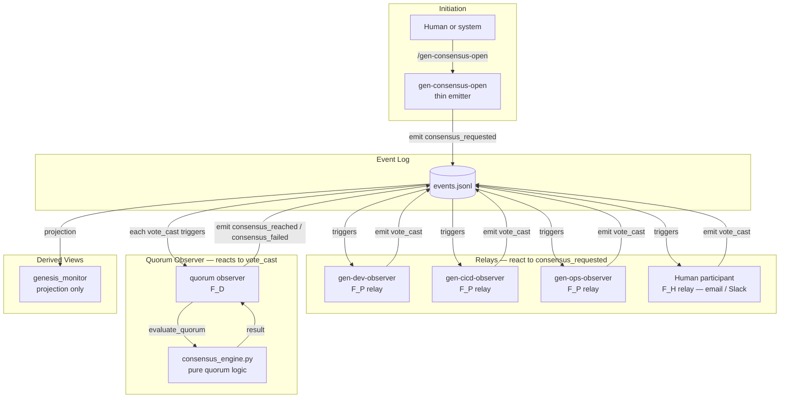
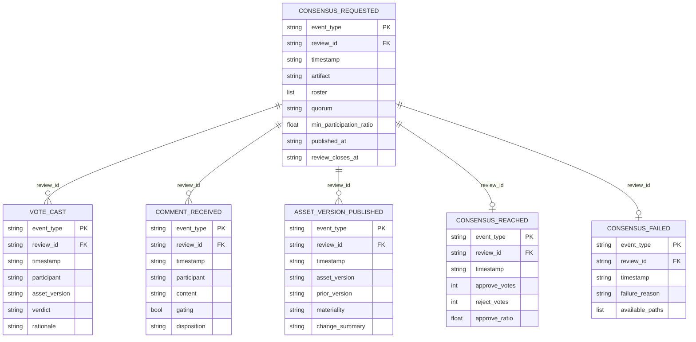
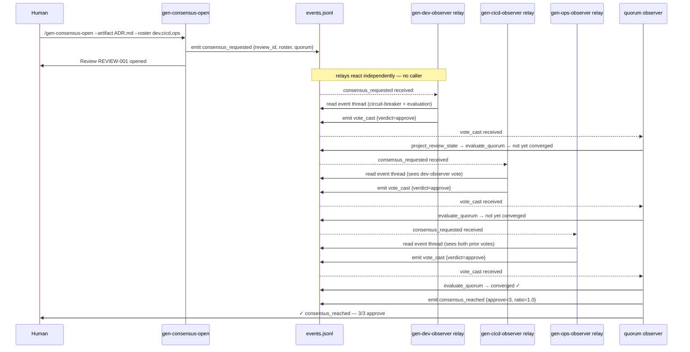
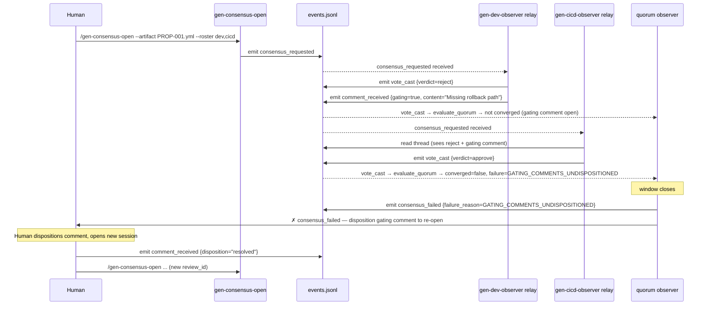

# CONSENSUS Functor — Implementation Design

**Status**: Proposed (awaiting F_H review)
**Feature**: REQ-F-CONSENSUS-001
**Satisfies**: REQ-F-CONSENSUS-001, REQ-EVAL-001, REQ-EVAL-003, REQ-EVENT-005, REQ-TOOL-015
**Spec reference**: [ADR-S-025](../../specification/adrs/ADR-S-025-consensus-functor.md) — the WHAT
**Architecture**: [ADR-S-031](../../specification/adrs/ADR-S-031-actor-model-and-event-sourcing.md) — supervisor / observer / relay / saga
**Design edge**: requirements→design, iteration 3

---

## Overview

CONSENSUS is a choreographed saga over the event log. A human or system emits `consensus_requested`. Independent relays react, evaluate, and emit `vote_cast`. A quorum observer reacts to each `vote_cast` and emits the terminal event when convergence is reached.

No orchestrator. The saga self-choreographs because the invariants are expressed locally — each relay enforces its own participation constraint via circuit-breaker before acting.

---

## Architecture



**Invariants that replace the orchestrator:**

| What the orchestrator did | Invariant that replaces it |
|--------------------------|---------------------------|
| Call each agent in sequence | Circuit-breaker: relay checks it is in roster and hasn't voted before acting |
| Run quorum check after each vote | Quorum observer subscribes to `vote_cast` — fires automatically |
| Enforce one vote per participant | Circuit-breaker: relay checks event log for prior `vote_cast` from itself |
| Emit terminal event | Quorum observer emits `consensus_reached` / `consensus_failed` when F_D check passes |

---

## Component Design

### Component 1: `gen-consensus-open` (Thin Emitter)

**Implements**: REQ-F-CONSENSUS-001, REQ-EVAL-003

**Responsibility**: emit one event and stop. No coordination. No agent invocation.

**Behavior**:
1. Validate artifact exists, roster is non-empty
2. Generate `review_id`
3. Emit `consensus_requested` to event log
4. Report: `Review {review_id} opened — {n} relays subscribed`

**Emits**:
```json
{
  "event_type": "consensus_requested",
  "review_id": "{review_id}",
  "timestamp": "{ISO 8601}",
  "project": "{project_name}",
  "actor": "local-user",
  "data": {
    "artifact": "{artifact_path}",
    "asset_version": "v1",
    "roster": [
      {"id": "gen-dev-observer",  "type": "agent"},
      {"id": "gen-cicd-observer", "type": "agent"},
      {"id": "gen-ops-observer",  "type": "agent"}
    ],
    "quorum": "majority",
    "min_participation_ratio": 0.5,
    "published_at": "{ISO 8601}",
    "review_closes_at": "{ISO 8601}",
    "min_duration_seconds": 0
  }
}
```

**Dependencies**: `events.jsonl` (append only)

---

### Component 2: Observer Relays

**Implements**: REQ-F-CONSENSUS-001, REQ-EVAL-001 (F_P)

Three agent relays and any number of F_H relays (human participants via notification channel). Each is **independent** — they do not know about each other, only about the event log.

**Subscription predicate**:
```
event_type == "consensus_requested"
AND review_id not yet closed (no consensus_reached / consensus_failed)
AND self.id in roster
```

**Behavior — circuit-breaker first (the local invariant)**:

1. Confirm `consensus_requested` event exists for this `review_id`
2. Confirm no `consensus_reached` or `consensus_failed` (session open)
3. Confirm own `id` is in the roster
4. Confirm no prior `vote_cast` from self for this `review_id`

If any check fails: emit nothing, exit. This is the invariant that eliminates the need for an orchestrator to enforce participation rules.

**Behavior — evaluation**:

5. Read the artifact at `data.artifact`
6. Read the full event thread for `review_id` (all prior votes and comments visible)
7. Evaluate from domain perspective
8. Emit `vote_cast` (and optionally `comment_received` if gating concern)

**Per-relay evaluation rubrics**:

| Relay | Evaluation dimensions |
|-------|----------------------|
| `gen-dev-observer` | REQ coverage, spec/design separation, implementability, consistency, traceability, scope |
| `gen-cicd-observer` | Testability, build impact, quality gates, pipeline safety, rollback path, env parity |
| `gen-ops-observer` | Observability, SLA impact, operational burden, degradation modes, capacity, runbook |
| Human (F_H) | Domain judgment — delivered via notification channel, response via `gen-vote` |

**Note on ordering**: relays read the full event thread before voting. A relay acting second sees the first relay's `vote_cast` and rationale. Sequential deliberation emerges naturally from the event log — not from enforced invocation order.

---

### Component 3: Quorum Observer

**Implements**: REQ-F-CONSENSUS-001, REQ-EVAL-001 (F_D)

**Subscription predicate**:
```
event_type == "vote_cast"
AND review_id is open (has consensus_requested, no terminal event)
```

**Behavior**:
1. Project all `vote_cast` and `comment_received` events for `review_id`
2. Load `ReviewConfig` from the `consensus_requested` event
3. Call `consensus_engine.evaluate_quorum(config, votes, comments, now)`
4. If `result.converged`: emit `consensus_reached`, update artifact status
5. If window closed and not converged: emit `consensus_failed {failure_reason, available_paths}`
6. Otherwise: emit nothing, wait for next `vote_cast`

**Dependencies**: `consensus_engine.py`, `events.jsonl`

---

### Component 4: `consensus_engine.py` (Pure F_D)

**Implements**: REQ-F-CONSENSUS-001 (five deterministic checks), REQ-EVAL-001

Zero I/O. Takes parsed events, returns `QuorumResult`. No side effects.

```python
def evaluate_quorum(
    config: ReviewConfig,
    votes: list[Vote],
    comments: list[Comment],
    now: Optional[datetime] = None,
) -> QuorumResult: ...

def project_review_state(
    events: list[dict],
    review_id: str,
    review_closes_at: datetime,
) -> tuple[list[Vote], list[Comment]]: ...
```

Five convergence checks (ADR-S-025 §Phase 4):

| Check | Passes when |
|-------|------------|
| `min_duration_elapsed` | `now - published_at >= min_duration_seconds` |
| `review_window_closed` | `now >= review_closes_at` |
| `participation_threshold_met` | `responses / roster_size >= min_participation_ratio` |
| `quorum_reached` | `approve_ratio > threshold` (MAJORITY / SUPERMAJORITY / UNANIMITY) |
| `gating_comments_dispositioned` | All `comment_received[gating=true]` have `disposition != null` |

**Dependencies**: Python stdlib only (`dataclasses`, `datetime`, `enum`)

---

### Component 5: `gen-vote` (Human Entry Point)

**Implements**: REQ-EVAL-003 (human accountability)

The command a human uses to cast a vote. It is a thin relay: validate inputs, emit `vote_cast`. The quorum observer reacts independently.

**Behavior**:
1. Validate `review_id` is open
2. Confirm participant is in roster
3. Confirm participant has not already voted
4. Emit `vote_cast`
5. Report current tally (read from event log — does not run quorum check itself)

Quorum evaluation is the quorum observer's responsibility, not `gen-vote`'s.

---

### Component 6: `genesis_monitor` — Review Session Panel

**Implements**: REQ-TOOL-015

Read-only projection from `events.jsonl`. Displays per-session: quorum progress, vote tally, comment thread, terminal outcome. Future — not yet implemented.

---

## Data Model



Session rehydration:
```
session_state(review_id) = [e for e in events if e.get("review_id") == review_id]
```

---

## Sequence Diagrams

### Happy Path — Choreographed Saga



### Failure Path — Gating Comment



---

## Versioning Semantics

A review session accumulates events over time. The artifact under review may change mid-session as participants raise concerns and the proposer addresses them. Two types of data have distinct version semantics.

### Gating Comments: Version-Agnostic

A `comment_received {gating: true}` event raised against any version of the artifact accumulates in the session's gating set and **must be dispositioned** before convergence is possible, regardless of which version the comment was raised against.

Rationale: a structural concern identified in v1.0 is still a concern in v1.1 unless the proposer explicitly addresses it. The proposer's disposition (`resolved`, `rejected`, `acknowledged`) records that the concern was considered. Undispositioned gating comments from prior versions represent open issues — they do not disappear when the artifact is revised.

```
gating_set(review_id) = {c for c in events if c.review_id == review_id
                                            and c.event_type == "comment_received"
                                            and c.data.gating == True}
all_dispositioned = all(c.data.disposition is not None for c in gating_set)
```

### Votes: Most-Recent-Per-Relay

Only the **most recent** `vote_cast` per participant counts toward quorum. A participant may revise their vote as the artifact evolves — the prior vote is superseded.

```
effective_votes(review_id) = {
    participant: max(votes, key=lambda v: v.timestamp)
    for participant, votes in group_by_participant(
        [e for e in events if e.review_id == review_id
                           and e.event_type == "vote_cast"]
    ).items()
}
```

This enables **eventual convergence**: a relay that voted `reject` on v1.0 may vote `approve` on v1.2 after the proposer addresses their concerns. The saga self-heals — each `vote_cast` event triggers the quorum observer, which re-evaluates with the current effective vote set. No orchestrator needs to re-solicit participation; relays react to `asset_version_published` events autonomously.

### Asset Versioning Event

When the proposer revises the artifact mid-session, they emit:

```json
{
  "event_type": "asset_version_published",
  "review_id": "{review_id}",
  "timestamp": "{ISO 8601}",
  "data": {
    "asset": "{artifact_path}",
    "asset_version": "{new_version}",
    "prior_version": "{prior_version}",
    "materiality": "non_material | material",
    "change_summary": "{what changed and why}"
  }
}
```

**Non-material** (editorial, clarifications): relays may note the revision but their prior votes remain valid. The quorum observer does not reset.

**Material** (scope change, substantive modification): vote reset. All `vote_cast` events prior to the `asset_version_published` timestamp are superseded. A new `consensus_requested` event is **not** emitted — the same `review_id` continues; only the effective vote set resets. Relays that subscribed to this `review_id` will see the `asset_version_published` event and re-evaluate.

### Convergence as Emergent Property

Convergence is not enforced by an orchestrator. It emerges from the event chain:

```
vote_cast emitted
  → quorum observer reacts
  → evaluate_quorum(effective_votes, gating_set, config)
  → converged? emit consensus_reached and stop
  → not converged? emit nothing, wait for next vote_cast

asset_version_published emitted (non-material)
  → relays may re-evaluate; vote_cast events may follow
  → quorum observer reacts to each vote_cast

asset_version_published emitted (material)
  → relays SHOULD re-evaluate; each sees the change via event log
  → effective votes reset; quorum observer re-evaluates from scratch
```

The loop terminates when `consensus_reached` is emitted or when the proposer selects `abandon` after a `consensus_failed` event. Without an orchestrator enforcing a deadline, the session remains open until convergence or explicit closure — which is correct: a review session should not auto-close due to an implementation timeout.

---

## Package/Module Structure

```
imp_claude/code/
├── genesis/
│   └── consensus_engine.py        # F_D quorum logic — pure, no I/O
│
└── .claude-plugin/plugins/genesis/
    ├── commands/
    │   ├── gen-consensus-open.md  # thin emitter — consensus_requested only
    │   └── gen-vote.md            # human relay — emits vote_cast
    └── agents/
        ├── gen-dev-observer.md    # F_P relay + circuit-breaker
        ├── gen-cicd-observer.md   # F_P relay + circuit-breaker
        └── gen-ops-observer.md    # F_P relay + circuit-breaker
```

Quorum observer behavior currently lives inline in `gen-consensus-open`. It should be extracted to a dedicated observer that subscribes to `vote_cast` — tracked as an open item.

---

## Traceability Matrix

| REQ Key | Requirement | Implementing Component |
|---------|------------|----------------------|
| REQ-F-CONSENSUS-001 | Multi-stakeholder CONSENSUS functor | `consensus_engine.py`, `gen-consensus-open`, all three relay agents |
| REQ-EVAL-001 | Three evaluator types | F_D: `consensus_engine`; F_P: observer relays; F_H: `gen-vote` + notification |
| REQ-EVAL-003 | Human accountability | Roster in `consensus_requested`, circuit-breaker per relay, attribution in `vote_cast` |
| REQ-EVENT-005 | CONSENSUS event types | `consensus_requested`, `vote_cast`, `comment_received`, `consensus_reached`, `consensus_failed` |
| REQ-TOOL-015 | CONSENSUS session visualisation | `genesis_monitor` review panel (future) |

---

## Constraint Dimensions

| Dimension | Resolution |
|-----------|-----------|
| **Ecosystem compatibility** | Python 3.12, stdlib only for `consensus_engine.py` |
| **Deployment target** | Claude Code plugin (local); engine invoked via `python -c` inline |
| **Security model** | Roster in `consensus_requested` gates participation; circuit-breaker prevents double-voting; attribution in every `vote_cast` |
| **Build system** | `pytest imp_claude/tests/test_uc_consensus_001.py` — 22 UAT tests |
| **Performance** | No orchestrator overhead; relays react independently; quorum check is O(events) per `vote_cast` |
| **Observability** | All state in `events.jsonl`; `genesis_monitor` panel future |
| **Error handling** | Circuit-breaker per relay; compensating events (`consensus_failed`) for saga failure; `available_paths` guides recovery |

---

## Open Items

| Item | Type | Action |
|------|------|--------|
| Quorum observer is currently inline in `gen-consensus-open` | Architecture debt | Extract to dedicated quorum observer subscribing to `vote_cast` |
| `on-vote-received.sh` committed to git but redundant | Technical debt | Remove (follow-up commit) |
| `genesis_monitor` review panel not implemented | Missing component | Spawn REQ-F-GMON-008 |
| F_H relay delivery (email / Slack) not implemented | Missing component | Future — roster entry `type: human` with `channel` field |
| No roster entry schema validation on `gen-consensus-open` | Missing check | Validate `id` and `type` fields before emitting |
| `consensus_engine.py` lacks versioned vote deduplication | Code gap | Implement most-recent-per-relay semantics; handle `asset_version_published` material reset |
| `consensus_engine.py` lacks version-agnostic gating comment accumulation | Code gap | Accumulate gating comments across all versions; deduplication is vote-only |
