# F_D Functor Framework — Design & Implementation Guide

**Version**: 1.0.0
**Implements**: REQ-ITER-003 (Functor Encoding Tracking), REQ-EVAL-002 (Evaluator Composition)
**Package**: `imp_claude/code/genisis/`

---

## 1. Conceptual Overview

The genisis methodology defines **8 functional units** (evaluate, construct, classify, route, propose, sense, emit, decide) and **3 category renderings** for each:

| Category | Symbol | Meaning | Example |
|----------|--------|---------|---------|
| **F_D** | Deterministic | Subprocess, regex, dict lookup | Run `pytest`, parse REQ tags |
| **F_P** | Probabilistic | LLM / agent call | "Does this code meet the criterion?" |
| **F_H** | Human | Interactive prompt | "Do you approve this design?" |

**Profile encoding** selects which category renders each unit. A standard project uses `evaluate→F_D` (run tests), while a spike uses `evaluate→F_P` (agent judges experiment quality). Two units are **category-fixed**: `emit` is always `F_D`, `decide` is always `F_H`.

The functor framework provides the **executable code** behind these abstractions.

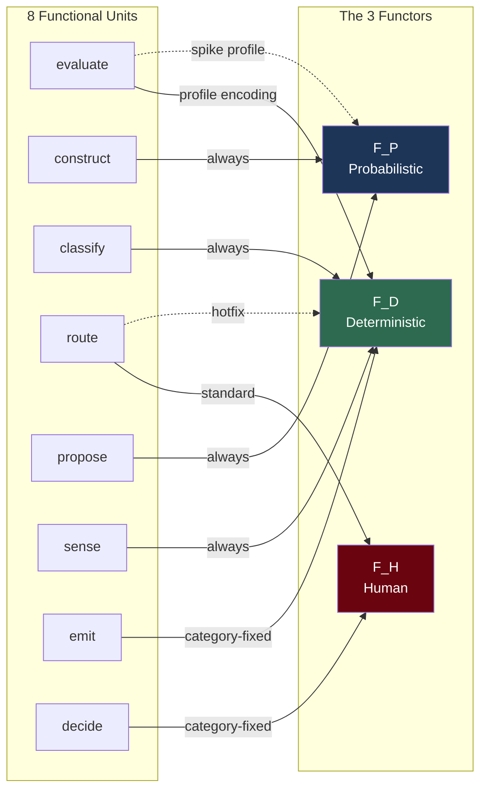
```mermaid
graph LR
    subgraph "The 3 Functors"
        FD["F_D<br/>Deterministic"]
        FP["F_P<br/>Probabilistic"]
        FH["F_H<br/>Human"]
    end

    subgraph "8 Functional Units"
        E[evaluate]
        CO[construct]
        CL[classify]
        RO[route]
        PR[propose]
        SE[sense]
        EM[emit]
        DE[decide]
    end

    E -->|"profile encoding"| FD
    E -.->|"spike profile"| FP
    CO -->|"always"| FP
    CL -->|"always"| FD
    RO -->|"standard"| FH
    RO -.->|"hotfix"| FD
    PR -->|"always"| FP
    SE -->|"always"| FD
    EM -->|"category-fixed"| FD
    DE -->|"category-fixed"| FH

    style FD fill:#2d6a4f,color:#fff
    style FP fill:#1d3557,color:#fff
    style FH fill:#6a040f,color:#fff
```

---

## 2. Package Structure

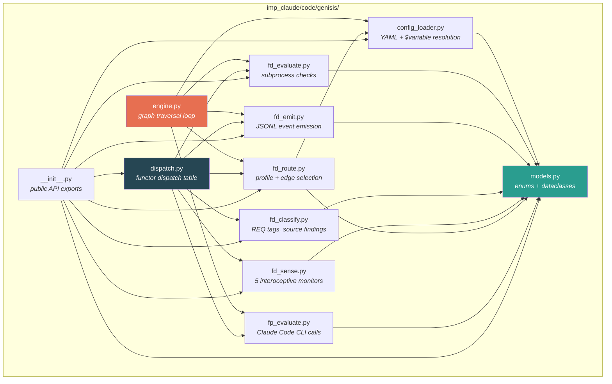
```mermaid
graph TD
    subgraph "imp_claude/code/genisis/"
        INIT["__init__.py<br/><i>public API exports</i>"]
        MOD["models.py<br/><i>enums + dataclasses</i>"]
        CL["config_loader.py<br/><i>YAML + $variable resolution</i>"]
        FDE["fd_evaluate.py<br/><i>subprocess checks</i>"]
        FDM["fd_emit.py<br/><i>JSONL event emission</i>"]
        FDC["fd_classify.py<br/><i>REQ tags, source findings</i>"]
        FDS["fd_sense.py<br/><i>5 interoceptive monitors</i>"]
        FDR["fd_route.py<br/><i>profile + edge selection</i>"]
        FPE["fp_evaluate.py<br/><i>Claude Code CLI calls</i>"]
        DIS["dispatch.py<br/><i>functor dispatch table</i>"]
        ENG["engine.py<br/><i>graph traversal loop</i>"]
    end

    ENG --> CL
    ENG --> FDE
    ENG --> FPE
    ENG --> FDM
    ENG --> FDR
    DIS --> FDE
    DIS --> FDC
    DIS --> FDS
    DIS --> FDM
    DIS --> FDR
    DIS --> FPE
    CL --> MOD
    FDE --> MOD
    FDM --> MOD
    FDC --> MOD
    FDS --> MOD
    FDR --> MOD
    FDR --> CL
    FPE --> MOD
    INIT --> MOD
    INIT --> CL
    INIT --> FDE
    INIT --> FDM
    INIT --> FDC
    INIT --> FDS
    INIT --> FDR
    INIT --> DIS

    style ENG fill:#e76f51,color:#fff
    style DIS fill:#264653,color:#fff
    style MOD fill:#2a9d8f,color:#fff
```

---

## 3. Data Model (Class Diagram)

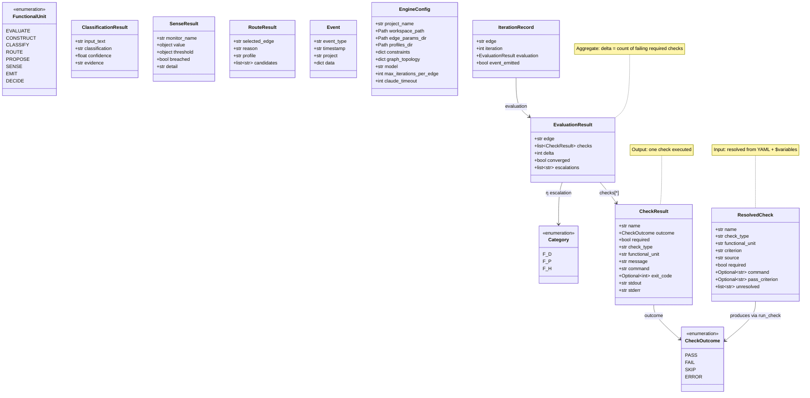
```mermaid
classDiagram
    class Category {
        <<enumeration>>
        F_D
        F_P
        F_H
    }

    class FunctionalUnit {
        <<enumeration>>
        EVALUATE
        CONSTRUCT
        CLASSIFY
        ROUTE
        PROPOSE
        SENSE
        EMIT
        DECIDE
    }

    class CheckOutcome {
        <<enumeration>>
        PASS
        FAIL
        SKIP
        ERROR
    }

    class ResolvedCheck {
        +str name
        +str check_type
        +str functional_unit
        +str criterion
        +str source
        +bool required
        +Optional~str~ command
        +Optional~str~ pass_criterion
        +list~str~ unresolved
    }

    class CheckResult {
        +str name
        +CheckOutcome outcome
        +bool required
        +str check_type
        +str functional_unit
        +str message
        +str command
        +Optional~int~ exit_code
        +str stdout
        +str stderr
    }

    class EvaluationResult {
        +str edge
        +list~CheckResult~ checks
        +int delta
        +bool converged
        +list~str~ escalations
    }

    class ClassificationResult {
        +str input_text
        +str classification
        +float confidence
        +str evidence
    }

    class SenseResult {
        +str monitor_name
        +object value
        +object threshold
        +bool breached
        +str detail
    }

    class RouteResult {
        +str selected_edge
        +str reason
        +str profile
        +list~str~ candidates
    }

    class Event {
        +str event_type
        +str timestamp
        +str project
        +dict data
    }

    class EngineConfig {
        +str project_name
        +Path workspace_path
        +Path edge_params_dir
        +Path profiles_dir
        +dict constraints
        +dict graph_topology
        +str model
        +int max_iterations_per_edge
        +int claude_timeout
    }

    class IterationRecord {
        +str edge
        +int iteration
        +EvaluationResult evaluation
        +bool event_emitted
    }

    ResolvedCheck --> CheckOutcome : produces via run_check
    CheckResult --> CheckOutcome : outcome
    EvaluationResult --> CheckResult : checks[*]
    IterationRecord --> EvaluationResult : evaluation
    EvaluationResult --> Category : η escalation

    note for ResolvedCheck "Input: resolved from YAML + $variables"
    note for CheckResult "Output: one check executed"
    note for EvaluationResult "Aggregate: delta = count of failing required checks"
```

### CATEGORY_FIXED Invariant

```python
CATEGORY_FIXED = {
    FunctionalUnit.EMIT:   Category.F_D,   # emit is ALWAYS deterministic
    FunctionalUnit.DECIDE: Category.F_H,   # decide is ALWAYS human
}
```

This is enforced across all 6 profiles and validated in tests.

---

## 4. Configuration Resolution Pipeline

The configuration system composes constraints from four layers:

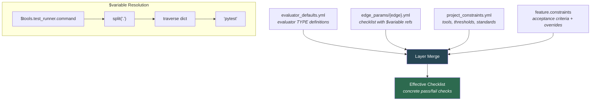
```mermaid
flowchart TD
    ED["evaluator_defaults.yml<br/><i>evaluator TYPE definitions</i>"]
    EP["edge_params/{edge}.yml<br/><i>checklist with $variable refs</i>"]
    PC["project_constraints.yml<br/><i>tools, thresholds, standards</i>"]
    FC["feature.constraints<br/><i>acceptance criteria + overrides</i>"]

    ED --> MERGE["Layer Merge"]
    EP --> MERGE
    PC --> MERGE
    FC --> MERGE

    MERGE --> ECL["Effective Checklist<br/><i>concrete pass/fail checks</i>"]

    subgraph "$variable Resolution"
        direction LR
        REF["$tools.test_runner.command"]
        DOT["split('.')"]
        WALK["traverse dict"]
        VAL["'pytest'"]
        REF --> DOT --> WALK --> VAL
    end

    style ECL fill:#2d6a4f,color:#fff
    style MERGE fill:#264653,color:#fff
```

### $Variable Resolution Regex

```
Pattern: \$(\w+(?:\.\w+)*)

Matches:
  $tools.test_runner.command      → constraints["tools"]["test_runner"]["command"]
  $thresholds.test_coverage_minimum → constraints["thresholds"]["test_coverage_minimum"]
  $standards.style_guide          → constraints["standards"]["style_guide"]
```

### Resolution Rules

1. Edge checklist defines default checks
2. `$variables` resolve from `project_constraints.yml`
3. Feature `threshold_overrides` apply on top
4. Feature `acceptance_criteria` append to checklist
5. `required=true` at any layer stays `true` (most restrictive wins)
6. Unresolved `$variables` → check **SKIPPED** with warning (tracked in `unresolved[]`)

### Sequence: `resolve_checklist()`

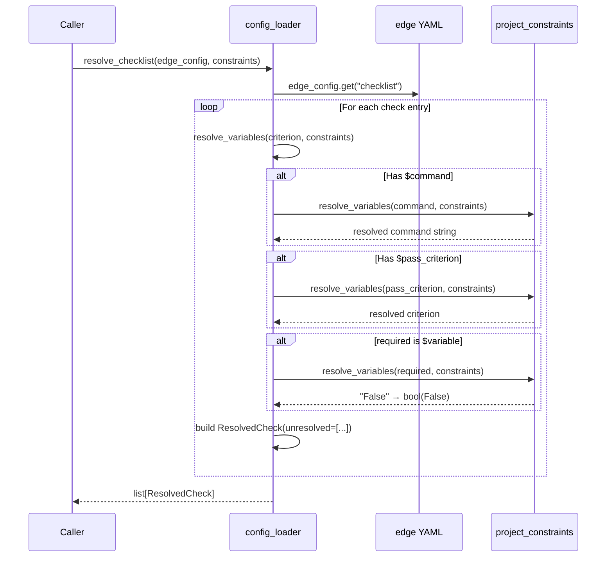
```mermaid
sequenceDiagram
    participant Caller
    participant CL as config_loader
    participant YAML as edge YAML
    participant PC as project_constraints

    Caller->>CL: resolve_checklist(edge_config, constraints)
    CL->>YAML: edge_config.get("checklist")

    loop For each check entry
        CL->>CL: resolve_variables(criterion, constraints)
        alt Has $command
            CL->>PC: resolve_variables(command, constraints)
            PC-->>CL: resolved command string
        end
        alt Has $pass_criterion
            CL->>PC: resolve_variables(pass_criterion, constraints)
            PC-->>CL: resolved criterion
        end
        alt required is $variable
            CL->>PC: resolve_variables(required, constraints)
            PC-->>CL: "False" → bool(False)
        end
        CL->>CL: build ResolvedCheck(unresolved=[...])
    end

    CL-->>Caller: list[ResolvedCheck]
```

---

## 5. F_D Evaluate — The Deterministic Evaluator

### State Machine: Check Execution

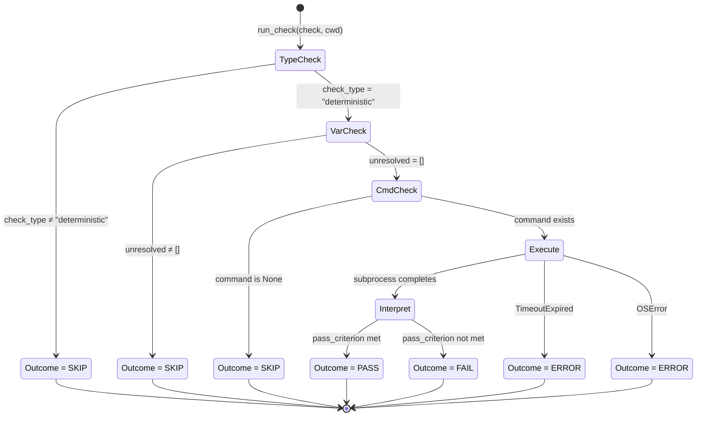
```mermaid
stateDiagram-v2
    [*] --> TypeCheck: run_check(check, cwd)

    TypeCheck --> Skip_NonDet: check_type ≠ "deterministic"
    TypeCheck --> VarCheck: check_type = "deterministic"

    VarCheck --> Skip_Unresolved: unresolved ≠ []
    VarCheck --> CmdCheck: unresolved = []

    CmdCheck --> Skip_NoCmd: command is None
    CmdCheck --> Execute: command exists

    Execute --> Interpret: subprocess completes
    Execute --> Error_Timeout: TimeoutExpired
    Execute --> Error_OS: OSError

    Interpret --> PASS: pass_criterion met
    Interpret --> FAIL: pass_criterion not met

    Skip_NonDet --> [*]
    Skip_Unresolved --> [*]
    Skip_NoCmd --> [*]
    PASS --> [*]
    FAIL --> [*]
    Error_Timeout --> [*]
    Error_OS --> [*]

    state "Outcome = SKIP" as Skip_NonDet
    state "Outcome = SKIP" as Skip_Unresolved
    state "Outcome = SKIP" as Skip_NoCmd
    state "Outcome = PASS" as PASS
    state "Outcome = FAIL" as FAIL
    state "Outcome = ERROR" as Error_Timeout
    state "Outcome = ERROR" as Error_OS
```

### Pass Criterion Interpretation

The `_interpret_result()` function interprets subprocess output against the `pass_criterion` string:

| Criterion Pattern | Interpretation |
|---|---|
| `"exit code 0"` (or empty) | `returncode == 0` → PASS |
| `"coverage percentage >= N"` | Parse `(\d+)%` from stdout, compare to threshold |
| `"zero violations"` / `"zero errors"` | `returncode == 0` → PASS |
| Default fallback | `returncode == 0` → PASS |

### Checklist Aggregation

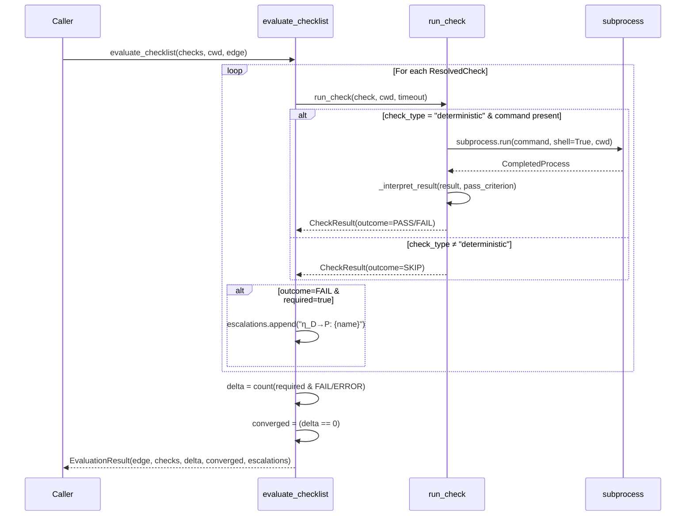
```mermaid
sequenceDiagram
    participant Caller
    participant EV as evaluate_checklist
    participant RC as run_check
    participant SUB as subprocess

    Caller->>EV: evaluate_checklist(checks, cwd, edge)

    loop For each ResolvedCheck
        EV->>RC: run_check(check, cwd, timeout)

        alt check_type = "deterministic" & command present
            RC->>SUB: subprocess.run(command, shell=True, cwd)
            SUB-->>RC: CompletedProcess
            RC->>RC: _interpret_result(result, pass_criterion)
            RC-->>EV: CheckResult(outcome=PASS/FAIL)
        else check_type ≠ "deterministic"
            RC-->>EV: CheckResult(outcome=SKIP)
        end

        alt outcome=FAIL & required=true
            EV->>EV: escalations.append("η_D→P: {name}")
        end
    end

    EV->>EV: delta = count(required & FAIL/ERROR)
    EV->>EV: converged = (delta == 0)
    EV-->>Caller: EvaluationResult(edge, checks, delta, converged, escalations)
```

### Delta Formula

```
delta = Σ{ 1 | check ∈ checks, check.required ∧ check.outcome ∈ {FAIL, ERROR} }
converged = (delta == 0)
```

- `SKIP` outcomes (agent, human, unresolved) do **not** count toward delta
- Non-required (`required=false`) failures do **not** count toward delta
- Delta is a **non-negative integer** — the distance from convergence

---

## 6. The η (Natural Transformation) — Escalation Boundary

When a deterministic check fails, the framework surfaces an **escalation signal** that would hand off to the next-higher category. This is the natural transformation η: F_D → F_P → F_H.

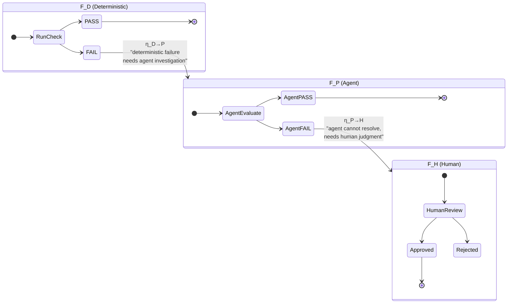
```mermaid
stateDiagram-v2
    direction LR

    state "F_D (Deterministic)" as FD {
        [*] --> RunCheck
        RunCheck --> PASS
        RunCheck --> FAIL
        PASS --> [*]
    }

    state "F_P (Agent)" as FP {
        [*] --> AgentEvaluate
        AgentEvaluate --> AgentPASS
        AgentEvaluate --> AgentFAIL
        AgentPASS --> [*]
    }

    state "F_H (Human)" as FH {
        [*] --> HumanReview
        HumanReview --> Approved
        HumanReview --> Rejected
        Approved --> [*]
    }

    FAIL --> FP: η_D→P<br/>"deterministic failure<br/>needs agent investigation"
    AgentFAIL --> FH: η_P→H<br/>"agent cannot resolve,<br/>needs human judgment"
```

### Where η fires in the code

**`fd_evaluate.py`** — in `evaluate_checklist()`:
```python
if cr.check_type == "deterministic" and cr.outcome in (FAIL, ERROR) and cr.required:
    escalations.append(f"η_D→P: {cr.name} failed — may need agent investigation")
```

**`engine.py`** — in `iterate_edge()`:
```python
if cr.check_type == "deterministic":
    escalations.append(f"η_D→P: {cr.name} — deterministic failure")
elif cr.check_type == "agent":
    escalations.append(f"η_P→H: {cr.name} — agent evaluation failed")
```

The escalation signals are **informational** — the engine records them, but the current implementation does not yet automatically dispatch to F_P or F_H. That is future work.

---

## 7. F_D Emit — Event Emission

Emit is **category-fixed F_D** — it always fires, regardless of profile. The LLM cannot skip it.

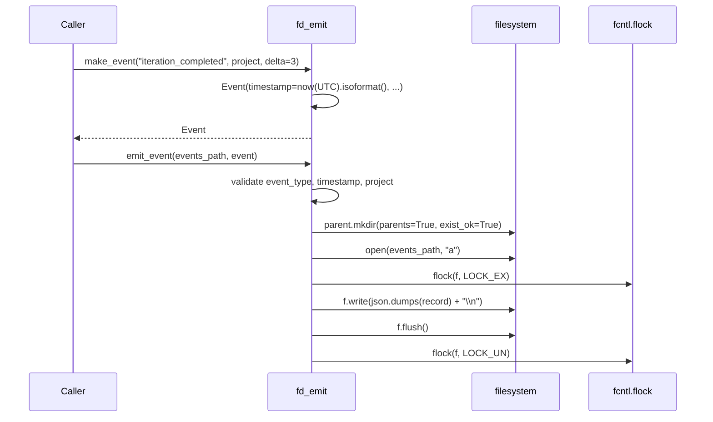
```mermaid
sequenceDiagram
    participant Caller
    participant EM as fd_emit
    participant FS as filesystem
    participant LOCK as fcntl.flock

    Caller->>EM: make_event("iteration_completed", project, delta=3)
    EM->>EM: Event(timestamp=now(UTC).isoformat(), ...)
    EM-->>Caller: Event

    Caller->>EM: emit_event(events_path, event)
    EM->>EM: validate event_type, timestamp, project
    EM->>FS: parent.mkdir(parents=True, exist_ok=True)
    EM->>FS: open(events_path, "a")
    EM->>LOCK: flock(f, LOCK_EX)
    EM->>FS: f.write(json.dumps(record) + "\\n")
    EM->>FS: f.flush()
    EM->>LOCK: flock(f, LOCK_UN)
```

### Event Format (JSONL)

```json
{"event_type":"iteration_completed","timestamp":"2026-02-24T10:30:00+00:00","project":"my_proj","feature":"REQ-F-AUTH-001","edge":"code↔unit_tests","delta":3,"status":"iterating"}
```

### Event Types

| Event Type | When Emitted |
|---|---|
| `project_initialized` | `/gen-init` |
| `iteration_completed` | Every iteration boundary |
| `edge_started` | Edge traversal begins |
| `edge_converged` | All required checks pass |
| `spawn_created` | Child vector spawned |
| `spawn_folded_back` | Child results returned |
| `checkpoint_created` | Session snapshot |
| `review_completed` | Human review done |
| `gaps_validated` | Traceability check |
| `release_created` | Release package |

---

## 8. F_D Classify — Deterministic Classification

Three classifiers, all regex/keyword-based (no LLM):

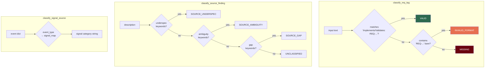
```mermaid
graph TD
    subgraph classify_req_tag
        IN1[input text] --> PAT1{matches<br/>'Implements/Validates: REQ-...'?}
        PAT1 -->|yes| VALID["VALID"]
        PAT1 -->|no| PAT2{contains<br/>'REQ-...' bare?}
        PAT2 -->|yes| INVALID["INVALID_FORMAT"]
        PAT2 -->|no| MISSING["MISSING"]
    end

    subgraph classify_source_finding
        IN2[description] --> KW1{underspec<br/>keywords?}
        KW1 -->|yes| UNDER["SOURCE_UNDERSPEC"]
        KW1 -->|no| KW2{ambiguity<br/>keywords?}
        KW2 -->|yes| AMBIG["SOURCE_AMBIGUITY"]
        KW2 -->|no| KW3{gap<br/>keywords?}
        KW3 -->|yes| GAP["SOURCE_GAP"]
        KW3 -->|no| UNC["UNCLASSIFIED"]
    end

    subgraph classify_signal_source
        IN3[event dict] --> MAP{event_type<br/>→ signal_map}
        MAP --> SIG["signal category string"]
    end

    style VALID fill:#2d6a4f,color:#fff
    style INVALID fill:#e76f51,color:#fff
    style MISSING fill:#6a040f,color:#fff
```

### Keyword Sets

| Classification | Keywords |
|---|---|
| `SOURCE_UNDERSPEC` | underspecified, insufficient detail, needs clarification, placeholder |
| `SOURCE_AMBIGUITY` | unclear, ambiguous, vague, undefined, unspecified, unknown, tbd |
| `SOURCE_GAP` | missing, absent, gap, omitted, incomplete, not defined, lacks |

Priority order: underspec → ambiguity → gap (first match wins).

---

## 9. F_D Sense — Interoceptive Monitors

Five monitors map to the spec's sensory system (INTRO-001 through INTRO-007):

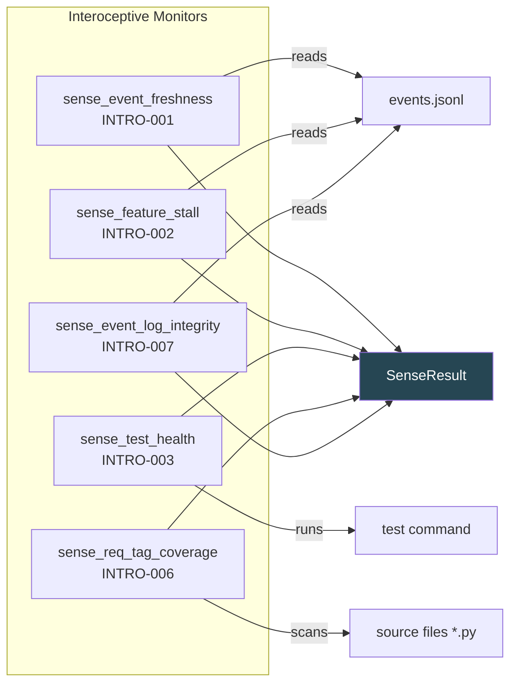
```mermaid
graph LR
    subgraph "Interoceptive Monitors"
        M1["sense_event_freshness<br/>INTRO-001"]
        M2["sense_feature_stall<br/>INTRO-002"]
        M3["sense_test_health<br/>INTRO-003"]
        M4["sense_req_tag_coverage<br/>INTRO-006"]
        M5["sense_event_log_integrity<br/>INTRO-007"]
    end

    M1 -->|reads| EV["events.jsonl"]
    M2 -->|reads| EV
    M3 -->|runs| TC["test command"]
    M4 -->|scans| SRC["source files *.py"]
    M5 -->|reads| EV

    M1 --> SR["SenseResult"]
    M2 --> SR
    M3 --> SR
    M4 --> SR
    M5 --> SR

    style SR fill:#264653,color:#fff
```

### Stall Detection State Machine

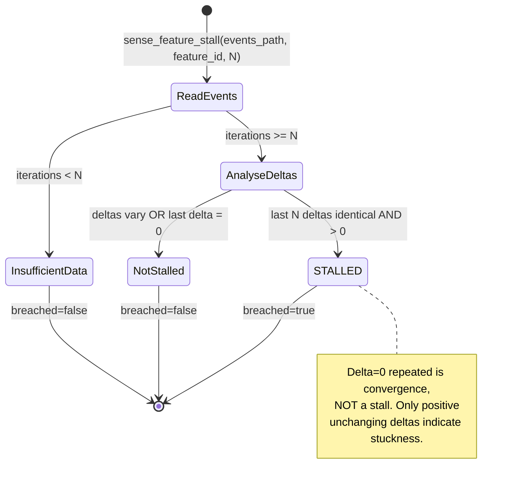
```mermaid
stateDiagram-v2
    [*] --> ReadEvents: sense_feature_stall(events_path, feature_id, N)

    ReadEvents --> InsufficientData: iterations < N
    ReadEvents --> AnalyseDeltas: iterations >= N

    AnalyseDeltas --> NotStalled: deltas vary OR last delta = 0
    AnalyseDeltas --> STALLED: last N deltas identical AND > 0

    InsufficientData --> [*]: breached=false
    NotStalled --> [*]: breached=false
    STALLED --> [*]: breached=true

    note right of STALLED
        Delta=0 repeated is convergence,
        NOT a stall. Only positive
        unchanging deltas indicate stuckness.
    end note
```

---

## 10. F_D Route — Profile & Edge Selection

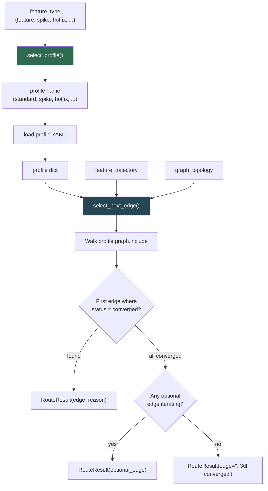
```mermaid
flowchart TD
    FT["feature_type<br/>(feature, spike, hotfix, ...)"] --> SP["select_profile()"]
    SP --> PN["profile name<br/>(standard, spike, hotfix, ...)"]
    PN --> LP["load profile YAML"]
    LP --> PROF["profile dict"]

    PROF --> SNE["select_next_edge()"]
    TRAJ["feature_trajectory"] --> SNE
    GT["graph_topology"] --> SNE

    SNE --> WALK["Walk profile.graph.include"]

    WALK --> FIRST{"First edge where<br/>status ≠ converged?"}
    FIRST -->|found| RR1["RouteResult(edge, reason)"]
    FIRST -->|all converged| OPT{"Any optional<br/>edge iterating?"}
    OPT -->|yes| RR2["RouteResult(optional_edge)"]
    OPT -->|no| RR3["RouteResult(edge='', 'All converged')"]

    style SP fill:#2d6a4f,color:#fff
    style SNE fill:#264653,color:#fff
```

### Vector Type → Profile Mapping

| Vector Type | Profile | Rationale |
|---|---|---|
| `feature` | `standard` | Normal development flow |
| `discovery` | `poc` | Exploration, lighter process |
| `spike` | `spike` | Time-boxed risk assessment |
| `poc` | `poc` | Proof of concept |
| `hotfix` | `hotfix` | Emergency, minimal process |

### Edge Naming Convention

Graph edges use Unicode arrows (`→`, `↔`). Trajectory keys normalise these:

```
"code↔unit_tests" → trajectory key "code_unit_tests"
"intent→requirements" → trajectory key "intent_requirements"
```

---

## 11. Dispatch Table

The dispatch table maps `(FunctionalUnit, Category)` to a callable:

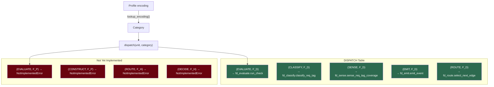
```mermaid
graph TD
    subgraph "DISPATCH Table"
        direction LR
        E_D["(EVALUATE, F_D)<br/>→ fd_evaluate.run_check"]
        C_D["(CLASSIFY, F_D)<br/>→ fd_classify.classify_req_tag"]
        S_D["(SENSE, F_D)<br/>→ fd_sense.sense_req_tag_coverage"]
        M_D["(EMIT, F_D)<br/>→ fd_emit.emit_event"]
        R_D["(ROUTE, F_D)<br/>→ fd_route.select_next_edge"]
    end

    subgraph "Not Yet Implemented"
        E_P["(EVALUATE, F_P) → NotImplementedError"]
        C_P["(CONSTRUCT, F_P) → NotImplementedError"]
        R_H["(ROUTE, F_H) → NotImplementedError"]
        D_H["(DECIDE, F_H) → NotImplementedError"]
    end

    PROF["Profile encoding"] -->|"lookup_encoding()"| CAT["Category"]
    CAT --> DIS["dispatch(unit, category)"]
    DIS --> E_D
    DIS --> E_P

    style E_D fill:#2d6a4f,color:#fff
    style C_D fill:#2d6a4f,color:#fff
    style S_D fill:#2d6a4f,color:#fff
    style M_D fill:#2d6a4f,color:#fff
    style R_D fill:#2d6a4f,color:#fff
    style E_P fill:#6a040f,color:#fff
    style C_P fill:#6a040f,color:#fff
    style R_H fill:#6a040f,color:#fff
    style D_H fill:#6a040f,color:#fff
```

### `lookup_and_dispatch(unit, profile)` — End-to-End

```python
def lookup_and_dispatch(unit: FunctionalUnit, profile: dict) -> Callable:
    category = fd_route.lookup_encoding(profile, unit.value)  # Step 1: profile → category
    return dispatch(unit, category)                            # Step 2: table lookup
```

---

## 12. Profile Encoding Matrix

Each profile encodes the 8 functional units to categories differently:

| Unit | Standard | Hotfix | Spike | PoC | Full | Minimal |
|------|----------|--------|-------|-----|------|---------|
| **evaluate** | F_D | F_D | **F_P** | F_D | F_D | F_D |
| **construct** | F_P | F_P | F_P | F_P | F_P | F_P |
| **classify** | F_D | F_D | F_D | F_D | F_D | F_D |
| **route** | F_H | **F_D** | **F_P** | F_H | F_H | F_P |
| **propose** | F_P | F_P | F_P | F_P | F_P | F_P |
| **sense** | F_D | F_D | F_D | F_D | F_D | F_D |
| **emit** | F_D | F_D | F_D | F_D | F_D | F_D |
| **decide** | F_H | F_H | F_H | F_H | F_H | F_H |

Key variations:
- **Spike** flips `evaluate` to `F_P` — exploration code isn't test-driven
- **Hotfix** flips `route` to `F_D` — fixed emergency path, no human routing
- **Minimal** flips `route` to `F_P` — agent picks route
- `emit` (F_D) and `decide` (F_H) are **invariant** across all profiles

---

## 13. Engine — Graph Traversal Loop

The engine (`engine.py`) is the top-level deterministic controller. It owns the loop; the LLM is called from within.

### Full Traversal Sequence

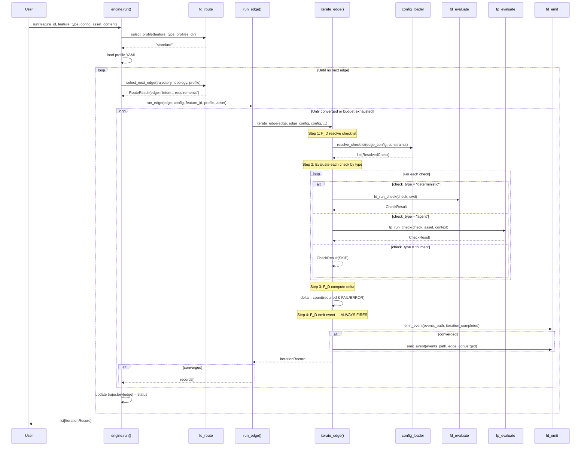
```mermaid
sequenceDiagram
    participant User
    participant ENG as engine.run()
    participant ROUTE as fd_route
    participant EDGE as run_edge()
    participant ITER as iterate_edge()
    participant CL as config_loader
    participant FD as fd_evaluate
    participant FP as fp_evaluate
    participant EMIT as fd_emit

    User->>ENG: run(feature_id, feature_type, config, asset_content)
    ENG->>ROUTE: select_profile(feature_type, profiles_dir)
    ROUTE-->>ENG: "standard"
    ENG->>ENG: load profile YAML

    loop Until no next edge
        ENG->>ROUTE: select_next_edge(trajectory, topology, profile)
        ROUTE-->>ENG: RouteResult(edge="intent→requirements")

        ENG->>EDGE: run_edge(edge, config, feature_id, profile, asset)

        loop Until converged or budget exhausted
            EDGE->>ITER: iterate_edge(edge, edge_config, config, ...)

            Note over ITER: Step 1: F_D resolve checklist
            ITER->>CL: resolve_checklist(edge_config, constraints)
            CL-->>ITER: list[ResolvedCheck]

            Note over ITER: Step 2: Evaluate each check by type
            loop For each check
                alt check_type = "deterministic"
                    ITER->>FD: fd_run_check(check, cwd)
                    FD-->>ITER: CheckResult
                else check_type = "agent"
                    ITER->>FP: fp_run_check(check, asset, context)
                    FP-->>ITER: CheckResult
                else check_type = "human"
                    ITER-->>ITER: CheckResult(SKIP)
                end
            end

            Note over ITER: Step 3: F_D compute delta
            ITER->>ITER: delta = count(required & FAIL/ERROR)

            Note over ITER: Step 4: F_D emit event — ALWAYS FIRES
            ITER->>EMIT: emit_event(events_path, iteration_completed)
            alt converged
                ITER->>EMIT: emit_event(events_path, edge_converged)
            end

            ITER-->>EDGE: IterationRecord

            alt converged
                EDGE-->>ENG: records[]
            end
        end

        ENG->>ENG: update trajectory[edge] = status
    end

    ENG-->>User: list[IterationRecord]
```

### Engine State Machine

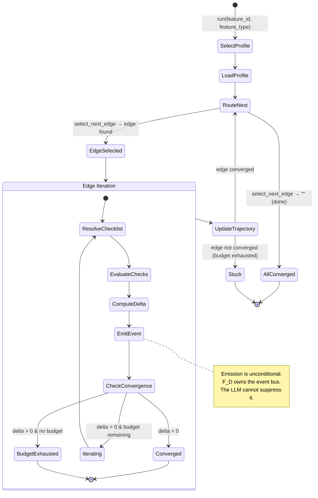
```mermaid
stateDiagram-v2
    [*] --> SelectProfile: run(feature_id, feature_type)

    SelectProfile --> LoadProfile
    LoadProfile --> RouteNext

    RouteNext --> EdgeSelected: select_next_edge → edge found
    RouteNext --> AllConverged: select_next_edge → "" (done)

    state "Edge Iteration" as EdgeLoop {
        [*] --> ResolveChecklist
        ResolveChecklist --> EvaluateChecks
        EvaluateChecks --> ComputeDelta
        ComputeDelta --> EmitEvent
        EmitEvent --> CheckConvergence
        CheckConvergence --> Converged: delta = 0
        CheckConvergence --> Iterating: delta > 0 & budget remaining
        CheckConvergence --> BudgetExhausted: delta > 0 & no budget
        Iterating --> ResolveChecklist
        Converged --> [*]
        BudgetExhausted --> [*]
    }

    EdgeSelected --> EdgeLoop
    EdgeLoop --> UpdateTrajectory

    UpdateTrajectory --> RouteNext: edge converged
    UpdateTrajectory --> Stuck: edge not converged (budget exhausted)

    AllConverged --> [*]
    Stuck --> [*]

    note right of EmitEvent
        Emission is unconditional.
        F_D owns the event bus.
        The LLM cannot suppress it.
    end note
```

---

## 14. F_P Evaluate — LLM Integration

`fp_evaluate.py` wraps the Claude Code CLI for agent-based evaluation:

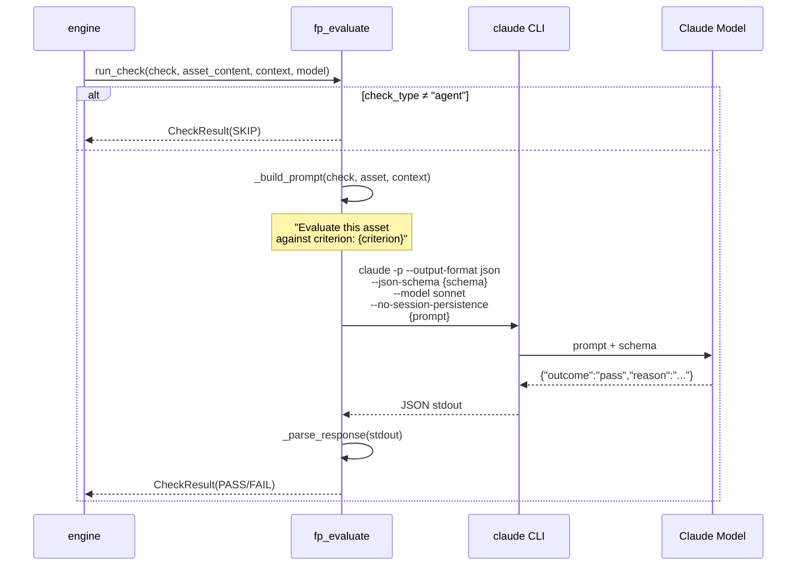
```mermaid
sequenceDiagram
    participant ENG as engine
    participant FP as fp_evaluate
    participant CLI as claude CLI
    participant LLM as Claude Model

    ENG->>FP: run_check(check, asset_content, context, model)

    alt check_type ≠ "agent"
        FP-->>ENG: CheckResult(SKIP)
    else
        FP->>FP: _build_prompt(check, asset, context)
        Note over FP: "Evaluate this asset<br/>against criterion: {criterion}"

        FP->>CLI: claude -p --output-format json<br/>--json-schema {schema}<br/>--model sonnet<br/>--no-session-persistence<br/>{prompt}
        CLI->>LLM: prompt + schema
        LLM-->>CLI: {"outcome":"pass","reason":"..."}
        CLI-->>FP: JSON stdout

        FP->>FP: _parse_response(stdout)
        FP-->>ENG: CheckResult(PASS/FAIL)
    end
```

### Response Schema (JSON Schema)

```json
{
    "type": "object",
    "properties": {
        "outcome": {"type": "string", "enum": ["pass", "fail"]},
        "reason": {"type": "string"}
    },
    "required": ["outcome", "reason"]
}
```

---

## 15. Data Flow — Complete Pipeline

This diagram shows how data flows through the entire system for one iteration:

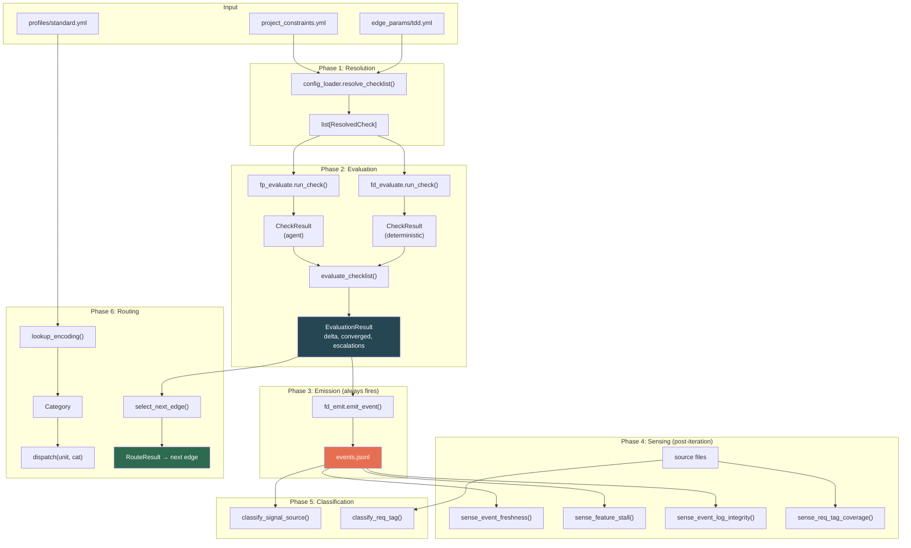
```mermaid
flowchart TD
    subgraph "Input"
        YAML_E["edge_params/tdd.yml"]
        YAML_C["project_constraints.yml"]
        YAML_P["profiles/standard.yml"]
    end

    subgraph "Phase 1: Resolution"
        CL["config_loader.resolve_checklist()"]
        YAML_E --> CL
        YAML_C --> CL
        CL --> CHECKS["list[ResolvedCheck]"]
    end

    subgraph "Phase 2: Evaluation"
        CHECKS --> FDE["fd_evaluate.run_check()"]
        CHECKS --> FPE["fp_evaluate.run_check()"]
        FDE --> CR1["CheckResult<br/>(deterministic)"]
        FPE --> CR2["CheckResult<br/>(agent)"]
        CR1 --> AGG["evaluate_checklist()"]
        CR2 --> AGG
        AGG --> ER["EvaluationResult<br/>delta, converged, escalations"]
    end

    subgraph "Phase 3: Emission (always fires)"
        ER --> EM["fd_emit.emit_event()"]
        EM --> JSONL["events.jsonl"]
    end

    subgraph "Phase 4: Sensing (post-iteration)"
        JSONL --> SF["sense_event_freshness()"]
        JSONL --> SS["sense_feature_stall()"]
        JSONL --> SI["sense_event_log_integrity()"]
        SRC["source files"] --> SC["sense_req_tag_coverage()"]
    end

    subgraph "Phase 5: Classification"
        JSONL --> CSC["classify_signal_source()"]
        SRC --> CRT["classify_req_tag()"]
    end

    subgraph "Phase 6: Routing"
        YAML_P --> LE["lookup_encoding()"]
        LE --> CAT["Category"]
        CAT --> DIS["dispatch(unit, cat)"]
        ER --> SNE["select_next_edge()"]
        SNE --> RR["RouteResult → next edge"]
    end

    style ER fill:#264653,color:#fff
    style JSONL fill:#e76f51,color:#fff
    style RR fill:#2d6a4f,color:#fff
```

---

## 16. Test Architecture

### Test Files

| File | Tests | What it covers |
|------|-------|------|
| `test_config_loader.py` | 16 | `resolve_variable`, `resolve_variables`, `resolve_checklist`, `load_yaml`, real config integration |
| `test_functor_fd.py` | 39 | Unit tests for all F_D modules: evaluate, emit, classify, sense, route, dispatch |
| `test_functor_e2e.py` | 50 | 6 end-to-end scenarios wiring the full pipeline |

### E2E Test Scenarios

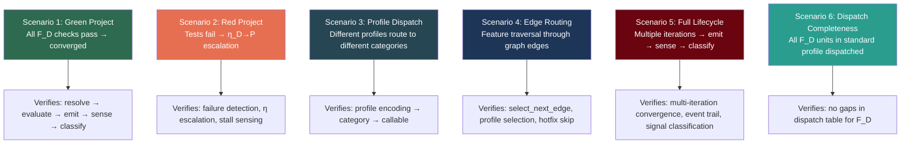
```mermaid
graph TD
    S1["Scenario 1: Green Project<br/>All F_D checks pass → converged"]
    S2["Scenario 2: Red Project<br/>Tests fail → η_D→P escalation"]
    S3["Scenario 3: Profile Dispatch<br/>Different profiles route to different categories"]
    S4["Scenario 4: Edge Routing<br/>Feature traversal through graph edges"]
    S5["Scenario 5: Full Lifecycle<br/>Multiple iterations → emit → sense → classify"]
    S6["Scenario 6: Dispatch Completeness<br/>All F_D units in standard profile dispatched"]

    S1 --> V1["Verifies: resolve → evaluate → emit → sense → classify"]
    S2 --> V2["Verifies: failure detection, η escalation, stall sensing"]
    S3 --> V3["Verifies: profile encoding → category → callable"]
    S4 --> V4["Verifies: select_next_edge, profile selection, hotfix skip"]
    S5 --> V5["Verifies: multi-iteration convergence, event trail, signal classification"]
    S6 --> V6["Verifies: no gaps in dispatch table for F_D"]

    style S1 fill:#2d6a4f,color:#fff
    style S2 fill:#e76f51,color:#fff
    style S3 fill:#264653,color:#fff
    style S4 fill:#1d3557,color:#fff
    style S5 fill:#6a040f,color:#fff
    style S6 fill:#2a9d8f,color:#fff
```

---

## 17. Dependencies

**stdlib only** (except PyYAML):

| Dependency | Used by | Purpose |
|---|---|---|
| `dataclasses` | `models.py` | Data model definitions |
| `enum` | `models.py` | Category, FunctionalUnit, CheckOutcome |
| `subprocess` | `fd_evaluate.py`, `fd_sense.py`, `fp_evaluate.py` | Shell command execution |
| `fcntl` | `fd_emit.py` | Advisory file locking for JSONL append |
| `json` | `fd_emit.py`, `fd_sense.py`, `fp_evaluate.py` | Event serialization/parsing |
| `re` | `config_loader.py`, `fd_classify.py`, `fd_sense.py` | Pattern matching |
| `yaml` (PyYAML) | `config_loader.py` | YAML parsing |
| `shutil` | `fp_evaluate.py` | `which()` to find claude CLI |

---

## 18. Process Model Decision: Synchronous Now, Actors Later

The design docs (ADR-013, ADR-015, Design §1.11) describe an **actor model** with inbox staging, a single-writer serialiser, MCP sensory service, and observer agents. The current engine uses **synchronous direct function calls** instead.

**This is a deliberate decision, not a gap.**

| Concern | Actor Model | Current Model | Verdict |
|---|---|---|---|
| Correctness | Same | Same | Both produce identical results |
| Testability | Harder (async, inboxes) | Easy (direct calls, deterministic) | Current wins |
| Debuggability | Distributed tracing needed | Stack traces just work | Current wins |
| Multi-agent | Required | Not needed yet | Defer |
| Robustness | Crash recovery, stale claim detection | Process dies, restart | Defer |
| MCP sensory service | Long-running monitors | On-demand sense functions | Defer |

The actor model adds **robustness** (crash recovery, concurrent agent coordination, long-running monitors) but not **functionality**. Every functor, every η boundary, every event emission, every sense monitor is testable and exercised with the synchronous model.

**When to revisit**: when multi-agent coordination (ADR-013 claim protocol) or the sensory MCP server (ADR-015) become active implementation targets.

---

## 19. What's Not Implemented Yet

| Gap | Category | Notes |
|---|---|---|
| F_P modules (classify, route, sense) | F_P | `fp_evaluate.py` exists for evaluate only |
| F_H modules (all) | F_H | Interactive prompts — future work |
| Automatic η dispatch | η | Escalation signals are recorded but not auto-dispatched |
| CLI entry point | Infra | No `python -m genisis` yet |
| Feature constraint merging | Config | `feature.threshold_overrides` + `acceptance_criteria` not yet composed |
| Construct / Propose | F_D/F_P | No modules — these are always F_P (agent-generated) |
| Actor model / inbox / serialiser | Infra | ADR-013 — defer until multi-agent needed |
| MCP sensory service | Infra | ADR-015 — defer until long-running monitors needed |
| Observer agents (dev, CI/CD, ops) | Infra | Design §1.11 — defer until hooks pipeline built |
