# F_D Functor Framework — Design & Implementation Guide

**Version**: 2.1.0
**Implements**: REQ-GRAPH-001, REQ-GRAPH-002, REQ-GRAPH-003, REQ-ITER-001, REQ-ITER-002, REQ-ITER-003, REQ-EVAL-002
**Package**: `imp_claude/code/genisis/`

---

# Part I: Current State

Everything in Part I is verifiable against the code. Status badges: `[IMPLEMENTED]`, `[PARTIAL]`, `[STUB]`.

---

## 1. Conceptual Overview `[IMPLEMENTED]`

The functor framework executes the `iterate()` primitive. The primitive has two sub-operations — **construct** (generate/modify assets) and **evaluate** (check convergence) — implemented by three categories of functors.

### Three Functor Categories

| Category | Symbol | Meaning | Cost | Example |
|----------|--------|---------|------|---------|
| **F_D** | Deterministic | Subprocess, regex, dict lookup | Free | Run `pytest`, parse REQ tags |
| **F_P** | Probabilistic | LLM / agent call | $$$ | "Does this code meet the criterion?" |
| **F_H** | Human | Interactive prompt | Blocking | "Do you approve this design?" |

### Eight Functional Units

The loop decomposes into 8 functional units, each rendered by one of {F_D, F_P, F_H}:

| Unit | Default Category | What it does |
|------|-----------------|--------------|
| **evaluate** | F_D | Run convergence checks (tests, lints, schemas) |
| **construct** | F_P | Generate/modify assets (code, specs, tests) |
| **classify** | F_D | Categorise signals (REQ tags, source findings) |
| **route** | F_H | Select next edge, determine profile |
| **propose** | F_P | Suggest changes, generate candidates |
| **sense** | F_D | Monitor workspace health (stalls, freshness, coverage) |
| **emit** | F_D | Write events to JSONL log — **always deterministic** |
| **decide** | F_H | Final approval/rejection — **always human** |

Two units are **category-fixed**: `emit` is always F_D (the LLM cannot suppress event logging), `decide` is always F_H (humans own final approval).

> **Source**: `models.py:13-28` — `FunctionalUnit` enum, `CATEGORY_FIXED` dict.

### Two Execution Strategies

Two strategies implement `iterate()` today, with a third planned:

| Strategy | Status | Construct | Evaluate | LLM Calls |
|----------|--------|-----------|----------|-----------|
| **A: E2E Agent** | `[IMPLEMENTED]` | LLM in-session | LLM in-session + subprocess | 1 session |
| **B: Deterministic Engine** | `[PARTIAL]` | **Not implemented** | F_D subprocess + F_P per-check | 37 per iteration |
| **C: Hybrid Engine** | `[PLANNED]` | 1 LLM call per edge | Batched in same call | 4 per iteration |

See §13 for full analysis.

---

## 2. Profile-Based Routing `[IMPLEMENTED]`

The framework uses **named profiles** to control which graph edges are active, which evaluators run, and how functional units are encoded. Six profiles cover the projection space.

### Profile Selection

`select_profile()` maps feature type to profile name:

```python
# fd_route.py:select_profile()
PROFILE_MAP = {
    "feature":   "standard",
    "discovery": "poc",
    "spike":     "spike",
    "poc":       "poc",
    "hotfix":    "hotfix",
}
# default → "standard"
```

> **Source**: `fd_route.py` — `select_profile(feature_type, profiles_dir) -> str`

### What the Engine Reads from a Profile

Each profile YAML (`config/profiles/{name}.yml`) provides three things the engine uses:

1. **`graph.include`** — required edge traversal order
2. **`graph.optional`** — optional edges (selected only after required edges converge)
3. **`encoding.functional_units`** — category (F_D/F_P/F_H) per functional unit

### Encoding Matrix (from Profile YAMLs)

| Unit | full | standard | poc | spike | hotfix | minimal |
|------|------|----------|-----|-------|--------|---------|
| evaluate | F_D | F_D | F_P | F_D | F_D | F_D |
| construct | F_P | F_P | F_P | F_P | F_P | F_P |
| classify | F_D | F_D | F_D | F_D | F_D | F_D |
| route | **F_H** | F_D | **F_H** | **F_P** | F_D | F_P |
| propose | F_P | F_P | F_P | F_P | F_P | F_P |
| sense | F_D | F_D | F_D | F_D | F_D | F_D |
| emit | F_D | F_D | F_D | F_D | F_D | F_D |
| decide | F_H | F_H | F_H | F_H | F_H | F_H |

> **Source**: `config/profiles/*.yml` — `encoding.functional_units` section of each file.

### Graph Subsets by Profile

| Profile | Required Edges | Optional |
|---------|---------------|----------|
| **full** | all 10 edges | none |
| **standard** | intent→req, req→design, design→code, code↔unit_tests | design→test_cases, design→uat_tests, code→cicd |
| **poc** | intent→req, req→design, design→code | none |
| **spike** | intent→req, req→design, design→code | none |
| **hotfix** | intent→req, design→code, code↔unit_tests | none |
| **minimal** | intent→req, design→code | none |

### Which Strategy Reads What

| Profile Field | Engine (Strategy B) | E2E Agent (Strategy A) |
|---------------|--------------------|-----------------------|
| `graph.include` / `optional` | Yes — `select_next_edge()` | Yes — agent reads profile |
| `encoding.functional_units` | Yes — `lookup_encoding()` → dispatch | No — agent is the LLM |
| `evaluators` | No | Yes — determines check density |
| `convergence` | No | Yes — drives convergence rules |
| `context` | No | Yes — determines context loading |
| `iteration` | No | Yes — time-box, budget |

---

## 3. Package Structure `[IMPLEMENTED]`

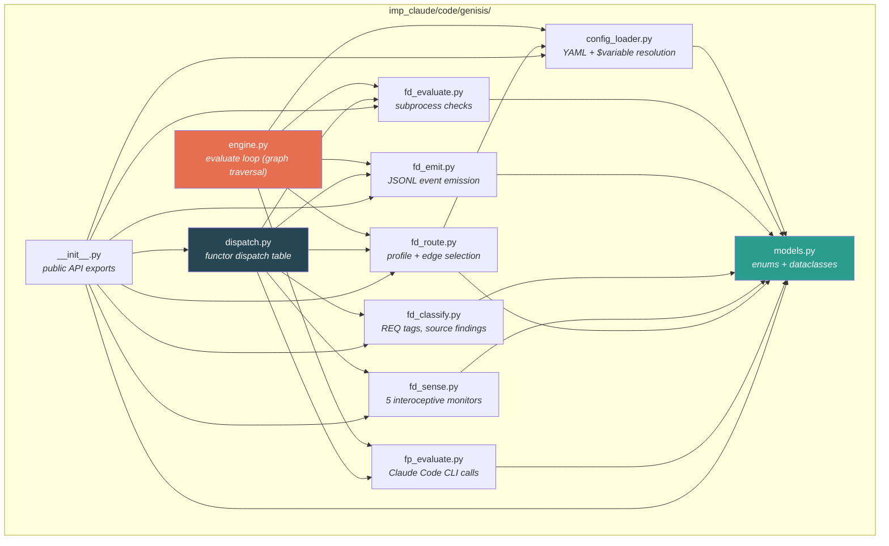

---

## 4. Data Model `[IMPLEMENTED]`

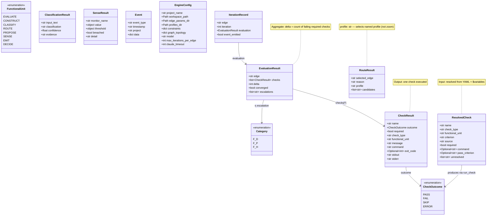

> **Source**: `models.py` — all dataclasses. `engine.py:8-16` — `EngineConfig`, `IterationRecord`.

### CATEGORY_FIXED Invariant

```python
CATEGORY_FIXED = {
    FunctionalUnit.EMIT:   Category.F_D,   # emit is ALWAYS deterministic
    FunctionalUnit.DECIDE: Category.F_H,   # decide is ALWAYS human
}
```

This is enforced at all profile levels and validated in tests.

---

## 5. Configuration Resolution Pipeline `[IMPLEMENTED]`

The configuration system composes constraints from four layers:

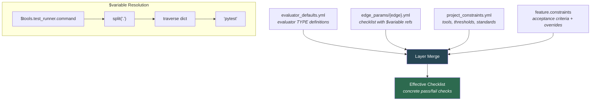

### $Variable Resolution Regex

```
Pattern: \$(\w+(?:\.\w+)*)

Matches:
  $tools.test_runner.command      → constraints["tools"]["test_runner"]["command"]
  $thresholds.test_coverage_minimum → constraints["thresholds"]["test_coverage_minimum"]
  $standards.style_guide          → constraints["standards"]["style_guide"]
```

### Resolution Rules

1. Edge checklist defines default checks
2. `$variables` resolve from `project_constraints.yml`
3. Feature `threshold_overrides` apply on top
4. Feature `acceptance_criteria` append to checklist
5. `required=true` at any layer stays `true` (most restrictive wins)
6. Unresolved `$variables` → check **SKIPPED** with warning (tracked in `unresolved[]`)

### Sequence: `resolve_checklist()`

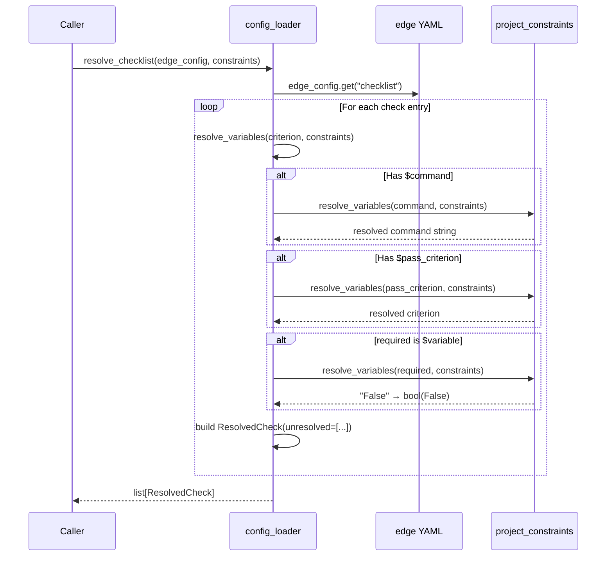

---

## 6. F_D Evaluate — The Deterministic Evaluator `[IMPLEMENTED]`

### State Machine: Check Execution

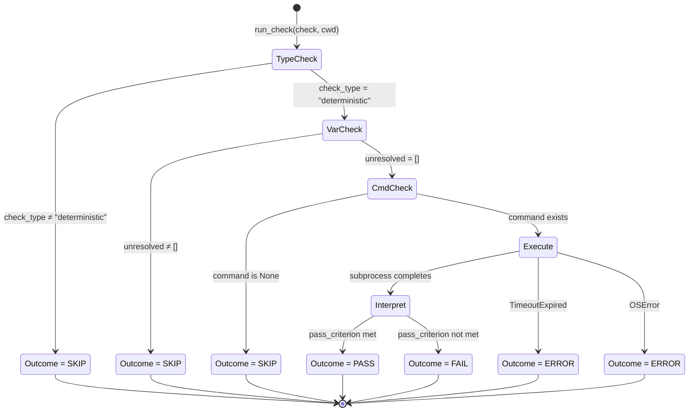

### Pass Criterion Interpretation

The `_interpret_result()` function interprets subprocess output against the `pass_criterion` string:

| Criterion Pattern | Interpretation |
|---|---|
| `"exit code 0"` (or empty) | `returncode == 0` → PASS |
| `"coverage percentage >= N"` | Parse `(\d+)%` from stdout, compare to threshold |
| `"zero violations"` / `"zero errors"` | `returncode == 0` → PASS |
| Default fallback | `returncode == 0` → PASS |

### Checklist Aggregation

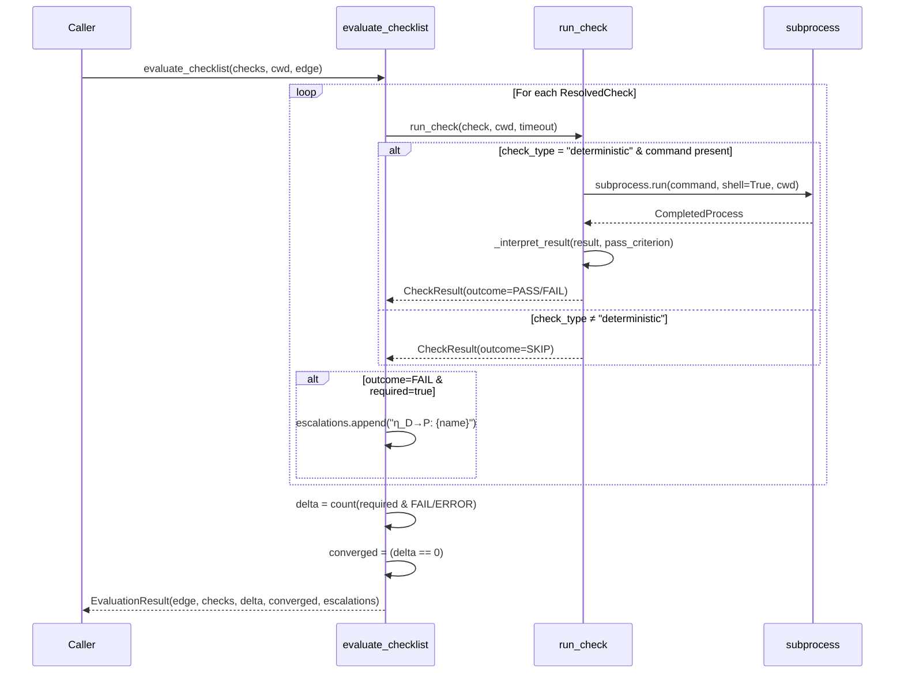

### Delta Formula

```
delta = Σ{ 1 | check ∈ checks, check.required ∧ check.outcome ∈ {FAIL, ERROR} }
converged = (delta == 0)
```

- `SKIP` outcomes (agent, human, unresolved) do **not** count toward delta
- Non-required (`required=false`) failures do **not** count toward delta
- Delta is a **non-negative integer** — the distance from convergence

---

## 7. The η (Natural Transformation) — Escalation Boundary `[IMPLEMENTED]` signals, `[STUB]` dispatch

When a check fails, the framework surfaces an **escalation signal** that hands off to the next-higher category. This is the natural transformation η: F_D → F_P → F_H.

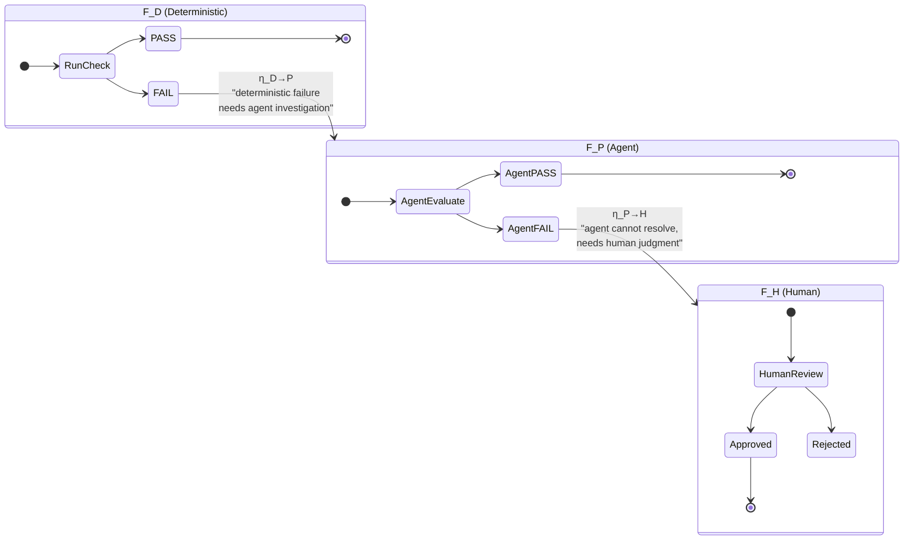

### Where η fires in the code

**`fd_evaluate.py`** — in `evaluate_checklist()`:
```python
if cr.check_type == "deterministic" and cr.outcome in (FAIL, ERROR) and cr.required:
    escalations.append(f"η_D→P: {cr.name} failed — may need agent investigation")
```

**`engine.py`** — in `iterate_edge()`:
```python
if cr.check_type == "deterministic":
    escalations.append(f"η_D→P: {cr.name} — deterministic failure")
elif cr.check_type == "agent":
    escalations.append(f"η_P→H: {cr.name} — agent evaluation failed")
```

The escalation signals are **informational** — the engine records them, but the current implementation does not automatically dispatch to F_P or F_H. Automatic dispatch is future work.

---

## 8. F_D Emit — Event Emission `[IMPLEMENTED]`

Emit is **category-fixed F_D** — it always fires, regardless of profile. The LLM cannot skip it.

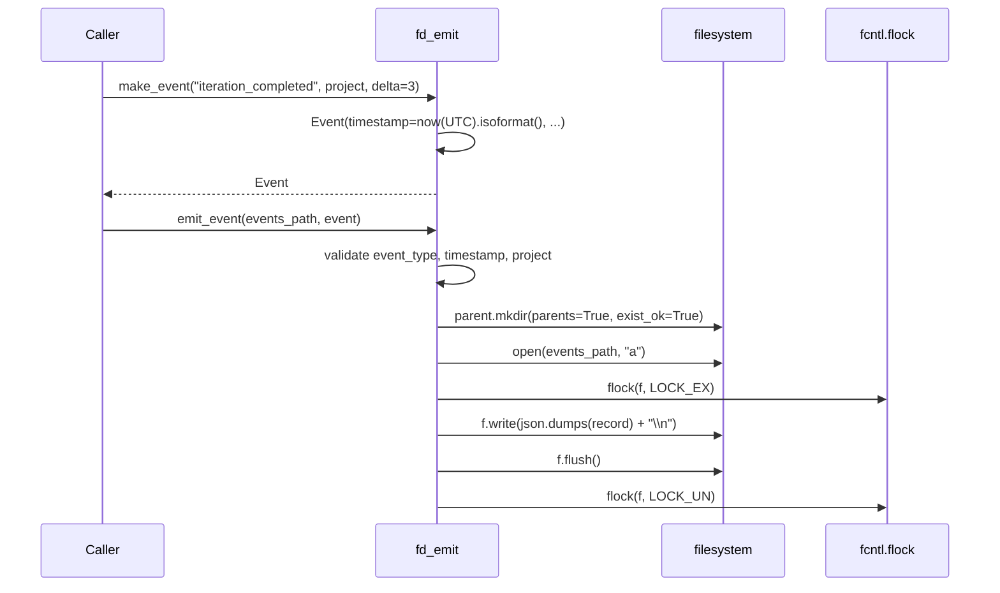

### Event Format (JSONL)

```json
{"event_type":"iteration_completed","timestamp":"2026-02-24T10:30:00+00:00","project":"my_proj","feature":"REQ-F-AUTH-001","edge":"code↔unit_tests","delta":3,"status":"iterating","depth":0}
```

### Event Types

| Event Type | When Emitted |
|---|---|
| `project_initialized` | `/gen-init` |
| `iteration_completed` | Every iteration boundary |
| `edge_started` | Edge traversal begins |
| `edge_converged` | All required checks pass |
| `spawn_created` | Child vector spawned |
| `spawn_folded_back` | Child results returned |
| `checkpoint_created` | Session snapshot |
| `review_completed` | Human review done |
| `gaps_validated` | Traceability check |
| `release_created` | Release package |

---

## 9. F_D Classify — Deterministic Classification `[IMPLEMENTED]`

Three classifiers, all regex/keyword-based (no LLM):

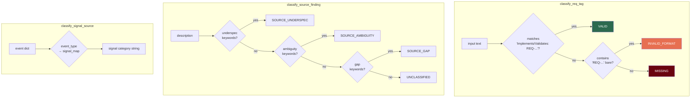

### Keyword Sets

| Classification | Keywords |
|---|---|
| `SOURCE_UNDERSPEC` | underspecified, insufficient detail, needs clarification, placeholder |
| `SOURCE_AMBIGUITY` | unclear, ambiguous, vague, undefined, unspecified, unknown, tbd |
| `SOURCE_GAP` | missing, absent, gap, omitted, incomplete, not defined, lacks |

Priority order: underspec → ambiguity → gap (first match wins).

---

## 10. F_D Sense — Interoceptive Monitors `[IMPLEMENTED]`

Five monitors map to the spec's sensory system (INTRO-001 through INTRO-007):

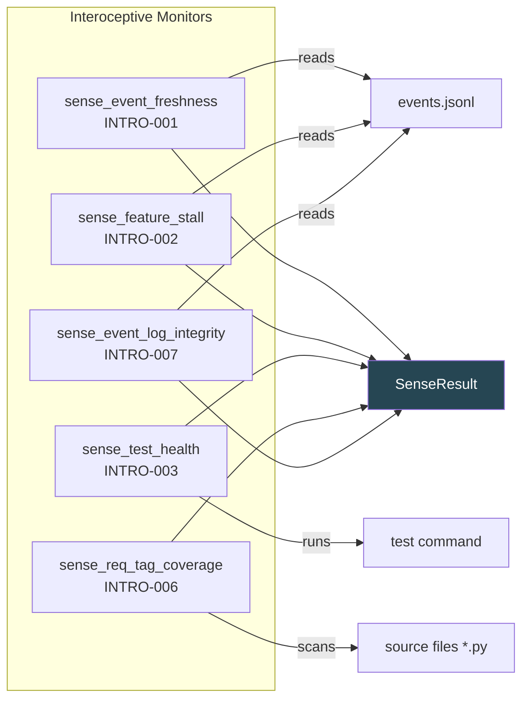

### Stall Detection State Machine

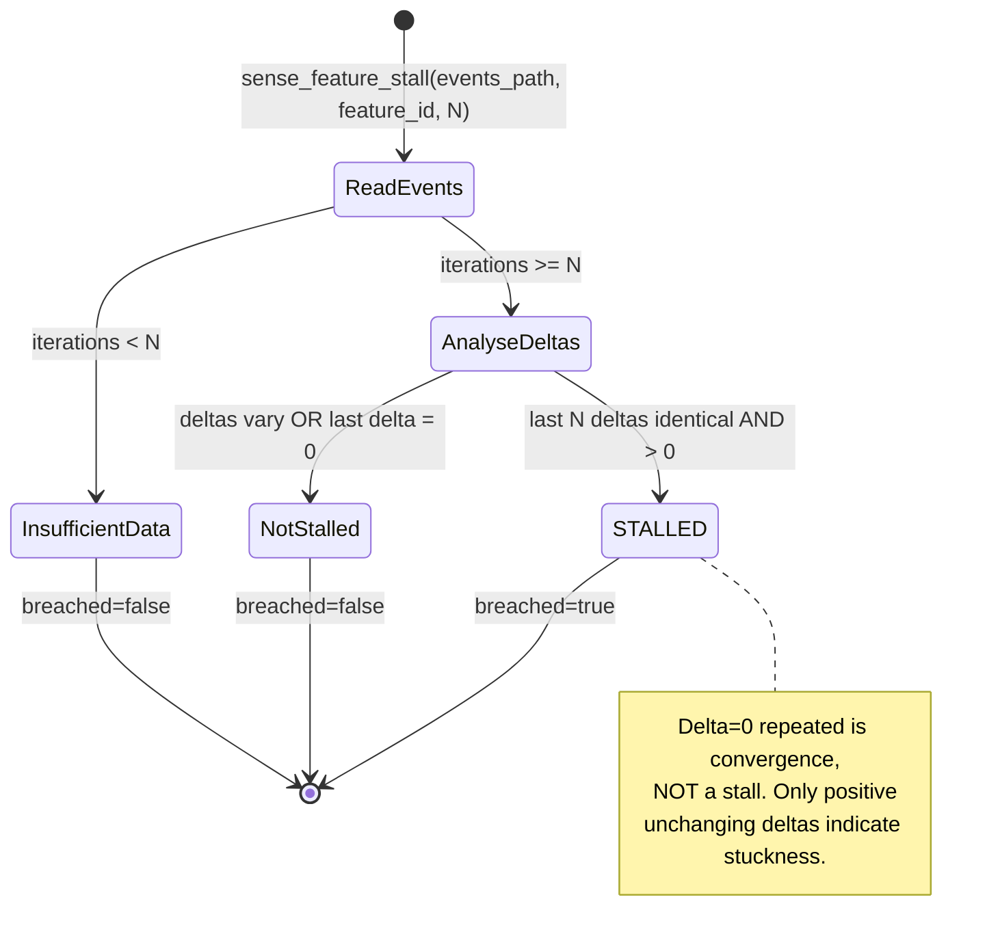

---

## 11. F_D Route — Profile & Edge Selection `[IMPLEMENTED]`

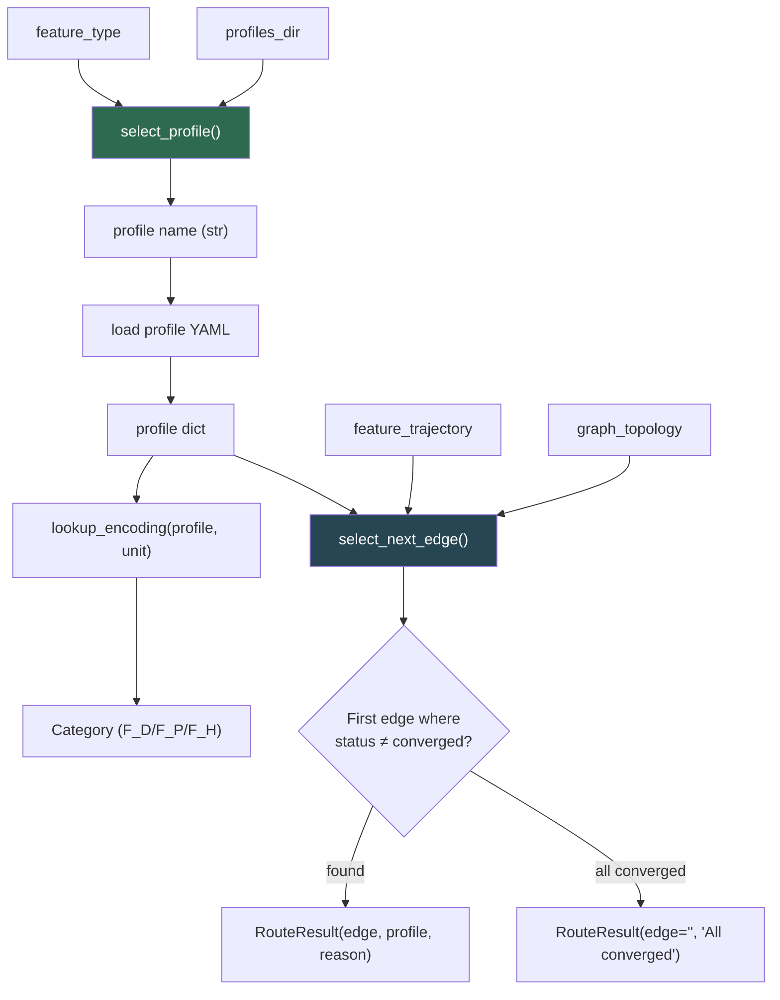

> **Source**: `fd_route.py` — `select_profile()`, `select_next_edge()`, `lookup_encoding()`.

### Edge Naming Convention

Graph edges use Unicode arrows (`→`, `↔`). Trajectory keys normalise these:

```
"code↔unit_tests" → trajectory key "code_unit_tests"
"intent→requirements" → trajectory key "intent_requirements"
```

---

## 12. Dispatch Table `[IMPLEMENTED]`

The dispatch table maps `(FunctionalUnit, Category)` to a callable:

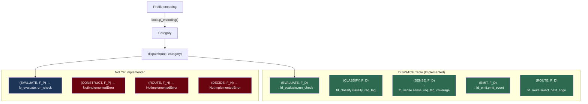

### `lookup_and_dispatch(unit, profile)` — End-to-End

```python
def lookup_and_dispatch(unit: FunctionalUnit, profile: dict) -> Callable:
    category = lookup_encoding(profile, unit.value)       # Step 1: profile → category
    return dispatch(unit, category)                        # Step 2: table lookup
```

> **Source**: `dispatch.py` — `lookup_and_dispatch(unit, profile)`, `dispatch(unit, category)`.

---

## 13. Execution Strategies & Engine `[PARTIAL]`

### Abstract iterate() Loop

Both strategies implement the same abstract loop:

```
while not converged and budget > 0:
    candidate = construct(asset, context, edge_config)   # F_P: generate/modify
    evaluation = evaluate(candidate, evaluators)          # F_D + F_P: check
    delta = compute_delta(evaluation)                     # F_D: count failures
    emit(iteration_event)                                 # F_D: always fires
    if delta == 0: return candidate                       # converged
    asset = candidate                                     # feed back
```

The critical distinction is **who does construct**.

### Strategy A: E2E Agent `[IMPLEMENTED]`

One `claude -p` session drives the **entire** methodology loop. The LLM constructs artifacts, evaluates them (agent checks happen in the same session), and routes to the next edge. The REPL loop operates within a single LLM context window.

```
┌────────────────────────────────────────┐
│  Single claude -p session              │
│                                        │
│  for each edge in profile.graph:       │
│    construct artifact (LLM generates)  │
│    evaluate all checks (in-session)    │
│    emit events                         │
│    if converged: route to next edge    │
└────────────────────────────────────────┘
```

| Property | Value |
|----------|-------|
| LLM calls | **1 session** (all edges) |
| Construct | Yes — LLM generates artifacts in-session |
| Context coherence | Full — later edges see earlier artifacts |
| Cost | ~$2-5 per feature (780s typical) |
| Testability | Requires live Claude (~13 min per run) |
| Observability | Opaque — decision path in LLM reasoning |

> **Source**: E2E tests at `imp_claude/tests/e2e/test_e2e_convergence.py`. Historical runs: 400-890s, $2-5, 34 tests.

### Strategy B: Deterministic Engine `[PARTIAL — evaluate only]`

Python code drives the loop deterministically. The engine resolves configs, dispatches checks by type, computes delta, emits events — but **it cannot construct artifacts**.

```
┌────────────────────────────────────────┐
│  engine.run(feature_id, feature_type)  │
│                                        │
│  profile = select_profile(feature_type)│
│  while edge = select_next_edge():      │
│    for i in range(budget):             │
│      ❌ NO CONSTRUCT STEP              │
│      checks = resolve_checklist(edge)  │
│      for check in checks:              │
│        if deterministic: subprocess    │
│        if agent: claude -p (1 per chk) │
│        if human: SKIP                  │
│      delta = count(required & FAIL)    │
│      emit(iteration_event)             │
│      if converged: break               │
└────────────────────────────────────────┘
```

| Property | Value |
|----------|-------|
| LLM calls | **37 per iteration** (33 agent evals + 4 construct = 0) |
| Construct | **No** — re-evaluates unchanged assets |
| Context coherence | None — each `claude -p` is a cold start |
| Cost | ~$2-8 per run (37 × cold start overhead) |
| Testability | F_D: 0.76s, no LLM. Full: 18.9s (agent checks ERROR in test env) |
| Observability | Full — every step is a Python function call |

**The engine loop re-evaluates unchanged assets.** Without construct, the loop cannot converge on its own — delta stays the same across iterations because nothing changes between them. This is the fundamental gap.

> **Source**: `engine.py` — `run()`, `run_edge()`, `iterate_edge()`.

### Strategy C: Hybrid Engine `[PLANNED]`

One `claude -p` call per edge that both constructs the artifact AND evaluates all agent checks. Deterministic checks run as subprocess before the LLM call. The engine validates structured output deterministically.

| Property | Target Value |
|----------|-------------|
| LLM calls | **4 per iteration** (1 per edge) |
| Construct | Yes — LLM generates per-edge |
| Context coherence | Per-edge (constructed artifacts from edge N become context for N+1) |
| Cost | ~$0.50 per feature |
| Testability | F_D tests unchanged. LLM tests: 4 calls vs 37 |

See Appendix A for implementation path.

### Full Traversal Sequence (Engine — Current)

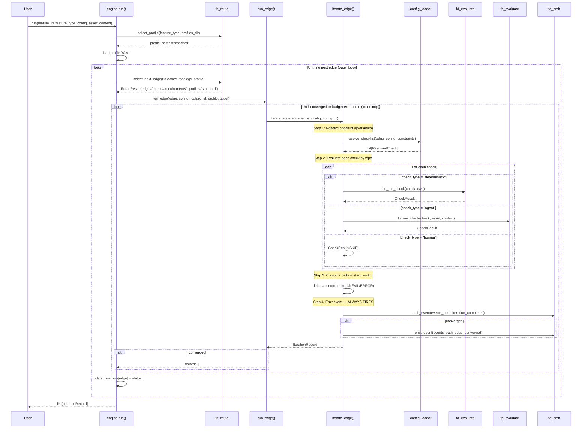

### Engine State Machine


### Three Processing Layers (Cost Model)

The spec (§4.6) defines three processing phases:

```
Reflex (F_D)    — templates, transforms, rules    → FREE (deterministic)
Affect (F_P)    — judgment, generation, evaluation → COSTLY (LLM calls)
Conscious (F_H) — decisions, approvals             → BLOCKING (human wait)
```

The engine already has the **full reflex layer** (route, emit, delta, subprocess, classify, sense). The cost question is how to structure the **affect layer's LLM calls** — per-check (Strategy B, 37 calls) vs per-edge (Strategy C, 4 calls) vs in-session (Strategy A, 1 session).

---

## 14. Spawn — Child Vectors `[IMPLEMENTED]` manual, `[STUB]` automatic

Spawning creates a child vector to investigate a sub-problem. Today this is **manual** via `/gen-spawn`. The engine does not call `run()` recursively.

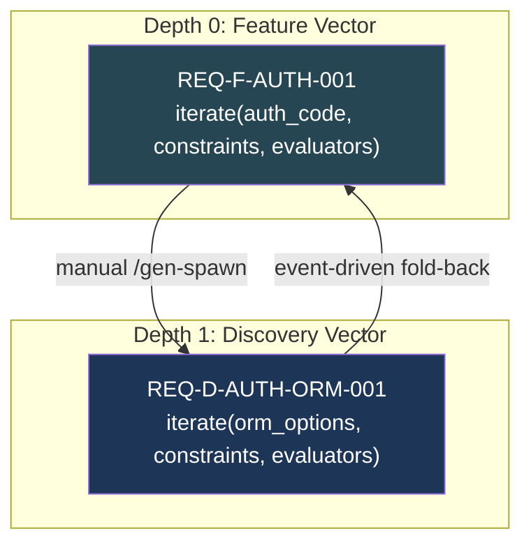

**What exists today**:
- `/gen-spawn` creates a child feature vector with its own trajectory
- Fold-back via events: child emits `spawn_folded_back`, parent reads from `events.jsonl`
- Spawn is event-driven and asynchronous — no engine code path

**What does not exist**:
- Engine calling `run()` recursively with child config
- Automatic depth tracking or zoom decay
- Programmatic fold-back of child artifacts into parent context

See Appendix D for the target architecture.

---

## 15. F_P Evaluate — LLM Integration `[IMPLEMENTED]`

`fp_evaluate.py` wraps the Claude Code CLI for agent-based evaluation:

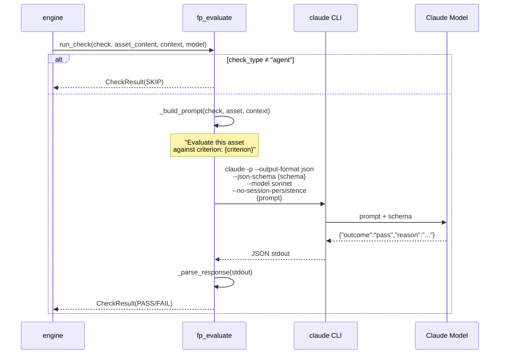

### Response Schema (JSON Schema)

```json
{
    "type": "object",
    "properties": {
        "outcome": {"type": "string", "enum": ["pass", "fail"]},
        "reason": {"type": "string"}
    },
    "required": ["outcome", "reason"]
}
```

**Key limitation**: Each agent check is a **separate `claude -p` subprocess** with no shared context. Check N does not know check N-1's result. This means 33 cold-start sessions per iteration for the standard profile.

> **Source**: `fp_evaluate.py` — `run_check()`, `_build_prompt()`, `_parse_response()`.

---

## 16. Data Flow — Complete Pipeline `[PARTIAL]`

This diagram shows how data flows through the entire system for one iteration. The construct phase (dashed) is **not implemented** in the engine.

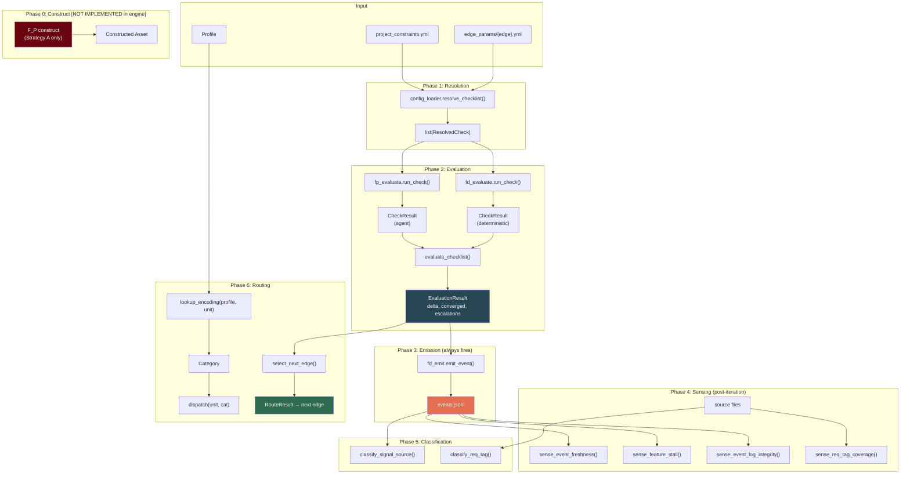

---

## 17. Test Architecture `[IMPLEMENTED]`

### Test Files

| File | Tests | What it covers |
|------|-------|------|
| `test_config_loader.py` | 16 | `resolve_variable`, `resolve_variables`, `resolve_checklist`, `load_yaml`, real config integration |
| `test_functor_fd.py` | 39 | Unit tests for all F_D modules: evaluate, emit, classify, sense, route, dispatch |
| `test_functor_e2e.py` | 50 | 6 end-to-end scenarios wiring the full pipeline |

### E2E Test Scenarios


---

## 18. Dependencies `[IMPLEMENTED]`

**stdlib only** (except PyYAML):

| Dependency | Used by | Purpose |
|---|---|---|
| `dataclasses` | `models.py` | Data model definitions |
| `enum` | `models.py` | Category, FunctionalUnit, CheckOutcome |
| `subprocess` | `fd_evaluate.py`, `fd_sense.py`, `fp_evaluate.py` | Shell command execution |
| `fcntl` | `fd_emit.py` | Advisory file locking for JSONL append |
| `json` | `fd_emit.py`, `fd_sense.py`, `fp_evaluate.py` | Event serialization/parsing |
| `re` | `config_loader.py`, `fd_classify.py`, `fd_sense.py` | Pattern matching |
| `yaml` (PyYAML) | `config_loader.py` | YAML parsing |
| `shutil` | `fp_evaluate.py` | `which()` to find claude CLI |

---

## 19. Process Model Decision: Synchronous Now, Actors Later `[IMPLEMENTED]`

The design docs (ADR-013, ADR-015, Design §1.11) describe an **actor model** with inbox staging, a single-writer serialiser, MCP sensory service, and observer agents. The current engine uses **synchronous direct function calls** instead.

**This is a deliberate decision, not a gap.**

| Concern | Actor Model | Current Model | Verdict |
|---|---|---|---|
| Correctness | Same | Same | Both produce identical results |
| Testability | Harder (async, inboxes) | Easy (direct calls, deterministic) | Current wins |
| Debuggability | Distributed tracing needed | Stack traces just work | Current wins |
| Multi-agent | Required | Not needed yet | Defer |
| Robustness | Crash recovery, stale claim detection | Process dies, restart | Defer |
| MCP sensory service | Long-running monitors | On-demand sense functions | Defer |

The actor model adds **robustness** (crash recovery, concurrent agent coordination, long-running monitors) but not **functionality**. Every functor, every η boundary, every event emission, every sense monitor is testable and exercised with the synchronous model.

**When to revisit**: when multi-agent coordination (ADR-013 claim protocol) or the sensory MCP server (ADR-015) become active implementation targets.

---

## 20. Traceability Matrix `[IMPLEMENTED]`

Every REQ key in scope maps to the modules that implement it and the ADRs that justify the design.

### REQ → Module Mapping

| REQ Key | Title | Primary Modules | Status |
|---------|-------|----------------|--------|
| REQ-GRAPH-001 | Asset Type Registry | `models.py` (FunctionalUnit, Category enums), profile YAMLs | `[IMPLEMENTED]` |
| REQ-GRAPH-002 | Admissible Transitions | `fd_route.py` (select_next_edge), `engine.py` (run), profile `graph.include/optional` | `[IMPLEMENTED]` |
| REQ-GRAPH-003 | Asset as Markov Object | `engine.py` (delta→convergence), `fd_evaluate.py` (deterministic state check) | `[IMPLEMENTED]` |
| REQ-ITER-001 | Universal Iteration Function | `engine.py` (iterate_edge, run_edge, run), `fp_evaluate.py` | `[PARTIAL]` — evaluate only, no construct |
| REQ-ITER-002 | Convergence and Promotion | `engine.py` (delta=0 detection), `fd_evaluate.py` (evaluate_checklist), `fd_route.py` (trajectory update) | `[IMPLEMENTED]` |
| REQ-ITER-003 | Functor Encoding Tracking | `models.py` (CATEGORY_FIXED), `dispatch.py` (DISPATCH table, lookup_and_dispatch), `fd_route.py` (lookup_encoding) | `[IMPLEMENTED]` |
| REQ-EVAL-002 | Evaluator Composition | `config_loader.py` (resolve_checklist), `fd_evaluate.py` (run_check), `fp_evaluate.py` (run_check), `engine.py` (check dispatch by type) | `[IMPLEMENTED]` |

### REQ → ADR Mapping

| REQ Key | ADRs | Design Decisions |
|---------|------|-----------------|
| REQ-GRAPH-001..003 | ADR-009 | Graph topology as YAML configuration |
| REQ-ITER-001..002 | ADR-008 | Universal iterate agent (single agent, edge-parameterised) |
| REQ-ITER-001 | ADR-014 | IntentEngine binding (configuration-only, no new code) |
| REQ-ITER-003 | ADR-017 | Functor-based execution model (runtime composition) |
| REQ-EVAL-002 | ADR-017 | Three-category dispatch (F_D/F_P/F_H) |
| All | ADR-016 | Design tolerances as optimization triggers |

---

## 21. ADR Index `[IMPLEMENTED]`

Architecture Decision Records for this feature, with cross-references.

| ADR | Title | Status | Key Decision | REQ Keys |
|-----|-------|--------|-------------|----------|
| [ADR-008](adrs/ADR-008-universal-iterate-agent.md) | Universal Iterate Agent | Accepted | Single agent, behaviour parameterised by edge config | REQ-ITER-001, REQ-ITER-002 |
| [ADR-009](adrs/ADR-009-graph-topology-as-configuration.md) | Graph Topology as Config | Accepted | YAML-based topology, not hard-coded | REQ-GRAPH-001, REQ-GRAPH-002, REQ-GRAPH-003 |
| [ADR-014](adrs/ADR-014-intentengine-binding.md) | IntentEngine Binding | Accepted | IntentEngine = iterate agent + edge config (no new code) | REQ-ITER-001 |
| [ADR-016](adrs/ADR-016-design-tolerances-as-optimization-triggers.md) | Design Tolerances | Accepted | Tolerance breach → optimization intent | REQ-EVAL-002 |
| [ADR-017](adrs/ADR-017-functor-based-execution-model.md) | Functor Execution Model | Accepted | Runtime functor composition via dispatch table | REQ-ITER-003, REQ-EVAL-002 |

### Related ADRs (referenced but owned by other features)

| ADR | Title | Relevance |
|-----|-------|-----------|
| [ADR-010](adrs/ADR-010-spec-reproducibility.md) | Spec Reproducibility | Context hash in EngineConfig |
| [ADR-011](adrs/ADR-011-consciousness-loop-at-every-observer.md) | Consciousness Loop | Intent raised at observer points |
| [ADR-013](adrs/ADR-013-multi-agent-coordination.md) | Multi-Agent Coordination | Deferred — sync model chosen (§19) |
| [ADR-015](adrs/ADR-015-sensory-service-technology-binding.md) | Sensory Service Tech Binding | Deferred — on-demand sense functions (§19) |

---

## 22. What's Not Implemented Yet

| Gap | Category | Status | Notes |
|---|---|---|---|
| **F_P Construct** | F_P | `[PLANNED]` | Engine cannot generate artifacts. See Appendix A. |
| **Batched F_P Evaluate** | F_P | `[PLANNED]` | 1 `claude -p` per check (33 cold starts). Target: 1 per edge. See Appendix A. |
| **Context accumulation** | Engine | `[PLANNED]` | Each LLM call is stateless. Target: edge N context feeds edge N+1. |
| **Algorithmic zoom** | F_D Route | `[FUTURE]` | Uses named profiles, not continuous zoom. See Appendix C. |
| **Recursive spawn** | Engine | `[FUTURE]` | Spawn is manual via `/gen-spawn`. See Appendix D. |
| F_P modules (classify, route, sense) | F_P | `[STUB]` | `fp_evaluate.py` exists for evaluate only |
| F_H modules (all) | F_H | `[STUB]` | Interactive prompts — future work |
| Automatic η dispatch | η | `[STUB]` | Escalation signals recorded but not auto-dispatched |
| CLI entry point | Infra | `[STUB]` | No `python -m genisis` yet |
| Feature constraint merging | Config | `[STUB]` | `feature.threshold_overrides` + `acceptance_criteria` not yet composed |
| Actor model / inbox / serialiser | Infra | `[FUTURE]` | ADR-013 — defer until multi-agent needed |
| MCP sensory service | Infra | `[FUTURE]` | ADR-015 — defer until long-running monitors needed |
| Observer agents (dev, CI/CD, ops) | Infra | `[FUTURE]` | Design §1.11 — defer until hooks pipeline built |

---

# Part II: Roadmap

Everything in Part II is aspirational. These are target architectures, not current state. Appendices are ordered by dependency: A → B → C → D.

---

## Appendix A: F_P Construct + Batched Evaluate `[PLANNED — next implementation target]`

### The Critical Unlock

The engine today is an **evaluator** but not a **builder**. It can check whether assets meet criteria, but it cannot generate the assets. This appendix describes Strategy C (Hybrid Engine) — the minimum change that makes the engine a builder.

### A.1: `fp_construct.py` — New Module

```python
# Target interface (not yet implemented)
def run_construct(
    edge: str,
    asset_content: str,
    context: str,
    edge_config: dict,
    model: str = "sonnet",
    timeout: int = 120,
) -> str:
    """Call claude -p to construct/modify an asset for the given edge.

    Returns the constructed artifact as a string.
    """
```

One `claude -p` call per edge that:
1. Receives: current asset + accumulated context + edge checklist criteria
2. Returns: structured JSON with constructed artifact + all agent evaluations
3. Engine validates output deterministically (parsing, format, traceability)

### A.2: Batched Construct + Evaluate

Instead of 33 separate `claude -p` calls for agent checks, **one call per edge** does both:

```
┌─────────────────────────────────────────────┐
│  claude -p (per edge)                       │
│                                             │
│  Input:                                     │
│    - Current asset                          │
│    - Context from previous edges            │
│    - All agent criteria for this edge       │
│                                             │
│  Output (structured JSON):                  │
│    - Constructed artifact                   │
│    - Agent evaluation results (per check)   │
└─────────────────────────────────────────────┘
```

**Projected cost**: 4 LLM calls per iteration (vs 37 current, vs 1 E2E session).

### A.3: Context Accumulation

Constructed artifacts from edge N become context for edge N+1:

```
Edge 1: intent→requirements  → requirements.md   (context for Edge 2)
Edge 2: requirements→design  → design.md + ADRs   (context for Edge 3)
Edge 3: design→code          → source code         (context for Edge 4)
Edge 4: code↔unit_tests      → test files          (final convergence)
```

### Prerequisites

- `fp_construct.py` module with `run_construct()` function
- JSON schema for combined construct+evaluate response
- Engine loop modification: call construct before evaluate
- Context threading between `run_edge()` calls

---

## Appendix B: RLM Execution Model `[FUTURE — target architecture]`

### The RLM Pattern

The Recursive Language Model (Zhang & Khattab, MIT 2025) solves "context rot" in LLMs by:
1. **Context as variable** — not in the prompt, explored programmatically
2. **REPL loop** — LLM writes code, code executes safely, output fed back
3. **Recursive decomposition** — sub-problems spawn child RLM instances
4. **Convergence via FINAL()** — explicit termination when answer is found

### Where RLM Maps Today

The RLM analogy is **accurate for Strategy A (E2E agent)**. One LLM session constructs and evaluates in a continuous context window — this IS a REPL loop.

The RLM analogy is **not accurate for Strategy B (engine)** today. The engine has no construct step, makes 37 cold-start LLM calls with no shared context, and cannot converge independently. It is an evaluation orchestrator, not a REPL loop.

**After Appendix A is implemented**, the RLM analogy becomes accurate for Strategy C (Hybrid) as well — one LLM call per edge that constructs + evaluates, with context accumulation between edges.

### RLM ↔ iterate() Mapping

| RLM Concept | iterate() Mapping | Strategy A | Strategy C |
|-------------|------------------|------------|------------|
| `context` variable | Project assets (code, specs, tests) | In LLM context | Passed per-edge |
| LLM writes code | F_P construct — agent generates/modifies assets | In-session | Per-edge call |
| REPL executes code | F_D evaluate — deterministic checks run against assets | In-session | Subprocess |
| REPL output fed back | Evaluation results (delta, escalations) inform next iteration | In-session | Engine loop |
| `FINAL("answer")` | Convergence — delta = 0, all required checks pass | In-session | Engine detects |
| `recursive_llm()` | Spawn — child vector at deeper scope | Manual today | See Appendix D |
| `max_iterations` | Iteration budget — stuck detection, time-box | Profile config | `max_iterations_per_edge` |

### Three-Layer Cost Model

RLM uses a two-model strategy (expensive + cheap). The functor framework generalises this to three layers:

| Layer | RLM Equivalent | Cost | When Used |
|-------|---------------|------|-----------|
| F_D (deterministic) | REPL execution | Free | Every iteration |
| F_P (agent) | LLM call | $$$ | Construct + judgment tasks |
| F_H (human) | N/A in RLM | Blocking | When F_P fails (η escalation) |

The three-layer model means **most evaluation is free** (F_D runs tests, lints, schemas). LLM calls happen for construction and semantic judgment (F_P). Human reviews happen when the agent can't resolve (F_H).

### Prerequisites

- Appendix A complete (engine can construct)
- At least one edge functional in hybrid mode (Strategy C)

---

## Appendix C: Algorithmic Zoom `[FUTURE — requires Appendix A]`

### Vision

Instead of selecting named profiles, use a **continuous zoom parameter** [0.0, 1.0] that determines graph subset, evaluator density, iteration budget, and recursion depth. Named profiles become discrete anchor points on this continuous space.

### Zoom as Continuous Parameterisation

```yaml
zoom:
  graph_subset: [0.0, 1.0]      # 0.0 = minimal edges, 1.0 = all edges
  evaluator_density: [0.0, 1.0] # 0.0 = agent-only, 1.0 = all types
  context_density: [0.0, 1.0]   # 0.0 = minimal context, 1.0 = full context
  iteration_budget: [1, ∞]       # max iterations per edge
  recursion_depth: [0, 5]        # max spawn depth
```

### Named Profiles as Anchor Points

Profiles stay as named presets — zoom adds the ability to select intermediate values:

| Profile | Equivalent Zoom | Characteristic |
|---------|----------------|----------------|
| minimal | ≈ 0.1 | 2 edges, 10-min time-box |
| hotfix | ≈ 0.15 | 3 edges, 4-hour time-box, F_D route |
| spike | ≈ 0.2 | 3 edges, 1-week time-box, F_P evaluate |
| poc | ≈ 0.3 | 3 edges, 3-week time-box, F_P evaluate |
| standard | ≈ 0.5 | 4-7 edges, per-sprint |
| full | ≈ 1.0 | All edges, unlimited |

### Zoom Selection

Zoom is driven by **existing data** — not arbitrary thresholds:

- `events.jsonl` — iteration history, delta trends
- `fd_sense` monitors — stall detection, freshness, coverage
- Feature trajectory — which edges converged, which are stuck
- Project constraints — time-box, risk level

### Why This Requires Appendix A

Zoom parameterises the encoding (which units are F_D vs F_P). This only matters when the engine **does something different** based on encoding — specifically, when it can construct (F_P) at some zoom levels and skip construction (F_D template) at others. Without construct, zoom only affects which edges are traversed, which profiles already handle.

### Prerequisites

- Appendix A complete (engine can construct)
- At least one edge functional in hybrid mode
- `RouteResult` extended with `zoom: float` field
- `compute_encoding(zoom)` function replacing profile lookup

---

## Appendix D: Recursive Spawn `[FUTURE — requires Appendix A + C]`

### Vision

When the engine detects a stall (same delta for N iterations), it spawns a child vector at reduced scope to investigate the sub-problem. The child's findings fold back as context for the parent.

### What Exists Today

- `/gen-spawn` creates child vector (manual command)
- Child vector has its own feature trajectory
- Fold-back via events: child emits `spawn_folded_back`, parent reads `events.jsonl`
- No engine code path for automatic spawning

### Target: Automatic Recursive Spawn

```python
# Target interface (not yet implemented)
def spawn(
    sub_feature_id: str,
    sub_context: str,
    parent_config: EngineConfig,
    current_depth: int,
) -> list[IterationRecord]:
    """Spawn child vector at depth+1 with reduced scope."""
    child_zoom = base_zoom * (0.7 ** (current_depth + 1))
    child_config = derive_config(parent_config, child_zoom)
    return run(sub_feature_id, child_config, sub_context, depth=current_depth + 1)
```

### Zoom Decay at Depth

Each recursion level reduces effective scope — deeper investigations are inherently lighter:

| Depth | Base Zoom 0.7 | Effective Zoom | Approximate Profile |
|-------|---------------|---------------|---------------------|
| 0 | 0.70 | 0.70 | standard+ |
| 1 | 0.70 | 0.49 | ~standard |
| 2 | 0.70 | 0.34 | ~poc |
| 3 | 0.70 | 0.24 | ~spike |

### Fold-Back

Child's constructed artifacts become parent context:
1. Child runs at reduced scope, investigates sub-problem
2. Child converges, emits `spawn_folded_back` event with findings
3. Parent reads child's artifacts, adds to context
4. Parent resumes iteration with enriched context

### Prerequisites

- Appendix A complete (engine can construct — required for child to produce anything)
- Appendix C complete (zoom parameterisation — required for zoom decay at depth)
- Engine `run()` accepting `depth` parameter
- Max depth guard to prevent infinite recursion

---

## Appendix E: Boundary Use Cases

These scenarios stress-test the design at the boundaries where technical choices become visible to the user. Each shows: what the user does, what they see, and how each phase changes the experience.

### UC-1: New Developer, First Feature (Happy Path)

**User does**: `genesis start` on a fresh project.

**Today (Strategy A — E2E agent)**:
```
State: UNINITIALISED
> Project name? my-auth-service (detected)
> Language? Python 3.12 (detected)
> Intent? "Build OAuth2 authentication service"

State: IN_PROGRESS
Feature: REQ-F-AUTH-001 on intent→requirements (iteration 1)
[Agent generates requirements, evaluates, emits event]
[Routes to requirements→design, generates ADRs, evaluates, emits]
[Routes to design→code, generates code with REQ tags, evaluates, emits]
[Routes to code↔unit_tests, generates tests, runs pytest, iterates until green]

State: ALL_CONVERGED ✓
```
Time: ~10 min. Cost: ~$3. Works today.

**Today (Strategy B — Engine)**: **Cannot do this.** Engine has no construct step. All agent checks SKIP or ERROR. The engine declares convergence on empty assets.

**After Appendix A (Strategy C — Hybrid)**:
```
Edge 1/4: intent→requirements [claude -p: 18s] ✓ delta=0
Edge 2/4: requirements→design [claude -p: 22s] ✓ delta=0
Edge 3/4: design→code [claude -p: 25s] ✓ delta=0
Edge 4/4: code↔unit_tests [claude -p: 15s] → δ=2 → [fix: 12s] → δ=0 ✓
Total: 92s, 5 LLM calls, $0.60
```

**Impact**: Appendix A is required for the engine to be useful for new projects.

### UC-2: Hotfix at 2am (Time Pressure)

**User does**: `genesis start --feature REQ-F-HOTFIX-042 --profile hotfix`

**Today**: Profile selects 3 edges, F_D routing, 4-hour time-box. Works.

**After Appendix C (Zoom)**: User could say `--zoom 0.15` instead of `--profile hotfix`. Mid-flight, if the fix is more complex, increase zoom to 0.5 without creating a new feature.

**Impact**: Zoom adds mid-flight flexibility. Profiles already work. Zoom is a convenience.

### UC-3: Stuck Feature — Delta Unchanged 4 Iterations (Escalation)

**User does**: Feature won't converge after repeated iterations.

**Today (E2E agent)**: Agent tries fixes, fails. After 4 iterations with same delta, reports STUCK. User manually spawns discovery vector via `/gen-spawn`.

**Today (Engine)**: Engine detects stall via `sense_feature_stall()`, emits η escalation signals. But engine can't construct a fix and can't spawn automatically.

**After Appendix A + D**: Engine constructs fix attempts. After 3 identical deltas, spawns child at reduced scope automatically. Child investigates, folds back context. Parent resumes.

**Impact**: Appendix A (construct) enables auto-fix. Appendix D (spawn) enables recursive decomposition.

### UC-4: Resume After Context Loss (Monday Morning)

**User does**: `genesis status` then `genesis start`.

**Today**: Works identically for both strategies. Status reads `events.jsonl`, reconstructs trajectory. Start detects IN_PROGRESS, selects closest-to-complete feature.

**Impact**: Minimal — resume doesn't change with any appendix.

### UC-5: Autopilot Full Build (Unattended)

**User does**: `genesis start --auto --feature REQ-F-DATAMAP-001` and walks away.

**Today (E2E agent)**: One `claude -p` session, ~10 min, ~$3-5. Works.

**Today (Engine)**: Cannot do this (no construct).

**After Appendix A (Hybrid)**: 4 LLM calls, ~92s, ~$0.60. Fully testable, observable.

**Impact**: Appendix A makes autopilot viable in the engine. Strongest argument for prioritising it.

### UC-6: Spike That Needs to Become a Feature (Scope Change)

**User does**: Creates a spike, investigates, realises it should be a full feature.

**Today**: Must create a new feature vector, manually copy findings, re-traverse with standard profile.

**After Appendix C (Zoom)**: Change zoom from 0.2 to 0.5 — new edges activate, existing converged edges preserved.

**After Appendix D (Spawn)**: Spike folds back to parent automatically.

**Impact**: Appendix C enables smooth scope changes. Appendix D enables automatic knowledge transfer.

### UC-7: Multi-Feature Workspace (Two Features, Different Profiles)

**User does**: Two features active simultaneously — one standard, one spike.

**Today**: Works. Each feature has its own trajectory and profile. `genesis start` selects by priority (closest-to-complete).

**Impact**: Minimal change — multi-feature already works.

### UC-8: Human Review Gate (Design Approval)

**User does**: Feature reaches a human gate (requirements→design requires approval).

**Today (E2E agent)**: Agent constructs design candidate, presents for review with checklist.

**Today (Engine)**: Engine can't construct the candidate — nothing to review.

**After Appendix A**: Engine constructs the design, then presents it for human review with full checklist status.

**Impact**: Appendix A is required for the engine to support human review gates meaningfully.

### Summary: Which Appendices Matter for Which User Journeys

| Use Case | Today | Appendix A | Appendix C | Appendix D |
|----------|-------|------------|------------|------------|
| UC-1 New feature | E2E only | **Engine viable** | — | — |
| UC-2 Hotfix | Works | — | Mid-flight flex | — |
| UC-3 Stuck | Manual | **Auto-fix** | — | **Auto-spawn** |
| UC-4 Resume | Works | — | — | — |
| UC-5 Autopilot | E2E only | **Engine viable, cheaper** | — | — |
| UC-6 Scope change | Manual | — | **Smooth transition** | **Auto fold-back** |
| UC-7 Multi-feature | Works | — | — | — |
| UC-8 Human review | E2E only | **Engine can construct** | — | — |

**Appendix A** (F_P construct) is the **critical unlock** — it makes the engine a viable builder.
**Appendix C** (zoom) is a **convenience upgrade** — mid-flight scope changes.
**Appendix D** (spawn) is **automation** — recursive decomposition.
