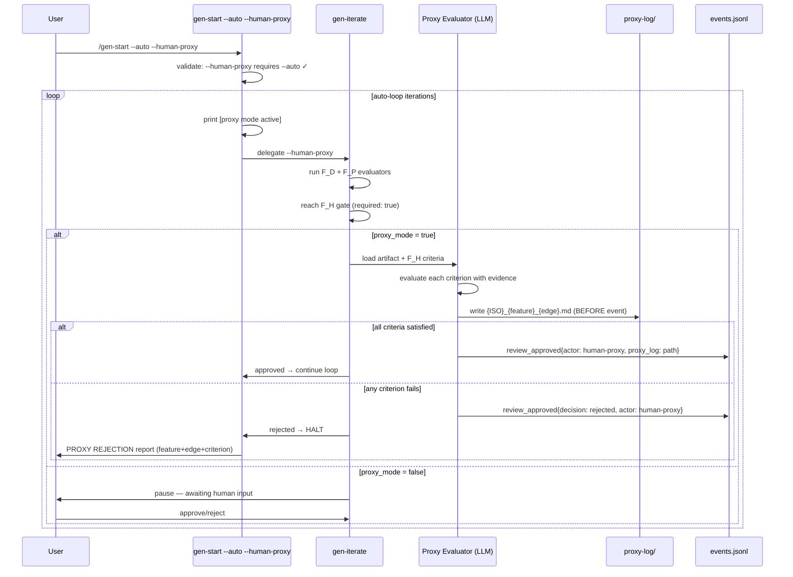
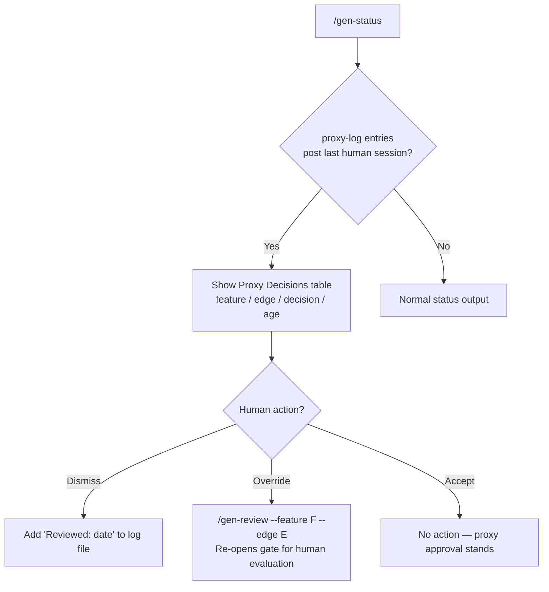

# Design — REQ-F-PROXY-001: Human Proxy Mode

**Version**: 0.1.0
**Date**: 2026-03-13
**Status**: Candidate — awaiting human approval
**Traces To**: INT-AISDLC-001
**Implements**: REQ-F-HPRX-001, REQ-F-HPRX-002, REQ-F-HPRX-003, REQ-F-HPRX-004,
               REQ-F-HPRX-005, REQ-F-HPRX-006, REQ-NFR-HPRX-001, REQ-NFR-HPRX-002,
               REQ-BR-HPRX-001, REQ-BR-HPRX-002
**Parent Feature**: REQ-F-DISPATCH-001

---

## Overview

Human Proxy Mode is a **behavioural overlay** on the existing auto-loop. It does not
replace the F_H gate infrastructure — it substitutes the _timing_ of human evaluation.
Instead of pausing the loop at each F_H gate for synchronous terminal input, the LLM
evaluates the artifact against the F_H criteria, records its reasoning, emits the
appropriate event, and continues. The human reviews the log entries asynchronously.

**Scope**: Three command source files + one new directory + event schema extension.
No changes to edge configurations, graph topology, or evaluator definitions.

---

## Architecture Decision: Where Does Proxy Logic Live?

**Decision**: Proxy logic lives entirely in the LLM command layer (`gen-iterate.md`,
`gen-start.md`, `gen-status.md`). The Python engine is unaffected.

**Rationale**: The proxy substitutes _human judgment_ (F_H), not deterministic evaluation
(F_D). F_H evaluation is already the LLM layer's responsibility — it reads the artifact,
applies human-readable criteria, and prompts the operator for input. Proxy mode replaces
"prompt operator" with "evaluate autonomously and log". The engine never participates
in F_H evaluation; the command layer owns it entirely.

**Source of truth for command files**:
`imp_claude/code/.claude-plugin/plugins/genesis/commands/`
All modifications go to source files. The installer (`gen-setup.py`) redeploys to target
projects. Never edit installed copies in `.claude/commands/`.

---

## Architecture Diagram





---

## Component 1: `--human-proxy` Flag (REQ-F-HPRX-001, REQ-BR-HPRX-002)

### Location: `gen-start.md` — Usage table and Step 9

**Flag definition** (add to Usage table):

```markdown
| `--human-proxy` | Activate LLM proxy evaluation at F_H gates. Only valid with `--auto`. |
```

**Validation** (add to Step 9 preamble, before the auto-loop):

```
if --human-proxy and not --auto:
    error: "--human-proxy requires --auto"
    exit

if --human-proxy:
    print("[proxy mode active]")
```

**Per-iteration banner** (inside the auto-loop, before feature/edge selection):

```
if proxy_mode:
    print("[proxy mode active]")
```

**Flag propagation**: Pass `proxy_mode=true` as a parameter when delegating to
`/gen-iterate`. The flag is never read from workspace state, config files, or
environment variables — it is a per-invocation parameter only (REQ-BR-HPRX-002).

### Location: `gen-iterate.md` — Usage table

```markdown
| `--human-proxy` | Fulfil F_H gates by proxy evaluation. Only valid in auto-mode context. |
```

---

## Component 2: Proxy Evaluation at F_H Gates (REQ-F-HPRX-002)

### Location: `gen-iterate.md` — Step 4 (Process Results), subsection "Human evaluator required"

The existing Step 4 contains:
```
2. If human evaluator required:
   - Present the candidate for review
   - Record approval/rejection/feedback
```

**Replace with** (conditional on `--human-proxy`):

```
2. If human evaluator required:

   if proxy_mode:
       # F_H Proxy Evaluation path
       → Execute Component 3 (Proxy Evaluation & Logging)
       → If proxy decision = approved: mark F_H checks passed, continue loop
       → If proxy decision = rejected: halt loop (see Component 5)

   else:
       # Standard F_H path (unchanged)
       - Present the candidate for review
       - Record approval/rejection/feedback
```

### Proxy Evaluation Protocol (REQ-F-HPRX-002)

When the proxy evaluates an F_H gate, the LLM must:

1. **Load the artifact** (the candidate asset produced in this iteration)

2. **Load the F_H criteria** (all `type: human` checks from the edge checklist with `required: true`)

3. **For each F_H criterion**, evaluate:
   ```
   Criterion: "{criterion text}"
   Evidence:  "{specific quote or observation from the artifact that addresses this criterion}"
   Satisfied: yes | no
   Reasoning: "{why this evidence does or does not satisfy the criterion}"
   ```

4. **Compute overall decision**:
   - `approved` — every required F_H criterion is satisfied
   - `rejected` — any required F_H criterion is not satisfied

5. **No extra standards**: the proxy evaluates only the defined F_H criteria. It does not
   introduce additional quality checks, style preferences, or domain conventions not
   present in the edge checklist.

---

## Component 3: Proxy Decision Logging (REQ-F-HPRX-003, REQ-NFR-HPRX-001)

### File path

```
.ai-workspace/reviews/proxy-log/{ISO-timestamp}_{feature-id}_{edge-slug}.md
```

Where `{edge-slug}` is the edge name with `→` replaced by `-to-` (e.g., `intent-to-requirements`).

Example: `.ai-workspace/reviews/proxy-log/2026-03-13T09:30:00Z_REQ-F-AUTH-001_requirements-to-design.md`

### Directory creation

If `.ai-workspace/reviews/proxy-log/` does not exist, create it before writing the first log file.

### Log file format

```markdown
# Proxy Decision Log

**Feature**: {feature-id}
**Edge**: {source}→{target}
**Iteration**: {n}
**Timestamp**: {ISO 8601}
**Decision**: approved | rejected | incomplete

---

## Artifact Evaluated

**Path**: {path to candidate asset}
**Content hash**: sha256:{hash}

---

## F_H Criteria Evaluation

### {criterion name}

**Criterion**: {full criterion text from edge checklist}

**Evidence**:
> {specific quote or observation from the artifact}

**Satisfied**: yes | no

**Reasoning**: {why}

---
(repeat for each F_H criterion)

---

## Overall Decision

**Decision**: approved | rejected
**Summary**: {2-3 sentence plain-language summary of the evaluation}

---

## Override Instructions

To override this proxy decision:
  /gen-review --feature {feature-id} --edge "{source}→{target}"
```

### Incomplete log entries (REQ-NFR-HPRX-001)

If the session is interrupted mid-evaluation:
- Write the partial log with `**Decision**: incomplete`
- Include whatever criteria evaluations were completed
- Do not emit a `review_approved` event for incomplete entries

On next session start with `--human-proxy`, scan for `incomplete` entries in
`.ai-workspace/reviews/proxy-log/` and report them before the loop begins:

```
⚠ Incomplete proxy decisions from prior session:
  .ai-workspace/reviews/proxy-log/2026-03-13T08:00:00Z_REQ-F-AUTH-001_intent-to-requirements.md
  Resolve manually (/gen-review) or re-run this edge.
```

---

## Component 4: Proxy Event Emission (REQ-F-HPRX-004, REQ-NFR-HPRX-002)

### Event schema extension

The `review_approved` event gains two new optional fields:

```json
{
  "event_type": "review_approved",
  "timestamp": "{ISO 8601}",
  "project": "{project name}",
  "data": {
    "feature": "{id}",
    "edge": "{source}→{target}",
    "decision": "approved | rejected",
    "actor": "human | human-proxy",
    "reasoning": "{summary text — present only when actor = human-proxy}",
    "proxy_log": "{relative path to log file — present only when actor = human-proxy}"
  }
}
```

**Invariants** (REQ-NFR-HPRX-002):
- `actor` is always present on all new `review_approved` events
- `actor` is always either `"human"` or `"human-proxy"` — never null, never absent
- Existing events without `actor` are treated as `actor: "human"` (backward compatibility)
- The `proxy_log` path must point to a file that exists at event emission time

**Emission order** (REQ-F-HPRX-003):
1. Write the proxy log file to disk
2. Emit `review_approved` event (which references the log file)
3. Never emit `review_approved` without a corresponding log file

---

## Component 5: Loop Continuation / Rejection Halt (REQ-F-HPRX-005, REQ-BR-HPRX-001)

### On proxy approval

```
- Mark all F_H checks for this gate as passed
- Emit review_approved{actor: "human-proxy", ...}
- Continue auto-loop normally (same path as human approval)
```

### On proxy rejection

```
- Emit review_approved{decision: "rejected", actor: "human-proxy", ...}
- Halt auto-loop with:

  ╔═══════════════════════════════════════════════════════╗
  ║ PROXY REJECTION — Auto-mode paused                    ║
  ╠═══════════════════════════════════════════════════════╣
  ║ Feature:   {feature-id}                               ║
  ║ Edge:      {source}→{target}                          ║
  ║ Criterion: {failing criterion name}                   ║
  ║ Reason:    {proxy reasoning}                          ║
  ║                                                       ║
  ║ Log:       {path to proxy-log file}                   ║
  ║                                                       ║
  ║ To resolve:                                           ║
  ║   1. Review the log file                              ║
  ║   2. Revise the artifact                              ║
  ║   3. Re-run: /gen-start --auto --human-proxy          ║
  ╚═══════════════════════════════════════════════════════╝

- Feature remains in `iterating` status at the failed edge
- Feature vector trajectory unchanged (the rejection is recorded in events, not as a state change)
```

**Self-correction prohibition** (REQ-BR-HPRX-001):
- After a rejection on edge E for feature F, track the pair (F, E) as `rejected_in_session`
- If the auto-loop attempts to re-invoke iterate on a pair in `rejected_in_session`, halt
  immediately with the same rejection message — do not re-evaluate
- Other features in the session are unaffected
- `rejected_in_session` is transient — exists only for the current invocation

**Session tracking** (in-memory, not persisted):
```
rejected_in_session: Set[Tuple[feature_id, edge]] = set()
```

---

## Component 6: Morning Review in `/gen-status` (REQ-F-HPRX-006)

### Location: `gen-status.md` — Default View section

Add a **Proxy Decisions** section to the default `/gen-status` output, displayed when
proxy-log entries exist that post-date the last attended session.

**Detection**: "last attended session" is defined as the timestamp of the last
`review_approved{actor: "human"}` event in `events.jsonl`. Proxy-log entries with a
file timestamp after that event are "pending morning review".

**Display**:

```
Proxy Decisions (pending morning review):
  3 decisions made since last attended session (2026-03-13T08:00:00Z)

  ┌──────────────────────┬──────────────────────────────────┬──────────┬──────┐
  │ Feature              │ Edge                             │ Decision │ Age  │
  ├──────────────────────┼──────────────────────────────────┼──────────┼──────┤
  │ REQ-F-AUTH-001       │ intent→requirements              │ approved │ 4h   │
  │ REQ-F-AUTH-001       │ requirements→design              │ approved │ 3h   │
  │ REQ-F-DB-001         │ intent→requirements              │ approved │ 2h   │
  └──────────────────────┴──────────────────────────────────┴──────────┴──────┘

  To review: cat .ai-workspace/reviews/proxy-log/{filename}.md
  To override: /gen-review --feature {id} --edge "{edge}"
  To dismiss: mark as reviewed in the log file (add "Reviewed: {date}" line)
```

**Counts** (REQ-NFR-HPRX-002): `/gen-status` counts proxy approvals and human approvals
separately in its convergence report:
```
  Approvals: 5 human, 3 proxy
```

**Dismiss**: The human can dismiss a proxy decision from the review queue by adding a
`Reviewed: {ISO-date}` line to the log file. `/gen-status` excludes dismissed entries
from the "pending morning review" count.

**Override**: `/gen-review --feature {id} --edge "{edge}"` re-opens the gate for human
evaluation. If the human rejects at this point, the feature reverts to `iterating` on
that edge (the proxy approval is superseded).

---

## Component 7: `actor` Field on Existing Human Events

**Location**: `gen-iterate.md` — Step 4a (Emit Events), `review_approved` schema

Update the `review_approved` event template to include `actor: "human"` explicitly
for all human-evaluated gates:

```json
{
  "event_type": "review_approved",
  "data": {
    "feature": "...",
    "edge": "...",
    "decision": "approved",
    "actor": "human"
  }
}
```

This ensures all new events have the `actor` field regardless of proxy mode, satisfying
REQ-NFR-HPRX-002's invariant that the field is always present.

---

## Modification Summary

| File | Change | REQ Keys |
|------|--------|----------|
| `gen-start.md` | Add `--human-proxy` to Usage; flag validation; `[proxy mode active]` banner; pass flag to gen-iterate | REQ-F-HPRX-001, REQ-BR-HPRX-002 |
| `gen-iterate.md` | Add `--human-proxy` to Usage; proxy evaluation branch in Step 4; emit proxy events; rejection halt logic; session tracking | REQ-F-HPRX-002..005, REQ-BR-HPRX-001 |
| `gen-status.md` | Add Proxy Decisions section; approval counts split by actor | REQ-F-HPRX-006, REQ-NFR-HPRX-002 |
| `events.jsonl` schema | `review_approved` gains `actor`, `reasoning`, `proxy_log` fields; `actor` always present | REQ-F-HPRX-004, REQ-NFR-HPRX-002 |
| `.ai-workspace/reviews/proxy-log/` | New directory; one `.md` per proxy decision | REQ-F-HPRX-003, REQ-NFR-HPRX-001 |

**No changes to**: edge configurations, graph topology, evaluator definitions, Python engine, other commands.

---

## Test Contract (for code→unit_tests edge)

| Test | REQ Key | What to verify |
|------|---------|----------------|
| `--human-proxy` without `--auto` produces error | REQ-F-HPRX-001 | Error message matches spec |
| `[proxy mode active]` appears per iteration | REQ-F-HPRX-001 | Terminal output |
| Proxy evaluates all F_H criteria per gate | REQ-F-HPRX-002 | Each criterion has evidence + satisfied + reasoning |
| Proxy only evaluates defined criteria | REQ-F-HPRX-002 | No extra standards introduced |
| Log file written before event emitted | REQ-F-HPRX-003 | File timestamp ≤ event timestamp |
| Log file path follows naming convention | REQ-F-HPRX-003 | `{ISO}_{feature}_{edge-slug}.md` |
| Proxy-log directory auto-created | REQ-F-HPRX-003 | No error if directory absent |
| `review_approved` has `actor: "human-proxy"` | REQ-F-HPRX-004 | Field value |
| `proxy_log` field points to existing file | REQ-F-HPRX-004 | Path resolves |
| Proxy approval continues loop | REQ-F-HPRX-005 | Next iteration or edge starts |
| Proxy rejection halts loop with message | REQ-F-HPRX-005 | Loop stops; message contains feature+edge+criterion |
| Proxy does not self-correct after rejection | REQ-BR-HPRX-001 | Second invocation on same F+E halts immediately |
| Feature stays in `iterating` after rejection | REQ-F-HPRX-005 | Feature vector unchanged |
| `--auto` without `--human-proxy` still pauses at F_H | REQ-BR-HPRX-002 | Standard path unchanged |
| gen-status shows pending proxy decisions | REQ-F-HPRX-006 | Table displayed with correct entries |
| Incomplete log entry on interrupted session | REQ-NFR-HPRX-001 | `Decision: incomplete` in log |
| Incomplete entries reported on next `--human-proxy` start | REQ-NFR-HPRX-001 | Warning displayed |
| `actor` always present on new `review_approved` events | REQ-NFR-HPRX-002 | Schema invariant |
| Absent `actor` on old events treated as `"human"` | REQ-NFR-HPRX-002 | Backward compatibility |
