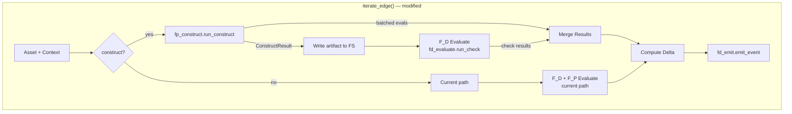
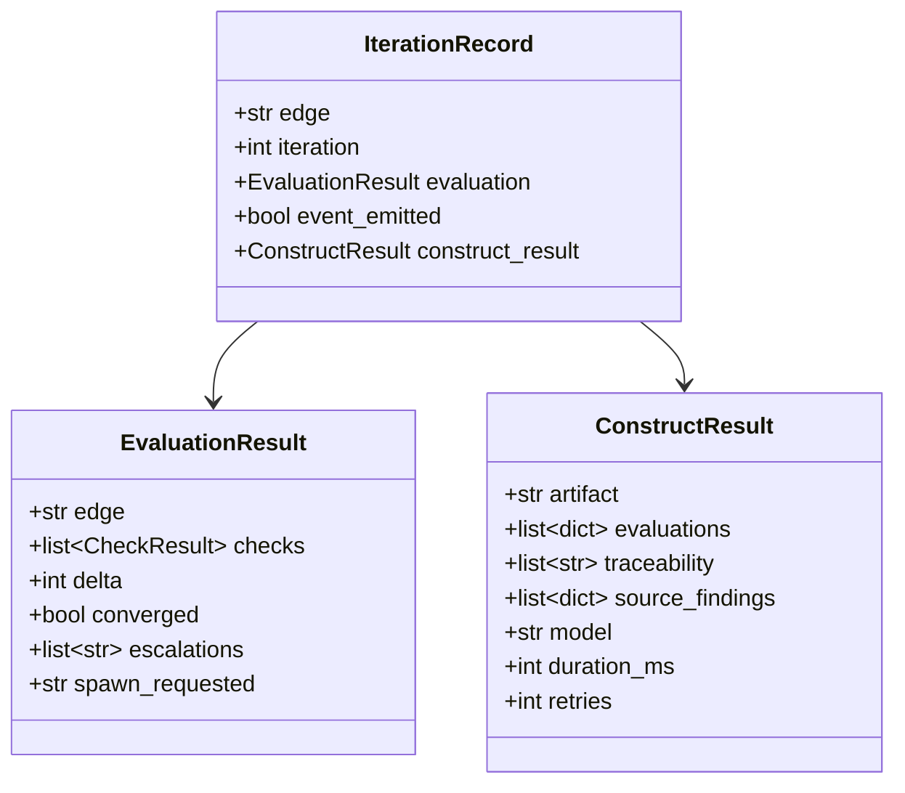

# ADR-020: F_P Construct & Batched Evaluate

**Status**: Proposed
**Date**: 2026-02-27
**Deciders**: Methodology Author
**Requirements**: REQ-ITER-001, REQ-ITER-003, REQ-EVAL-002, REQ-F-FPC-001 through REQ-F-FPC-006
**Extends**: ADR-019 (Orthogonal Projection Reliability), ADR-008 (Universal Iterate Agent)

---

## Context

The engine (Strategy B) evaluates but cannot construct. `iterate_edge()` resolves checklists, dispatches checks (F_D subprocess, F_P `claude -p`, F_H skip), computes delta, and emits events. It never generates artifacts.

This means the engine cannot drive a feature from intent to convergence. It can validate code somebody else wrote, but it can't write the code. Today, only Strategy A (E2E agent session) can build. Strategy C (cross-validating hybrid, ADR-019) requires the engine to construct before evaluating.

### Current Cost Problem

The engine's `fp_evaluate.py` makes one `claude -p` call per agent check. For a typical edge with 12 agent checks, that's 12 cold-start LLM sessions with no shared context. A full 4-edge traversal generates ~33 separate LLM calls — more expensive and slower than the E2E agent's single session.

### The Gap

| Capability | Strategy A (E2E) | Strategy B (Engine) | Strategy C (Hybrid) |
|-----------|-----------------|--------------------|--------------------|
| Construct | LLM in-session | **MISSING** | F_P construct per edge |
| Evaluate F_D | LLM follows instructions | Subprocess | Subprocess |
| Evaluate F_P | LLM in-session | Per-check `claude -p` | **Batched** per edge |
| Events | Level 1 (instruction) | Level 4 (deterministic) | Level 4 |
| LLM calls / traversal | 1 session | ~33 calls | **4 calls** |

---

## Decision

**Add `fp_construct.py` as a new module that calls `claude -p` once per edge to construct the artifact and batch-evaluate all agent checks in a single response. Modify `iterate_edge()` to support an optional construct phase before evaluation. The existing evaluate-only path remains the default (backward compatible).**

### Alternatives Considered

1. **Anthropic API directly** — Use the Python SDK instead of `claude -p`. Rejected: would add an authentication dependency and diverge from the existing CLI pattern. The CLI handles auth, model selection, and session management.

2. **Multi-turn conversation** — Use `claude --resume` for context continuity across edges. Rejected: adds session state management complexity. One-shot per edge is simpler, testable, and sufficient when context is passed explicitly.

3. **In-process LLM** — Import an LLM library directly into the engine. Rejected: the engine's value is deterministic orchestration. Embedding an LLM breaks the F_D/F_P separation.

### Consequences

**Positive**:
- Engine becomes a builder (Strategy C functional)
- 4 LLM calls per traversal (vs 33) — ~8x cost reduction
- Cross-validation with ADR-019 protocol becomes operational
- Each edge gets warm context (prior artifacts passed explicitly)

**Negative**:
- New module (`fp_construct.py`) adds ~150 LOC
- `iterate_edge()` gains complexity (construct path)
- JSON schema for combined response must be maintained
- Cannot run construct from inside a live Claude Code session (nested session limitation)

---

## Design

### Architecture Overview



### Component Design

#### Component: fp_construct

**Implements**: REQ-F-FPC-001, REQ-F-FPC-002, REQ-F-FPC-006

**Responsibilities**:
- Build structured prompt from edge config + asset + context
- Call `claude -p` with JSON schema for combined construct+evaluate response
- Parse response, validate schema, handle retries
- Return `ConstructResult` dataclass

**Interfaces**:
- `run_construct(edge, asset_content, context, edge_config, constraints, model, timeout) -> ConstructResult`
- Uses `claude -p --output-format json --json-schema {schema}` (same pattern as `fp_evaluate`)

**Dependencies**:
- `claude` CLI on PATH
- `models.ConstructResult` (new dataclass)
- Edge config YAML for criteria

#### Component: engine (modified)

**Implements**: REQ-F-FPC-004, REQ-BR-FPC-001

**Responsibilities** (additions):
- Accept `construct` parameter in `iterate_edge()`
- Call `fp_construct.run_construct()` before evaluation when enabled
- Write constructed artifact to filesystem
- Merge batched F_P results with F_D results
- Thread context between edges in `run()` and `run_edge()`

**Interfaces** (changes):
- `iterate_edge(..., construct=False, output_path=None)` — new optional params
- `run_edge(..., construct=False)` — passes through
- `run(..., construct=False)` — passes through, threads context

#### Component: __main__.py (modified)

**Implements**: REQ-F-FPC-005

**Responsibilities** (additions):
- New `construct` subcommand
- `--construct` flag on `run-edge`
- `--output` flag for artifact write path

#### Component: models (modified)

**Implements**: REQ-DATA-FPC-001

**Responsibilities** (additions):
- `ConstructResult` dataclass
- Updated `IterationRecord` to include construct result

### Data Model



### JSON Schema for Construct Response

```json
{
  "type": "object",
  "properties": {
    "artifact": {
      "type": "string",
      "description": "The constructed or modified asset content"
    },
    "evaluations": {
      "type": "array",
      "items": {
        "type": "object",
        "properties": {
          "check_name": {"type": "string"},
          "outcome": {"type": "string", "enum": ["pass", "fail"]},
          "reason": {"type": "string"}
        },
        "required": ["check_name", "outcome", "reason"]
      },
      "description": "Self-evaluation against all agent criteria"
    },
    "traceability": {
      "type": "array",
      "items": {"type": "string"},
      "description": "REQ keys implemented/validated in the artifact"
    },
    "source_findings": {
      "type": "array",
      "items": {
        "type": "object",
        "properties": {
          "description": {"type": "string"},
          "classification": {"type": "string"}
        },
        "required": ["description", "classification"]
      },
      "description": "Issues found in source asset during construction"
    }
  },
  "required": ["artifact", "evaluations", "traceability"]
}
```

### Prompt Structure

```
You are a software construction agent in the Genesis methodology.

TASK: Construct an artifact for the [{edge_name}] edge.

EDGE CRITERIA (evaluate your output against ALL of these):
{for each agent check in checklist:}
  - {check.name}: {check.criterion}

CURRENT ASSET:
{asset_content or "(empty — generate from scratch)"}

CONTEXT FROM PRIOR EDGES:
{accumulated_context}

PROJECT CONSTRAINTS:
{relevant constraint dimensions}

INSTRUCTIONS:
1. Construct the artifact that satisfies the edge criteria
2. Self-evaluate against EVERY criterion listed above
3. Tag the artifact with REQ keys (Implements: REQ-*)
4. Report any issues found in the source material

Respond as JSON matching the provided schema.
```

### Context Accumulation

In `run()`, after each `run_edge()` converges:

```python
accumulated_context = ""
for edge in profile_edges:
    records = run_edge(edge, ..., context=accumulated_context, construct=True)
    if records and records[-1].evaluation.converged:
        # Thread the constructed artifact as context for next edge
        last_construct = records[-1].construct_result
        if last_construct:
            accumulated_context += f"\n\n--- {edge} artifact ---\n{last_construct.artifact}"
```

### Traceability Matrix

| REQ Key | Component | How |
|---------|-----------|-----|
| REQ-F-FPC-001 | fp_construct | `run_construct()` calls `claude -p` once per edge |
| REQ-F-FPC-002 | fp_construct | Prompt includes all agent criteria; response has evaluations array |
| REQ-F-FPC-003 | engine.run() | Accumulates artifacts between `run_edge()` calls |
| REQ-F-FPC-004 | engine.iterate_edge() | construct param, calls construct before evaluate |
| REQ-F-FPC-005 | __main__.py | `construct` subcommand, `--construct` flag |
| REQ-F-FPC-006 | fp_construct | JSON schema validation, retry logic |
| REQ-NFR-FPC-001 | fp_construct + engine | 1 call per edge × 4 edges = 4 calls |
| REQ-NFR-FPC-002 | engine | `construct=False` default preserves current behaviour |
| REQ-NFR-FPC-003 | fp_construct | Timeout, retry (2x), error → CheckOutcome.ERROR |
| REQ-DATA-FPC-001 | models | ConstructResult dataclass |
| REQ-BR-FPC-001 | engine | construct → write → evaluate sequence enforced |

### ADR Index

| ADR | Decision |
|-----|----------|
| ADR-019 | Engine + LLM are orthogonal projections — F_P construct makes cross-validation operational |
| **ADR-020** | F_P construct via `claude -p` per edge, batched evaluate, context threading |
| ADR-008 | Universal iterate agent — F_P construct is the engine's implementation of the construct phase |
| ADR-017 | Functor encoding — construct is always F_P (agent-generated) |

### Package/Module Structure

```
imp_claude/code/genesis/
├── __init__.py          # unchanged
├── __main__.py          # + construct subcommand, --construct flag
├── engine.py            # + construct param, context threading
├── fp_construct.py      # NEW — run_construct(), prompt builder, schema
├── fp_evaluate.py       # unchanged (fallback for non-batched checks)
├── fd_evaluate.py       # unchanged
├── fd_emit.py           # unchanged
├── fd_route.py          # unchanged
├── fd_sense.py          # unchanged
├── fd_spawn.py          # unchanged
├── fd_classify.py       # unchanged
├── config_loader.py     # unchanged
├── dispatch.py          # unchanged
├── models.py            # + ConstructResult dataclass
└── workspace_state.py   # unchanged
```

### Constraint Dimensions

- **ecosystem_compatibility**: Python 3.12, `claude` CLI, `subprocess` — already resolved
- **deployment_target**: Local CLI execution — already resolved
- **security_model**: N/A — no auth changes, `claude` CLI handles its own auth
- **build_system**: pip + pytest — already resolved
- **observability**: Events emitted via `fd_emit` (Level 4) — already resolved
- **error_handling**: Timeout → ERROR, malformed JSON → retry 2x → ERROR, empty artifact → ERROR
- **performance_envelope**: Target 120s timeout per edge construct call
- **data_governance**: N/A — no user data handled

---

## References

- ADR-019: Orthogonal Projection Reliability
- ADR-008: Universal Iterate Agent
- ADR-017: Functor-Based Execution Model
- FUNCTOR_FRAMEWORK_DESIGN.md v2.1, Appendix A
- FRAMEWORK_COMPARISON_ANALYSIS.md
- REQ-F-FPC-001 through REQ-BR-FPC-001 (requirements document)
