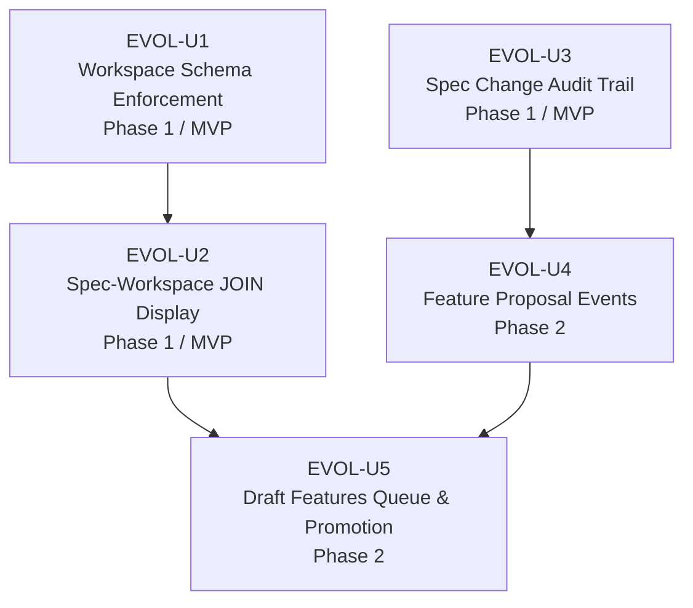

# REQ-F-EVOL-001: Spec Evolution Pipeline — Feature Decomposition

<!-- Implements: REQ-EVOL-001, REQ-EVOL-002, REQ-EVOL-003, REQ-EVOL-004, REQ-EVOL-005 -->

**Feature**: REQ-F-EVOL-001
**Edge**: requirements→feature_decomposition (iteration 1)
**Source**: imp_claude/design/features/REQ-F-EVOL-001-requirements.md
**Date**: 2026-03-07

---

## Feature Inventory

The Spec Evolution Pipeline decomposes into five buildable units, ordered by logical dependency.

---

### Unit: EVOL-U1 — Workspace Trajectory Schema Enforcement

**Satisfies**: REQ-EVOL-001, REQ-EVOL-DATA-001, REQ-EVOL-BR-001

**What converges**:
- Workspace feature vector files contain only trajectory fields; definition fields are rejected at read time
- A named violation type is raised when forbidden fields are detected, with the offending field identified
- The spec is the sole source of feature definitions; workspace files are derived trajectory state
- Health checks surface all schema violations in a single scan

**Dependencies**: None

**MVP**: Yes — foundational invariant; all other evolution units depend on the schema boundary being enforced

---

### Unit: EVOL-U2 — Spec–Workspace Feature JOIN Display

**Satisfies**: REQ-EVOL-002

**What converges**:
- Status display computes three mutually exclusive sets: ACTIVE (both layers), PENDING (spec only), ORPHAN (workspace only)
- Total feature scope (spec count) is shown alongside active progress (workspace count)
- PENDING features display their definition (ID, title, satisfies list) sourced from the spec layer
- ORPHAN features appear as health warnings, not silenced
- JOIN failure is a named, surfaced warning — not a silent empty result

**Dependencies**: EVOL-U1 (workspace reads must validate schema before JOIN)

**MVP**: Yes — without JOIN, the status display gives an incomplete and misleading picture of progress

---

### Unit: EVOL-U3 — Spec Change Audit Trail

**Satisfies**: REQ-EVOL-004, REQ-EVOL-NFR-001, REQ-EVOL-NFR-002

**What converges**:
- Every change to the specification directory emits a `spec_modified` event with the file path, human-readable summary, and before/after content hashes
- The event includes a causal chain: the triggering event ID and trigger type
- Content hash verification: `sha256(current file) == most_recent_spec_modified.new_hash` confirms the spec is in sync
- Hash mismatches (spec drift) are surfaced as named health warnings
- Manual author edits are recorded with `trigger_event_id: "manual"`, preserving auditability even outside the pipeline

**Dependencies**: None — the audit trail is independent of JOIN display and schema enforcement

**MVP**: Yes — without spec_modified events, the event log is incomplete; spec changes are invisible to the homeostasis loop

---

### Unit: EVOL-U4 — Feature Proposal Events

**Satisfies**: REQ-EVOL-003

**What converges**:
- The `feature_proposal` event type is in the canonical taxonomy
- Proposals are emitted by the homeostasis pipeline's conscious review stage only (not reflex or affect)
- The event contains a stable `proposal_id`, the proposed feature ID, satisfies list, causal chain, and rationale
- Proposals exist only in the event log — no file is written until a human promotes

**Dependencies**: EVOL-U3 (`spec_modified` schema established first, since promotion emits `spec_modified`)

**MVP**: No — Phase 2. Depends on REQ-F-LIFE-001 convergence at the code edge (homeostasis pipeline must be in place to emit proposals). Deferring does not break Phase 1 — the pipeline accepts manual proposals in the interim.

---

### Unit: EVOL-U5 — Draft Features Queue and Promotion

**Satisfies**: REQ-EVOL-005, REQ-EVOL-BR-002

**What converges**:
- Draft Features Queue is a computable projection from the event log: unresolved `feature_proposal` events
- The queue is surfaced in status commands with: proposal ID, proposed feature, rationale, triggering intent, age
- Promotion (human-initiated) appends the feature to the spec, emits `spec_modified` with causal chain, and inflates the workspace trajectory
- Rejection (human-initiated) emits `feature_proposal_rejected`; removes from queue
- No autonomous promotion occurs — the pipeline generates proposals; humans decide
- An empty queue is observable as a positive health signal

**Dependencies**: EVOL-U2 (JOIN display must work before draft queue can surface PENDING→ACTIVE transitions), EVOL-U4 (`feature_proposal` event type must exist)

**MVP**: No — Phase 2. Deferring does not block Phase 1 functionality.

---

## Dependency Graph



**Dependency adjacency list**:

| Unit | Depends On | Rationale |
|------|-----------|-----------|
| EVOL-U1 | None | Independent foundational invariant |
| EVOL-U2 | EVOL-U1 | JOIN reads workspace files; schema enforcement must be active |
| EVOL-U3 | None | Audit trail is independent of display and schema enforcement |
| EVOL-U4 | EVOL-U3 | Promotion emits `spec_modified`; schema must be established first |
| EVOL-U5 | EVOL-U2, EVOL-U4 | Queue display needs JOIN; promotion needs `feature_proposal` event type |

---

## Build Order

Topological sort of dependency DAG:

```
Tier 1 (independent, build in parallel):
  1. EVOL-U1 — Workspace Schema Enforcement
  2. EVOL-U3 — Spec Change Audit Trail

Tier 2 (depends on Tier 1):
  3. EVOL-U2 — Spec-Workspace JOIN Display (after U1)
  4. EVOL-U4 — Feature Proposal Events (after U3)

Tier 3 (depends on Tier 2):
  5. EVOL-U5 — Draft Features Queue & Promotion (after U2 + U4)
```

No cycles — topological sort succeeds.

---

## MVP Scope

**MVP = Phase 1: EVOL-U1 + EVOL-U2 + EVOL-U3**

This subset delivers:
- Correct separation of spec and workspace concerns (users can't accidentally corrupt the spec with workspace writes)
- Complete feature progress visibility (users see PENDING features they haven't started, and ORPHAN warnings)
- Full audit trail for spec changes (every spec modification is observable and hash-verified)

**Deferred (Phase 2): EVOL-U4 + EVOL-U5**

| Unit | Deferral Rationale |
|------|-------------------|
| EVOL-U4 | Requires REQ-F-LIFE-001 homeostasis pipeline convergence; no emitter exists in Phase 1 |
| EVOL-U5 | Depends on EVOL-U4; draft queue is empty until proposals exist |

Phase 2 deferral does not compromise MVP value. Manual spec evolution (human authors changes directly → `trigger_type: "manual"`) is fully functional in Phase 1 via EVOL-U3.

---

## REQ Key Coverage

| REQ Key | Unit | Phase |
|---------|------|-------|
| REQ-EVOL-001 | EVOL-U1 | 1 |
| REQ-EVOL-DATA-001 | EVOL-U1 | 1 |
| REQ-EVOL-BR-001 | EVOL-U1 | 1 |
| REQ-EVOL-002 | EVOL-U2 | 1 |
| REQ-EVOL-004 | EVOL-U3 | 1 |
| REQ-EVOL-NFR-001 | EVOL-U3 | 1 |
| REQ-EVOL-NFR-002 | EVOL-U3 | 1 |
| REQ-EVOL-003 | EVOL-U4 | 2 |
| REQ-EVOL-005 | EVOL-U5 | 2 |
| REQ-EVOL-BR-002 | EVOL-U5 | 2 |

All 10 REQ keys assigned. No key appears in more than one unit.

---

## Parallel Opportunities

EVOL-U1 and EVOL-U3 have no shared dependencies and can be built concurrently. This is the natural parallel work partition for Phase 1.

Similarly, EVOL-U4 can begin as soon as EVOL-U3 converges, in parallel with EVOL-U2 development.

## Risk Assessment

| Unit | Risk | Mitigation |
|------|------|-----------|
| EVOL-U2 (JOIN) | Parsing `FEATURE_VECTORS.md` markdown reliably — the format must be stable | Define a formal section header pattern; use structured parse not line-scan |
| EVOL-U3 (audit) | Emitting `spec_modified` on every write is easy to miss for direct git edits | Git post-commit hook as secondary emission path; verify on health check |
| EVOL-U5 (promote) | Inflation schema must match current standard profile edge set | Inflate derives from `graph_topology.yml`; no hardcoded edge list |
