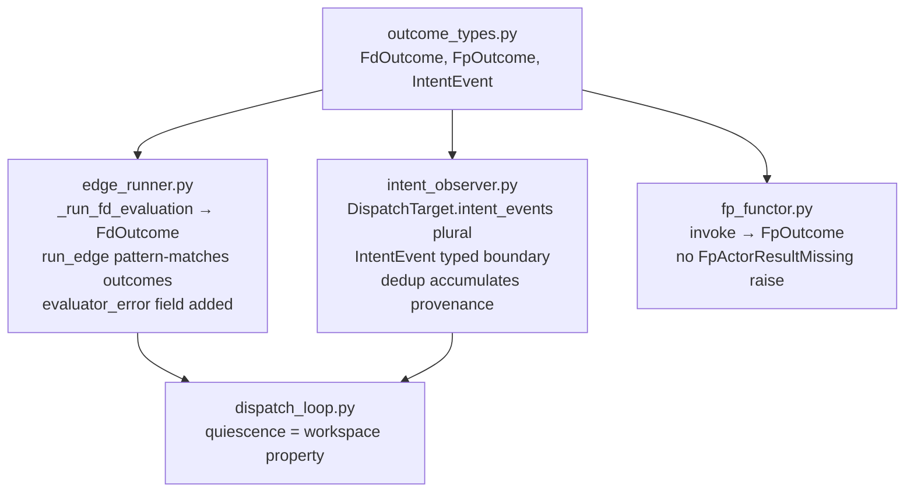
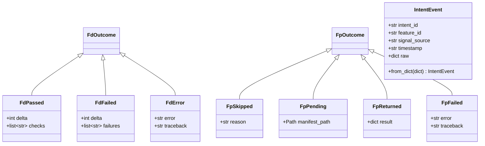

# Design: REQ-F-RUNTIME-001 — Typed Outcome Algebra for the Dispatch Path

**Version**: 1.0.0
**Feature**: REQ-F-RUNTIME-001
**Status**: converged (v1)
**Author**: claude
**Date**: 2026-03-13
**Implements**: REQ-F-DISPATCH-001, REQ-SUPV-003
**ADR**: ADR-S-032 (IntentObserver + EDGE_RUNNER architecture)

---

## 1. Problem Statement

The imp_claude dispatch path buries infrastructure failure inside domain-shaped return
values. Seven gaps were identified in the Codex functional kernel review
(`20260313T000008`) and priced in the Claude response (`20260313T020000`):

| Gap | Severity | Location | Issue |
|-----|----------|----------|-------|
| 1 | HIGH | `edge_runner.py:165-167` | `except Exception → return 1, [f"engine_error:{exc}"]` — infrastructure error collapses into delta |
| 2 | HIGH | `fp_functor.py` | `FpActorResultMissing` raised as exception; `invoke()` returns `StepResult` or skips via sentinel — three channels for one decision |
| 3 | MEDIUM | `edge_runner.py:446-516` | F_H path emits two `IterationCompleted` events plus `intent_raised` — same transition three times |
| 4 | MEDIUM | `intent_observer.py:339-350` | Dedup key `(feature_id, edge)` drops all intent_ids except first — provenance lost |
| 5 | LOW | `dispatch_loop.py:243` | `quiescent = converged > 0 and fp==0 and fh==0` — run property, not workspace property |
| 6 | MEDIUM | `intent_observer.py:82` | `DispatchTarget.intent_event: dict` — untyped raw dict at dispatch boundary |
| 7 | DEFERRED | `dispatch_monitor.py` | mtime-based triggering; cursor-based replay is correct — deferred to daemon work |

---

## 2. Architecture Overview

### 2.0 Module Dependency Diagram



### 2.0b Outcome Type Algebra



### Key Design Decisions (ADR-style rationale)

**Decision A — Sum type vs exception for evaluator outcomes**

*Context*: `_run_fd_evaluation()` currently raises no exceptions internally but returns `(1, ["engine_error:..."])` — an error coded as a non-zero delta. This makes infrastructure failure and genuine feature incompleteness indistinguishable at the call site.

*Decision*: Return `FdOutcome = FdPassed | FdFailed | FdError`. Callers pattern-match.

*Alternatives*: (1) Keep `(int, list[str])` but add sentinel failure count — rejected: still no type guarantee, callers can ignore the sentinel. (2) Raise typed exceptions — rejected: exception-as-control-flow is the exact antipattern being eliminated.

*Consequences*: Callers must pattern-match. Python 3.10+ `match` is already used in genesis. `FdError` path returns early without driving another homeostatic iteration.

**Decision B — `intent_events: list[dict]` instead of `intent_events: list[IntentEvent]`**

*Context*: `DispatchTarget` currently holds `intent_event: dict`. Gap 4 requires retaining all contributing intents. Gap 6 requires typed boundary.

*Decision*: Keep `intent_events: list[dict]` on `DispatchTarget`; apply typed `IntentEvent` projection inside `resolve_dispatch_targets()`. `feature_vector` is also a `dict` — keeping both as raw dicts at the boundary is consistent. Typed projection lives at the routing logic boundary, not at the dataclass.

*Alternatives*: (1) `intent_events: list[IntentEvent]` on `DispatchTarget` — more complete but changes the external shape of `DispatchTarget` in ways test mocks must track. (2) Full typed dataclass throughout — correct long-term but §4 backward compat cost is high for this iteration. Deferred to a future cleanup pass.

*Consequences*: `DispatchTarget` remains partially untyped. Routing logic benefits from typed `IntentEvent` locally. Mocks and tests see only the `list[dict]` boundary change (singular → plural).

---

### 2.1 New Module: `outcome_types.py`

A single new module introduces all typed outcome variants. Nothing else changes in
module structure — this is an additive change to an existing package.

```python
# imp_claude/code/genesis/outcome_types.py

from __future__ import annotations
from dataclasses import dataclass, field
from pathlib import Path


# ── F_D outcome algebra ────────────────────────────────────────────────────────

@dataclass(frozen=True)
class FdPassed:
    delta: int        # always 0
    checks: list[str] = field(default_factory=list)

@dataclass(frozen=True)
class FdFailed:
    delta: int        # > 0
    failures: list[str] = field(default_factory=list)

@dataclass(frozen=True)
class FdError:
    """Infrastructure / configuration failure — NOT a domain delta."""
    error: str
    traceback: str = ""

FdOutcome = FdPassed | FdFailed | FdError


# ── F_P outcome algebra ────────────────────────────────────────────────────────

@dataclass(frozen=True)
class FpSkipped:
    """MCP unavailable — F_D-only mode, not an error (ADR-019)."""
    reason: str

@dataclass(frozen=True)
class FpPending:
    """Manifest written; waiting for actor fold-back result."""
    manifest_path: Path

@dataclass(frozen=True)
class FpReturned:
    """Actor completed; fold-back result available."""
    result: dict

@dataclass(frozen=True)
class FpFailed:
    """Actor invocation failed or fold-back missing — observable failure."""
    error: str
    traceback: str = ""

FpOutcome = FpSkipped | FpPending | FpReturned | FpFailed


# ── Intent event typed boundary ────────────────────────────────────────────────

@dataclass(frozen=True)
class IntentEvent:
    """Typed projection of a raw intent_raised event dict.

    Constructed at intake boundary in intent_observer.py. Internal dispatch
    path never passes raw dicts — always IntentEvent.
    """
    intent_id: str
    feature_id: str          # from affected_features[0] or feature field
    signal_source: str
    timestamp: str
    raw: dict = field(default_factory=dict, compare=False, hash=False)

    @classmethod
    def from_dict(cls, event: dict) -> "IntentEvent":
        """Project raw event dict to IntentEvent at intake boundary."""
        data = event.get("data", event)
        # Resolve feature_id from several possible locations
        feature_id = (
            (data.get("affected_features") or [""])[0]
            or data.get("feature", "")
            or event.get("feature", "")
        )
        return cls(
            intent_id=data.get("intent_id", event.get("intent_id", "")),
            feature_id=feature_id,
            signal_source=data.get("signal_source", ""),
            timestamp=event.get("timestamp", ""),
            raw=event,
        )
```

**Design rationale**:
- `FdError` vs `FdFailed`: semantically distinct. `FdFailed` means the evaluator ran
  and the feature has work remaining. `FdError` means the evaluator itself is broken —
  this must NOT drive another iteration as if feature work is pending.
- `FpSkipped` is not a failure — it is F_D-only mode (ADR-019). The name makes this
  explicit where previously a `StepResult(skipped=True)` sentinel hid the decision.
- `IntentEvent` frozen: the dispatch path never mutates intake data.

### 2.2 Changes to `edge_runner.py`

#### 2.2.1 `_run_fd_evaluation` return type

**Before** (Gap 1):
```python
def _run_fd_evaluation(...) -> tuple[int, list[str]]:
    try:
        ...
        return record.evaluation.delta, failures
    except Exception as exc:
        return 1, [f"engine_error:{exc}"]   # ← infrastructure → delta
```

**After**:
```python
from .outcome_types import FdOutcome, FdPassed, FdFailed, FdError

def _run_fd_evaluation(...) -> FdOutcome:
    try:
        ...
        if record.evaluation.delta == 0:
            return FdPassed(delta=0, checks=[cr.name for cr in record.evaluation.checks if cr.outcome.value == "pass"])
        return FdFailed(delta=record.evaluation.delta, failures=failures)
    except Exception as exc:
        import traceback as _tb
        return FdError(error=str(exc), traceback=_tb.format_exc())
```

The call sites in `run_edge()` pattern-match on `FdOutcome`:

```python
fd_result = _run_fd_evaluation(target, workspace_root, edge_run_id, project_name)

match fd_result:
    case FdError(error=err, traceback=tb):
        # Infrastructure failure — NOT a domain delta.
        # Must emit a taxonomy-aligned event BEFORE returning so replay consumers
        # can distinguish infrastructure failure from feature delta.
        _emit(events_path, "IterationCompleted", target, project_name, run_id, edge_started_id, {
            "feature": target.feature_id,
            "edge": target.edge,
            "iteration": 1,
            "delta": None,           # explicitly null — no delta for infrastructure error
            "status": "evaluator_error",
            "evaluator_error": err,
            "error_class": "infrastructure",
        })
        events_emitted.append("IterationCompleted:evaluator_error")
        return EdgeRunResult(
            run_id=run_id, feature_id=target.feature_id, edge=target.edge,
            status="evaluator_error", delta=0, iterations=1, cost_usd=0.0,
            events_emitted=events_emitted, evaluator_error=err,
        )
    case FdPassed():
        delta, failures = 0, []
    case FdFailed(delta=d, failures=fs):
        delta, failures = d, fs
```

**Finding 3 requires `delta=None` in the event payload** — not `delta=0` (converged) and
not `delta=1` (needs work). The field must be absent or explicitly null to signal "no
measurement was taken." Replay consumers filtering on `status: evaluator_error` get the
taxonomy; they do not need to guess from a spurious delta value.

`EdgeRunResult` gains the `evaluator_error` field:

```python
@dataclass
class EdgeRunResult:
    run_id: str
    feature_id: str
    edge: str
    status: str  # "converged" | "fp_dispatched" | "fh_required" | "stuck" | "evaluator_error"
    delta: int
    iterations: int
    cost_usd: float
    events_emitted: list[str] = field(default_factory=list)
    fp_manifest_path: str = ""
    error: str = ""
    evaluator_error: str = ""    # ← NEW: non-empty only for FdError path
```

The emitted `IterationCompleted{status: "evaluator_error"}` is the replay-visible signal.
In-memory `EdgeRunResult.evaluator_error` is a convenience projection for callers in the
same process. The event is the ground truth — the struct is derived.

#### 2.2.2 F_H escalation: single `intent_raised` (Gap 3)

**Before**: Lines 446-516 emit:
1. `IterationCompleted` with `phase: F_H` payload (lines 448-467)
2. Second `IterationCompleted` with `signal_source: human_gate_required` payload (lines 469-491)
3. `intent_raised` OL event (lines 493-515)

This is triple-encoding of one transition. `IterationCompleted` is a pure observation
record; routing directives do not belong in it.

**After**:
1. `IterationCompleted` — carries only: `feature`, `edge`, `iteration`, `delta`, `status`, `fp_iterations_exhausted`, `budget_usd`, `cost_usd` (no routing fields)
2. `intent_raised` OL event — sole authoritative F_H signal (unchanged structure)

The second `IterationCompleted` block (lines 469-492) is **removed entirely**.

### 2.3 Changes to `intent_observer.py`

#### 2.3.1 `DispatchTarget.intent_events` (Gap 4 + Gap 6)

**Before**:
```python
@dataclass
class DispatchTarget:
    intent_id: str
    feature_id: str
    edge: str
    intent_event: dict = field(default_factory=dict)       # untyped, single event
    feature_vector: dict = field(default_factory=dict)
```

**After**:
```python
from .outcome_types import IntentEvent

@dataclass
class DispatchTarget:
    intent_id: str                                          # first / primary intent id
    feature_id: str
    edge: str
    intent_events: list[dict] = field(default_factory=list)  # ALL contributing events
    feature_vector: dict = field(default_factory=dict)
```

`intent_event` → `intent_events` (plural list). The `intent_id` field retains the first
intent's id as the primary dispatch key (existing code that reads `target.intent_id`
continues to work). The full list gives replay consumers all contributing provenance.

Note: we keep `intent_events: list[dict]` (not `list[IntentEvent]`) on `DispatchTarget`
because the feature vector field also remains a dict — both cross the same boundary. The
`IntentEvent` typed projection is used internally by the routing logic in
`resolve_dispatch_targets()`.

#### 2.3.2 Typed intake boundary (Gap 6)

`find_unhandled_intents()` returns `list[dict]` (unchanged external contract). The
`resolve_dispatch_targets()` function projects to `IntentEvent` at intake:

```python
def resolve_dispatch_targets(
    intent_event: dict,
    workspace_root: Path,
) -> list[DispatchTarget]:
    typed = IntentEvent.from_dict(intent_event)   # ← typed boundary
    feature_id = typed.feature_id
    ...
```

This is the minimum-scope boundary freeze per ADR-S-032: untyped dicts live in the I/O
layer; internal routing uses typed values.

#### 2.3.3 Deduplication retains all contributing intent_ids — with idempotency closure (Gap 4)

The accumulation fix has a critical companion: the "handled/unhandled" contract.

`find_unhandled_intents()` marks an intent as handled if its `intent_id` appears in an
`edge_started` event. If two intents (INT-001, INT-002) merge into one `DispatchTarget`
and `edge_started` only carries the primary `intent_id` (INT-001), then INT-002 remains
unhandled on the next pass — causing a duplicate dispatch for the same (feature, edge).

**Fix requires two coordinated changes**:

**Change A — Accumulate in `get_pending_dispatches()`**:
```python
merged: dict[tuple[str, str], DispatchTarget] = {}

for intent_event in unhandled:
    targets = resolve_dispatch_targets(intent_event, workspace_root)
    for t in targets:
        key = (t.feature_id, t.edge)
        if key not in merged:
            merged[key] = t
        else:
            merged[key].intent_events.extend(t.intent_events)

return list(merged.values())
```

**Change B — `edge_started` carries ALL contributing intent_ids**:

In `run_edge()`, the `edge_started` event payload must include a `handled_intent_ids`
list containing every intent_id from `target.intent_events`:

```python
all_intent_ids = [
    (e.get("data") or e).get("intent_id", "")
    for e in target.intent_events
    if (e.get("data") or e).get("intent_id")
]
# Emit edge_started with:
{
    "intent_id": target.intent_id,              # primary — backward compat
    "handled_intent_ids": all_intent_ids,        # all — closes every contributing intent
    ...
}
```

**Change C — `_get_dispatched_intent_ids()` reads the full list**:

```python
def _get_dispatched_intent_ids(events: list[dict]) -> set[str]:
    dispatched: set[str] = set()
    for ev in events:
        if ev.get("event_type") != "edge_started":
            continue
        # Primary intent_id (backward compat)
        iid = ev.get("intent_id") or (ev.get("data", {}) or {}).get("intent_id")
        if iid:
            dispatched.add(str(iid))
        # All contributing intent_ids (new)
        all_ids = (ev.get("data", {}) or {}).get("handled_intent_ids") or ev.get("handled_intent_ids") or []
        for aid in all_ids:
            if aid:
                dispatched.add(str(aid))
    return dispatched
```

All three changes must land together — A without B/C causes duplicate dispatch;
B without A is provenance without dedup.

### 2.4 Changes to `dispatch_loop.py` (Gap 5 — revised)

**Before** (quiescence is a run property):
```python
"quiescent": summary.converged > 0 and summary.fp_dispatched == 0 and summary.fh_required == 0
```

**First-pass fix** (workspace pending dispatches — necessary but not sufficient):
```python
"quiescent": len(get_pending_dispatches(workspace_root)) == 0
```

This is still too weak. `get_pending_dispatches()` returns only intents ready to dispatch
right now. It does not account for:
- Work parked in `fp_dispatched` — a manifest was written but no fold-back result yet;
  another dispatch of the same (feature, edge) would be a duplicate
- Work parked in `fh_required` — an `intent_raised{signal_source: human_gate_required}`
  was emitted but not yet resolved; the workspace is not quiescent, it is waiting

**After** (complete quiescence = no pending dispatches AND no parked work):

```python
def _compute_quiescence(workspace_root: Path) -> bool:
    """Workspace is quiescent iff no pending dispatches AND no parked work.

    Three conditions must all be false:
    1. Unhandled intents ready to dispatch (get_pending_dispatches)
    2. In-flight fp_dispatched manifests awaiting fold-back
    3. Unresolved fh_required escalations awaiting human gate
    """
    if get_pending_dispatches(workspace_root):
        return False

    # Parked fp_dispatched: manifests in .ai-workspace/agents/ with status pending/dispatched
    agents_dir = workspace_root / ".ai-workspace" / "agents"
    if agents_dir.exists():
        for p in agents_dir.glob("fp_intent_*.json"):
            try:
                data = json.loads(p.read_text())
                if data.get("status") in ("pending", "dispatched"):
                    return False
            except Exception:
                pass

    # Parked fh_required: intent_raised{signal_source: human_gate_required}
    # with no subsequent resolution event
    events_path = workspace_root / ".ai-workspace" / "events" / "events.jsonl"
    if _has_unresolved_fh_gates(events_path):
        return False

    return True
```

`_has_unresolved_fh_gates(events_path)` scans events chronologically: each
`intent_raised{signal_source: human_gate_required}` opens a gate; the gate closes when
any of `{"consensus_reached", "review_approved", "edge_converged"}` appears for the
same `(feature, edge)`. If any gate opened without closing, the workspace is not
quiescent.

The dispatch_loop output becomes:
```python
"quiescent": _compute_quiescence(workspace_root)
```

### 2.5 `fp_functor.py` — FpOutcome (Gap 2)

`FpFunctor.invoke()` currently either:
- Returns `StepResult(skipped=True)` when MCP unavailable
- Returns `StepResult` when actor completes
- Raises `FpActorResultMissing` when fold-back missing

**After**, `invoke()` returns `FpOutcome`:

```python
from .outcome_types import FpOutcome, FpSkipped, FpPending, FpReturned, FpFailed

class FpFunctor:
    def invoke(self, intent: Intent, state: Path) -> FpOutcome:
        if not mcp_available():
            return FpSkipped(reason="MCP unavailable — F_D-only mode (ADR-019)")

        try:
            raw = _mcp_invoke(prompt, state, intent)
            ...
            return FpReturned(result=parsed)
        except FpActorResultMissing as exc:
            return FpFailed(error=str(exc))
        except Exception as exc:
            return FpFailed(error=str(exc), traceback=traceback.format_exc())
```

The call site in `run_edge()` pattern-matches:

```python
fp_outcome = fp_functor.invoke(intent, workspace_root)

match fp_outcome:
    case FpSkipped():
        # F_D-only mode — continue without construction
        pass
    case FpPending(manifest_path=p):
        fp_manifest_path = str(p)
        return EdgeRunResult(..., status="fp_dispatched", ...)
    case FpReturned(result=r):
        # Actor completed — re-run F_D
        ...
    case FpFailed(error=err):
        # Observable failure — not a silent skip
        result.error = err
        # Escalate to F_H if budget exhausted
        ...
```

`FpActorResultMissing` is no longer raised from `invoke()` — it is returned as
`FpFailed`. The exception type is retained for backward-compatibility with any
test code that imports it directly.

---

## 3. Module Structure

No new files beyond `outcome_types.py`. Changed files:

| File | Change |
|------|--------|
| `outcome_types.py` | NEW — `FdOutcome`, `FpOutcome`, `IntentEvent` |
| `edge_runner.py` | `_run_fd_evaluation` → `FdOutcome`; emit `IterationCompleted{status:evaluator_error,delta:None}`; `evaluator_error` field; F_H dual encoding removed |
| `intent_observer.py` | `DispatchTarget.intent_event` → `intent_events: list[dict]`; typed boundary; dedup accumulates; `edge_started.handled_intent_ids`; `_get_dispatched_intent_ids` reads list |
| `dispatch_loop.py` | Quiescence = `_compute_quiescence()` — pending + parked fp_dispatched + unresolved fh |
| `fp_functor.py` | `invoke()` → `FpOutcome`; no `FpActorResultMissing` raise |

Gap 7 (mtime → cursor-based replay) remains deferred per the review pricing.

---

## 4. Backward Compatibility

Existing tests (55: 33 `test_intent_observer.py` + 22 `test_edge_runner.py`) must
continue to pass. Key considerations:

### 4.1 `DispatchTarget.intent_event` → `intent_events`

All test code creating `DispatchTarget` directly must update the field name. The rename
is surgical — no semantic change, just plurality.

Tests that read `target.intent_event` (singular dict) must switch to
`target.intent_events[0]` for the primary event.

### 4.2 `EdgeRunResult.evaluator_error`

New field with default `""` — no existing test will break. Tests checking `result.status`
for `"fp_dispatched"` / `"fh_required"` / `"stuck"` / `"converged"` are unaffected.
New tests will exercise the `"evaluator_error"` status path.

### 4.3 `_run_fd_evaluation` return type

This function is private (underscore prefix). No external tests call it directly —
only `run_edge()` does. `run_edge()` is tested at the integration level via the
public `run_edge()` function. The internal type change is invisible to existing tests
that mock or patch `_run_fd_evaluation`.

### 4.4 F_H dual encoding removal

Tests that assert `events_emitted` contains `"FH_escalation"` will need to be updated
to reflect that only `"IterationCompleted"` + `"intent_raised:fh"` are emitted (not
the duplicated second `IterationCompleted`). Tests asserting the `intent_raised` OL
event is emitted are unaffected.

### 4.5 `fp_functor.invoke()` return type

`FpFunctor` is used inside `run_edge()`. Existing `test_edge_runner.py` tests that mock
`FpFunctor.invoke()` to return `StepResult(skipped=True)` must be updated to return
`FpSkipped(reason="...")` instead. This is the expected migration cost.

---

## 5. Test Plan

New tests (to be co-evolved in `test_intent_observer.py` and `test_edge_runner.py`):

| Test | Covers |
|------|--------|
| `test_evaluator_error_vs_delta` | `FdError` returned when engine raises; `evaluator_error` field set; `status == "evaluator_error"`; delta is NOT incremented |
| `test_evaluator_error_does_not_iterate` | `run_edge()` returns immediately on `FdError` — no F_P dispatch attempted |
| `test_fp_outcome_skipped_continues` | `FpSkipped` → F_D-only mode, result has no fp_manifest_path |
| `test_fp_outcome_failed_escalates` | `FpFailed` → treated as F_P exhausted, escalates to F_H |
| `test_fp_outcome_returned_reruns_fd` | `FpReturned` → `_run_fd_evaluation` called again |
| `test_fh_emits_single_intent_raised` | F_H path emits exactly one `IterationCompleted` + one `intent_raised`; no second `IterationCompleted` |
| `test_dispatch_target_accumulates_intent_ids` | Two intents for same (feature, edge) → single `DispatchTarget` with both events in `intent_events` |
| `test_quiescence_is_workspace_property` | `quiescent=True` when `get_pending_dispatches()` returns `[]`, regardless of run results |
| `test_intent_event_typed_boundary` | `IntentEvent.from_dict()` correctly projects all field locations (top-level, data sub-dict, affected_features) |
| `test_dispatch_target_intent_events_plural` | `DispatchTarget.intent_events` is a list; primary `intent_id` matches first event |
| `test_evaluator_error_emits_replay_visible_event` | `FdError` path emits `IterationCompleted{status:evaluator_error,delta:None}`; event is in `events_emitted` list |
| `test_evaluator_error_delta_is_null` | Emitted event has `delta: None` (not 0, not 1) — explicit absence of measurement |
| `test_multi_intent_idempotency` | Two intents for same (feature,edge) → single dispatch; both intent_ids in `edge_started.handled_intent_ids`; second pass sees neither as unhandled |
| `test_quiescence_not_true_with_parked_fp_manifest` | Active fp_intent manifest → `_compute_quiescence()` returns False |
| `test_quiescence_not_true_with_unresolved_fh` | Unresolved `intent_raised{signal_source:human_gate_required}` → `_compute_quiescence()` returns False |
| `test_quiescence_true_when_all_parked_resolved` | All manifests completed + all fh gates closed → `_compute_quiescence()` returns True |

---

## 6. Traceability Matrix

| Acceptance Criterion | Design Element |
|---------------------|---------------|
| `EdgeRunResult.evaluator_error` field; exception paths set it, not delta | §2.2.1 — `FdError` → `evaluator_error`; `IterationCompleted{status:evaluator_error,delta:None}` emitted for replay visibility |
| `FpOutcome = FpSkipped | FpPending | FpReturned | FpFailed`; `invoke()` returns `FpOutcome` | §2.5 — `outcome_types.py` + `fp_functor.py` change |
| `run_edge()` pattern-matches `FpOutcome`; no exception handling in dispatch path | §2.2.1, §2.5 — `match` replaces try/except |
| `IterationCompleted` carries only iteration data (delta, evaluators, cost); no routing | §2.2.2 — second `IterationCompleted` block removed |
| `intent_raised` sole authoritative signal for F_H gate transitions | §2.2.2 — OL `intent_raised` retained; duplicate removed |
| `DispatchTarget.intent_events: list[dict]` retains all contributing intents | §2.3.1, §2.3.3 — dedup accumulates; `edge_started.handled_intent_ids` closes all contributing intent_ids; `_get_dispatched_intent_ids` reads list |
| `dispatch_loop` quiescence = workspace property (no pending + no parked fp + no unresolved fh) | §2.4 — `_compute_quiescence()` checks all three states |
| All existing dispatch + edge_runner tests continue to pass | §4 backward compat notes |
| New tests cover: evaluator_error vs delta, FpOutcome branches, single F_H event | §5 test plan |

---

## 7. Sequencing

Implementation order follows the review pricing (Finding 1 + 7 first):

1. **`outcome_types.py`** — create; no dependencies; all other changes import from here
2. **`edge_runner.py`** — `FdOutcome` return type + `evaluator_error` field (Gap 1); F_H dual encoding removal (Gap 3)
3. **`intent_observer.py`** — `intent_events` plural (Gap 4); typed boundary (Gap 6)
4. **`dispatch_loop.py`** — quiescence fix (Gap 5)
5. **`fp_functor.py`** — `FpOutcome` return type (Gap 2)
6. **Tests** — co-evolve after each module; update mocks for renamed fields and new return types

Gap 7 (dispatch_monitor mtime) remains deferred.
