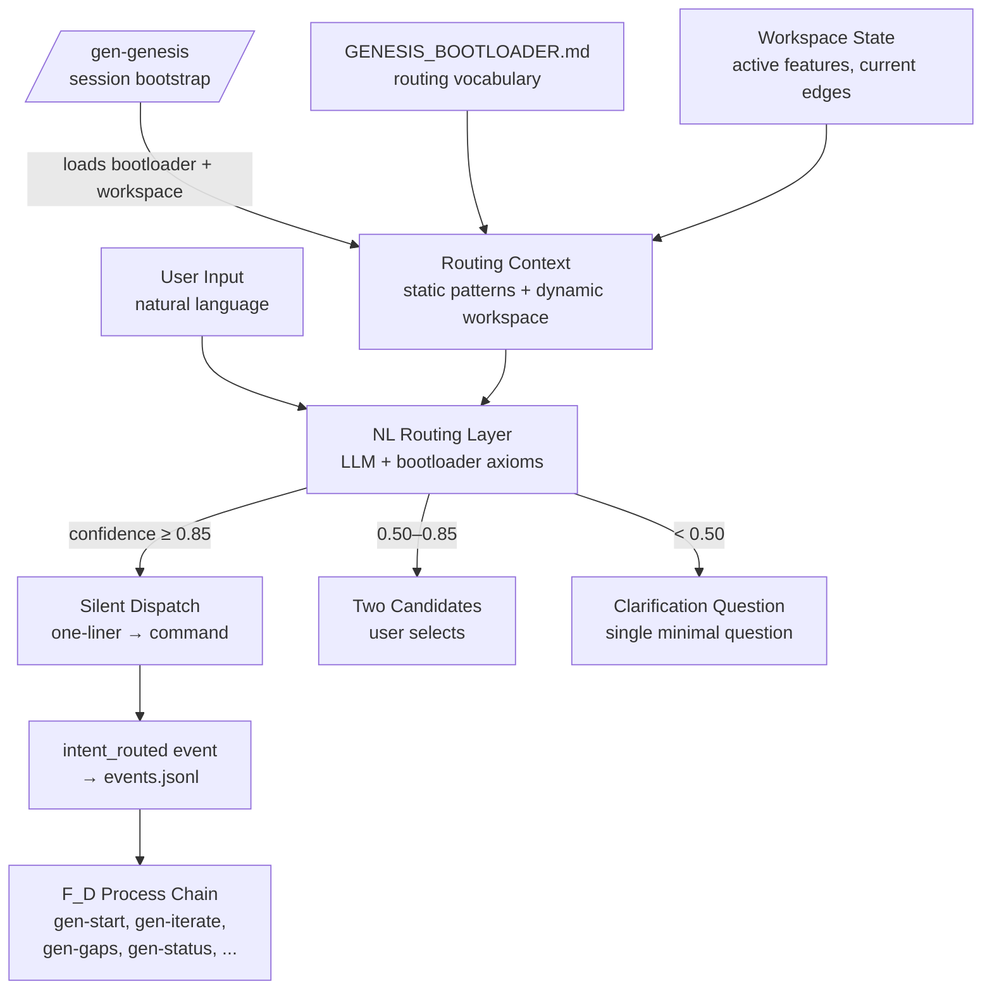
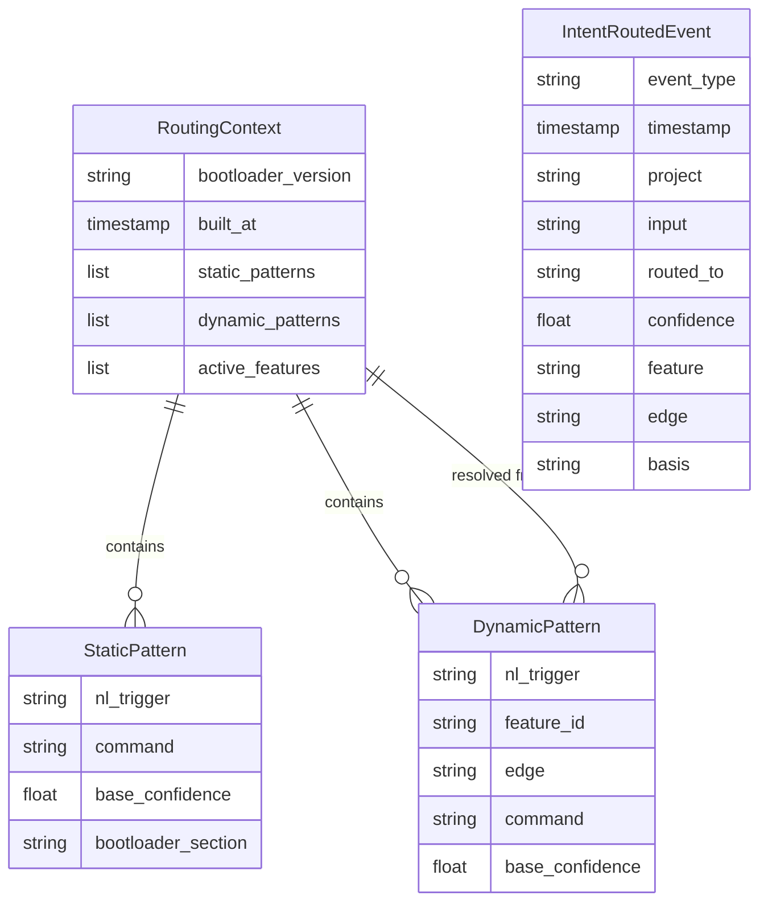

# Design: Natural Language Intent Dispatch
<!-- Implements: REQ-UX-008, REQ-UX-001, REQ-UX-002 -->
<!-- Feature vector: REQ-F-UX-002 -->
<!-- Edge: requirements→design — iteration 1 -->

**Version**: 1.0.0
**Date**: 2026-03-12
**Status**: Draft — awaiting human approval
**ADR**: [ADR-S-038](../../specification/adrs/ADR-S-038-natural-language-intent-dispatch.md)

---

## 1. Architecture Overview

The NL Dispatch Layer sits between the user's natural language input and the methodology's F_D process chain. The LLM (Claude) acts as the routing layer — no separate NLP model, no hard-coded lookup table.



**Design principle**: The bootloader is the routing vocabulary (ADR-S-038 §Decision). The workspace state personalises it. The LLM is the routing layer. This avoids maintaining a separate routing table that diverges from the actual methodology vocabulary.

---

## 2. Component Design

### Component: NL Routing Layer

**Implements**: REQ-UX-008

**Responsibilities**:
- Accept free-text user input after `/gen-genesis` activates the session
- Compute routing confidence against the active routing context
- Dispatch at confidence ≥ 0.85 (silent), present two options at 0.50–0.85, ask one question at < 0.50
- Emit `intent_routed` event for every dispatch ≥ 0.85

**Interfaces**:
- Input: `{user_text: str, routing_context: RoutingContext}`
- Output: `RoutingDecision{routed_to: str, confidence: float, basis: str}` + `intent_routed` event
- Depends on: RoutingContextBuilder, EventEmitter

**Confidence computation**:
- Match input against static patterns (bootloader vocabulary) — exact and semantic match
- Match input against dynamic patterns (workspace-resolved feature/edge references)
- Confidence = max(static_match_score, dynamic_match_score)
- Pattern matching uses semantic similarity within the LLM reasoning layer — no external model

---

### Component: Routing Context Builder (`/gen-genesis` Steps 1–3)

**Implements**: REQ-UX-008

**Responsibilities**:
- Load `specification/core/GENESIS_BOOTLOADER.md` — the static routing vocabulary
- Read all active feature vectors from `.ai-workspace/features/active/*.yml`
- Read last 10 events from `.ai-workspace/events/events.jsonl` for workspace recency signal
- Read pending proposals from `.ai-workspace/reviews/pending/PROP-*.yml`
- Build two-layer routing table (static + dynamic) and output personalised routing context
- Emit `session_bootstrap` event on completion

**Interfaces**:
- Input: filesystem (bootloader, feature YAMLs, events.jsonl)
- Output: `RoutingContext{static_patterns: [...], dynamic_patterns: [...], active_features: [...]}`
- No external dependencies (pure file reads)

**Two-layer routing table**:

| Layer | Source | Example |
|-------|--------|---------|
| Static | Bootloader functional units (§VII) | `"what's broken"` → `gen-status --health` |
| Dynamic | Active feature vectors + current edges | `"fix UX dispatch"` → `gen-iterate --feature REQ-F-UX-002 --edge requirements→design` |

**Staleness**: The routing context is built at `/gen-genesis` invocation. If workspace state changes substantially mid-session (new features spawned, edges converged), the user should re-run `/gen-genesis` to refresh. The command itself is idempotent — re-running is safe.

---

### Component: `intent_routed` Event Emitter

**Implements**: REQ-UX-008, REQ-EVENT-003

**Responsibilities**:
- Append structured `intent_routed` event to `.ai-workspace/events/events.jsonl` for every dispatch ≥ 0.85
- Events at 0.50–0.85 (user selected) are also emitted after selection
- Events at < 0.50 (clarification path) are emitted only after the user provides clarifying input and dispatch is ≥ 0.85

**Event schema**:
```json
{
  "event_type": "intent_routed",
  "timestamp": "{ISO 8601}",
  "project": "{project_name}",
  "data": {
    "input": "{verbatim user text}",
    "routed_to": "{full command string}",
    "confidence": 0.95,
    "feature": "{feature_id or null}",
    "edge": "{edge or null}",
    "basis": "{bootloader section or workspace artifact}"
  }
}
```

**Interfaces**:
- Input: `RoutingDecision`
- Output: appends to `events.jsonl`

---

### Component: `/gen-genesis` Command

**Implements**: REQ-UX-008

**Responsibilities**:
- Bootstrap the NL dispatch session (Steps 1–5 in gen-genesis.md)
- Handle both cold-start and warm-session scenarios
- Handle post-context-compression recovery (same as cold-start — re-reads durable artifacts)

**Interfaces**:
- Input: none required (reads filesystem)
- Output: routing table confirmation + NL dispatch mode activation
- Emits: `session_bootstrap` event (REQ-EVENT-003 extension — new event type)

**Cold-start guarantee**: The command reads only durable filesystem artifacts (bootloader + workspace YAMLs + events.jsonl). It never depends on conversation history. Re-running it at any point safely rebuilds routing context.

**Degrades gracefully without `/gen-genesis`**: If a user types NL without running `/gen-genesis`, the LLM will still attempt routing using its training data about Genesis commands. However, the routing will lack workspace personalisation (dynamic patterns won't be populated). This is acceptable degraded mode — users get basic routing, just not feature-specific resolution.

---

## 3. Data Model



No persistent data model beyond the event log. `RoutingContext` is an in-session structure — computed on `/gen-genesis`, used during the session, not stored.

---

## 4. Traceability Matrix

| Component | REQ Keys |
|-----------|----------|
| NL Routing Layer | REQ-UX-008 |
| Routing Context Builder | REQ-UX-008, REQ-UX-002 |
| intent_routed Event Emitter | REQ-UX-008, REQ-EVENT-003 |
| `/gen-genesis` Command | REQ-UX-008, REQ-UX-001, REQ-UX-002 |

All 3 requirements in scope (REQ-UX-008, REQ-UX-001, REQ-UX-002) are traced to at least one component.

---

## 5. ADR Index

| ADR | Decision | Status |
|-----|----------|--------|
| [ADR-S-038](../../specification/adrs/ADR-S-038-natural-language-intent-dispatch.md) | Bootloader is routing vocabulary; LLM is routing layer; workspace state personalises | Accepted |

**Why only one ADR?** The decision space for this feature is narrow: the architecture is fully determined by two axioms — (1) the bootloader is already the methodology vocabulary, (2) the LLM already has semantic reasoning capability. These two axioms make every alternative (separate NLP model, hard-coded table, fuzzy completion) strictly inferior. ADR-S-038 documents this reasoning with 4 alternatives considered.

Secondary decisions subsumed by ADR-S-038:
- Confidence thresholds (0.85/0.50) — justified as F_D constraints in §Routing Confidence Thresholds
- Event schema for `intent_routed` — derived from existing REQ-EVENT-003 extension pattern
- Staleness handling — addressed in §Consequences (negative: cold-start latency)

---

## 6. Package/Module Structure

This feature is implemented primarily as a Claude Code command (Markdown), not a Python module. The routing logic is LLM-native.

```
imp_claude/
  code/
    .claude-plugin/plugins/genesis/
      commands/
        gen-genesis.md              ← Session bootstrap command (already written)
      config/
        intentengine_config.yml     ← intent_routed event type entry (done)
  tests/
    test_nl_dispatch.py             ← NEW: validates REQ-UX-008 ACs
      # Validates: REQ-UX-008
      # Test classes:
      #   TestRoutingPatterns     — static pattern coverage
      #   TestConfidenceThresholds — 0.85/0.50 routing behaviour
      #   TestIntentRoutedEvent   — event schema, field completeness
      #   TestColdStartGuarantee  — gen-genesis idempotency, no history dependence
```

No new Python modules required for Phase 1 (LLM-native routing). If Phase 2 adds a Python-based routing engine (e.g., for headless/engine mode), it would add `genesis/nl_router.py`.

---

## 7. Constraint Dimensions

**ecosystem_compatibility**: The implementation runs in Claude Code (Python 3.12, pytest for tests). The routing layer requires no dependencies beyond the existing Genesis stack. The `/gen-genesis` command is pure Markdown — no new packages.

**deployment_target**: Claude Code plugin — same as all other Genesis commands. Deployed by `gen-setup.py` installer to `.claude/commands/gen-genesis.md`.

**security_model**: No new authentication or authorisation surface. `intent_routed` events are appended to the local event log (same as all other events). No user data leaves the local filesystem.

**build_system**: pip + pytest. Test file follows existing project conventions. No build changes required.

**Advisory dimensions**:
- `data_governance`: `intent_routed` events capture verbatim user input. These events stay local. If workspace is version-controlled and pushed, user queries are in the event log. This is noted — not a blocker.
- `performance_envelope`: `/gen-genesis` reads bootloader (~900 lines) + all active feature YAMLs. Target: < 3 seconds for up to 50 active features.
- `observability`: `intent_routed` events are the observability mechanism. Pattern analysis (which NL inputs are most common) is available via event log queries.
- `error_handling`: If confidence < 0.50 after one clarification attempt, the routing layer presents the top-2 candidate operations and asks user to pick. Never fails silently.

---

## 8. Source Analysis Findings

| Finding | Classification | Disposition |
|---------|---------------|-------------|
| "Unambiguous intent" not formally defined — design chose confidence ≥ 0.85 as the threshold | SOURCE_AMBIGUITY | resolved_with_assumption (thresholds are initial values, empirically tunable from intent_routed analysis) |
| Mid-session context compression: what happens to routing context? | SOURCE_GAP | resolved_by_design — `/gen-genesis` is idempotent; user re-runs it after compression; bootloader axioms are durable |
| Workspace state staleness: new feature spawned after gen-genesis | SOURCE_GAP | resolved_by_design — dynamic patterns are conservative (missing new features causes lower confidence → clarification path, not silent misroute) |
| Pre-gen-genesis behaviour: NL dispatch without bootstrap | SOURCE_GAP | resolved_by_design — degraded mode documented: bootloader training data provides basic routing, workspace personalisation absent |

---

## 9. Process Gap Analysis (Inward)

| Gap | Type | Action |
|-----|------|--------|
| Checklist has no F_D test for `intent_routed` event schema validity | EVALUATOR_MISSING | `test_nl_dispatch.py::TestIntentRoutedEvent` will cover this — emit real events, validate JSON schema |
| No evaluator for confidence calibration (thresholds may be wrong) | EVALUATOR_MISSING_ADVISORY | Post-v3.0 — requires real usage data from `intent_routed` event analysis |
| No E2E test for cold-start scenario | EVALUATOR_MISSING | Add to test_nl_dispatch.py: `TestColdStartGuarantee::test_no_conversation_history_dependence` |
