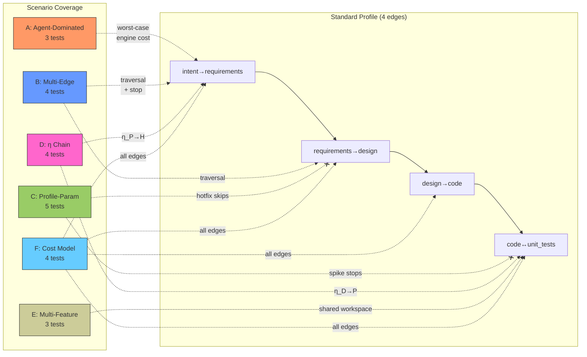
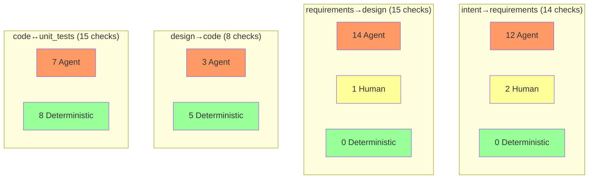
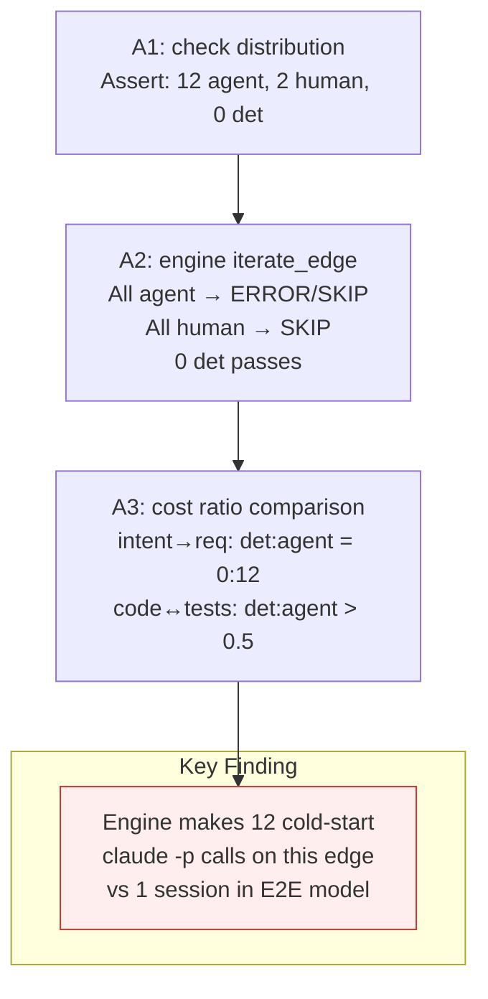
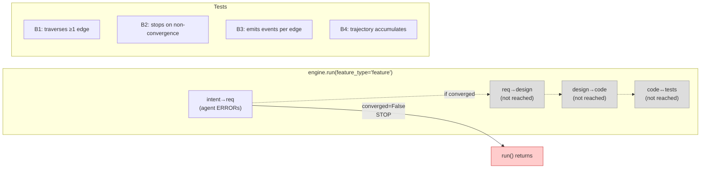
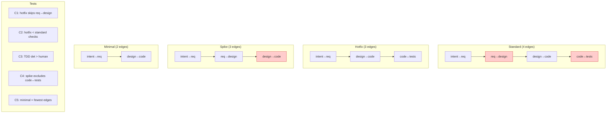
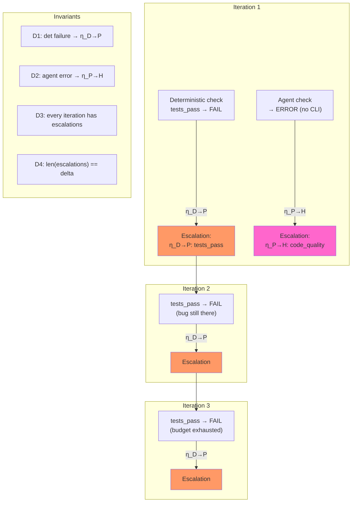
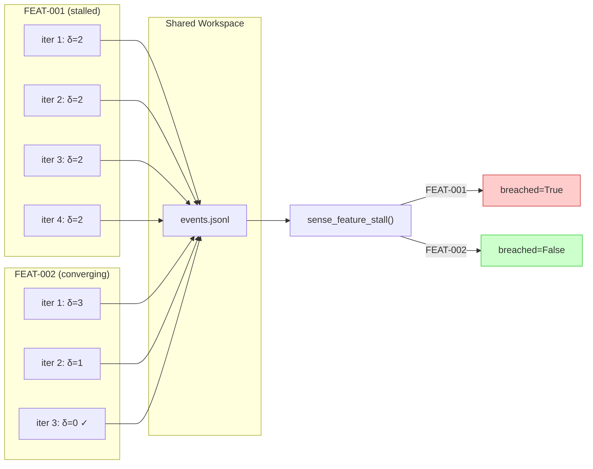
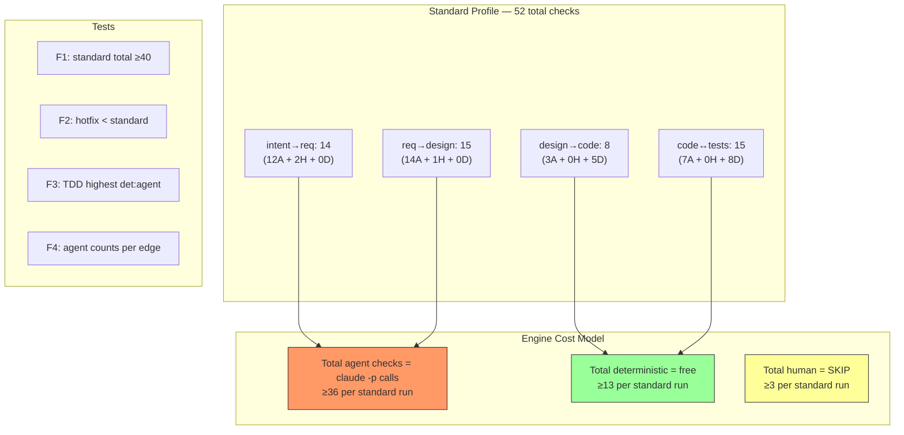

# Complex Test Scenarios — Cost-Benefit Boundary Analysis

**File**: `test_functor_complex.py` (23 tests, ~17s, no LLM calls)
**Validates**: REQ-ITER-003, REQ-EVAL-002, REQ-SENSE-001, REQ-SUPV-003

---

## Test Map — Scenarios vs Graph Edges



---

## Check Type Distribution Per Edge



**Legend**: Red = Agent (engine: 1 `claude -p` call each), Yellow = Human (SKIP), Green = Deterministic (free)

---

## Scenario A: Agent-Dominated Edge

Tests the worst-case engine cost — `intent→requirements` has 0 deterministic checks.



---

## Scenario B: Multi-Edge Traversal

Tests `run()` walking edges in sequence, stopping at first non-convergence.



---

## Scenario C: Profile-Parameterized Runs

Different profiles produce different graph subsets.



---

## Scenario D: η Escalation Chain

Tests natural transformation escalation: F_D fails → η_D→P, agent fails → η_P→H.



---

## Scenario E: Multi-Feature Workspace

Tests two features sharing one workspace without cross-contamination.



---

## Scenario F: Cost Model Validation

Pure data tests — no engine calls. Validates the numbers in FRAMEWORK_COMPARISON_ANALYSIS.md.



---

## Coverage Matrix

| Gap (from plan) | Scenario | Tests | Status |
|-----------------|----------|-------|--------|
| Non-TDD edges through engine | A, B | A2, B1-B4 | Covered |
| Agent-dominated edge cost | A, F | A1-A3, F3-F4 | Covered |
| Multi-edge traversal with real eval | B | B1-B4 | Covered |
| Profile-parameterized runs | C | C1-C5 | Covered |
| Det-dominant vs agent-dominant crossover | F | F2-F3 | Covered |
| Multi-feature workspace | E | E1-E3 | Covered |
| η chain across iterations | D | D1-D4 | Covered |

---

## Running the Tests

```bash
# New tests only
pytest imp_claude/tests/test_functor_complex.py -v

# By scenario
pytest imp_claude/tests/test_functor_complex.py::TestCostModel -v
pytest imp_claude/tests/test_functor_complex.py::TestAgentDominatedEdge -v
pytest imp_claude/tests/test_functor_complex.py::TestMultiEdgeTraversal -v
pytest imp_claude/tests/test_functor_complex.py::TestProfileParameterized -v
pytest imp_claude/tests/test_functor_complex.py::TestEtaEscalationChain -v
pytest imp_claude/tests/test_functor_complex.py::TestMultiFeatureWorkspace -v

# Full regression (excluding E2E headless)
pytest imp_claude/tests/ --ignore=imp_claude/tests/e2e -v
```
