# AI SDLC — Project Genesis: The Asset Graph Model

**Version**: 2.7.0
**Date**: 2026-02-21
**Foundation**: [Constraint-Emergence Ontology](https://github.com/foolishimp/constraint_emergence_ontology) (§V, §VIII-B, §VIII-C)

---

## 1. Overview

The AI SDLC is an instance of the information-driven construction pattern (ontology concept #38): **encoded representation → constructor → constructed structure**. This document formalises the methodology as an **asset graph** with a **universal iteration function**.

The entire methodology reduces to four primitives:

| Primitive | What it is | Ontology concept |
|-----------|-----------|-----------------|
| **Graph** | Topology of admissible asset transitions (zoomable) | #9 Constraint manifold |
| **Iterate** | Convergence engine — the only operation | #15 Local preorder traversal |
| **Evaluators** | Convergence test — when is iteration done | #35 Evaluator-as-prompter |
| **Spec + Context** | Constraint surface — what bounds construction | #40 Encoded representation + #9 |

Everything else — stages, agents, TDD, BDD — is parameterisation of these four primitives for specific graph edges.

**The graph is not universal.** The SDLC graph (Intent → Requirements → Design → Code → Tests → ...) is one domain-specific instantiation. A legal document, a physics paper, an organisational policy each have different graphs. The graph topology is itself constructed — it is Context[], not a law of nature. The four primitives are universal; the graph is parameterised.

---

## 2. The Asset Graph

### 2.1 Asset Types and Transitions

An **asset** is a typed artifact produced by the methodology. The asset graph defines admissible transitions between asset types — which constructions can follow which.

Each edge is the same operation: `iterate()` until evaluators converge. The edge is the vector — the iterative process of assurance, disambiguation, discovery, and solutioning that evolves one asset into the next.

A **delivered feature** is the composite of all assets produced along its edges. Software feature delivery is a composite vector:

```
Feature F = |req⟩ + |design⟩ + |module_decomp⟩ + |basis_projections⟩ + |code⟩ + |unit_tests⟩ + |uat_tests⟩ + |cicd⟩ + |telemetry⟩
```

The SDLC asset graph:

```
                        ┌──→ UAT Tests ──────────────────────────────────────────┐
                        │                                                         │
Intent → Requirements → Design ──→ Module Decomp → Basis Projections → Code → Unit Tests
              ↑            │                                         │            │
              │            └──→ Test Cases                           │            ↓
              │                   │                         CI/CD ◄──┘   Running System → Telemetry
              │                   │                                                         │
              └───────────────────┴──────────────── Observer/Evaluator ◄────────────────────┘
                                                           │
                                                           ▼
                                                      New Intent
```

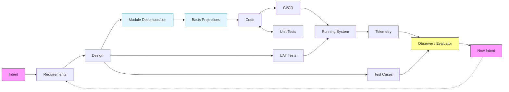

**Every edge is the same operation** — iterative convergence. Each edge traversal runs the inner vector: evaluator detects delta → meaning (what's the gap?) → discovery (what are the options?) → solutioning (construct next candidate).

### 2.2 Graph Properties

- **Directed**: Edges have a source type and target type
- **Cyclic**: Feedback edges (Telemetry → New Intent) create cycles
- **Extensible**: New asset types and edges addable without changing the engine
- **Domain-constructed**: The graph topology is itself a product of abiogenesis (#39) — practice crystallises into encoded structure
- **Not universal**: Different domains produce different graphs. The SDLC graph is one crystallisation. A legal document, a physics paper, an organisational policy each have different graphs
- **Zoomable**: Graph granularity is a choice (see §2.5)

### 2.3 Asset as Markov Object

An asset achieves Markov object status (#7) when:

1. **Boundary** — Typed interface/schema. Requirements have REQ keys and acceptance criteria. Code has interfaces and contracts. Telemetry has metric schemas.
2. **Conditional independence** — Usable without knowing its construction history. Code that passes its tests is interchangeable regardless of who built it. (You don't need the big bang to interact with the insect — just its boundary.)
3. **Stability** — All evaluators for this asset report convergence.

An asset that fails its evaluators is a **candidate**, not a Markov object. It stays in iteration.

The full composite vector carries the complete causal chain (intent, lineage, every decision). The Markov blanket (#8) at each stable asset means practical work is local — you interact through the boundary, not the history. The history is there when you need it (traceability, debugging, evolution).

### 2.4 Graph Construction (Abiogenesis)

The graph topology follows the abiogenesis pattern (#39):

1. **Constraint**: Domain needs, technical limitations, regulatory requirements
2. **Constructor**: Practitioners working, experimenting (practice precedes structure)
3. **Encoding emerges**: Patterns crystallise into a graph topology (e.g., "we always need requirements before design")
4. **Encoding drives constructor**: The graph now directs the process; AI agents follow the encoded decomposition
5. **Graph evolves**: Runtime experience reveals missing asset types or unnecessary edges; the graph updates

The SDLC graph is one such crystallisation. It is not privileged.

### 2.5 Graph Scaling (Zoom)

The graph is **zoomable**. Any edge can be expanded into a sub-graph, and any sub-graph can be collapsed into a single edge. But zoom is not binary — it is **selective**. You can collapse most of a sub-graph while still requiring specific intermediate assets.

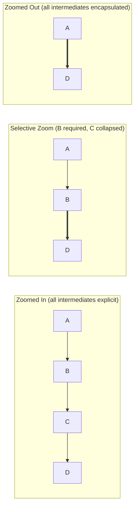

**Zooming in** forces intermediate results to be created as explicit, evaluable assets. **Zooming out** treats the whole sub-graph as a single iterative edge. **Selective zoom** — the common case — collapses some intermediates while retaining others as mandatory waypoints.

Example: a PoC skips formal requirements and UAT but still requires a design document:

```
Full:       Intent → Requirements → Design → Code ↔ Tests → UAT
PoC:        Intent ──────────────→ Design → Code ↔ Tests
                                   ↑ mandatory intermediate
```

You can also zoom in further and require multiple layers within a single asset type. Design might expand into:

```
Design (zoomed out):   |design⟩
Design (zoomed in):    |high_level_design⟩ → |component_design⟩ → |api_spec⟩ → |data_model⟩
Design (selective):    |high_level_design⟩ → |api_spec⟩
```

The **build decomposition** is the canonical example of zoom applied to the Design → Code edge. For complex multi-module systems, the single edge is too coarse — implicit module boundaries lead to interface mismatches and unscheduled builds. Zooming in:

```
Design → Code (zoomed out):
    |design⟩ ═══════════════════════════════════════════► |code⟩

Design → Code (zoomed in):
    |design⟩ → |module_decomp⟩ → |basis_projections⟩ → |code_per_module⟩

Design → Code (selective — module decomp required, basis projections optional):
    |design⟩ → |module_decomp⟩ ═══════════════════► |code_per_module⟩
```

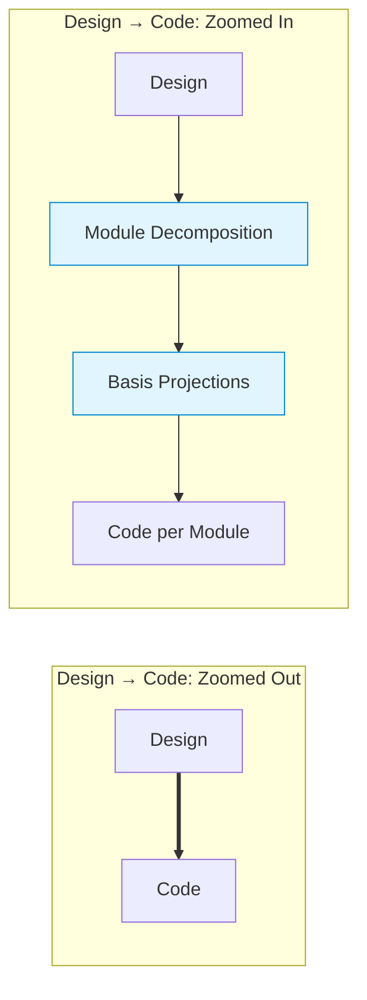

Each intermediate asset:

| Asset | What it produces | Key evaluators |
|-------|-----------------|----------------|
| **Module Decomposition** | Module inventory, dependency DAG, feature-to-module mapping, interface contracts between modules | DAG is acyclic, every REQ key lands in exactly one module, interfaces are explicit |
| **Basis Projections** | Priority-ordered minimal module subsets — each a feature vector projected onto its minimal module basis (§6.7, §11.1) | Each projection is a connected subgraph of the module DAG, priority ranking matches feature priority, converges to Markov object |
| **Code per Module** | Modules built in dependency order — each can see compiled interfaces of its dependencies | Compiles against its dependencies (not guessing at signatures), REQ tags present |

The module decomposition asset is the **Gantt source** — combined with feature priority, it produces the build schedule as a derived projection. Basis projections identify which modules to build first for earliest end-to-end validation.

**Dogfooding observation**: test05 jumped from design to code without the intermediate decomposition. The design doc contained an implicit 8-module DAG, but it was never evaluated as a standalone asset. Result: 4 parallel agents generated 8 modules simultaneously without shared interface contracts, producing ~100 cross-module type mismatches. With module decomposition as an explicit asset, interfaces would have been evaluated before code generation, and modules would have been built in dependency order.

Each intermediate asset that is made explicit gets its own edge, its own evaluators, and its own convergence check. Making an intermediate mandatory means: "this asset must exist as a stable Markov object before the next edge can proceed."

This is an operational choice, driven by Context[]:

| Zoom level | When | What you get |
|------------|------|-------------|
| **Zoomed in** | Regulated environments, complex problems, audit requirements | Full intermediate assets, maximum traceability, higher cost |
| **Selective** | Most real work — skip what's unnecessary, keep what matters | Required intermediates explicit, others collapsed, balanced cost |
| **Zoomed out** | Rapid prototyping, well-understood problems, trusted constructors | Fewer assets, faster delivery, less overhead |

The choice of which intermediates are mandatory is itself Context[] — it can be set at the project level (project_constraints), the feature level (feature vector overrides), or the profile level (projection profiles).

Tests are the canonical example of scale-dependent assurance:

| Scale | Asset being assured | Assurance (evaluator) |
|-------|--------------------|-----------------------|
| Code module | Code | Unit tests |
| Service | Code + unit tests | Integration tests |
| Feature | Req + design + code + tests | UAT |
| Product | All features composed | Production telemetry + homeostasis |

UAT to the software product is as unit tests to a code module — **the same evaluator pattern at a different scale**. Whether UAT is an explicit asset or an inherent evaluator of the composite depends on the zoom level chosen.

The four primitives (Graph, Iterate, Evaluators, Spec+Context) are the same at every scale. The graph is fractal.

### 2.6 The Spec/Design Boundary

The asset graph contains a fundamental boundary between **specification** and **design**:

- **Spec** (Requirements) = **WHAT** the system does. Tech-agnostic. One spec can have many designs.
- **Design** = **HOW** architecturally. Tech-bound — ADRs, ecosystem binding, component architecture.

This boundary is the Requirements → Design edge. Everything upstream of this edge (Intent, Requirements) describes the problem and constraints without committing to technology. Everything downstream (Design, Code, Tests) is bound to a specific technology stack and architecture.

```
                 Spec/Design boundary
                        │
  Intent → Requirements │ Design → Code ↔ Tests → ...
                        │
  WHAT (tech-agnostic)  │  HOW (tech-bound)
  One spec              │  Many possible designs
```

This separation enables:
- **Multiple implementations**: The same spec (REQ-F-AUTH-001) can have `design.claude`, `design.codex`, `design.rust` — different designs for the same requirements. Telemetry enables data-driven variant selection.
- **Technology migration**: Change the design without changing the spec. The requirements survive platform shifts.
- **Disambiguation routing**: When iteration reveals ambiguity, the evaluator routes feedback to the right level — business gap → Spec, technical gap → Design.

#### 2.6.1 Constraint Dimensions at the Design Edge

The Requirements → Design edge is the most consequential transition in the graph. Design must resolve **all disambiguation necessary for code to be constructed**. Each unresolved dimension leaves the design under-constrained — the constructor fills the gap with implicit assumptions that may be wrong.

A **constraint dimension** is a category of decisions that design must explicitly address:

| Dimension | What it resolves | Example |
|-----------|-----------------|---------|
| **Ecosystem Compatibility** | Runtime platform, language version, framework versions, dependency compatibility matrix | Scala 2.13 + Spark 3.5 (not Scala 3 — incompatible) |
| **Deployment Target** | Where and how the system runs, infrastructure assumptions | Kubernetes, serverless, on-premise, hybrid |
| **Security Model** | Authentication, authorisation, data protection, threat model | OAuth2 + RBAC, mTLS, encryption at rest |
| **Data Governance** | Privacy, lineage, retention, compliance frameworks | GDPR, data classification, audit trail |
| **Performance Envelope** | Latency, throughput, resource bounds, scaling strategy | p99 < 200ms, 10k RPS, horizontal scaling |
| **Build System** | Build tool, module structure, dependency management, CI integration | sbt multi-module, Maven, Gradle |
| **Observability** | Logging, metrics, tracing, alerting strategy | OpenTelemetry, structured logging, REQ-key tagging |
| **Error Handling** | Failure modes, retry strategy, circuit breaking, degradation | Fail-fast, retry with backoff, graceful degradation |

These dimensions are **not universal** — they are graph package configuration (§2.8). Different domains have different dimension taxonomies. A legal document graph might have dimensions for jurisdiction, precedent scope, and enforcement mechanism. The SDLC dimensions above are one crystallisation.

**Each dimension resolved adds constraint density** (§5.2) at the design edge. Dogfooding observation: 5/7 bugs found at build time were in dimensions the design left implicit (ecosystem compatibility, build structure). The evaluator bar appeared adequate (1-iteration convergence) precisely because missing dimensions weren't being checked — the evaluator can't detect what the constraint surface doesn't define.

The graph package (§2.8) specifies which dimensions are **mandatory** (must be explicitly resolved via ADRs or design decisions) and which are **advisory** (should be considered but may use implementation defaults). The project binding (§2.8, Layer 3) provides the concrete values for each dimension.

### 2.7 Multiple Implementations Per Spec

A single requirement key can have multiple design variants:

```
REQ-F-AUTH-001 (spec)
  ├── design.claude  → code.python  → tests.pytest
  ├── design.codex   → code.python  → tests.pytest
  └── design.rust    → code.rust    → tests.cargo
```

Each variant is a separate trajectory through the downstream graph, sharing the same upstream spec. The variants can run in parallel, and telemetry from production enables data-driven selection between them. This is the Hilbert space (§11) in action — multiple vectors in superposition until measurement (production telemetry) collapses to the best-performing variant.

### 2.8 Instantiation Layers: Engine, Graph Package, Project Binding

The methodology separates into three layers of increasing specificity. This separation is already implicit in the model — the four primitives are universal (§1), the SDLC graph is one domain-specific instantiation (§2.1), and project constraints are instance-specific (§5.1). Making the layers explicit enables clean packaging and deployment.

```
┌──────────────────────────────────────────────────────────────┐
│  Layer 1: ENGINE (universal)                                  │
│  4 primitives + iterate() + evaluator type taxonomy           │
│  Same across all domains. Never changes per graph or project. │
├──────────────────────────────────────────────────────────────┤
│  Layer 2: GRAPH PACKAGE (domain-specific)                     │
│  Topology + edge configs + constraint dimension taxonomy      │
│  + evaluator checklists + projection profiles                 │
│  One per domain (SDLC, legal, science, ...)                   │
├──────────────────────────────────────────────────────────────┤
│  Layer 3: PROJECT BINDING (instance-specific)                 │
│  project_constraints + context URIs + threshold overrides     │
│  + team conventions + CI/CD integration                       │
│  One per project                                              │
└──────────────────────────────────────────────────────────────┘
```

**Layer 1: Engine** — The four primitives (§1), the iteration function (§3), the evaluator type taxonomy (§4.1), the feature vector formalism (§6), the event sourcing execution model (§7.4), and the **protocol enforcement hooks** (§7.7). These are universal across all domains. A legal document workflow, a physics paper pipeline, and a software SDLC all use the same engine. The hooks are the deterministic evaluator of the iterate protocol itself — they ensure mandatory side effects (event emission, feature vector update, STATUS regeneration) are completed regardless of how the agent chooses to perform generation.

**Layer 2: Graph Package** — A domain-specific instantiation: the graph topology (which asset types exist, which transitions are admissible), edge parameterisations (evaluator checklists and weighting per edge), constraint dimension taxonomy (what disambiguation categories design must resolve — §2.6.1), and projection profiles (full, standard, PoC, spike, hotfix — which edges to traverse, which to collapse). The SDLC graph in §2.1 is one graph package. Different domains produce different packages from the same engine. Each package follows the abiogenesis pattern (§2.4): practitioners in a domain work, patterns crystallise, the topology and edge configs encode those patterns.

**Layer 3: Project Binding** — Instance-specific configuration that binds a graph package to a concrete project: technology constraints (language, frameworks, versions), context URIs (pointers to reference documents, API specs, compliance policies), evaluator threshold overrides (e.g., minimum ADR count, test coverage floor), team conventions (naming, branching strategy), and CI/CD integration details (build commands, deployment targets).

**Context sources** are URI references to external Architecture Decision collections. At project setup, referenced collections are resolved and copied into the local context store. This enables organisation-level standards, team conventions, and platform decisions to flow into project Context[] without duplication or manual management. Sources are copied (not linked) to preserve content-addressable hashing for spec reproducibility (§7.2).

This separation is itself an instance of the ontology's construction pattern (#38):

| Construction pattern | Layer |
|---------------------|-------|
| **Constructor** (universal, substrate-independent) | Engine |
| **Encoded representation** (domain knowledge crystallised) | Graph Package |
| **Construction context** (specific constraints of this instance) | Project Binding |

The three-layer separation explains why the same methodology can produce radically different outcomes in different domains: the engine is invariant, the graph package captures domain expertise, and the project binding captures local constraints. Changing the graph package changes the domain. Changing the project binding changes the project. The engine never changes.

---

## 3. The Iteration Function

### 3.1 Signature

```
iterate(
    Asset<Tn>,              // current asset (carries intent, lineage, full history)
    Context[],              // standing constraints
    Evaluators(edge_type)   // convergence criteria for this edge
) → Asset<Tn.k+1>          // next iteration candidate
```

The prior asset carries everything forward — intent, lineage, all prior decisions. These aren't separate parameters; they're in the vector. Context[] and Evaluators are the external constraints.

This is the **only operation**. Every edge in the graph is this function called repeatedly until evaluators report convergence, at which point the candidate is promoted:

```
while not stable(candidate, edge_type):
    candidate = iterate(candidate, context, evaluators)
return promote(candidate)   // ATn.m becomes ATn+1.0
```

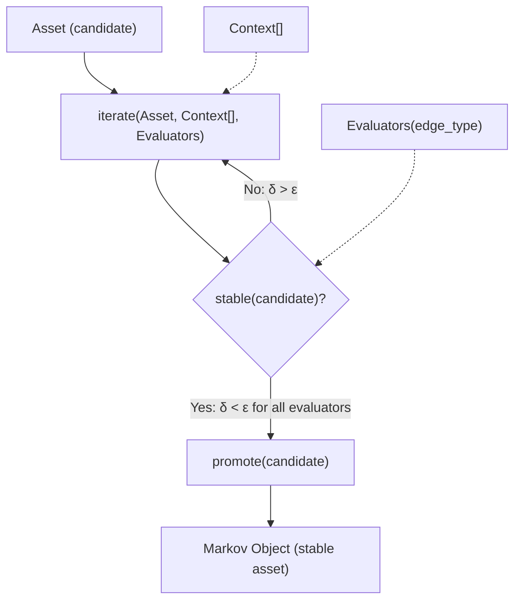

### 3.2 Ontology Mapping

The iteration function is an instance of **local preorder traversal** (#15):

- The **landscape** is the constraint manifold defined by Spec + Context
- The **evaluator** senses the local "slope" (delta between candidate and target)
- The **move** is the next iteration, reducing the delta

The constructor (#41) is whatever implements `iterate` for a given edge: an LLM agent, a human developer, a compiler, a test runner. The function signature is universal; the implementation is edge-specific.

### 3.3 Convergence

```
stable(candidate, edge_type) =
    ∀ evaluator ∈ evaluators(edge_type):
        evaluator.delta(candidate, Spec) < ε
```

Convergence is evaluator-dependent and edge-dependent. The iteration engine is universal. The stopping condition is parameterised.

---

## 4. Evaluators

### 4.1 The Three Evaluator Types

Every evaluation is performed by one or more of:

| Evaluator | Compute Regime | What it does |
|-----------|---------------|-------------|
| **Human** | Judgment | Domain evaluation, business fit, "is this what I meant", approval/rejection |
| **Agent(intent, context)** | Probabilistic (#45) | LLM traversal under constraints — gap analysis, coherence checking, refinement suggestions |
| **Deterministic Tests** | Deterministic (#45) | Pass/fail. Type checks, schema validation, test suites, contract verification, SLA monitors |

All three are instances of **evaluator-as-prompter** (#35): they compute a delta (#36) between current state and target state, then emit a constraint signal that drives the next iteration.

### 4.2 Evaluator Composition Per Edge

Different graph edges use different evaluator combinations:

| Transition | Typical Evaluators |
|-----------|-------------------|
| |intent⟩ → |req⟩ | Human + Agent |
| |req⟩ → |design⟩ | Human + Agent |
| |design⟩ → |code⟩ | Agent + Deterministic Tests |
| |code⟩ → |unit_tests⟩ | Agent + Deterministic Tests |
| |design⟩ → |uat_tests⟩ | Human + Agent |
| |code⟩ → |cicd⟩ | Deterministic Tests |
| |running⟩ → |telemetry⟩ | Deterministic Tests (monitors, alerts) |
| |telemetry⟩ → |new_intent⟩ | Human + Agent |

The edge type determines which evaluators constitute `stable()`. This is configurable, not hardcoded.

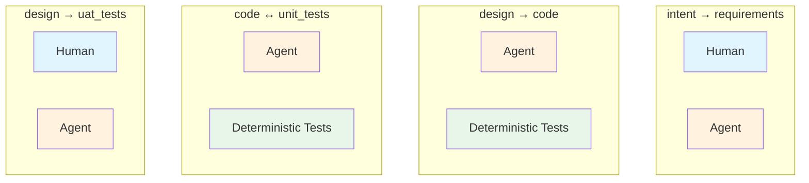

### 4.3 Three Processing Phases

The methodology operates through three processing phases — analogous to the biological nervous system's layered architecture, where signals pass through progressively more expensive processing before reaching deliberative thought:

| Property | Reflex (autonomic) | Affect (limbic) | Conscious (deliberative) |
|----------|-------------------|-----------------|-------------------------|
| **Biological analogy** | Spinal cord / brainstem | Limbic system / amygdala | Frontal cortex / prefrontal |
| **Cognitive analogy** | Kahneman's System 1 (fast, automatic) | Emotional appraisal (valence, urgency) | Kahneman's System 2 (slow, deliberate) |
| **When it fires** | Unconditionally — every iteration, every edge, no exceptions | When reflex processing surfaces a signal — classifies and assigns urgency | When affect phase determines signal warrants deliberation — approval, design, intent |
| **What it does** | Sensing — event emission, test execution, state updates | Triage — signal classification, severity weighting, priority assignment | Direction — judgment, gap assessment, intent generation, spec modification |
| **Evaluator types** | Deterministic Tests | Agent (classification), Threshold rules | Human, Agent (deliberative) |
| **Protocol elements** | Event emission (§7.4), feature vector update, STATUS regeneration, circuit breaker (§7.7.3) | Signal source classification (gap / discovery / ecosystem / optimisation / user / TELEM), severity assessment, escalation decision | Generation, convergence assessment, spawn decisions, spec modification |
| **Failure mode** | Silent — if skipped, observability vanishes | Noise — everything escalates to conscious review, or nothing does | Slow, expensive, may miss gaps |
| **Can be skipped?** | No — protocol hooks enforce mandatory execution (§7.7) | No — but its thresholds can be tuned per profile (§2.6.2) | Yes (projection profiles can omit human evaluator) |

**The biological precedent:** Biological nervous systems are highly optimised versions of this three-phase architecture. Reflexes act on hard-wired inputs because routing through the frontal cortex is frequently too costly and too slow — a threat requires immediate withdrawal, a heartbeat requires no deliberation. After the reflex filter, the limbic system adds **affect**: an emotional assessment of valence and urgency ("should I care about this? how much?"). Only signals that pass this triage reach conscious review for deliberative processing. The optimisation principle: **minimise the load on the most expensive processor** (consciousness) by filtering at cheaper layers first.

**Mapping of methodology elements to processing phases:**

| Element | Phase | Why |
|---------|-------|-----|
| Deterministic tests | Reflex | Fire unconditionally — pass/fail, no judgment |
| Event emission (§7.4) | Reflex | Every iteration appends to events.jsonl — no decision involved |
| Feature vector update | Reflex | State projection updated after every iteration |
| STATUS.md regeneration | Reflex | Derived view recomputed — mechanical, not deliberative |
| Protocol enforcement hooks (§7.7) | Reflex | Deterministic check of iterate side effects — fire-and-verify |
| Circuit breaker (§7.7.3) | Reflex | Automatic regression prevention — triggers on count, not judgment |
| Gap detection (source_findings, process_gaps) | Reflex → Affect | Data collection is reflex (automatic); **classification and severity assessment** is affect |
| Signal source classification | Affect | Categorises delta as gap / discovery / ecosystem / optimisation / user / TELEM — requires pattern recognition, not deliberation |
| Severity / priority weighting | Affect | Assigns urgency: "test regression on main" vs "minor style lint" vs "ecosystem deprecation in 18 months" — emotional valence in biological terms |
| Escalation decision | Affect | Determines whether signal warrants conscious review or can be handled at lower cost (auto-fix, defer, log-and-continue) |
| Threshold tuning (per profile) | Affect | Profiles (§2.6.2) adjust affect sensitivity: hotfix profile escalates everything; spike profile suppresses most signals |
| Human evaluator | Conscious | Requires judgment — approval, rejection, refinement |
| Agent evaluator (deliberative) | Conscious | Requires judgment — gap analysis, coherence assessment, design choice |
| Intent generation | Conscious | Full deliberative review — new intent with causal chain, spec modification, vector spawning |
| Spec modification | Conscious | The self-model update — changes the system's own encoding based on deliberative assessment |

**Key insight: Each phase enables the next.** Reflexes produce the sensory substrate — without automatic event emission at every iteration, the spec review cycle (§7.3) has nothing to observe. Affect triages what the reflexes sense — without signal classification and urgency weighting, conscious processing drowns in noise or starves for input. Consciousness directs from what affect escalates — without deliberative judgment, the system can sense and assess but cannot redirect itself.

A methodology with only reflex processing is mechanical — it can sense but cannot assess or direct. A methodology with reflex and consciousness but no affect is **either overwhelmed** (every signal escalates to expensive deliberation) **or blind** (no signal escalates because there is no triage). The affect phase is the necessary filter that makes consciousness viable at scale. The living system (§7.6) requires all three.

### 4.4 Two Compute Regimes

The evaluators instantiate the ontology's two compute regimes (#45):

- **Probabilistic** (stochastic expansion): LLM generation, design exploration, candidate production — the constructor proposes
- **Deterministic** (verification contraction): test execution, schema validation, contract checking — the evaluator disposes

The specification is the fitness landscape. Probabilistic compute explores it; deterministic compute verifies positions within it.

### 4.5 Two Sensory Systems: Interoception and Exteroception

The three processing phases (§4.3) define *how* signals are processed (reflex → affect → conscious). But they leave open the question: *where do signals come from?* Currently, signals are produced only when the human drives iterate() — reflexes fire during construction, and fall silent between iterations. This is a system with a nervous system but no sensory organs. A living being's senses operate continuously, even at rest.

Biological systems maintain two complementary sensory systems that feed the processing phases:

| System | Direction | Biological | SDLC equivalent |
|--------|-----------|-----------|-----------------|
| **Interoception** | Inward — the system's own state | Visceral senses: hunger, temperature, pH, proprioception, metabolic rate, fatigue | Project health: test suite staleness, dependency freshness, feature vector stall, event log gaps, coverage drift, STATUS age, build health, code/spec drift |
| **Exteroception** | Outward — the external environment | Environmental senses: vision, hearing, touch, smell — detecting threats and opportunities | Ecosystem state: dependency updates, CVE alerts, API deprecations, upstream breaking changes, user feedback channels, runtime telemetry, competitor signals |

**The structural claim:** A system with processing phases but no continuous sensory input is a brain without eyes or gut. It can think when stimulated but cannot notice. Interoception and exteroception are the continuous signal generators that feed the affect phase with raw observations. Without them, the affect phase only fires during explicit iterate() calls — the system sleeps between human-driven actions.

#### 4.5.1 Interoception (Self-Sensing)

Interoceptive monitors observe the system's own health state continuously, independent of iterate() calls:

| Monitor | What it observes | Signal type | Affect threshold example |
|---------|-----------------|-------------|------------------------|
| **Event freshness** | Time since last event in events.jsonl | staleness | > 7 days → escalate |
| **Feature vector stall** | In-progress vectors with no iteration for > N days | stall | > 14 days → escalate |
| **Test health** | Coverage drift, flaky test rate, suite execution time | degradation | Coverage < threshold → escalate |
| **Dependency audit** | Known vulnerabilities in lockfile dependencies | vulnerability | Any CVE severity ≥ high → escalate |
| **Build health** | CI/CD pass rate, build duration trends | degradation | Failure rate > 20% → escalate |
| **Spec/code drift** | Code diverged from spec assertions (REQ tags missing, stale) | drift | Any untagged code in traced module → escalate |
| **STATUS freshness** | STATUS.md age vs last event timestamp | staleness | Stale > 1 day → auto-regenerate (reflex) |

Interoceptive signals are the system's *proprioception* — its sense of where its own body parts are. A project that cannot sense its own test coverage drift or dependency staleness is numb to internal decay.

#### 4.5.2 Exteroception (Environment-Sensing)

Exteroceptive monitors observe the external environment continuously:

| Monitor | What it observes | Signal type | Affect threshold example |
|---------|-----------------|-------------|------------------------|
| **Dependency ecosystem** | New major versions, deprecation notices, EOL announcements | ecosystem_change | Major version → escalate |
| **CVE feeds** | Published vulnerabilities affecting project dependencies | security | Severity ≥ medium → escalate |
| **Runtime telemetry** | Error rates, latency, SLA violations tagged with REQ keys | runtime_deviation | Error rate > baseline + 2σ → escalate |
| **User feedback** | Support tickets, feature requests, bug reports | user_signal | Cluster of 3+ similar reports → escalate |
| **API contract changes** | Upstream API breaking changes, deprecation headers | contract_break | Any breaking change → escalate |
| **Regulatory/compliance** | New regulations affecting project domain | compliance | Any applicable regulation → escalate |

Exteroceptive signals are the system's *vision and hearing* — its awareness of the world it operates in. A project that cannot sense an upstream API deprecation or a CVE in its dependencies is blind to external threats.

#### 4.5.3 Sensory Systems and the Processing Pipeline

The two sensory systems feed into the three processing phases as a continuous pipeline:

```
INTEROCEPTION                    EXTEROCEPTION
(self-sensing)                   (environment-sensing)
  │ event freshness                │ dependency updates
  │ test health                    │ CVE feeds
  │ vector stalls                  │ runtime telemetry
  │ build health                   │ user feedback
  │ spec/code drift                │ API changes
  └──────────┐          ┌─────────┘
             ▼          ▼
        ┌─────────────────────┐
        │    REFLEX PHASE     │ raw signal detection
        │   (autonomic)       │ threshold comparison
        └─────────┬───────────┘
                  ▼
        ┌─────────────────────┐
        │    AFFECT PHASE     │ classify source + severity
        │   (limbic triage)   │ escalation decision
        └────┬──────────┬─────┘
             │          │
    [defer]  ▼     [escalate] ▼
         log-only    ┌─────────────────────┐
                     │  CONSCIOUS PHASE    │ intent generation
                     │  (deliberative)     │ spec modification
                     └─────────────────────┘
```

The critical property: interoception and exteroception run **independently of iterate()**. They are background processes (biological analogy: the autonomic nervous system runs whether you are thinking or not). They produce signals that accumulate, and the affect phase processes them either on a schedule or when the human next engages. This means the system can detect "your dependencies have a critical CVE" or "feature vector FV-AUTH-001 has been stalled for 3 weeks" even when no one is actively developing.

**Implementation note:** The sensory systems are themselves parameterisable via projection profiles (§2.6.2). A hotfix profile may disable exteroception entirely (irrelevant during emergency fix). A spike profile may run only interoception (checking test health but not scanning for ecosystem changes). A full profile runs both continuously.

#### 4.5.4 Sensory Service Architecture

The sensory systems (interoception + exteroception + affect triage) are not bolt-on services external to the methodology. **Sensing is a core capability of the methodology system itself** — part of Genesis. The sensory-gradient loop is as fundamental as iterate(); the system that cannot sense is not alive (§7.6).

**Service model:** The sensory loop runs as a **long-running service** (MCP server in the Claude Code binding) that:

1. **Watches the workspace** — file system events, event log growth, feature vector changes
2. **Runs monitors on schedule** — interoceptive and exteroceptive monitors execute on configurable intervals (or on workspace open)
3. **Performs affect triage** — rule-based classification (severity thresholds, signal source matching) with agent-classified escalation for ambiguous signals (tiered: rules first, agent only when rules are insufficient)
4. **Generates homeostatic responses** — for signals that warrant action, calls Claude headless to produce **draft proposals only** (proposed intent events, proposed diffs, proposed spec modifications). The service does NOT modify files autonomously.
5. **Exposes proposals at the review boundary** — MCP tools surface draft proposals to the interactive Claude session. The human approves, modifies, or dismisses through the interactive loop.

**Two distinct event categories:**

| Category | Autonomy | Examples | Approval required |
|----------|----------|---------|-------------------|
| **Sensor/evaluate events** | Autonomous — the service observes and classifies without human involvement | `interoceptive_signal`, `exteroceptive_signal`, `affect_triage` | No — these are observations, not changes |
| **Change-approval events** | Conscious — requires human decision at the review boundary | `draft_proposal` → human review → `intent_raised`, `spec_modified` | Yes — proposals become changes only with human approval |

**The monitor rides the telemetry:** The methodology system (Genesis) produces events as it operates — event emission at every iterate() boundary, feature vector updates, STATUS regeneration. An external observer (e.g., `genesis_monitor`) **consumes this telemetry** — it reads the event stream that Genesis produces. The monitor is an observer of telemetry, not the sensor itself. The sensory service is the sensor; the monitor is a consumer of what the sensor and the methodology jointly produce. Future alignment with common telemetry interpretation libraries (OpenTelemetry, etc.) is anticipated — the event log format (§7.4) is designed to be portable.

**Review boundary as architectural invariant:** The separation between autonomous sensing and human-approved changes is not a policy choice — it is a structural invariant. The sensory service can observe anything, classify anything, and draft anything. But it cannot change the spec, cannot modify code, cannot emit `intent_raised` events. Only the interactive session (with human in the loop) can cross the review boundary. This preserves REQ-EVAL-003 (Human Accountability) while enabling continuous autonomous sensing.

```
┌─────────────────────────────────────────────────────────────────┐
│                   SENSORY SERVICE (MCP Server)                    │
│                                                                   │
│  ┌──────────────┐  ┌──────────────┐  ┌─────────────────────┐   │
│  │ Interoceptive│  │ Exteroceptive│  │ Affect Triage       │   │
│  │ Monitors     │  │ Monitors     │  │ (rule + agent-class)│   │
│  │ INTRO-001..7 │  │ EXTRO-001..4 │  │                     │   │
│  └──────┬───────┘  └──────┬───────┘  └─────────┬───────────┘   │
│         │                  │                     │               │
│         └──────── signals ─┴─────────────────────┘               │
│                            │                                      │
│                     ┌──────┴──────┐                               │
│                     │ Claude      │                               │
│                     │ Headless    │  draft proposals only         │
│                     └──────┬──────┘                               │
│                            │                                      │
│  ═══════════════ REVIEW BOUNDARY (MCP tools) ═══════════════════ │
│                            │                                      │
└────────────────────────────┼──────────────────────────────────────┘
                             │
                             ▼
┌─────────────────────────────────────────────────────────────────┐
│              INTERACTIVE SESSION (Human in loop)                  │
│                                                                   │
│  Human reviews proposals → approve / modify / dismiss            │
│  Approved proposals → intent_raised / spec_modified events       │
│  Changes applied to workspace                                    │
└─────────────────────────────────────────────────────────────────┘
```

**Traces To**: §4.5.1 (Interoception), §4.5.2 (Exteroception), §4.5.3 (Processing Pipeline), §4.3 (Three Processing Phases), §7.3 (Spec Review — stage 4) | Ontology #49 (teleodynamic — self-maintaining), #35 (evaluator-as-prompter)

---

## 5. Context: The Constraint Surface

### 5.1 What Context Contains

Context[] is the standing constraint surface — the collection of constraint documents that bound what the constructor can produce:

```
Context[] = {
    User Disambiguations,       // human clarifications of intent
    ADRs,                       // tech stack, environment, architectural decisions
    Data Models,                // schemas, contracts, data lineage
    Templates,                  // structural patterns, code standards
    Prior Implementations,      // previous versions of this component
    Policy,                     // security, compliance, organisational rules
    Graph Topology,             // the asset graph itself
    ...                         // open-ended, not a fixed list
}
```

Note: the **graph topology is Context[]**. The choice of which asset types and which edges exist is a standing constraint, not a universal law.

### 5.2 Context as Constraint Density

Each Context element narrows the space of admissible constructions:

```
Intent alone:           vast possibility space (degeneracy → hallucination)
+ ADRs:                 narrows to tech stack
  + Data Models:        narrows to schema-compatible
    + Templates:        narrows to pattern-conformant
      + Policy:         narrows to compliant
        + Prior:        narrows to evolution-of-existing
```

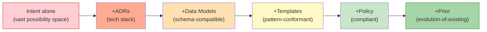

This is the ontology's constraint density (#16) in action. Sparse constraints → probability degeneracy (#54) → hallucination/failure. Dense constraints → stable Markov objects (#7). **Context is what prevents hallucination in the construction process.**

### 5.3 Context Stability

Context is largely **shared across the graph**. ADRs, Data Models, Policy — these don't change per edge. They are the standing constraint surface. What changes per edge is which subset is relevant and how the constructor weights them.

Context itself evolves, but on a slower timescale than assets. This is the ontology's scale-dependent time (#23): the constraint surface updates slowly while components iterate rapidly upon it.

---

## 6. Feature Vectors: Trajectories Through the Graph

### 6.1 Feature as Composite Vector

A **feature** is the composite of all assets produced along its trajectory through the graph:

```
Feature F = |req⟩ + |design⟩ + |module_decomp⟩ + |basis_projections⟩ + |code⟩ + |unit_tests⟩ + |uat_tests⟩ + |cicd⟩ + |telemetry⟩
```

Each component is a stable asset produced by iterating along an edge. The REQ key is the **vector identifier** — it tags which trajectory all these assets belong to. A feature is **complete** when all its edge-produced assets have converged to Markov objects. Components like |module_decomp⟩ and |basis_projections⟩ are present when the graph is zoomed in at the build decomposition level (§2.5); at zoomed-out level they collapse into the Design → Code edge.

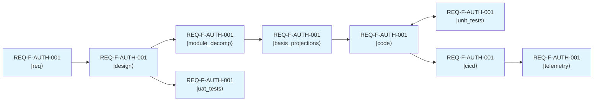

### 6.2 Intent Lineage

Intent lineage is the feature's **accumulated state** across all edges: the original intent, every intermediate candidate produced, every decision made, every constraint satisfied. It is the full traceability chain, carried forward in each asset (§2.3).

This is the ontology's constraint propagation (#2) through the asset graph. REQ-F-AUTH-001 propagating across edges is a constraint signal maintaining coherence across the entire composite vector.

### 6.3 Feature Lineage in Code and Telemetry

REQ keys are not just documentation — they are **runtime-observable identifiers** that thread from spec to production:

```
Spec:        REQ-F-AUTH-001 defined
Design:      Implements: REQ-F-AUTH-001
Code:        # Implements: REQ-F-AUTH-001
Tests:       # Validates: REQ-F-AUTH-001
Telemetry:   logger.info("login", req="REQ-F-AUTH-001", latency_ms=42)
```

The tag format (`Implements: REQ-*`, `Validates: REQ-*`) is the contract. The comment syntax is language-specific (`#` for Python, `//` for Go/JS, `--` for SQL). In telemetry, the REQ key appears as a structured field in logs, metrics, and traces.

This makes features **observable at runtime**: you can query production telemetry by REQ key to see how a specific requirement behaves in production, measure latency per feature, detect regressions per feature, and route incidents back to the originating requirement.

### 6.4 Feature Views

A **feature view** is a generated cross-artifact status report for a single REQ key, produced by grepping the tag format across all artifacts:

```
Feature View: REQ-F-AUTH-001
────────────────────────────
Spec:       specification/requirements.md            ✓ defined
Design:     imp_auth/design/DESIGN.md               ✓ component traced
Code:       src/auth/login.py:23                   ✓ Implements: REQ-F-AUTH-001
Tests:      tests/test_login.py:15                 ✓ Validates: REQ-F-AUTH-001
Telemetry:  dashboards/auth.json                   ✓ req="REQ-F-AUTH-001"
Coverage:   5/5 stages tagged
```

Feature views are generated at every stage — they are the mechanism for answering "where is this feature in the graph?" at any point in time. The view is computed by searching for the REQ key across all artifacts, not maintained as a separate document.

This is the practical realisation of the composite vector (§6.1): the feature view shows the vector's current projection onto each basis component.

### 6.5 Feature Dependencies

Features can depend on other features. Feature B's code asset might require Feature A's code asset to be stable first:

```
Feature A: |req⟩ → |design⟩ → |code⟩●
                                     │ dependency
Feature B: |req⟩ → |design⟩ → |code⟩ → |tests⟩
```

Dependencies are between features (or their component assets), not between pipeline stages. This is a cross-vector constraint.

### 6.6 Task Planning as Trajectory Optimisation

Tasks **emerge** from feature vector decomposition (#3, generative principle):

1. **Decompose** intent into feature vectors
2. **Trace** each vector's trajectory through the graph
3. **Identify** dependencies between assets across features
4. **Compress**: batch independent edges (parallel work), sequence dependent ones
5. **Result**: the task graph — with dependency order, parallelisation, and batching

```
                    Feature Vectors (trajectories through the graph)
                    ┌─ F1 = |req⟩ → |design⟩ → |code⟩ → |tests⟩
Spec + Context[] →  ├─ F2 = |req⟩ → |design⟩ → |code⟩ → |tests⟩
                    └─ F3 = |req⟩ → |code⟩ → |tests⟩
                                       ↑
                                F3.|code⟩ depends on F1.|design⟩

Task Graph = compress(F1 ∥ F2, F1.|design⟩ < F3.|code⟩)
```

### 6.7 Basis Projections and Parallel Feature Execution

When the Design → Code edge is zoomed in (§2.5), the **module decomposition** and **basis projection** assets enable a finer-grained task scheduling strategy.

A **basis projection** is the projection of a feature vector onto its minimal module basis (§11.1) — the smallest subset of modules that makes one priority feature work end-to-end. The term is native to the Hilbert space formalism: each feature vector lives in the space spanned by all module basis vectors; a basis projection selects the minimal subspace that preserves the feature's observable properties. Once a basis projection converges, it becomes a **Markov object** — a stable, tested, end-to-end slice that downstream work can depend on without knowing its construction history.

```
Module Decomposition (from Design):
    model ← compiler ← runtime ← spark ← lineage ← ai ← context ← testkit

Basis Projection 1 (structural mapping):   model → compiler(path) → runtime(exec) → spark
Basis Projection 2 (lossy aggregation):    model → compiler(+grain) → runtime(+fold) → spark
Basis Projection 3 (full lineage):         model → compiler → runtime → lineage → spark
```

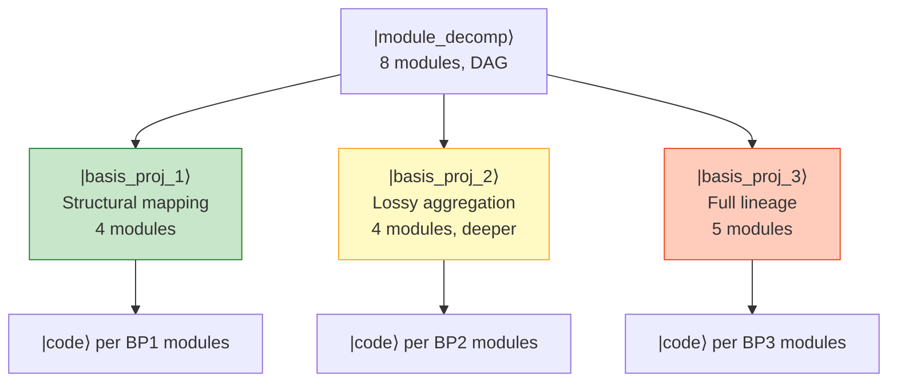

**Key property**: basis projections that share no modules are **orthogonal** (§11.1) — they can execute in parallel with zero coordination. Projections that share modules must build the shared modules first, then diverge. This is the Hilbert space inner product made operational: features with zero shared modules have zero inner product and are fully parallelisable.

Each converged basis projection is a Markov object (§2.3):
- **Boundary**: Its public interfaces, the features it proves, the tests it passes
- **Conditional independence**: Downstream projections can build on it without knowing how it was constructed
- **Stability**: All evaluators for this slice report convergence (compiles, tests pass, REQ keys traced)

The basis projection schedule — the Gantt chart — is a **derived projection** (§7.4.2) computed from:
- Module dependency DAG (from |module_decomp⟩)
- Feature-to-module mapping (from REQ key traceability)
- Feature priority (from requirements / intent)
- Basis projection convergence events (from events.jsonl)

This enables incremental delivery: working software after the first basis projection converges, progressively richer after each subsequent one. The methodology produces not just code but an **observable build plan** — a Gantt that updates as basis projections converge.

---

## 7. The Full Lifecycle

### 7.1 The Gradient

The parent theory (Constraint-Emergence Ontology) identifies one computation applied everywhere there is a gradient:

```
delta(state, constraints) → work
```

When `delta → 0`, the system is at rest at that scale. When `delta > 0`, work is produced to reduce the gradient. This is the same operation at every scale of the methodology — only the state and constraints change:

| Scale | State | Constraints | When delta → 0 |
|-------|-------|-------------|----------------|
| **Single iteration** | candidate asset | edge evaluators | evaluator passes |
| **Edge convergence** | asset at iteration k | all evaluators for edge | Markov object stabilises |
| **Feature traversal** | feature vector | graph topology + profile | feature converged |
| **Project completion** | all vectors | all features × all edges | ALL_CONVERGED |
| **Production homeostasis** | running system | spec (SLAs, contracts, health) | system within bounds |
| **Spec review** | workspace state | the spec itself | spec and workspace aligned |
| **Constraint surface update** | irreducible delta | observation that the surface is wrong | new ground states defined |

The last two rows are what was previously called the "consciousness loop." They are the same `delta(state, constraints) → work` where the constraints themselves are the object of evaluation and update.

**Deacon hierarchy mapping**: The gradient at progressively larger scales corresponds to Terrence Deacon's hierarchy of emergent dynamics:

| Deacon level | Methodology scale | What maintains itself |
|---|---|---|
| **Homeodynamic** | Single iteration | Candidate asset converging toward evaluator pass |
| **Morphodynamic** | Edge / feature convergence | Feature vector traversing the graph — pattern formation |
| **Teleodynamic** (#49) | Production homeostasis | Running system maintaining its own boundary conditions |
| **Beyond Deacon** | Spec review + constraint update | The constraint surface itself updating from experience — the system modifies what "correct" means |

There is no phase transition between these levels. The same `delta(state, constraints) → work` operates throughout. Complexity emerges because at larger scales, the constraints themselves become state for the next level. The spec that bounds production homeostasis is itself subject to gradient pressure from observations that the spec is wrong or incomplete.

The formal Hamiltonian (§11.2) captures this: `H(edge) = T(iteration_cost) + V(constraint_delta)`. When the spec updates (§7.3), the Hamiltonian shifts — former ground states acquire potential energy under the new constraints. The gradient is what drives the system back toward new minima.

**The spec as constraint surface**: The spec is the reference frame against which all observation is evaluated:

```
Spec = target manifold (encoded boundary conditions)
Observed = current state (assets, running system, telemetry)
Delta = Spec - Observed = gradient signal
```

Every signal source feeds into the spec, and the spec re-expresses non-zero deltas as feature vectors — the system's directed responses:

| Signal source | Example | Spec impact | Re-expressed as |
|---|---|---|---|
| **Gaps** (from iterate process_gaps) | Design edge missing security dimension | Spec adds constraint dimension | Feature vector: update all designs to address security |
| **Discoveries** (from PoC/spike vectors) | "We can use vector DB for this" | Spec adds new capability | Feature vector: integrate vector DB, update design |
| **Ecosystem evolution** | Language version upgrade, library deprecated | Spec updates tech constraints | Feature vector: migration, version adaptation |
| **Optimisation** (from telemetry) | P99 latency 3x budget | Spec tightens performance bounds | Feature vector: optimise hot path |
| **User feedback** (human evaluator) | "Search should support fuzzy matching" | Spec adds new requirement | Feature vector: new feature REQ-F-SEARCH-002 |
| **Methodology self-observation** (TELEM) | Evaluator skip rate too high | Graph package updates edge config | Meta-vector: improve edge parameterisation |

The spec is the system's **evolving self-model** — it absorbs signals from all sources and re-expresses them as feature vectors. The composite vector space (§11.1) represents the system's **total intentional state**: everything it is currently doing in response to everything it knows. This is the abiogenesis insight (#39) completing itself: the methodology starts as a pipeline (constructor without feedback), then the feedback loop closes (encoding updates from observation), and the system becomes self-maintaining (#49). The graph topology itself can evolve through this process.

### 7.2 The Gradient at Production Scale

The deployed, running system is itself a Markov object (#7):

- **Boundary**: Its interfaces, SLAs, contracts, health endpoints
- **Internal dynamics**: Its runtime behaviour
- **Conditional independence**: It runs without knowing how it was built

Production homeostasis is `delta(running_system, spec) → correction` — the same gradient operation applied to the running system. When the running system deviates from the spec's boundary conditions (SLA violation, error rate spike, contract breach), the delta is non-zero and the system produces work to restore alignment.

```
Feature vectors (composite) → edge convergence → |cicd⟩ → |running⟩
                                                                    │
         ┌──────────────────────────────────────────────────────────┘
         ▼
   |telemetry⟩ (tagged with REQ keys)
         │
         ▼
   delta(running_system, spec) > 0?
         │                    │
        no                   yes → gradient non-zero
         │                    │
         ▼                    ▼
     continue          Observer/Evaluator
                              │
                              ▼
                       |new_intent⟩ (new feature vectors)
                              │
                              ▼
                       back into the graph
```

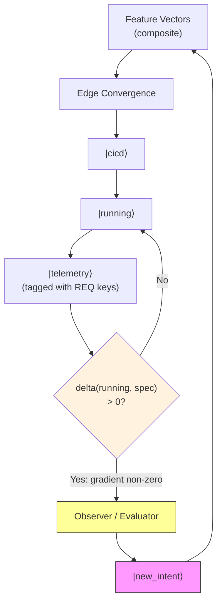

The Observer/Evaluator at runtime uses the same three evaluator types:

| Evaluator | At Runtime |
|-----------|-----------|
| **Human** | User feedback, business review, incident response |
| **Agent(intent, context)** | Anomaly detection, pattern analysis, intent discovery |
| **Deterministic Tests** | Alerting thresholds, SLA checks, health probes, contract monitors |

The full lifecycle includes deployment, runtime, and feedback assets in the graph:

| Lifecycle stage | Assets | Gradient check |
|-------|--------|---------------|
| **Build** | |req⟩ → |design⟩ → |code⟩ → |tests⟩ → |uat⟩ | `delta(candidate, edge_evaluators) → work` |
| **Deploy** | |cicd⟩ | `delta(package, deploy_checks) → work` |
| **Observe** | |telemetry⟩ | Metrics, logs, traces — tagged with REQ keys |
| **Maintain** | Running system | `delta(running_system, spec) → correction` |
| **Discover** | |new_intent⟩ | `delta(workspace, spec) → new_vectors` (§7.3) |

### 7.3 Spec Review as Stateless Gradient Check

The gradient at the largest development scale is: `delta(workspace_state, spec) → intents`. This is the same `delta(state, constraints) → work` applied at the workspace-spec scale. The spec is the constraint surface; the workspace is the state; non-zero deltas produce intents.

This operation — previously called the "consciousness loop" — is a **stateless function**: given the same workspace state and the same spec, it produces the same intents. It spans all three processing phases (§4.3):

```
1. |spec⟩ defines bounds (the constraint surface)
         │
         ▼
2. Construction: feature vectors traverse the graph via iterate()           ─┐
         │                                                                   │ REFLEX
         ▼                                                                   │ (autonomic)
3. |running⟩ + |telemetry⟩ — the system operates and is observed           ─┘
         │
         ▼
4. delta(|workspace⟩, |spec⟩) — gradient computed                          ─┐
   + sensory service feeds continuously (§4.5.4):                           │
     interoceptive signals (self-health) +                                  │ AFFECT
     exteroceptive signals (environment) +                                  │ (limbic)
     iterate()-produced deltas                                              │
         │                                                                   │
         ▼                                                                   │
4b. Signal triage — classify source, assess severity, decide escalation     ─┘
         │
         ├──→ [delta below threshold] log, defer, or auto-handle (no escalation)
         │
         ▼ [delta above threshold]
5. intent_raised event — deliberative review, event-logged, spawns vectors  ─┐
         │                                                                   │ CONSCIOUS
         ▼                                                                   │ (deliberative)
6. spec_change_event — the constraint surface updates, update is recorded   ─┘
         │
         └──→ back to 1 (the updated spec defines new bounds)
```

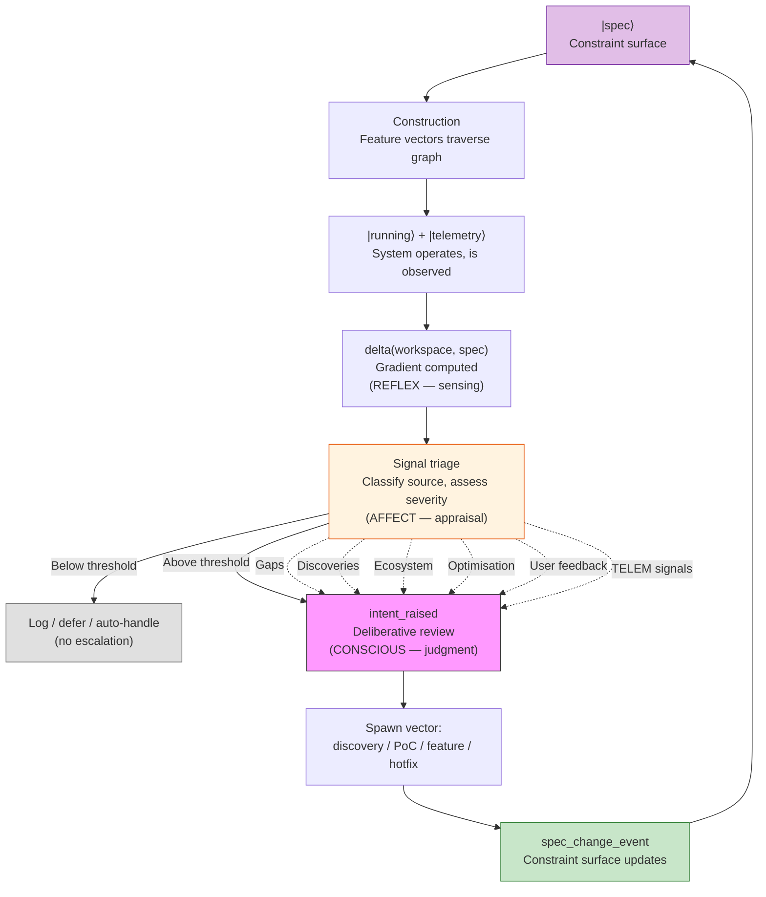

**Stage 4b (affect) is the critical filter.** It determines which deltas reach conscious processing. A test regression on the main branch has high severity — escalate immediately. A minor lint warning has low severity — log and defer. An ecosystem deprecation with an 18-month timeline has medium severity — escalate but at low priority. The affect phase prevents consciousness from being overwhelmed by signal volume. Profile settings (§2.6.2) tune the affect thresholds: a hotfix profile escalates aggressively (low threshold); a spike profile suppresses most signals (high threshold).

The critical structural property: the spec modification at stage 6 is itself an **event** (§7.4). It is appended to the event log, making it available for projection, audit, and — crucially — further observation. The system can observe its own spec modifications, evaluate whether they improved outcomes, and modify its modification strategy.

#### 7.3.1 Intent Events as First-Class Objects (`intent_raised`)

For the spec review to close with full traceability, the `intent_raised` event must capture not just "what to build" but the complete causal chain:

| Field | What it records | Why it matters |
|---|---|---|
| `trigger` | Which signal(s) caused this intent | Traceability — why did we notice? |
| `delta` | Spec vs observation deviation | The observation — what did we see? |
| `signal_source` | gap / discovery / ecosystem / optimisation / user / TELEM | Classification — what kind of signal? (affect phase, §4.3) |
| `vector_type` | discovery / PoC / feature / hotfix / spike | The response — how do we respond? |
| `spec_impact` | Which REQ keys / spec sections affected | The constraint surface update — what changes? |
| `spawned_vectors` | Feature IDs spawned from this intent | The action — what vectors enter the graph? |
| `prior_intents` | Chain of intent events that led here | Reflexivity — have we seen this before? |

The `prior_intents` field closes the reflexive loop. If intent A modifies the spec, the modified spec triggers intent B, and intent B traces back to A — the system detects that its own modification caused a new deviation. This is the structural property that distinguishes spec review from a simple feedback loop: **awareness of the consequences of one's own constraint surface changes**.

#### 7.3.2 Spec Change Events

When the spec absorbs a signal and updates, it emits a `spec_modified` event:

```json
{
  "event": "spec_modified",
  "trigger_intent": "INT-2026-042",
  "signal_source": "ecosystem",
  "what_changed": ["REQ-NF-COMPAT-001 updated: Scala 2.13 → 3.x"],
  "why": "Scala 2.13 end-of-life detected via ecosystem monitoring",
  "affected_req_keys": ["REQ-NF-COMPAT-001", "REQ-NF-BUILD-003"],
  "spawned_vectors": ["FV-MIGRATION-001"],
  "prior_intents": ["INT-2026-038"],
  "timestamp": "2026-03-15T10:00:00Z"
}
```

These events enable:

- **Spec archaeology**: Why does REQ-NF-COMPAT-001 say Scala 3.x? Because `spec_modified` event at timestamp T traced it to ecosystem signal
- **Feedback loop detection**: Intent A → spec change → intent B → spec change → ... if intent B traces back to A, the loop is visible
- **Impact analysis**: When a spec change spawns vectors, and those vectors produce telemetry, and that telemetry triggers new intents — the full causal chain is in the event log
- **Rate of evolution**: How often does the spec change? Which sections are volatile? Which are stable? All derivable from `spec_modified` events

### 7.4 Event Sourcing: Immutable Facts and Derived Projections

The methodology's execution model is **event sourcing**: all state changes are recorded as immutable events, and all observable state is a projection (derived view) of the event history.

#### 7.4.1 Events as Immutable Facts

Each methodology action produces an immutable event:

```json
{
  "type": "iteration_completed",
  "edge": "requirements_design",
  "feature": "REQ-F-AUTH-001",
  "iteration": 2,
  "evaluators": {"agent": "converged", "human": "pending"},
  "timestamp": "2026-02-20T14:30:00Z",
  "context_hash": "sha256:a1b2c3..."
}
```

Events record **what happened**, not what the current state is. The event log is append-only — no event is ever modified or deleted. This is the ontology's core claim made operational: the constraint network computes forward from its current state (§10.3 of the ontology, the unit of change). The past state was consumed in producing the current one; only the record of what happened persists.

Event types (values of the `event_type` field, aligned with iterate agent contract):

| Type | When emitted | Defined in |
|---|---|---|
| `iteration_completed` | Every iterate() cycle | Agent §Step 5a |
| `edge_started` | First iteration on an edge for a feature | Agent §Step 1 |
| `edge_converged` | All evaluators pass for an edge | Agent §Step 6 |
| `evaluator_ran` | Individual evaluator execution | §4.1 |
| `finding_raised` | Gap detected (backward/forward/inward) | §3.1 |
| `context_added` | New context attached to an edge | §5.1 |
| `feature_spawned` | New feature vector created | §6.5 |
| `feature_folded_back` | Discovery/spike results folded into parent | §6.5 |
| `telemetry_signal_emitted` | Methodology self-observation signal | §7.5 |
| `spec_modified` | Spec absorbs signal, updates | §7.3.2 |
| `intent_raised` | Deviation triggers new intent with causal chain | §7.3.1 |
| `claim_rejected` | Feature+edge already claimed by another agent | §12 (REQ-COORD-002) |
| `edge_released` | Agent voluntarily abandons an edge claim | §12 (REQ-COORD-002) |
| `claim_expired` | No event from active agent within timeout | §12 (REQ-COORD-002) |
| `convergence_escalated` | Agent converges outside role authority | §12 (REQ-COORD-005) |

Note: `edge_claim` is an **inbox-local** event in multi-agent mode — it is emitted to the agent's private inbox and never appears in the canonical event log. The serialiser transforms it into `edge_started` (granted) or `claim_rejected` (conflict). In single-agent mode, the agent emits `edge_started` directly with no claim step. See §12 (Multi-Agent Coordination) for the full protocol.

Implementation-level event types (e.g., `project_initialized`, `checkpoint_created`, `review_completed`, `release_created`, `gaps_validated`) are defined in the iterate agent's Event Type Reference — the authoritative schema catalogue for all concrete event schemas.

#### 7.4.2 Projections as Derived Views

All methodology state is computed from the event log:

| Projection | Derived from | Purpose |
|-----------|-------------|---------|
| **STATUS** | All events | Current state of all edges, features, evaluators |
| **Feature vectors** | Edge convergence events | Which features have converged at which edges |
| **Task lists** | Feature decomposition + dependency events | What work remains, in what order |
| **Feature views** | Tag-grepping events + artifact state | Per-REQ cross-artifact status (§6.4) |
| **Telemetry signals** | Observer evaluation events | Self-observation of methodology performance (§7.5) |
| **Gap analysis** | Finding events + evaluator results | What the methodology missed and why |

Projections are **re-derivable**: given the event log, any projection can be reconstructed at any point in time. This provides:

- **Auditability**: The full history of every decision and evaluation
- **Reproducibility**: Any past state can be reconstructed from events
- **Evolution**: New projections can be added without changing the event log
- **Debugging**: When a methodology run produces unexpected results, the event log shows exactly what happened

#### 7.4.3 Ontology Connection

The event log is the methodology's analogue of the constraint network's evolution history. Projections are manifold-level observables — the views that emerge when the raw event stream is coarse-grained through a particular lens.

This is the same relationship as:

| Domain | Event stream | Projection |
|--------|-------------|-----------|
| **Physics** | Constraint network evolution | Spacetime, particles, gravity |
| **LLM** | Forward pass activations | Token probabilities, output text |
| **SDLC** | Methodology events (edge iterations, evaluator results) | STATUS, feature vectors, task lists |
| **Biology** | DNA replication + transcription events | Phenotype, organism behaviour |

The event sourcing model is an engine-level primitive (§2.8, Layer 1) — it applies regardless of which graph package or project binding is in use.

### 7.5 Methodology Self-Observation

The methodology observes itself using the same evaluator pattern it uses for artifacts. The observer/evaluator at the telemetry→intent edge (§7.3) applies not only to the running system but to the **methodology's own performance**.

**Telemetry signals** (TELEM) are the methodology's self-evaluation:

| Signal | What it observes | What it means |
|--------|-----------------|---------------|
| Iteration counts per edge | How many iterations before convergence | Low counts may indicate evaluator bar too low |
| Evaluator skip counts | How many deterministic checks were skipped | Missing build environment or skip policy gap |
| Finding redundancy | Same gaps rediscovered across edges | Missing back-propagation mechanism |
| Source vs output structure mismatch | Design structure doesn't match build structure | Design edge missing build_system dimension (§2.6.1) |
| Build success/failure | Whether the constructed artifact compiles and passes tests | Construction validation — the ultimate evaluator |
| Bug category at build time | Which evaluator *should* have caught each bug | Maps directly to evaluator gaps and missing constraint dimensions |

These signals feed back into the **graph package** (§2.8, Layer 2). They are the mechanism by which the methodology's own topology and evaluator checklists evolve. This is the abiogenesis pattern (§2.4) operating at the meta-level: running the methodology reveals gaps, which crystallise into improved edge configurations and constraint dimension taxonomies.

The methodology is a Markov object that maintains itself (#49 — teleodynamic status). The self-observation loop is the same construct at two levels:

```
Level 1 (product):     |running_system⟩ → |telemetry⟩ → |observer⟩ → |new_intent⟩
Level 2 (methodology): |methodology_run⟩ → |TELEM_signals⟩ → |observer⟩ → |graph_package_update⟩
```

Both levels use the same three evaluator types (§4.1). Both produce events (§7.4). Both close the feedback loop from observation to specification update.

### 7.6 The Living System

When the spec updates via the gradient check (§7.3), the Hilbert space (§11.1) undergoes a **basis change**:

- **New basis vectors appear**: A new requirement (REQ-F-SEARCH-002) adds a dimension to the vector space. New feature vectors can now exist in this dimension.
- **Existing vectors shift**: An ecosystem migration changes the design constraints. Code that was at ground state (§11.2) under the old spec has high potential energy under the new spec — it "wants" to move.
- **Hamiltonian shifts**: The potential energy landscape V(constraint_delta) is redefined by the spec update. What was optimal is no longer optimal. New ground states exist.
- **Vectors are spawned**: Each spec change spawns one or more feature vectors (discovery, PoC, feature, hotfix) that enter the graph and traverse edges via iterate().

The total intentional state — the superposition of all in-flight feature vectors — is the system's response to **everything it knows**, continuously updated as the spec absorbs new signals. This is the gradient operating at all scales simultaneously — and this simultaneous operation is what makes the system alive.

#### 7.6.1 The Living System in Operation

When the full lifecycle is operational — CI/CD running, telemetry streaming, the gradient active at every scale — the system exhibits the structural properties of a living organism. This is not metaphor; it is the same architecture.

At any moment, many feature vectors are in-flight simultaneously, each at a different lifecycle stage:

```
|FV-AUTH-001⟩     = |req:converged⟩ + |design:converged⟩ + |code:iteration_3⟩ + |tests:pending⟩
|FV-SEARCH-002⟩   = |req:converged⟩ + |design:iteration_1⟩
|FV-PERF-003⟩     = |req:gestating⟩                          ← just spawned from telemetry signal
|FV-MIGRATE-004⟩  = |req:converged⟩ + |design:converged⟩ + |code:converged⟩ + |tests:converged⟩ + |cicd:deploying⟩
|FV-HOTFIX-005⟩   = |code:iteration_1⟩                       ← fast-tracked, skip design
```

The biological analogy is structural — the gradient at every scale corresponds to biological self-maintenance at every scale:

| Living system | SDLC system | Structural correspondence |
|---|---|---|
| **DNA** | Spec (the constraint surface) | Information that directs construction, updated from experience |
| **Proteins / cells** | Feature vectors at various lifecycle stages | Constructed structures, each in a different phase of their lifecycle |
| **Metabolism** | CI/CD loop | Continuous transformation: code → build → deploy → run |
| **Interoception** (§4.5.1) | Event freshness, test health, vector stall, build health, spec/code drift | Gradient sensing: `delta(system_health, expected_health)` — continuous, service-hosted |
| **Exteroception** (§4.5.2) | Dependency ecosystem, CVE feeds, runtime telemetry, API changes | Gradient sensing: `delta(environment, assumptions)` — continuous, service-hosted |
| **Autonomic nervous system** (reflex, §4.3) | Event emission + protocol hooks + circuit breaker | The gradient at iteration scale — fires unconditionally |
| **Limbic system** (affect, §4.3) | Signal classification + severity + escalation | The gradient at triage scale — assigns urgency, filters noise |
| **Frontal cortex** (conscious, §4.3) | Evaluators (human + agent) + spec review (§7.3) | The gradient at spec scale — deliberative judgment |
| **Immune system** | Evaluator network (tests, agent checks) | Boundary-condition enforcement — the gradient at the Markov boundary |
| **Homeostasis** | Telemetry → observer → correction | The gradient at production scale (§7.2) |
| **Reproduction** | Vector spawning from intent events | New vectors born from non-zero gradient — directed responses |
| **Apoptosis** | Vector cancellation (requirement removed) | Vectors whose basis dimension collapses are terminated |
| **Evolution** | Graph package updates from TELEM signals | The encoding itself evolves — the gradient at the methodology scale |

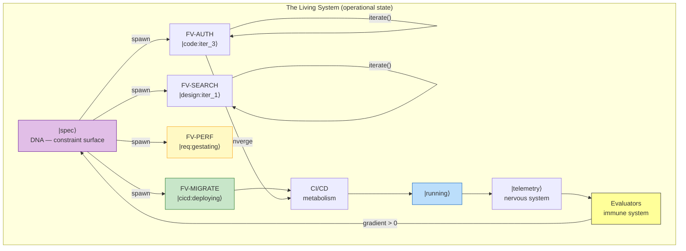

#### 7.6.2 Six Properties of the Living System

The "living" quality is the **emergent behaviour** of the gradient operating at all scales concurrently:

1. **Continuous sensing** — interoceptive and exteroceptive monitors (§4.5) run independently of iterate(), computing `delta(observed, expected)` about internal health and external environment. The system notices even when no one is actively developing
2. **Concurrent vector lifecycles** — many vectors in different phases simultaneously, not a sequential pipeline
3. **Continuous metabolism** — CI/CD runs continuously, not on-demand. The system is always building, testing, deploying
4. **Active perception** — telemetry streams continuously, not sampled. The system is always observing itself
5. **Reflexive self-modification** — spec review (§7.3) operates continuously. The constraint surface is always absorbing signals and spawning responses
6. **Selective pruning** — vectors that are no longer needed (requirement removed, superseded by discovery) are cancelled. The system doesn't just grow; it prunes

No single component creates the living quality. It is the simultaneous operation of all six — sensing, concurrency, metabolism, perception, reflection, pruning — that produces the living system. Each is the gradient operating at a different scale; all scales active simultaneously = alive.

#### 7.6.3 The Markov Boundary as Concurrency Enabler

**The Markov boundary is what makes concurrency possible.** When a feature vector's component converges at an edge (§2.3), it achieves Markov object status: a stable boundary (interface, contract, test suite), conditional independence (usable without knowing construction history), and evaluator-confirmed stability. This boundary is what allows other vectors to depend on the converged asset without coupling to its internals or its construction process.

Without Markov boundaries, concurrent vectors would require global coordination — every vector would need to know the state of every other vector. With Markov boundaries, coordination is local: a vector only needs to know the boundary of assets it depends on, not their internal state or construction history. This is the Markov blanket (#8) made operational at the feature level:

```
FV-AUTH (converged at |code⟩):
    Boundary: AuthService interface, 47 passing tests, REQ-F-AUTH-001 traced
    Inside: 3 classes, 400 lines, OAuth2 implementation
    History: 5 iterations at design, 3 at code, 1 evaluator escalation

FV-SEARCH (in-flight at |design⟩):
    Depends on: AuthService.boundary   ← only the boundary, not the internals
    Does NOT need to know: how AuthService was built, how many iterations it took,
                           what design alternatives were considered
```

The more vectors in flight, the more critical the Markov boundary becomes. In a living system with dozens of concurrent vectors — gestating, iterating, converging, deploying, being observed — the Markov boundary at each convergence point is what prevents combinatorial explosion of coordination. Each converged asset is a stable island that other vectors can build on. The living system is not a monolith; it is an **ecology of Markov objects**, each with a clean boundary, interacting through interfaces, evolving independently within their boundaries, and collectively producing the system's behaviour.

This is the ontology's teleodynamic transition (#49) at full expression: a self-maintaining, self-modifying system that acts on its own behalf, with multiple concurrent processes, continuous energy consumption, and the capacity to observe and direct its own evolution.

### 7.7 Protocol Enforcement Hooks

The iterate protocol (§3) produces mandatory side effects beyond the output asset: event emission (§7.4), feature vector update (§6), STATUS regeneration (§7.4.2), and three-direction gap data (backward, forward, inward). These side effects are **the telemetry** — without them, the methodology loses observability, self-observation, and all derived projections.

Protocol enforcement hooks are the methodology's **reflex arc** — the autonomic nervous system (§4.3, reflex phase). They fire unconditionally at every iteration boundary, verifying that mandatory side effects occurred. Like biological reflexes, they require no deliberation: the check is deterministic (did the event get emitted? yes/no), the response is automatic (block or allow), and the circuit breaker prevents runaway loops. The agent's affect triage and conscious processing (classification, evaluation, gap analysis) run freely; the reflex system ensures the bookkeeping happens regardless of how the higher phases chose to work.

Dogfooding observation: in test05 (CDME v2.3), the agent bypassed the iterate protocol for 3 of 4 edges to optimize for generation speed. Result: high-quality artifacts but only 1 event in events.jsonl (vs 5 expected), stale feature vector, no STATUS.md, no process gap data. The methodology's observability benefits evaporated because the side effects were optional.

**Protocol enforcement hooks** make the side effects mandatory. They are a **deterministic evaluator of the iterate protocol itself** — the same pattern the methodology uses for artifacts (§4.1), applied reflexively to its own operation.

#### 7.7.1 Hook Architecture

```
UserPromptSubmit ──→ detect /aisdlc-iterate, record edge context
         │
    (agent works — free to generate however it chooses)
         │
Stop ──→ check: were mandatory side effects completed?
         │
    ┌────┴────┐
    No        Yes
    │         │
  block     allow
  (reason)  (clean up, exit 0)
    │
    ▼
  agent completes
  missing side effects
    │
Stop (2nd) ──→ stop_hook_active=true → allow through (circuit breaker)
```

#### 7.7.2 Mandatory Side Effects (What the Hook Checks)

| Check | What it verifies | Gap it prevents |
|-------|-----------------|-----------------|
| **Event emitted** | events.jsonl has at least 1 new line since edge started | Lost observability — no event = no projections |
| **Feature vector updated** | Active feature .yml modified since edge started | Stale lifecycle tracking — downstream edges see wrong state |
| **STATUS.md regenerated** | STATUS.md modified since edge started | No computed projection — Gantt, telemetry, self-reflection missing |
| **Source findings present** | Latest `iteration_completed` event contains `source_findings` array | Backward gap detection skipped — upstream quality signal lost |
| **Process gaps present** | Latest `iteration_completed` event contains `process_gaps` array | Inward gap detection skipped — methodology improvement signal lost |

#### 7.7.3 The Circuit Breaker

The Stop hook uses a `stop_hook_active` flag to prevent infinite regression:

1. **First Stop**: Hook checks side effects. If incomplete, blocks with specific missing items.
2. **Agent resumes**: Completes the missing side effects (or explains why it can't).
3. **Second Stop**: `stop_hook_active=true`. Hook allows through unconditionally, cleans up state files.

This guarantees the agent can always eventually stop — the hook never blocks more than once per edge traversal. If a side effect genuinely cannot be completed (e.g., file permission error), the agent explains on the second attempt and the hook releases.

#### 7.7.4 Separation of Concerns

The hooks enforce **that** the protocol was followed, not **how** the agent generates. This separation is critical:

- The agent retains full freedom in generation strategy (parallel, sequential, multi-agent, etc.)
- The hooks only check the side effects — the observable outputs of the protocol
- The agent can generate a brilliant artifact in any way it chooses, but it cannot stop without the bookkeeping

This mirrors how deterministic tests work for code: the test doesn't care how the function was implemented, only that the interface contract is satisfied.

#### 7.7.5 Ontology Connection

Protocol enforcement hooks are an instance of **evaluator-as-prompter** (#35) applied at the meta-level. The hook computes a delta between the expected protocol state (all side effects complete) and the actual state (which side effects are missing), then emits a constraint signal (block with reason) that drives the next action. This is the same pattern used at every other level:

| Level | Evaluator | What it checks | Delta signal |
|-------|-----------|---------------|-------------|
| Code | Unit test | Function contract | Test failure |
| Feature | UAT | Business requirement | Scenario failure |
| Protocol | Stop hook | Iterate side effects | Block with missing items |
| Methodology | TELEM signal | Graph package quality | New intent for package update |

The hooks are an engine-level primitive (§2.8, Layer 1) — they apply regardless of which graph package or project binding is in use.

---

## 8. Ontology Traceability

### 8.1 Concept Mapping

| Model Element | Ontology Concept | # |
|--------------|-----------------|---|
| Stable asset | Markov object | 7 |
| Asset boundary (interface/schema) | Markov blanket | 8 |
| Asset graph (topology) | Constraint manifold | 9 |
| Admissible edge | Admissible transformation | 5 |
| Iteration function | Local preorder traversal | 15 |
| Constructor (builder) | Constructor | 41 |
| Spec (intent + lineage) | Encoded representation | 40 |
| Context[] (incl. graph topology) | Constraint manifold (local surface) | 9 |
| Evaluator set | Evaluator-as-prompter | 35 |
| Delta (evaluator output) | Intent / delta | 36 |
| Feedback edge | Deviation signal | 44 |
| Convergence | Stability condition | 7 (σ) |
| Candidate (not yet stable) | Pre-Markov iteration state | 15 |
| Feature vector (composite) | Trajectory through constraint manifold | 15 + 9 |
| REQ key | Vector identifier / lineage tag | 44 |
| Task graph | Emergent structure from feature dependencies | 3 (generative principle) |
| Module decomposition | Basis vectors of the build subspace | 9 (constraint manifold, §11.1) |
| Basis projection | Feature vector projected onto minimal module basis — Markov object once converged | 7 (Markov object) + 9 (§11.1 projection) |
| Build schedule (Gantt) | Derived projection of module DAG + feature priority + convergence events | 9, 11 (§7.4.2 derived projection) |
| Protocol enforcement hook | Evaluator-as-prompter applied at meta-level — deterministic check of iterate side effects | 35 (evaluator-as-prompter) |
| Circuit breaker (stop_hook_active) | Finite regression guarantee — evaluator backs off after one cycle | 7 (stability condition) |
| Probabilistic compute | Stochastic expansion | 45 |
| Deterministic compute | Verification contraction | 45 |
| Reflex processing phase (§4.3) | Autonomic sensing — event emission, test execution, protocol hooks, circuit breakers. Fires unconditionally, produces sensory substrate | 49 (teleodynamic — self-maintaining) |
| Affect processing phase (§4.3) | Signal triage — classification by source, severity assessment, urgency weighting, escalation decision. The limbic filter between sensing and deliberation | 49 (teleodynamic — self-regulating) |
| Conscious processing phase (§4.3) | Deliberative evaluation — human + agent judgment, gap assessment, intent generation, spec modification. Only processes what affect escalates | 49 (teleodynamic — self-directing) |
| Running system | Teleodynamic Markov object | 49 |
| Homeostasis (gradient at production scale, §7.2) | Self-maintaining boundary conditions — `delta(running_system, spec) → correction` | 49 |
| Living specification | Living encoding | 46 |
| Hallucination / failure | Probability degeneracy from sparse constraints | 54 |
| Context density | Constraint density | 16 |
| Graph topology as Context | Abiogenesis — encoded structure from practice | 39 |
| Spec/Design boundary | Boundary between encoded representation and constructor | 40, 41 |
| Feature view (cross-artifact) | Observable projection of trajectory state | 15 + 9 |
| Multiple design variants | Superposition of alternative constructions | 45 |
| Constraint dimension | Category of disambiguation at design edge | 16 (constraint density) |
| Engine (Layer 1) | Universal constructor — substrate-independent | 41 |
| Graph Package (Layer 2) | Domain-specific encoded representation | 40 |
| Project Binding (Layer 3) | Instance-specific construction context | 9 (local constraint surface) |
| Event (immutable fact) | Unit of change — discrete constraint network update | 2 (constraint propagation, ontology §10.3) |
| Projection (derived view) | Emergent manifold-level observable | 9 (constraint manifold), 11 (emergence) |
| Event log | Constraint network evolution history | 2 (constraint propagation) |
| TELEM signal (self-observation) | Methodology as self-observing Markov object | 35, 49 |
| Methodology self-maintenance | Teleodynamic status — system maintains own specification | 49 |
| Spec as absorbing boundary | Living encoding as reference frame — all signals converge, all vectors radiate | 46, 9 |
| Spec review / gradient at spec scale (§7.3) | Stateless gradient check: `delta(workspace, spec) → intents` — spec updates from experience, updates event-logged and observable. Spans reflex → affect → conscious phases | 49, 46 |
| Affect triage (signal filter) | Limbic processing — classification, severity weighting, escalation decision. Necessary filter between reflex sensing and conscious deliberation | 49 (teleodynamic — self-regulating) |
| Interoception (self-sensing, §4.5.1) | Continuous self-observation — event freshness, test health, vector stalls, build health, spec/code drift. Runs independently of iterate() | 49 (teleodynamic — self-maintaining), 44 (deviation signal) |
| Exteroception (environment-sensing, §4.5.2) | Continuous environment scanning — dependency ecosystem, CVE feeds, runtime telemetry, user feedback, API changes | 49 (teleodynamic — self-maintaining), 44 (deviation signal) |
| Intent event (first-class) | Classified deviation signal with causal chain — trigger, delta, signal source, spawned vectors | 36, 44 |
| Spec change event | Event-logged self-model modification — what changed, why, trace to triggering intent | 46 (living encoding), 2 (constraint propagation) |
| Prior intents (causal chain) | Reflexive traceability — system detects consequences of its own modifications | 44 (feedback), 49 (self-maintaining) |
| Total intentional state | Superposition of all in-flight vectors — system's response to everything it knows | 45 (stochastic expansion, §11.1) |
| Hamiltonian shift (spec update) | Potential energy landscape redefined by spec change — ground states move. Formal expression of the gradient (§7.1) | 46 (living encoding, §11.2) |
| Progressive gradient activation | Abiogenesis → gradient at system scale → gradient at spec scale (emergent from composition, not distinct phases) | 39, 49, 46 |
| Living system (operational) | Concurrent vector lifecycles + continuous metabolism + active perception + reflexive self-modification + selective pruning | 49 (teleodynamic, full expression) |
| Metabolism (CI/CD loop) | Continuous transformation — energy consumed to maintain the system | 49 (self-maintaining) |
| Vector spawning (reproduction) | New vectors born from intent events — system creates directed actions from observation | 36, 44 |
| Vector cancellation (apoptosis) | Basis dimension collapses when requirement removed — vectors pruned | 9 (manifold topology change, §11.1) |
| Concurrent vector lifecycles (cell cycle) | Many vectors in different phases simultaneously — gestating, iterating, converged, deployed, observed | 45 (superposition) |

### 8.2 The Construction Pattern

The methodology is a direct instantiation of concept #38:

| Pattern Element | In the Ontology | In the SDLC |
|----------------|----------------|-------------|
| Encoded representation | DNA, constitution, prompt | Spec + Context[] (incl. graph topology) |
| Constructor | Ribosome, institution, attention mechanism | iterate() — LLM agent, human, compiler |
| Constructed structure | Protein, law, output | Stable vector component (Markov object) |
| Selection pressure | Predators, regulators, environment | Evaluators (Human, Agent, Tests) |
| Deviation signal | Mutation, amendment, feedback | Evaluator delta → Spec update |

### 8.3 The Abiogenesis Sequence

The methodology follows the abiogenesis pattern (#39) at two levels:

**Level 1: Graph topology construction**
1. Practitioners work in a domain (software, law, science)
2. Patterns crystallise: "we always need X before Y"
3. The graph topology is encoded
4. The graph now drives construction

**Level 2: Feature construction within the graph**
1. Business need, technical limitation, user pain
2. Developers experiment, building against the graph
3. Specifications, test suites, architecture crystallise from practice
4. Formal specifications direct the build; AI agents read specs to construct components
5. Runtime telemetry updates the specification; the system becomes self-maintaining

---

## 9. Relationship to Prior Model

### 9.1 What Changes

| Prior Model (v1.x) | Asset Graph Model (v2.x) |
|--------------------|-----------------------|
| 7 sequential stages | Directed cyclic graph of asset types with admissible transitions |
| Features travel through a pipeline | Features are composite vectors — trajectories through the graph |
| Stage-specific agents | Universal iteration function, parameterised per edge |
| Linear pipeline | Cyclic graph with feedback edges |
| Fixed graph topology | Graph is domain-constructed, zoomable, lives in Context[] |
| Stops at UAT | Full lifecycle: CI/CD → Telemetry → Homeostasis → New Intent |
| Requirements as documents | Spec as living encoding, continuously updated from runtime |
| Tasks planned top-down | Tasks emerge from feature decomposition and dependency compression |
| Traceability as tagging | Traceability as composite vector coherence (REQ key = vector ID) |
| UAT as a gate | UAT as scale-dependent assurance — explicit asset or inherent evaluator depending on zoom |

### 9.2 What Is Preserved

- **REQ key system** — now understood as composite vector identifiers (trajectory tags)
- **TDD workflow** — iteration pattern at the |code⟩ → |unit_tests⟩ edge
- **BDD scenarios** — iteration pattern at the |design⟩ → |uat_tests⟩ edge
- **Key Principles** — constraints within Context[] that bound construction
- **Requirement traceability** — now formalised as intent lineage carried in each asset
- **Two compute regimes** — probabilistic (LLM generation) + deterministic (test verification)
- **Feedback loops** — first-class graph edges

### 9.3 What Is Added

- **Composite vectors** — features are trajectories through the graph, not pipeline travellers
- **Zoomable graph** — granularity is a choice; any edge expandable into sub-graph, any sub-graph collapsible
- **Scale-dependent assurance** — UAT:product :: unit tests:module — same pattern at different scales
- **Domain-constructed graphs** — topology is Context[], not universal
- **Graph abiogenesis** — graph topology itself follows the construction pattern
- **CI/CD, Telemetry, Homeostasis** — as graph assets, not afterthoughts
- **Formal ontology grounding** — every element traceable to constraint-emergence concepts
- **Spec/Design boundary** — WHAT (tech-agnostic) vs HOW (tech-bound), one spec many designs
- **Feature lineage in telemetry** — REQ keys in logs/metrics/traces, observable at runtime
- **Feature views** — cross-artifact status per REQ key, generated by grepping tag format
- **Multiple implementations** — same spec, different designs, telemetry-driven variant selection
- **Constraint dimension taxonomy** — mandatory disambiguation categories at the design edge (ecosystem, security, deployment, ...)
- **Three-layer architecture** — Engine (universal) / Graph Package (domain-specific) / Project Binding (instance-specific)
- **Event sourcing execution model** — immutable events, derived projections (STATUS, feature vectors, task lists)
- **Methodology self-observation** — TELEM signals feed back into graph package evolution
- **Gradient at every scale** — one operation `delta(state, constraints) → work` from single iteration through spec review; all signals converge on spec and radiate as new/modified feature vectors
- **Intent events as first-class objects** — classified deviation signals with full causal chain (trigger, delta, signal source, vector type, prior intents)
- **Spec change events** — event-logged self-model modifications with traceability to triggering intent
- **Hamiltonian dynamics** — spec updates shift the potential energy landscape; former ground states become excited states under new constraints (formal expression of the gradient)
- **Living system** — when operational, the gradient at all scales simultaneously: concurrent vector lifecycles + CI/CD metabolism + telemetry perception + reflexive spec evolution + selective pruning = ecology of Markov objects
- **Markov boundaries as concurrency enabler** — converged assets interact through boundaries, not internals, preventing combinatorial coordination explosion across concurrent vectors

---

## 10. Summary

The AI SDLC is:

1. An **asset graph** — a directed cyclic graph of typed assets with admissible transitions (zoomable)
2. With a **universal iteration function** — the only operation, converging each edge until evaluators pass
3. Traced by **feature vectors** — composite vectors (trajectories through the graph), identified by REQ keys
4. Bounded by **Spec + Context[]** — the constraint surface (including the graph topology itself) that prevents degeneracy
5. Evaluated by **{Human, Agent, Tests}** — composable convergence criteria per edge
6. Operating in **three processing phases** — reflex (autonomic: event emission, test execution, protocol hooks, circuit breakers — sensing without deliberation), affect (limbic: signal classification, severity assessment, urgency weighting, escalation decision — triage that filters what reaches consciousness), and conscious (deliberative: human + agent evaluators, judgment, intent generation, spec modification — only processes what affect escalates). Each phase enables the next: reflexes produce the sensory substrate, affect triages it, consciousness directs from what survives triage.
7. Split at a **Spec/Design boundary** — Spec = WHAT (tech-agnostic), Design = HOW (tech-bound). Constraint dimensions define what design must resolve.
8. Observable via **feature views** — REQ keys grepped across all artifacts produce per-feature status at any time
9. Completing the **full lifecycle** — through CI/CD, Telemetry (tagged with REQ keys), Homeostasis, and back to Intent
10. Packaged in **three layers** — Engine (universal primitives) / Graph Package (domain-specific topology + edge configs + constraint dimensions) / Project Binding (instance-specific constraints + context URIs)
11. Executed via **event sourcing** — immutable events, all state (STATUS, feature vectors, tasks) as derived projections
12. **Self-observing** — TELEM signals from methodology runs feed back into graph package evolution
13. **Protocol-enforced** — hooks verify iterate() side effects (event emission, feature vector, STATUS) before allowing the agent to stop. Circuit breaker prevents infinite regression. The hooks are the deterministic evaluator of the protocol itself — the reflex phase (§4.3) of the methodology's autonomic nervous system.
14. **Gradient at every scale** — one computation, `delta(state, constraints) → work`, applied from single iteration through edge convergence, feature traversal, production homeostasis, spec review, and constraint surface update. The spec is the constraint surface: all signals (gaps, discoveries, ecosystem evolution, optimisation, user feedback, methodology self-observation) converge on the spec and radiate outward as new or modified feature vectors. Spec changes are event-logged, making the system's self-modification observable and traceable. Intent events carry full causal chains (trigger, delta, signal source, prior intents), enabling the system to detect the consequences of its own modifications. No new primitive is required — complexity emerges from the same gradient operating at progressively larger scales.
15. **Continuously sensing** — interoceptive monitors (§4.5.1) observe the system's own health (test staleness, vector stalls, build failures, coverage drift, spec/code drift) while exteroceptive monitors (§4.5.2) observe the external environment (dependency updates, CVE feeds, runtime telemetry, user feedback, API changes). Both run independently of iterate() — the system notices threats and decay even when no one is actively developing.
16. **Alive** — when operational, the gradient active at all scales simultaneously produces the structural properties of a living organism: continuous sensing (interoception + exteroception), many feature vectors in concurrent lifecycle stages (gestating, iterating, converging, deploying, being observed), continuous metabolism (CI/CD), active perception (telemetry), reflexive self-modification (gradient at spec scale), selective pruning (vector cancellation when requirements removed). The Markov boundary (§2.3) at each converged asset is what makes concurrency tractable — vectors interact through boundaries, not internals, preventing combinatorial coordination explosion. The system is an ecology of Markov objects.

The graph is not universal — it is domain-constructed via abiogenesis (#39). The SDLC graph is one crystallisation. A legal document, a physics paper, an organisational policy each produce different graphs from the same four primitives. The graph is zoomable: any edge expandable into a sub-graph, any sub-graph collapsible into a single edge.

The methodology is an instantiation of the constraint-emergence ontology's information-driven construction pattern (#38), with the iteration function as local preorder traversal (#15) on the constraint manifold (#9), producing stable Markov objects (#7) that become constraints for the next construction, closing the feedback loop (#44) through runtime observation, and achieving self-maintaining teleodynamic status (#49) when the specification becomes a living encoding (#46) updated from production experience. The execution model is event sourcing — each methodology action produces an immutable event; all observable state is a projection of the event history. The methodology observes itself through the same evaluator pattern it uses for artifacts. One gradient — `delta(state, constraints) → work` — operates at every scale: single iteration, edge convergence, feature traversal, production homeostasis, spec review, constraint surface update. The spec is the constraint surface — all signals converge on it, all directed action radiates from it, and its own modifications are event-logged, enabling the system to detect the consequences of its own changes. Two sensory systems — interoception (self-sensing) and exteroception (environment-sensing) — run continuously and independently of iterate(), feeding signals through the three processing phases (reflex → affect → conscious). When operational, the gradient active at all scales simultaneously produces a living system: continuous sensing, many concurrent feature vectors at different lifecycle stages, continuous CI/CD metabolism, active telemetry perception, reflexive spec evolution, selective vector pruning — an ecology of Markov objects interacting through boundaries, collectively producing a self-maintaining, self-directing system.

Four primitives. One operation. Three layers. The rest is parameterisation — including the graph itself.

---

## 11. Feature Vectors as Hilbert Space

> **Note**: This section describes structure discovered in the SDLC instantiation that should propagate back to the parent ontology as a new concept: **cost dynamics on constraint manifolds**.

### 11.1 The Vector Space

Feature vectors form a Hilbert space whose basis is the set of asset types:

| Hilbert space concept | Feature vector interpretation |
|---|---|
| **Basis** | Asset types — the node types defined by the graph (including module-level when zoomed in). **The spec defines which basis vectors are active** — adding a requirement adds a dimension; removing one collapses it |
| **Vectors** | Composite features: F = Σ |asset_type_i⟩ — trajectories through the graph. More precisely: the system's **directed responses** to all signals absorbed by the spec |
| **Inner product** | Feature overlap — shared modules at the build decomposition level (§6.7). Features sharing many modules have high inner product and must coordinate; features sharing none are orthogonal |
| **Orthogonality** | Independent features — zero shared modules, fully parallelisable. Each can run as an independent basis projection |
| **Basis decomposition** | Atomic features — irreducible single-edge trajectories. Basis projections are near-atomic: minimal module sets for one feature |
| **Norm** | Vector cost — sum of iteration effort across all components |
| **Projection** | Basis projection — projecting a feature vector onto its minimal module basis (§6.7). Task batching — grouping features that share modules |
| **Superposition** | The system's **total intentional state** — all features/basis projections in-flight, components not yet converged. Represents everything the system is currently doing in response to everything it knows |
| **Measurement/collapse** | Evaluator convergence — basis projection converges to stable Markov object. Once converged, it has a definite boundary and downstream work can depend on it without knowing its construction history |
| **Basis change** | Spec update via gradient at spec scale (§7.3) — the spec absorbs a signal and the vector space itself transforms. New dimensions appear (new requirements), old dimensions shift (updated constraints), existing vectors acquire potential energy under the new basis |

The two compute regimes (#45) map directly:

- **Probabilistic compute** (LLM) = exploration of the Hilbert space — superposition of possible constructions
- **Deterministic Tests** = measurement — projection onto eigenstate, collapse to pass/fail

### 11.2 The Hamiltonian: Cost and Effort

The **Hamiltonian** H is the operator governing evolution (effort/cost) on the feature vector space. This is the formal expression of the gradient (§7.1) — `delta(state, constraints) → work` — cast in the language of physics:

```
H(edge) = T(iteration_cost) + V(constraint_delta)
```

| Hamiltonian concept | Asset graph interpretation |
|---|---|
| **H (total energy)** | Total effort/cost of the system |
| **Kinetic energy T** | Iteration cost — compute, human time per cycle |
| **Potential energy V** | Constraint difficulty — evaluator delta from convergence |
| **Ground state** | Minimal-effort solution satisfying all constraints |
| **Excited states** | Over-engineered solutions (more energy than necessary) |
| **Energy conservation** | Budget constraint — total effort bounded |
| **Eigenvalues** | Stable cost points — converged components have definite effort |

- **T** scales with: evaluator type (human expensive, tests cheap, LLM moderate) and iteration count
- **V** scales with: constraint density (#16) — sparse constraints = high potential (hard to converge), dense constraints = low potential (well-defined problem)

Feature vector total cost:

```
Cost(feature) = Σ H(edge) for each component projection
```

#### 11.2.1 Hamiltonian Shift Under Spec Update

When the gradient at spec scale (§7.3) updates the spec, the Hamiltonian **shifts** — the potential energy landscape is redefined:

```
H_old = T + V(constraint_delta | spec_old)
H_new = T + V(constraint_delta | spec_new)

For a converged asset at ground state under H_old:
  V_old(asset) ≈ 0    (was at ground state)
  V_new(asset) > 0     (constraint delta under new spec)
```

The asset "wants to move" — it has acquired potential energy because the constraints changed around it. A Scala 2.13 codebase that was at ground state (all evaluators pass, all constraints satisfied) becomes an excited state when the spec absorbs the ecosystem signal "Scala 3.x is now standard." The migration feature vector spawned by the intent event is the system's response to this potential energy.

| Spec update type | Hamiltonian effect | System response |
|---|---|---|
| New requirement added | New dimension in V — existing assets don't cover it | Spawn feature vector in new dimension |
| Constraint tightened (e.g., performance) | V increases for assets near the old bound | Spawn optimisation vector |
| Ecosystem shift | V increases for all assets bound to old ecosystem | Spawn migration vector |
| Requirement removed | Dimension collapses — over-engineered assets have excess T | Simplification vector (reduce complexity) |
| Discovery (new capability) | New low-energy path appears | Spawn PoC vector to explore ground state |

The system's total energy budget (§11.2, energy conservation) is finite. Spec updates that raise V across many assets create pressure to re-optimise — the system must find new ground states under the new Hamiltonian. This is relentless optimisation made formal: the gradient at spec scale (§7.3) continuously shifts the energy landscape, and the system continuously spawns vectors to find new minima.

### 11.3 Task Planning as Action Minimisation

Task planning (§6.4) becomes: **minimise the action** over the feature vector space.

- Decompose into basis vectors (atomic single-component features)
- Identify orthogonal subsets (parallel work — zero inner product)
- Project overlapping vectors onto shared components (batching)
- Sequence by dependency constraints
- Optimise: converge the composite vector at minimum total H

Constraint density (#16) is the **metric** on the space — it determines how "far apart" states are and therefore how much effort transitions require. This connects hallucination prevention (§5.2) to cost dynamics: sparse constraints = high-dimensional degeneracy = expensive to converge = high V.

---

## References

- **Constraint-Emergence Ontology** — [github.com/foolishimp/constraint_emergence_ontology](https://github.com/foolishimp/constraint_emergence_ontology) — parent theory. Concept numbers (#N) throughout this document refer to the canonical concept index in that repository.
- **Prior AI SDLC (v1.x)** — tagged `v1.x-final` in this repository. The 7-stage pipeline model this document supersedes.
