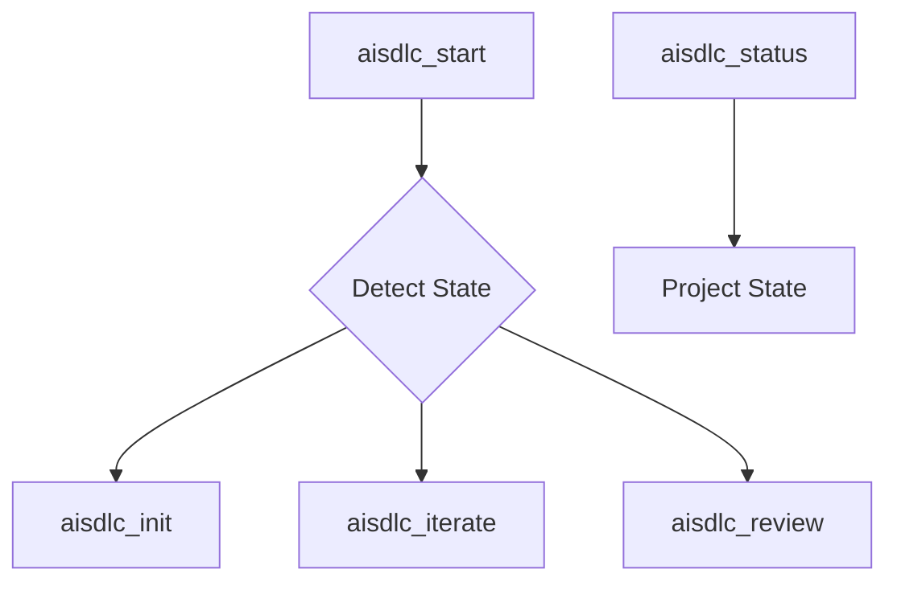

# Requirements: Gemini Tooling Bootstrap

**Version**: 1.0.0
**Date**: 2026-02-21
**Feature**: REQ-F-GEMINI-INIT-001
**Intent**: INT-AISDLC-001

---

## Overview
This document defines the bootstrap requirements for the Gemini Genesis implementation. The primary goal is to establish the "Two-Verb UX" (Start and Status) using Gemini-native agentic capabilities.

## Terminology
*   **State Detection**: The algorithm that classifies the project based on the presence of methodology assets.
*   **Routing**: The logic that maps a project state to a specific methodology command (e.g., iterate, spawn).
*   **Projector**: Logic that materializes shared event-sourced state into local agent workspaces.

## Functional Requirements

### REQ-F-BOOT-001: State Detection Logic
**Priority**: Critical
**Type**: Functional
**Description**: The system must implement an 8-state machine to detect project status from the local `.ai-workspace` and `events.jsonl`.
**Acceptance Criteria**:
- Detection identifies `UNINITIALISED` when `.ai-workspace` is missing.
- Detection identifies `NO_FEATURES` when `features/active/` is empty.
- Detection identifies `STUCK` when delta is unchanged for 3 iterations.
**Traces To**: INT-AISDLC-001

### REQ-F-BOOT-002: Start Orchestration
**Priority**: Critical
**Type**: Functional
**Description**: The `aisdlc_start` tool must route the user to the next actionable step based on detected state.
**Acceptance Criteria**:
- Automatically delegates to `init` if `UNINITIALISED`.
- Automatically selects the "closest-to-complete" feature if `IN_PROGRESS`.
**Traces To**: INT-AISDLC-001

### REQ-F-BOOT-003: Status Situational Awareness
**Priority**: High
**Type**: Functional
**Description**: The `aisdlc_status` tool must provide a "You Are Here" visualization of the Asset Graph.
**Acceptance Criteria**:
- Displays convergence markers (✓, ●, ○, ✗) for active feature trajectories.
- Lists unactioned sensory signals.
**Traces To**: INT-AISDLC-001

## Non-Functional Requirements

### REQ-NFR-PERF-001: Detection Latency
**Priority**: Medium
**Type**: Non-Functional
**Description**: State detection must complete in under 500ms for projects with < 1000 events.
**Acceptance Criteria**:
- Execution time of `status` (base) is within limits.
**Traces To**: INT-AISDLC-001

## Success Criteria
1.  Running `aisdlc_start` in an empty directory correctly prompts for project init.
2.  Running `aisdlc_status` provides a Gantt-style view of active feature vectors.

## Domain Model

