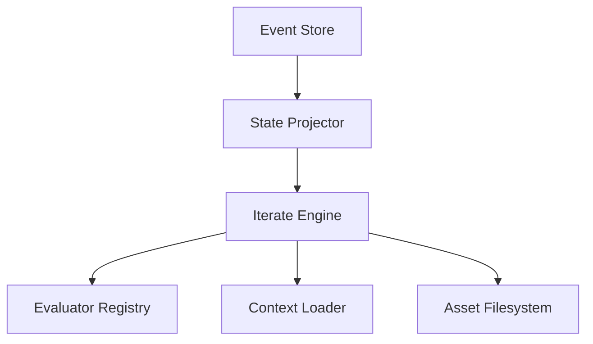
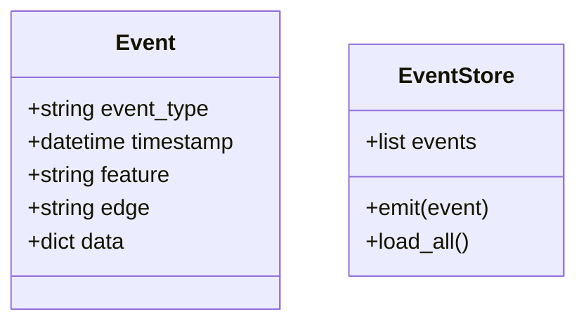

# Design: Asset Graph Engine

**Version**: 1.0.0
**Date**: 2026-02-26
**Implements**: REQ-F-ENGINE-001

---

## Architecture Overview
The Asset Graph Engine is a state machine that manages the lifecycle of methodology assets. It uses event sourcing to derive current state and enforces admissible transitions through a configurable topology.

## Component Design

### Component: EventStore
**Implements**: REQ-GRAPH-002
**Responsibilities**: Append-only log of methodology events. Source of truth for all state transitions.
**Interfaces**: emit(event), load_all()
**Dependencies**: Filesystem (events.jsonl)

### Component: IterateEngine
**Implements**: REQ-ITER-001, REQ-ITER-002
**Responsibilities**: Orchestrates the iteration loop. Executes evaluators against asset candidates.
**Interfaces**: run(asset, context), evaluate_convergence()
**Dependencies**: EventStore, ConfigLoader, FunctorRegistry

### Component: GraphTopology
**Implements**: REQ-GRAPH-001, REQ-GRAPH-002
**Responsibilities**: Defines asset types and admissible transitions.
**Interfaces**: is_admissible(source, target), get_markov_criteria(type)
**Dependencies**: graph_topology.yml

## Data Model

## Traceability Matrix
| REQ Key | Component |
|---------|----------|
| REQ-GRAPH-001 | GraphTopology |
| REQ-GRAPH-002 | EventStore, GraphTopology |
| REQ-GRAPH-003 | IterateEngine |
| REQ-ITER-001 | IterateEngine |
| REQ-ITER-002 | IterateEngine |

## ADR Index
- [ADR-001: Python 3.12 Ecosystem](adrs/ADR-001-python-ecosystem.md)
- [ADR-002: Local Filesystem Storage](adrs/ADR-002-filesystem-storage.md)
- [ADR-003: Simple Event Sourcing](adrs/ADR-003-event-sourcing.md)

## Package/Module Structure
- `gemini_cli.engine`: Core engine and state management
- `gemini_cli.functors`: Evaluator implementations
- `gemini_cli.commands`: CLI command bindings
