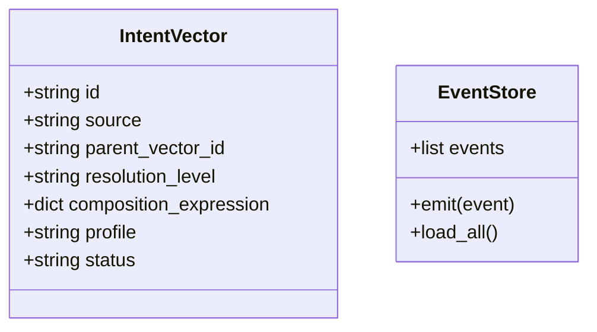

# Design: Asset Graph Engine (Unified Intent Vector Model)

**Version**: 1.1.0
**Date**: 2026-03-08
**Implements**: REQ-F-ENGINE-001, ADR-S-026

--- 

## Architecture Overview
The Asset Graph Engine is a state machine that manages the lifecycle of **Intent Vectors**. It uses event sourcing to derive the current state of the causal DAG and enforces admissible transitions through a **Compositional Topology**.

## Component Design

### Component: IntentEngine (Refactored)
**Implements**: REQ-F-ITER-001, ADR-S-026
**Responsibilities**: Orchestrates the iteration loop for a given `IntentVector`. Loads the bound `composition_expression` and executes its constituent functors.
**Interfaces**: run(vector, context), evaluate_convergence()
**Dependencies**: FunctorRegistry, ContextLoader, EventStore

### Component: VectorRegistry
**Implements**: ADR-S-021, ADR-S-026
**Responsibilities**: Manages the lifecycle and causality of Intent Vectors. Tracks parent-child relationships and resolution levels.
**Interfaces**: create_vector(source, level, composition), get_causal_ancestry(vector_id)

### Component: CompositionCompiler
**Implements**: ADR-S-026
**Responsibilities**: Compiles a composition expression (e.g., `PLAN`, `POC`) into an executable graph fragment. Maps functors to the underlying `EvaluatorFramework`.
**Interfaces**: compile(expression) 	o graph_fragment

## Data Model (Unified Intent Vector)

```mermaid
classDiagram
    class IntentVector {
        +string id
        +string source
        +string parent_vector_id
        +string resolution_level
        +dict composition_expression
        +string profile
        +string status
    }
    class EventStore {
        +list events
        +emit(event)
        +load_all()
    }
```

## Traceability Matrix
| REQ Key | Component |
|---------|----------|
| REQ-GRAPH-001 | VectorRegistry |
| REQ-GRAPH-002 | EventStore, VectorRegistry |
| REQ-ITER-001 | IntentEngine |
| ADR-S-026 | IntentEngine, VectorRegistry, CompositionCompiler |

## ADR Index
- [ADR-019: Unified Intent Vector Model](adrs/ADR-019-unified-intent-vector-model.md)
- [ADR-020: Project Instance Graph (Implementation of ADR-S-021)](adrs/ADR-020-project-instance-graph.md)
