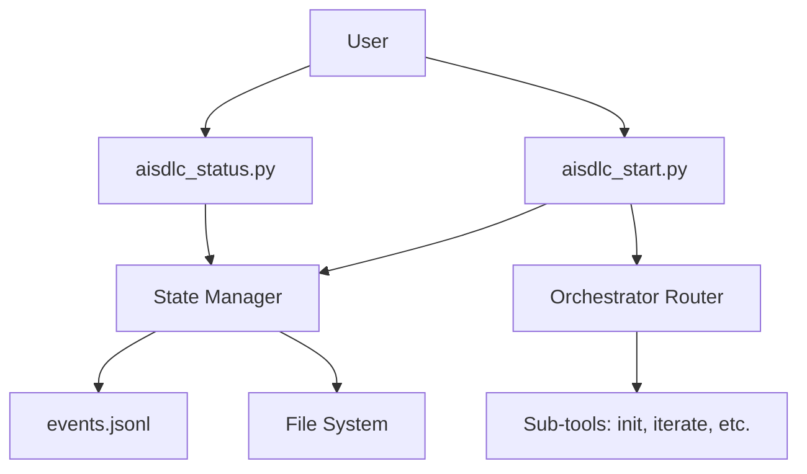

# Design: Gemini Tooling Bootstrap

**Version**: 1.0.0
**Date**: 2026-02-21
**Feature**: REQ-F-GEMINI-INIT-001
**Requirements**: imp_gemini/.ai-workspace/spec/REQUIREMENTS.md

---

## Architecture Overview
The Gemini Genesis bootstrap tools use a state-machine based orchestrator (`start`) and a read-only situational awareness tool (`status`).



## Component Design

### Component: State Manager
**Implements**: REQ-F-BOOT-001
**Responsibilities**:
- Detect the current project state by analyzing `.ai-workspace` and parsing `events.jsonl`.
- Provide a unified API for state queries.
**Interfaces**: `get_current_state() -> ProjectState`
**Dependencies**: `os`, `json`

### Component: Orchestrator Router
**Implements**: REQ-F-BOOT-002
**Responsibilities**:
- Map `ProjectState` to executable logic.
- Manage tool delegation.
**Interfaces**: `execute_next_step()`
**Dependencies**: `State Manager`, `Sub-tools`

### Component: Status Reporter
**Implements**: REQ-F-BOOT-003
**Responsibilities**:
- Generate "You Are Here" visualization.
- Render Mermaid Gantt charts from event history.
**Interfaces**: `render_project_status()`
**Dependencies**: `State Manager`

## Data Model
*   **ProjectState**: Enum (UNINITIALISED, NEEDS_INTENT, NO_FEATURES, IN_PROGRESS, etc.)
*   **Event**: Dict structure matching the canonical schema.

## Traceability Matrix
| Component | REQ Keys |
| :--- | :--- |
| State Manager | REQ-F-BOOT-001 |
| Orchestrator Router | REQ-F-BOOT-002 |
| Status Reporter | REQ-F-BOOT-003 |

## ADR Index
1. [ADR-001: Bootstrap Architecture](adrs/ADR-001-bootstrap-architecture.md)

## Package/Module Structure
```
imp_gemini/
├── code/
│   ├── start.py
│   ├── status.py
│   └── internal/
│       ├── state_machine.py
│       └── projectors.py
```
